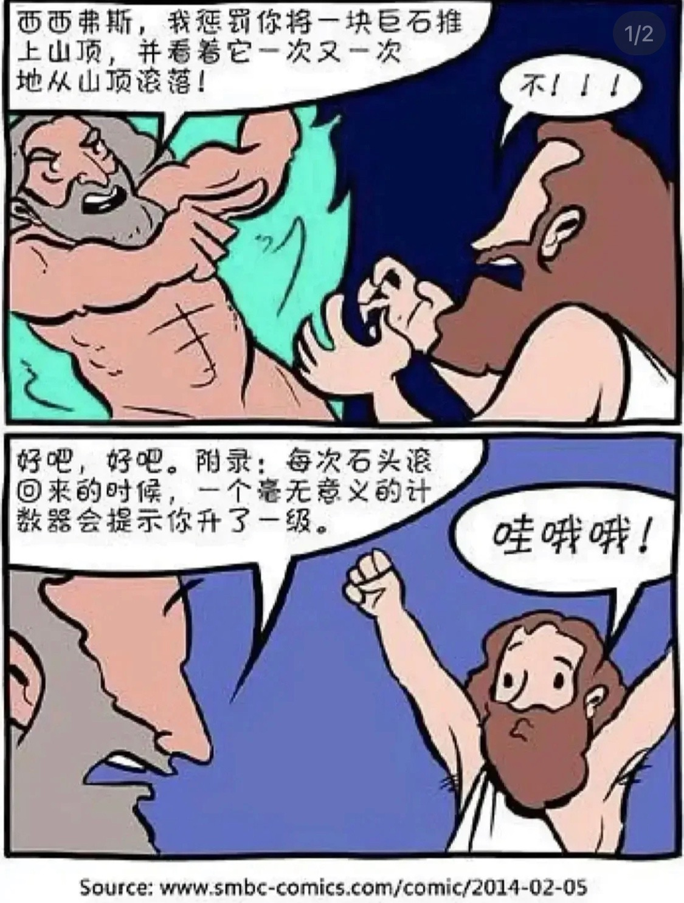
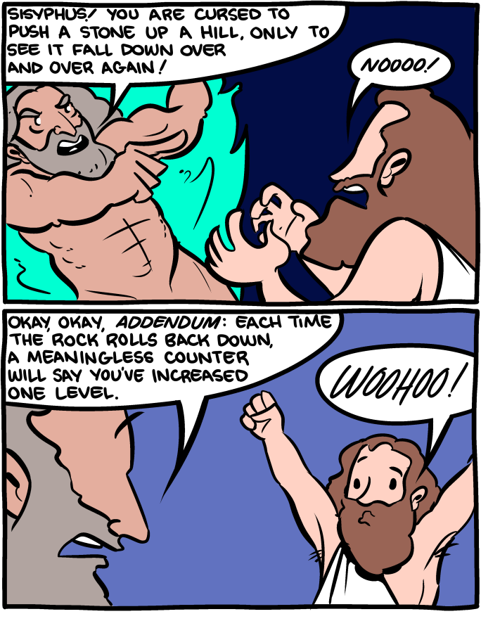

= 时间管理
:toc:
:sectnums:

---

== *时间管理*

==== 不能把一天所有时间都用在忧虑上

**要划出明确的时间段，不能把一天所有时间都用在忧虑上，** 比如你只30分钟来思考未来，其他时间必须留给安心静气的学习英语经济政治数学教程，看书，锻炼上，即要保持日常正常的生活状态。

**因为你即使把24小时都耗在忧虑上，外界的客观事实也不会改变，就毫无意义！所以你花3分钟忧虑和花24小时忧虑，对现状和结果没有任何区别。** 反而你天天24小时的话会失去你正常生活该做的事的全部内容（学习）！

你坐的船，一头在进水，要沉了。你不能把所有时间都耗费在焦虑这件事上。因为这对必然的沉船结果没有任何影响，你阻止不了它。

你必须坐在船的另一头，把你能用上的所有时间来造出另一艘船，然后登上这艘新船，抛弃掉老的沉船，才是你每天必须要做的事！

---

==== ★ 如何获得时间, 提高效率? → 减少伪工作.

提高工作效率，很多人会试图在短时间里完成很多工作，这其实是办不到的.  **唯一能够控制的就是少做一点事情, 提高效率的唯一方式, 就是减少伪工作.  **

**什么是"伪工作"? -- 那些对你"竞争能力"的修炼, 不产生实际效果的事情. ** (你每一天中做的事情, 就是可以划分为两分法: 要么对上岸有帮助, 要么没有帮助)

- 对你和你的企业的竞争能力, 不产生实际效果。
- 那些既不能给公司带来较大收益，又不能给用户带来价值的改进和“升级”的事情，很多是伪工作。

有的人明明能够通过学习一种新技能更有效地工作，却偏偏要守着过去的旧工具工作，甚至手工操作(土法炼钢)，这种人是典型的伪工作者。

如果你想通了很多事情不做其实也无关大体(比如 你做设计时, 不要花太多时间在查看参考画面上, 搜索素材上)，就不要去做它们. 把捡芝麻的时间省下来, 就能用在去捡西瓜上.

任何事情, 需要你去划分优先级(轻重缓急)。战略的"略"是"忽略"，不去忽略，本质是分不清优先级. +
管理上最重要的资源就是领导人时间。*时间的分配，表明了一个领导者对实际情况的优先级判断。*

时间都去哪儿了？反问下自己：

- 时间是如何分配的？
- 构建格局上花了多少时间？
- 信息输入花了多少时间？
- 关键人身上花了多少时间？
- *是不是偶尔想到了，去思考一下，还是变成一种每天的个人习惯？*

经常有同事问我，你天天管公司，介绍新文章，还玩无人机，时间怎么用的？其实很简单。我每天都会想：有哪几个关键的会，关键的人，关键点是什么。

---

"伪工作"对你的危害:

- **浪费你的资源用于正确的目标: 会令你不注重用有限的资源解决重要的问题，而是把大部分时间和精力用于纠结不重要的问题**。

- **浪费你的时间用于正确的目标 : 伪工作(非业务核心工作)做得越多，个人进步就越慢，甚至能力还会倒退。  **

- 让你深陷糟糕生态性质的职业中 : 有些人的10000小时, 都是在从事低层次的重复. 10000小时的努力需要一个积累的效应，第二次的努力要最大限度地复用第一次努力的结果(比如数学)，而不是每一次都从头开始(比如设计)。

---

==== 单机，时间适应玩家。 网游，玩家适应时间。 但不管哪个,游戏里面全是伪工作

单机和网络游戏有着本质的不同：

- 单机，时间适应玩家。
- 网游，玩家适应时间。

这种区别。就像是看片子, 与看直播, 对你"时间控制自由度"的区别。

但不管哪个,游戏里面全是"伪工作".

 +
www.smbc-comics.com/comic/2014-02-05

---

==== 你永远都有更好的事可做. 不要浪费生命，去忍受这些不必忍受的事。

- 金钱不能使你快乐，不要认为你有钱后就一定会快乐。**如果你在致富的过程中没有感到快乐的话，就不要希望你富有之后会快乐起来。**记住，不论你是穷人还是富人，首先要让自己快乐。

- **你永远都有更好的事可做**：不喜欢正在读的这篇知乎帖子？立刻跳开，去读别的。不喜欢正在看的这集节目？转台，去看别的。不喜欢新交的这个朋友？闪人，去认识别人。 +
**不要浪费生命，去忍受这些不必忍受的事。** 忍受完，又浪费生命去抱怨或咒骂。你一定有更好的事可做的。

- 要自爱，**不要把你全身心的爱，灵魂和力量，作为礼物慷慨给予，浪费在不需要和受轻视的地方。** ——夏洛蒂·勃朗特

---

====  把其他的app都删了，只保留你要看的app

- **所有的媒体，**包括知乎上数十万文章，**都在吸引你的注意力，把你的注意力拉偏，偏离你真正该聚集的问题上，让你每天都“失焦”。** 你杀时间的行为，其实是在杀死你自己，因为你已没有时间。**每天失焦，会让你无所得真正对你重要的东西。**你的工作还在天天关注吗？

如果你觉得你必须要看的东西, 永远都缺时间看，那就**把其他的app都删了，只保留你要看的app（知乎职业生态讨论，上岸课程），那你每天就能看完了！不会被其他浪费时间的app拉过去。**

---

- **媒体吸引你越多，你越失焦，忘掉了对自己真正重要的东西。**杀时者被时间所杀。**我们需要聚焦, 而不是失焦!**

---

==== #对"和自己不相干的东西"的好奇心，是浪费你时间的最大罪魁祸首。#

**好奇心杀时间。对和自己不相干的东西的好奇心，是浪费你时间的最大罪魁祸首。**(最深的坑边有最诱人的鲜花铺地.) 比如b站上一切娱乐性内容，不会对你人生改变有任何帮助的东西（如影视杂谈，游戏剧情，八卦等）

好奇心是浪费时间的最大来源，你必须聚集，而非散焦。比如，看历史时，不要被对你没价值意义，而只有好奇想知道感的“兵制”，“地理”，“文化"等带拐走，浪费了你本应聚焦在“人事斗争“，“政治经济外交”这些真正有价值的东西上的时间。

---

1. 把生活的提纲目录拿出来，吃穿住用行，买房看病，保健等等，然后分别填内容进去，和生活方面不相关的方面，无用的娱乐，幻想，八卦类文章，一律跳过阅读，会节省大量时间。

2. 看文章，不要傻傻的从头看到尾, 必须要跳读，跳过大段的水文或与你不相干的内容，直击你要看的"点"(即带着目的去看)，才能在最短时间内，刷完最多文章，获取最多量的收益。

---

==== 只有学会说“不”，你才能集中精力于那些真正重要的事情。

创新来自于对1000件事情说“不”，惟其如此，才能确保我们不误入歧途或白白辛苦。只有学会说“不”，你才能集中精力于那些真正重要的事情。

---

==== 有两种大量吸食你生命时间的事情 : 1.看视频, 和 2.搜图,做图

当你翻一千张图片才找到一张你喜欢的图时，你就是浪费了999张花在找图上的时间，相当于你花了一个小时的时间只最终得到两三张好图。时间就是这么被浪费掉的！

所以, 做设计或艺术创作, 最大的毁人之处之一, 就是在素材收集上浪费了你大量年华.

有两种大量吸食你生命时间的事情： +
-> 一是没有价值的网络视频（抖音，b站等）， +
-> 二是被陷在的不得不做的毫无价值的工作内容（设计），大量时间找图，大量时间做图，毫无思想上的积累价值。

---

==== 短视频内容营销的5个本质固有缺点 -- 浪费时间

短视频内容营销的本质固有缺点：

[cols="1a,3a"]
|===
|Header 1 |Header 2

|1.从视频的本质缺陷来说
|**视频能承载的信息容量太低，** 远远不如文字。**看几分钟视频，只提炼出两句话信息干货，太浪费时间。** 我还不如去看书。你看一辈子内容视频，你能从中学到什么？只会更加大脑白痴。**我记得我看过的书，但我回忆不出我看过的任何短视频。  **

|2.人们平时喜欢看的视频是
|- 我没兴趣看，b站都只看娱乐和有干货的，而非软广告内容短视频，事实上，很多广告都只能植入于其他up主的作品中，作为几秒提示出现 ，而非从头到尾都是广告内容的视频。

- 如果你自己都不会去看，你还去创造以为别人喜欢看，这不是矛盾么！

|3.从"时长"与世人追求的"短平快的刺激性" 矛盾来说
|看视频太花时间，尤其广告内容视频，无论多软，有故事性，但时间摆在那里，需要耐心。现在抖音15秒，人需要快速刺激，直接高潮，而不会容忍慢腾腾的广告内容故事。根本就不会看。

|4.从你平时购物, 决策流程来说, 决策链条从来没有带到过广告内容短视频.
|- 你买的东西，哪个是从看短视频吸引过来的？就算我去看，我也是看的产品评测类视频，比如手机，这就是很硬的广告了，而不是软啪啪的内容广告视频。而且我是目的明确，主动挑选想买的产品的，而不是漫无目的的被动去看别的我不感兴趣的产品的内容短视频广告。

- 可能网红卖货才是更直接的！短视频的功能只能相当于品牌建立，而不是立即促销。

|5.**视频挤占更多时间, 反而导致分配到每天能被看到的视频数量减少, 争夺消费者眼球的竞争更加激烈, ** 品牌两极分化加剧, 10%的头部视频占据90%的眼球. 剩下的长尾没人看.
| 视频不像图片，一秒看完，视频要占用几分钟，但一个人每天的注意力时间是有限的，24小时，所有品牌都在做视频，分配到每个人的注意上，数量会更少。24小时除以1秒，和24小时除以2分钟短视频，后者结果数量会缩小很多。
|===

---

==== 人有5个缺点：1.健忘，2.容易转移注意力，3.缺乏恒心，4.少思，5.还是健忘

人有5个缺点：
1. 健忘 (忘记历史就意味着背叛)，

2. 容易转移注意力 (被短视频等浪费时间)，
 - **刷b站，每天两个小时也过得好快，何不花在看学习视频上呢？** 有什么一个轻松一个沉重的呢？！你看或不看，两个小时都会过去。但每天积少成多，对你的结果就大不相同了。
无论你做不做，生时间总会过去。年龄总会变老.
- 做梦的时候时间过得最快，但是醒来后仍然要面对现实，所以做梦是一种快速浪费时间的自杀。

3. 缺乏恒心 ，

4. 少思 (知乎, 脉脉, 生活地气生态, 看到得太少)，

5. 还是健忘 (忘了前路是怎么来的, 上一个环节是什么)
- 潜移默化就是，你会忘记造成现状的源头原因是什么

---

====  取舍的原则, 就是要围绕最终的目标

米格-25战机, 就是为了拦截美国高空高速轰炸机而设计的, 因此它整个设计方案的所有技术指标, 都是针对XB-70轰炸机，其他功能都变得次要。

---

