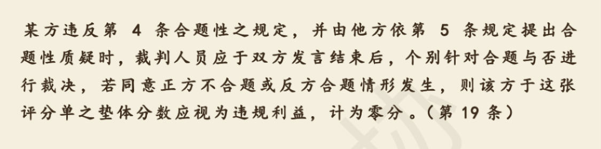

= 数学, 理工类科学
:toc:
:sectnums:
---

== *Math 数学*

==== 法规，条例，甚至教科书，都是被“压缩”格式后的文本, 你必须将它还原成具有逻辑条理（思维导图等）, 方便学习的知识条块.

法规，条例，甚至教科书，都是被“压缩”格式后的文本（相当于去除了所有格式缩进后的网页HTML），你必须将它还原成具有逻辑条理（思维导图等），方便学习的知识条块（如同编辑器中的带有格式缩进的源代码）。

---

==== 生物里最好的学习方式是看动画！因为往往文字讲不清楚太多物质之间的动力学关系

学习生物，人体，有对所有的物质都起了大量的专有名字，它们之间有复杂的系统动力学关系，所以学习生物，本质就是工程学。就像机械学，机器人学，编程语言学一样。它们的背后核心其实都是一样的，-- 系统动力学，正可谓殊途同归。

生物里最好的学习方式是看动画！因为往往文字讲不清楚太多物质之间的动力学关系，而动画就非常直观！看书难解迷惑，几乎都是因为作者文字表达能力太差，或文字表达困难，讲不清楚复杂的事情，动画会一目了然很多！

---

==== ★ 抽象的东西，需要借用日常比喻, 来理解和记忆

**对于很抽象又彼此关系有点复杂的一堆东西，**有如机器机制，**只能通过比喻，投射日常的方式，来理解与记忆，** 否则根本记不住。

虽然一比喻，就会对该事物的真实情形，在认识上可能会造成误导与扭曲，但至少一开始，这些都不重要，因为如果连记都记不住，又何谈以后能慢慢理解到它们的真相呢？

因此远古人只能通过创造神话故事，来记录住对当时的他们而言难以理解的历史真实。可惜在他们那一代人能够理解之前，他们寿命已尽，于是那些真实就永远地消失了，只留下扭曲过的神话。

只能从形象出发，来记住和理解抽象；不能从抽象出发，来理解形象。

---

==== #学"元知识"时, 一定要随时记得"生活中学它们的目的"所在, 才不会有"现实中何用?"感.#

在学元知识(世界观, 数学)时, 可能会暂时想不到学它们的用处, 所以, 在学的时候, 就要不断地将学它们的目的联系起来. 比如:

- 学"世界观"时, 就要随时记得学它的目的, 是用来评判那些所谓"知识付费"中理论的真伪性.
- 学数学(微积分, 概率)时, 就要随时记得学它的目的是为了学金融数学, 经济数学; 基因遗传数学等.

即, **要在"元知识"和"学它们的目的"之间, 反复来回提醒记忆. 才不会觉得自己在学"元知识"时脱离了社会实用性.**

---

