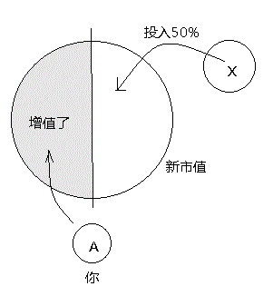

= 04. 理财投资, 收益数学算法, 风险规避, 决策背后数理逻辑
:toc:
:sectnums:

---

== *理财投资*

==== 他们没学会如何让钱为他们努力工作，所以他们就只能自己努力工作，而他们的钱则清闲了。

**你努力工作是有限度的**，而且你辛苦工作能够得到的钱也是有限度的。**我们在一天中所拥的时间是有限的。而有限的时间又固定我们所能挣的钱数。**

大多数人工作了20年，可辛苦之后却仍没留住什么。**他们永远都学不会如何让钱为他们努力工作，所以他们只有一生努力工作，而他们的钱则清闲了。  **

孩子们，这是你们的选择。它也许仅仅是个2小时的游戏 (现金流游戏)，但它的确有可能是你们今后20年里的生活。

---

==== 月供这种东西基本是固定的，增长速度一般是赶不上工资增长速度, 除非你收入下降.

在你的收入能长期保持增长的前提下, 为什么我说越快买房越好? 因为 **月供这种东西基本是固定的，增长速度是赶不上工资增长速度，你觉得现在月供一万很痛苦是吧？你坚持个七八年后，那个时候你的工资会大大高于现在. ** (但其他生活费也涨了呀, 教育, 生病开支, 购物消费娱乐费用等等)

---

==== 小数定律 Law of small numbers 是指：人们倾向于将从大样本中得到的结论, 错误地移植到小样本中的倾向。

**小数定律 Law of small numbers 是指：人们倾向于将从大样本中得到的结论, 错误地移植到小样本中的倾向。**

比如, 人们知道掷硬币的概率是两面各50％ ，于是在连续掷出5个正面之后，就倾向于判断下一次出现反面的几率较大。其实下一次出现反面的概率还是50%。

但其实，每一次试验都是独立的，当样本较小的时候，试验间的数据波动性强是正常的，10个硬币出现9个正面向上是正常的。

这一点已被大量的实验和证券市场上的错误预测所证实。

有两间医院，一间为大医院，一间为小医院，平时新生婴儿占比都为50%。某天医院的新生婴儿中男婴占比为70%，请问更有可能是哪家医院？
回答：小医院. **根据大数定律，样本多的情况下，随机变量对均值的偏离会下降，也就是说, 样本越大，男婴占比应该更接近50%. 由于小医院相较于大医院的婴儿出生数会较少，所以小数波动性更大，更有可能是小医院。**

---

== *数学指标公式 - 投资*

==== 市盈率越低, 说明投资回本的回收期越短. 1.市盈率S＝每股市价P /每股净收益E, 2. 要拿某股票的"市盈率", 与以银行利率折算出来的"标准市盈率", 进行对比。

\begin{align}
\boxed{
市盈率S ＝ \frac{每股市价P}{股净收益E}
}
\end{align}

市盈率:: 就是股票的"市价"与"每股税后收益"（或称"每股税后利润"）的比率。

- 某股票的股价是24元，每股年净收益为0.60元，则该股票的市盈率为24/0.6=40倍。（**市盈率越高，每股收益越低**）

- 一个公司的股票每股利润是1元钱，股票价格现在是10元钱，这支股票的市盈率就是10倍（10/1）.

[cols="2a,3a"]
|===
|性质, 关注重点 |Header 2

|股票的"市盈率"与"股价"(在分子上) 成正比，与"每股净收益"(在分母上) 成反比。
|- **股票的价格(在分子)越高，则"市盈率"越高；而"每股净收益"(在分母上)越高，"市盈率"则越低。**

- 投资股票，在选择股票投资品种时，一般都倾向于投资那种购进成本(即"每股市值")（购买股票所需的价格）较低，而收益（即"每股净收益"）较高的股票。就是 **P（股价）应较低，而E（每股净收益）则应较高，S（市盈率）是越低越好。  **

|以"市盈率"为股票定价，**需要引入一个"标准市盈率"进行对比——也就是以银行利率折算出来的市盈率。**
|- 假设我国目前"一年期定期存款利率" 为2.25％**（投资100元，一年的收益为2.25元），按"市盈率"公式计算：100/2.25（收益）=44.44（倍）**（银行利率越低，"标准市盈率"倍数越高）

**因此，当"股票市盈率"低于"银行利率"折算出的"标准市盈率"，资金就会用于购买股票 (市盈率越低, 说明投资回本的回收期越短)**，反之，则资金流向银行存款。

但在实际中，"股票的市盈率"相差悬殊，并没有向"银行利率"看齐。

|市盈率指标计算, 以公司上一年的盈利水平为依据，不包括对公司未来盈利状况的预测。所以，市盈率指标, 对业绩较稳定的公用事业、商业类公司参考较大，但对业绩不稳定的公司，则易产生判断偏差。
|一些身处夕阳产业的上市公司，目前市盈率低到20倍左右，但公司经营状况不佳，利润呈滑坡趋势，以现价购入，一年后的市盈率可就奇高无比了。

但市盈率高，在一定程度上，也可能反映了投资者对公司增长潜力的认同。
|===

---

==== 人们也用同行业的"市盈率", 来框算（反推）非上市公司的价值

比如, 如果一个非上市的公司税后利润是20元，股票市场上这类公司的市盈率是8倍，于是，这家公司的估值就为160元（20元×8＝160元）。因此，市盈率越高，公司就越值钱；市盈率越低，公司就越便宜。

但千万不要认为，凡是同行业公司，市盈率都是一样的。世界上也没有两个同样的公司，因此，拿"市盈率"框算出来的公司价值，只是一个参考价值，真正的成交价可能会同参考价相差十万八千里！

**企业的价值是讨价还价“砍”出来的。如果按15倍市盈率计算，你的A公司就值30万元（融资后预期将来每年赚2万元 * 15倍市盈率 = 30万元）。X公司要买50%的股份，就应付15万元。**

你的公司 A公司(做餐饮业务), 有净资产5万元，每年赚1万元.
如果你能融资5万元扩大一倍规模，每年就可以赚2万元。现在, 你打算引进一个新股东，一起扩大这个生意。

X公司, 决定收购你的A公司. 谈判开始了，焦点落在你的A公司值多少钱上。

X公司提出，要按股票市场目前饮食行业5倍的平均市盈率，来计算你的公司的价值。那么你的A公司的价值(市值), 就是 融资后预期将来每年赚2万元 * 5倍市盈率 = 10万元.

但你认为, 你的A公司应该按至少15倍市盈率计算.

理由是: 你的直接竞争对手B公司, 已经上市, 其市盈率是12倍(B公司是目前已上市的饮食公司里的佼佼者，因此，它的市盈率自然会高过同行业的平均市盈率).

你认为，扩大规模后的B公司, 盈利能力应该比B公司还好，因此，你的A公司的"市盈率"应该比B公司还要高。至于高多少，你说出了15倍来。

如果按15倍市盈率计算，你的A公司就值30万元（融资后预期将来每年赚2万元 * 15倍市盈率 = 30万元）。X公司要买50%的股份，就应付15万元。

企业的价值是“砍”出来的。

谈判僵持了3个月，双方最终同意按13倍市盈率来计算你公司的价值，X公司用13万元买了你A公司50%的股份。（2万元×13倍=26万，其1/2=13万元）

可是，收购消息公布的当天，X公司的股票没升，反而降了。为什么？因为股民们认为X公司收A公司的价钱贵了. 因为A公司相对于B公司来说, 盈利前景可能不会太好。

请问，X司在这场收购中，是赚钱了？还是亏钱了？

X公司得到了什么? A公司每年利润的50%, 即 1万元的利润收入.
X公司亏了什么? X公司的股东亏钱了，因为他们手中的股票贬值了。

谁赚钱了？你——A公司的原股东，因为你被收购的A公司的净资产(或刚被收购那一刻的市值)增加到26万元. 虽然你现在只有50%股份，可是，你的净资产从原来的5万元增到13万元。

另一种情况: 假如这宗并购交易, 最终妥协的是你. 你同意X公司提出的5倍市盈率来计算你A公司的价值。

A公司的价值 = 将来每年赚2万元 * 5倍市盈率 = 10万元.
X公司就用5万元, 收购了你公司50%的股份。

收购消息公布后，X公司股票上涨了，因为股民认为, X公司公购A公司所支付的价钱，只是同类公司——B公司的40%。

如此一来:

- 导弹公司的股东当然赚钱了(股票涨了么)。
- 但是，A公司的原股东——你，原先独占公司时, 拥有净资产(或此刻股份价值)是5万元, 现在融资后, 你拥有的净资产依然是5万元 (=10万元市值 * 50%), 你辛辛苦苦干了10年，一分钱也没赚到。但更关键是, 你现在只拥有公司50%的控制权啊! 你把公司白白送给了别人一半.  所以, 这个市盈率计算下, 你亏了。

总结:

- 5倍市盈率 * 2万元年利润 = 10万元市值 -> = (你A公司出5万元 + X公司出5万元)

- 13倍市盈率 * 2万元年利润 = 26万元市值

注意: 你A公司出5万元 + X公司出13万元 = 18万, 但A公司的市值却是26万, 也就是说, 你手里5万元的股票, 现在市值是 26 * 50% = 13万元. 你的股票涨了8万元 (价格与价值的相背离). 这8万元就是目前市场股民对你的加成认可! 所以很多互联网企业一上市, 核心层人员就财务自由了. 他们的原始股在市场上增值了!

所以, 企业的价钱(一个企业到底值多少钱?), 是通过买卖双方根据各自的需求，讨价还价“砍”出来的。

---

== *数学指标公式 - 土地市场*

==== 土地溢价率=(竞拍成交价格-土地成本价)/土地成本价×100%。

\begin{align}
\boxed{
土地溢价率= \dfrac{竞拍成交价格-土地成本价}{土地成本价}×100%
}
\end{align}

---

==== 千人购房率: 每一千个城市人口平均发生多少交易

千人购房率:: 每一千个城市人口平均发生多少交易，这些交易是什么样的状况。

相对而言，"千人购房率"变化越小的市场，房价的波动也会更小一些。
