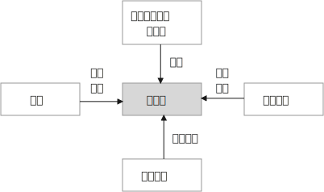

= 写作方法论
:toclevels: 3
:toc:
:sectnums:

---

== 有足够深度的"输入", 才能有"输出"

.把你的主题, 和人的生活中更有价值的东西(人生观,价值观, 世界观,人性矛盾)联系起来.
[%collapsible]
====

[options="autowidth"]
|===
|Header 1 |Header 2

|例如：某高考题: "齐桓公、管仲和鲍叔三人你对哪个感触最深？"
|该思考可以如下: 齐桓公任命管仲，起初遭到了拒绝，齐桓公把他追了回来，这才有了后来的拜相。诸葛亮也是刘备三顾茅庐而来。  +
管仲的传奇故事, 其实就是中国知识分子想要成为的人物, 他们也希望能被"明主识才". 那么从这一点上,  就可以来谈谈中国的“贤臣”梦。 这个平台, 就明显比单纯就管仲这个人"就事论事", 立意要高得多。
|===

怎么从一个现象或者人物, 拎出来一个好主题, 或者找到一个好的角度呢？-- #你想表达的主题，一定要和某个更大价值的东西联系起来。#

-这个更大的东西, 可以是一种情感，比如爱、孤独. +
-可以是一种观念，比如自由、平等 +
-可以是一种对做法的反思: 比如对公共安全的拷问等.

**这些, 都是人活着, 具有重要意义的东西. -- 如同电影编剧一样, 创作的故事, 要反映人性和困境, 才具有现实性意义. 才会在受众中产生共情.**
====

---

.如何找到这个"更大价值"的东西呢？有两种方法: 1.以专业研究中的各种关键词, 作为讨论主题. 2. 因果链追溯法, 一层层往上游追溯, 直到找到一个具有"高价值含金量"的问题点.
[%collapsible]
====

[options="autowidth" cols="1a,1a"]
|===
|Header 1 |Header 2

|1.以专业研究中的各种关键词, 作为讨论主题.
|比如, 谈“散装卫生巾”这个话题.

性别角度:: 男性如何看待这个问题.
政治层面角度:: **可以从"政策"的角度去分析问题点.** 地方政府都出台了一些政策，这些政策, 围绕"经期女性"都提供哪些政策支持? 共同点在哪里, 不同点在哪里? 不足在哪里, 执行难点在哪里? +
由此，我们可以确定一个主题：地方政策当中经期女工的权利保护。

经济层面角度:: **经济学上, 重点考察哪些变量因素呢? -- 价格、税收、贫困、经济福利等.** +
我们先来思考, 为什么会有“散装卫生巾”出现? 对其原因一步步溯源:  +
是为了降低购买成本吗?  -> 为什么太贵? -> 原因之一: 税收高. 在中国, 卫生巾的征用税率是 13%，这是增值税里最高的一档。 -> 为什么税收高? -> 无法降低的原因是什么?   +
这些溯源链条上的一个个问题, 其实就构成了一个明确的主题 : 女性摆脱“月经贫困”的阻力在哪？

文化层面角度:: 同样先思考, 文化研究中, 有哪些常见的关注点.  +
-> 比如"女性主义". 如果从这个点切入的话, 我们就可以从"父权制社会"的角度, 来讨论男权社会下的女性议题困境。 +
-> "文化禁忌"角度, 来讨论 "月经禁忌".

考察他人的关注点视角:: 一个热点事件, 在翻看他人的评论之前, 先思考一下, 你自己能想到几个角度? 然后再去看评论, 看看人家想到了哪些你没想到的角度。这个方法对"扩充你视角范围", 帮助非常大.

|2.因果链追溯法, 一层层往上游追溯, 直到找到一个具有"高价值含金量"的问题点.
|比如, 某高速出口, 老是发生车祸事故.  +
我们来分析这个问题的原因 : 除了常见原因外. 有一个奇怪的现象 : 既然司机知道车辆失控了，为什么很少有车辆主动开进避险车道，避免事故的发生呢？不断去追溯因果链.
|===

====

---

.所谓"独到"，就是指作者看到了一些读者没有注意到的东西.
[%collapsible]
====
在如今这个人人都能成为自媒体的时代, 写作的主题越来越同质化，如果没有一个独到的主题，你写的东西就很难脱颖而出。 +

#所谓独到，就是指作者看到了一些读者没有注意到的东西.# 读者的视线需要经过作者引导, 才能看见。 #即, 读者只能借着你(作者)的智慧和思考，犹如戴上神奇眼睛一样, 他们才能看到新的方面.#
====

---

== 建立起你自己的"价值观和方法论架构树"

.树干(经典的大学专业教材), 树干(专业期刊,行业分析), 树枝(新闻资讯)
[%collapsible]
====

所以, 各领域的专业学识储备, 和阅读量, 一定是能够达到"输出"的首要前提.

那么, 如何更有效率的选书,  来建立起你自己的"价值观和方法论架构树"?  -- 对这三个层次的内容, 要分别对待:

[options="autowidth"]
|===
|Header 1 |Header 2

|树根: 专业理论. -> **要熟读经典作品: 先读基本原理，再读通史**
|**经典作品, 就好比树根，它已经帮你筛选好了最佳的养分。你从它身上得到的投资回报率ROI, 是最高的.** 因为它可以帮助你迅速找到一条基准线，了解这个领域最基本的观点和概念是什么，然后你就能利用这些观点和方法论, 去解读各种社会现象。

别怕经典读起来费劲，如果考虑到最终收益的话，其实这是效率最高的方法。

|树干(即理论动态, 数据, 画像) -> 专业期刊、行业分析报告、政府机构发布的统计数据, 政策信息等.
|要读与"你所写内容", 主题相关的内容 -- 专业期刊、行业新闻、分析报告、政府机构发布的信息等. +
比如, 你想写一篇有关洪水治理的文章，那么你就得块速了解中国治理洪水的历史、手段，利弊, 以及治理过程中的争议。

|枝叶(即零散的故事) -> 主要由资讯,新闻组成。
|我主要关注时局、法治领域的题材，除了把涉及政治、法律的经典作品几乎全读了之外，还花了很多时间在对"枝干"和"枝叶"的了解上.
|===
====

---

.阅读"经典教材"的顺序又是怎样的呢？-> 先读基本原理，再读通史。
[%collapsible]
====
比如政治学, 你就先读迈克尔罗斯金撰写的《政治科学》，这是一本被很多国家的高等院校广泛采用的政治学教科书. +
在此基础上，你可以接触该领域的"通史类"著作，比如政治思想史。

有了这两步的沉淀，就能初步应对我们日常写作了。
====

---

.树根, 要"深度学习"; 树干和树枝, 只需"快速浏览" (5W1H 法)
[%collapsible]
====
不要对所有的材料, 都是一种阅读模式、一个速度! 不同价值的材料, 要不同对待. 阅读也要区分成"深度阅读"和"浏览"两种模式。

[options="autowidth"]
|===
|Header 1 |Header 2

|经典教材, (树根)
|-> 要深度阅读

|剩下的大部分阅读材料
|-> 浏览即可.  +
用 5W1H法, 把那些无关的内容跳过去。
|===
====

---

.带着你自己的目的去学: 先提出自己的问题, 再去书里找答案
[%collapsible]
====
首先, 你要明确自己为什么要去读它? 即你的"初心目的"是什么?  读前先提出你自己的问题:

- **你想解决什么你自己的什么问题? 你希望从书里查到什么回答?**
- 作者他自己想解决什么问题? 这些问题对你重要吗? 和你想要的, 有交集吗?
- 作者在解决问题的过程中, 提到了哪些重要的事实, 数据?
- 作者提到的观点中, 哪些对你有启发, 有价值的?

**把这些问题先写在纸上, 读完书后, 自问自答, 把你得到的收获写下来. ##记住: 一定要翻译成自己的话语, 说出来.##**
====

---

.从阅读中学到的价值观, 方法论, 把它们嫁接, 融合进你自己的"方法论架构树"中
[%collapsible]
====
用这些方法论, 来解释 1. 你曾经的体验和感悟, 2. 正在发生的事. +
即它们的底层逻辑有相通之处. 太阳底下没有新鲜事.
====

---

.能掌控人心理的手段(表达技巧), 也要学习掌握
[%collapsible]
====
操控手段(即表现手法), 就是如何吸引读者的写作技巧, 心理学技巧. 影响力, 这些心理理论的实际应用. +
对于能激起你的某种感受的写作技巧, 把这些感触, 和作者实现它的手段, 都记录下来.
====

---

== 写作表达技巧

.主线(是用一句话概括故事情节), 主题(一定是和一个"更大价值的加东西"联系在一起的. 即该故事表达出的一种人类可贵的精神,价值观.)

[%collapsible]
====

[options="autowidth"]
|===
|Header 1 |主线(情节) |主题(价值观)

|服刑了 26 年的江西“杀人犯”张xx, 被xx省高级人民法院宣告无罪.
|**要用一句话来确定主线。最重要的就是找关键词，这个关键词代表着最能打动你的价值。** +

- 关键词: “污名” +
第一，因为她的前夫是一名“杀人犯”，一定会遭到当地人的说三道四； +
第二，在张服刑期间，她改嫁了，这点在传统农村是很难被人接受的，同样会受到歧视。

- 关键词: “信念”. +
因为尽管自己被污名化，26 年来，张的前妻依然四处奔走，支撑她的一定有一种信念，而这个信念是可以打动人的。

综上分析，我们就可以确定文章的主线了：一名“杀人犯”的前妻，在流言蜚语之下，凭借着某种信念，在长达 26 年的时间里为前夫伸冤，最终成功。

总结来说，**主线就是通过“一句话原则”，先确定价值（找关键词），再高度概括。**

|
|===

====

---

.三段式结构 -- 触发, 冲突, 解决
[%collapsible]
====

[options="autowidth" cols="1a,1a"]
|===
|Header 1 |Header 2

|触发 (导火索/引子)
|例如: "2020 年 6 月 17 日，经过长达 16 个小时的庭上激辩，58 岁的原新城控股董事长王振华涉嫌猥亵 9 岁儿童一案, 最终宣判，王振华一审获刑 5 年。随着王振华案的宣判，备受关注的性侵猥亵未成年话题, 再次回归大众视野。"

这个引子，包含了 3 个基本问题：

1.事件的人物和背景(起源)是什么？:: xx猥亵未成年；
2.事件的最新动态是什么？:: 法院宣判了；
3.这个最新动态, 带来的未来悬念是什么？:: 五年判刑合理吗？

一般来说，这 3 个基本问题，就是一个骨架里“触发”部分应包含的内容。

|冲突(即矛盾)
|人活着, 处处有矛盾.  +
人的内心与现实, 永远处于矛盾冲突中.  +
人与人之间有矛盾.  +
矛盾冲突, 是故事的核心.

以张前妻为夫伸冤故事为例, 这里的冲突就有：

|解决
|从一个不稳定的状态结项, 推向另一个不稳定的状态阶段.

|===

====

---

.开头
[%collapsible%open]
====

====

---

.遣词造句
[%collapsible]
====

[options="autowidth"]
|===
|Header 1 |Header 2

|先确保用词准确(而非词不达意)，再去考率词藻问题
| 反例如: "**寓言**凝聚人类的智慧，闪烁着道义的光华，有聚瑰宝撒珠玑之美，能给人以顿悟般的针砭与启迪。"

这句话的主语, 如果我换一个，比如勇敢: "**勇敢**凝聚人类的智慧，闪烁着道义的光华……" +
发现了吗？完全可以套用。**主要原因就在于这段文字用词模糊、言不及义。**

|切忌内容空洞、用词浮夸
|

|滥用形容词和连词
|- 不仅指使用的adj.不准确，还指堆砌adj.的现象。adj.用得不准确，就会让你觉得矫揉造作。

- 连词用得过多，会影响句子的节奏和美感。 +
如: "清风徐来，水波不兴"，就已经暗含了因果关系. 所以没必要写成"因为清风徐来，所以水波不兴".

|要多用"主谓"句, 少用 adj.+n.形式
|如: "被困在家的日子里，我想起了**去年樱花盛开、游客满园的那天**。" <- 改成"我想起去年**那天樱花盛开、游客满园**" 更好.

|要多用强动词, 少用"弱动词"
| 弱动词（万能动词），是指如“造成”、”进行“这样的动词.

- 陈景润对数学问题**进行了**详细的研究. <- 不如直接写: 陈景润对数学问题详加研究.
|===
====

