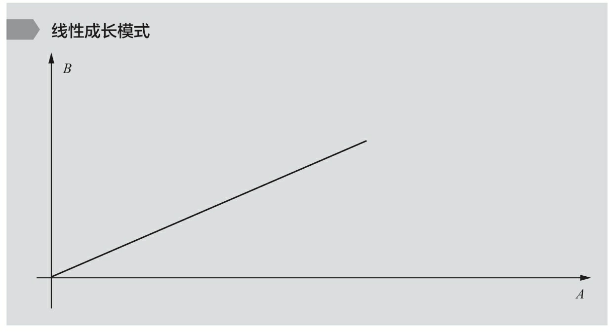
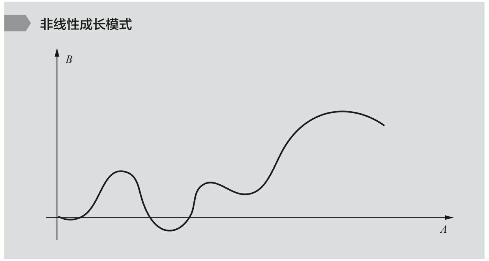
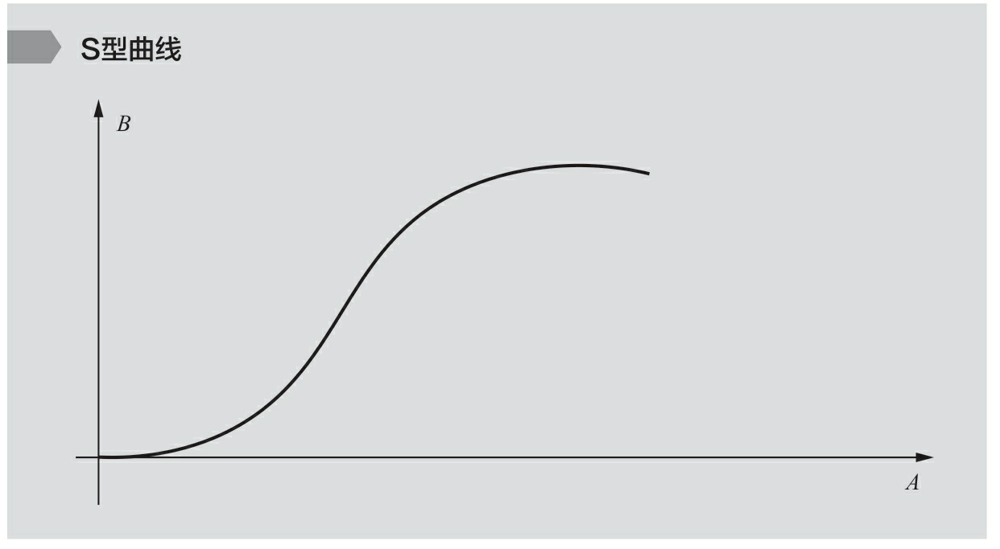
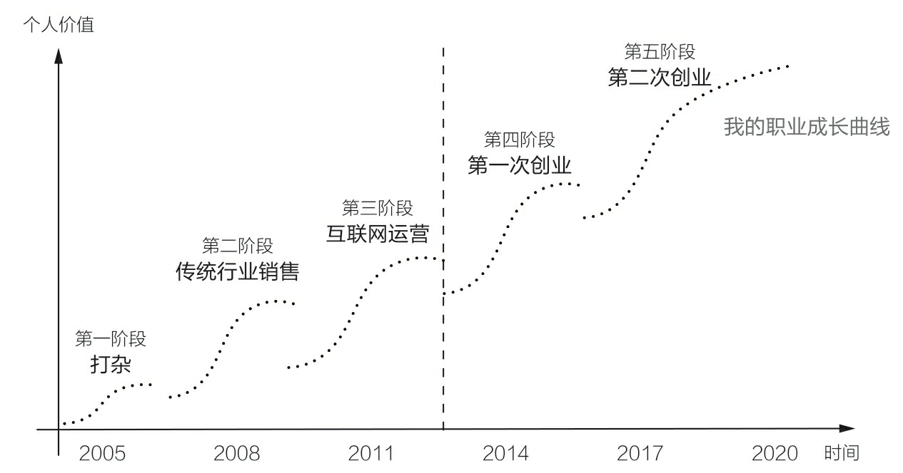

= 非线性成长
:toc:
:sectnums:

---

==

一是“成长”，二是“职业成长”，后者是前者的重要组成部分.

回顾我14年职业生涯，**我的成长似乎只有两种状态："停滞"和"非线性成长"。**要么停滞不前，要么突飞猛进.

解决问题，是创业过程中我所有学习和成长的唯一意义.

我的职业生涯大约分成三个阶段:

[cols="1a,3a"]
|===
|Header 1 |Header 2

|第一阶段：工具人（Handle）
|你可以搞定一件事，像一个手柄、工具一样. +
这时候，*你需要具备一个专业领域的技能，需要掌握一系列技巧(工具包, 方法论, 理论模块)去解决问题。* +
我从产品经理岗位开始，学习产品经理应具备的技能和方法，需要什么，就学习什么。我从来没有问过这样的问题，比如“产品经理需要学习前端代码吗？”

*需要什么，就学什么！你是产品经理, 你的目标就是学习和掌握所有"能解决产品设计, 和管理中遇到的任何问题"的知识和技巧，搞定它！*

|第二阶段：负责人（Owner）。
|她做了4年的产品经理，一直在纠结要不要换岗位. 她说: "我要去做增长、流量..." +
*我认为, 这不是职业的纵向发展，而是岗位的横向平移。这样的岗位平移，大多数时候会让你的成长, 陷入停滞*，至少是非常缓慢。

**你应该果断地“升级”你的职业目标，做业务的负责人，**承担最终的业务结果——“为收入负责，为流量负责，为利润负责……” *总而言之，为最终结果负责，而不是成为其中的一个模块。*

你作为老板身份, 需要什么结果，你就对结果负责！

|第三个阶段：创始人（Founder）
|这些人可能发现了一些社会问题，寻求成立一家公司，通过自己，来解决某一个重大问题。

懂产品、懂商业, 是创始人最基础的要求; 懂组织、懂战略, 也是必须做的事情; 还得学会融资、会公开演讲、会社交…… 以及很多无法预料的挑战，你都要一一接招。 +
*你必须解决所有问题，让公司进入快速发展期.*

*你的公司成功和团队胜利需要什么，我就学习什么！*

卢梭: 好的学习和成长, 应该让人成为他本来的样子。

|===

在整个过程中, 与各行各业的顶尖高手对话、交流，向他们请教，了解他们是如何学习和成长的。
**
我相信，以输出来带动输入, 是最好的学习和成长方式. 写作本身即带来更多思考和深入反思.**

我认为，一个成年人的“成长”，也许会经历如下几个阶段:

[cols="1a,3a"]
|===
|Header 1 |Header 2

|第一个成长阶段
|如何在这个世界上生存，并学会依靠规则去赢得基本竞争。

当任何一个成年人走入职场与社会，必然开始面对各种竞争。**如何在竞争中存活下来，并能洞悉竞争中的各种规则和规律，利用和依赖它们在竞争中获胜，**是绝大多数人的必经之路。 +
在这个阶段，很多人都需要从掌握少数特定技能做起，不断学习和经历多种选择，并逐步让自己在一个领域内站稳脚跟。

|第二个成长阶段
|如何能够看到更大的世界。

打破自身边界，*不断上行去看到更大的世界，了解更多顶尖高手在关注什么、如何思考，以及如何才能成为那样的高手*，而非偏安一隅。

这个阶段的人，*他们的成长会逐渐从"技能", 转向"认知或是系统思考能力得到提升"。他们会开始思考和理解，什么是商业竞争，这个世界遵循怎样的规律运转，不同行业、职业之间的差异在哪里*，以及如何才能在一类问题上, 把各种元素、信息关联起来，*让自己的思考变得更加全面和系统。*

|第三个成长阶段
|如何在看到更大的世界后, 担负起更大的责任，赢得更大的荣耀和认可，创造更大的社会价值。

他选择承担什么样的责任，决定了这个世界会对他拥有怎样的期待和要求，也决定了他将有机会获得怎样的荣耀和认可。
|===

[options="autowidth" cols="1a,1a"]
|===
|Header 1 |Header 2

|线性成长模式

|

其特点: 只要努力改变A，则B就一定会呈现正向或负向的变化。

- 一个环境长期越稳定，"线性法则"在其中就越适用；相反，如
果一个环境变化越快、越频繁，则"非线性法则"越容易在其中起主导作
用。

|非线性成长模式
|

其相信: *任何一个人的成长, 是由很多不同维度的要素来驱动的. 并且个人成长轨迹不太可能呈现为简单的直线上扬的成长模式。*

它意味着另外一种逻辑 ——信奉这个世界是错综复杂的，当我们想要达成一个结果B，除了A之外，还有无数复杂的因素和变量, 会对最终的结果产生影响. 所以, 并不存在你只要做好了A，就一定会得到B。

- 对绝大多数人而言，我们当前所处的这个世界是复杂, 且充斥着“非线性”的，但**“非线性”不等于无序。**找到某些在"非线性的世界中"适用的基本规律和法则，对于我们的成长至关重要。
- 即便世界的本质是"非线性"的，在每一个"非线性系统"内，也存在高度遵循"线性法则"的局部。

|线性成长模式 : S型曲线 (生命周期)
|

每一款成功的产品、一个富有能量的生命，又或者一种能够帮助企业或个人成功的模式，*都有一个特定的生命周期。其从诞生到兴盛，再到衰退的过程，与“S型曲线”高度契合，即不会一直无限地增长下去。*
|===

我的职业成长可以分为如下5个阶段，而每一个阶段，都对应了一条“S型曲线”。这些曲线的斜率有大有小，它们代表了我在相应阶段成长速度的快慢。

过程中的垫脚石

[cols="1a,3a"]
|===
|Header 1 |Header 2

|进入一个行业后 +
↓
|要尽快建立起几项自己在这个行业内的核心技能，它们可以成为你在这个行业成长和发展的基石.

- 我在运营生涯的头两年，基石就是“核心用户的拓展和运营”。

|参与或负责一些涉及多部门协作的复杂项目的推进落地 (能带动你自己成长)
|收获:

1.我对于如何组织和调动一个团队, 面向一个共同的目标努力, 有了更加实际的体验和感受。 +
即 : “团队的组织和管理”以及“复杂项目的推进和管理”, 成为我的两项新技能。

|===

62
