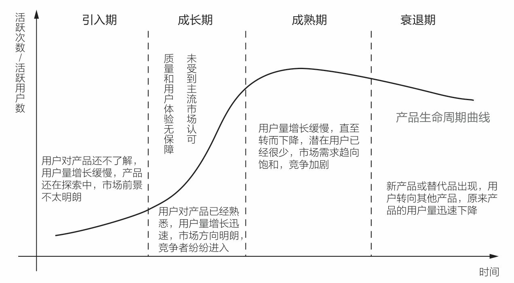
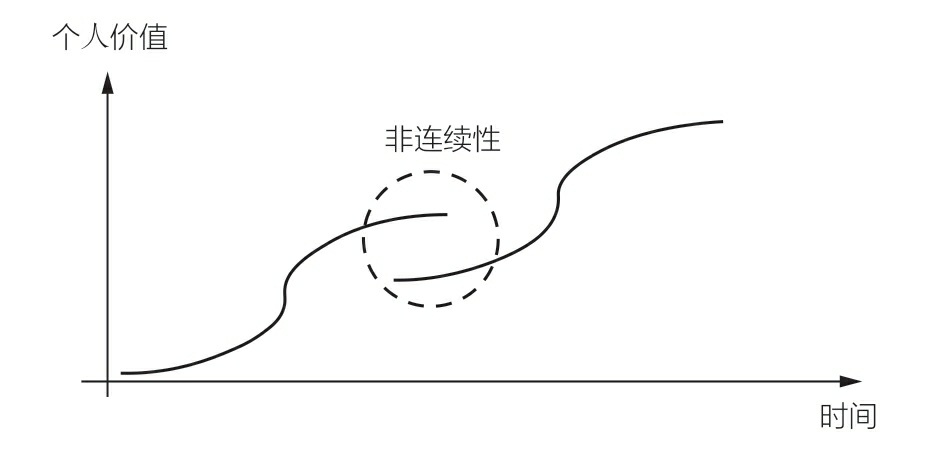
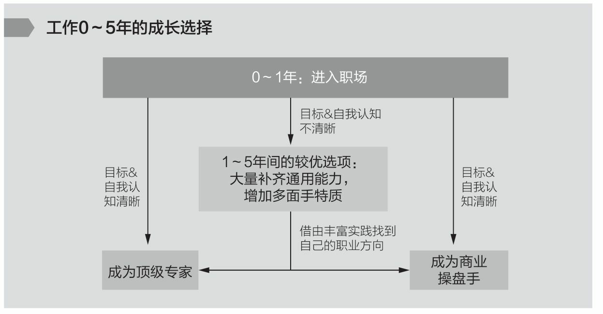
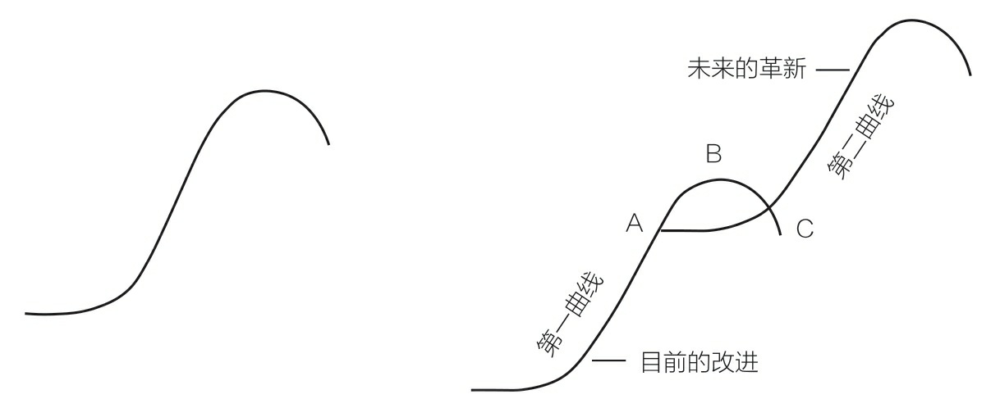
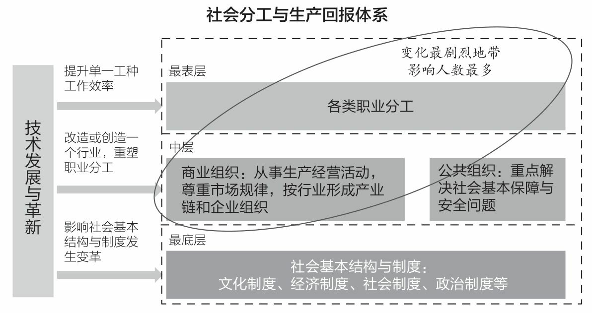

= 非线性成长
:toc:
:sectnums:

---

- 做书籍笔记, 不要啰嗦, 只要提取出解决问题的"思维模型(模块)"即可. 并且画图出模块系统. +
*每个阶段的问题, 有每个阶段的思维模型(解决方法).*

- *以"输出"来带动"输入", 是最好的学习和成长方式. 写作本身即能带来更多思考, 和深入地反思.*

- *不知而为之, 为无知; 知之而为之, 为天真。天真者无邪，但未必无知；无知者无畏，却未必有勇。* -- 无知是没经历过，天真则是经历过后选择放弃。

---

[options="autowidth" cols="1a,1a"]
|===
|Header 1 |Header 2

|人生只有两种状态: 你要么"停滞", 要么"非线性成长"。
|人生有两大目的: 1.成长, 2. 职业成长. 后者是前者的重要组成部分.

|*好的环境, 往往是自带势能的. 能加速你的成长.*
|你所在的环境(你所在的行业、公司、工作内容、接触的圈子人群), 对你的成长很重要.

|创业过程中, 我获得的唯一收获与意义, 就是 -- "解决问题"的方法和思考模式.
|我从外企 -> 互联网 -> 创业, 过程中参与诸多行业，在不断切换赛道, 和自我升级的过程中，渐渐赢得了远超其他同龄人的成长加速度.

|===

---

== 成长

==== 人的成长经历, 会有如下三个阶段

我的职业生涯可分成三个阶段:

[options="autowidth" cols="1a,1a"]
|===
|Header 1 |Header 2

|第一阶段：工具人（Handle）
|- 你可以搞定一件事，像一个手柄、工具一样. +
这个阶段,你需要掌握全一个专业领域的技能，*掌握一系列技巧(工具包, 方法论, 理论模块)去解决问题。*
- 我做产品经理阶段, **我需要什么，就学习什么。**我从来没有问过如“产品经理需要学习前端代码吗？” 你主导产品, 那你遇到的任何问题, 就学习相关知识和技巧，搞定它! 即 -- 需要什么，就学什么！

- 进入一个行业后, 要尽快建立起几项自己在这个行业内的核心技能，它们可以成为你之后发展的"垫脚石".  +
我在做运营阶段的头两年，基石就是“核心用户的拓展和运营”。

|第二阶段：负责人（Owner）
|- a做了4年的产品经理，一直在纠结要不要换岗 :"我要去做增长、流量..." . 我认为, 这不是职业的纵向发展，而是岗位的横向平移。这种平移大多数时候会让你的成长, 陷入停滞. +
你应该果断升级做业务的负责人, *为最终结果(收入, 利润, 流量)负责，而不是成为其中的一个模块。*

- 为了能更快带动你的成长, 要寻求参与或负责一些涉及多部门协作的 复杂项目的推进落地. +

-> 我对于"如何组织和调动一个团队, 面向一个共同的目标努力", 有了更加实际的体验和感受。 +

-> *在整个项目的推进中，我得以接触到很多此前我接触不到的工作内容和信息。* 我要跟PR部门一起讨论面向媒体的传播策略，这个过程中我就对PR的工作有了更多具体的了解.  +
在这些项目推进的过程中，我慢慢接触了解到更多有价值的信息，*并找到了更多“连点成线”的感觉*—— 一家互联网公司的运作，从最早的毫无概念，到此时在我脑海中慢慢变得立体了。

此后几年内，我继续不断参与甚至独立负责一些复杂的项目。
在这些过程中，我慢慢接触并知晓了推广怎么做、如何与其他公司洽谈商务合作、事件传播如何设计和落地、产品架构是什么、研发的工作方法和流程、如何从内容出发做好品牌的公关等一系列事情。

- 整个项目从前到后，大部分重要成绩和发展，都与我有紧密的关系——这也成为我自信的来源。

|第三阶段：创始人（Founder）
|- 这些人可能发现了一些社会问题，因而成立一家公司，通过自己，来解决某一个重大问题。
- *你的公司成功需要什么，你就学习什么！*  懂产品、懂商业, 是创始人最基础的要求; 懂组织、懂战略, 也是必须做的事情; 还得学会融资、会公开演讲、会社交…… 以及很多无法预料的挑战，你都要一一接招。 你必须解决所有问题，让公司进入快速发展期.

- 在整个过程中, 与各行各业的顶尖高手对话、交流，了解他们是如何学习和成长的。
- 卢梭: 好的学习和成长, 应该让人成为他本来的样子。

|===

人的成长, 会经历如下几个阶段:

[options="autowidth" cols="1a,1a"]
|===
|Header 1 |Header 2

|step 1
|如何在这个世界上生存，洞悉竞争中的各种规则和规律，并学会利用规则去赢得基本竞争。

|step 2
|不断上行去看到更大的世界，了解更多顶尖高手在关注什么、如何思考，及如何才能成为那样的高手.

从"技能" 转向"认知与系统思考能力"的提升。他们会开始思考和理解，什么是商业竞争? 这个世界遵循怎样的规律运转? 不同行业、职业之间的差异在哪里?

|step3
|如何在看到更大的世界后, 担负起更大的责任，创造更大的社会价值。 +
你选择承担什么样的责任，决定了这个世界会对你拥有怎样的期待和要求，也决定了你将有机会获得怎样的荣耀和认可。
|===

---

==== 成长模式 : 线性 & 非线性(S形), 第二, 三,n曲线

[options="autowidth" cols="1a,1a"]
|===
|Header 1 |Header 2

|线性成长模式
|image:img_value/001.jpg[]

|非线性成长模式
|image:img_value/002.jpg[]

- 并不存在你只要做好了A，就一定会得到B。世界上事物的因果关系是复杂的.
- 但**“非线性”不等于无序。** 即便世界的本质是"非线性"的，在每一个"非线性系统"内，也存在高度遵循"线性法则"的局部。 +
找到某些在"非线性的世界中"适用的基本规律和法则，对于我们的成长至关重要。

|非线性(S型曲线 /生命周期)
|image:img_value/003.jpg[]

- 一切事物的发展都逃不开“S型曲线”。——所有的有机体，无论是动
物、人, 或是由人所创造的产品，乃至一种新技术、一种新商业模式，最终都难逃一个"生命周期"的自然规律 -- 都会经历从诞生、成长、成熟、衰退，到最后结束的过程. 即不会一直无限地增长下去。

*同样, 一个人在一个特定岗位或环境下的成长，也会遵循“S型曲线”的规律.* 在末期, 你可寻求的挑战在该环境下变得越来越少，你的成长速度开始逐渐放缓。

持续增长的秘密, 是在第一条曲线消失之前开始一条新的“S型曲线”，这就是所谓的“第二曲线”。你必须以一条接一条的“S型曲线”来带动持续的职业成长.

- 我的职业成长, 可以分为如下5个阶段，而每一个阶段，都对应了一条“S型曲线”。*这些曲线的斜率有大有小，代表了我在相应阶段成长速度的快慢。*

image:img_value/004.jpg[]

|===

---

==== "一级成长曲线"中, 也包括N条“次级成长曲线”

最终通关，很可能是由两条“一级成长曲线”, 与N条“次级成长曲线”, 交织在一起而构成的。

- 两条“一级成长曲线” : 每一条都代表了你职业生涯中的一个大阶
段，或者说是一类操作系统. +
-> 第一条“一级成长曲线” : 技能曲线. +
-> 第二条“一级成长曲线”: 商业认知/系统思考成长曲线.
- N条“次级成长曲线”，每一条都代表着你职业生涯中的一段履
历，或是身处一个特定的“成长赛道”的阶段。

image:img_value/011.jpg[]

---

== ---------- ----------

---

== step 1：工具人（Handle） -> 掌握一系列技巧(工具包, 方法论, 理论模块)去解决问题

==== 掌握住"通用能力"是基础必备的

通用能力: 就是不管你在哪个行业、哪个领域，都大概率会用到的一些技能. 包括 : 金字塔原理 (写作, 演讲, 结构化表
达), 高效召开会议、活动组织与执行等.

---

==== 4+4 决策模型

在一个商业组织里，可能存在4类不同的业务部门:

[options="autowidth" cols="1a,1a"]
|===
|Header 1 |Header 2

|"成熟"核心业务部门 (稳)
|即: 构成业务最强壁垒, 和行业竞争力的部门，往往能够直接影响公司的生死存亡 (盈利比例最大的部门)。

如果一家商业组织能够健康地发展起来，形成规模，那它的核心业务分支下, 必然存在一套高技术含量的、较为复杂的工作方法和模型。 +
假使你能进入，学习和掌握了很多这样的复杂工作方法和模型，那你在行业内, 将具备更高的价值和竞争力。

|"探索型"业务部门 (动荡)
|创业公司，或者负责大公司里的探索型项目, 或全新产品
线的，都属于探索型业务部门。

巨大的机会和风险会并存. 在探索过程中，产品方向、业务模式等反复变化，是探索型业务部门的常态。

|"成长型"业务部门 (稳)
|其实是"探索型"业务部门的下一个阶段。相比探索型项目而言，它已经形成了产品模型, 和业务模式的基础. 当前需要解决的问题, 是快速增长，更关注"增长速度"和"效率"。

处于A轮到B轮融资阶段的创业公司，大抵近似于"成长型"业务部门的状态。

|"非核心"业务部门 (稳)
|不直接对核心业务目标负责，一般工作压力不大，比较稳定。 +
同时也意味着，如果遇到困难或危机，需要裁员，往往第
一时间对这样的业务部门开刀。
|===

你要逐次通过“4个问题”, 来帮助自己决策。

[options="autowidth"]
|===
|Header 1 |Header 2 |成熟业务部门 (稳)|探索型(动荡) |成长型 (稳)|非核心 (稳)

|问 1:
|0～5年这个阶段里, 应以你的成长速度为第一导向。
|√
|
|√
|

|问 2: 你是否具备极强的野蛮生长能力？

什么是"野蛮生长能力"? 假设你接手了一个你从来没有做过的事情，只有一个模糊的目标，没有清晰的达成路径，也没有人系统地指导你，在这种情况下, 你是否能找到各种办法和途径, 去学习、借鉴、模仿，然后在推进这件事的过程中, 变得越来越好，越来越强大？
|- 1～5分：你的野蛮生长能力较弱。

优先的职业成长逻辑是：要一步一个脚印实现自己的成长，不宜冒然追求“跃迁式的成长机会”.  +
更适合找一个较为稳定的环境，有非常明确的工作要求和内容，甚至还有人给予指导帮助，这样的环境更适合他们。
|
|
|
|

|
|6～7分：你的野蛮生长能力中等偏上。

整体而言，他们仍然不适合在职业生涯早期, 就进入特别动荡的职业环境中. +
也应该尽量规避一些从0到1的项目。即便参与从0到1的项目，最好也有一些经验更丰富的人给予指导。

相对而言，0～5年这个阶段，非常开放又没有人带的探索型业务部 门, 不适合他们。
|√
|
|√
|

|
|8～10分：你的野蛮生长能力极强。

这样的人在职业生涯的0～5年，甚至0～8年，最好是探索型、成长型、成熟型这三类业务部门（也就是从0到1，从1到10，从10到100）都深度参与过（至少都做过2～3年）. 这样，你的视野更加全面.

|√
|√
|√
|

|问 3:你是否已经有了明确的职业方向?
|你要研究或者思考：这个行业或领域内, 大部分高手的典型成长路径, 是怎样的？

如, 如果经过分析后发现金融业的操盘手大多数都需要对风控有很深的理解，在多个职业选择中，应优先考虑距离“风控”这个业务模块更近的机会。
|
|
|
|

|问 4: 你更希望最终成为一个顶级专家，还是成为一个业务管理者和商业操盘手？
|尽量避免与自己的核心能力优势关系不大的工作机会。

同时重点关注, 如果要在这个方向上持续提升，当下最需
要补足的核心能力或经验是什么，看看有哪些机会更有助于你补足它们。
|
|
|
|

|===

---

==== 进入一个职业 -> 先要弄清楚, 并打通它的要求(基础门槛)

很多人“转行”的障碍在于, 他们根本没有搞清楚自己转行的切入点在哪里，想应聘的那个岗位是什么，有哪些工作要求，哪些能力要求自己已具备，哪些自己尚未具备。要有针对性地补足你尚未具备的能力.

---

==== 如何知道我适合做什么？ -> 1.做到头部, 整个过程比别人更轻松吗? 2.更快乐吗?

需要具备两个基本前提:

1. 你已经有足够多的实践，尝试过很多事情，知道很多事情是如何发生的. -> 你才能知道, 哪些事是我特别不兴奋的，哪些事对我的吸引力要大一些.

2. 在你做过的很多尝试中，至少有1～2件事已经能够做到七八十分的水平，比大多数人做得好。 -> 你才能知道, *我在这件事上做到这个水平, 是不是比其他人更轻松，更好、更快，更有成就感?*
+
像销售，我做到了销冠 , 但这个过程我并不比其他人更轻松，而且我对成为销冠并不是那么兴奋. 因此，我才非常坚定自己不能再做销售了。

反过来看, 我认为**一个人要明确职业方向，往往源于这样一种感受：你觉得某件事，可能是非你不可.**  +
(曹操：设使国家无有孤，不知当几人称帝，几人称王！) +
(是什么拯救过你，你就用它来拯救这个世界)

---

==== 如何成为一名顶级专家?

我分了几个关键节点，

image:img_value/013.jpg[]

[options="autowidth" cols="1a,1a"]
|===
|Header 1 |Header 2

|step 1. 你需要在该项技能上超过50%的人，成为中等以上水
平
|你只需要投入大量时间，系统地研究和学习行业内的成熟高手，找到可遵循依赖的方法论. 然后进行大量的刻意练习，巩固自己的技能就可以了。

在这一阶段，选择什么"方法论"不太重要。一个领域内, 方法论可能有很多流派. 重要的是，你选了一派自己认同的方法论后，最好能够深入地研究它、了解它，并充分实践、内化、吃透，让自己做出足以胜过大多数人的东西。 +
特别忌讳的是看了一大堆不同流派的经验或者方法，但哪一派都理解得不透不深，也没有做太多实践和刻意练习， 陷入“看了听了一大堆，却发现然并卵”的状态。

|step 2. 你要在这个领域内超过80%以上的人。
|成为头部的20%需要什么？你需要一份被大部分人认可的代表作。 +
-> 如果你做销售，你需要拿下某个重要的客户； +
-> 如果你做裂变营销，你需要做出来一个至少在小范围, 实现刷屏和显著增长的案例.

要达到这一点, 你最需要的，可能是一个非常稳定的“实践环境”(*有恒产者,有恒心*)。我需要在这种漫长的“实践—反馈—调整认知 —再实践—再反馈”的过程中, 不断修正自己.

如果这两年，我的实践环境并不稳定，可能今天在A公司写金融，明天在B公司写消费和餐饮，后天又开始写八卦段子，很难借由在一个线程上“实践—反馈—调整认知—再实践—再反馈”, 实现技能的精进。

|step 3. 从Top 20%跻身Top 10%。
|你要想办法与这个领域大家公认的顶尖高手建立连接，与他们进行交流，从他们身上学习大量经验和心得，让自己成长得更快. 在继续前行的路上获得很多高手的赋能。

|step 4. 成为Top 5%的选手
|你通过不断地实践和创造，在整个行业内拥有更大影响力(带来知名度), 和更具有穿透力的代表性案例.
|===

---

==== 头部效应 (二八法则)

我们怎样才能进入势能更高的成长赛道中？

一个重要的职业成长的基本规律——头部效应 (二八法则): 在一个领域内，20%的顶级玩家可能获得80%的收益，而余下80%的人只能瓜分余下20%的收益。 +
相反，如果你无法在一个特定领域内成为头部，则你的整体竞争力将大幅削弱。

- 对于很多创业公司而言，如果无法成为同一竞争领域的前三
名，基本也就意味着死亡。 +
- 中原逐鹿，必须兼并做大. 否则就是"不是生，就是死"，没有第三种命运存在.

[options="autowidth" cols="1a,1a"]
|===
|Header 1 |Header 2

|你要成为Top 20%，才能拿到进入下一段的“入场券”
|*至少，你要成为你所在团队，甚至是整个行业的Top 20%，才能够稳当地拿到进入下一段更高职业轨道的“入场券”。*

A点，差不多恰好也是上一条曲线 TOP 20%区间的时候。 +
当你处于这个点上时，应开始培育或实施一个新的计划，让自己可以逐渐过渡到新的成长曲线下.

- 2008年，我最初在一家美国互联网公司担任运营工作，但3年下来，这些进步远不足以帮助我在公司内, 或行业内脱颖而出 ——比我优秀、运营技能比我更加纯熟, 以及努力程度不亚于我的人，大有人在。于是，2012年开始，*我给自己更换了一个成长赛道和成功范式*, 选择投身创业大潮中.  这次经历却让我站到一个此前从未有过的高度去思考和看待许多问题，也让我目不暇接地不断面对和尝试解决许多问题.
+
经历了这些种种磨炼，2～3年后，我再见到当初共事过的比我优
秀的许多同事，我有了特别不一样的感觉——我能清晰地感到，我的很多思考和视野，已然在他们之上。
+
我已经更多地在思考行业动态、趋势和机会，以及思考“一个业务的发展空间和上限, 如何评估”.

|你要时刻关注: 你当前的成长模式，到底更多是"打补丁、提升能力"的线性竞争，还是"升级操作系统、切换赛道和模式"的非线性竞争。
|竞争是分不同层次的，成长也是。

|===

在很多行业内，人才的两极分化都是相当严重的，也就是：低端人才过多，但高端人才极度稀缺。

---

==== 不同的阶段, 有不同的成功范式

我在日企做销售那时，*我的成长同时受到 3种成功范式的影响和制约*: 1. 销售这一职业的发展上升轨迹, 2.我所在那家日企的发展轨迹, 3.仪器制造行业的发展轨迹. 三者在特定时间(生命周期)内, 都有它们所能达到的最高上限。

当我开始从事互联网运营工作时，我的工作内容和侧重, 有过多次变化 -- 核心用户的拓展和维护; 大型线下活动的组织和传播; 跟某些知名电视媒体的专项合作. *这几段工作内容，每一段背后意味着一类不同的成功范式，且每一段工作内容背后带来的成长性, 是完全不同的。*

为了追求最终的通关，我们需要遵循“S型曲线”和“头部效应”，不断让自己从成长性较低的成长赛道, 跃迁进入到成长性更高的赛道中去。

---

== ---------- ----------

---

==   step 2：为最终结果(收入, 利润)负责，而不是成为其中的一个模块 -> 建立自己的商业认知, 和系统思考决策体系.

第一次创业(2012—2013年底):

[options="autowidth" cols="1a,1a"]
|===
|途径 |目的, 为了解决xxx问题

|- 在一家早期创业公司担任COO
|<- 以让我变得更“能打”。 +
身处一个压力巨大、资源稀缺，还经常没人搭理的环境，反而激发出了我内在的很多潜力. 被逼着不得不绞尽脑汁地琢磨怎么可以不花钱还能做出一些不错的成果.

|- 加入某家巨头互联网公司旗下的一个战略级项目，担任COO助理
|<- 目的 : 以发现, 很多比我强的高手, 以及大厂的身居高位者，到底是如何进行商业和战略的思考和决策的？

在担任COO助理期间，我的角色能令我参与大量公司中高层会议，我就渐渐了解到成熟的大公司高管和职业经理人, 是如何工作和进行决策的; 以及大公司的决策流程和工作机制, 与普通中小公司有何差异。

我希望在无论大厂还是创业的战线上, 多见一些人和事，多练练手，以此来佐证和检验“我到底够不够能打”的内心疑惑。

|- 还在多个创业团队担任顾问
|<- 目的: 我以顾问的身份, 先后参与了几款产品的运营体系建设和规划，其中有做社交的，有做工具的，也有做在线学习系统的，这让我对不同产品的"运营侧重点"和"运营体系建设", 有了更深的理解; 也对商业认知, 和团队管理, 有了更深的理解。
|===

整个过程, 对于我成为一个"不断思考, 和完善自身知识体系和方法论"的过程。 +
我也正是在这个往复循环的过程中, 逐渐对产品、运营、管理、商业经营, 形成了一套自己可以依赖的方法论，并积累起来特别强大的自信。你就能形成自己的核心竞争力和不可替代性.

---

==== 在不稳定的时代, 什么对个人是稳定的价值所在?

在一家公司内，有很多岗位都是不稳定的，**许多岗位因为某个特定阶段的需求而被设定，但过了半年到一年后，当这个需求不存在了，这个岗位也将不复存在。**例如某公司某个阶段, 可能特别依赖社群进行销售转化，但半年后战略升级，便放弃了这个方向。

如果我们当前从事的所有工作岗位都是不稳定的，可能被机器替代或被时代淘汰掉的，我们到底要让自己成为一个怎样的人，才能确保自己最终能通关?

要回答这个问题，*我们需要看整个社会系统中, 最大、变化最频繁的变量, 和变化不那频繁的定量, 各自是什么。*

变化相对不那么剧烈的, 是社会基本结构与制度(公务员), 以及偏公共组织(事业单位)的部分. +

---

==== 如何超越那些"早期职业起点远高于你"的人 -> 选择能带给你"跃迁式的非线性成长"机会

我在第二、第三、第四阶段里的连续三次选择，从一开始看，都算不上那种大多数人眼中的“好机会”，但最终，恰恰是这几次选择, 带给了我跃迁式的非线性成长. 这些选择，就是我所说的“大多数人不会选择的跃迁式成长机会”。

有两类机会, 显著符合这一特征。

[cols="1a,2a"]
|===
|Header 1 |Header 2

|1.选择进入一个伴随着新技术、新模式而出现，短期发展还完全不确定、甚至有些混乱无序的全新行业里. 去换取随着这个行业的快速发展, 接触到更先进的工作方法, 而为自己带来的成长加速度。
|当时我所选择的"在线教育", 是一个全新的、此前还没有太多成功先例的行业。要知道，创业失败的概率本身就超过90%。

而我获得的收益，则是在创业过程中, 因为面临更多复杂的、更高维
度的问题，以及接触到更多优秀的创业者、投资人和行业高手，在不断
解决问题的过程中, 和向高手请教学习与交流的过程中, 获得飞速的成长。

|2.你主动请缨挑起一个大家都认为“很坑”、“很
碎”、“摊子很烂”、无人愿意接手的项目，然后在所有人都不看好你的
情况下，干出来。
|在公司高层会议上，VP们对这个项目正式判决“死缓”，缓刑期3个月。原先的项目负责人主动寻找新机会，调到其他产品线，各种对接部门的资源也在悄悄撤出，但接下来3个月的收尾工作总还得有人盯一盯。

在短短3个月时间里，作为一个产品经理，她带着留下来的3个人，在各种研发设计资源严重短缺, 乃至完全空白的情况下，自己分析数据，诊断和发现问题. 依靠过去的销售思维，通过资源置换，从其他项目组里搞来一些研发资源，帮助自己完成了部分产品功能的开发。 +
再带着伙伴们亲自上阵，挑选了3～4个重点行业中7～8家大客户，免费为这些客户做服务，做数据分析，通过一段时间，成功帮助客户快速提升了广告投放的转化率。再然后，她又请这些客户为自己背书，向更多其他客户进行行业标杆案例宣传……

|===

---

==== 成为创始人

任何一类商业组织，都是一个系统. 而一个系统，往往是由N个子系统（或称为业务模块）构成的。 +
一家金融公司的核心子系统, 可能是风控、吸储、资金管理； +
一家电商公司的核心子系统, 则可能是营销、供应链、售后. +

*如果你想管理和操盘整个系统的运转，并重新定义和设计整个系统的结构，你得熟悉整个核心模块的逻辑、构成，知道它们是如何运转的。要想成为一家公司的操盘者，你必须知晓这家公司所有的核心业务模块是如何运转的，有哪些关键节点，风险和
机会往往来自哪里等。*

要知道模块间彼此的关系、每个模块管理的要点和难点，能够在每个模块出现问题时, 分析和提出解决方案.

---

134

