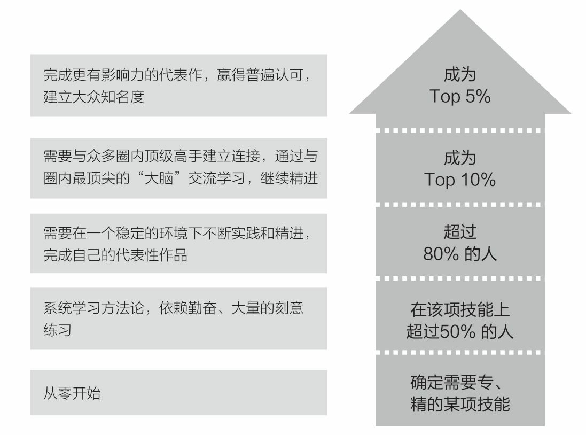
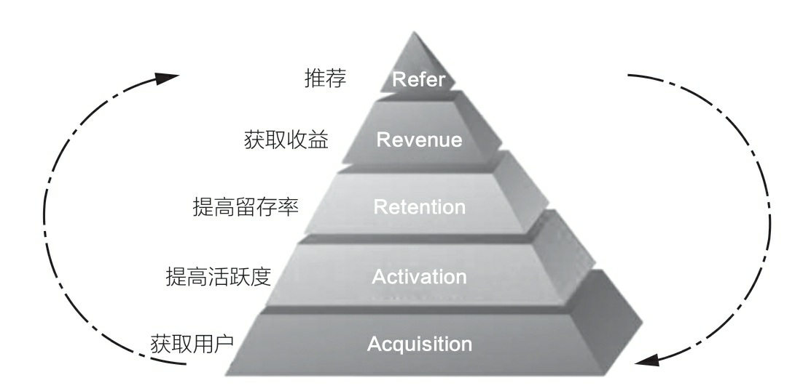
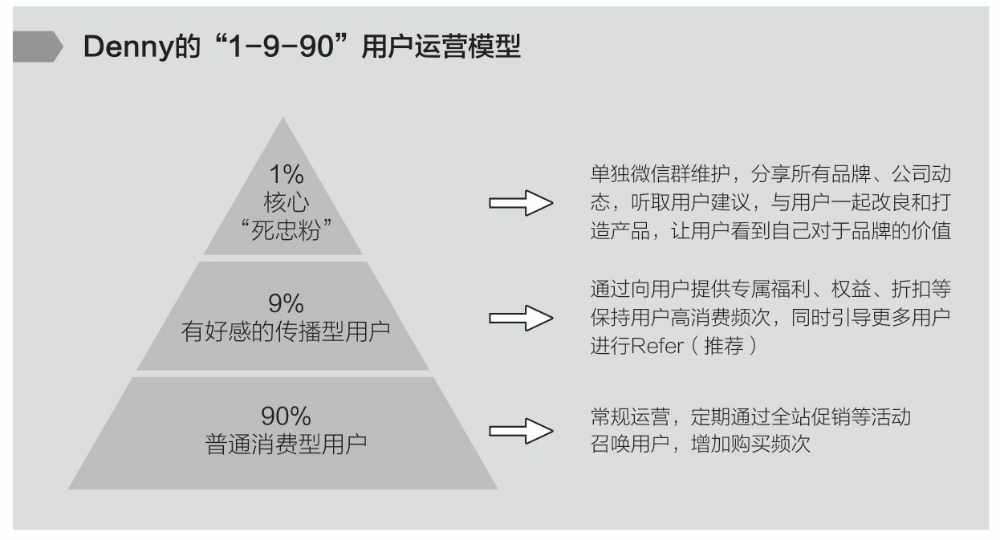
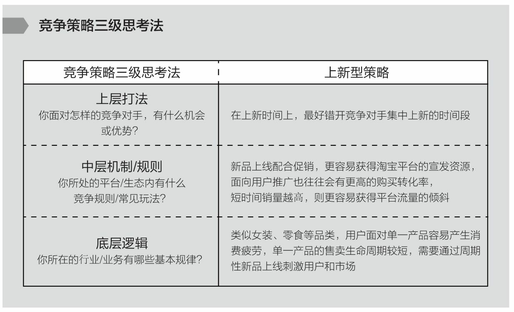

= 非线性成长
:toc:

---

- 做书籍笔记, 不要啰嗦, 只要提取出解决问题的"思维模型(模块)"即可. 并且画图出模块系统. +
*每个阶段的问题, 有每个阶段的思维模型(解决方法).*

- *以"输出"来带动"输入", 是最好的学习和成长方式. 写作本身即能带来更多思考, 和深入地反思.*

- *不知而为之, 为无知; 知之而为之, 为天真。天真者无邪，但未必无知；无知者无畏，却未必有勇。* -- 无知是没经历过，天真则是经历过后选择放弃。

---

== S型曲线 /生命周期

==== 你必须以一条接一条的“S型曲线” 来带动持续的职业成长.

世上任何事物的发展(生命,组织,新技术,商业模式)都逃不开“生命周期”规律, 都会经历从诞生、成长、成熟、衰退，到最后结束的过程. 即不会一直无限地增长下去。

---

==== 好的环境, 往往是自带势能的. 能加速你的成长

---

==== 不同的阶段, 有不同的成功范式.

我在日企做销售那时，*我的成长同时受到 3种成功范式的影响和制约*:

1. 销售这一职业的发展上升轨迹,
2. 我所在那家日企的发展轨迹,
3. 仪器制造行业的发展轨迹.

三者在特定时间(生命周期)内, 都有它们所能达到的最高上限。

这几段工作内容，每一段背后意味着一类不同的成功范式，且每一段工作内容背后带来的成长性, 是完全不同的。为了追求最终的通关，你要不断让自己从成长性较低的成长赛道, 跃迁进入到成长性更高的赛道中去。

你要不断让自己从成长性较低的成长赛道, 跃迁进入到成长性更高的赛道中去。

image:img_value/011.jpg[]

---

== ---------- ----------

---

== 人的成长, 会经历三个阶段

==== 1.工具人（Handle）

==== ---- 掌握"通用能力"

---

==== ---- 要掌握一系列技巧(工具包, 方法论, 理论模块去解决问题。

- 知道如何在这个世界上生存，洞悉竞争中的各种规则和规律，并学会利用规则去赢得基本竞争。
- 系统地研究和学习行业内的成熟高手，找到可遵循依赖的方法论.
- 一个领域内, 方法论可能有很多流派. 重要的是，你选了一派自己认同的方法论后，要能够深入地研究它、了解它，并充分实践、内化、吃透，让自己做出足以胜过大多数人的东西。

---

==== ---- 我需要什么(需要搞定什么)，就学习什么。

我从没问过”我需要学习xxx吗?”

---

==== ---- 你要成为Top 20%，才能拿到进入下一段的“入场券”

二八定律, 头部赢家通吃.

---

==== ---- 那些未能成为"顶级专家"或"商业操盘手"的人, 怎么办?

金字塔顶端的, 永远是少数.
那些未能成为"顶级专家"或"商业操盘手"的人, 怎么办?

[cols="1a,2a"]
|===
|Header 1 |Header 2

|思考1 : 探索另一种不同的竞争策略.
|

|思考2: 是否存在一个不同的维度，能够战胜对手 ->  错维竞争, 进入全新赛道.
|- 傅盛避开360的国内竞争, 进入海外市场.
<- 目的 : 在海外, 大家都是初学者, 削平了你国内的优势. 都要重新摸索起来.
|===

==== ---------- ----------

---

==== 2.负责人（Owner）

==== ---- #不要做岗位的横向平移, 而要做职业的纵向发展.#

- 即 : 你应该果断升级做业务的负责人, 为最终结果(收入, 利润, 流量)负责，而不是成为其中的一个模块。
+
*认知，几乎是人和人之间唯一的本质差别。技能的差别是可量化的，技能再累 加，也就是熟练工种。而认知的差别是本质的，是不可量化的。*
+
你要时刻关注: 你当前的成长模式，到底更多是"打补丁、提升能力"的线性竞争，还是"升级操作系统、切换赛道和模式"的非线性竞争。竞争是分不同层次的，成长也是。

- 为了能更快带动你的成长, 要寻求参与或负责一些涉及多部门协作的复杂项目的推进落地. 能了解和学习到你之前岗位接触不到的公司各模块如何交互的核心内容 (你就是ceo).

- 不断上行去看到更大的世界，了解更多顶尖高手在关注什么、如何思考，及如何才能成为那样的高手.

---

==== ---- 系统思考能力

任何一类商业组织，都是一个系统. 而一个系统，往往是由N个子系统（或称为业务模块）构成的。
如果你想管理和操盘整个系统的运转，并重新定义和设计整个系统的结构，你得熟悉整个核心模块的逻辑、构成，知道它们是如何运转的。

-> 要想成为一家公司的操盘者，你必须知晓这家公司所有的核心业务模块是如何运转的，有哪些关键节点，风险和机会往往来自哪里等。 +
-> 要知道模块间彼此的关系、每个模块管理的要点和难点，能够在每个模块出现问题时, 分析和提出解决方案.

[cols="1a,3a"]
|===
|Header 1 |Header 2

|1.熟练解决各类单点技能
|

|2.在对应问题面前，你要能够看到并深刻理解一类已经被验证行之有效的系统模型，并用它理解和思考部分问题。(模型思维)
|案例: 很多硅谷创业公司采用的 AARRR的运营体系

---

案例: 用户运营的“1-9-90”模型

你的受众目标, 最终可以被分成 1%、9%和90%这三个人群:

- 1%的“死忠粉” :
- 9%的人会经常分享 : 1. 将他们吸收为你的会员, 进行会员运营. 2. 开发"分享工具", 方便他们进行分享.
- 剩下90%的人, 为你贡献最多收入.

---

案例: 要支撑起一个新商业模式的持续存在, 必须拥有: 1.稳定的需求、2.稳定的解决方案、3.可预期的收益空间.

用这三个要素, 来衡量一个共享经济项目要想成功商业化, 则它必须满足以下几个条件:

- 从消费者角度: 有稳定的需求. -> 虽然刚需, 但价格较高, 使用频次较低, 导致用户不倾向于“拥有”该物品。
- 从商家角度: 有稳定的解决方案. -> 供给端要能确保用户产生需求后, 在地理上使用该物品十分便利.
- 从商家和投资人角度: 有可预期的收益空间. -> 你的预期收益要大于预期成本（包括维护成本、初始投入成本、存放成本、防盗成本等）之和，且面向整
个市场的预期收益, 能够带来商业想象空间。

从以上3点来看，当时流行的许多共享经济项目，包括但不限于共享篮球、共享雨伞、共享手推车、共享床铺、共享按摩椅等，都是注定不长久的.

|3.需要在同一个领域, 或同一个问题下，看到更多相关的系统模型，或者是来自其他专家或高手理解的系统模型. 吸收各家所长, 形成你自己的一套"模型思维"判断体系.
|在同一类问题面前，不同的高手有可能拥有完全不同的思考体系。你要不断深入去思考更多系统模型之间的关系、差异，以及背后的原因.
|===

---

==== ---- #迭代形成一套自己可以依赖的方法论 -> 知行合一, 快速验证你新获得的"认知"的真伪#

*必须知行合一，快速验证一个认知的有效性。一个认知形成后，只有经由实践，该认知才能被证实或证伪。*

一个人的高质量认知，来源于充分的实践。如果你的执行能力不到位，认知越升
级，你可能越没有足够消化和践行这些认知.

每一个人生阶段，你都会面临不同的问题，而每一个人都应该先把更为基本的问题解决好之后，才去探讨更加复杂和高维的问题。

---

==== ---- 三种重要的思考习惯 : 1. 始终关注"价值"，2. 降低成本，提高效率. 3. 多点收获思维

[cols="1a,2a"]
|===
|Header 1 |Header 2

|1.始终关注"价值"，而非具体问题的执行路径、难度和过往经验。
|我们没有关注“这件事有多难解决”，而是以“这件事的背后有多大价值，到底值不值得我们投入足够的时间和精力去解决”为思考原点。

|2.降低成本，提高效率. 始终思考和关注现有工作流程及业务链条中, 效率可以提升2倍以上的可能性和机会。
|效率导向的思考逻辑是：看到一类成熟业务或产业链条，找到当前效率特别低下或者成本特别高昂的节点.

|3.单点收获思维, 和多点收获思维
|小A 找了几个产品卖点，按照以往的套路和模板写好一篇推广文案，大意就是我们上线了一个新产品，特别厉害，限时优惠，快来买吧。

小B: （1）这是一个全新创新意义的产品，也因为新，部分用户的接受度不好说，所以更建议通过“提供特殊折扣，限量邀请部分用户试用”的方式进行第一波推广。为了便于获得他们的反馈，可以直接拉一些首批特邀用户进微信群。 +
（2）在第一波推广过程及用户试用过程中，需要重点关注3类数据，依据这3类数据，决定接下来1～2周的工作如何开展。 +
（3）行业内，有3家公司过去一年内发布过类似但又不完全相同的产品，所以要尽快了解这3款产品在最近几个月以来的表现，以及主要的营销推广渠道和方式，以此指导新产品的后续营销工作。

你会发现，面对同样一件事，小A与小B的思考和关注差别很大 ——小A关注的只是如何写好一篇推广文案发出去，而小B关注的则是整个新产品的营销策略如何制定，*如何利用当前这一次推广获取更多有效的信息。*
|===

---

==== ---- 竞争策略"三级思考法"

1. 你所在的行业/业务, 有哪些基本规律？
2. 你所处的平台/生态内, 有什么竞争规则/常见玩法？
3. 你面对怎样的竞争对手，有什么机会或优势（劣势）, SWOT ？

image:img_value/015.jpg[]

案例1:

image:img_value/016.jpg[]

---

==== ---- 对事的管理 : “目标、路径、资源”三段论

[cols="1a,1a" options="autowidth"]
|===
|Header 1 |Header 2

|目标
|关键目标的诞生，往往来自你对一件事拥有更为本质的认知。

- napchat从来不认为自己是聊天工具，而是改变新一代美国年轻人的沟通方式。他们认为新一代年轻人的沟通方式，未必依赖于文字, 而是围绕摄像头建立内容. 于是形成了与 Facebook 显著的差异。

---

目标应该足够简单，足够聚焦。聚焦则意味着一段时间内，目标是唯一的。目标如果无法聚焦，路径和资源也很难聚焦.

- “完成一个品类的全面建设”不算是一个足够简单的目标，而“做一堂半年内超过30000人付费报名的爆款课程出来”更像一个比较简单的目标。

|路径
|围绕一个目标，路径的拆解要足够细致，要知道大目标由哪几个子目标组成，这
些子目标之间有无先后依赖关系，以及每个子目标下的关键动作和手段是什么。

- 某app, 核心目标回归到“要让清理这个功能变得最好”上面。再往下拆解，分为3个子目标：清理垃圾大小、清理效率和内存占用3个指标都要显著领先其他同类竞品。

|资源
|Column 2, row 3
|===

对“事”的管理的本质，就是树立一个核心的业务，让这个业务带着所有的员工和组织架构往前走.

---

==== ---------- ----------

---

==== 3. 创始人（Founder）

你的公司成功需要什么，你就学习什么！ +
(懂产品、懂商业, 懂组织、懂战略, 学会了融资、会公开演讲、会社交... ) 你必须解决所有问题，让公司进入快速发展期.

你已经是一个管理者，尽量让自己在做思考、决策、对外获取有效信息的时间大于60%。

---

189

