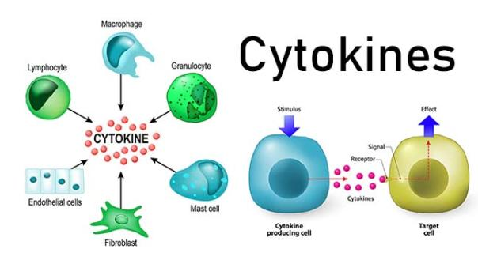
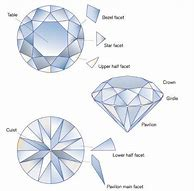
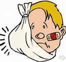
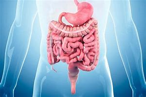
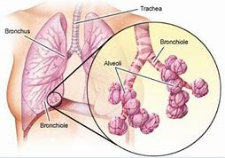
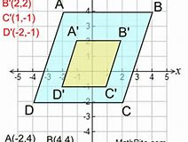
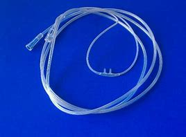
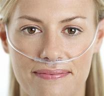

= eco 2020-06-06
:toc:

---

== 背景知识 - cytokine storm 细胞素风暴, 细胞因子风暴.

是指机体感染微生物后, 引起体液中多种细胞因子如TNF-α、IL-1、IL-6、IL-12、IFN-α、IFN-β、IFN-γ、MCP-1和IL-8等迅速大量产生的现象，是引起"急性呼吸窘迫综合征"和"多脏器衰竭"的重要原因。 +
免疫系统的日常工作是清除感染，但是如果免疫系统被激活到极限程度或者失去控制，它就会伤害宿主，*极端的免疫攻击是“细胞因子风暴”*。埃博拉病毒感染的最后阶段，细胞因子风暴才是夺命杀手，像禽流感和非典之类的很多病毒都一样，能够触发免疫系统对身体的猛烈攻击。 +
*免疫细胞,通过"细胞因子"彼此沟通，"细胞因子"是细胞释放到血液中的小分子，可以令免疫细胞冲到感染部位、吞噬遭到损伤的细胞，甚至穿透血管壁。* 细胞因子还可以引发"炎症"，令被破坏的机体肿胀、发热以及疼痛。 +
*"细胞因子风暴"是一种求助信号，目的是让免疫系统霎时间火力全开。* 这最后一招自杀式的攻击能够损伤病毒，但也会留下一大堆连带伤害。*血管承受了其中最主要的攻势。细胞因子风暴令血管壁变得更容易穿透。因此动脉、静脉和毛细血管都开始渗出血液和血浆。* +
*"细胞因子风暴"还会引发一氧化氮的大量释放。这种物质会进一步稀释血液并破坏血管。所有这些因素综合起来，把血压降到了危险的水平*，所以患者不是死于失血，而是死于某种类似严重感染性休克的问题。

在SARS-CoV-2危重病人中, 可见"细胞因子风暴"发生。*细胞因子风暴是新冠肺炎患者"轻症"向"重症"和"危重症"转换的一个重要节点*，同时也是现在重症和危重症死亡的一个原因。

细胞种种错综复杂的调节关系, 是怎么进行调节信息传递的呢？这得归功于他们的“联络官” -- 细胞因子。

*免疫细胞在清除有害物质的同时, 会释放促炎细胞因子（包括干扰素（IFN）、白细胞介素（IL）、肿瘤坏血因子（TNF）等），以号召更多的免疫细胞加入这场对抗外敌的战争*，同时这些免疫细胞也会分泌更多的细胞因子，以不断壮大战争队伍，如此形成一个正反馈。*当免疫系统最终控制住入侵的病原体时，细胞因子又会减少，进而减弱炎症反应。* 因此，适当并协调得当的细胞因子释放, 可以及时调动大量免疫细胞到达感染处，抑制感染并清除病原体。

*但是当免疫系统因感染、药物、自身免疫疾病等因素, 过度激活时，免疫细胞就会应激过度，产生过多的细胞因子, 从而让炎症加剧，大量分泌的促炎因子, 会导致正反馈循环会突破某个阈值而放大，最终形成"细胞因子风暴"。* 此时联络官变叛变官，反恐精英变成恐怖分子。*火力全开而又不受控制的免疫系统, 相当于一场不受控制的空袭，无差别地攻击包括病原体在内的一切细胞，进而引发全身炎症，多器官衰竭乃至死亡。* 很多人是撑不到输赢见分晓的，随随便便一个器官衰竭了，就直接没命了。

以本次肺炎为例，有专家认为部分重症和死亡患者出现中性粒细胞持续增多可能就是由于病毒诱导的细胞因子风暴引起的。因此从某种程度来说，细胞因子风暴对人体的伤害甚至超过病毒本身对人体的伤害 。除了新冠病毒，多项研究表明，细胞因子风暴也是SARS、甲型H1N1，埃博拉病毒等多种感染疾病的重要夺命杀手。

目前临床上常常使用一些"免疫抑制剂"来调节"细胞因子风暴"，使机体内的免疫反应处于一个正常的范围，既能消灭病毒，又不会过度杀伤正常的组织细胞。由此可见，免疫讲求最重要的还是平衡，免疫过弱，易受外界病毒细菌的侵害，太强又容易“杀敌八百，自损一千 ”。

---

==  The paths of destruction 摧毁；毁灭；破坏  +
词汇解说

( eco 2020-06-06 / Briefing / How covid-19 kills: Assault and battery )

How SARS-CoV-2 *causes(v.) disease and death* in covid-19

There *are* direct routes and indirect ones

Jun 6th 2020 |

THE FIRST SET of lungs *felt like* rubber, says Rainer Claus, *so* damaged *that* it was impossible *to imagine* how any amount of oxygen *could get through* them. `主` The lungs in the rest of the ten covid-19 victims (that he and his colleagues at the University Medical Centre Augsburg, in Germany, *autopsied* 验尸；尸体解剖 in early April) `系` *were* in similarly awful condition.

- autopsy : /ˈɔːtɑːpsi/ n. an official examination of a dead body by a doctor in order to discover the cause of death 验尸；尸体解剖 +
=> 来源于希腊语中由autos(自己)和optos(可见的)组成的复合词autoptes(目击者),经法语autopsie或现代拉丁语autopsia而派生了英语autopsy。 词根词缀： auto-自己(o略) + (-opt-)视,光 + -y名词词尾

This *has been*, for the most part, the story around the world. People *get infected with* SARS-CoV-2, the virus which *causes* covid-19, by *breathing in* tiny liquid droplets *containing* virus particles. Those particles *gain* entry to the lungs, where they *start reproducing*  复制;繁殖；生育 themselves. If the immune system *does not stop* it -- which it *mostly does* --the virus *causes* so much damage that the lungs *can no longer do their job*, *ending up 最终成为；最后处于 like* those in Augsburg 德国一城市.

But there *are* other facets （事物的）部分，方面 to the disease *not so easily understood*. It *robs* 抢劫；掠夺；盗取 some of the infected 被感染者 *of* their sense of smell; [in others] the toes 脚趾 or fingers *darken* as if bruised 瘀伤;撞伤；擦伤. Hearts *swell* 膨胀；肿胀; blood *clots* （血或乳脂）凝结成块; immune systems *cripple* 严重毁坏（或损害）;使残废；使跛；使成瘸子 organs 器官 (they are meant(a.)原本;理应 to be saving). Doctors around the world *are trying to find out* how much these various symptoms *are attributable 可归因于；可能由于 to* direct effects of the virus, *to* secondary effects 副效应；继发效应；次生效应 of the damage it *does* to the lungs, or even, in some cases, *to* the treatments *used* against it. The more of the story they *can disentangle* 理顺，分清，清理出（混乱的论据、想法等）, the better the standard of care *is likely to get*.

- facet :  /ˈfæsɪt/  n. *~ (of sth)* a particular part or aspect of sth （事物的）部分，方面  / one of the flat sides of a jewel （宝石的）小平面，琢面 +
=>  fac(e)面 + -et小 +
-> Now let's look at another facet of the problem. 现在咱们看问题的另一面。 +

- swell : v. [ V ] *~ (up)* to become bigger or rounder 膨胀；肿胀 / *~ (sth) (out)* to curve out or make sth curve out （使）凸出，鼓出 / *~ (sth) (to sth)* to increase or make sth increase in number or size （使）增加，增大，扩大 +
-> Last year's *profits were swelled* by a fall in production costs. 去年因生产成本下降，利润有所增加。 +

- clot  : /klɑːt/ v. when blood or cream clots or when sth clots it, it forms thick lumps or clots （血或乳脂）凝结成块 +
-> 词源同clod,clump,cloud.指各种大块状的东西。

- disentangle : /ˌdɪsɪnˈtæŋɡl/ v. *~ sth (from sth)* to separate different arguments, ideas, etc. that have become confused 理顺，分清，清理出（混乱的论据、想法等） /  *~ sth/sb (from sth)* to free sb/sth from sth that has become wrapped or twisted around it or them 使解脱；使脱出；使摆脱 / to get rid of the twists and knots in sth 解开…的结；理顺 +
=> dis-, 不，非，使相反。entangle, 卷入，混乱。即解开混乱，解释，理解。 +
-> It's not easy *to disentangle the truth* from the official statistics. 从官方统计资料中理出真实情况并不容易。 +
-> She *has just disentangled herself* from a painful relationship. 她刚刚摆脱一段痛苦的感情。 +

- 世界各地的医生都在努力查明，这些不同的症状, 在多大程度上可归因于该病毒的直接影响，或其对肺部造成的次生影响，甚至在某些情况下，归因于针对该病毒的治疗。

For the virus *to attack* a cell, the cell’s surface *needs to be adorned 装饰 with* a protein 蛋白质 (which *plays a role* in the regulation of blood pressure and inflammation 发炎；炎症) *called* angiotensin-converting enzyme 血管紧张素转化酶 2 (ACE2). This *is found* on plenty of cells in the upper respiratory 呼吸的 tract 上呼吸道 and lungs, *as well as* the linings 衬层；内衬；衬里;（身体器官内壁的）膜 of blood vessels and the heart, kidneys and intestines 肠. In some cases the virus *may get into* those intestinal cells directly, *having been swallowed* 吞下；咽下. In other cases it seems *to get to* the gut 消化道；肠道;（尤指动物的）内脏, and other susceptible  易受影响（或伤害等）；敏感；过敏 organs, via the blood.

- 这种蛋白质被称为"血管紧张素转换酶2" (ACE2)，在调节血压和炎症方面发挥作用。

- protein 蛋白质 => proto-,原始的，最早的，-ine,化学名词后缀，氨。后拼写变为protein.

- angiotensin : /,ændʒɪo'tɛnsən/  N a peptide of physiological importance that is capable of causing constriction of blood vessels, which raises blood pressure 血管紧缩素 +
=> angio- +‎ (hyper)tensin

- enzyme : n.   /ˈenzaɪm/ ( biology 生 ) a substance, produced by all living things, which helps a chemical change happen or happen more quickly, without being changed itself 酶 +
=> en-, 进入，使。-zym, 发酵，词源同eczema, zymurgy.

- *upper respiratory tract* 上呼吸道 +
临床上，称鼻、咽、喉为"上呼吸道"，气管和各级支气管为"下呼吸道"。 +
人们通常所说的感冒，大都指的是上呼吸道感染，如果是下呼吸道感染，那就可能是气管炎、肺炎了。

- lining :  /ˈlaɪnɪŋ/ n. [ C ] a layer of material used to cover the inside surface of sth 衬层；内衬；衬里 /
[ U ] the covering of the inner surface of a part of the body （身体器官内壁的）膜 +
-> *the stomach lining* 胃黏膜

- intestine : /ɪnˈtestɪn/ [ usually pl. ] a long tube in the body between the stomach and the anus . Food passes from the stomach to the small intestine and from there to the large intestine . 肠 +
=>  来自拉丁语intus,在内部，在里面，词源同enter,enteritis.引申词义肠。 +

Mostly, though, the virus *seems* to get(v.) no further than the ACE2-rich cells of the nose and throat, and perhaps the lungs, before the body’s defences *take care of it* so well that its presence *is never even noticed*. `主` Tests (which *look for* genetic material 遗传物质；基因材料 from SARS-CoV-2 in swabs （医用的）拭子，药签 from the nose and throat) `谓` *frequently find* it *present* in people who *show* no other sign of it at all: [in one British survey] 70% of those who tested positive *were* asymptomatic 无症状的.

`主` Most of those who do fall(v.) ill `谓` *suffer* flu-like symptoms, typically with a fever and a cough, sometimes with diarrhoea 腹泻, that *get better* after a week or so. But some *suffer* for longer, *failing to shake 去除；摆脱 the infection* before *getting badly sick*. Many of these people *will*, after a time, *start to feel* a shortness of breath 气促；呼吸浅短 as `主` the lungs’ ability *to oxygenate* 供氧；输氧 the blood `谓` *weakens*. About 10-15% of those who *are diagnosed* 诊断（疾病）；判断（问题的原因） -- which *may mean* less than 5% of those infected -- *eventually become ill enough* to need a hospital.

- diarrhoea  : /ˌdaɪəˈriːə/ n.  ( BrE ) ( NAmE *diar·rhea* ) ( also informal the runs ) [ U ] an illness in which waste matter is emptied from the bowels much more frequently than normal, and in liquid form 腹泻 +
=> dia-, 穿过，整个的。-rrh, 流，词源同gonorrheal, rhythm. 用于指腹泄，比较diabetes.

- shake : v. *~ sth (off)* to get rid of sth 去除；摆脱 +
-> I can't seem *to shake off this cold*. 这场感冒我好像老好不了。

- *shortness of breath*  气促；呼吸浅短

Almost all of those hospitalised 送（某人）入院治疗 *have* symptoms of pneumonia 肺炎 -- the general name for the response of the lungs to a variety of viral, bacterial 细菌的; 细菌引起的 and fungal(a.)由真菌引起的; 含真菌的; 和真菌有关的 infections. When they *get deep into* the lungs, the SARS-CoV-2 particles *find* a target-rich environment 目标丰富的环境 in the alveoli 肺泡, tiny air sacs 囊 which *hang* like bunches 串；束；扎 of grapes off the lung’s branching 分支 network of bronchial 支气管的 tubes 支气管,小支气管 and *are lined 沿…形成行（或列、排） with* cells *festooned  给…饰以花彩；结彩于；张灯结彩 with* ACE2. *It is* in these sacs 囊 *that* `主` oxygen from the air *breathed into* the lungs `谓` *passes into* the blood stream, and `主` carbon dioxide from the blood `谓` *passes into* the lung *to be breathed out*. The more the virus *damages and kills* the cells lining （身体器官内壁的）膜 the alveoli 肺泡, the more difficult this exchange of gases *becomes*. Hence the shortness of breath.

- pneumonia : /nuːˈmoʊniə/ [ U ] a serious illness affecting one or both lungs that makes breathing difficult 肺炎 +
=> pneumon-,肺，-ia,炎症。

- alveoli  /æl'vɪəlaɪ/ 肺泡 +

-  sac :  /sæk/ a part inside the body of a person, an animal or a plant, that is shaped like a bag, has thin skin around it, and contains liquid or air （人、动植物体内的）囊，液囊，气囊 +
=> 来自法语 sac,囊，来自拉丁语 saccus,袋子，口袋，词源同 sack. +
-> The lungs consist of millions of *tiny air sacs*. 肺包含数百万个小肺泡。

- bunch :  [ C ] *~ of sth* : a number of things of the same type which are growing or fastened together 串；束；扎 +
-> a bunch of bananas/grapes, etc. 一串香蕉、葡萄等

- bronchial : /ˈbrɑːŋkiəl/ a. ( medical 医 ) of or affecting the two main branches of the windpipe (called bronchial tubes ) leading to the lungs 支气管的 / bronchus  /ˈbrɑːŋkəs/  n. 支气管 +
-> *bronchial pneumonia* 支气管肺炎

- festoon : /feˈstuːn/ v.  [ VN ] [ usually passive ] *~ sb/sth (with sth)* to decorate sb/sth with flowers, coloured paper, etc., often as part of a celebration 给…饰以花彩；结彩于；张灯结彩 / n. a chain of lights, coloured paper, flowers, etc., used to decorate sth 彩灯；花彩 +
=> 来自feast, 节日，盛宴。-oon,大词后缀。引申词义张灯结彩。 +

- 几乎所有住院的病人都有肺炎的症状。肺炎是肺部对各种病毒、细菌和真菌感染的反应的总称。当它们深入肺部时，SARS-CoV-2颗粒在肺泡中找到了一个目标丰富的环境。肺泡是微小的肺泡，像葡萄一样悬挂在肺的支气管分支网络上，排列着用ACE2装饰的细胞。正是在这些囊中，呼吸到肺部的空气中的氧气进入了血液，血液中的二氧化碳进入肺部被呼出。病毒对肺泡内壁细胞的破坏和杀死越多，气体交换就越困难。因此呼吸短促。

In some covid-19 cases, though, this shortness of breath 气促；呼吸浅短 -- a textbook 规范的；标准的;教科书 symptom of pneumonia 肺炎 -- *does not show up* （使）看得见，变得明显，显现出来. Doctors *have got used to 习惯于 seeing* patients with blood-oxygen levels *so* low *that* they should be dizzy 头晕目眩的；眩晕的 or unconscious, but who *show* no sign of respiratory 呼吸的 distress 忧虑；悲伤；痛苦.

- *show up* : (informal) to arrive where you have arranged to meet sb or do sth 如约赶到；出现；露面 +
-> It was getting late *when she finally showed up*.
天色已晚，她终于赶到了。 +
*show up | show sth up* : to become visible; to make sth become visible （使）看得见，变得明显，显现出来 +
-> a broken bone *showed up* on the X-ray 在X光照片上显示出的一根断骨

Daniel Johnson of the University of Nebraska Medical Centre *says* his theory *is that* SARS-CoV-2 *may be affecting* the nervous system. That it *can do so* in some ways, at least, *is hinted 暗示；透露；示意 at* by the fact that some patients *report* a loss of the sense of smell early on in their infection; there *are* other signs, too. Perhaps the virus *has* an effect on the part of the brain which *tells* the lungs *to work harder* when carbon dioxide *builds up* 加大；加强；增多 in the blood.

- hint : v.  *~ (at sth)* to suggest sth in an indirect way 暗示；透露；示意 +
-> *What are you hinting at*? 你在暗示什么？

Angles of attack

Another possibility *is that* the lungs *are not* the only thing at fault  缺陷；毛病；故障. [In some of these atypical 非典型的；反常的 patients] the perilously  危机四伏地；充满危险地 low blood-oxygen level “*seems to be* out of proportion 不相称；不谐调;不成比例 to the overall injury to the lung,” says Joseph Levitt of the Stanford University Medical Centre. The lungs of covid-19 patients *feel* different, too, he says. Typically, the lungs of patients with severe pneumonia 肺炎 *become* stiffer 更硬的, which *makes* moving(v.) air [in and out of them] *increasingly hard*. The ventilators 通气机；呼吸器 (*on to* which such patients *are put* 穿上；戴上) *pump(v.)用泵（或泵样器官等）输送 in* oxygen under pressure, thus *doing* some of the lungs’ work for them. The lungs of covid-19 patients (with blood-oxygen levels low enough to need a ventilator), though, *are not* so stiff, says Dr Levitt. They *have not exhausted 用完；花光；耗尽;使筋疲力尽；使疲惫不堪 their ability* to do their job. But the job *is not getting done*.

- fault : n. [可数名词] something that is wrong or not perfect with sth; something that is wrong with a machine or system that stops it from working correctly 缺陷；毛病；故障 +
-> *a major fault* in the design 设计中的一个重大失误

- atypical : /ˌeɪˈtɪpɪkl/ a. not typical or usual 非典型的；反常的 +
=> 前缀a- , 不，非。typical，典型的。 +
-> *atypical behaviour* 反常行为

- *out of (all) proportion (to sth)* : larger, more serious, etc. in relation to sth than is necessary or appropriate 不相称；不谐调 +
They earn salaries *out of all proportion to their ability*.
他们挣的工资与其能力不相称。

- 另一种可能是, 肺不是唯一有问题的地方。斯坦福大学医学中心的约瑟夫·莱维特说，在一些非典型患者中，危险的低血氧水平“似乎与肺部的整体损伤不成比例”。他说，covid-19患者的肺部感觉也不一样。通常情况下，重症肺炎患者的肺部会变得更加僵硬，使得空气进出肺部变得越来越困难。这些病人依靠戴上呼吸机, 在压力下来泵入氧气，从而为他们的肺做一些工作。Levitt博士说，covid-19患者在血氧水平低到需要使用呼吸机的程度时，肺部并没有那么僵硬。他们没有用尽他们的能力去做他们的工作。但这项工作并没有完成。

Dr Levitt *wonders* 想知道；想弄明白；琢磨 whether the problem *may be* in the blood vessels. ACE2’s role in *looking after* 对…负责；照料；照顾 blood pressure *depends on* its ability *to regulate* signals that *make* blood vessels *constrict （使）紧缩，缩窄 or dilate* 扩大；（使）膨胀，扩张. The way SARS-CoV-2 *binds （使）联合在一起，结合 to* ACE2 *probably makes it less able to take part in* 参与某事 that signalling 发信号；发暗号；示意. Covid-19 *may thus reduce* the amount of oxygen which *gets into* tissues *[not just] by damaging* the lung, *[but also] by narrowing* and *damaging* blood vessels. If so, `主` drugs *to dilate* the blood vessels `谓` *might help*, at least in some cases. `主` *Finding out* what treatment *works best* along those lines 方法；方式, though, `谓` *requires* clinical 临床的；临床诊断的 trials(n.)（对能力、质量、性能等的）试验，试用, says Dr Levitt.

- dilate :  /daɪˈleɪt/ v. to become or to make sth larger, wider or more open 扩大；（使）膨胀，扩张 +
=> di-, 分开，散开，来自dis-变体。-lat, 变宽，膨胀，词源同latitude, lateral. 即扩散，膨胀。 +
-> dilated pupils/nostrils 扩大了的瞳孔；张大了的鼻孔 +

- bind : v.  [ VN ] *~ A and B (together) | ~ A to B* to unite people, organizations, etc. so that they live or work together more happily or effectively （使）联合在一起，结合 +
-> She thought that having his child *would bind him to her forever*. 她以为生了他的孩子就会永远把他留住

- line : [ C ] a method or way of doing or thinking about sth 方法；方式 / [ Cusually sing. ] an attitude or a belief, especially one that sb states publicly （尤指公开表明的）态度，看法 +
-> I don't follow *your line of reasoning* . 我不理解你的推理方法。 +
-> The police are pursuing *a new line of enquiry/inquiry* (= way of finding out information) . 警方正在实施一种新的调查方法。 +
-> He supported *the official line on education*. 他支持官方的教育理念。 +
-> The government *is taking a firm line* on terrorism. 政府现在对恐怖主义采取强硬的态度。

- trial : /ˈtraɪəl/ n. [ CU ] the process of testing the ability, quality or performance of sb/sth, especially before you make a final decision about them （对能力、质量、性能等的）试验，试用 +
-> The new drug *is undergoing clinical trials*. 这种新药正在进行临床试验。 +
=> The system *was introduced on a trial basis* 基准；准则；方式 for one month. 这个制度已引进试行一个月。

- Levitt博士想知道问题是否出在血管上。ACE2在保护血压方面的作用, 取决于它调节使血管收缩或扩张的信号的能力。SARS-CoV-2与ACE2结合的方式, 可能会降低它参与这一信号传递的能力。因此，Covid-19不仅会损伤肺部，还会使血管收缩和损伤，从而减少进入组织的氧气量。如果是这样的话，扩张血管的药物可能会有所帮助，至少在某些情况下是这样。Levitt博士说，要找出哪种治疗方法在这些方面最有效，还需要进行临床试验。

[In hospitals] the treatment *will normally start with* extra oxygen *supplied through* a nasal 鼻的；与鼻子相关的 cannula （输药等的）套管，插管 (a plastic tube with a prong 叉子齿 for each nostril 鼻孔) and therapy 治疗；疗法 *to combat* 防止；减轻;战斗；与…搏斗 dehydration 脱水: patients *have typically had a fever* for days and *not been drinking enough*, *leaving* their bodies *badly short of fluids*. Rest, rehydration 补水 and extra oxygen, along with 除…以外（还）;和…一起[一道] drugs for any secondary infections 继发性感染 that *have taken advantage* of the body’s stressed-out 因心理紧张而被压垮的 state, *give* the immune system a chance *to get the upper hand* 占上风；处于有利地位；有优势；有控制权.

- cannula :  /ˈkænjʊlə/ n. ( medical 医 ) a thin tube that is put into a vein or other part of the body, for example to give sb medicine （输药等的）套管，插管 +
=> 来自cane, 芦苇。-ula, 小词后缀。因形如小荒芜而得名。 +

- nasal cannula 输氧鼻管, 鼻导管, 鼻套管 +

- prong :  /prɔːŋ/ n.  each of the two or more long pointed parts of a fork 叉子齿 / -pronged ( in adjectives 构成形容词 ) having the number or type of prongs mentioned 有…齿的；分…方面的 / each of the separate parts of an attack, argument, etc., that move towards a place, subject, etc. from different positions （进攻、论点等的）方面 +
-> a two-pronged fork 二齿叉 +
-> *a three-pronged attack* 三路进攻 +

- dehydration : /ˌdiːhaɪˈdreɪʃn/ n. 脱水 +
=> de-, 不，非，使相反。hydrate, 补水。即脱水。

- rehydration :  /,rihaɪ'dreʃən/ the process of putting water into someone's body when they are suffering from dehydration (= a lack of water) 当某人脱水时向其体内加水的过程

- *gain, get, have, etc. the upper hand* : to get an advantage over sb so that you are in control of a particular situation 占上风；处于有利地位；有优势；有控制权

- 在医院里，治疗通常会首先通过鼻腔插管(一根每个鼻孔都有一个尖刺的塑料管)提供额外的氧气，以及对抗脱水的治疗:患者通常会连续几天发烧，饮水不足，导致身体严重缺水。休息、补水和额外的氧气，以及治疗任何利用身体压力过大的继发性感染的药物，都可以让免疫系统来占得上风。

The immune response(n.) to a virus *starts with* infected cells *producing* a suite （一批）随员，随从;（一套）家具；套房 of signalling molecules 信号分子 called cytokines 细胞因子；细胞激素. Some of these *tell* other cells nearby *to be* on their guard against attack, thus *stymying* 阻挠，妨碍 the virus’s ability *to replicate* itself. Others *tell* the immune system *to come* and put some stick 粘贴；粘住 about. Thus called to arms, the immune system *launches* [both] a prompt 立即；迅速的；及时的 all-purpose 多用途的；通用的 response -- inflammation 发炎；炎症 -- [and] a subsequent targeted(a.)面向，把…对准（某群体） counter-attack(n.v.)（战争、体育运动或争论中的）反攻，反击 *using* antibodies 抗体 and cells *specifically programmed* to attack(v.) both virus particles 病毒颗粒 and the cells (they have infected). Unfortunately SARS-CoV-2 *seems* able to interfere(v.) with the early steps of the immune response. It *can apparently counteract* 抵制；抵消；抵抗 the part that *dampens* 抑制，控制，减弱（感情、反应等） replication in nearby cells. It *may also enhance* inflammation.

- cytokine  /'saɪtəʊ,kaɪn/ N any of various proteins, secreted by cells, that carry signals to neighbouring cells. Cytokines include interferon 细胞活素. 一种由细胞分泌的将信号传递给邻近细胞的蛋白质。细胞因子包括干扰素

- stymie : /ˈstaɪmi/ [ VN ] ( informal ) to prevent sb from doing sth that they have planned or want to do; to prevent sth from happening 阻挠；阻碍；阻止；妨碍

- all-purpose : a. [只用于名词前] having many different uses; able to be used in many situations 多用途的；通用的 +
-> Use *all-purpose flour* if you cannot find pastry flour.
如果找不到面点专用粉，可以用通用面粉。

- 免疫系统对病毒的反应, 始于被感染的细胞产生一组称为"细胞因子"的信号分子。其中一些会告诉附近的其他细胞, 警惕病毒的攻击，从而阻碍病毒自我复制的能力。另一些则告诉免疫系统过来，把它粘起来。于是，免疫系统开始行动起来，同时发起一个快速的通用反应——炎症——以及随后的有针对性的反击，使用专门编程的抗体和细胞, 来攻击病毒颗粒和被它们感染的细胞。不幸的是，SARS-CoV-2似乎能够干扰免疫反应的早期步骤。对于免疫系统能抑制细胞附近的病毒的复制, SARS-CoV-2显然可以抵消掉它, 并且还可能加剧炎症。

Whether the virus *helps it along* or not, severe  极为恶劣的；十分严重的 inflammation of the lungs 肺部炎症 *often leads to* 导致  what *is known as* acute respiratory distress syndrome (ARDS) 急性呼吸窘迫综合征. *It is* ARDS *that sees* people *rushed to* intensive-care 重症特别护理 units (ICUs) and *put on* ventilators 人工呼吸器.

Because *it* is hard *to tolerate* having(v.) a tube *stuck* down your throat and into your lungs, patients on ventilators *are heavily sedated* 给…服镇静剂 and unable to do anything for themselves. Nurses *must reposition*(v.)重新放置; 调换位置 them every few hours *to prevent* bed sores 痛处；伤处；疮. Their doctors *keep watch for* kidney failure 故障；失灵, blood clots  (血液的) 凝块 and heart problems -- `主` risks(n.) to critically(ad.)严重的；不稳定的；可能有危险的 ill patients in ICUs (that anecdote 传闻;逸事；趣闻 *has suggested*) `系` *may be more common* in covid-19 patients than in others. Those anecdotes 传闻;逸事；趣闻 *are now being backed up* 支持；证实（某人所言） by a few studies. However, *as* Dominic Wichmann of the University Medical Centre Hamburg-Eppendorf *points out*, this correlation *does not necessarily mean* SARS-CoV-2 *is itself damaging* the organs involved.

- sedate : /sɪˈdeɪt/ v. [ VN ] [ often passive ] to give sb drugs in order to make them calm and/or to make them sleep 给…服镇静剂 +
=> 来自拉丁语 sedere,坐，来自 PIE*sed,坐，坐下，词源同 sit,seat.引申比喻义使镇静，使镇定。

- anecdote : /ˈænɪkdoʊt/  => 前缀an-, 没有。前缀ec-,同ex-, 向外。词根don，给予，见donate, 捐赠，过去分词dot. 即“未向外给出、未公布的事”。

- 无论病毒是否起到作用，严重的肺部炎症, 通常会导致所谓的"急性呼吸窘迫综合征"(ARDS)。在"急性呼吸窘迫综合征"(ARDS)中，人们被紧急送往"重症监护病房"(icu)，换上呼吸机。
因为很难忍受一根管子卡在你的喉咙里，进入你的肺里，使用呼吸机的病人会被严重麻醉，不能自己做任何事情。护士必须每隔几个小时重新放置一次，以防止褥疮。他们的医生会密切关注肾衰竭、血块和心脏问题——在重症监护室中，危重患者面临的风险, 可能在covid-19患者中更为常见。这些轶事现在得到了一些研究的支持。然而，汉堡-埃彭多夫大学医学中心的Dominic Wichmann指出，这种相关性并不一定意味着是SARS-CoV-2本身来损害相关的器官。

A quarter of covid-19 patients in British ICUs *have had* kidney problems *severe enough* to require(v.) dialysis(n.)渗析；透析（尤指将废物从肾病病人的血液中分离出来）. “It’s all part of the second phase of the illness when people, eight to ten days in, *suddenly get worse*,” says Claire Sharpe of King’s College London. A big part of the problem, she says, *is* just dehydration 脱水, always a risk in ICUs, *all the more so* 更加如此，尤其这样; 更是如此 when patients *are* feverish(a.)发烧的；发烧引起的. On top of this 除此以外, `主` the stress (*caused* to the body *by having* air pumped *in and out*) `谓` *amounts to* “a double hit on the kidneys”.

- dialysis : /ˌdaɪˈæləsɪs/ n. ( technical 术语 ) a process for separating substances from a liquid, especially for taking waste substances out of the blood of people with damaged kidneys 渗析；透析（尤指将废物从肾病病人的血液中分离出来） +
=> dia-, 穿过，整个的。-lys, 分开，记源同lose, analysis. 用于医学名词透析。

- 在英国icu中，四分之一的covid-19患者, 都有严重的肾脏问题，需要进行透析。伦敦大学国王学院的Claire Sharpe说:“当8到10天后，病情突然恶化时, 肾脏问题就是患者病情第二阶段的一部分病况。”她说，这个问题的很大一部分是源于脱水，这在icu中是一个常见风险，当病人发烧时更是如此。除此之外，呼吸机空气的进出, 对身体所造成的压力, 相当于是“对肾脏的双重打击”。

Chains of command

[Early in the pandemic] critical-care 急救护理；特级护理 doctors in various countries *added to 使（数量）增加；使（规模）扩大 the problem* by *flushing* fluids from the body *in order to keep* the patients’ damaged lungs *from filling with liquid*. They *appreciated* 理解；意识到；领会 the risk of crashing(v.)碰撞；撞击;心脏停止跳动 the kidneys that this involved. `主` Their thinking(n.) in *doing it anyway* 无论如何都要做 , Dr Johnson says, `系` *was* “I have to do everything I can *to try to help* their oxygen levels, because *if I don’t win that* then the whole game is lost.” Once doctors *began to see* high rates of kidney failure 肾衰竭 in covid-19 patients, though, they *stopped* “running them dry”. Dr Johnson, whose unit *had* the benefit of the experience from New York and other early hotspots, says kidney failure *is* now no more common in his covid-19 patients than in those with other viral pneumonias 病毒性肺炎.

-  appreciate : v. ( not used in the progressive tenses 不用于进行时 ) to understand that sth is true 理解；意识到；领会 +
=>  ap-来,临近 + -prec-价格,价值 + -i + -ate动词词尾 → 估价,抬价 +
-> We *didn't fully appreciate that* he was seriously ill. 我们没有充分认识到他的病情很严重。

- 在疫情大流行早期，各国的重症监护医生, 通过冲洗体内的液体来防止患者受损的肺部充满液体，从而加剧了问题。他们意识到这可能会导致肾脏崩溃。约翰逊博士说，无论如何，他们的想法是“我必须尽我所能, 来帮助他们提高氧气水平，因为如果我不能赢得这场比赛，那么整个救治就会失败。”然而，一旦医生开始发现, 新冠肺炎患者的肾衰竭比率很高，他们就不再“让他们干涸”。约翰逊博士的单位受益于来自纽约和其他早期热点地区的救治经验，他说，现在他的新冠肺炎患者中, 肾衰竭的现象并不比其他病毒性肺炎患者中更常见。

Blood clots *are* another worry for patients in ICUs -- so much *so that* mild blood thinners （涂料、清漆等的）稀料，稀释剂 *are routinely 例行地; 常规性地 used as* a prophylactic 预防性药物（或器具、措施）. Again, the problem *may be worse* in covid patients. Autopsies 验尸 of the first 12 people *to die of* covid-19 in Hamburg *found that* four *had died from* a blood clot in the lungs. Autopsies by other teams *have turned up* 找到；发现 lots of small clots in the blood vessels *traversing* 横过；横越；穿过；横渡 the lungs.

- prophylactic :  /ˌproʊfəˈlæktɪk/  n. ( medical 医 ) a medicine, device or course of action that prevents disease 预防性药物（或器具、措施） / a. ( medical 医 ) done or used in order to prevent a disease 预防疾病的 +
=> pro-,提前，-phlact,看护，保护，词源同phylactery.后用于医学用语预防的。 +
-> prophylactic treatment 预防性治疗

- 血栓是icu中患者的另一个担忧——它是如此之多，以至于温和的血液稀释剂通常都被用作预防(血栓)药物。covid患者的问题可能更严重。在汉堡，对最早12名死于covid-19的患者的尸检发现, 其中4人死于肺部的血凝块。其他研究小组的尸检发现，在穿过肺部的血管中有许多小血栓。

There are lots of reasons why covid-19 patients *might be* at higher risk of clots in the lung and elsewhere. Immobility 不动，不能移动, 固定 is one: patients on ventilators *are essentially 本质上；根本上；基本上 paralysed* 使瘫痪, and those with covid-19 *tend to stay on* 留下来继续（学习、工作等） ventilators about twice as long as 两倍的时间 other ICU patients. Dehydration 脱水 *thickens* （使）变厚，变浓，变稠 the blood. The severe inflammation *seen* in covid-19 patients *has* a big role, too, says Jean Marie Connors of the Harvard Medical School, because clotting substances in the blood *tend to increase* in lockstep(n.)齐步走（步伐）;同生同变 with the chemicals that *bring on* 促使（作物、水果等）成长;使发展，导致（通常指坏事） inflammation. There is also some evidence that the cells (which *line* （在某物的内部）形成一层; 沿…形成行（或列、排） blood vessels) *are infected* by the virus, she *adds*. These cells *regulate* substances that *prevent* clots -- [if the virus *kills them off* 大量杀死，大量消灭（动植物等）] clotting *can run wild*.

-  lockstep : n.  a way of walking together where people move their feet at the same time 齐步走（步伐） / a situation where things happen at the same time or change at the same rate 同生同变 +
-> Politicians and the media *are marching in lockstep on this issue* (= they agree) . 政界和媒体在这一问题上保持一致。 +
-> Cases of breathing difficulties *increase [in lockstep with air pollution]*. 呼吸困难的病例, 随空气污染的加剧而增加。 +

- *bring sth on*  : to make sth develop, usually sth unpleasant 使发展，导致（通常指坏事） / *bring sb on* : to help sb develop or improve while they are learning to do sth 帮助（学习者）进步；促使提高 +
同义词 cause +
-> He was suffering from *stress (brought on by overwork)*.
他正苦于超负荷工作带来的压力。

- covid-19患者肺部和其他部位发生血栓的风险较高，原因有很多。不活动就是其中之一:使用呼吸机的患者基本上处于瘫痪状态，而covid-19患者使用呼吸机的时间, 往往是其他ICU患者的两倍。脱水使血液变稠。哈佛大学医学院(Harvard Medical School)的让•玛丽•康纳斯(Jean Marie Connors)说，covid-19患者出现的严重炎症也发挥了重要作用，因为血液中的凝血物质, 往往会与引发炎症的化学物质同步增加。她补充说，还有一些证据表明，排列在血管上的细胞受到了病毒的感染。这些细胞能调节阻止凝血的物质——如果病毒杀死它们，血凝块就会失控。

Aftermath （战争、事故、不快事情的）后果，创伤

At this stage of the disease, cardiologists 心内科医生 *are* also on high alert 处于高级戒备状态, 高度警戒. `主` Some covid-19 patients whose lungs *start to improve* 改进；改善 `谓` then *see* an extreme deterioration 恶化；退化；堕落 in their heart function. This *is not likely to be* simply the effect of *being* in an ICU. But no one *knows* whether the damage *comes from* the virus itself infecting the heart, or *from* the inflammation it triggers.

- 在疾病的这一阶段，心脏病专家也处于高度警戒状态。一些covid-19患者的肺部开始好转，然后他们的心脏功能就出现严重恶化。这不可能仅仅是住在ICU的影响。但没有人知道这种损害是由会感染心脏的病毒本身造成的，还是由它引发的炎症造成的。

Harlan Krumholz of the Yale School of Medicine *thinks* both the virus and the immune response *can be involved*. In some people the antibody-making process *can go awry*(ad.a.)出错；出岔子; 歪；斜, and their newly developed antibodies *may confuse* a healthy cell for an infected one, *marking it* for destruction by the immune system. That *seems to be* what happens in a rare sort of inflammation of the heart *seen* in some children with antibodies to SARS-CoV-2.

- awry /əˈraɪ/ : ad. a. if sth *goes awry* , it does not happen in the way that was planned 出错；出岔子 / not in the right position 歪；斜 +
=> 来自短语on wry . wry, 歪斜，扭曲，来自zero-grade 根wr, 弯，转，词源同verse, 转。 +
-> All my plans for the party *had gone awry*. 我的聚会计划全乱了套。 +
-> She rushed out, *her hair awry*. 她披头散发冲了出来。 +

- 耶鲁大学医学院的Harlan Krumholz认为, 病毒和免疫反应都可能参与其中起作用。有些人的抗体制造过程可能会出错，他们体内新生成的抗体, 可能会将健康细胞与受感染细胞混淆，将健康细胞标记为病毒, 交由免疫系统来摧毁。这似乎是在一些携带着SARS-CoV-2抗体的儿童身上,  他们出现一种罕见的心脏炎症中, 会发生这种情况(即抗体会混淆健康细胞和感染细胞)。

In most cases, though, it is the generalised 笼统地讲；概括地谈论;概括；归纳 immune response, inflammation, that *goes into overdrive* 加劲；加倍努力；拼命工作/ （汽车的）超速挡. `主` Why some patients *are prone(a.)易于遭受；有做（坏事）的倾向 to* this problem `谓` *remains* unclear. But [as data *piles up* 堆积；积压 from hospitals around the world] clues 线索 about the biological pathways 路径;途径 of the disease *are starting to emerge*.

- generalize : v. [ V ] ~ (from sth) to use a particular set of facts or ideas in order to form an opinion that is considered valid for a different situation 概括；归纳 / [ V ] ~ (about sth) to make a general statement about sth and not look at the details 笼统地讲；概括地谈论 +
-> It would be foolish *to generalize(v.) from a single example*. 仅从一个事例进行归纳的做法是愚蠢的。 +
-> It is dangerous *to generalize(v.) about the poor*. 对穷人一概而论是危险的。

- overdrive : n. [ U ] an extra high gear in a vehicle, that you use when you are driving at high speeds （汽车的）超速挡 /  *GO INTO OVERDRIVE* : to start being very active and working very hard 加劲；加倍努力；拼命工作 +
-> As the wedding approached, the whole family *went into overdrive*. 随着婚礼将近，全家人都忙得不亦乐乎。

- 然而，在大多数情况下，原因是源于全身性免疫反应——炎症——反应过度了。为什么有些病人容易出现这个问题还不清楚。但是随着来自世界各地医院的数据的积累，关于这种疾病的生物学途径的线索开始出现。

Some of the clues *come from* the conditions which *predispose* 使…很可能患 (某疾病) people *to* the disease. “You’*d think* underlying 根本的；潜在的；隐含的 lung problems or immune system problems *will be* the greatest risk,” says Dr Levitt. “But it *seems* `主` the biggest risk factors `系` *have been* hypertension 高血压, diabetes 糖尿病；多尿症 and obesity 肥大，肥胖.” That *has led* many scientists *to suspect that* the profound 严重的；完全的；彻底的 inflammation *seen* in severe cases of covid-19 *may be* yet another problem *linked to* SARS-CoV-2’s fondness 爱好；喜爱 for ACE2. People with diabetes 糖尿病, hypertension and heart disease *have* more ACE2 on their cells *as a response to* the higher levels of inflammation that *come* with their condition; ACE2 *has* an anti-inflammatory 消炎的；抗炎的 effect. When SARS-CoV-2 *sticks to* ACE2 and *reduces its ability* to do its job, the underlying inflammation *gets worse*.

-  predispose : /ˌpriːdɪˈspoʊz/ v. *~ sb to sth/to do sth* : to influence sb so that they are likely to think or behave in a particular way 使倾向于；使受…的影响 / *~ sb to sth* : to make it likely that you will suffer from a particular illness 使易于患（某种病） ；容易诱发 +
=> pre-,在前，早于，预先，dispose,安排。引申词义倾向于。 +
-> Stress *can predispose* people *to* heart attacks. 紧张容易使人心脏病发作。

-  diabetes : /ˌdaɪəˈbiːtiːz/   n. [ U ] a medical condition caused by a lack of insulin , which makes the patient produce a lot of urine and feel very thirsty 糖尿病；多尿症

- obesity : /oʊˈbiːsəti/ n. 肥大，肥胖

- profound : /prəˈfaʊnd/ a. ( medical 医 ) very serious; complete 严重的；完全的；彻底的 / very great; felt or experienced very strongly 巨大的；深切的；深远的 +
=> 来自拉丁语profundus,深的，无底的，来自pro-,向前，朝向，fundus,底部，词源同fundamental,bottom.引申词义深邃的，深远的等。拼写受found影响。 +
-> *profound disability* 严重残疾 +
-> My father's death *had a profound effect* on us all. 父亲的去世深深地影响了我们全家。

-  ACE2 : 也称为ACEH，称为血管紧张素转化酶2。是新型冠状病毒的细胞表面受体.

[When inflammation *gets completely out of control* 无法管理；失去控制] the body *enters* what is called a cytokine 细胞活素 storm 细胞素风暴, 细胞因子风暴. Such storms *drive* the most severe outcomes 结果；效果 for covid-19, including multi-organ failure 多器官功能衰竭. There is thus an obvious role for anti-inflammatory 消炎的；抗炎的 drugs. But `主` *knowing* when to administer 施行；执行;给予；提供 them `系` *is* hard. *Go [too late]*, and the storm *will be* unstoppable  无法遏止的；不能防止的; *go [too early]*, and you *may dampen down* 抑制，控制（情绪、感情等） an immune response that *is turning the tide* 转变运气；改变形势. A recent article in the Lancet （医生用的）柳叶刀，小刀 *suggests that* it *would help* [if covid-19 patients *were routinely screened* for hyper 既兴奋又紧张的；精力过旺的-inflammation *to help identify* those who *might benefit from* anti-inflammatory drugs]. But not everyone *is convinced* 坚信；深信；确信 today’s drugs *have* much *to offer*. “We *tried* [a range of anti-inflammatory treatment] and it *actually didn’t work*,” says Rajnish Jaiswal, who *has been working on* the front line of covid-19 treatment at New York’s Metropolitan Hospital.

-  cytokine : /'saɪtə,kaɪn/  N any of various proteins, secreted by cells, that carry signals to neighbouring cells. Cytokines include interferon 细胞活素

- cytokine storm 细胞素风暴, 细胞因子风暴.

- tide  潮；潮汐；潮水 / *the tide turned | turn the tide* : used to say that there is a change in sb's luck or in how successful they are being 转变运气；改变形势

- 当炎症完全失去控制时，身体就会进入"细胞因子风暴"状态。这种风暴会导致covid-19最严重的后果，包括多器官衰竭。因此，要使用抗炎药物, 作用就是显而易见的了。但要想知道什么时候给药, 却不容易。做得太晚，细胞因子风暴将无法被抑制;  做得太早，你可能反而会抑制正在扭转局势的免疫系统反应。《柳叶刀》杂志(Lancet)最近的一篇文章指出，如果covid-19患者经常接受"过度炎症状态检查"，以帮助确定哪些人可能会从消炎药中受益，这将有所帮助。但并不是每个人都相信今天的药物有很大的作用。“我们尝试了[一系列抗炎治疗]，但实际上没有效果，”Rajnish Jaiswal说，他一直在纽约大都会医院工作，在covid19治疗的第一线。

All told 合计；总共, `主` just 58% of those who *have gone into* British ICUs and *are not* still there `谓` *have been discharged 准许（某人）离开；解雇;释放;排出；放出；流出 alive*. The rest *have died*. This mortality 死亡数量；死亡率 rate *is* double that seen for other viral pneumonias 肺炎 in the past three years.

- 总的来说，进入英国重症监护室的病人中，只有58%的人活着出院。其他人都死了。这一死亡率是过去三年其他病毒性肺炎死亡率的两倍。

`主` Many of those who *survive* a severe bout （疾病的）发作；发病期 of covid-19 `系` *are likely to have* long-term health problems. America’s Society of Critical Care Medicine *has identified* a collection of health problems including poor muscle strength and sub-par 低于标准的；在平均水平以下的；次佳的 heart and lung function *as* “post-intensive care syndrome 综合征；综合症状”; people who *have had* ARDS *get it worse* than most. Damaged lungs and kidneys *can be expected* to make good a lot of the harm (done to them) once a crisis is over, but [for some] it *will take time*, and long-term loss of function *is* possible.

- bout : n.  /baʊt/ *~ (of sth/of doing sth)* a short period of great activity; a short period during which there is a lot of a particular thing, usually sth unpleasant 一阵；一场；（尤指坏事的）一通，一次 / ~ (of sth) an attack or period of illness （疾病的）发作；发病期 / 拳击（或摔跤）比赛 +
=> 词源不确定，可能来自拟声词。 +
-> the latest bout of inflation 最近一阵通货膨胀
-> *a severe bout* of flu/coughing 流感╱咳嗽的猛烈发作

- 许多在covid-19重症发病后存活下来的人, 可能会出现长期的健康问题。美国重症监护医学会(american Society of Critical Care Medicine)已将一系列健康问题确定为“重症监护综合症”，其中包括肌肉力量差、心肺功能低下; 患有ARDS(急性呼吸窘迫综合征)的人, 比大多数人都更糟糕。一旦危机结束，受损的肺和肾有望弥补对它们造成的许多伤害，但对一些人来说，这需要时间，而且长期的功能丧失是可能的。

A big worry *is* what *happens to* the brain. Sherry Chou of the University of Pittsburgh *says that* there is no evidence so far *that* SARS-COV-2 *directly harms* the brain or the central nervous system, but [in parts of the brain, the spinal 脊柱的；脊髓的 cord 脊髓 and the nerves] the inflammation associated with the disease *can lead to* muscle weakness and other problems.

- *spinal cord* :  n. the mass of nerves inside the spine that connects all parts of the body to the brain 脊髓

- 一个很大的担忧是大脑会发生什么。匹兹堡大学的Sherry Chou说，到目前为止还没有证据表明SARS-COV-2直接损害大脑或中枢神经系统，但在大脑、脊髓和神经的部分部位，由疾病带来的的炎症, 可能导致肌肉无力和其他问题。

`主` The mere fact of *being* in an ICU `谓` *can also lead to* cognitive 认知的；感知的；认识的 impairment （身体或智力方面的）缺陷，障碍，损伤；某种缺陷. The effect of more than a week in intensive care *is comparable 类似的；可比较的 to* that of a major head injury. The problems *are linked to* the delirium(n.)谵妄，神志失常，说胡话（常由疾病引起）  people *often fall into* when severely ill and *heavily sedated* 给…服镇静剂 in an unfamiliar environment. Delirium 谵妄，神志失常，说胡话（常由疾病引起） *is* a particular problem with covid-19, says Dale Needham of Johns Hopkins University. Patients *spend a long time* in the ICU during which they *see no one* they know -- and the strangers *caring for them* in heavy-duty  结实的；重型的；耐用的 protective wear “*look like* aliens”.

- impairment :/ɪmˈpermənt/  ( technical 术语 ) the state of having a physical or mental condition which means that part of your body or brain does not work correctly; a particular condition of this sort （身体或智力方面的）缺陷，障碍，损伤；某种缺陷 +
=> im-不,无 + pair(-par-)相等 +
-> impairment of the functions of the kidney 肾功能障碍 +
-> *visual impairments* 视力受损

- delirium : /dɪˈlɪriəm/ n. [ U ] a mental state where sb becomes delirious , usually because of illness 谵妄，神志失常，说胡话（常由疾病引起） +
=> de-, 向下，偏离。-lir, 沟，垄，词源同learn, last. 原指犁地犁偏的，引申义精神错乱。 +

- heavy-duty : a. not easily damaged and therefore suitable for hard physical work or to be used all the time 结实的；重型的；耐用的 / ( informal ) ( especially NAmE ) very serious or great in quantity 严重的；严肃的；大量的 +
-> *a heavy-duty carpet* 耐磨的地毯 +
-> I think *you need some heavy-duty advice*. 我想你需要一些有分量的意见。

- 仅仅是住在重症监护病房这一事实, 也会导致认知障碍。在重症监护室接受一周以上的治疗，其效果可与遭受严重头部损伤相当。这些问题与人们在不熟悉的环境中患重病和大量镇静时经常陷入的精神错乱有关。约翰霍普金斯大学的戴尔·李约瑟(Dale Needham)说，谵妄是新冠肺炎的一个特别问题。病人在ICU呆了很长一段时间，期间他们看不到任何他们认识的人，而那些穿着重型防护服照顾他们的陌生人“看起来就像是外星人”。

Patients who *have come through* （重病后）康复；避免受严重伤害 ARDS *may also suffer from* anxiety and post-traumatic stress disorder 创伤后精神紧张性障碍,创伤后应激障碍. It all *adds up to* 总共是；总计为;结果是；表示 a bleak prospect. In 2017 a study in the Baltimore-Washington area *found that* a third of previously employed(a.) patients who survived ARDS *were not* back at work five years on. Covid-19 *will cast [as long] a shadow* over some survivors’ lives *[as]* it will over those who mourn(v.)（因失去…而）哀悼，忧伤 the dead.

- 患有急性呼吸窘迫综合征的患者, 还可能患有焦虑症和创伤后应激障碍。这一切加在一起，都使得他们前景黯淡。2017年，巴尔的摩-华盛顿地区的一项研究发现，在ARDS中幸存下来的以前有工作的患者中，有三分之一, 五年后没有重返工作岗位。新冠肺炎将给一些幸存者的生活投下的阴影, 和那些失去亲人, 悼念死者的人一样长。

---

== The paths of destruction

How SARS-CoV-2 causes disease and death in covid-19

There are direct routes and indirect ones

Jun 6th 2020 |

Editor’s note: Some of our covid-19 coverage is free for readers of The Economist Today, our daily newsletter. For more stories and our pandemic tracker, see our coronavirus hub

THE FIRST SET of lungs felt like rubber, says Rainer Claus, so damaged that it was impossible to imagine how any amount of oxygen could get through them. The lungs in the rest of the ten covid-19 victims that he and his colleagues at the University Medical Centre Augsburg, in Germany, autopsied in early April were in similarly awful condition.

This has been, for the most part, the story around the world. People get infected with SARS-CoV-2, the virus which causes covid-19, by breathing in tiny liquid droplets containing virus particles. Those particles gain entry to the lungs, where they start reproducing themselves. If the immune system does not stop it—which it mostly does—the virus causes so much damage that the lungs can no longer do their job, ending up like those in Augsburg.

But there are other facets to the disease not so easily understood. It robs some of the infected of their sense of smell; in others the toes or fingers darken as if bruised. Hearts swell; blood clots; immune systems cripple organs they are meant to be saving. Doctors around the world are trying to find out how much these various symptoms are attributable to direct effects of the virus, to secondary effects of the damage it does to the lungs, or even, in some cases, to the treatments used against it. The more of the story they can disentangle, the better the standard of care is likely to get.

For the virus to attack a cell, the cell’s surface needs to be adorned with a protein which plays a role in the regulation of blood pressure and inflammation called angiotensin-converting enzyme 2 (ACE2). This is found on plenty of cells in the upper respiratory tract and lungs, as well as the linings of blood vessels and the heart, kidneys and intestines. In some cases the virus may get into those intestinal cells directly, having been swallowed. In other cases it seems to get to the gut, and other susceptible organs, via the blood.

Mostly, though, the virus seems to get no further than the ACE2-rich cells of the nose and throat, and perhaps the lungs, before the body’s defences take care of it so well that its presence is never even noticed. Tests which look for genetic material from SARS-CoV-2 in swabs from the nose and throat frequently find it present in people who show no other sign of it at all: in one British survey 70% of those who tested positive were asymptomatic.

Most of those who do fall ill suffer flu-like symptoms, typically with a fever and a cough, sometimes with diarrhoea, that get better after a week or so. But some suffer for longer, failing to shake the infection before getting badly sick. Many of these people will, after a time, start to feel a shortness of breath as the lungs’ ability to oxygenate the blood weakens. About 10-15% of those who are diagnosed—which may mean less than 5% of those infected—eventually become ill enough to need a hospital.

Almost all of those hospitalised have symptoms of pneumonia—the general name for the response of the lungs to a variety of viral, bacterial and fungal infections. When they get deep into the lungs, the SARS-CoV-2 particles find a target-rich environment in the alveoli, tiny air sacs which hang like bunches of grapes off the lung’s branching network of bronchial tubes and are lined with cells festooned with ACE2. It is in these sacs that oxygen from the air breathed into the lungs passes into the blood stream, and carbon dioxide from the blood passes into the lung to be breathed out. The more the virus damages and kills the cells lining the alveoli, the more difficult this exchange of gases becomes. Hence the shortness of breath.

In some covid-19 cases, though, this shortness of breath—a textbook symptom of pneumonia—does not show up. Doctors have got used to seeing patients with blood-oxygen levels so low that they should be dizzy or unconscious, but who show no sign of respiratory distress.

Daniel Johnson of the University of Nebraska Medical Centre says his theory is that SARS-CoV-2 may be affecting the nervous system. That it can do so in some ways, at least, is hinted at by the fact that some patients report a loss of the sense of smell early on in their infection; there are other signs, too. Perhaps the virus has an effect on the part of the brain which tells the lungs to work harder when carbon dioxide builds up in the blood.

Angles of attack

Another possibility is that the lungs are not the only thing at fault. In some of these atypical patients the perilously low blood-oxygen level “seems to be out of proportion to the overall injury to the lung,” says Joseph Levitt of the Stanford University Medical Centre. The lungs of covid-19 patients feel different, too, he says. Typically, the lungs of patients with severe pneumonia become stiffer, which makes moving air in and out of them increasingly hard. The ventilators on to which such patients are put pump in oxygen under pressure, thus doing some of the lungs’ work for them. The lungs of covid-19 patients with blood-oxygen levels low enough to need a ventilator, though, are not so stiff, says Dr Levitt. They have not exhausted their ability to do their job. But the job is not getting done.

Dr Levitt wonders whether the problem may be in the blood vessels. ACE2’s role in looking after blood pressure depends on its ability to regulate signals that make blood vessels constrict or dilate. The way SARS-CoV-2 binds to ACE2 probably makes it less able to take part in that signalling. Covid-19 may thus reduce the amount of oxygen which gets into tissues not just by damaging the lung, but also by narrowing and damaging blood vessels. If so, drugs to dilate the blood vessels might help, at least in some cases. Finding out what treatment works best along those lines, though, requires clinical trials, says Dr Levitt.

In hospitals the treatment will normally start with extra oxygen supplied through a nasal cannula (a plastic tube with a prong for each nostril) and therapy to combat dehydration: patients have typically had a fever for days and not been drinking enough, leaving their bodies badly short of fluids. Rest, rehydration and extra oxygen, along with drugs for any secondary infections that have taken advantage of the body’s stressed-out state, give the immune system a chance to get the upper hand.

The immune response to a virus starts with infected cells producing a suite of signalling molecules called cytokines. Some of these tell other cells nearby to be on their guard against attack, thus stymying the virus’s ability to replicate itself. Others tell the immune system to come and put some stick about. Thus called to arms, the immune system launches both a prompt all-purpose response—inflammation—and a subsequent targeted counter-attack using antibodies and cells specifically programmed to attack both virus particles and the cells they have infected. Unfortunately SARS-CoV-2 seems able to interfere with the early steps of the immune response. It can apparently counteract the part that dampens replication in nearby cells. It may also enhance inflammation.

Whether the virus helps it along or not, severe inflammation of the lungs often leads to what is known as acute respiratory distress syndrome (ARDS). It is ARDS that sees people rushed to intensive-care units (ICUs) and put on ventilators.

Because it is hard to tolerate having a tube stuck down your throat and into your lungs, patients on ventilators are heavily sedated and unable to do anything for themselves. Nurses must reposition them every few hours to prevent bed sores. Their doctors keep watch for kidney failure, blood clots and heart problems—risks to critically ill patients in ICUs that anecdote has suggested may be more common in covid-19 patients than in others. Those anecdotes are now being backed up by a few studies. However, as Dominic Wichmann of the University Medical Centre Hamburg-Eppendorf points out, this correlation does not necessarily mean SARS-CoV-2 is itself damaging the organs involved.

A quarter of covid-19 patients in British ICUs have had kidney problems severe enough to require dialysis. “It’s all part of the second phase of the illness when people, eight to ten days in, suddenly get worse,” says Claire Sharpe of King’s College London. A big part of the problem, she says, is just dehydration, always a risk in ICUs, all the more so when patients are feverish. On top of this, the stress caused to the body by having air pumped in and out amounts to “a double hit on the kidneys”.

Chains of command

Early in the pandemic critical-care doctors in various countries added to the problem by flushing fluids from the body in order to keep the patients’ damaged lungs from filling with liquid. They appreciated the risk of crashing the kidneys that this involved. Their thinking in doing it anyway, Dr Johnson says, was “I have to do everything I can to try to help their oxygen levels, because if I don’t win that then the whole game is lost.” Once doctors began to see high rates of kidney failure in covid-19 patients, though, they stopped “running them dry”. Dr Johnson, whose unit had the benefit of the experience from New York and other early hotspots, says kidney failure is now no more common in his covid-19 patients than in those with other viral pneumonias.

Blood clots are another worry for patients in ICUs—so much so that mild blood thinners are routinely used as a prophylactic. Again, the problem may be worse in covid patients. Autopsies of the first 12 people to die of covid-19 in Hamburg found that four had died from a blood clot in the lungs. Autopsies by other teams have turned up lots of small clots in the blood vessels traversing the lungs.

There are lots of reasons why covid-19 patients might be at higher risk of clots in the lung and elsewhere. Immobility is one: patients on ventilators are essentially paralysed, and those with covid-19 tend to stay on ventilators about twice as long as other ICU patients. Dehydration thickens the blood. The severe inflammation seen in covid-19 patients has a big role, too, says Jean Marie Connors of the Harvard Medical School, because clotting substances in the blood tend to increase in lockstep with the chemicals that bring on inflammation. There is also some evidence that the cells which line blood vessels are infected by the virus, she adds. These cells regulate substances that prevent clots—if the virus kills them off clotting can run wild.

Aftermath

At this stage of the disease, cardiologists are also on high alert. Some covid-19 patients whose lungs start to improve then see an extreme deterioration in their heart function. This is not likely to be simply the effect of being in an ICU. But no one knows whether the damage comes from the virus itself infecting the heart, or from the inflammation it triggers.

Harlan Krumholz of the Yale School of Medicine thinks both the virus and the immune response can be involved. In some people the antibody-making process can go awry, and their newly developed antibodies may confuse a healthy cell for an infected one, marking it for destruction by the immune system. That seems to be what happens in a rare sort of inflammation of the heart seen in some children with antibodies to SARS-CoV-2.

In most cases, though, it is the generalised immune response, inflammation, that goes into overdrive. Why some patients are prone to this problem remains unclear. But as data piles up from hospitals around the world clues about the biological pathways of the disease are starting to emerge.

Some of the clues come from the conditions which predispose people to the disease. “You’d think underlying lung problems or immune system problems will be the greatest risk,” says Dr Levitt. “But it seems the biggest risk factors have been hypertension, diabetes and obesity.” That has led many scientists to suspect that the profound inflammation seen in severe cases of covid-19 may be yet another problem linked to SARS-CoV-2’s fondness for ACE2. People with diabetes, hypertension and heart disease have more ACE2 on their cells as a response to the higher levels of inflammation that come with their condition; ACE2 has an anti-inflammatory effect. When SARS-CoV-2 sticks to ACE2 and reduces its ability to do its job, the underlying inflammation gets worse.

When inflammation gets completely out of control the body enters what is called a cytokine storm. Such storms drive the most severe outcomes for covid-19, including multi-organ failure. There is thus an obvious role for anti-inflammatory drugs. But knowing when to administer them is hard. Go too late, and the storm will be unstoppable; go too early, and you may dampen down an immune response that is turning the tide. A recent article in the Lancet suggests that it would help if covid-19 patients were routinely screened for hyper-inflammation to help identify those who might benefit from anti-inflammatory drugs. But not everyone is convinced today’s drugs have much to offer. “We tried [a range of anti-inflammatory treatment] and it actually didn’t work,” says Rajnish Jaiswal, who has been working on the front line of covid-19 treatment at New York’s Metropolitan Hospital.

All told, just 58% of those who have gone into British ICUs and are not still there have been discharged alive. The rest have died. This mortality rate is double that seen for other viral pneumonias in the past three years.

Many of those who survive a severe bout of covid-19 are likely to have long-term health problems. America’s Society of Critical Care Medicine has identified a collection of health problems including poor muscle strength and sub-par heart and lung function as “post-intensive care syndrome”; people who have had ARDS get it worse than most. Damaged lungs and kidneys can be expected to make good a lot of the harm done to them once a crisis is over, but for some it will take time, and long-term loss of function is possible.

A big worry is what happens to the brain. Sherry Chou of the University of Pittsburgh says that there is no evidence so far that SARS-COV-2 directly harms the brain or the central nervous system, but in parts of the brain, the spinal cord and the nerves the inflammation associated with the disease can lead to muscle weakness and other problems.

The mere fact of being in an ICU can also lead to cognitive impairment. The effect of more than a week in intensive care is comparable to that of a major head injury. The problems are linked to the delirium people often fall into when severely ill and heavily sedated in an unfamiliar environment. Delirium is a particular problem with covid-19, says Dale Needham of Johns Hopkins University. Patients spend a long time in the ICU during which they see no one they know—and the strangers caring for them in heavy-duty protective wear “look like aliens”.

Patients who have come through ARDS may also suffer from anxiety and post-traumatic stress disorder. It all adds up to a bleak prospect. In 2017 a study in the Baltimore-Washington area found that a third of previously employed patients who survived ARDS were not back at work five years on. Covid-19 will cast as long a shadow over some survivors’ lives as it will over those who mourn the dead.

