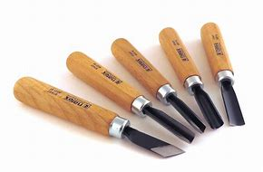
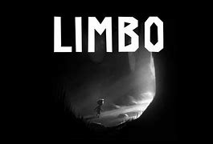
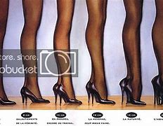
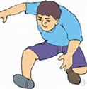

= eco 2020-06-06
:toc:

---

== Social distancing and prostitution(卖淫；为娼；当男妓) 词汇解说

( eco 2020.6.6 / Europe / Germany: Social distancing and sex work )

Germany *helps* sex workers (*idled*（尤指暂时地）关闭工厂，使（工人）闲着;混时间；闲荡；无所事事 by covid-19)

But they *are still much worse off* （比以前或其他人）更穷，更不愉快，更差 than before the pandemic

Jun 4th 2020 | BERLIN

- prostitution : /ˌprɑːstɪˈtuːʃn/ n. the work of a prostitute 卖淫；为娼；当男妓 / *~ of sth* ( formal ) the use of your abilities on sth of little value 才能的滥用（或糟蹋） +
-> 前缀pro-表“向前，在前”；词根stit-表“站、立”，如constitute（组成，本义“站在一起”）；所以该词本义为“向前站，站于人前”，含有站在人面前，供人挑选的意味。

- *be worse off* : to be poorer, unhappier, etc. than before or than sb else （比以前或其他人）更穷，更不愉快，更差 +
-> The increase in taxes means that *we'll be £30 a month worse off than before*. 税收的增加意味着我们将比以前每月少挣30英镑。

- *be better/worse off (doing sth)* : to be in a better or worse situation （做某事）会较好╱较糟 +
-> *She's better off* without him. 他不在身边她更快乐。 +
-> *We can't be any worse off* than we are already.
我们的状况已经糟得不能再糟了。

THE EVENING 晚上；傍晚 sun *is beating down on* （阳光）强烈照射，曝晒 a small crowd  人群；观众 *gathered* in Schöneberg, a district of Berlin, *to mark* 纪念；庆贺 the 45th International Whores’  娼妓；妓女 Day. But Isabelle, a Macedonian 马其顿的 transgender(a.)变性（者）的；易性癖（者）的；易装癖（者）的 prostitute  卖淫者；妓女；男妓, *is* gloomy 忧郁的；沮丧的；无望的. “I *remember* how it was before,” she says. Cis 独立国家联合体 women *walked the streets* north of the railway bridge, trans 跨性别的 women *to* the south. Not these days. “I *feel depressed*,” says Isabelle. “It’s our job, you know?” Colleagues 同事；同僚 *describe* overbearing 专横的；飞扬跋扈的 police, price-gouging 价格欺骗 哄抬物价 hotels /and clients *seeking* outrageous 骇人的；无法容忍的;反常的；令人惊讶的 “corona-discounts” 优惠，折扣.

- *beat down (on sb/sth)* : if the sun beats down it shines with great heat （阳光）强烈照射，曝晒

- whore : /hɔːr/ ( old-fashioned ) a female prostitute 娼妓；妓女 / ( taboo ) an offensive word used to refer to a woman who has sex with a lot of men 乱搞男女关系的女人；破鞋 +
=> 来自古英语hore,妓女，来自PIE*ka,爱，喜欢，渴望，词源同cherish,charity,caress,委婉语。比较urine.

- CIS : abbr. /ˌsiː aɪ ˈes/ *Commonwealth of Independent States* (a group of independent countries that were part of the Soviet Union until 1991) 独立国家联合体，独联体（由1991年之前的苏联主权国家组成）

- *Trans woman* : A *trans woman* (sometimes *trans-woman* or *transwoman*) is a male-to-female (MTF) transgender person with a female gender identity. The label of transgender woman is not interchangeable with that of transsexual woman, although the two are often combined or mistaken for the same thing.  +
跨性别女性(英语：Transwoman / Trans woman / Trans-woman)，或跨性别女人、跨性女、跨女，意旨男跨女(英语：MTForM2F) **出生时生理性别为男性；性别认同为女性，由男性转变为女性**的跨性别者。 +
"跨性别"人群,是属于少数人群，在国际上通常与"同性恋"人群（包括男同与女同），"双性恋"人群，合称为 LGBT 人群（*Lesbian， Gay，Bisexual /and Transgender* ）。 +
**跨性别（Transgender）通常是指一个人在心理上无法认同自己与生俱来的生理性别，相信自己应该属于另一种性别。跨性别这个词是个集合名词，它并不像LGBT中的LGB一样单指性取向**，它涉及到各种与性别角色部分或全部逆转有关的个体、行为以及相关群体。不过，对于跨性别这个词的定义问题还有很多争议。

- gouge : /ɡaʊdʒ/ ( NAmE ) to force sb to pay an unfairly high price for sth; to raise prices unfairly 敲（某人）的竹杠；（向某人）诈骗钱财，漫天要价 / *~ sth (in sth)* to make a hole or cut in sth with a sharp object in a rough or violent way 凿 /n. a sharp tool for making hollow areas in wood 凿子 +
=> 来自拉丁语gulbia, 凿。可能进一步来自PIE*skel, 砍，切，词源同scale, coup. 字母l软化u. +
-> *Price gouging* is widespread. 漫天要价的情况普遍存在。 +

Few industries *have been [as] pummelled 连续猛击；反复拳打；捶打 by covid-19 [as]* sex work, which in Germany *is* legal 法律允许的；合法的 and regulated （用规则条例）约束，控制，管理. Like many workplaces, brothels 妓院 *had to close* in March. Yet although massage 按摩；推拿 parlours （专营某种商品或业务的）店铺 and nail 指甲；趾甲 salons 美发厅；美容厅；高级服装店; 沙龙  *have reopened*, prostitutes 娼妓 *have been left in limbo*(n.)（尤指因等待他人作决定）处于不定状态. Some, such as Undine de Rivière in Hamburg 汉堡（德国城市）, *are innovating* 引入（新事物、思想或方法）；创新；改革 with hands-off 不介入的；放手的 services(n.) like fetish(n.)迷恋；癖;（从某物获得性快感的）恋物 videos or erotic 性欲的；性爱的；色情的-hypnosis 催眠状态 recordings 录制的音像；录音；录像. But *it* is hard *to make a living* that way, and few *have the skills* to try. Many migrants from eastern Europe, who *are thought to make up* 形成；构成 more than half of Germany’s 400,000-1m sex workers, *went home* before the borders *closed*.

- pummel : /ˈpʌml/ v. to keep hitting sb/sth hard, especially with your fists (= tightly closed hands) 连续猛击；反复拳打；捶打 +
=> 来自pommel拼写变体，来自pommel,圆球，圆鞍，引申词义连续猛击，捶打。 +
-> *He pummelled the pillow* with his fists. 他用双拳不停地捶打枕头。

- brothel : /ˈbrɑːθl/ ( especially in NAmE *bor·dello* ) a house where people pay to have sex with prostitutes 妓院 +
=> 来自break的比喻义，原指堕落的人，后指妓女，最后指妓女呆的地方。

- massage => 来自法语masser,揉，捏，来自PIE*mag,揉，捏，词源同make,mass.引申词义按摩。 +

- parlour : ( NAmE *par·lor* ) /ˈpɑːrlər/ n. ( old-fashioned ) a room in a private house for sitting in, entertaining visitors, etc. （私人住房的）起居室，客厅 / ( in compounds 构成复合词 ) ( especially NAmE ) a shop/store that provides particular goods or services （专营某种商品或业务的）店铺 +
-> *a beauty/an ice cream parlour* 美容院；冷食店 +

- limbo : /ˈlɪmboʊ/  n. [ Using. ] a situation in which you are not certain what to do next, cannot take action, etc., especially because you are waiting for sb else to make a decision （尤指因等待他人作决定）处于不定状态 +
=> 词源不详，可能来自limber, 柔软的，灵活的，用来指西印度群岛的一种舞蹈，舞者需后仰，且越来越低，引申词义处于不定状态。灵薄狱（limbo），意思是“地狱的边缘”，指天堂与地狱之间的区域。电影《盗梦空间》中，limbo被译成了“迷失域”，指的是潜意识的边缘。 +
-> His life seemed *stuck in limbo* ; he could not go forward and he could not go back. 他的生活好像陷入了不知所措的境地，进退两难。 +

- fetish : n. ( usually disapproving ) the fact that a person spends too much time doing or thinking about a particular thing 迷恋；癖 /
the fact of getting sexual pleasure from a particular object （从某物获得性快感的）恋物 / an object that some people worship because they believe that it has magic powers 奉若神明之物；物神 +
=> 来自葡萄牙语feitico, 有魔力的物品，护身符。来自词根fact, 做，制造，词源同do, fact. 原为葡萄牙海员出海时所携带的护身符。后词义引申为神物，癖好，特指心理上的依恋。 +
-> She *has a fetish about cleanliness*. 她有洁癖. +

Others *have been forced* underground. Emma, a recent arrival 到达者；抵达物 from America, *got* a tongue-lashing 斥责; 呵斥 from two regulars 常客；老主顾 (she *suggested* meeting(v.) after the ban *took effect*). “I’*m trying to keep food on the table*,” she says. Some *have* drug habits *to feed* 满足（需要、愿望、欲望等）, or families abroad *to support*. The state *has offered* one-off 一次性的；非经常的 grants （政府、机构的）拨款,补助金 of *up to* €9,000 ($10,000) *to* freelances 自由职业者, and [unlike in most countries] sex work *is covered*. But foreign prostitutes *are typically ineligible* 不合格的；不符合资格的 and many others *do not know* how *to apply*, or *do not want to*, says Andrea Hitzke of the Dortmund 德国城市名 Midnight Mission advice centre 咨询中心. Most *are* self-employed, and so *cannot get* furlough （尤指在国外服役士兵的）休假（许可）;（通常因发不出工资而给的）准假 pay. Lobby 游说团体 groups like the Professional Association for Erotic and Sexual Services (BesD) *have set up funds* for sex workers *facing* penury 贫困；贫穷.

-  feed : v. [ VN ] to satisfy a need, desire, etc. and keep it strong 满足（需要、愿望、欲望等） +
-> For drug addicts, the need *to feed the addiction* takes priority over everything else. 对于吸毒者来说满足毒瘾胜过一切。

- furlough : /ˈfɜːrloʊ/ => 来自荷兰语。fur-, 同per-,完全的，-lough, 爱，许可，许假，词源同love, leave.

`主` Politicians who *think* legalisation 合法化；正当化 *fosters* 促进；助长；培养；鼓励;代养，抚育，照料（他人子女一段时间） trafficking 非法交易（尤指毒品买卖） and violence `谓` *spot* 看见；看出；注意到；发现 an opportunity. In May 16 MPs *called for* Germany *to adopt* the “Nordic” model, which *criminalises* （通过新的法律）使不合法，使非法;把…当罪犯对待 the buying, rather than the selling, of sex. Many prostitutes *hate* this idea, since it *pushes them into the shadows*. Sex-worker groups *want* the state *to allow them to work again*.

- foster => 来自food,喂养，食物。

- 那些认为"卖淫合法化,会助长人口贩卖和暴力"的政客, 发现了一个机会。5月16日，国会议员呼吁德国采用“北欧”模式，即将买卖性行为, 定性为是"犯罪"，而不是"出售性行为"。

The BesD’s proposed hygiene 卫生 code *would ban* prostitutes *from* kissing(v.) or other “oral 用口的；口腔的；口服的 services”, *oblige* （以法律、义务等）强迫，迫使 them *to wear gloves* （分手指的）手套 during certain acts /and *to keep their heads* a forearm’s 前臂 distance *from* their clients’ at all times. Face-masks *would be* obligatory(a.)（按法律、规定等）必须的，强制的. Customers *would have to leave* contact details, perhaps in sealed envelopes. Similar rules *will apply* in Austria 奥地利 if its brothels 妓院 *reopen* on July 1st, *as planned*. “It’s not very sexy 性感的;富有魅力的；迷人的；有吸引力的,” *admits* Ms de Rivière. “But it’s necessary.”

---

== Social distancing and prostitution

Germany helps sex workers idled by covid-19

But they are still much worse off than before the pandemic

Jun 4th 2020 | BERLIN

THE EVENING sun is beating down on a small crowd gathered in Schöneberg, a district of Berlin, to mark the 45th International Whores’ Day. But Isabelle, a Macedonian transgender prostitute, is gloomy. “I remember how it was before,” she says. Cis women walked the streets north of the railway bridge, trans women to the south. Not these days. “I feel depressed,” says Isabelle. “It’s our job, you know?” Colleagues describe overbearing police, price-gouging hotels and clients seeking outrageous “corona-discounts”.

Few industries have been as pummelled by covid-19 as sex work, which in Germany is legal and regulated. Like many workplaces, brothels had to close in March. Yet although massage parlours and nail salons have reopened, prostitutes have been left in limbo. Some, such as Undine de Rivière in Hamburg, are innovating with hands-off services like fetish videos or erotic-hypnosis recordings. But it is hard to make a living that way, and few have the skills to try. Many migrants from eastern Europe, who are thought to make up more than half of Germany’s 400,000-1m sex workers, went home before the borders closed.

Others have been forced underground. Emma, a recent arrival from America, got a tongue-lashing from two regulars she suggested meeting after the ban took effect. “I’m trying to keep food on the table,” she says. Some have drug habits to feed, or families abroad to support. The state has offered one-off grants of up to €9,000 ($10,000) to freelances, and unlike in most countries sex work is covered. But foreign prostitutes are typically ineligible and many others do not know how to apply, or do not want to, says Andrea Hitzke of the Dortmund Midnight Mission advice centre. Most are self-employed, and so cannot get furlough pay. Lobby groups like the Professional Association for Erotic and Sexual Services (BesD) have set up funds for sex workers facing penury.

Politicians who think legalisation fosters trafficking and violence spot an opportunity. In May 16 MPs called for Germany to adopt the “Nordic” model, which criminalises the buying, rather than the selling, of sex. Many prostitutes hate this idea, since it pushes them into the shadows. Sex-worker groups want the state to allow them to work again.

The BesD’s proposed hygiene code would ban prostitutes from kissing or other “oral services”, oblige them to wear gloves during certain acts and to keep their heads a forearm’s distance from their clients’ at all times. Face-masks would be obligatory. Customers would have to leave contact details, perhaps in sealed envelopes. Similar rules will apply in Austria if its brothels reopen on July 1st, as planned. “It’s not very sexy,” admits Ms de Rivière. “But it’s necessary.”

---

== --------------------------

---

== 背景知识: 塔勒布与阿斯内斯唇枪舌剑, 资管行业反思"极端"风险

"黑天鹅"之父塔勒布（Nassim Nicholas Taleb）和华尔街大佬、管理规模超过千亿美元的AQR资本创始人阿斯内斯（Cliff Asness）在社交网络上展开激烈辩论，聚焦"尾部风险对冲策略"的性价比。

|===
|策略|Cliff Asness
/ 风险平价策略 +
/ AQR资产管理机构|Nassim Nicholas Taleb ("黑天鹅"作者)  +
/ 尾部风险对冲策略 +
/尾部风险对冲基金Universa Investments

|
|目前使用"风险平价策略"的基金规模总和, 超过5000亿美元。
|

|方式
| - Asness的主打策略 --"风险平价策略"。这一策略的根本配置思想是按照资产的风险来构建组合。*传统股债组合中，假定资产的40%配给股票，60%配给债券，虽然组合资产的大部分是债券，由于股票的风险远高于债券，组合的风险仍然由股票主导。 +
风险平价策略的核心思想是，一个组合中，不同资产对风险的贡献相等。实际配置中，股票的占比远低于债券，因为股票的风险远高于债券。*
| - Universa Investments 并未公布"尾部风险对冲策略"的细节。 +
不过业内人士认为，其所使用的尾部风险对冲策略, 通过使用"指数期权"来对冲极端事件对"组合"的冲击。例如，购买一种期权, 在指数下跌30%对组合提供保护，相当于给组合买一个"保险"，将在市场深跌的时候将触发"赔付"。

|缺陷
|- **风险平价基金, 常常称为"全天候基金"，**即在不同市场环境下都能赚钱。不过事实上，全天候基金却很难"全天候"赚钱。 +
*风险平价策略基于一个前提假设。资产之间风险和收益是相互独立的，不同资产不会齐涨齐跌。事实上，这种假设在现实中常常失效。在"极端"市场环境下，不同资产往往齐跌。风险平价策略要求的独立性消失了。*

- 在全球进入零利率环境下，风险平价策略如果不使用高杠杆，则收益预计会大幅降低。*如果使用高杠杆，则背离了这一策略作为稳健收益产品的初衷。*
| - 尾部风险对冲策略成本太高，不适合大资金

|===

---

== Is there a role  影响程度；作用 for options 购买权; 出售权; 期权 insurance in equity （公司的）普通股 portfolios 投资组合? 词汇解说

( eco 2020.6.6 / Finance & economics / Buttonwood: The options gambit )

Nassim Taleb and Cliff Asness, two high-level 级别高的；高层的 thinkers on finance, *disagree*

Jun 4th 2020 |

- role : the degree to which sb/sth is involved in a situation or an activity and the effect that they have on it 影响程度；作用 +
-> a key/vital role 关键╱至关重要的作用

IN 1993 Nigel Short, a British chess 国际象棋 player, *became* an unlikely TV star. This was a consequence of the staging （发展或进展的）时期，阶段，状态;上演；举办；举行 in London of a chess match between Mr Short and Garry Kasparov, the world’s best player. Channel 4 *carried* 刊登；登载；播出；报道 highlights  最好（或最精彩、最激动人心）的部分. *Sustaining* 使保持；使稳定持续;维持（生命、生存） interest *was* a challenge, though. `主` Two men *hunched* 弓身；弓背；耸肩 over a board 板；（尤指）木板,棋盘 `系` *is not* a great spectacle  景象；场面；奇观;精彩的表演；壮观的场面. A bigger problem *was* the baffling 使困惑；难住 complexity of top-level chess. Even a club-level player *could not easily work out* 计算；计算出 who was winning.

- hunch : /hʌntʃ/ v. to bend the top part of your body forward and raise your shoulders and back 弓身；弓背；耸肩 +
=> 英语中，hunch的本意是“大块、肉峰”，可以用来表示驼背者（hunchback）的驼背。西方人有一种迷信，认为驼背者与魔鬼由特殊关系，拥有神秘的预感能力，能够未卜先知。因此，在英语中，have/get a hunch就表示“有一种预感”。 +
-> She leaned forward, *hunching over the desk*. 她身体前倾，伏在写字台上。 +

- baffle : /ˈbæfl/ v. to confuse sb completely; to be too difficult or strange for sb to understand or explain 使困惑；难住 / n. ( technical 术语 ) a screen used to control or prevent the flow of sound, light or liquid （控制声、光、液体等流动的）隔板，挡板，反射板 +
=> 拟声词。
-> His behaviour *baffles(v.) me*. 他的行为使我难以琢磨。 +

- 1993年，英国棋手奈杰尔·肖特(Nigel Short)出人意料地变成了电视明星。这是肖特先生和世界上最好的棋手加里·卡斯帕罗夫, 在伦敦举行国际象棋比赛的最终结果一战。第四频道播放了其精彩片段。不过，要保持住兴趣, 是一个挑战。两个人弓腰坐在棋盘前, 不是一个大场面。更大的问题在于顶级国际象棋具有令人难解的复杂性。即使是俱乐部级别的玩家, 也不容易知道谁会赢。

This *brings us to* a more recent battle of the brainboxes  脑瓜灵的人. Nassim Nicholas Taleb and Cliff Asness, two high-level thinkers on finance, *had* a forthright(a.)直率的；直截了当的；坦诚的 exchange 交换；互换；交流；掉换 of views on social media about the efficacy （尤指药物或治疗方法的）功效，效验，效力 of *buying* options *to hedge* 采取保护措施（尤指为避免损失金钱）;在（田地等周围）植树篱；用树篱围住 a portfolio （个人或机构的）投资组合，有价证券组合 of risky shares. Mr Taleb, author of “The Black Swan” and adviser 顾问；提供意见者 to Universa Investments, an options 期权 specialist 专家, *says* it is the only robust way. Mr Asness, founder of AQR Capital Management, *says* there *are* better methods.

- forthright : /ˈfɔːrθ-raɪt/ a. direct and honest in manner and speech 直率的；直截了当的；坦诚的 +
=> forth, 向前的。right, 立刻，马上。 +
->  a woman of *forthright views* 观点明确的女子

- 他们就"购买期权以对冲风险股票投资组合"的有效性，在社交媒体上坦率地交换了看法。

Mr Asness’s case *is backed by* empirical 以实验（或经验）为依据的；经验主义的 work by AQR eggheads 学究,理论家；书呆子, the gist  要点；主旨；大意 of which *is that* people *overpay 付款过多；多付报酬 for* insurance in the long haul 旅行的距离；旅程. Not yet proven 被证明的；已证实的, *is* the judgment on Mr Taleb’s view. Everybody *loves* a highbrow(a.)关于正统艺术（或文化）思想的；对正统的艺术（或文化）感兴趣的 Twitter row 严重分歧；纠纷; 吵架；争吵. The grandmasters 大师；最高段的棋手 *will debate* the subtleties 细小但重要的地方；微妙之处. But even the club-level investor *can take something away*. It is a spur 鞭策；激励；刺激；鼓舞 *to thinking about* how *to build* sturdier 结实的；坚固的(比较级) portfolios.

- gist : n. *~ (of sth)* the main or general meaning of a piece of writing, a speech or a conversation 要点；主旨；大意 +
=> 来自拉丁文jacet, 躺，来自词根jac, 扔，投，掷，词源同project, jet. 引申义位于其中的关键，主旨。

- highbrow : ( sometimes disapproving ) concerned with or interested in serious artistic or cultural ideas 关于正统艺术（或文化）思想的；对正统的艺术（或文化）感兴趣的
SYN intellectual +
=> high,高，brow,眉毛。来自古代面相学，认为长高眉毛的人天生有艺术修养或艺术口味，虽然科学证明这一说法毫无根据，但是这个词却流传了下来。比较诗句“高帝子孙尽隆准，龙种自与常人殊”。 +
-> *highbrow newspapers* 格调高雅的报纸

- sturdy : /ˈstɜːrdi/ a. ( of an object 物品 ) strong and not easily damaged 结实的；坚固的 / ( of people and animals, or their bodies 人、动物或身体 ) physically strong and healthy 强壮的；健壮的 / not easily influenced or changed by other people 坚决的；坚定的；顽强的 +
=> 词源不详，可能最终来自 PIE*sta,站立，词源同 stand,store.引申词义结实的，坚固的。 +
-> *a sturdy pair of boots* 一双结实的靴子 +
-> The village *has always maintained a sturdy independence*. 这个村子始终顽强地保持着独立。

- 阿斯尼斯的案例得到了AQR理论家的实证研究的支持，其要点是人们在长期内会为保险支付过高的费用。对塔勒布观点的判断尚未得到证实。每个人都喜欢推特上的有学问的争吵。大师们将讨论其中的微妙之处。但即便是俱乐部级别的投资者也能从中受益。这促使人们思考如何建立更稳固的投资组合。

*Start*, 正如 as even grandmasters *must*, *with an opening*: you *buy* a broad index of shares. You *are now exposed to* the volatility 挥发性,波动性 of equity （公司的）普通股 prices. Stocks *may fall sharply* in downturns(n.)（商业经济的）衰退，下降，衰退期. You *might usefully(ad.)有效地;好的；合格的 balance your portfolio* with government bonds. When recession  经济衰退；经济萎缩 *hits*, these *tend to rise [in price]* [当…时 as interest rates 利率 *fall*]. Bonds *are* thus a form of insurance 保险. And normally 通常；正常情况下 , at least, they *pay* the insurance-holder a small return: the *yield* 产量；产出；利润.

- 开局就像大师们必须做的那样:买入一个大盘指数。你现在面临着股票价格的波动。在经济衰退时, 股市可能会大幅下跌。你可以用政府债券来平衡你的投资组合。当经济衰退来袭时，随着利率的下降，政府债券的价格往往会上升。因此，债券是一种保险形式。通常情况下，他们至少会向保险持有人支付一小部分回报:收益率。

- 如果股市行情看涨，股票市场收益率提高，资金在利润的引导下必定从债券市场转向股票市场。反之亦然。 +
**一旦经济不好，债券往往是最好的避险工具， 从而导致购买者众多，由于供需关系的原因，使债券价格上升，而债券收益率下降。**股票价格由于经济下跌, 肯定也会下降. +
如果利率升高，由于债券每一期的利息和最后偿还的本金是固定的，折算到现在的钱就变少了。或者，换一个角度考虑，**银行加息了，你啥都不干，把钱直接存在银行的收益变高了，债券的相对吸引力就下降了，自然价格就下来了。**所以，如果我们是投资债券的，就要格外关注市场利率。如果判断未来是大概率加息，那么就应当持现金为主，卖出债券。如果判断未来是大概率降息，那么此时就是入手债券的好时机。 +
另一方面，其实**国家在调控利率的时候，很重要的一个工具就是债券。 +
-> 如果央行需要加息，那么就要收紧货币，让市场上的资金面收紧。怎么办呢，那就向市场上发行债券，市场上的钱就会被央行收回，自然利率就升高了。 +
-> 如果需要降息，那么就用央行里的钱去购买市场上的债券，市场上的钱变多了，利率自然也就降下来了。**

A recent paper from AQR *looked at* the worst periods for a “60/40 portfolio” (60% equities; 40% bonds) since 1971 *to see* if options-based insurance *did any better*. Unsurprisingly, options-protection *pays off  (某行动) 取得成功; 带来好结果;还清 handsomely* in crashes, like the one in February-March this year. Indeed an options-protected portfolio *did better* than 60/40 in bad periods *lasting* up to three years. But equity prices *tend to recover from crashes eventually*. And over time the insurance premiums 保险费 *demanded* by options sellers *add up to* a drag 累赘；拖累；绊脚石 on performance. By the ten-year horizon, 60/40 *trumps* 赢；胜过；打败;出王牌赢（牌） the options-based portfolio. Other risk-mitigation 减轻；缓解 strategies *did even better* than 60/40 over time 久而久之; 慢慢地，渐渐地.

- AQR最近的一篇论文着眼于自1971年以来, “60/40投资组合”(60%的股票；40%的债券)在最糟糕的时期，是否"基于期权的保险"会表现更好。不出所料，期权保护在股市崩盘中获得了丰厚回报，就像今年2 - 3月的那次。事实上，在长达三年的不景气时期，期权保护型投资组合的表现优于60/40投资组合。但是股票价格最终会从崩溃中恢复过来。随着时间的推移，期权卖家要求的保险费加起来会拖累业绩。从十年来看，60/40投资组合胜过基于期权的投资组合。其他风险缓解策略甚至比60/40做得更好。

On AQR’s *reckoning*, then, *passively 被动地；顺从地；消极地 buying* equity options *has been* a relatively dear(a.)昂贵；价格高 way of *mitigating 减轻；缓和 risk* over long periods. This is valuable knowledge. It also *makes intuitive 凭直觉得到的；直觉的;易懂的；使用简便的 sense*. When you *buy* home insurance 房屋保险；住家险, you *know* the odds （事物发生的）可能性，概率，几率，机会 *are stacked* 使成叠（或成摞、成堆）地放在…；使码放在… in the insurer’s 承保人；保险公司 favour. The firms *are* in it *to make a profit*. Yet that *does not make* buying insurance foolish: it *allows* you *to take on* 决定做；同意负责；承担（责任） the risk of a big mortgage 按揭（由银行等提供房产抵押借款）；按揭贷款.

- mitigate :  /ˈmɪtɪɡeɪt/  v. [ VN ] ( formal ) to make sth less harmful, serious, etc. 减轻；缓和 +
=> 来自拉丁语mitigare,成熟，变软，温顺，来自mitis,成熟的，柔软的，-ig,做，词源同agent.引申词义减轻，缓和。

- insurer : a person or company that provides people with insurance 承保人；保险公司

- *take sth/sb on* : to decide to do sth; to agree to be responsible for sth/sb 决定做；同意负责；承担（责任） / (of a bus, plane or ship 公共汽车、飞机或船只) to allow sb/sth to enter 接纳（乘客）；装载 +
-> *I can't take on* any extra work. 我不能承担任何额外工作。
-> *We're not taking on* any new clients at present. 目前我们不接收新客户。

- mortgage : /ˈmɔːrɡɪdʒ/ n.v. ( also informal also ˌhome ˈloan ) a legal agreement by which a bank or similar organization lends you money to buy a house, etc., and you pay the money back over a particular number of years; the sum of money that you borrow 按揭（由银行等提供房产抵押借款）；按揭贷款 +
来自古法语mort gage,死亡承诺，来自mort,死亡，词源同mortal,gage,承诺，词源同engage,wage.比喻用法，即直到死亡也会履行的承诺。用于指古代的抵押资产以换取借款的经济行为，即现代意义上的按揭。 +
 -mort-死 + -gage-(承诺,抵押) → 抵押人(mortgagor)到期如果不能清还贷款,其被抵押的财产就会死(丧失)

- 根据AQR的估算，被动地购买股票期权, 是"实现长期降低风险"的一种相对昂贵的方式。这是有价值的知识。这也很直观。当你购买家庭保险时，你知道保险公司更可能赚钱。因为保险公司来做这个生意就是为了盈利。然而，这并不意味着你购买保险的行为就是愚蠢的:它能让你承担巨额抵押贷款的风险。

So *might* financial-options 金融期权 insurance *sometimes make sense*, too? In some cases, only a direct form of insurance *will do*. *Take* a hypothetical  假设的；假定的 producer of beef. He *might expect* an annual return 年利润，岁入，年回报 of 10% on his business over ten years. But those returns *are* volatile. Their sequence *matters*. If beef prices *were* to slump(v.)（价格、价值、数量等）骤降，猛跌，锐减; 重重地坐下（或倒下） for two straight 连续的；不间断的 years, say, it *would mean* bankruptcy. `主` The cost of *insuring* his output *using* options `谓` *might lower* his average yearly return to, say, 6%. But he *might judge that 宾补 worthwhile* to be sure he would stay in business 维持业务. A similar logic *applies to* a retiree 退休人员；退休者 *living off* 靠…过活；依赖…生活 a lump sum 一次性总付清的钱款. A big drop in share prices *would cut deeply into* her income. She *might not be able to wait for* other risk-mitigation methods *to come good*. Nor *is* there a guarantee 保证；担保 that they *would work* as well as in the past. Bond yields 债券市场利息率,债券收益 *are close to* all-time （用于比较或表示好坏程度）空前的，创纪录的，一向的 lows, for instance, *implying* 含有…的意思；暗示；暗指;说明；表明 less scope for them *to pay off*  (某行动) 取得成功; 带来好结果 if the stockmarket *takes* another lurch(n.v.)突然前倾（或向一侧倾斜）;（突然感到恐怖或激动时心或胃）猛地一跳（或动） downwards.

- hypothetical : adj.  /ˌhaɪpəˈθetɪkl/ based on situations or ideas which are possible and imagined rather than real and true 假设的；假定的 +
=>  hypo-不足,低,下 + thesis放置(sis略) + -tical形容词词尾 同源词：thesis +
-> *a hypothetical question/situation/example* 假定的问题╱情况╱例子

- *lump sum* : an amount of money that is paid at one time and not on separate occasions 一次总付的钱款

- all-time : a. [ only before noun ] (used when you are comparing things or saying how good or bad sth is) of any time （用于比较或表示好坏程度）空前的，创纪录的，一向的 +
-> Profits are *at an all-time high/low*. 利润空前地高╱低。

- lurch :  /lɜːrtʃ/ v. to make a sudden, unsteady movement forward or sideways 突然前倾（或向一侧倾斜） / if your heart or stomach lurches , you have a sudden feeling of fear or excitement （突然感到恐怖或激动时心或胃）猛地一跳（或动） +
=> 来自中古英语lurch,一种棋盘游戏，来自luren,等待，潜藏，埋伏，词源同lour,lurk.比较poke. +
-> Their relationship seems *to lurch from one crisis to the next*. 他们的关系好像坎坷不平，危机不断。 +

- 那么，有时使用金融期权保险, 也同样有意义吗? 在某些情况下，只有直接形式的保险才行。假设一个牛肉生产商。他可能期望他的生意在十年内每年能有10%的回报。但这些回报是不稳定的。他们的顺序很重要。如果牛肉价格连续两年下跌，那就意味着破产。使用期权来保证他的产出的成本可能会把他的平均年回报率降低到6%。但他可能会认为这是值得的，因为这能使他确保业务能维序下去。类似的逻辑也适用于一次性领取养老金的退休人员。股价的大幅下跌会大大减少她的收入。她可能无法等待其他减轻风险的方法出现。也不能保证它们会像过去那样有效。例如，债券收益率接近历史最低水平，这意味着如果股市再次下跌，他们的回报空间就会缩小。

The price of equity options *varies  （根据情况）变化，变更，改变 greatly* over time. It *can make sense* to use them when they are relatively cheap, says Vineer Bhansali of LongTail Alpha, a firm that *specialises in* risk mitigation. In principle 大体上，原则上, more judicious 审慎而明智的；明断的；有见地的 options buying -- *finding* those with the best potential payoff 收益 for the price, including options on other financial assets -- *could lower* the cost of insurance. It is *a big ask* 难以做到的事情；棘手的事 for the club-level investor, though *it may be possible* for grandmasters.

Complex situations *can befuddle* 使迷惑 even the best minds. After a few dozen moves(n.) in one of the Kasparov-Short games, the grandmaster pundits  行家；权威；专家 *agreed that* Mr Short *had lost*. As he *rose* 起床；起立；站起来 from the board 棋盘, they *thought* he *had conceded* 承认（比赛、选举等失败）;承认（某事属实、合乎逻辑等）. But no: the game was a draw 平局；和局；不分胜负.

- pundit  /ˈpʌndɪt/ => 来自印度语pandit,智者，大师。梵文学者 +

---

==  Is there a role for options insurance in equity portfolios?

Nassim Taleb and Cliff Asness, two high-level thinkers on finance, disagree

Jun 4th 2020 |

IN 1993 Nigel Short, a British chess player, became an unlikely TV star. This was a consequence of the staging in London of a chess match between Mr Short and Garry Kasparov, the world’s best player. Channel 4 carried highlights. Sustaining interest was a challenge, though. Two men hunched over a board is not a great spectacle. A bigger problem was the baffling complexity of top-level chess. Even a club-level player could not easily work out who was winning.

This brings us to a more recent battle of the brainboxes. Nassim Nicholas Taleb and Cliff Asness, two high-level thinkers on finance, had a forthright exchange of views on social media about the efficacy of buying options to hedge a portfolio of risky shares. Mr Taleb, author of “The Black Swan” and adviser to Universa Investments, an options specialist, says it is the only robust way. Mr Asness, founder of AQR Capital Management, says there are better methods.

Mr Asness’s case is backed by empirical work by AQR eggheads, the gist of which is that people overpay for insurance in the long haul. Not yet proven, is the judgment on Mr Taleb’s view. Everybody loves a highbrow Twitter row. The grandmasters will debate the subtleties. But even the club-level investor can take something away. It is a spur to thinking about how to build sturdier portfolios.

Start, as even grandmasters must, with an opening: you buy a broad index of shares. You are now exposed to the volatility of equity prices. Stocks may fall sharply in downturns. You might usefully balance your portfolio with government bonds. When recession hits, these tend to rise in price as interest rates fall. Bonds are thus a form of insurance. And normally, at least, they pay the insurance-holder a small return: the yield.

A recent paper from AQR looked at the worst periods for a “60/40 portfolio” (60% equities; 40% bonds) since 1971 to see if options-based insurance did any better. Unsurprisingly, options-protection pays off handsomely in crashes, like the one in February-March this year. Indeed an options-protected portfolio did better than 60/40 in bad periods lasting up to three years. But equity prices tend to recover from crashes eventually. And over time the insurance premiums demanded by options sellers add up to a drag on performance. By the ten-year horizon, 60/40 trumps the options-based portfolio. Other risk-mitigation strategies did even better than 60/40 over time.

On AQR’s reckoning, then, passively buying equity options has been a relatively dear way of mitigating risk over long periods. This is valuable knowledge. It also makes intuitive sense. When you buy home insurance, you know the odds are stacked in the insurer’s favour. The firms are in it to make a profit. Yet that does not make buying insurance foolish: it allows you to take on the risk of a big mortgage.

So might financial-options insurance sometimes make sense, too? In some cases, only a direct form of insurance will do. Take a hypothetical producer of beef. He might expect an annual return of 10% on his business over ten years. But those returns are volatile. Their sequence matters. If beef prices were to slump for two straight years, say, it would mean bankruptcy. The cost of insuring his output using options might lower his average yearly return to, say, 6%. But he might judge that worthwhile to be sure he would stay in business. A similar logic applies to a retiree living off a lump sum. A big drop in share prices would cut deeply into her income. She might not be able to wait for other risk-mitigation methods to come good. Nor is there a guarantee that they would work as well as in the past. Bond yields are close to all-time lows, for instance, implying less scope for them to pay off if the stockmarket takes another lurch downwards.

The price of equity options varies greatly over time. It can make sense to use them when they are relatively cheap, says Vineer Bhansali of LongTail Alpha, a firm that specialises in risk mitigation. In principle, more judicious options buying—finding those with the best potential payoff for the price, including options on other financial assets—could lower the cost of insurance. It is a big ask for the club-level investor, though it may be possible for grandmasters.

Complex situations can befuddle even the best minds. After a few dozen moves in one of the Kasparov-Short games, the grandmaster pundits agreed that Mr Short had lost. As he rose from the board, they thought he had conceded. But no: the game was a draw.

