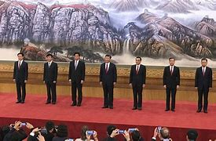
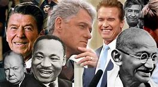
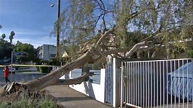
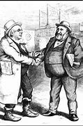
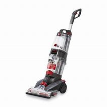
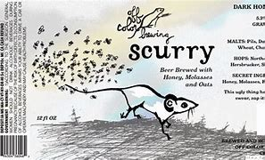
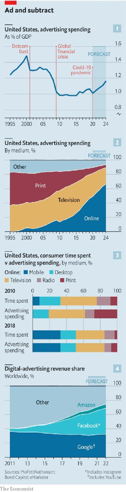

= eco 2020-06-27
:toc:

---

== Chaguan 词汇解说

(eco 2020-6-27 / China / Chaguan: A campaign with costs)

To China’s rulers, the cupidity(n.)贪心；贪婪 of officials *is a political crisis*

Corruption *is certainly bad*, but it once *emboldened* 使增加勇气；使更有胆量；使更有信心 Chinese power-holders *to take useful risks*

Jun 27th 2020 |

- cupidity : /kjuːˈpɪdəti/ => 丘比特的名字Cupid来自拉丁文Cupido，意思是“欲望、爱”，等于英语中的desire、love。英语单词cupidity与它同源，表示“贪婪、贪欲”。

- 对中国的统治者来说，官员的贪婪是一场政治危机 +
腐败当然是不好的，但它曾经鼓励中国的权力拥有者, 去冒有益的风险

IN CHINESE, AN official *sacked 开除；解雇；炒鱿鱼 for corruption* `谓` *is said to have “fallen off a horse”*. The phrase *rings 回响；响彻 with* the age-old satisfaction of *watching* the high and mighty 强而有力的 *plunge(v.) 使突然前冲（或下落）;使经历，使陷入（不快的事情） face-first into mud*.

- *plunge sb/sth into sth* : to make sb/sth experience sth unpleasant 使经历，使陷入（不快的事情）

- 在中国，一名因腐败而被解职的官员, 会被说成是“落马”。这句话带有一种拥有悠久历史的满足感，那就是看着高高在上的权贵, 脸朝下栽进泥里。

Eight years after *its launch by* President Xi Jinping, the largest anti-corruption campaign in Chinese history *remains wildly popular*, notably 尤其；特别;极大程度上；非常 because *it has unhorsed(v.)把人推(扔)下马 not just* light-fingered 惯扒窃的；惯偷的 Communist Party chiefs in villages, *but* big-city mayors 市长 and members of the Politburo （共产党的）政治局. More than 1.5m individuals *have been disciplined(v.)惩罚；处罚 for graft* 行贿；贿赂；受贿；赃款 since 2012, including both “tigers and flies” -- a phrase *favoured 较喜欢；选择 by* Mr Xi who *took power* that year. Still, a puzzle *lurks （尤指为做不正当的事而）埋伏，潜伏 within* that mood of public glee(n.)欢喜；高兴；幸灾乐祸 at *seeing* the haughty 傲慢的；自大的-but-dirty *brought(a.) low* 失去财富；丧失社会地位. The puzzle *is identified* 确认；认出；鉴定 in a thought-provoking 发人深省的；引人深思的 new book, “China’s Gilded 镀金的；涂金色的;富贵的；上层阶级的 Age: The Paradox 悖论 of Economic Boom and Vast Corruption”, by Yuen Yuen Ang of the University of Michigan.

- politburo : /ˈpɑːlɪt-bjʊroʊ/ the most important committee of a Communist party, with the power to decide on policy （共产党的）政治局 +
=> 来自俄罗斯语politbyuro,政治局，来自polit-,政治，词源同polity,-byuro,局，办公室，词源同bureau. +

- discipline : /ˈdɪsəplɪn/ v. *~ sb (for sth)* : to punish sb for sth they have done 惩罚；处罚

- graft : /ɡræft/ : n.v. [ U ] ( especially NAmE ) the use of illegal or unfair methods, especially bribery , to gain advantage in business, politics, etc.; money obtained in this way 行贿；贿赂；受贿；赃款 +
=> 来自PIE*gerbh, 刮，刻，切，词源同carve,graph. 用于植物学术语嫁接，即把切下来的一种植物移植到另一种植物上。俚语义行贿，即切下留作己用。比较 bribe.

- *be brought(a.) low* : ( old-fashioned ) to lose your wealth or your high position in society 失去财富；丧失社会地位

- 尽管如此，在公众看到傲慢但肮脏的人堕落而感到高兴的心情中，仍潜藏着一个谜。密歇根大学的Ang Yuen Yuen在发人深省的新书《中国的镀金时代:经济繁荣与腐败的悖论》中指出了这一谜。

To Chinese rulers, `主` the cupidity of the country’s 50m party functionaries 公职人员, civil servants 公务员 and local officials `系` *is a political crisis*. Shortly after *becoming party leader*, Mr Xi *declared that* corruption `系` *was “utterly destructive(a.) 引起破坏（或毁灭）的；破坏（或毁灭）性的 politically*, *shocking* people *to the core*” 直至核心；十足；透顶. *As* Ms Ang *notes*, the consensus 一致的意见；共识 among development agencies and scholars *is that* corruption *hurts* economic growth. Yet *it is not hard to find* ordinary Chinese *who miss(v.) some big tigers brought down for graft*. *Exploring* that puzzle, Ms Ang *lists* the achievements 成就；成绩；功绩 of Bo Xilai, the charismatic 有超凡魅力的；有号召力（或感召力）的 son of a revolutionary pioneer. As party secretary 党委书记 of Chongqing, Mr Bo *transformed* that giant inland city [*with* foreign investments and a debt-fuelled 举债发展的 construction boom], before *being purged 清除，清洗（组织中的异己分子） and jailed* in 2012.

- functionary : /ˈfʌŋkʃənərɪ/ N-COUNT A functionary is a person whose job is to do administrative work, especially for a government or a political party. 公职人员

- *to the core* : so that the whole of a thing or a person is affected 直至核心；十足；透顶
.. *She was shaken to the core* by the news. 这消息使她大为震惊。
.. He's a politician *to the core* (= in all his attitudes and actions) . 他是个十足的政客

- charismatic : /ˌkærɪzˈmætɪk/ => charis（魅力）+ma（名词后缀）→神授的魅力→领袖气质. 希腊语kharis（魅力） 同源词：Charis（卡里斯，希腊神话中的美惠三女神之一） +

Mr Bo *is accused of* taking(v.) gifts *ranging from* a villa in France *to* the fees for his son’s education at Harrow, a British boarding(n.)（学生的）寄宿 school 寄宿学校. But Chongqing *also remembers him for* new roads, airports, parks, hospitals and *housing(v.) 给（某人）提供住处 for* hard-up 手头拮据的; 没钱的 residents. The book *describes* other swashbuckling(a.)(尤指电影)表现惊险打斗的；有传奇历险情节的, risk-taking(a.) leaders *who were toppled 打倒；推翻；颠覆 for corruption* but *are still remembered fondly* 深情地；温情地；慈爱地. One such *is* Ji Jianye, who *transformed* several cities in the eastern province of Jiangsu, *earning the mostly admiring nickname* “Mayor Bulldozer 推土机”. To Ms Ang, their careers *reveal something important about* Chinese corruption, and *how it manages to be* both rampant(坏事)泛滥的；猖獗的;(植物)疯长的 and co-existent 同时共存的 with 40 years of rapid economic expansion.

-  swashbuckling : /ˈswɑːʃ-bʌklɪŋ/ a. ( especially of films/movies 尤指电影 ) set in the past and full of action, adventure, fighting with swords , etc. 表现惊险打斗的；有传奇历险情节的 +
=> 来自 swashbuckler,恃强凌弱的人，虚张声势的人，-ing,形容词后缀。拼写俗化。 +
swash : n. 虚张声势；泼水声；吓唬; vi. 飞溅；恐吓. buckler : v.防卫;小圆盾; n.戴在前臂或有可握着的短柄的小圆盾 +

- topple : /ˈtɑːpl/ v. to make sb lose their position of power or authority 打倒；推翻；颠覆 / to become unsteady and fall down; to make sth do this （使）失去平衡而坠落，倒塌，倒下 +
=> 来自 top,顶端，头部，-le,表反复。特殊用法或比喻用法，引申词义从顶部摔下，倒塌等。
.. a plot *to topple the President* 推翻总统的阴谋
.. The pile of books *toppled over*. 那一摞书倒了。 +

- bulldozer  /ˈbʊldoʊzər/ => bulldoze原本指的是足以放到一头公牛（bull）的剂量（doze），比喻采用鞭打、枪杀等野蛮手段来阻止黑人参加选举的行为，而bulldozer就是通过暴力威吓手段阻止黑人投票的白人，泛指欺凌者、威吓者。推土机出现后，人们用bulldozer一词来称呼它，因为推土机威力巨大，可以野蛮地推倒一切障碍，特别适合暴力拆迁等场合。 +

`主` *Arguing that* conventional measures 判断；衡量; 度量单位；计量标准 of corruption `系` *are* too crude 粗略的；简略的；大概的, Ms Ang “*unbundles*” 解绑 graft 行贿；贿赂；受贿；赃款 *into* four varieties  (同一事物的) 一些不同种类;品种. First there is `petty 小的；琐碎的；次要的 theft`. Perhaps *involving* a traffic policeman *demanding and *pocketing(v.)把…放进衣袋; 攫取；揩油；中饱私囊 a fine*  罚金；罚款, such corruption *poisons* economies. Then there is `grand theft`, eg, a dictator 独裁者 *looting （暴乱、火灾等后）打劫，抢劫，劫掠 the central bank*. That is also toxic(a.) 有毒的；引起中毒的 to economies. Third is `speed money`, as when a shopkeeper  （通常指小商店的）店主 *pays(v.) a bribe for a permit* (that *might otherwise never arrive*). Ms Ang *compares this to* a painkiller 止痛药 that *eases the agony* （精神或肉体的）极度痛苦 of bad governance *but cures nothing*. Then *comes* the variety （同一事物的）不同种类，多种式样 (that *most worries* Mr Xi): `access money`, or high-level bribes and favours(n.)帮助；好事；恩惠 *offered to* powerful officials and their families, *in return for* contracts or other privileges. Ms Ang *compares* this sort of corruption *to* steroids 类固醇. `Access money` *can promote* private investment and economic growth. That *helps explain* the popularity of some bent (当权者)不诚实的；不正派的 officials.

- variety : /vəˈraɪəti/ [ sing. ] *~ (of sth)* several different sorts of the same thing （同一事物的）不同种类，多种式样
.. He resigned *for a variety of reasons*. 他由于种种原因辞职了。

- speed money : Speed money is exactly what it means - *it speeds things along.*

- 她认为, 传统的对腐败的处理方式过于粗糙，她将贪污“拆分”成四种类型。 +
第一种是小偷小摸型。比如涉及交警索要罚款, 并将其据为己有，这种腐败会毒害经济。 +
第二种类型是重大盗窃，例如，一个独裁者掠夺中央银行。这对经济也是有害的。 +
第三种是speed money，比如店主为了获得许可证而行贿，否则这个许可证他可能永远得不到。Ang女士将其比作止痛药，可以缓解治理不善带来的痛苦，但却无法治愈该社会问题本身.  +
第四种就是习最担心的类型：access money，即, 对有权势的官员及其家人, 进行高级别贿赂和给予恩惠，以换取合同或其他特权。Ang女士将这种腐败比作类固醇。Access money 可以促进私人投资和经济增长。这有助于解释为什么一些贪官会受到欢迎。

The book *is not* a defence of corruption. Like steroids 类固醇, `access money` *promotes* unbalanced growth, it *notes*. Often `such graft 行贿；贿赂；受贿；赃款 *directs* 把…对准（某方向或某人） funds` *towards* property deals 房地产交易, a swift route to riches(n.)  for officials in China, where `land use`(n.) *is state-controlled*. China *is especially prone to* this fourth category, though `petty corruption` *has declined* over the past 20 years, *thanks to* dull but important things *like* hard-to-cheat government book-keeping 簿记. The Global Corruption Barometer 气压计,发展变化的指示计, a survey by Transparency International, *found that* 26% of Chinese *had paid a bribe* to use(v.) public services in 2017, *well below* levels(n.) *found in Vietnam or Cambodia* 柬埔寨.

- book-keeping : N-UNCOUNT Bookkeeping is the job or activity of keeping an accurate record of the money that is spent and received by a business or other organization. 簿记 +

Ms Ang *compares* China’s early phase of economic opening *to* America’s Gilded 镀金的；涂金色的 Age, when 19th-century `robber barons`(男爵;工商业巨头)强盗贵族，强盗式资本家 *suborned* 贿赂(某人)做坏事; 煽动(某人)做坏事 politicians *to let them build* railways, `private monopolies`(n.)垄断；专营服务；被垄断的商品（或服务）; 独占；专利；专利品  and `commercial empires`. Public anger *prompted* the `transparency drives`(n.)（团体为达到某目的而进行的）有组织的努力，运动 and `social reforms` of the 20th-century Progressive Era.

- baron :  /ˈbærən/ => 词源不确定，可能来自词根bar, 重，指重要的人，有影响力的人。

- *robber baron* : N-COUNT If you refer to someone as a robber baron, you mean that they have made a very large amount of money and have been prepared to act illegally or in an immoral way in order to do so. 强盗资本家; 用非法或不道德手段攫取大量钱财的权贵

- suborn : /səˈbɔːrn/ => sub-,在下，-orn,安排，装饰，词源同 order,adorn.即私下安排好的，引申词义收买，买通。

- Ang女士将中国经济开放的早期阶段, 比作美国的镀金时代，当时是19世纪，强盗式资本家唆使政客们允许他们修建铁路、私人垄断和商业帝国。公众的愤怒推动了20世纪进步时代的透明度运动和社会改革。

*Relying on* the bums 懒汉；游手好闲者;屁股 *to throw themselves out*

Admirers 钦佩者；赞赏者 of Mr Xi *may call* his anti-corruption campaign 宾补 a new Progressive Era. Ms Ang *is not so sure*. For one thing 首先；一则,一方面, China *lacks* `the muckraking(n.)探听揭发丑闻；揭发黑幕 journalists` and `throw-the-bums-out 抛弃废物 elections` that *helped* America reform. In contrast, its purge 清除，清洗（组织中的异己分子） *is secretive （思想、情感等）不外露的；惯于掩藏自己的；有城府的 and top-down* 自上而下的. `谓` *Studying* `宾` 54 city-level `party secretaries` *felled for corruption*, Ms Ang *finds* a correlation 相互关系；相关；关联 with the sacking 解雇 of `a mentor 导师；顾问 above them` in `provincial 省的；一级行政区的 patronage(n.)资助；赞助;（掌权者给予提挈以换取支持的）互惠互利 networks`. Worse, Mr Xi *has been “simultaneously 同时地 `straitjacketing*(v.)束缚；桎梏；约束;约束衣，紧身衣（有时用以束缚精神病患者） the bureaucracy` 官僚主义；官僚作风;官僚体制 and `*clamping down* 严厉打击（犯罪等） on social and political freedoms`”, *squeezing* `entrepreneurial 企业家的,具有创业素质的 impulses`(n.)冲动；心血来潮；一时的念头 in business and civil society.

- bum =>  /bʌm/ 拟声词，屁股落地的声音。后词义进一步贬化，指闲荡，二流子等。

- muckraking : /ˈmʌkreɪkɪŋ/ => muck,粪肥，raking,耙子，耙地。讽刺用法，最早来自美国总统罗斯福在1906 年的一次演讲 讽刺记者，后来被记者们用以自嘲并欣然接受该称呼。比较Yankee.

- patronage  : /ˈpætrənɪdʒ/ n. *the support*, especially financial, that is given to a person or an organization by a patron 资助；赞助 /  *the system* by which an important person gives help or a job to sb in return for their support （掌权者给予提挈以换取支持的）互惠互利 / ( especially NAmE ) *the support* that a person gives a shop/store, restaurant, etc. by spending money there 惠顾；光顾 +
=> 来自古法语patron,赞助，主顾，来自拉丁语patronus,守护圣人，保护者，来自pater,父亲，词源同father.后引申词义顾客，主顾，赞助商。 +
-> *Patronage of the arts* comes from businesses and private individuals. 对艺术的资助来自企业和个人。 +

- straitjacket : n. a piece of clothing like a jacket with long arms which are tied to prevent the person wearing it from behaving violently. Straitjackets are sometimes used to control people who are mentally ill. 约束衣，紧身衣（有时用以束缚精神病患者） +

- 习的崇拜者, 可能会把他的反腐运动称为一个进步的新时代。Ang女士则不那么肯定。一方面，中国缺乏揭发丑闻的记者，也缺乏能让领导人下台的机制, 后者帮助了美国能改革. 相比之下，习对官员的清洗是秘密的、自上而下的。在研究了54名因腐败而下台的市级党委书记后，Ang女士发现了一种联系，即他们都与他们的省级利益高官"导师"被解职有关。更糟糕的是，习一直同时在既“限制官僚机构"，又"压制社会和政治自由”，对企业和公民社会的创业冲动进行挤压。

Ms Ang *is convincing 使确信；使相信；使信服;说服，劝说（某人做某事） about* the economic risks of `Mr Xi’s drive for conformity` （对社会规则的）遵从，遵守. But the party’s focus(n.) on politics *is also rational*(a.)(行为、思想等)合理的；理性的；明智的, *says* Feng Chucheng, a political-risk analyst 分析者 at Plenum （委员会等的）全体会议，全会, an independent research company. He *notes that* historically lots of bribes *were paid by* one official *to* another *to secure(v.)(尤指经过努力）获得，取得，实现 a promotion* 提升；提拔；晋升, rather than *by* entrepreneurs 企业家 *to enable* economic development. Other abuses of power *involved no cash [at all]*: *helping* a relative 亲戚 *jump the queue （人、汽车等的）队，行列 for housing* or `a rationed 限定…的量；定量供应；配给 car licence plate`, for instance. Indeed the public *is arguably  （常用于形容词比较级或最高级前）可论证地，按理 more angered 愤怒 by* `social inequalities` *than by* `embezzled 挪用 (钱款) money`. Mr Feng *cites* a singer 歌唱家, Tong Zhuo, who *casually 随意地,偶然地 boasted* during a broadcast in May *that* rules *were bent(v.) to secure(v.) his place* at a famous drama school. Viewers *erupted*. To date 至今；迄今为止, 21 officials in two provinces *have been punished*, including Mr Tong’s stepfather 继父, a mid-ranking `party functionary`  公职人员；官员.

- plenum : /ˈpliːnəm/ n. a meeting attended by all the members of a committee, etc.; a plenary meeting （委员会等的）全体会议，全会
=> plen-,全体的，全部的，-um,中性格。引申词义全体会议。

- embezzle : /ɪmˈbezl/ [ V ] to steal money that you are responsible for or that belongs to your employer 盗用，挪用，贪污，侵吞（款项） +
=> em-, 进入，使。-bezzle, 毁灭，吞没。

- Ang女士是令人信服的经济风险习近平的一致性。但独立研究公司三中全会的政治风险分析师冯楚成说，中国共产党对政治的关注也是合理的。他指出，从历史上看，很多行贿是由官员发起的, 目的是为了获得晋升，而不是企业家进行的, 以促进经济发展。其他滥用权力的行为, 根本不涉及现金: 例如，帮助一个亲戚插队获得住房福利, 获得被限额的汽车牌照。事实上，公众对社会不平等的愤怒, 比对贪污的愤怒更大。冯先生(分析者)以歌手仝卓为例。今年5月，他在一次直播中不经意地吹嘘说，为了确保他在一所著名戏剧学校的一席之地，学校违反了规定。观众震惊了。迄今为止，有两个省份的21名官员受到了处罚，其中包括仝的继父，他是一名中共中层官员。 +
(其继父曾向临汾市教育局基础教育科工作人员咨询如何将往届生转为应届生, 被建议采取从外地转学回临汾的方式解决应届生身份问题。)

One effect of the purge *has both economic and political consequences*. Officials at all levels of government *are more risk-averse* 风险规避的；不愿承担风险的 and *reluctant to innovate*, says Mr Feng. Ms Ang *describes* outright 完全的；彻底的；绝对的 paralysis(n.)瘫痪 among decision-makers. She *adds that* corruption’s true root cause 根本原因 *is* the state’s enormous power over the economy. That, alas, *is* a horse that the party *is unwilling to dismount*.

- 清洗会在是经济和政治方面有着双重后果。Feng说，各级政府官员都变得更加风险规避，不愿去创新。Ang女士描述了决策者们的彻底瘫痪。她补充说，腐败的真正根源是, 国家在经济掌控上有着巨大的权力。唉，这巨大的利益好处, 结果就是党不愿意下马。

---

== Chaguan

To China’s rulers, the cupidity of officials is a political crisis

Corruption is certainly bad, but it once emboldened Chinese power-holders to take useful risks

Jun 27th 2020 |

IN CHINESE, AN official sacked for corruption is said to have “fallen off a horse”. The phrase rings with the age-old satisfaction of watching the high and mighty plunge face-first into mud.

Eight years after its launch by President Xi Jinping, the largest anti-corruption campaign in Chinese history remains wildly popular, notably because it has unhorsed not just light-fingered Communist Party chiefs in villages, but big-city mayors and members of the Politburo. More than 1.5m individuals have been disciplined for graft since 2012, including both “tigers and flies”—a phrase favoured by Mr Xi who took power that year. Still, a puzzle lurks within that mood of public glee at seeing the haughty-but-dirty brought low. The puzzle is identified in a thought-provoking new book, “China’s Gilded Age: The Paradox of Economic Boom and Vast Corruption”, by Yuen Yuen Ang of the University of Michigan.

To Chinese rulers, the cupidity of the country’s 50m party functionaries, civil servants and local officials is a political crisis. Shortly after becoming party leader, Mr Xi declared that corruption was “utterly destructive politically, shocking people to the core”. As Ms Ang notes, the consensus among development agencies and scholars is that corruption hurts economic growth. Yet it is not hard to find ordinary Chinese who miss some big tigers brought down for graft. Exploring that puzzle, Ms Ang lists the achievements of Bo Xilai, the charismatic son of a revolutionary pioneer. As party secretary of Chongqing, Mr Bo transformed that giant inland city with foreign investments and a debt-fuelled construction boom, before being purged and jailed in 2012.

Mr Bo is accused of taking gifts ranging from a villa in France to the fees for his son’s education at Harrow, a British boarding school. But Chongqing also remembers him for new roads, airports, parks, hospitals and housing for hard-up residents. The book describes other swashbuckling, risk-taking leaders who were toppled for corruption but are still remembered fondly. One such is Ji Jianye, who transformed several cities in the eastern province of Jiangsu, earning the mostly admiring nickname “Mayor Bulldozer”. To Ms Ang, their careers reveal something important about Chinese corruption, and how it manages to be both rampant and co-existent with 40 years of rapid economic expansion.

Arguing that conventional measures of corruption are too crude, Ms Ang “unbundles” graft into four varieties. First there is petty theft. Perhaps involving a traffic policeman demanding and pocketing a fine, such corruption poisons economies. Then there is grand theft, eg, a dictator looting the central bank. That is also toxic to economies. Third is speed money, as when a shopkeeper pays a bribe for a permit that might otherwise never arrive. Ms Ang compares this to a painkiller that eases the agony of bad governance but cures nothing. Then comes the variety that most worries Mr Xi: access money, or high-level bribes and favours offered to powerful officials and their families, in return for contracts or other privileges. Ms Ang compares this sort of corruption to steroids. Access money can promote private investment and economic growth. That helps explain the popularity of some bent officials.

The book is not a defence of corruption. Like steroids, access money promotes unbalanced growth, it notes. Often such graft directs funds towards property deals, a swift route to riches for officials in China, where land use is state-controlled. China is especially prone to this fourth category, though petty corruption has declined over the past 20 years, thanks to dull but important things like hard-to-cheat government book-keeping. The Global Corruption Barometer, a survey by Transparency International, found that 26% of Chinese had paid a bribe to use public services in 2017, well below levels found in Vietnam or Cambodia.

Ms Ang compares China’s early phase of economic opening to America’s Gilded Age, when 19th-century robber barons suborned politicians to let them build railways, private monopolies and commercial empires. Public anger prompted the transparency drives and social reforms of the 20th-century Progressive Era.

Relying on the bums to throw themselves out

Admirers of Mr Xi may call his anti-corruption campaign a new Progressive Era. Ms Ang is not so sure. For one thing, China lacks the muckraking journalists and throw-the-bums-out elections that helped America reform. In contrast, its purge is secretive and top-down. Studying 54 city-level party secretaries felled for corruption, Ms Ang finds a correlation with the sacking of a mentor above them in provincial patronage networks. Worse, Mr Xi has been “simultaneously straitjacketing the bureaucracy and clamping down on social and political freedoms”, squeezing entrepreneurial impulses in business and civil society.

Ms Ang is convincing about the economic risks of Mr Xi’s drive for conformity. But the party’s focus on politics is also rational, says Feng Chucheng, a political-risk analyst at Plenum, an independent research company. He notes that historically lots of bribes were paid by one official to another to secure a promotion, rather than by entrepreneurs to enable economic development. Other abuses of power involved no cash at all: helping a relative jump the queue for housing or a rationed car licence plate, for instance. Indeed the public is arguably more angered by social inequalities than by embezzled money. Mr Feng cites a singer, Tong Zhuo, who casually boasted during a broadcast in May that rules were bent to secure his place at a famous drama school. Viewers erupted. To date, 21 officials in two provinces have been punished, including Mr Tong’s stepfather, a mid-ranking party functionary.

One effect of the purge has both economic and political consequences. Officials at all levels of government are more risk-averse and reluctant to innovate, says Mr Feng. Ms Ang describes outright paralysis among decision-makers. She adds that corruption’s true root cause is the state’s enormous power over the economy. That, alas, is a horse that the party is unwilling to dismount.

---

== More bricks in the wall  词汇解说

(eco 2020-6-27 / United States / Immigrants: Another brick)

Highly skilled migrants 高技能移民 *are no longer welcome* in America. *Maybe*

Software engineers, *go home*

Jun 23rd 2020 | CHICAGO

FOUR YEARS ago Donald Trump *set out* (清晰而有条理地)陈述，阐述，说明 a ten-point plan for *reshaping* a chaotic 混乱的；杂乱的；紊乱的 immigration system. Beyond *building a wall* and *deporting(v.)把（违法者或无合法居留权的人）驱逐出境，递解出境 foreigners*, he *vowed* 起誓；立誓；发誓 America *would “choose* immigrants *based on merit*” 值得赞扬（或奖励、钦佩）的特点；功绩；长处, while *imposing* controls “*to boost(v.) wages* and *to ensure that* open jobs are *offered to American workers first*.”

- 四年前，唐纳德·特朗普提出了十点计划, 以重塑混乱的移民体系。除了修建隔离墙, 并驱逐外国人外，他还誓言美国将“根据能力来选择移民”，同时实施政策来“提高工资，确保美国工人首先获得就业机会”。

To a remarkable extent 很大程度上 *he has since found ways*(n.) *to choke off* 阻止；制止；限制 inflows of foreigners. Before covid-19 *hit*, his administration （尤指美国）政府 *cut arrivals(n.) of* undocumented 没有记录的,无文件证明的 migrants *by striking a deal* 达成（对双方都有利的）协议 last year *with* Mexico’s government *to prevent* Central Americans *claiming 要求（拥有）；索取 asylum*(n.)（政治）庇护，避难 at the border. *It has greatly reduced the number of* official resettlement 重新定居; 移居 opportunities for refugees, where America *had led(v.)领路；引领 the rest of the world* for decades. It also *made it harder* for those already in America *to apply for the green cards* (that allow them to live and work in the country). Now it *is using* the economic slump （价格、价值、数量等）骤降，猛跌，锐减 *to justify* a clampdown  严禁，制止，取缔（非法活动） on high-skilled migrants too.

- *strike(v.) a bargain/deal* : to make an agreement with sb in which both sides have an advantage 达成（对双方都有利的）协议

- asylum : /əˈsaɪləm/  *political asylum*  (给予通常因政治原因不能回国的人的) 避难许可 / 精神病院+
=>  a（没有）+syl（抓捕权）+um（地方）→没有抓捕权的地方→庇护所 +

- 在很大程度上，他已经找到了遏制外国人流入的方法。
- 而在这方面，美国几十年来一直领先于世界其他国家。这也使得那些已经在美国的人, 更难申请允许他们在美国生活和工作的绿卡。现在，特朗普还利用经济衰退, 来合理化对高技能移民的禁止入境。

`主` A broad `executive order` 行政命令 *issued* on June 22nd `谓` *suspends* the issuance 发行; 发布 of four types of visa: H-1Bs, *widely used* by employees at tech companies; H-2Bs, for lower-skilled, often outdoor workers; `J visas`, for `au pairs` 互惠换工生（以帮做家务、照顾小孩等换取食宿和学习语言的外国年轻人）, temporary summer workers 临时的暑期工人 and some academics; and `L visas`, for professionals who are moved within companies.

- au pairs : /,əu'pεə/ n. 互惠换工生（以帮做家务、照顾小孩等换取食宿和学习语言的外国年轻人） adj. 互惠的，换工的

The practical impact *is hard to pin down* 确定；证实. The Migration Policy Institute (MPI) in Washington *reckons* 29,000 people *will see* their H-1B visas *blocked* in the second half 下半场,在下半年 of 2020. Another 72,000 people *had expected to travel on* J-1 “exchange visitor” 互访者,交流学者 visas, *typically used for* temporary summer jobs. In theory, therefore, the new rules *could affect* hundreds of thousands.

In reality, however, few visas *were being issued*, after consulates 领事馆 *suspended work* during the pandemic. *It is also impossible to know* how strictly 严格地 the order *will be implemented* 执行；实施. Demetrios Papademetriou, of the MPI, *says* “you can *drive* a truck *through*” an order *with* `as many waivers 弃权者;（对合法权利或要求的）弃权；弃权声明 as` this one has. Workers (who *are exempt* 免除；豁免) *include* those *necessary for* the secure （尤指经过努力）获得，取得，实现 supply of food, for medical research or for reasons of “economic recovery”. They *could turn out to be* numerous, but statistics on that *are unlikely to arrive* before the end of the year.

- 但实际上，由于各领事馆在疫情期间暂停工作，所有几乎没有签证被发放。很难知道这项行政命令, 会被多大程度严格执行。MPI的Demetrios Papademetriou说，“你可以开着一辆卡车, 通过”一份常常的名单，它上面有着和豁免者人数一样多的名字。被豁免的工人包括, 那些对保障食品供应、医学研究或“经济复苏”所必需的工人。最终他们的数量可能极多，但有关这方面的统计数据不太可能在今年年底之前得出。

---

== More bricks in the wall

Highly skilled migrants are no longer welcome in America. Maybe

Software engineers, go home

Jun 23rd 2020 | CHICAGO

FOUR YEARS ago Donald Trump set out a ten-point plan for reshaping a chaotic immigration system. Beyond building a wall and deporting foreigners, he vowed America would “choose immigrants based on merit”, while imposing controls “to boost wages and to ensure that open jobs are offered to American workers first.”

To a remarkable extent he has since found ways to choke off inflows of foreigners. Before covid-19 hit, his administration cut arrivals of undocumented migrants by striking a deal last year with Mexico’s government to prevent Central Americans claiming asylum at the border. It has greatly reduced the number of official resettlement opportunities for refugees, where America had led the rest of the world for decades. It also made it harder for those already in America to apply for the green cards that allow them to live and work in the country. Now it is using the economic slump to justify a clampdown on high-skilled migrants too.

A broad executive order issued on June 22nd suspends the issuance of four types of visa: H-1Bs, widely used by employees at tech companies; H-2Bs, for lower-skilled, often outdoor workers; J visas, for au pairs, temporary summer workers and some academics; and L visas, for professionals who are moved within companies.

The practical impact is hard to pin down. The Migration Policy Institute (MPI) in Washington reckons 29,000 people will see their H-1B visas blocked in the second half of 2020. Another 72,000 people had expected to travel on J-1 “exchange visitor” visas, typically used for temporary summer jobs. In theory, therefore, the new rules could affect hundreds of thousands.

In reality, however, few visas were being issued, after consulates suspended work during the pandemic. It is also impossible to know how strictly the order will be implemented. Demetrios Papademetriou, of the MPI, says “you can drive a truck through” an order with as many waivers as this one has. Workers who are exempt include those necessary for the secure supply of food, for medical research or for reasons of “economic recovery”. They could turn out to be numerous, but statistics on that are unlikely to arrive before the end of the year.

---

== The new admen 词汇解说

(eco 2020-6-27 / Business / Advertising: The new admen)

The advertising business *is becoming less cyclical* 周期的，循环的 -- and *more concentrated*

As ever more marketing *drifts 无意间发生；无目的地转变；顺其自然地做;漂流；漂移 online*, the digital giants’ conquest  征服；占领 of adland *looks unstoppable*

Jun 27th 2020 |

- drift : v. [ Vusually + adv./prep. ] to happen or change, or to do sth without a particular plan or purpose 无意间发生；无目的地转变；顺其自然地做 +
-> He hasn't decided what to do yet -- *he's just drifting*. 他还没决定做什么—只是顺其自然。

- 新广告人 +
广告业务正变得不那么具有周期性, 而是变得更加集中化 +
随着越来越多的营销活动在网上展开，互联网数字巨头公司对广告领地的征服, 看起来势不可挡.

SOMBRE 阴郁的；沮丧的 PIANO music? Check. Footage （影片中的）连续镜头，片段 of deserted streets? Check. `Maudlin (书籍、电影或歌曲)渲染感情的;（尤指醉酒时）言语伤感的，感情脆弱的，自怜的 voice-over` （电影或电视节目的）解说，画外音 (*lamenting* 对…感到悲痛；痛惜；对…表示失望 “uncertain times”)? Check. *Seeking* a television commercial(n.) （电台或电视播放的）广告 *fit(v.) to air*(v.)(广播╱电视节目)播出；播送 amid a pandemic, brands from AT&T to Budweiser *sent for* 请某人来（帮忙等） their finest admen  广告人. All *seemed to come up with* 想出，提出(计划、想法等) the same cliché 陈词滥调；陈腐的套语, *proclaiming* 宣布；宣告；声明: “We’re in this together.”

- sombre => 来自法语, 来自拉丁语sub- + umbra. 伞下.

- maudlin : /ˈmɔːdlɪn/ a. talking in a silly, emotional way, often full of pity for yourself, especially when drunk （尤指醉酒时）言语伤感的，感情脆弱的，自怜的 / ( of a book, film/movie, or song 书籍、电影或歌曲 ) expressing or causing exaggerated emotions, especially in way that is not sincere 渲染感情的 +
=>  来自圣经中的人物Mary of Magdalene,抹大拉的玛丽亚。这个女人一直以一个被耶稣拯救的妓女形象出现在基督教的传说里. 常以哭哭啼啼的形象示人，因此，由其名字引申词义自怜的，言语伤感的。其字面意思为塔，村庄名，来自希伯来语migdal,塔。

- *send for sb* : to ask or tell sb to come to you, especially in order to help you 请某人来（帮忙等） +
-> Send for a doctor, quickly! 请个大夫来，快！

- admen : /'ædmen/

- cliché :  /ˈkliːʃeɪ/ a phrase or an idea that has been used so often that it no longer has much meaning and is not interesting 陈词滥调；陈腐的套语

- 阴郁的钢琴音乐？检查一下。空无一人的街道的镜头？检查一下。伤感的画外音哀叹“不确定的时代”？检查一下。在疫情期间，为了找到适合播出的电视广告，从美国电话电报公司(AT&T)到百威啤酒(Budweiser)等品牌, 都派出了他们最优秀的广告人员。所有人看来都只能想到同样的陈词滥调，宣称：“我们是同舟共济的。”

*This is a hard year* for advertising, and *not just* on the creative front 活动领域；阵线. Global ad spending(n.) *is expected to be 10% lower* than in 2019, according to GroupM, the world’s largest advertising firm by billings 美国城市名. The pandemic *led* advertisers 广告商，广告客户 *to trim marketing budgets*, *deprived* 剥夺；使丧失；使不能享有 sellers *of* ad space 广告位,广告信息发布专区, *such as* cinemas, *of* audiences, and *left* the admen *with no work*. Rishad Tobaccowala, an adviser to Publicis Groupe 阳狮集团, the world’s third-biggest agency, *likens  把…比作… it to* an asteroid 小行星 strike: “The Earth *will go on*. But some dinosaurs *will die*.”

- *DEPRIVE SB/STH OF STH* : to prevent sb from having or doing sth, especially sth important 剥夺；使丧失；使不能享有

- *LIKEN STH/SB TO STH/SB* :  /ˈlaɪkən/ ( formal ) to compare one thing or person to another and say they are similar 把…比作… +
=> like,相似，-en,使。引申词义比做，比喻。 +
-> Life *is often likened to* a journey. 人们常把人生比作旅程。

- 对广告业来说, 今年是艰难的一年，而且不仅仅是在创意方面。据billings的全球最大广告公司群邑(GroupM)预计，全球广告支出将比2019年下降10%。疫情导致广告商削减营销预算，广告位卖家的业务被剥夺, 例如影院中的. 疫情也导致观众离去，也让广告商无事可做。世界第三大广告代理机构阳狮集团的顾问Rishad Tobaccowala, 将其比作是小行星撞击地球:“地球将继续存在。但是一些恐龙会死去。”

As the dust *settles*, a reshaped advertising world *is emerging*. The buyers *are lying low* 尽量不引起注意；不露面；不露声色 but *look ready to splurge*  乱花（钱）；糟蹋（钱）；挥霍. Most of their money *will [for the first time] go online*. `主` ① `Offline-ad sellers`, *long in decline*, and ② `the creative agencies`, whose middleman 中间商；经销商;掮客 business *is being pinched from both sides*, `谓` *face* gradual extinction （植物、动物、生活方式等的）灭绝，绝种，消亡.

- splurge : /splɜːrdʒ/ n.v. [ VN V ] *~ (sth) (on sth)* ( informal ) to spend a lot of money on sth that you do not really need 乱花（钱）；糟蹋（钱）；挥霍 +
=>  可能来自 splash 和 surge 的合成词，或直接来自拟声词，模仿水流的声音，引申比喻义挥霍， 浪费。

- 随着尘埃落定，一个重塑过的新的广告世界正在崛起。广告商虽然现在都减少了广告支出，但看起来都准备着将来大肆投放。他们大部分的钱, 会第一次地投放在网络广告上。长期处于衰落中的线下广告公司, 还有创意代理机构(其中间商业务, 受到双方的挤压), 都面临着逐渐消亡的命运。

Despite a slump 萧条期；衰退;（销售量、价格、价值等的）骤降，猛跌，锐减 *like no other*, ad spending *may fall by less* this year *than* the 11.2% drop that *followed* the financial crisis in 2009. And whereas （用以比较或对比两个事实）然而，但是，尽管 `主` most of the advertising dollars *pulled* 取消，撤销（活动、广告等）;拔出；抽出 during the recessions of 2001 and 2009 `谓` *never came back*, this time they *may return to pre-pandemic levels* as early as next year, *believes* MoffettNathanson, a research firm (see chart 1 ). How come? In a word 总之,一句话,简言之: internet.

- 尽管出现了前所未有的衰退，但今年广告支出的降幅可能会小于2009年金融危机后11.2%的降幅。一家叫MoffettNathanson的研究公司认为，尽管在2001年和2009年的经济衰退期间，大部分被厂商撤回的广告支出, 再也没有恢复，但这一次的广告支出, 最早在明年就会恢复到疫情前的水平(见表1)。为什么会如此? 一句话:投放到互联网上。

In 2001, when *Google was a startup* and Mark Zuckerberg in high school, `主` digital advertising `谓` *made up 5%* of America’s ad mix (see chart 2). [In 2010] advertisers *spent twice [as much* on print and radio *as* online], *even as* people *were spending more time* with computers and smartphones *than* with magazines or radio. Eventually, `主` companies that *pulled* radio and print commercials in these downturns `谓` *realised* they didn’t need them.

- 2001年，当谷歌还是一家初创公司，马克·扎克伯格还在上高中的时候，数字广告占美国广告的组合只有5%(见表2)。2010年，广告商花在印刷品和广播上的广告花费, 是网络上的两倍，尽管此时人们花在电脑和智能手机上的时间, 已经比花在杂志或广播上的时间更多了。最终，在这次疫情导致的经济低迷时期撤回广播和印刷广告的厂商终于意识到，他们不需要这些线下广告。

*They are more reluctant* to trim(v.) online adverts. Whereas `主` old-school 守旧派，保守派 formats `谓` *are taking their customary 习惯的；通常的 beating* this year -- print advertising *will fall by 32%,* expects MAGNA, a research arm 分部；职能部门 of Interpublic, another big agency -- digital *will be flat*, or *even tick 打上钩；打对号 up*. The internet `*draws in* 使卷入；使参与 new advertisers` and `*persuades* existing ones *to spend more*`. `主` Smaller firms that *cannot pay for* pricey television clips `谓` *can afford to experiment(v.) 尝试；试用;做试验 online*. The 100 biggest advertisers (on American network TV) *account for* more than 70% of ad sales *but* [in search and on Facebook] the top 100’s share *is* 26% and 20%, *respectively*. Companies *are also diverting* 使转向；使绕道；转移 their `“below the line” marketing budgets` 营销预算 -- for things (*like* `direct mail` 直邮广告 and `in-store promotions` 店内促销) -- *online*. `主` The analytics 分析学；解析学 *offered by* technology giants `谓` *have encouraged* buyers *to keep running commercials* [until `the return on investment` 投资回报率 *shows* signs of decline 减少，下降，衰落]. And the growing number of firms (that only *exist* on the internet) *cannot easily cut(v.) online ads*. For them, digital advertising *is* “the new rent” 租金, says Mark Shmulik of Bernstein, a research firm. Online retailers *save 节省；节约 on*  `physical 客观存在的；现实的；物质的；有形的 shopfronts` 商店门面；店面 but *must maintain* a visible `virtual presence`, recession or not.

- 他们更不愿意削减在线广告。虽然传统的广告形式今年依然在遭受惯常的打击--预计平面广告将下降32%，另一家大型机构Interpublic的分支研究机构麦格纳(Magna)预计，数字广告(Digital)将持平，甚至上升。互联网吸引了新的广告商，并说服现有的广告商花更多的钱。无力支付昂贵电视短片费用的小公司, 可以在网上进行在线广告试验。美国网络电视上最大的100家广告商, 占广告销售额的70%以上，但在搜索和Facebook上，前100名的份额分别只有26%和20%。广告商也在将他们的“线下”的营销预算--比如直邮广告和店内促销--进行转移到网上。科技巨头提供的在线数据分析, 鼓励买家继续投放广告，直到投资回报率出现下降的迹象为止。而且越来越多的只存在于互联网上的那些公司，是不能轻易地削减在线广告的。研究公司伯恩斯坦(Bernstein)的马克·施穆里克(Mark Shmulik)表示，对他们来说，数字广告就是“新形式的租金”。在线零售商, 能在实体店面上省钱，他们都必须在网上保持明显的虚拟存在 -- 无论经济衰退与否。

Meanwhile, everyone *is at the mercy of* 任…处置；对…无能为力；任由…摆布 a near-duopoly （商品或服务的）两强垄断. Two landlords 业主；地主；房东, Google and Facebook, *control* 60% of worldwide 影响全世界的；世界各地的 digital-ad real estate. Investors *long(v.) for* （尤指对看似不会很快发生的事）渴望 Google *to introduce* ads *to* its Maps app. Their calls *may grow louder* as Google’s net advertising revenue 财政收入；税收收入；收益 in America *is expected to fall by 4%* this year, according to eMarketer, a research firm. Facebook *could put more* on Instagram. `主` WhatsApp, also part of Facebook, `系` *is* “the most under-monetised 使货币化 app (*in existence*)”, says Bernstein.

- 与此同时，近乎双头的垄断, 支配着每个人。谷歌和Facebook这两家"地主"控制了全球60%的数字广告"地产"。投资者渴望谷歌在其地图应用程序中引入广告。根据研究公司eMarketer的数据，由于谷歌今年在美国的净广告收入预计将下降4%，他们的呼声可能会越来越高。Facebook可以在Instagram上发布更多信息。伯恩斯坦表示，同样隶属于Facebook的WhatsApp是“现存的变现化程度最低的应用”(即不赚钱)。

Matchmakers 媒人；牵线搭桥的人；红娘

There *is one final -- and vital 必不可少的；对…极重要的 -- reason* for the resilience 快速恢复的能力；适应力;还原能力；弹力 of digital-ad spending. Whereas a decade ago *it bore(=bear) little relation to* people’s actual media habits, today *it is closely aligned 与…结盟 with* how they *while away* 消磨 (时间) their time, *notes* Mary Meeker of Bond Capital, an investment firm (see chart 3).

- *while away* : PHRASAL VERB If you *while away* the time in a particular way, you spend time in that way, because you are waiting for something else to happen, or because you have nothing else to do. 消磨 (时间)

- 数字广告支出上的反弹, 还有一个最终的也是最重要的原因。投资公司Bond Capital的玛丽•米克指出，十年前，互联网广告与人们的实际的媒体使用习惯, 没有多大关系. 而今天，它却与人们如何打发时间, 密切相关了(见图3)。

Those habits’ further evolution *will also favour* digital ads. Mobile screens *have overtaken 超过；赶上 TV* as the biggest grabber of people’s attention. [Even before the pandemic] more Americans *were cancelling cable-TV contracts* each year. Now `cash-strapped 资金短缺的 consumers` *are switching [en masse 一起；全体] to* cheaper `streaming services` such as Netflix. [In the next few years] `主` TV advertising, which *has held up 维持;保持良好 reasonably 尚可；过得去 well*, `谓` “*will finally start to crack*”, *predicts* MoffettNathanson.

- en masse : /ɔŋ'mɑs/ ad. ( from French ) all together, and usually in large numbers 一起；全体

- 消费者这些习惯的进一步发展, 也将有利于数字广告。手机等移动屏幕, 已经取代电视，成为人们注意力的最大吸引者。甚至在疫情之前，每年都有更多的美国人取消有线电视合同。现在，囊中羞涩的消费者都纷纷转向更便宜的流媒体服务，比如Netflix。MoffettNathanson预测，在接下来的几年里，一直表现良好的电视广告业务“将最终开始分崩离析”。

*As* more ad dollars *migrate(v.)移居；迁移 online*, an even bigger wodge 大块；大堆；大量 *will end up 最终成为；最后处于 with* Google and Facebook, which last year *hoovered(v.) up*  获得大量的（某物）;用真空吸尘器把…清除掉 90% of new online ad spending, according to Bernstein. *They are on track* 稳步前进；做法对头 *to increase their share of* the worldwide digital-ad business *to 70% or so* within a few years, and still *have ample capacity* to display(v.) more ads (see chart 4).

- wodge : /wɒdʒ/ n. *~ (of sth)* ( BrE informal ) a large piece or amount of sth 大块；大堆；大量 +
-> *a thick wodge* of ten-pound notes 厚厚一沓十英镑钞票

- hoover : /ˈhuːvər/ v. [ V ] ( BrE ) to clean a carpet, floor, etc. with a vacuum cleaner 用真空吸尘器清扫（地毯、地板等） +

- *HOOVER STH UP* : v.  (1) to remove sth from a carpet, floor, etc. with a vacuum cleaner 用真空吸尘器把…清除掉 / (2) ( informal ) to get or collect sth in large quantities 获得大量的（某物） +
=> 1908年，一名清洁工吉姆·斯庞格勒（James Spangler）发明了第一台家用真空吸尘器并获得专利。威廉·胡佛（William Hoover）从斯庞格勒手中购买了专利，开始大规模生产这种吸尘器，以至于从Hoover这个姓氏中衍生了英语单词Hoover，做名词时表示吸尘器，做动词时表示用吸尘器给房间除尘。 +

- *be on track* : to be doing the right thing in order to achieve a particular result 稳步前进；做法对头 +
-> Curtis *is on track* for the gold medal. 柯蒂斯正踏上夺取金牌之途。

- 随着更多的广告资金转移到网络上，谷歌和Facebook将获得更大的份额，据伯恩斯坦(Bernstein)称，这两家公司去年占据了新增的在线广告支出的90%。几年内，他们将在全球数字广告业务中占据70%的份额，并且仍有足够的能力来提供更多的广告位(见图4)。

If the flood of `online ad spending` *continues*, however, current digital-advertising space *may reach “a point of saturation”* 饱和；饱和状态, *warns* Andrew Lipsman of eMarketer. Ads *will then seep (尤指液体)渗；渗透 to* other digital media.

- saturation : /ˌsætʃəˈreɪʃn/

- seep => 词源同 soap,sebum.

- 不过，eMarketer的安德鲁•利普斯曼(Andrew Lipsman)警告称，如果在线广告支出的洪流持续下去，目前的数字广告空间可能会达到“饱和点”。广告随后会渗透到其他数字媒体上。

One is gaming, which *has come a long way* 取得很大进展 since 1993, when Electronic Arts *showed* `pitch （体育比赛的）场地；球场-side ads` *in its first “FIFA” football game*. Last year `主` King, which *makes the “Candy Crush” games*, `谓` *took $150m* in net ad bookings 预订. Today gaming firms *make ads more engaging*(a.)有趣的；令人愉快的；迷人的 by, say, *letting* players *earn* power-ups 能量提升道具 *in exchange for* watching(v.) a commercial. King *claims that* consumers *are 18% more likely to remember an ad* (they see in “Candy Crush”) *than* one *viewed* while *streaming* 用流式传输，流播（无须待整个文件下载到计算机便可播放互联网上的视频或音频文件） or *using* social media. Jonathan Stringfield, `head of marketing` at King’s parent company, Activision Blizzard, *recalls* how six or seven years ago he *had to persuade* sceptical  怀疑的 advertisers *that* Facebook, where he *worked* at the time, *was* a serious place *to market(v.)推销；促销 their brand*. “This *really feels like* history repeating itself [with gaming],” he says.

- 其中一个领域是游戏，自从1993年艺电(Electronic Arts)在其第一款“国际足联”(FIFA)足球比赛游戏中, 播放了的游戏中路边广告以来，这个行业已经有了长足的发展。去年，制作“糖果粉碎传奇”游戏的King公司获得了1.5亿美元的净广告预订量。如今，游戏公司让广告更吸引人，比如让玩家通过观看广告来获得道具升级。King称，消费者在《糖果粉碎传奇》中看到的广告, 其记忆率比在流媒体或社交媒体上看到的广告, 要高出18%。King的母公司动视暴雪(Activision Blizzard)的营销主管乔纳森•斯特林菲尔德(Jonathan Stringfield)回忆起六七年前，他不得不说服持怀疑态度的广告客户，让他们相信Facebook是一个推广品牌的重要场所。他当时在Facebook工作。他表示:“这真的像是(在游戏领域)历史在重演。

Video-streaming, if anything 如果有什么不同的话, 如果有什么区别的话, *looks ready for* an even bigger bonanza 发财（或成功）的机遇;兴盛；繁荣. Netflix *insists* it *will never run commercials*. But other streamers, including Disney’s Hulu and NBCUniversal’s Peacock 雄孔雀, *are already supported by advertising*. *As* the streaming wars *heat up*, subscription-based services *may decide to sell commercials* in order to fund(v.) their investment in new content.

-  bonanza  : /bəˈnænzə/ n. a situation in which people can make a lot of money or be very successful 发财（或成功）的机遇 / a situation where there is a large amount of sth pleasant 兴盛；繁荣 +
=> 来自西班牙语。来自词根bon, 好，见bonus. 美国19世纪中期淘金热时的流行词。-anza, 同-ance.

- 如果说视频流媒体有什么不同的话，那就是他们看起来已经准备好迎接更大的财源了。Netflix坚称，它永远不会播放商业广告。但其他流媒体，包括迪士尼的Hulu和NBC环球的孔雀，已经得到了广告商的支持。随着流媒体战争的升温，基于订阅的服务, 可能会决定出售商业广告位，以资助他们在新视频剧集内容上的投资。

Then there is Amazon. The e-empire *is* still a distant third in digital ads *but growing fast*. It *has bitten off* a chunk of Google’s search business: more than half of `all online product searches` now *happen* on Amazon.com. Its advertisements *are particularly effective*: shoppers *come to* the site *ready to buy* /and its purchase-history data *allow it to target consumers minutely* 详细地；精密地;每分钟的. It *has yet to run commercials* on its Prime Video service. But *if it does*, advertising dollars *will pour in*, says Mr Lipsman. A viewer  观看者；观察者 (*shown* an ad) *could place(v.)下指示；请求 an order 下注；下订单 on Amazon* without *leaving* the app -- or, *with voice control*, *lifting a finger*. Mr Lipsman *expects* Amazon *to sell commercials* on Prime Video *within* two or three years. Its two big-tech rivals *hope*, with Facebook Shops and Google Shopping, *to crack retail faster* than it can expand(v.) in advertising.

- place : v.  [ VN ] to give instructions about sth or make a request for sth to happen 下指示；请求 +
-> *to place a bet/an order* 下注；下订单 +
-> We *placed an advertisement* for a cleaner in the local paper. 我们在当地报纸上登了广告，招一名清洁工。

- 然后就是亚马逊。虽然它在数字广告领域依然排在第三位，但这个电子帝国发展迅速。它蚕食了一大块谷歌的搜索业务:现在网络上超过一半的在线产品搜索, 是在亚马逊上进行的。它提供的广告特别有效:购物者来到网站想要购买，他们的购买历史数据, 能使亚马逊精确定位消费者喜好。亚马逊还没有在Prime视频服务上开放广告位。但Lipsman先生说，当如果它这样做的话，广告收入将会滚滚而来。看到广告的观众, 可以不用离开应用程序就能在亚马逊上下订单，或者通过语音控制，点点手指就能下单。利普斯曼预计，亚马逊将在两三年内, 开始在Prime视频上销售广告。它的两大科技巨头竞争对手，Facebook商店和谷歌购物，希望以比广告扩张更快的速度来打入零售市场。

The tech giants *are stealing* business *from* the admen, too, by *making it easy* for advertisers *to create* their own ads. In Britain only 13% of online search adverts(n.)广告 and 44% of online display ads *go through* the five largest agencies, which *handle* most of TV advertising, according to Enders Analysis, a research firm. The share prices of the big five -- WPP (which *owns* GroupM), Omnicom, Publicis, Interpublic and Dentsu -- *have been flat or sliding* for at least three years; all *have dived* 跳水 in the pandemic.

- 科技巨头通过让广告商能更容易地自己来制作广告, 以此窃取广告人的业务。根据研究公司Enders Analysis的数据，在英国，只有13%的在线搜索广告, 和44%的在线展示广告, 是通过五家最大的广告代理机构来制作的, 这些传统广告代理机构, 处理着大部分的电视广告。这五大公司 -- WPP(拥有GroupM)、宏盟、阳狮、Interpublic和电通 --的股价, 至少在三年中一直只能持平甚至下滑；在疫情期间, 还都出现了跳水。

The agencies *are fighting back*, *offering* more data analytics and *pitching 用力扔；投；抛;确定标准;（使产品或服务）针对，面向；确定销售对象（或目标市场） themselves as* broader brand consultancies 咨询公司. [Since 2006] Publicis *has spent $15bn* buying(v.) specialist firms in those areas. Mr Tobaccowala *estimates that* only 35-40% of the group’s business *is* now conventional advertising. Consulting firms *have expanded in the opposite direction*; Accenture 埃森哲咨询公司 *has acquired* more than two dozen `advertising agencies` in the past ten years. Mr Tobaccowala *believes* his industry *can dodge* 闪开；躲开；避开 the asteroid 小行星. “Agencies *are like* 像 cockroaches 蟑螂 *and not like* dinosaurs,” he says. “We *scurry 碎步疾跑 around*, we *figure out* 弄懂；弄清楚；弄明白 the new world.” Nowadays this *counts 认为；看作；算作；被视为 as* optimism.

scurry => 来自 hurry 的韵律重复构词。 +

- count : v. *~ sb/sth (as) sb/sth | ~ as sb/sth* to consider sb/sth in a particular way; to be considered in a particular way 认为；看作；算作；被视为

- 这些机构正在进行反击，提供更多的数据分析，并将自己定位为更广泛的品牌咨询公司。自2006年以来，阳狮已斥资150亿美元收购这些领域的专业公司。托巴科瓦拉估计，该集团目前只有35-40%的业务是传统广告业务。咨询公司的扩张方向与之相反；埃森哲在过去十年中收购了二十多家广告公司。托巴科瓦拉先生相信他的产业可以躲避小行星。“中介机构就像蟑螂，不像恐龙，”他说。“我们在快速奔跑，我们弄清楚新世界是怎样的。” 如今，这被看做是乐观主义。

---

== The new admen

The advertising business is becoming less cyclical—and more concentrated

As ever more marketing drifts online, the digital giants’ conquest of adland looks unstoppable

Jun 27th 2020 |

SOMBRE PIANO music? Check. Footage of deserted streets? Check. Maudlin voice-over lamenting “uncertain times”? Check. Seeking a television commercial fit to air amid a pandemic, brands from AT&T to Budweiser sent for their finest admen. All seemed to come up with the same cliché, proclaiming: “We’re in this together.”

This is a hard year for advertising, and not just on the creative front. Global ad spending is expected to be 10% lower than in 2019, according to GroupM, the world’s largest advertising firm by billings. The pandemic led advertisers to trim marketing budgets, deprived sellers of ad space, such as cinemas, of audiences, and left the admen with no work. Rishad Tobaccowala, an adviser to Publicis Groupe, the world’s third-biggest agency, likens it to an asteroid strike: “The Earth will go on. But some dinosaurs will die.”

As the dust settles, a reshaped advertising world is emerging. The buyers are lying low but look ready to splurge. Most of their money will for the first time go online. Offline-ad sellers, long in decline, and the creative agencies, whose middleman business is being pinched from both sides, face gradual extinction.

Despite a slump like no other, ad spending may fall by less this year than the 11.2% drop that followed the financial crisis in 2009. And whereas most of the advertising dollars pulled during the recessions of 2001 and 2009 never came back, this time they may return to pre-pandemic levels as early as next year, believes MoffettNathanson, a research firm (see chart 1 ). How come? In a word: internet.

In 2001, when Google was a startup and Mark Zuckerberg in high school, digital advertising made up 5% of America’s ad mix (see chart 2). In 2010 advertisers spent twice as much on print and radio as online, even as people were spending more time with computers and smartphones than with magazines or radio. Eventually, companies that pulled radio and print commercials in these downturns realised they didn’t need them.

They are more reluctant to trim online adverts. Whereas old-school formats are taking their customary beating this year—print advertising will fall by 32%, expects MAGNA, a research arm of Interpublic, another big agency—digital will be flat, or even tick up. The internet draws in new advertisers and persuades existing ones to spend more. Smaller firms that cannot pay for pricey television clips can afford to experiment online. The 100 biggest advertisers on American network TV account for more than 70% of ad sales but in search and on Facebook the top 100’s share is 26% and 20%, respectively. Companies are also diverting their “below the line” marketing budgets—for things like direct mail and in-store promotions—online. The analytics offered by technology giants have encouraged buyers to keep running commercials until the return on investment shows signs of decline. And the growing number of firms that only exist on the internet cannot easily cut online ads. For them, digital advertising is “the new rent”, says Mark Shmulik of Bernstein, a research firm. Online retailers save on physical shopfronts but must maintain a visible virtual presence, recession or not.

Meanwhile, everyone is at the mercy of a near-duopoly. Two landlords, Google and Facebook, control 60% of worldwide digital-ad real estate. Investors long for Google to introduce ads to its Maps app. Their calls may grow louder as Google’s net advertising revenue in America is expected to fall by 4% this year, according to eMarketer, a research firm. Facebook could put more on Instagram. WhatsApp, also part of Facebook, is “the most under-monetised app in existence”, says Bernstein.

Matchmakers

There is one final—and vital—reason for the resilience of digital-ad spending. Whereas a decade ago it bore little relation to people’s actual media habits, today it is closely aligned with how they while away their time, notes Mary Meeker of Bond Capital, an investment firm (see chart 3).

Those habits’ further evolution will also favour digital ads. Mobile screens have overtaken TV as the biggest grabber of people’s attention. Even before the pandemic more Americans were cancelling cable-TV contracts each year. Now cash-strapped consumers are switching en masse to cheaper streaming services such as Netflix. In the next few years TV advertising, which has held up reasonably well, “will finally start to crack”, predicts MoffettNathanson.

As more ad dollars migrate online, an even bigger wodge will end up with Google and Facebook, which last year hoovered up 90% of new online ad spending, according to Bernstein. They are on track to increase their share of the worldwide digital-ad business to 70% or so within a few years, and still have ample capacity to display more ads (see chart 4).

If the flood of online ad spending continues, however, current digital-advertising space may reach “a point of saturation”, warns Andrew Lipsman of eMarketer. Ads will then seep to other digital media.

One is gaming, which has come a long way since 1993, when Electronic Arts showed pitch-side ads in its first “FIFA” football game. Last year King, which makes the “Candy Crush” games, took $150m in net ad bookings. Today gaming firms make ads more engaging by, say, letting players earn power-ups in exchange for watching a commercial. King claims that consumers are 18% more likely to remember an ad they see in “Candy Crush” than one viewed while streaming or using social media. Jonathan Stringfield, head of marketing at King’s parent company, Activision Blizzard, recalls how six or seven years ago he had to persuade sceptical advertisers that Facebook, where he worked at the time, was a serious place to market their brand. “This really feels like history repeating itself [with gaming],” he says.

Video-streaming, if anything, looks ready for an even bigger bonanza. Netflix insists it will never run commercials. But other streamers, including Disney’s Hulu and NBCUniversal’s Peacock, are already supported by advertising. As the streaming wars heat up, subscription-based services may decide to sell commercials in order to fund their investment in new content.

Then there is Amazon. The e-empire is still a distant third in digital ads but growing fast. It has bitten off a chunk of Google’s search business: more than half of all online product searches now happen on Amazon.com. Its advertisements are particularly effective: shoppers come to the site ready to buy and its purchase-history data allow it to target consumers minutely. It has yet to run commercials on its Prime Video service. But if it does, advertising dollars will pour in, says Mr Lipsman. A viewer shown an ad could place an order on Amazon without leaving the app—or, with voice control, lifting a finger. Mr Lipsman expects Amazon to sell commercials on Prime Video within two or three years. Its two big-tech rivals hope, with Facebook Shops and Google Shopping, to crack retail faster than it can expand in advertising.

The tech giants are stealing business from the admen, too, by making it easy for advertisers to create their own ads. In Britain only 13% of online search adverts and 44% of online display ads go through the five largest agencies, which handle most of TV advertising, according to Enders Analysis, a research firm. The share prices of the big five—WPP (which owns GroupM), Omnicom, Publicis, Interpublic and Dentsu—have been flat or sliding for at least three years; all have dived in the pandemic.

The agencies are fighting back, offering more data analytics and pitching themselves as broader brand consultancies. Since 2006 Publicis has spent $15bn buying specialist firms in those areas. Mr Tobaccowala estimates that only 35-40% of the group’s business is now conventional advertising. Consulting firms have expanded in the opposite direction; Accenture has acquired more than two dozen advertising agencies in the past ten years. Mr Tobaccowala believes his industry can dodge the asteroid. “Agencies are like cockroaches and not like dinosaurs,” he says. “We scurry around, we figure out the new world.” Nowadays this counts as optimism.

