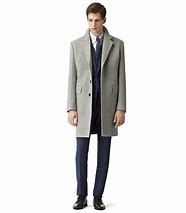
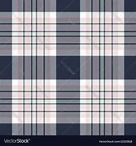

= Lesson 29
:toc:

---

== Section 1

==== Airport Announcements.

Announcement 1:

Special announcement for Mr. Valans. Would Mr. Valans, passenger on *Pan Am* Flight Number 35212 to New York, please contact(v.) the Pan Am *transfer desk* immediately. Mr. Valans to contact(v.) the Pan Am *transfer desk* immediately, please.

====
- an·nounce·ment  （一项）公告，布告，通告
- Pan Am : abbr. 泛美航空公司（Pan American World Airways）
- transfer 转车票；换乘票 / （旅途中的）中转，换乘，改变路线
- transfer desk 转机柜台, 中转柜台 +
image:../img/transfer desk.jpg[150,150]

- 特别通知瓦兰斯先生。乘坐泛美航空公司35212班机去纽约的旅客瓦兰斯先生，请立即与泛美转机柜台联系。瓦兰斯先生，请马上联系泛美转机台。
====

---

Announcement 2:

This is a security announcement. Passengers are reminded not to leave their baggage unattended at any time. Passengers must not leave their baggage unattended. Unattended bags will be removed immediately by the police.

====
- 这是安全公告。提醒旅客任何时候都不要把行李放在无人看管的地方。
====

---

Announcement 3:

Kenya Airways(n.) to Rome and Nairobi, *Flight Number* 155, boarding(v.) now Gate Number 10. Kenya Airways, Gate Number 10.

====
- Airways 航空公司; 空中航线
- Flight Number 航班号
- 肯尼亚航空公司飞往罗马和内罗毕的155次航班，现在在10号登机口登机。肯尼亚航空公司的航班，请在10号口登机。
====

---

Announcement 4:

Your attention please. Olympic Airways *Flight Number* 563 to Athens boarding(v.) now at Gate Number 31. Olympic Airways to Athens, Gate Number 31.

====

- 请您注意。奥林匹克航空公司飞往雅典的563次航班, 现在在31号门登机。
====

---

Announcement 5:

Would passenger Aldo Betini, who arrived from Rome, please go to the meeting point. Aldo Betini to the meeting point, please.

====
- 请从罗马来的乘客阿尔多·贝蒂尼, 到集合点。
====

---

Announcement 6:

BA wish to apologise for the delay of their Flight Number 516 to New York. This is due to the late positioning of the aircraft to the stand.

====
- BA : British Airways +
image:../img/British Airways.jpg[]
- position (v.)to put sb/sth in a particular position 安装；安置；使处于 +
-> The company is now well positioned to compete in foreign markets. 现在这家公司已准备好在国外市场竞争。
- stand 停车处；站

- 英航为他们飞往纽约的516号航班延误, 向您道歉。这是由于飞机到站晚点。
====

---

== Section 2

==== A. At the Lost Property Office.

Assistant: Good morning, sir. +
Man: Good morning. I wonder if you can help. I've lost my coat. +
Assistant: Where did you lose it, sir? +
Man: Er ... I left it on the ... um ... underground yesterday morning. +
Assistant: Can you describe it? +
Man: Well, it's a full-length brown overcoat with a *check pattern* on it. It's got a wide belt,
and one of those thick furry collars that keep your ears warm. It's a very nice coat,
actually. +

====
- Lost Property Office 失物招领处
- underground 地铁系统(英国人用) / subway(美国人用) / Metro(其他欧洲国家的地铁用) /伦敦的地铁通常称作the Tube。
- full-length 全身的 /长及脚踝的
- overcoat : a long warm coat worn in cold weather 长大衣 +

- check : a pattern of squares, usually of two colours （通常指双色的）方格图案，方格，格子 +
=> 联想到英语单词chess（国际象棋）
-> Do you prefer checks or stripes? 你喜欢方格还是条纹？ +

- belt 腰带；皮带

- 男:嗯，是一件上面有格子图案的棕色长大衣。它有一条很宽的腰带，还有一个厚厚的毛皮领子，可以让你的耳朵保持温暖。事实上，这是一件很好的外套。
====

Assistant: Hmm. I'm afraid we haven't got anything like that, sir. Sorry. +
Man: Well, to tell you the truth, I lost another coat last week. On the bus. It's a
three-quarter length coat —it's grey, with big black buttons and a black belt. +
Assistant: Sorry, sir. Nothing like that. +

Man: Hmm. And then only this morning I left my white raincoat in a park. It's got a silk
lining ... +
Assistant: Look, sir. I'm a busy woman. If you really need a coat so badly, there's a very
good second-hand clothes shop just round the corner ...

====
- raincoat 雨衣
- lining 衬层；内衬；衬里 /（身体器官内壁的）膜
====

---

==== B. Questions of Conscience.

Doctor: Well, how's the patient this morning? +
Nurse: He appears to have had a very restless night. +
Doctor: Oh. Was he in very severe pain? +
Nurse: Yes. I'm afraid he was, doctor. +
Doctor: Hmm. In that case, I think we'd better increase his dosage of diamorphine. +
Nurse: Yes, doctor. By how much? +
Doctor: Let's see. How much is he on at the moment? +
Nurse: Five milligrammes. +
Doctor: Hmm. Increase it to fifty. +
Nurse: Fifty? All at once? +
Doctor: Yes, that's what I said, nurse. +
Nurse: But that's an increase of forty-five milligrammes. +
Doctor: I'm quite aware of that. However, when I operated on the patient yesterday, I
found his abdomen was riddled with carcinoma. I'm sure you realize what that means. +
Nurse: Yes, I do, doctor. But I still don't feel I can accept responsibility for administering
such an increase. +
Doctor: Can't you? What exactly do you suggest, then? +
Nurse: That if you're convinced it's the right thing to do, you ought to administer the
injection yourself. +
Doctor: Hmm. I see what you mean. Very well, I will.

---

==== C. Earthquake.

Woman: What did you do during the earthquake, James? +
James: Stayed in bed. +
Woman: What do you mean? Didn't you try to get outside? +
James: No. I'd got terrible flu, so I just stayed in bed. +
Woman: So what happened? +
James: Well, I must have slept through the first earthquake although nobody believes me.
They said it was so noisy. Then I woke up about four in the morning. Still feeling terrible
with the flu. Eyes running, nose running. You know how you feel when you've got the flu. +
Woman: Don't I just. I've been lucky so far this year, though. +
James: So I decided to get up and make a cup of tea. I'd just got into the kitchen when I
started to feel all unsteady on my feet. Then I got this roaring noise in my ears. I still
thought it was the flu, you see. +
Woman: So what happened then? +
James: Well, I slowly realized that it wasn't me feeling dizzy and the noises weren't in my
head. I heard the people upstairs screaming. The wooden floor started moving up and
down, the doors and windows started rattling and banging, all the kitchen cupboards were
thrown open and cups and saucers came crashing to the floor, the kitchen clock fell from
the wall ... +
Woman: Well, what did you do? +
James: What could I do? I just stood there and watched. +
Woman: Why didn't you try to get out? +
James: Oh, I couldn't be bothered. I was feeling so terrible with the flu. I just went back to
my bedroom. Some books had fallen from the bookcase and that little porcelain vase had
rolled to the floor but fortunately didn't break. I even had to look for my transistor radio
under the bed. I picked it up and switched it on and they were telling people to go and
sleep in the parks. +
Woman: So why didn't you? +
James: I told you, I was feeling too ill. And the nearest park is a long walk from my flat.
And I didn't want to be with a lot of people. So I just stayed in bed and hoped for the best. I
didn't really think the house was going to fall down around me. Though several did, I found
out later. +
Woman: Yes. I was sitting in a cafe when the first one started and the whole place started
to shake. People were running and screaming and pushing to get out ...

---

== Section 3

==== A. Who Needs Friends Like This?

Martin, Robert and Jean are being interviewed on the subject of friendship. +
Interviewer: How important are friends to you, Martin?
Martin: I've never had a lot of friends. I've never regarded them as particularly important.
Perhaps that's because I come from a big family. Two brothers and three sisters. And lots
of cousins. And that's what's really important to me. My family. The different members of
my family. If you really need help, you get it from your family, don't you? Well, at least
that's what I've always found. +
Interviewer: What about you, Jean? +
Jean: To me, friendship ... having friends ... people I know I can really count on ... to me
that's the most important thing in life. It's more important even than love. If you love
someone, you can always fall out of love again, and that can lead to a lot of hurt feelings,
bitterness, and so on. But a good friend is a friend for life. +
Interviewer: And what exactly do you mean by a friend? +
Jean: Well, I've already said, someone you know you can count on. I suppose what I really
mean is ... let's see, how am I going to put this ... it's someone who will help you if you
need help, who'll listen to you when you talk about your problems ... someone you can
trust. +
Interviewer: What do you mean by a friend, Robert?
Robert: Someone who likes the same things that you do, who you can argue with and not
lose your temper, even if you don't always agree about things. I mean someone who you
don't have to talk to all the time but can be silent with, perhaps. That's important, too. You
can just sit together and not say very much sometimes. Just relax. I don't like people who
talk all the time. +
Interviewer: Are you very good at keeping in touch with your friends if you don't see them
regularly?
Robert: No, not always. I've lived in lots of places, and, to be honest, once I move away, I
often do drift out of touch with my friends. And I'm not a very good letter writer, either.
Never have been. But I know that if I saw those friends again, if I ever moved back to the
same place, or for some other reason we got back into close contact again, I'm sure the
friendship would be just as strong as it was before. +
Jean: Several of my friends have moved away, got married, things like that. One of my
friends has had a baby recently, and I'll admit I don't see her or hear from her as much as I
used to ... She lives in another neighborhood and when I phone her, she always seems
busy. But that's an exception. I write a lot of letters to my friends and get a lot of letters
from them. I have a friend I went to school with and ten years ago she emigrated to
Canada, but she still writes to me every month, and I write to her just as often.

---

==== B. A Day off Work.

Bill Walker works for an import-export company. Last Wednesday morning Bill rang his
office at nine o'clock. His boss, Mr. Thompson, answered the phone.
Mr. Thompson: Hello, Thompson here ...
Bill: Hello. This is Bill Walker.
Mr. Thompson: Oh, hello, Bill.
Bill: I'm afraid I can't come to work today, Mr. Thompson.
Mr. Thompson: Oh, what's the problem?
Bill: I've got a very sore throat.
Mr. Thompson: Yes, you sound ill on the phone.
Bill: Yes, I'll stay in bed today, but I'll be able to come tomorrow.
Mr. Thompson: That's all right, Bill. Stay in bed until you feel well enough to work.
Bill: Thank you, Mr. Thompson ... Goodbye.
Mr. Thompson: Goodbye, Bill.

\***

Mr. Thompson liked Bill very much. At 12:30 he got into his car, drove to a shop and
bought some fruit for him. He went to Bill's flat and rang the doorbell. Bill's wife, Susan,
answered the door. +
Susan: Oh, Mr. Thompson! Hello ... how are you?
Mr. Thompson: Fine, thanks, Susan. I've just come to see Bill. How is he? +
Susan: He doesn't look very well. I wanted him to see the doctor.
Mr. Thompson: I'll go in and see him ... Hello, Bill!
Bill: Oh ... hello ... hello, Mr. Thompson ... er ... er ...
Mr. Thompson: I've brought some fruit for you, Bill.
Bill: Thank you very much, Mr. Thompson.
Mr. Thompson: Well, ... I had to pass your house anyway. How's your throat?
Bill: It seems a little better. I'll be OK tomorrow.
Mr. Thompson: Well, don't come in until you feel better.
Bill: All right ... but I'm sure I'll be able to come in tomorrow.
Mr. Thompson: Goodbye, Bill.
Bill: Goodbye, Mr. Thompson.

\***

At three o'clock in the afternoon, Mr. Thompson locked his office door, and switched
on his portable television. He wanted to watch an important international football match. It
was England against Brazil. Both teams were playing well, but neither team could score a
goal. The crowd were cheering and booing. It was very exciting.

\***

Then at 3:20, England scored from a penalty. Mr. Thompson jumped out of his chair.
He was very excited. He was smiling happily when suddenly the cameraman focused on
the crowd. Mr. Thompson's smile disappeared and he looked very angry. Bill Walker's
face, in close-up, was there on the screen. He didn't look ill, and he didn't sound ill. He
was smiling happily and cheering wildly!

---
