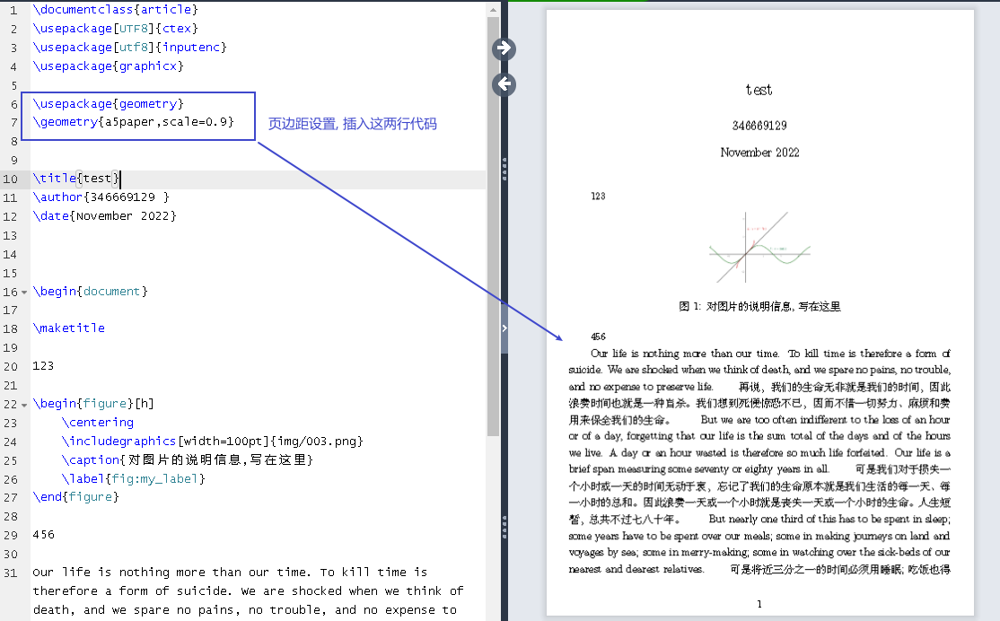
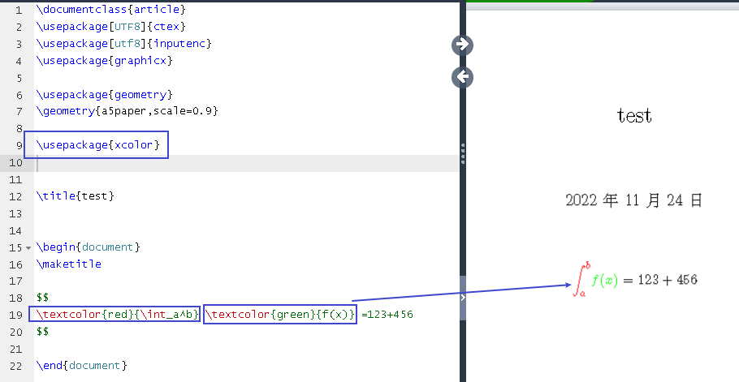

- logseq 代码块, 写在 ```...``` 里面
-
- 登录官网
  collapsed:: true
	- https://www.overleaf.com/
-
- 我用的母版
  collapsed:: true
	- ```
	  \documentclass{article}
	  \usepackage[UTF8]{ctex}
	  \usepackage[utf8]{inputenc}
	  \usepackage{graphicx}
	  
	  \usepackage{geometry}
	  \geometry{a5paper,scale=0.9}
	  
	  
	  
	  \title{test}
	  
	  
	  \begin{document}
	  \maketitle
	  
	  \begin{figure}[h]
	      \centering
	      \includegraphics[width=100pt]{img/003.png}
	      \caption{对图片的说明信息,写在这里}
	      \label{fig:my_label}
	  \end{figure}
	  
	  \end{document}
	  ```
-
- 页边距
  collapsed:: true
	- cale=0.9, 是指版心占页面长度的比例为90%；[scale]也可以改为ratio，表示版面边距占页面长度的比例。
	- 还可以单独调整上下左右的间距。如: \geometry{a4paper,left=2cm,right=2cm,top=1cm,bottom=1cm}
	- 
	-
-
- 中文支持
  collapsed:: true
	- 让页面内支持显示中文
	  background-color:: red
	  collapsed:: true
		- 在 \documentclass… 下一行添加：
		  \usepackage[UTF8]{ctex}
		- 
		- 然后 在Overleaf左上角 Menu 设置compiler为XeLaTex，再次保存就可以正常显示中文啦
		- 
		- 
		-
		-
		-
	- 让数学公式中, 支持中文显示
	  background-color:: red
		- 
-
- 数学公式
	- 行内公式(用 \$...\$), 和独立行公式(用 \$\$...\$\$)
	  collapsed:: true
		- 
		-
	- 数学公式, 改变颜色
	  collapsed:: true
		- 
-
- 插入空行
  collapsed:: true
	- \vspace{1em}  ← 空1行
	- \vspace{2em} ← 空2行
	- \vspace{3em} ← 空3行
	- 在文字末尾加空行可以用:    \\
	- 直接加空行可以用:      ~\\
-
- 分割线: \hrule
-
- 层级
	- 段落层级
	  collapsed:: true
		- 
-
- 插入图片
  background-color:: red
  collapsed:: true
	- 
-
-