-
- 列表, 在mma中, 是用{}括起来, 而不是一般编程语言中的中括号[]
-
- ### 增
	- 创建一个某数值范围内的列表: Range[num]
		- 注意: 它和一般的编程语言不同, 第一个数是从1开始的, 而不是从0开始.
		- 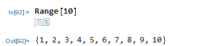
		- 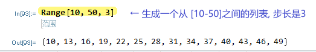
	- 生成一个列表:  Table 函数
	  collapsed:: true
		- Table 生成列表最简单的形式, 是按指定的次数, 重复同一个元素.
		- 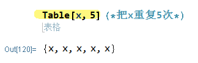
		- 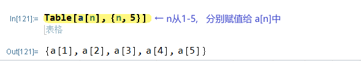
		- 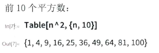
		- 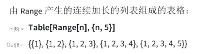
		- 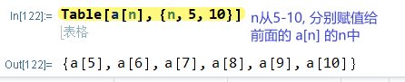
		- 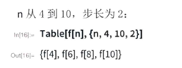
		- 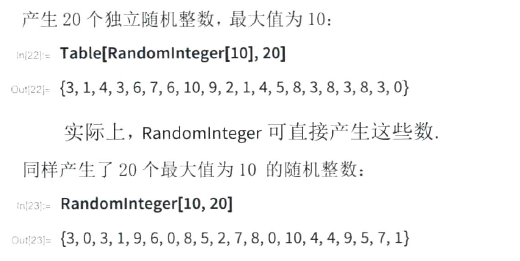
		-
		- 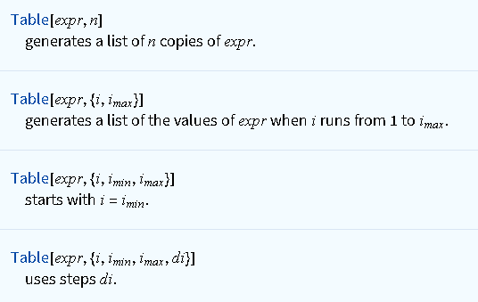{:height 223, :width 340}
		- 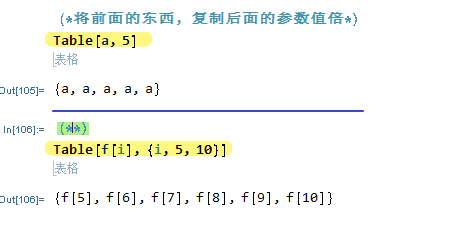
		- 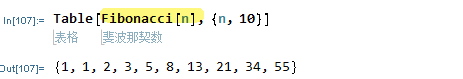
-
- ### 删
	- 删除列表里的重复元素: // DeleteDuplicates
	  collapsed:: true
		- 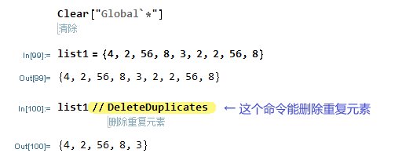
	- 删除列表中开头的n个元素: Drop[列表, 前n个元素数量]
	  collapsed:: true
		- 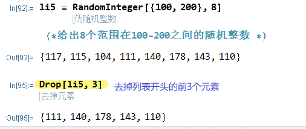
-
- ### 改
	- 改变列表中某索引处 的元素值: 列表\[[index]=newValue
	  background-color:: blue
	  collapsed:: true
		- 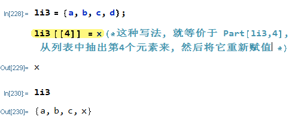
	- 直接对列表中的每个数字元素, 批量进行同一操作
	  collapsed:: true
		- 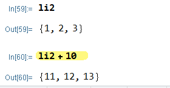
	- 将两个列表, 每个对应元素做计算. 注意: 只能两个列表的元素数量相同时, 才能这样操作.
	  collapsed:: true
		- 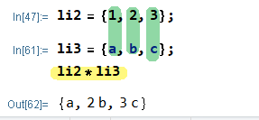
-
- ### 查
	- 获取列表中元素的数量长度 : Length[某列表变量]
	- 获取列表中, 某元素出现的次数 : Count[列表, 元素值]
	  background-color:: blue
	  collapsed:: true
		- 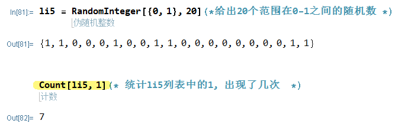
	-
	- 获取列表中第1个元素: First[某列表]
	  collapsed:: true
		- 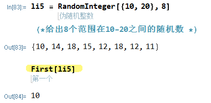
	- 获取列表中, 最后一个元素: Last[某列表]
	  collapsed:: true
		- 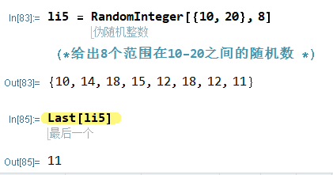
	- 获取列表中, 第n个元素: Part[某列表, 元素index]
	  background-color:: blue
	  collapsed:: true
		- 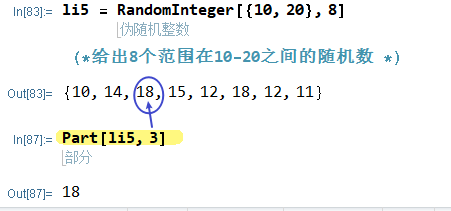
	- Part函数, 可以简写成: 列表 后跟个双中括号, 里面写上索引值
	  collapsed:: true
		- 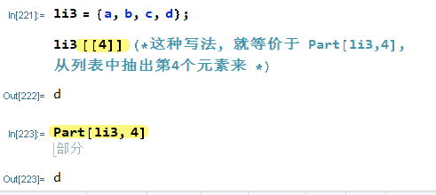
		- 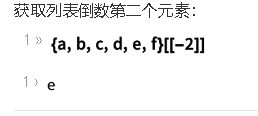
		- 
		- 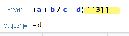
		-
	-
	- 获取列表中, 最小的元素: Min[某列表] ; 最大值元素 Max[某列表]
	  collapsed:: true
		- 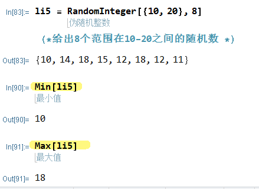
	- 获取列表中, 前n个元素: Take[列表, 前n个元素数量]
	  collapsed:: true
		- 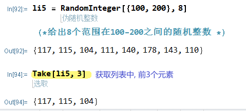
	- 获取列表中, "去头, 或去尾" 后的所有元素, 构成一个新列表
	  collapsed:: true
		- 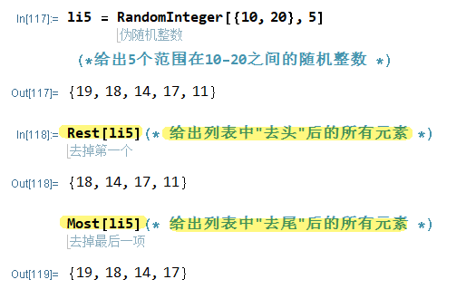
	-
	- 提取嵌套列表中的第 i 列元素: 列表\[[All, 列的index]]
	  background-color:: blue
	  collapsed:: true
		- 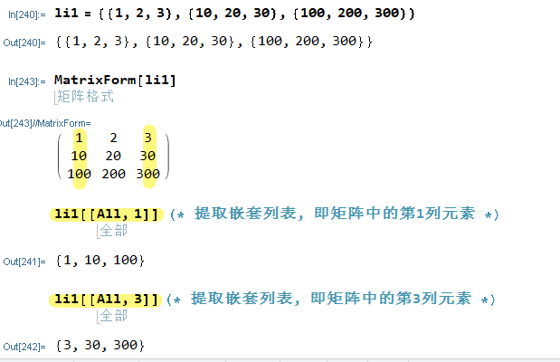
	-
	- 用函数来筛选列表中的元素, 即, 若列表中的元素满足给定函数的返回值, 则就筛选出来.
	  background-color:: blue
	  collapsed:: true
		- 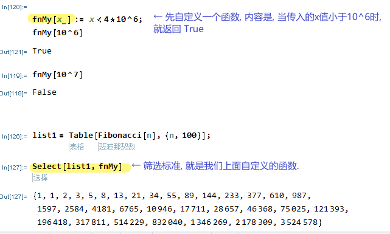
	- 筛选出列表中符合某条件的元素: Select函数
	  collapsed:: true
		- 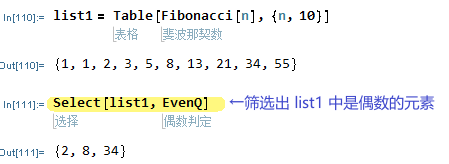
	- 列出列表中的子集: Subsets 函数
	  background-color:: blue
	  collapsed:: true
		- 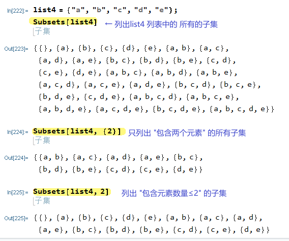
		- 注意: 上面这里的 Subsets[list4, {2}] 代码, 因为 list4中是有5个元素的, 取出含有2个元素的子集, 就相当于是 "组合数的 5取2", 即共10种组合.
		  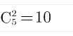
		-
-
- ### 拆分
	- 切割列表: Partition 函数
	  collapsed:: true
		- 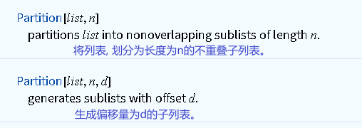
		- 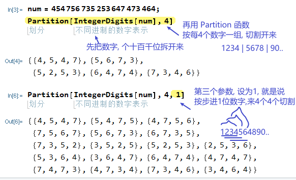
-
- ### 合并
	- 一个列表中, 包含多个子列表, 将这多个子列表合并成一个大列表:  //Flatten
	  collapsed:: true
		- 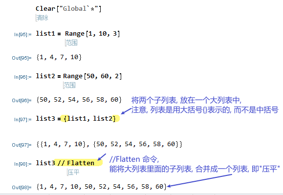
	- 将多个列表, 合并成一个列表 : Join 函数
	  collapsed:: true
		- 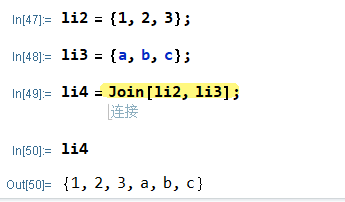
		-
-
- ### 计算
	- ### 求和
		- 对列表中的元素, 求和 : // Total,  或 Total[某列表变量]
		  collapsed:: true
			- 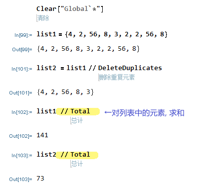
			- 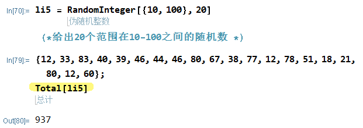
-
- ### 排序
	- 反向排列 列表中的元素: Reverse函数
	  collapsed:: true
		- 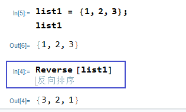
		-
	- 按从小到大顺序, 排列列表中的元素: Sort函数
	  collapsed:: true
		- 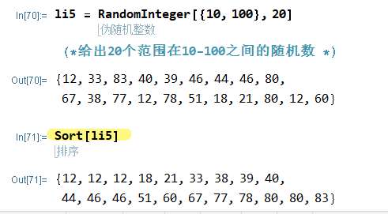
	- 按从大到小排列
	  collapsed:: true
		- 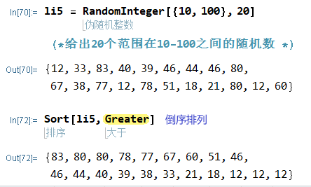
-