title:: main_Matplotlib

-
- 第一个例子
  collapsed:: true
	- ```python
	  import matplotlib
	  matplotlib.rc("font", family='Microsoft YaHei') # 注意, 要想在画图中成功显示中文, 必须加上这句代码
	  
	  import numpy as np
	  from matplotlib import pyplot as plt
	  import math
	  
	  plt.xlabel("x轴的自定义名字")
	  plt.ylabel("y轴的自定义名字")
	  
	  plt.xlim(0,500) # 指定x轴的显示范围为[0,500]
	  plt.ylim(0,1000) # 指定y轴的显示范围为[0,1000]
	  
	  plt.xticks([0,10,50,100,200,500]) #自定义x轴刻度
	  plt.yticks([0,300,700]) #自定义y轴刻度
	  
	  plt.tick_params(labelsize = 10) #设置刻度字号
	  
	  plt.title('本图的标题写在这里') #写上图题
	  
	  x = np.arange(-50,51) # type: ndarray
	  print(x)
	  y = x ** 2 # 平方. 即, 我们设定了一个 "x平方 = y" 的曲线
	  
	  # 下面同时在一张图中画3条曲线
	  plt.plot(x,y) # 用 plot() 进行画图. x为x轴数据, y为y轴数据
	  plt.plot(x, x ** 3)
	  plt.plot(x, x ** (1/2))
	  
	  plt.legend(['y = x^2','y = x^3','y = x^(1/2)']) #打出图例
	  
	  plt.show() # 显示所画的图
	  ```
	- 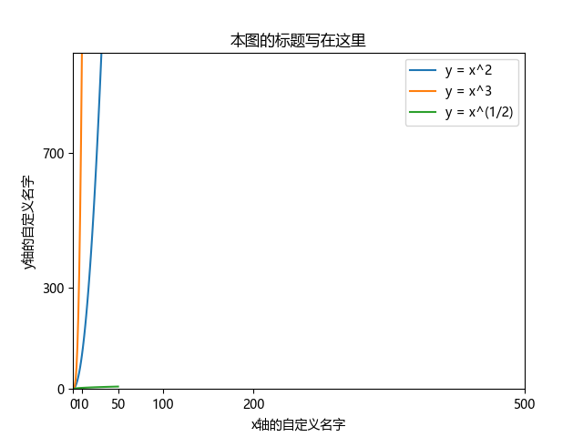
	-
- 用 plt.plot()画图时, x轴可以省略, 默认就是无限长. 你只需传递y轴即可.
  collapsed:: true
	- ```python
	  import numpy as np
	  import matplotlib.pyplot as plt
	  
	  
	  y = np.arange(50,100)
	  
	  # 用 plt.plot()画图时, x轴可以省略, 默认就是无限长. 你只需传递y轴即可.
	  plt.plot(y)
	  
	  plt.show()
	  ```
	- 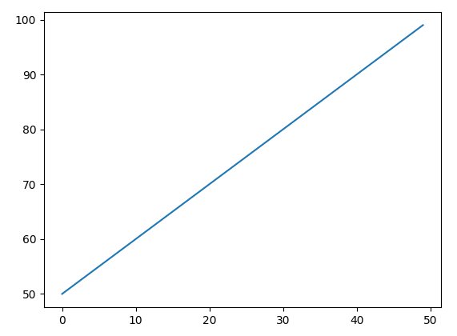
- 线条的样式自定义
	- 线条显示为虚线 -> plot(x, y, '虚线类型指定')
	  collapsed:: true
		- 线条显示为虚线, 第三个参数就用 '--'
		- 线条显示为点号虚线, 第三个参数就用 '.'
		- ```python
		  import matimport matplotlib
		  matplotlib.rc("font", family='Microsoft YaHei') # 注意, 要想在画图中成功显示中文, 必须加上这句代码
		  import numpy as np
		  from matplotlib import pyplot as plt
		  
		  # 下面, 来画一条直线, 它通过(0,0) 和 (5,10) 两点.
		  # 即, 把下面看做一个矩阵, 竖着看, 每列中存放的就是一个点的坐标
		    x = np.array([0,5])
		    y = np.array([0,10])
		    plt.plot(x,y) # 第一个参数指定你要由x轴来显示的值, 第二个参数指定你要由y轴来显示的值
		    plt.plot(x+3,y-4,'--') #  用 '‐'虚线表示
		  # 再画一条线
		    x3 = np.arange(10)
		    plt.plot(x3,x3 ** 2,'.') #  用 '.' 点号虚线表示
		    
		    plt.show() # 显示所画的图
		  ```
			- 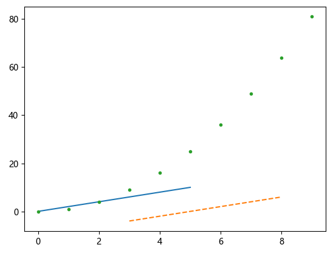
	- 给线条指定颜色 -> plot(x, y, '线条颜色')
	  collapsed:: true
		- ```python
		  import matplotlib
		  matplotlib.rc("font", family='Microsoft YaHei') # 注意, 要想在画图中成功显示中文, 必须加上这句代码
		  import numpy as np
		  from matplotlib import pyplot as plt
		  
		  # 下面, 来画一条直线, 它通过(0,0) 和 (5,10) 两点.
		  # 即, 把下面看做一个矩阵, 竖着看, 每列中存放的就是一个点的坐标
		  x = np.array([0,5])
		  y = np.array([0,10])
		  
		  plt.plot(x,y,'r') # 指定线条的颜色为红色 red
		  plt.plot(x+3,y-4,'g--') # 指定线条的颜色, 可以写在第三个参数中. 如, 指定绿色就是 green 的首字母 g. 并且还让这条线显示为虚线'--' , 即把两个样式写在一起了.
		  
		  plt.show()
		  ```
		- 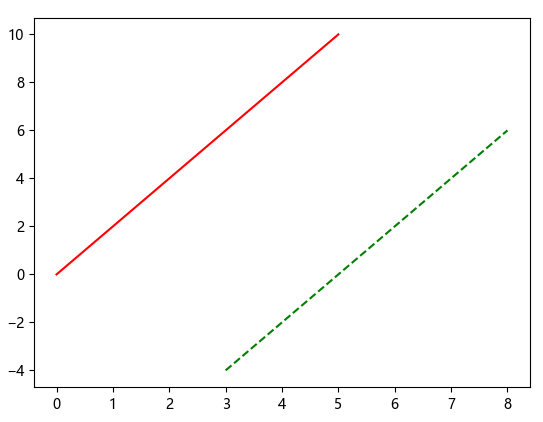
	- 线条的宽度设定 -> plot(x, y, linewidth=线条宽度值)
	  collapsed:: true
		- ```python
		  plt.plot(x, y, color="red", linewidth=2.0, linestyle='--')  # 指定线条的颜色, 和宽度, 样式
		  ```
- 坐标轴自定义
	- 坐标轴上的数值说明 自定义 -> plt.yticks([list_数值],[list_各数值对应的说明])
	  background-color:: #264c9b
	  collapsed:: true
		- ```python
		  import matplotlib
		  
		  matplotlib.rc("font", family='Microsoft YaHei')  # 注意, 要想在画图中成功显示中文, 必须加上这句代码
		  import numpy as np
		  from matplotlib import pyplot as plt
		  
		  plt.ylim((0,100)) # 设定y轴的数值范围
		  plt.yticks([60,80,90],['60及格','80良好','90优秀']) # 自定义y轴上数值的说明
		  
		  # 下面, 来画一条直线, 它通过(0,0) 和 (5,10) 两点.
		  # 即, 把下面看做一个矩阵, 竖着看, 每列中存放的就是一个点的坐标
		  x = np.array([0, 5])
		  y = np.array([0, 10])
		  
		  plt.plot(x, y)
		  plt.show()
		  ```
		- 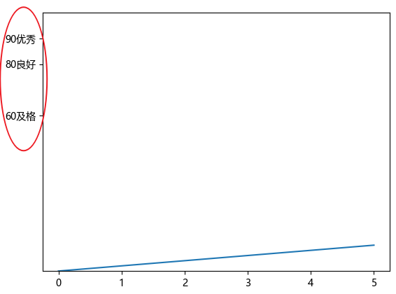
	- 创建四象限的笛卡尔坐标系
	  background-color:: #793e3e
	  collapsed:: true
		- 原始的画布上, 上下左右四根边框线, 叫做 spines(脊柱)
		- ```python
		  import matplotlib
		  
		  matplotlib.rc("font", family='Microsoft YaHei')  # 注意, 要想在画图中成功显示中文, 必须加上这句代码
		  import numpy as np
		  from matplotlib import pyplot as plt
		  
		  plt.xlim(-100, 100) # 指定x轴上数值的显示范围
		  plt.ylim(-100, 100)
		  
		  # 获取当前的"轴对象" Get Current Axes (gca), 下面对轴的所有自定义修改, 都是对 gca对象的修改.
		  ax = plt.gca()
		  print(ax)  # AxesSubplot(0.125,0.11;0.775x0.77)
		  
		  #原图有上下左右四个边线, 为了转成四象限图, 我们只要保留两个边线就行了, 让left边线变成y轴, 让bottom边线变成x轴. 然后隐藏掉另两根边线 right 和 top.
		  ax.spines["right"].set_color('none')
		  ax.spines["top"].set_color('none')
		  
		  
		  # 下面, 先设定四象限坐标的新原点, 在x和y轴上数值上的哪一边
		  x_origin = -50  # 将新原点的x坐标, 定位在原x轴的 -50数值处.
		  y_origin = 30  # 将新原点的y坐标, 定位在原x轴的 30数值处.
		  #
		  ax.spines["left"].set_position(('data', x_origin))  # 原left边线, 现在就变成y轴, 把它竖立在x轴的-50数值处. 第一个参数'data'表示按数值挪动.
		  ax.spines["bottom"].set_position(('data', y_origin))  # 原bottom边线, 现在就变成x轴, 把它竖立在y轴的30数值处.
		  
		  
		  plt.xlabel('x轴的名字', loc='right') # loc参数, 用来指定坐标轴说明文字的摆放位置
		  plt.ylabel('y轴的名字', loc='top')
		  
		  plt.show()
		  ```
		- 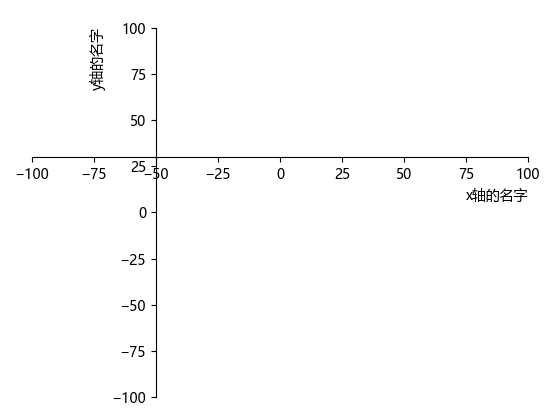
- 做箭头注释
  background-color:: #793e3e
  collapsed:: true
	- 原始的混写代码 (还没有打包成函数, 单独写在另一个模块文件中):
	  collapsed:: true
		- ```python
		  import my_module  # 导入你自己编辑的模块, 里面有你写的函数
		  
		  import numpy as np
		  from matplotlib import pyplot as plt
		  
		  my_module.fn_图画显示令支持中文()
		  my_module.fn_设定坐标轴数值范围(-2, 20, -2, 2)
		  my_module.fn_改成四象限坐标系()
		  
		  # 本例, 我们先构造一条sin曲线
		  x = np.arange(0, 101)
		  y = np.sin(x)
		  
		  # 在sin曲线上, 标出一个点来
		  point1_x = 7
		  point1_y = np.sin(point1_x)
		  plt.scatter(point1_x, point1_y, s=100, c='r')  # 画出这个点. plt.scatter()函数用于生成一个scatter散点图。
		  # 其中, s参数, 指定点的显示大小 size, 默认20.
		  # c参数, 表示点的色彩 color, 默认为蓝色’b’.
		  
		  # 下面来画从上面这个点, 到x轴的垂直虚线. 用 plt.plot()函数来画, 它可以绘制点和线.
		  plt.plot([point1_x, point1_x], [point1_y, 0], 'k--')
		  plt.annotate(text=r'本点的x坐标轴:{}, 本点的y坐标轴:{}'.format(point1_x, point1_y), xy=(point1_x, point1_y), color='red',
		               arrowprops=dict(arrowstyle='->', edgecolor='blue', connectionstyle='arc3, rad=.2'), xytext=(-0.5, 1.5),
		               bbox=dict(facecolor='white', edgecolor='green'))
		  '''
		  plt.annotate()函数,用来标注文字. 其参数有:
		  text参数: 为你做的注释的文本内容
		  color参数: 指定你的注释文字, 用哪种颜色.
		  xy参数 : 指定你要为哪个位置上的元素(比如哪个特殊的数据点), 进行注释. 其实此处, xy参数只要指出这个元素的坐标点即可.
		  xytext参数 :  用来指定你做的"注释文本"的坐标点, 即摆放的坐标位置在何处. 注意, 你要输入的是偏移值. 即相对于"xy参数中坐标"的偏移值.
		  
		  arrowprops参数: 是箭头参数,参数类型为字典dict.  其参数有:
		  --> facecolor：箭头颜色. 注意, 如果箭头太细的话, "箭头颜色"会被下面的"箭头边框线的颜色"所压制.
		  --> edgecolor：(简写ec)箭头的边框线条颜色, 默认为黑色.
		  --> connectionstyle: 用来指定箭头线的弧度
		  
		  bbox参数: 给标题增加外框. 其中的参数有: 
		  -->  facecolor：(简写fc)背景颜色, 默认为蓝色.
		  --> edgecolor：(简写ec)边框线条颜色, 默认为黑色.
		  '''
		  
		  plt.plot(x, y)
		  plt.show()
		  ```
	- 把注释代码打包成函数的写法:
	- 首先, 把"注释"函数, 写在另一个你自定义的模块文件中. 模块文件名为 : my_module.py
	  collapsed:: true
		- ```python
		  def fn_做标注(目标元素的x坐标, 目标元素的y坐标,注释文本的颜色='black',注释文本的坐标值偏移量x =0,注释文本的坐标值偏移量y=0 , 箭头线的边框颜色='black', 注释的边框内部填色 ='white', 注释的边框线颜色='black'):
		      plt.plot([目标元素的x坐标, 目标元素的x坐标], [目标元素的y坐标, 0], 'k--')
		      plt.annotate(text=r'本点的x坐标轴:{}, 本点的y坐标轴:{}'.format(目标元素的x坐标, 目标元素的y坐标), xy=(目标元素的x坐标, 目标元素的y坐标), color=注释文本的颜色,
		                   arrowprops=dict(arrowstyle='->', edgecolor=箭头线的边框颜色, connectionstyle='arc3, rad=.2'), xytext=(注释文本的坐标值偏移量x, 注释文本的坐标值偏移量y),
		                   bbox=dict(facecolor=注释的边框内部填色, edgecolor=注释的边框线颜色))
		  '''
		  plt.annotate()函数,用来标注文字. 其参数有:
		  text参数: 为你做的注释的文本内容
		  color参数: 指定你的注释文字, 用哪种颜色.
		  xy参数 : 指定你要为哪个位置上的元素(比如哪个特殊的数据点), 进行注释. 其实此处, xy参数只要指出这个元素的坐标点即可.
		  xytext参数 :  用来指定你做的"注释文本"的坐标点, 即摆放的坐标位置在何处. 注意, 你要输入的是偏移值. 即相对于"xy参数中坐标"的偏移值.
		  
		  arrowprops参数: 是箭头参数,参数类型为字典dict.  其参数有:
		  --> facecolor：箭头颜色. 注意, 如果箭头太细的话, "箭头颜色"会被下面的"箭头边框线的颜色"所压制.
		  --> edgecolor：(简写ec)箭头的边框线条颜色, 默认为黑色.
		  --> connectionstyle: 用来指定箭头线的弧度
		  
		  bbox参数: 给标题增加外框. 其中的参数有: 
		  -->  facecolor：(简写fc)背景颜色, 默认为蓝色.
		  --> edgecolor：(简写ec)边框线条颜色, 默认为黑色.
		  '''
		  
		  ```
	- 然后, 在你的当前py文件中, 来导入这个模块 (里面存放的都是你自定义的函数)
	  collapsed:: true
		- ```python
		  import my_module  # 导入你自己编辑的模块, 里面有你写的函数
		  
		  import numpy as np
		  from matplotlib import pyplot as plt
		  
		  my_module.fn_图画显示令支持中文()
		  my_module.fn_设定坐标轴数值范围(-2, 20, -2, 2)
		  my_module.fn_改成四象限坐标系()
		  
		  # 本例, 我们先构造一条sin曲线
		  x = np.arange(0, 101)
		  y = np.sin(x)
		  
		  # 在sin曲线上, 标出一个点来
		  point1_x = 7
		  point1_y = np.sin(point1_x)
		  plt.scatter(point1_x, point1_y, s=100, c='r')  # 画出这个点. plt.scatter()函数用于生成一个scatter散点图。
		  # 其中, s参数, 指定点的显示大小 size, 默认20.
		  # c参数, 表示点的色彩 color, 默认为蓝色’b’.
		  
		  # 下面来画从上面这个点, 到x轴的垂直虚线.
		  my_module.fn_做标注(point1_x,point1_y,注释文本的坐标值偏移量x=1,注释文本的坐标值偏移量y=1.5)
		  
		  plt.plot(x, y)
		  plt.show()
		  ```
		- 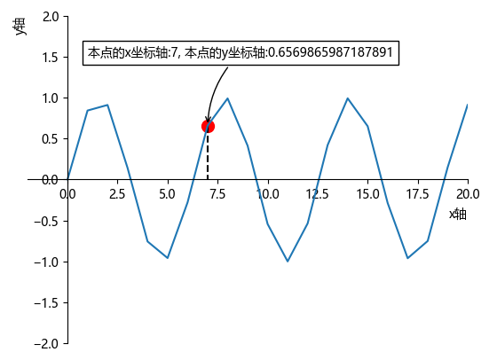
- 同时画多张图 -> plt.figure()
  collapsed:: true
	- 使用一次plt.figure() 代码, 就表示画一张图. 要同时画多张图,  就在每张图前使用一次 plt.figure() 代码.
	- ```python
	  import matplotlib
	  matplotlib.rc("font", family='Microsoft YaHei') # 注意, 要想在画图中成功显示中文, 必须加上这句代码
	  import numpy as np
	  from matplotlib import pyplot as plt
	  
	  # 下面, 来画一条直线, 它通过(0,0) 和 (5,10) 两点.
	  # 即, 把下面看做一个矩阵, 竖着看, 每列中存放的就是一个点的坐标
	  x = np.array([0,5])
	  y = np.array([0,10])
	  
	  # 画第一张图
	  plt.figure()
	  plt.plot(x,y,'r') # 指定线条的颜色为红色 red
	  
	  # 画第二张图
	  plt.figure()
	  plt.plot(x+3,y-4,'g--') # 指定线条的颜色, 可以写在第三个参数中. 如, 指定绿色就是 green 的首字母 g. 并且还让这条线显示为虚线'--' , 即把两个样式写在一起了.
	  
	  plt.show()
	  ```
-
- figure就是一个画布，axes表示画布上的一个画图区域，一个画布上可以分割成多个画图区域 axes. 但每个axes的位置, 需要你用相对于figure的百分比来赋值.
  collapsed:: true
	- 我们作画, 可以在 axes 上作画,  即 ax.plot()
	- 也可以在 plt 上作画, 即 **plt会指向你最后创建的那个 ax上,来作画.**  plt.plot()
	- 但不能在 figure上作画!  如 figure.plot() 是错的, 会报错!
	- ```python
	  import numpy as np
	  import matplotlib.pyplot as plt
	  
	  # 创建画布 figure对象, 但注意, 我们画图不是直接画在figure上的, 而是画在figure上的子空间 -- axes上的.
	  fig = plt.figure() # figure画布, 只是一张空白的背景而已. 上面还没有坐标轴.
	  
	  # 在画布上, 加上第一个坐标轴区域
	  ax1 = fig.add_axes([0,0,0.5,0.5]) # fig.add_axes()接收一个列表 [left, bottom, width, heigh], 即, 坐标轴区域的左下角坐标(x,y),以及该区域的宽度和高度, 占整个画布的百分比. 比如, 本例我们设置为0.5, 就是让这个坐标轴子区域, 占画布的50%宽高.
	  ax2 = fig.add_axes([0.5,0.5,0.5,0.5]) # 再创建一个坐标轴区域, 在画布的右上角
	  
	  # 注意, 在添加了 axes后, 如果你不显式指定图像是画在哪个 ax上, 图像就画在你最后创建的那个 ax上. 即, 你用 plt.plot()画的话, 就是画在你最后创建的那个 ax上.
	  ax1.plot([2,5,6],[5,3,9]) # 显式指定只在ax1区域上画画.
	  plt.plot([5,3,5],[9,2,4]) # 没有显式指定ax区域, 这样, 由于你最后创建的axes是 ax2, 本句代码就画在了 ax2上.
	  
	  #下面, 我们把plt所指向的当前的ax到底是哪一个, 打印出来看看
	  ax_current = plt.gca() # 获取当前的axis区域 get current axis 
	  print(ax_current) # Axes(0.5,0.5;0.5x0.5) <- 果然是 ax2. 所以 plt.plot()就是画在 ax2 上的.
	  ```
	- 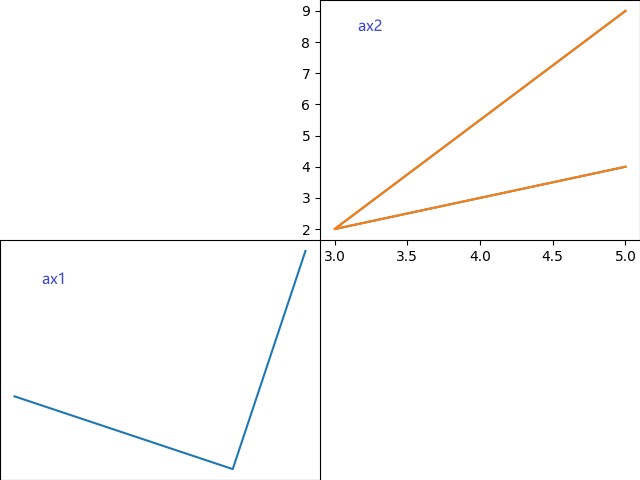
	-
	- ```python
	  import numpy as np
	  import matplotlib.pyplot as plt
	  
	  '''
	  plt.gcf(),plt.sca(),plt.gca()的区别?
	  figure就是一个图，axes表示图上的一个画图区域，一个图上可以有多个画图区域，意思就是说，一个图上可以有多个子图。
	  
	  用函数gcf(）与gca()分别得到当前的figure与axes。（get current figure, get current axes).
	  
	  利用sca()函数实现把一个axes对象作为当前的axes，axes对象为figure对象的一个属性，当切换了axes,figure肯定也切换了。
	  '''
	  
	  ax1 = plt.gca() #  保存当前的axes 为 ax1
	  plt.sca(ax1) #将当前axes 指定为 ax1
	  #  在ax1上画图
	  plt.plot([2,3],[4,5])
	  
	  
	  ax2 = plt.gca() #  保存当前的axes 为 ax2
	  plt.sca(ax2) #将当前axes 指定为 ax2
	  #  在ax2上画图
	  plt.plot([6,4],[8,9])
	  plt.plot([7,5],[4,1])
	  
	  ax1 = plt.gca() #  保存当前的axes 为 ax1
	  plt.sca(ax1) #将当前axes 指定为 ax1
	  #  在ax1上画图
	  plt.plot([12,13],[14,15])
	  
	  plt.show()
	  ```
- 要自动均等的分割画布, 就用 subplot(切出几行, 切出几列, 第几个位置)函数
  collapsed:: true
	- 比如 subplot(2,3,4) 就是指: 把画布分隔成 2行3列的, 共2*3=6个字块. 本subplot指向第4个子块区域.
	- ```python
	  import numpy as np
	  import matplotlib.pyplot as plt
	  
	  ax1 = plt.subplot(2, 2, 1, title='pic1')  # 把画布分成2行2列共4个子区域, 将ax1指向第1个区域
	  ax1.plot([2, 5], [5, 2])
	  
	  ax3 = plt.subplot(2, 2, 3, title='pic3')  # 将ax2指向第3个区域
	  ax3.plot([-8, 5], [3, 7])
	  
	  plt.tight_layout()  # 自动调整子图参数. 这句代码能防止子图过于靠近, 而让文字重叠在一起
	  plt.show()
	  ```
	- 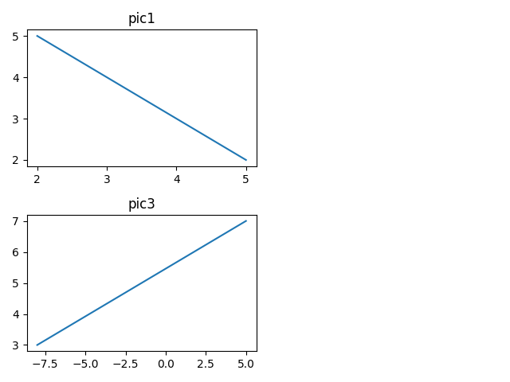
- 一次性切出所有的subplot子区域 -> plt.subplots(切出几行, 切出几列)
  background-color:: #264c9b
  collapsed:: true
	- ```python
	  import numpy as np
	  import matplotlib.pyplot as plt
	  
	  '''
	  plt.subplots() 函数, 注意是复数s形式的, 能直接创建一个包含子图区域的画布, 它返回两个值(打包在一个tuple中): 一个是 figure对象, 另一个是 所有切割出来的axis对象. 即:
	  obj_fig, 二维list_ax = plt.subplots(行数,列数) # 把画布分隔成几行几列的区域.
	  即, 所有的 ax, 都存在了 二维数组中. 你要取哪一个ax, 就用 ax[行index][列index]的形式.
	  '''
	  
	  fig, list2D_ax = plt.subplots(2, 2)  # 把画布切割成2行2列, 共4块子区域.
	  ax1 = list2D_ax[0][0]  # 第一个子区域, 在 行index=0, 列index=0处
	  ax1.set_title('ax1 name')  # 给子区域的图画上添上标题名
	  
	  ax2 = list2D_ax[0][1]  # 第2个子区域, 在 行index=0, 列index=1处
	  ax2.set_title('ax2 name')
	  
	  ax3 = list2D_ax[1][0]  # 第3个子区域
	  ax3.set_title('ax3 name')
	  
	  ax4 = list2D_ax[1][1]  # 第4个子区域
	  ax4.set_title('ax4 name')
	  
	  plt.tight_layout()  # 自动调整子图参数. 这句代码能防止子图过于靠近, 而令文字重叠在一起
	  plt.show()
	  ```
	- 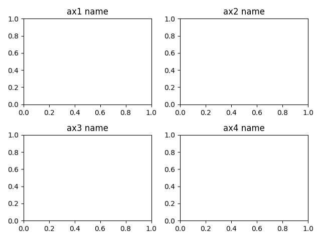
- 3维空间画图的透视角度 -> ax.view_init(elev=0, azim=0)  # elevation 仰角, azimuth 方位角
  background-color:: #264c9b
  collapsed:: true
	- ```python
	  from matplotlib import pyplot as plt
	  from mpl_toolkits.mplot3d.axes3d import Axes3D  # 要画3d图, 先导入此模块
	  
	  fig = plt.figure()  # 创建一个3d画布
	  
	  ax = Axes3D(fig, auto_add_to_figure=False)  # 将画布变为3维的
	  fig.add_axes(ax)  # 这句代码一定要跟上一句一起写!
	  
	  plt.gca().set_box_aspect((1, 1, 1))  # 设置x,y,z轴等比例显示
	  
	  
	  # 函数区-------------------------
	  
	  def fn_创建3d向量(list_n个向量的起点x坐标, list_n个向量的起点y坐标, list_n个向量的起点z坐标, list_n个向量的终点x坐标, list_n个向量的终点y坐标, list_n个向量的终点z坐标,
	                list_xyzLim3d=None):
	      ax.quiver(list_n个向量的起点x坐标, list_n个向量的起点y坐标, list_n个向量的起点z坐标, list_n个向量的终点x坐标, list_n个向量的终点y坐标, list_n个向量的终点z坐标)
	  
	      ax.set_xlabel('X')
	      ax.set_ylabel('Y')
	      ax.set_zlabel('Z')
	  
	      # 设置轴范围的时候用set_xlim3d，而非set_xlim。
	      if list_xyzLim3d == None:
	          ax.set_xlim3d(-100, 100)
	          ax.set_ylim3d(-100, 100)
	          ax.set_zlim3d(-100, 100)
	      else:
	          ax.set_xlim3d(list_xyzLim3d[0], list_xyzLim3d[1])
	          ax.set_ylim3d(list_xyzLim3d[2], list_xyzLim3d[3])
	          ax.set_zlim3d(list_xyzLim3d[4], list_xyzLim3d[5])
	  
	      # ax.grid()
	  
	  
	  # 代码区-------------------------
	  
	  
	  fn_创建3d向量([0, 5, 2], [0, 3, 4], [0, 7, 8], [5, 7, -8], [3, 9, 6], [7, -3, -3])
	  
	  # 当前的坐标系子区域为 ax, 你可以在 ax区域上画图
	  ax.plot([2, 3, 5], [5, 2, 1])
	  
	  # 设置图像的观察角度 (即眼睛看到的3维空间的透视角度)
	  ax.view_init(elev=0, azim=0)  # elevation 仰角, azimuth 方位角
	  
	  plt.show()
	  
	  ```
	- 当  ax.view_init(elev=0, azim=0)  # elevation 仰角, azimuth 方位角
	  collapsed:: true
		- 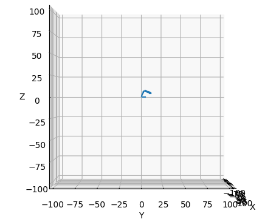
	- elev=20 仰角设为20°时
	  collapsed:: true
		- 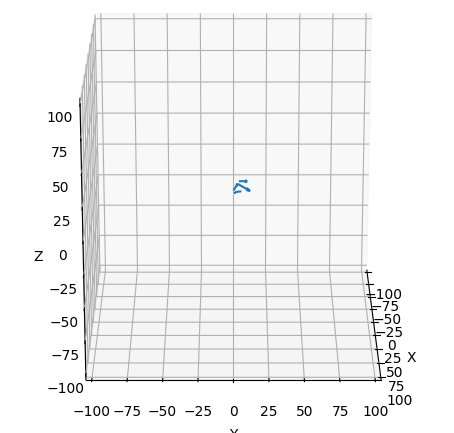
		-
	- azim=45 方位角45°时, (仰角=0时)
	  collapsed:: true
		- 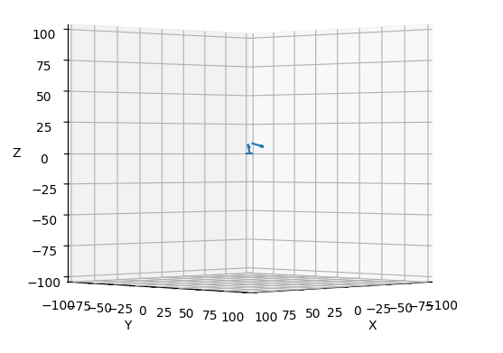
	- elev=20, azim=90  仰角20°, 方位角90°时
	  collapsed:: true
		- 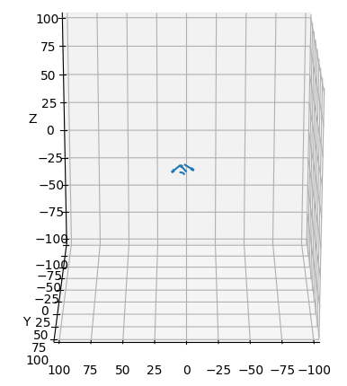
		-
	-
- 3维空间, 让它动画起来 -> anim = FuncAnimation(fig, func=fn_update, frames=360, interval=100)
  collapsed:: true
	- ```python
	  from matplotlib import pyplot as plt
	  from mpl_toolkits.mplot3d.axes3d import Axes3D  # 要画3d图, 先导入此模块
	  from matplotlib.animation import FuncAnimation  # FuncAnimation 通过周期性地调用函数func来制作动画
	  
	  fig = plt.figure()  # 创建一个3d画布
	  
	  ax = Axes3D(fig, auto_add_to_figure=False)  # 将画布变为3维的
	  fig.add_axes(ax)  # 这句代码一定要跟上一句一起写!
	  
	  plt.gca().set_box_aspect((1, 1, 1))  # 设置x,y,z轴等比例显示
	  
	  
	  # 函数区-------------------------
	  
	  def fn_创建3d向量(list_n个向量的起点x坐标, list_n个向量的起点y坐标, list_n个向量的起点z坐标, list_n个向量的终点x坐标, list_n个向量的终点y坐标, list_n个向量的终点z坐标,
	                list_xyzLim3d=None):
	      ax.quiver(list_n个向量的起点x坐标, list_n个向量的起点y坐标, list_n个向量的起点z坐标, list_n个向量的终点x坐标, list_n个向量的终点y坐标, list_n个向量的终点z坐标)
	  
	      ax.set_xlabel('X')
	      ax.set_ylabel('Y')
	      ax.set_zlabel('Z')
	  
	      # 设置轴范围的时候用set_xlim3d，而非set_xlim。
	      if list_xyzLim3d == None:
	          ax.set_xlim3d(-100, 100)
	          ax.set_ylim3d(-100, 100)
	          ax.set_zlim3d(-100, 100)
	      else:
	          ax.set_xlim3d(list_xyzLim3d[0], list_xyzLim3d[1])
	          ax.set_ylim3d(list_xyzLim3d[2], list_xyzLim3d[3])
	          ax.set_zlim3d(list_xyzLim3d[4], list_xyzLim3d[5])
	  
	      # ax.grid()
	  
	  
	  # 代码区-------------------------
	  
	  
	  fn_创建3d向量([0, 5, 2], [0, 3, 4], [0, 7, 8], [5, 7, -8], [3, 9, 6], [7, -3, -3], [-10, 15, -10, 15, -10, 15])
	  
	  # 当前的坐标系子区域为 ax, 你可以在 ax区域上画图
	  ax.plot([2, 3, 5], [5, 2, 1])
	  
	  
	  def fn_update(frame):
	      # 设置图像的观察角度 (即眼睛看到的3维空间的透视角度)
	      ax.view_init(elev=20, azim=frame)  # elevation 仰角, azimuth 方位角
	  
	  
	  # 开始动画
	  anim = FuncAnimation(fig, func=fn_update, frames=360, interval=100)
	  '''
	  fig: 为你对哪个画布上的图画,执行动画, 指定画布名称
	  func : 指定你要不断更新哪个函数, 以让它来实现动画效果. 我们会让它指向你自定义的fn_update(frame)函数.
	  frames :一次动画循环, 包含的帧数. 该 帧数值, 会传递给你自定义的fn_update(frame)函数.
	  interval : 每一帧的运行时间，以ms计
	  '''
	  
	  anim.save('move1.gif', writer='ffmpeg', fps=10) # 但存储出来的gif图容量太大
	  plt.show()
	  
	  ```
- 保存图片 -> plt.savefig(保存路径)
  background-color:: #264c9b
  collapsed:: true
	- pyplot.savefig(保存路径, 
	  dpi=None,  输出图像的分辨率
	  quality=95, 仅对'jpg'或'jpeg'文件生效。
	  facecolor='w', 
	  edgecolor='w', 
	  format=None, 输出格式。字符串，支持的格式为eps, jpeg, jpg, pdf, pgf, png, ps, raw, rgba, svg, svgz, tif, tiff。默认值为None。
	  transparent=False)
	- ```python
	  import numpy as np
	  import matplotlib.pyplot as plt
	  
	  '''
	  plt.subplots() 函数, 注意是复数s形式的, 能直接创建一个包含子图区域的画布, 它返回两个值(打包在一个tuple中): 一个是 figure对象, 另一个是 所有切割出来的axis对象. 即:
	  obj_fig, 二维list_ax = plt.subplots(行数,列数) # 把画布分隔成几行几列的区域.
	  即, 所有的 ax, 都存在了 二维数组中. 你要取哪一个ax, 就用 ax[行index][列index]的形式.
	  '''
	  
	  fig, list2D_ax = plt.subplots(2, 2)  # 把画布切割成2行2列, 共4块子区域.
	  ax1 = list2D_ax[0][0]  # 第一个子区域, 在 行index=0, 列index=0处
	  ax1.set_title('ax1 name')  # 给子区域的图画上添上标题名
	  
	  # 注意: 保存文件的代码, 必须写在plt.show()之前! 否则保存出的图片, 会是空白.
	  plt.savefig('img.png')  # 保存到与本py文件相同的目录下.
	  plt.show()
	  ```
- ---
- 向量箭头的画法
  background-color:: #264c9b
	- 二维平面的向量 -> 只画一个向量 -> ax.quiver(起点的x坐标,起点的y坐标, 终点的x坐标, 终点的y坐标)
	  collapsed:: true
		- ```python
		  import numpy as np
		  import matplotlib.pyplot as plt
		  
		  ax = plt.axes()
		  
		  # 只画一个向量的话, 只用前4个参数来定位, 前两个参数是向量箭头"出发点"的坐标, 后两个参数是"箭头终点"的坐标
		  # angle='xy',scale_units='xy',scale=1,这三个参数, 保证了箭头尺寸与图中坐标相匹配。
		  ax.quiver(0,0,3,7,angles='xy', scale_units='xy', scale=1)
		  
		  ax.grid()
		  
		  ax.set_xlabel('X')
		  ax.set_ylabel('Y')
		  ax.set_xlim(-10, 10)
		  ax.set_ylim(-10, 10)
		  
		  plt.show()
		  ```
		- 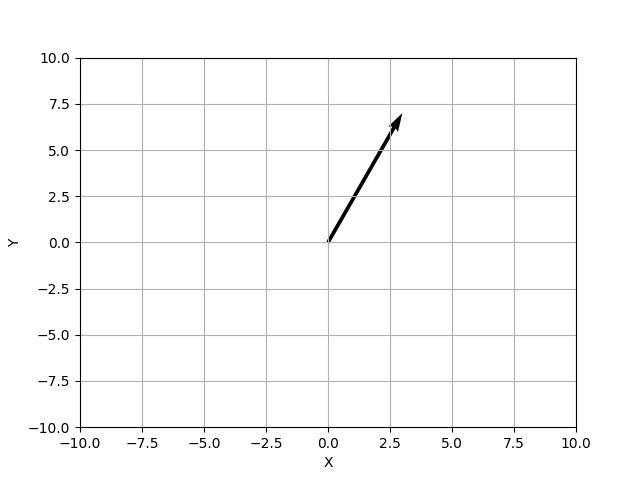
		-
	- 二维平面的向量 -> 一次性同时画多个向量 -> ax.quiver()
	  collapsed:: true
		- 一次性画多个向量, 就要用列表传参, 来表示这n个向量的坐标值了.
		- quiver([X, Y], U, V, [C], **kw)
		  X, Y define **the arrow locations**, U, V define **the arrow directions**, and C optionally sets the color.
		- 我们来同时画三个向量, 坐标分别是:
		  -> 向量1:  起点坐标0,0 -> 终点坐标 5,3
		  -> 向量2:  起点坐标5,3 -> 终点坐标 7,9
		  -> 向量3:  起点坐标2,4 -> 终点坐标 -2,6
		- 那么对于quiver(), 我们要传4个参数进去, 都是list:
		  -> 第1个list中存放着: 三个向量的**起点**的x坐标值, 即 [0,5,2]
		  -> 第2个list中存放着: 三个向量的起点的y坐标值, 即 [0,3,4]
		- -> 第3个list中存放着: 三个向量的**终点**的x坐标值, 即 [5,7,-2]
		  -> 第4个list中存放着: 三个向量的终点的y坐标值, 即 [3,9,6]
		- ```python
		  import numpy as np
		  import matplotlib.pyplot as plt
		  
		  ax = plt.axes()
		  
		  # 一次性同时画多个向量的话, 要用列表来表示
		  ax.quiver([0,5,2],[0,3,4],[5,7,-2],[3,9,6],angles='xy', scale_units='xy', scale=1)
		  
		  ax.grid()
		  
		  ax.set_xlabel('X')
		  ax.set_ylabel('Y')
		  ax.set_xlim(-10, 15)
		  ax.set_ylim(-10, 15)
		  
		  plt.show()
		  ```
		- 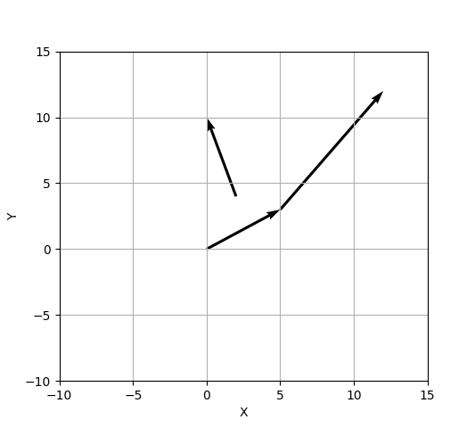
		-
	- 三维空间中的向量
	  collapsed:: true
		- 我们来同时画三个向量, 坐标分别是:
		  -> 向量1:  起点坐标0,0,0 -> 终点坐标 5,3,7
		  -> 向量2:  起点坐标5,3,7 -> 终点坐标 7,9,-3
		  -> 向量3:  起点坐标2,4,8 -> 终点坐标 -8,6,-3
		- 那么对于quiver(), 我们要传6个参数进去, 都是list:
		  -> 第1个list中存放着: 三个向量的**起点**的x坐标值, 即 [0,5,2]
		  -> 第2个list中存放着: 三个向量的起点的y坐标值, 即 [0,3,4]
		  -> 第3个list中存放着: 三个向量的起点的z坐标值, 即 [0,7,8]
		- -> 第4个list中存放着: 三个向量的**终点**的x坐标值, 即 [5,7,-8]
		  -> 第5个list中存放着: 三个向量的终点的y坐标值, 即 [3,9,6]
		  -> 第6个list中存放着: 三个向量的终点的z坐标值, 即 [7,-3,-3]
		- ```python
		  import my_module  # 导入你自己编辑的模块, 里面有你写的函数
		  
		  import numpy as np
		  from matplotlib import pyplot as plt
		  from mpl_toolkits.mplot3d.axes3d import Axes3D # 要画3d图, 先导入此模块
		  
		  
		  my_module.fn_图画显示令支持中文()
		  # my_module.fn_设定坐标轴数值范围(-2, 20, -2, 2)
		  # my_module.fn_改成四象限坐标系()
		  
		  fig = plt.figure() # 创建一个绘图对象,即构建一个画布, 赋值给 fig变量
		  ax = Axes3D(fig) # 将画布变为3维的
		  
		  plt.gca().set_box_aspect((1, 1, 1)) # 设置x,y,z轴等比例显示
		  
		  ax.quiver([0,5,2],[0,3,4],[0,7,8],[5,7,-8],[3,9,6],[7,-3,-3])
		  
		  ax.set_xlabel('X')
		  ax.set_ylabel('Y')
		  ax.set_zlabel('Z')
		  
		  # 设置轴范围的时候用set_xlim3d，而非set_xlim。
		  ax.set_xlim3d(-10, 15)
		  ax.set_ylim3d(-10, 15)
		  ax.set_zlim3d(-10, 15)
		  
		  ax.grid()
		  # plt.plot(x, y)
		  plt.show()
		  ```
		- 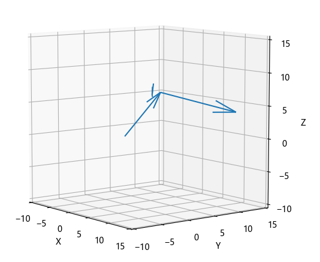
-