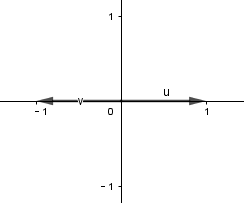
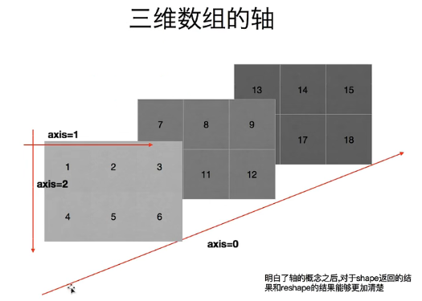
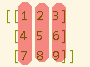
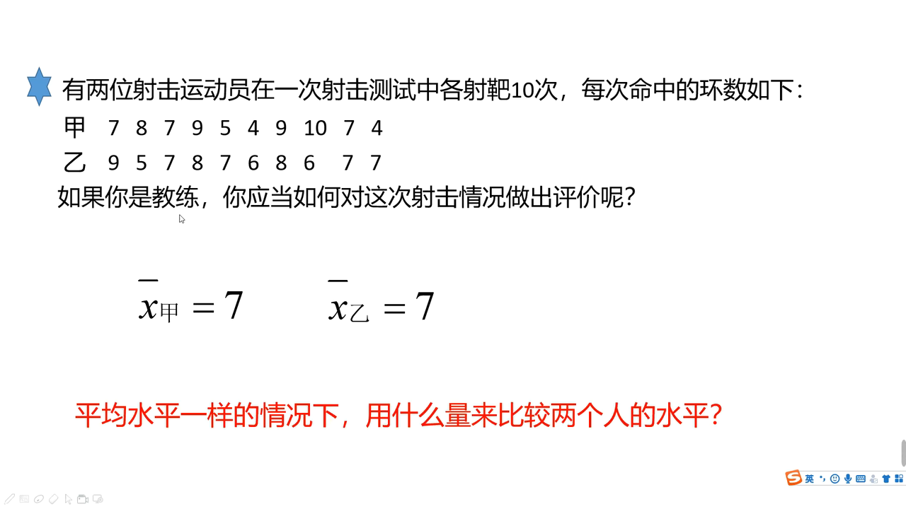
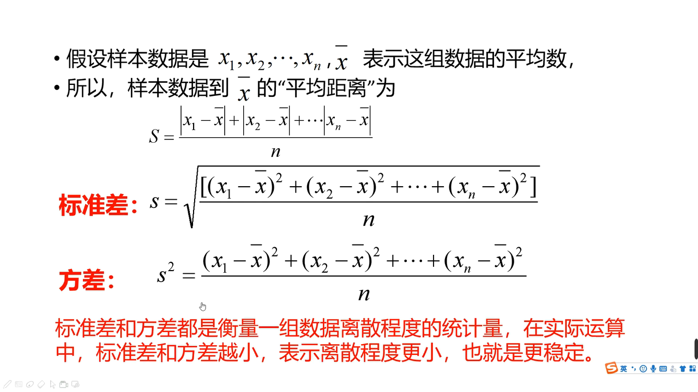
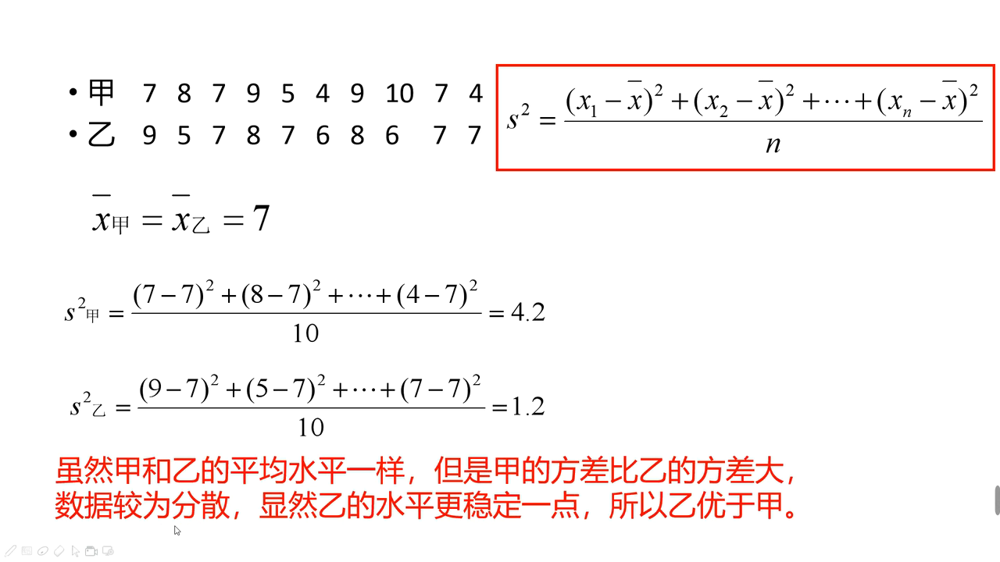
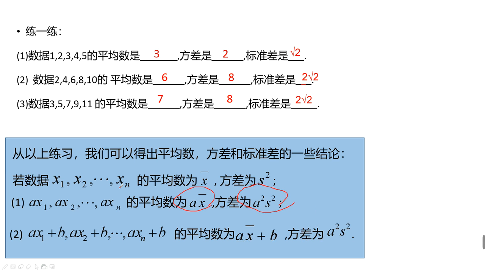
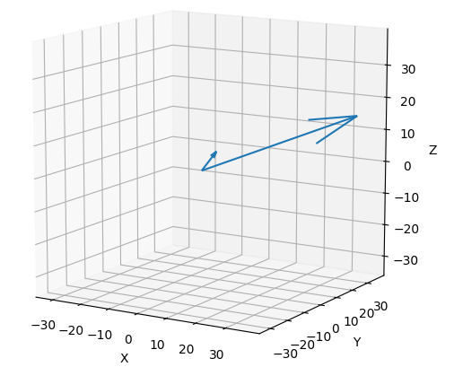
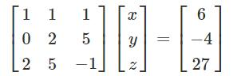
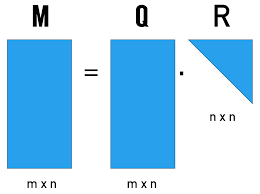

title:: main_numpy

- {{renderer :tocgen }}
-
- 官方文档
  collapsed:: true
	- https://numpy.org/devdocs/
- 安装 numpy
  collapsed:: true
	- 官方pip命令
	  collapsed:: true
		- pip3 install --user numpy scipy matplotlib
	- 清华源
	  collapsed:: true
		- pip3 install numpy scipy matplotlib -i https://pypi.tuna.tsinghua.edu.cn/simple
	- 国内源地址 : 在使用pip的时候加参数 -i
	  collapsed:: true
		- 清华大学：https://pypi.tuna.tsinghua.edu.cn/simple
		- 华为云：https://repo.huaweicloud.com/repository/pypi/simple
		- 阿里云：http://mirrors.aliyun.com/pypi
	- 测试是否安装成功
	  collapsed:: true
		- ```python
		  from numpy import *
		  
		  print(eye(4)) # 会输出一个4阶单位阵 
		  ```
- 在numpy中, 将小数显示为分数形式
  background-color:: #793e3e
  collapsed:: true
	- 引进下面的代码即可生效.
	- ```python
	  from fractions import Fraction
	  np.set_printoptions(formatter={'all':lambda x: str(Fraction(x).limit_denominator())})
	  ```
	- 又如:
	- ```python
	  from fractions import Fraction # 要让numpy输出分数形式, 要载入该模块. Fraction类具有一个内置方法limit_denominator(), 能将小数, 转换为分数显示
	  import numpy as np
	  import matplotlib.pyplot as plt
	  
	  # 设置矩阵元素输出用分数表示
	  np.set_printoptions(formatter={'all':lambda x: str(Fraction(x).limit_denominator())})
	  '''
	  set_printoptions() ——控制输出方式
	  formatter ——通用格式化输出
	  Fraction(x).limit_denominator(y) ——返回一个分母不大于y且最接近x的分数
	  '''
	  
	  a = np.array([[0,1],[0,0]])# <- 这是按行向量来写的矩阵, 第一个list代表第一行, 第二个list代表第二行
	  e_value, e_vec = np.linalg.eig(a) # 该方法获取矩阵的特征值, 和特征向量
	  print(e_value) # 特征值 -> [0 0] 说明有两个特征向量, 都是0
	  print(e_vec) # 特征向量, 要竖着看, 终点是 (1,0) 和(-1,0). 它们共线, 其实就只有一根特征向量
	  '''
	  [[1 -1]
	   [0 0]]
	   '''
	  ```
	- 特征向量其实只有一个, 因为他们是共线的.
	- 
-
- ---
- 轴
  collapsed:: true
	- 
	- 
	-
- 数据的类型
	- nan : not a number 表示它不是一个数字.  nan是一个float类型
	  collapsed:: true
		- 什么时候会返回nan类型?
		  collapsed:: true
			- 比如读取本地文件时, 里面的数据是float的, 如果有数据缺失, 就会出现nan.
			- 当你做了一个不合适的计算时, 比如用无穷大去减无穷小, 就会出现nan.
		- 两个nan是不相等的! 因为nan只是表示它不是一个数, 没说它是什么东西, 那它就可能是任何东西, 所以两个任何东西是几乎不存在等于关系的.
		  collapsed:: true
			- ```python
			  print(np.nan == np.nan) # False
			  print(np.nan != np.nan) # True
			  ```
		- 你可以强制指定数组中的某个元素为nan. 但前提是, 该数组中的元素必须是 float 浮点类型保存的, 而不能是用 int整型保存的. 换言之, 如果你的数组是 int 的, 就要先把它转成 float类型, 然后才能将某元素强制指定为 nan类型.
		  collapsed:: true
			- ```python
			  import numpy as np
			  
			  a1 = np.arange(12) # type:ndarray
			  a1 = a1.reshape((3, 4))
			  print(a1)
			  
			  '''
			  [[ 0  1  2  3]
			   [ 4  5  6  7]
			   [ 8  9 10 11]]
			   '''
			  
			  print(a1.dtype) # int32
			  # a1[1,2] =  np.nan # 报错 ValueError: cannot convert float NaN to integer
			  
			  #所以我们先要把数组转成 float类型来存储
			  a1 = a1.astype(float)
			  a1[1,2] =  np.nan # 将 index=行1列2 的元素, 赋值为nan
			  print(a1)
			  
			  '''
			  [[ 0.  1.  2.  3.]
			   [ 4.  5. nan  7.]
			   [ 8.  9. 10. 11.]]
			   '''
			  ```
		-
	- inf : infinity 无穷
	  collapsed:: true
		- 当你用一个数字除以0时, 就会返回 inf. inf也是一个浮点类型
- ---
- 增
	- 创建 ndarray 数组 -> np.arange(num1, num2, num3, ...)
	  collapsed:: true
		- ```python
		  import numpy as np
		  
		  # 方法1:
		  a1 = np.array([1,2,3]) # 创建ndarray数组
		  print(a1) # [1 2 3]
		  print(type(a1)) # <class 'numpy.ndarray'> ndarray 就是 numpy中 的数组类型
		  
		  ---
		  
		  # 方法2:
		  a2 = np.array(range(10))
		  print(a2) # [0 1 2 3 4 5 6 7 8 9]
		  
		  ---
		  
		  # 方法3:
		  a3 = np.arange(10)
		  print(a3) # [0 1 2 3 4 5 6 7 8 9]
		  
		  a4 = np.arange(4,10,2) # 从4开始, 到不包括10, 步长为2. 
		  print(a4) # [4 6 8]
		  ```
		- 注意: np.arange()方法, 只能创建一个有终点和起点的固定步长的排列, 而不能由你自定义任意数值的矩阵. 要想自定义数值, 你只能用 np.array()方法
	- 指定你所创建数组的类型 -> np.arange(12).reshape((3, 4)).astype(float)
	  collapsed:: true
		- ```python
		  # 用 .astype(数据类型) 方法, 可以指定数组中元素的存储类型
		  a = np.arange(12).reshape((3, 4)).astype(float)  # type: np.ndarray
		  
		  print(a)
		  
		  '''
		  [[ 0.  1.  2.  3.]
		   [ 4.  5.  6.  7.]
		   [ 8.  9. 10. 11.]]
		   '''
		  ```
	- 创建一个浮点数数组 ->  np.arange() 将第三个参数, 即步长值, 设为浮点数即可
	  collapsed:: true
		- ```python
		  import numpy as np
		  
		  # np.arange()中的第三个参数, 即"步长"值, 可以设为浮点数, 就创造出一个浮点数数组.
		  a = np.arange(0,20,1.0).reshape((4, 5))  # type: np.ndarray
		  print(a)
		  
		  '''
		  [[ 0.  1.  2.  3.  4.]
		   [ 5.  6.  7.  8.  9.]
		   [10. 11. 12. 13. 14.]
		   [15. 16. 17. 18. 19.]]
		   '''
		  
		  print(a.dtype) # float64
		  
		  ```
	-
	- 创建一个随机值的矩阵 -> np.empty((行数, 列数))
	  collapsed:: true
		- ```python
		  import numpy as np
		  
		  # 创建一个矩阵, 里面的元素为随机值.
		  a = np.empty((2,3)) # 2行3列
		  print(a)
		  
		  '''
		  [[6.23042070e-307 1.42417221e-306 1.78017181e-306]
		   [6.89809904e-307 1.15711378e-306 7.41991654e+279]]
		   '''
		  ```
	- 创建一个元素值都为0 的矩阵(零矩阵) -> np.zeros((行数, 列数))
	  background-color:: #793e3e
	  id:: 62a422b6-5ff4-48ec-8097-739be1d620bd
	  collapsed:: true
		- ```python
		  import numpy as np
		  
		  # 创建一个矩阵, 里面的元素都为0.
		  a = np.zeros((2,3)) # 2行3列
		  print(a)
		  
		  '''
		  [[0. 0. 0.]
		   [0. 0. 0.]]
		   '''
		  ```
	- 创建一个元素值都为1 的矩阵 -> np.ones((行数, 列数))
	  collapsed:: true
		- ```python
		  import numpy as np
		  
		  # 创建一个矩阵, 里面的元素都为1.
		  a = np.ones((2,3)) # 2行3列
		  print(a)
		  
		  '''
		  [[1. 1. 1.]
		   [1. 1. 1.]]
		   '''
		  ```
	- 创建一个单位阵E -> np.identity(阶数)
	  background-color:: #793e3e
	  id:: 62a4262e-b070-4d9b-969c-aed975a77081
	  collapsed:: true
		- id:: 62a4264f-b033-47c1-af85-0cc441a43938
		  ```python
		  import numpy as np
		  
		  # 创建一个4阶的单位阵
		  a = np.identity(4)
		  
		  print(a)
		  
		  '''
		  [[1. 0. 0. 0.]
		   [0. 1. 0. 0.]
		   [0. 0. 1. 0.]
		   [0. 0. 0. 1.]]
		   '''
		  ```
		-
	- 创建一个单位阵E -> np.eye(单位阵的阶数)
	  background-color:: #793e3e
	  id:: 62a42342-8172-413e-916b-b1ee9f504ee2
	  collapsed:: true
		- ```python
		  import numpy as np
		  
		  # 创建一个矩阵, 里面的元素都为1.
		  a = np.eye(4) # 4阶
		  print(a)
		  
		  '''
		  [[1. 0. 0. 0.]
		   [0. 1. 0. 0.]
		   [0. 0. 1. 0.]
		   [0. 0. 0. 1.]]
		   '''
		  ```
	- 创建一个非方阵的"伪单位阵" -> np.eye(行数, 列数)
	  id:: 62a42399-3845-4efd-836c-bb06c13fdda9
		- 创建一个非方阵的"伪单位阵" -> np.eye(行数, 列数)
		  collapsed:: true
			- > numpy.eye(n, M,k, dtype)
			  n: 返回矩阵的行数
			  M: 返回矩阵的列数，默认为 n
			  k: 对角线开始处的 列的index值
			  dtype: 数据类型
			- ```python
			  import numpy as np
			  
			  # 创建一个矩阵, 对角线元素为 1，其他位置为零。
			  a = np.eye(4,3) # 4行3列
			  print(a)
			  
			  '''
			  [[1. 0. 0.]
			   [0. 1. 0.]
			   [0. 0. 1.]
			   [0. 0. 0.]]
			   '''
			  ```
		- 若要控制第一个1 是从第几列开始的, 就用k参数来指定, 即: k = 首位1出现的那个列的index
		  collapsed:: true
			- id:: 62a425a9-dbb2-4685-a142-62dcecb3c32b
			  ```python
			  import numpy as np
			  
			  # 创建一个矩阵, 对角线元素为 1，其他位置为零。
			  a = np.eye(4,6,k=2) 
			  # k参数, 用来确定首位的1, 从第几列开始进行. 
			  # 比如本例, k=2, 即从 列的 index=2 处的列, 开始进行.
			  
			  print(a)
			  
			  '''
			  [[0. 0. 1. 0. 0. 0.]
			   [0. 0. 0. 1. 0. 0.]
			   [0. 0. 0. 0. 1. 0.]
			   [0. 0. 0. 0. 0. 1.]]
			   '''
			  ```
			-
			-
	-
	-
-
- ---
- 删
-
- ---
- 改
	- 加减乘除等运算
	  background-color:: #264c9b
		- 让两个数组, 对应元素相加 -> 数组a +  数组b
		  collapsed:: true
			- ```python
			  import numpy as np
			  
			  a1 = np.arange(6).reshape(2,3)
			  a2 = np.arange(100,106).reshape(2,3)
			  
			  print(a1)
			  '''
			  [[0 1 2]
			   [3 4 5]]
			  '''
			  
			  print(a2)
			  '''
			  [[100 101 102]
			   [103 104 105]]
			  '''
			  
			  
			  a3 = a1 + a2 # a1 和a2 数组中的 对应元素相加
			  print(a3 )
			  '''
			  [[100 102 104]
			   [106 108 110]]
			  '''
			  ```
		-
		- 给数组中的每个元素, 同时加上 (加减乘除)一个数字
		  collapsed:: true
			- ```python
			  import numpy as np
			  
			  a1 = np.arange(10)
			  print(a1) # [0 1 2 3 4 5 6 7 8 9]
			  
			  a2 = a1 + 5 # 将a1数组中的每个元素, 都加上5
			  print(a2) # [ 5  6  7  8  9 10 11 12 13 14]
			  
			  a2 = a1 * 3 # 将a1数组中的每个元素, 都乘上3
			  print(a2) # [ 0  3  6  9 12 15 18 21 24 27]
			  ```
			-
		- 不同行列数的两个数组, 做加减乘除
			- 两个数组, "列数"相同: $a_{3 \times 4} - b_{1 \times 4}$
			  collapsed:: true
				- ```python
				  import numpy as np
				  
				  a = np.arange(12).reshape((3,4))
				  print(a)
				  
				  '''
				  [[ 0  1  2  3]
				   [ 4  5  6  7]
				   [ 8  9 10 11]]
				   '''
				  
				  b = np.arange(4)
				  print(b) # [0 1 2 3]
				  
				  print(a-b) # a是3行4列的, b是1行4列的, 那么这两个数组相减, 怎么减呢? 既然它们列数相同, 那就用每行上的相应列数元素, 来减. 即: 用a的每一行上的列元素, 去减b的行上的对应列元素.
				  
				  '''
				  [[0 0 0 0]  <- a的第1行中: a_11 - b_11, a_12 - b_12, a_13 - b_13, a_14 - b_14,
				   [4 4 4 4]  <- a的第2行中: a_21 - b_11, a_22 - b_22, a_23 - b_13, a_24 - b_14,
				   [8 8 8 8]] <- a的第3行中: a_31 - b_11, a_32 - b_12, a_33 - b_13, a_34 - b_14,
				   '''
				  ```
			- 两个数组, "行数"相同:  $a_{3 \times 4} - b_{3 \times 1}$
			  collapsed:: true
				- ```python
				  import numpy as np
				  
				  a = np.arange(12).reshape((3,4))
				  print(a)
				  
				  '''
				  [[ 0  1  2  3]
				   [ 4  5  6  7]
				   [ 8  9 10 11]]
				   '''
				  
				  b = np.arange(3).reshape((3,1)) # b是3行1列
				  print(b)
				  
				  '''
				  [[0]
				   [1]
				   [2]]
				   '''
				  
				  print(a-b) # a是3行4列, b是3行1列, 这两个数组相减, 既然它们行数相同, 那就用a的每一列上的"每个行元素", 去减b的列上的"对应行元素".
				  
				  '''
				  [[0 1 2 3]  <- = a_11-b_11, a_12-b_11, a_13-b_11, ...
				   [3 4 5 6]  <- = a_21-b_21, a_22-b_21, a_23-b_21, ...
				   [6 7 8 9]] <- = a_31-b_31, a_32-b_31, a_33-b_31, ...
				   '''
				  ```
	-
	- 修改形状, 行列数
	  background-color:: #264c9b
		- 对数组进行转置 -> obj.transpose()
		  collapsed:: true
			- ```python
			  import numpy as np
			  
			  a = np.arange(12).reshape((3,4))
			  print(a)
			  
			  '''
			  [[ 0  1  2  3]
			   [ 4  5  6  7]
			   [ 8  9 10 11]]
			  '''
			  
			  b = a.transpose() # 做转置, 即行变列, 列变行
			  print(b)
			  
			  '''
			  [[ 0  4  8]
			   [ 1  5  9]
			   [ 2  6 10]
			   [ 3  7 11]]
			  '''
			  ```
		- 修改数据的行列数 -> obj.reshape( (新行数,新列数) )
			- 该方法, 输入一个tuple作为参数. 将新的行数和列数, 放在tuple中.
			  collapsed:: true
				- ```python
				  a1 = np.arange(24)
				  print(a1.shape) # (24,)
				  
				  a1 = a1.reshape((2,3,4)) # 改成三层嵌套, 相当于是3维空间的.
				  '''
				  改成3层列表嵌套: 
				  第一层是两个list, 
				  第二层的每个list中, 又包含3个list. 
				  第三层的每个list中, 又包含4个数值. 
				  于是就共有 2*3*4 = 24个数值.
				  '''
				  
				  print(a1)
				  
				  '''
				  [[[ 0  1  2  3]
				    [ 4  5  6  7]
				    [ 8  9 10 11]]
				  
				   [[12 13 14 15]
				    [16 17 18 19]
				    [20 21 22 23]]]
				   '''
				  
				  ---
				  
				  print(a1.shape) # (2, 3, 4)
				  
				  a1_2Dimension = a1.reshape((2,12)) # 重新改成2行12列,即二维空间中的值
				  
				  print(a1_2Dimension)
				  
				  '''
				  [[ 0  1  2  3  4  5  6  7  8  9 10 11]
				   [12 13 14 15 16 17 18 19 20 21 22 23]]
				  '''
				  
				  print(a1_2Dimension.shape) # (2, 12)
				  ```
			- 升维
				- 将数组, 改成两层嵌套的 3行4列
				  collapsed:: true
					- ```python
					  a1 = np.arange(12)
					  print(a1.shape) # (12,)
					  
					  a1 = a1.reshape((3,4)) # 进行修改, 改成3行4列
					  print(a1)
					  
					  '''
					  [[ 0  1  2  3]
					   [ 4  5  6  7]
					   [ 8  9 10 11]]
					   '''
					  
					  print(a1.shape) # (3, 4)
					  ```
				- 将数组, 改成3层嵌套
				  collapsed:: true
					- ```python
					  a1 = np.arange(24)
					  print(a1.shape) # (24,)
					  
					  a1 = a1.reshape((2,3,4)) # 改成三层嵌套, 相当于是3维空间的.
					  '''
					  改成3层列表嵌套:
					  第一层是两个list,
					  第二层的每个list中, 又包含3个list.
					  第三层的每个list中, 又包含4个数值.
					  于是就共有 2*3*4 = 24个数值.
					  '''
					  
					  print(a1)
					  
					  '''
					  [[[ 0  1  2  3]
					    [ 4  5  6  7]
					    [ 8  9 10 11]]
					  
					   [[12 13 14 15]
					    [16 17 18 19]
					    [20 21 22 23]]]
					   '''
					  ```
			- 降维
				- 将3维数组, 重新改为2维数组
				  collapsed:: true
					- ```python
					  print(a1.shape) # (2, 3, 4) <- a1目前是三维数组, 有三层嵌套.
					  
					  a1_2Dimension = a1.reshape((2,12)) # 重新改成2行12列,即二维空间中的值
					  
					  print(a1_2Dimension)
					  
					  '''
					  [[ 0  1  2  3  4  5  6  7  8  9 10 11]
					   [12 13 14 15 16 17 18 19 20 21 22 23]]
					  '''
					  
					  print(a1_2Dimension.shape) # (2, 12)
					  ```
				- 将多维数组, 改成1维数组 (即只有一行, 只有一个list)
				  collapsed:: true
					- ```python
					  import numpy as np
					  
					  a1 = np.arange(24)
					  a1 = a1.reshape((4,6)) # 先改成4行6列
					  print(a1.shape) # (4, 6)
					  
					  a1 = a1.reshape((24,)) # 改回一维数组. 即将列表中的全部24个元素, 放在一个list中.
					  print(a1) # [ 0  1  2  3  4  5  6  7  8  9 10 11 12 13 14 15 16 17 18 19 20 21 22 23]
					  ```
				- 将多维数组, 改成一维数组 -> 直接用 obj.flatten()方法
	-
	- 按条件修改
	  background-color:: #264c9b
		- 三元运算符 -> np.where(数组obj < 某个数, 为真的就赋值某个数, 不符合条件的就赋值某个数)
		  collapsed:: true
			- ```python
			  import numpy as np
			  
			  a1 = np.arange(12)
			  a1 = a1.reshape((3, 4))
			  
			  a1 = np.where(a1<6, 0, 10) # 对a1数组里面的元素, 若小于6的,就都赋值为0; 对大于等于6的, 就都赋值为10
			  print(a1)
			  
			  '''
			  [[ 0  0  0  0]
			   [ 0  0 10 10]
			   [10 10 10 10]]
			  '''
			  ```
		- obj.clip(a_min, a_max) -> 对于数组中的元素, 大于a_max的就使得它等于 a_max，小于a_min,的就使得它等于a_min。粗略说, 就是将头部段数值都变成同一个数, 将尾部段数值也都变成同一个数.
		  collapsed:: true
			- ```python
			  import numpy as np
			  
			  a1 = np.arange(20)
			  a1 = a1.reshape((5, 4))
			  
			  a1 = a1.clip(5,10) # 对a1数组里面的元素, 若小于5的,就都赋值为5; 对大于等于10的, 就都赋值为10
			  print(a1)
			  
			  '''
			  [[ 5  5  5  5]
			   [ 5  5  6  7]
			   [ 8  9 10 10]
			   [10 10 10 10]
			   [10 10 10 10]]
			  '''
			  ```
	-
-
- ---
- 查
	- 查看数组的属性
		- 查看数据类型 -> obj.dtype
		  collapsed:: true
			- ```python
			  a4 = np.arange(4,10,2) # 从4开始, 到不包括10, 步长为2
			  print(a4) # [4 6 8]
			  
			  print(a4.dtype) # int32
			  ```
		- 查看数据的行列数 -> obj.shape
		  collapsed:: true
			- obj.shape的返回值, 是个tuple, 第一个元素就是行数, 第二个元素就是列数.
			  collapsed:: true
				- ```python
				  a1 = np.array([[1,2,3],[4,5,6]])
				  print(a1.shape) # (2, 3) 两行三列
				  ```
			- 通过行列数, 就能计算出数组中元素的总数了, 即:  元素总数=行数 * 列数
			  collapsed:: true
				- ```python
				  import numpy as np
				  
				  a1 = np.arange(24)
				  a1 = a1.reshape((4,6)) # 先改成4行6列
				  
				  print(a1.shape) # (4, 6) <- 这是个元祖, 第一个数字是行数, 第二个数字是列数. 那么我们就能用索引, 来应用到它们了.
				  
				  print(a1.shape[0]) # 4 <- 元祖中的第一个item, 是行数
				  print(a1.shape[1]) # 6 <- 元祖中的第2个item, 是列数
				  
				  # 所以, 当我们不知道一个数组中到底有多少元素时, 也不知道它们被划分成了几行几列, 但我们想把它们变成一行, 就可以先查出它们的行数和列数, 就能知道: 元素总数 = 行数 * 列数.
				  a1_元素总数 = a1.shape[0] * a1.shape[1] # 行数 * 列数 = 一个数组中的元素总数
				  a1_oneLine = a1.reshape((a1_元素总数,))
				  print(a1_oneLine) # [ 0  1  2  3  4  5  6  7  8  9 10 11 12 13 14 15 16 17 18 19 20 21 22 23]
				  ```
			-
	-
	- 按条件查询
		- 按条件查询
		  collapsed:: true
			- ```python
			  import numpy as np
			  
			  a1 = np.arange(12)
			  a1 = a1.reshape((3,4))
			  
			  print(a1 < 10) # 可以直接用数学比较符号, 来查看数组中各个元素与某数相比的大小情况
			  
			  '''
			  [[ True  True  True  True]
			   [ True  True  True  True]
			   [ True  True False False]]
			   '''
			  
			  #查看数组中小于10的数值, 具体是哪些
			  print(a1[a1<10]) # [0 1 2 3 4 5 6 7 8 9]
			  ```
		- 将数组中符合某条件的数值, 进行批量修改
		  collapsed:: true
			- ```python
			  import numpy as np
			  
			  a1 = np.arange(12)
			  a1 = a1.reshape((3, 4))
			  
			  a1[a1<8] = 0 # 将数组中小于8的 数值, 都赋值为0
			  print(a1)
			  
			  '''
			  [[ 0  0  0  0]
			   [ 0  0  0  0]
			   [ 8  9 10 11]]
			  '''
			  ```
			-
		- 对比两个数组中元素的异同 -> print(a数组 != b数组)
		  collapsed:: true
			- ```python
			  # 注意, 创建自定义的数组, 要用 np.array()方法, 而不是 np.ndarray()方法, 后者是其他作用.
			  a = np.array([[1,2,3],[4,5,6],[7,8,9]])
			  b = np.array([[0,2,3],[0,5,6],[7,np.nan,np.nan]])
			  
			  print(b)
			  
			  '''
			  [[ 0.  2.  3.]
			   [ 0.  5.  6.]
			   [ 7. nan nan]]
			  '''
			  
			  # 对比两个数组, 将不相同的值, 标识出位置来
			  print(a != b)
			  
			  '''
			  [[ True False False]
			   [ True False False]
			   [False  True  True]]
			   '''
			  
			  # 统计出两个数组中, 不相同元素的个数
			  print(np.count_nonzero(a != b)) # 4 <- 即有4个ture
			  ```
		- 查出一个数组中, 为nan类型的那些元素 -> np.isnan(某数组)
		  collapsed:: true
			- ```python
			  b = np.array([[0,2,3],[0,5,6],[7,np.nan,np.nan]])
			  
			  print(b)
			  
			  '''
			  [[ 0.  2.  3.]
			   [ 0.  5.  6.]
			   [ 7. nan nan]]
			  '''
			  
			  print(np.isnan(b))
			  
			  '''
			  [[False False False]
			   [False False False]
			   [False  True  True]]
			   '''
			  
			  # 统计出一个数组中, 是nan类型的元素的个数
			  print(np.count_nonzero(np.isnan(b))) # 2
			  ```
	-
- ---
- 切片
	- 取出某些行, 或某些列
	  collapsed:: true
		- ```python
		  import numpy as np
		  
		  a = np.arange(20).reshape((4, 5))  # type: np.ndarray
		  print(a)
		  
		  '''
		  [[ 0  1  2  3  4]
		   [ 5  6  7  8  9]
		   [10 11 12 13 14]
		   [15 16 17 18 19]]
		  '''
		  
		  # 取出某一行
		  print(a[2])  # 取出 index=2的, 即第3行.  [10 11 12 13 14]
		  
		  # 取出连续的多行:
		  print(a[1:])  # 取出 "index = 1到最后" 的这几行.
		  
		  '''
		  [[ 5  6  7  8  9]
		   [10 11 12 13 14]
		   [15 16 17 18 19]]
		   '''
		  
		  # 取出不连续的多行:
		  print(a[[0, 2]])  # 注意: 这里不是冒号(不是取"连续的行"). 而是逗号, 即单独取不连续的行或列. 本例, 是取"index =0 和 2 的这两行. 注意: 要把多行的各自索引值, 写在一个list中
		  
		  '''
		  [[ 0  1  2  3  4]
		   [10 11 12 13 14]]
		   '''
		  
		  # 取出某一列:
		  print(a[:, 1])  # [ 1  6 11 16] <- 逗号前面是写行的索引值, 逗号后面是写列的索引值. 这里取出 index =1 的列. 注意: 逗号前的冒号不能少.
		  
		  # 取出连续的多列:
		  print(a[:, 2:])  # 取出"index = 2到最后" 的列
		  
		  '''
		  [[ 2  3  4]
		   [ 7  8  9]
		   [12 13 14]
		   [17 18 19]]
		  '''
		  
		  # 取不连续的多列
		  print(a[:, [0, 2, 4]])  # 取出 index=0,2,4 的这三列.
		  
		  '''
		  [[ 0  2  4]
		   [ 5  7  9]
		   [10 12 14]
		   [15 17 19]]
		  '''
		  
		  # 取某一行某一列上的那个数值
		  print(a[1,2]) # 7 <- 取 index=1的行, 及 inde=2的列 上的值. 同样, 逗号前写"行数"的索引值, 逗号后写"列数"的索引值
		  
		  # 同时取多行多列的数组子集
		  # 比如, 取第2-3行, 第3-4列的 那块数组子集.
		  print(a[1:3,2:4]) # 注意, 切片索引是"包头不包尾"的.
		  
		  '''
		  [[ 7  8]
		   [12 13]
		  '''
		  
		  #取多个"不相邻的行列交叉点"上的数值. 只要把这几个数值的index(行与列的), 输进去即可.
		  # 比如,我们来取三个值: 其索引值分别是: index=行1列2, index=行2列0, index=行3列4
		  print(a[[1,2,3],[2,0,4]]) #  <- 即三个数的行index, 放在逗号前面; 三个数的列index, 放在逗号后面. [ 7 10 19]
		  ```
		- 
	-
- ---
- 计数, 统计
	- 统计一个数组中的"非零元素"的数量 ->  np.count_nonzero(某数组)
	  collapsed:: true
		- ```python
		  import numpy as np
		  
		  # np.arange()中的第三个参数, 即"步长"值, 可以设为浮点数, 就创造出一个浮点数数组.
		  a = np.arange(12).reshape((3, 4))  # type: np.ndarray
		  a[:,0] = 0 # 逗号后是列的index, 将 列的 index=0 的那一列, 都赋值为0
		  print(a)
		  
		  '''
		  [[ 0  1  2  3]
		   [ 0  5  6  7]
		   [ 0  9 10 11]]
		   '''
		  
		  # 统计一个数组中的"非零元素"的数量, 就用 np.count_nonzero() 方法
		  print(np.count_nonzero(a)) # 9
		  ```
	- 求和 -> np.sum(某数组, axis=?)  或 某数组.sum(axis=?)
	  background-color:: #264c9b
		- 求一个数组中的所有元素, 全加起来的"总和" -> np.sum(某数组)
		  collapsed:: true
			- ```python
			  a = np.arange(5)
			  print(a) # [0 1 2 3 4]
			  print(np.sum(a)) # 10
			  
			  # 又如
			  b = np.arange(6).reshape((3,2))
			  print(b)
			  
			  '''
			  [[0 1]
			   [2 3]
			   [4 5]]
			   '''
			  print(np.sum(b)) # 15
			  ```
			- 但注意: nan和任何值计算, 都为nan.
			  collapsed:: true
				- ```python
				  a = np.array([1,2,3,np.nan, np.nan])
				  print(a) # [ 1.  2.  3. nan nan]
				  
				  # 只要数组中有元素是nan, 把它们全加起来, 就会是nan (即一个老鼠屎坏了一锅汤)
				  print(np.sum(a)) # nan
				  ```
		- 将矩阵中的每列, 相加 -> np.sum(某数组, axis=0)
		  collapsed:: true
			- np.sum()中, 参数 axis 若=0, 则就是将矩阵的"每一列", 相加成一个数字. 比如一个矩阵有3列, 最后就成为3个数字.
			- ```python
			  a = np.array([[1,2,3],[4,5,6],[7,8,9]])
			  print(a)
			  
			  '''
			  [[1 2 3]
			   [4 5 6]
			   [7 8 9]]
			   '''
			  
			  # np.sum()中, 参数 axis 若=0, 则就是将矩阵的每一列, 相加成一个数字. 
			  print(np.sum(a, axis=0)) # [12 15 18]
			  ```
			- 
		- 将矩阵中的每行, 相加 -> np.sum(某数组, axis=1)
		  collapsed:: true
			- np.sum()中, 参数 axis 若=1, 则就是将矩阵的"每一行", 相加成一个数字. 比如本例矩阵有4列, 最后就成为4个数字.
			- ```python
			  a = np.arange(12).reshape((4,3))
			  print(a)
			  
			  '''
			  [[ 0  1  2]
			   [ 3  4  5]
			   [ 6  7  8]
			  [ 9 10 11]]
			   '''
			  
			  # np.sum()中, 参数 axis 若=1, 则就是将矩阵的每一行, 相加成一个数字. 比如本例矩阵有4列, 最后就成为4个数字.
			  print(np.sum(a, axis=1)) # [ 3 12 21 30]
			  ```
			- 
		-
	- 求平均值 -> 某数组.mean(axis=?)
	  background-color:: #264c9b
	  collapsed:: true
		- ```python
		  a = np.array([[3,5,1],[7,9,2],[4,5,9],[2,3,0]]) # type: np.ndarray
		  print(a)
		  
		  '''
		  [[3 5 1]
		   [7 9 2]
		   [4 5 9]
		   [2 3 0]]
		   '''
		  
		  # 求平均值 -> 用 某数组.mean() 方法
		  print(a.mean()) # 4.166666666666667
		  print(a.mean(axis=0)) # 每一列的均值 [4.  5.5 3. ]
		  print(a.mean(axis=1)) # 每一行的均值 [3.         6.         6.         1.66666667]
		  ```
	- 求中值(中位数) -> np.median(某数组, axis=?)
	  background-color:: #793e3e
	  collapsed:: true
		- 中值（又称中位数）: 是指将统计总体当中的各个变量值, 按大小顺序排列起来，形成一个数列，**处于变量数列中间位置的变量值, 就称为中位数.**
		- 一组数从小到大或从大到小排列，奇数个数的话取中间的数字，偶数个数的话取中间两个数的平均数.
		- ```python
		  a = np.array([[3,5,1],[7,9,2],[4,5,9],[2,3,0]]) # type: np.ndarray
		  print(a)
		  
		  '''
		  [[3 5 1]
		   [7 9 2]
		   [4 5 9]
		   [2 3 0]]
		   '''
		  
		  # 求中位数 -> 用 np.median(某数组, axis=?) 
		  print(np.median(a)) # 3.5
		  print(np.median(a,axis=0)) # 每一列的中位数 [3.5 5.  1.5]
		  print(np.median(a,axis=1)) # 每一行的中位数 [3. 7. 5. 2.]
		  ```
	- 求最大值/最小值 -> 某数组.max(axis=?)  和  某数组.min(axis=?)
	  background-color:: #264c9b
	  collapsed:: true
		- ```python
		  a = np.array([[3,5,1],[7,9,2],[4,5,9],[2,3,0]]) # type: np.ndarray
		  print(a)
		  
		  '''
		  [[3 5 1]
		   [7 9 2]
		   [4 5 9]
		   [2 3 0]]
		   '''
		  
		  # 求最大值 -> 用 某数组.max(axis=?) 方法
		  print(a.max()) # 9
		  print(a.max(axis=0)) # 每一列中的最大值 [7 9 9]
		  print(a.max(axis=1)) # 每一行中的最大值 [5 9 9 3]
		  
		  
		  # 求最小值 -> 用 某数组.min(axis=?) 方法
		  print(a.min()) # 0
		  print(a.min(axis=0)) # 每一列中的最小值 [2 3 0]
		  print(a.min(axis=1)) # 每一行中的最小值 [1 2 4 0]
		  ```
	- 求"极值之差距"(=最大值-最小值) -> np.ptp(某数组, axis=?)
	  background-color:: #793e3e
	  collapsed:: true
		- 极值之差距 peak to peak, 就是最大值和最小值之间的差.
		- ```python
		  a = np.array([[3,5,1],[7,9,2],[4,5,9],[2,3,0]]) # type: np.ndarray
		  print(a)
		  
		  '''
		  [[3 5 1]
		   [7 9 2]
		   [4 5 9]
		   [2 3 0]]
		   '''
		  
		  # 求极值-> 用 np.ptp(某数组, axis=?) 方法
		  print(np.ptp(a)) # 9 <- 即整个数组中的最大元素-最小元素 的差
		  print(np.ptp(a, axis=0)) # [5 6 9] <- 每列中的 最大元素-最小元素 的差
		  print(np.ptp(a, axis=1)) # [4 7 5 3] <- 每行中的 最大元素-最小元素 的差
		  ```
		-
	- 求标准差 -> 某数组.std(axis=?)
	  background-color:: #793e3e
	  collapsed:: true
		- 标准差 Standard Deviation, 用σ表示。
		  collapsed:: true
			- 
			- 
			- "标准差"再做平方后, 就是"方差".
			- **概率论中, "方差"用来度量"随机变量"和其"数学期望（即均值）"之间的偏离程度。**
			-
			- 
			- 
			- 上面的结论, 
			  -> 第1个就是 每个数据的系数倍, 系数是a
			  ->第2个就是  每个数据的系数a倍后, 再加上一个常数b
			-
			-
			-
		- 求"标准差"的方法 -> 某数组.std(axis=?)
		  collapsed:: true
			- ```python
			  a = np.array([[3,5,1],[7,9,2],[4,5,9],[2,3,0]]) # type: np.ndarray
			  print(a)
			  
			  '''
			  [[3 5 1]
			   [7 9 2]
			   [4 5 9]
			   [2 3 0]]
			   '''
			  
			  # 求标准差-> 用 np.ptp(某数组, axis=?) 方法. 标准差的数值越大, 说明波动越大, 越不稳定
			  print(np.std(a)) # 2.823512391016236
			  print(np.std(a, axis=0)) # [1.87082869 2.17944947 3.53553391] <- 每列的 标准差
			  print(np.std(a, axis=1)) # [1.63299316 2.94392029 2.1602469  1.24721913]<- 每行的 标准差
			  ```
		-
- ---
- numpy 读取本地文件(csv文件)中的数据 → np.loadtxt()
	- numpy.loadtxt() 中的参数说明
	  collapsed:: true
		- > numpy.loadtxt(fname, <- 文件路径
		  dtype=<class 'float'>, <- 数据读取出来后, 指定的存储类型
		  comments='#', <- 跳过文件中指定参数开头的行（即不读取）. 比如, 注释语句使用 '#' 作为开头标识的, 就可以把这些行跳过.
		  delimiter=None, <- 本地文件中的用来分割数据的字符串
		  converters=None,
		  skiprows=0, <- 本地文件中, 跳过的行数
		  usecols=None, <- 读取的列数 (因为可能我们不需要读取本地文件中的全部列数)
		  unpack=False, <- # 设为true时, 进行转置. 即行变列 , 列变行
		  ndmin=0,
		  encoding='bytes', <- 对读取的文件进行预编码
		  max_rows=None,
		  *,
		  quotechar=None,
		  like=None)
	- 读取一个csv文件
	  collapsed:: true
		- ```python
		  import numpy as np
		  
		  path_csv = r"C:\phpStorm_proj\py\csv.csv"
		  
		  a1 = np.loadtxt(path_csv, delimiter=",", dtype="int")
		  
		  print(a1)
		  '''
		  [[ 1  2  3  4  5]
		   [ 6  7  8  9 10]
		   [11 12 13 14 15]]
		   '''
		  
		  
		  a1 = np.loadtxt(path_csv, delimiter=",", dtype="int", unpack=True) # unpack=True 对矩阵进行转置. 原行变列, 原列变行. 即读取csv文件进来的时候, 就进行转置的预操作.
		  
		  print(a1)
		  
		  '''
		  [[ 1  6 11]
		   [ 2  7 12]
		   [ 3  8 13]
		   [ 4  9 14]
		   [ 5 10 15]]
		   '''
		  ```
-
- ---
- 专题
	- 矩阵操作
		- ((62a422b6-5ff4-48ec-8097-739be1d620bd))
		- ((62a4262e-b070-4d9b-969c-aed975a77081))
		- 矩阵的秩 rank -> np.linalg.matrix_rank(某矩阵)
		  collapsed:: true
			- ```python
			  import numpy as np
			  from fractions import Fraction
			  np.set_printoptions(formatter={'all':lambda x: str(Fraction(x).limit_denominator())})
			  
			  a = np.array([[1,-1,4],[1,4,-2],[1,4,2],[1,-1,0]])
			  print(a)
			  '''
			  [[1 -1 4]
			   [1 4 -2]
			   [1 4 2]
			   [1 -1 0]]
			   '''
			  
			  # 获取矩阵的 rnak
			  r= np.linalg.matrix_rank(a)
			  print(r) # 3
			  ```
		- 矩阵的转置 -> 方法1:  np.transpose(某矩阵),   方法2:  某矩阵.T
		  collapsed:: true
			- 注意: 方法2 中, T 其实只是"矩阵对象"中的一个"属性"而已, 可以直接调用该属性.
			- ```python
			  import numpy as np
			  
			  a = np.arange(6).reshape((2, 3)) # type: np.ndarray
			  b = np.arange(10,16).reshape((3, 2)) # type: np.ndarray
			  
			  print(a)
			  '''
			  [[0 1 2]
			   [3 4 5]]
			   '''
			  
			  print(b)
			  '''
			  [[10 11]
			   [12 13]
			   [14 15]]
			  '''
			  
			  # 对矩阵a做转置
			  print(np.transpose(a))
			  '''
			  [[0 3]
			   [1 4]
			   [2 5]]
			   '''
			  
			  # 对矩阵b做转置
			  print(b.T)
			  '''
			  [[10 12 14]
			   [11 13 15]]
			   '''
			  ```
		- 矩阵的逆阵(注意, 只有"方阵"才有逆) -> 方法1: np.linalg.inv(某方阵) , 方法2: 某矩阵.I
		  background-color:: #793e3e
		  collapsed:: true
			- linalg 是np下的一个子包, 它名字其实就是 linear algebra "线性代数"的英文缩写.
			- ```python
			  import numpy as np
			  
			  a = np.array([[0, 1, 0], [1, 0, 1], [-1, 0, 1]])
			  print(a)
			  '''
			  [[ 0  1  0]
			   [ 1  0  1]
			   [-1  0  1]]
			   '''
			  
			  # 对方阵a, 求逆阵
			  a_inv = np.linalg.inv(a)
			  print(a_inv)
			  '''
			  [[ 0.   0.5 -0.5]
			   [ 1.   0.   0. ]
			   [ 0.   0.5  0.5]]
			   '''
			  
			  # 注意, 若报错 : numpy.linalg.LinAlgError: Singular matrix, 则说明你给的方阵a, 不可逆.
			  
			  #我们来验证一下, 根据定义: 给定一个n阶方阵A，若存在一n阶方阵B, 使得AB=BA=E（或AB=E、BA=E 任满足一个），其中E为n阶单位矩阵，则称A是可逆的，且B是A的逆阵.
			  
			  print(np.dot(a, a_inv))
			  '''
			  [[1. 0. 0.]
			   [0. 1. 0.]
			   [0. 0. 1.]]
			   '''
			  
			  print(np.dot(a_inv,a))
			  '''
			  [[1. 0. 0.]
			   [0. 1. 0.]
			   [0. 0. 1.]]
			   '''
			  ```
			- 更简便的求逆方法: 某矩阵.I
			- ```python
			  import numpy as np
			  
			  a = np.array([[0, 1, 0], [1, 0, 1], [-1, 0, 1]]) # type: ndarray
			  
			  a = np.matrix(a) # 这句话必须要有! 它其实是把 数组array 转成了 真正的matrix 类型. 如果没有这句话, 下面的代码 a.I 会报错. 因为 数组类型的a 是没有逆矩阵的, 只有矩阵类型的a才有逆矩阵. 所以必须要先做类型转换!
			  
			  a_inv = a.I # 对a矩阵对象, 取其逆矩阵
			  print(a_inv)
			  '''
			  [[ 0.   0.5 -0.5]
			   [ 1.   0.   0. ]
			   [ 0.   0.5  0.5]]
			  '''
			  
			  print(np.dot(a,a_inv))
			  '''
			  [[1. 0. 0.]
			   [0. 1. 0.]
			   [0. 0. 1.]]
			   '''
			  ```
		- 两个矩阵相加减
		  collapsed:: true
			- ```python
			  import numpy as np
			  
			  a = np.arange(6).reshape((2, 3)) # type: np.ndarray
			  b = np.arange(10,16).reshape((2, 3)) # type: np.ndarray
			  
			  print(a)
			  '''
			  [[0 1 2]
			   [3 4 5]]
			   '''
			  
			  print(b)
			  '''
			  [[10 11 12]
			   [13 14 15]]
			  '''
			  
			  # 两个矩阵相加
			  print(a+b)
			  '''
			  [[10 12 14]
			   [16 18 20]]
			   '''
			  ```
		- 矩阵的数乘
		  collapsed:: true
			- ```python
			  a = np.arange(6).reshape((2, 3)) # type: np.ndarray
			  
			  print(a)
			  '''
			  [[0 1 2]
			   [3 4 5]]
			   '''
			  
			  # 矩阵的数乘
			  print(2 * a)
			  '''
			  [[ 0  2  4]
			   [ 6  8 10]]
			   '''
			  ```
		- 两个矩阵相乘 -> numpy.matmul(a, b)
		  collapsed:: true
			- matmul 就是 matmul product
			- ```python
			  import numpy as np
			  
			  a = np.arange(6).reshape((2, 3)) # type: np.ndarray
			  b = np.arange(10,16).reshape((3, 2)) # type: np.ndarray
			  
			  print(a)
			  '''
			  [[0 1 2]
			   [3 4 5]]
			   '''
			  
			  print(b)
			  '''
			  [[10 11]
			   [12 13]
			   [14 15]]
			  '''
			  
			  
			  # 矩阵与矩阵相乘 -> numpy.matmul(a, b, out=None)
			  print(np.matmul(a, b))
			  '''
			  [[ 40  43]
			   [148 160]]
			   '''
			  
			  print(np.matmul(b, a))
			  '''
			  [[ 33  54  75]
			   [ 39  64  89]
			   [ 45  74 103]]
			   '''
			  ```
		- 两个矩阵相乘 -> numpy.dot(a, b)
		  background-color:: #793e3e
		  collapsed:: true
			- np.dot(a, b)
			  collapsed:: true
			  -> 其中若 a为一维的向量，b为一维的向量, 该方法就是在执行 "向量的点积"操作.
			  -> 若 a和b都是二维矩阵，此时dot就是进行的"矩阵乘法运算".
				- ```python
				  import numpy as np
				  
				  a = np.arange(6).reshape((2, 3)) # type: np.ndarray
				  b = np.arange(10,16).reshape((3, 2)) # type: np.ndarray
				  
				  print(a)
				  '''
				  [[0 1 2]
				   [3 4 5]]
				   '''
				  
				  print(b)
				  '''
				  [[10 11]
				   [12 13]
				   [14 15]]
				  '''
				  
				  
				  # 矩阵与矩阵相乘 -> numpy.dot(a, b)
				  print(np.dot(a, b))
				  '''
				  [[ 40  43]
				   [148 160]]
				   '''
				  
				  print(np.dot(b, a))
				  '''
				  [[ 33  54  75]
				   [ 39  64  89]
				   [ 45  74 103]]
				   '''
				  ```
			- 用 matplotlib 画出 Ax=b 的 原像x向量,  和 新像b向量
			  background-color:: #264c9b
			  collapsed:: true
				- ```python
				  import numpy as np
				  from matplotlib import pyplot as plt
				  from mpl_toolkits.mplot3d.axes3d import Axes3D  # 要画3d图, 先导入此模块
				  from matplotlib.animation import FuncAnimation  # FuncAnimation 通过周期性地调用函数func来制作动画
				  
				  fig = plt.figure()  # 创建一个3d画布
				  
				  ax = Axes3D(fig, auto_add_to_figure=False)  # 将画布变为3维的
				  fig.add_axes(ax)  # 这句代码一定要跟上一句一起写!
				  
				  plt.gca().set_box_aspect((1, 1, 1))  # 设置x,y,z轴等比例显示
				  
				  
				  # 函数区-------------------------
				  
				  def fn_创建3d向量(list_allVec, list_xyzLim3d=None):
				      list_allVec_起点x坐标 = []
				      list_allVec_起点y坐标 = []
				      list_allVec_起点z坐标 = []
				  
				      list_allVec_终点x坐标 = []
				      list_allVec_终点y坐标 = []
				      list_allVec_终点z坐标 = []
				  
				      for vec in list_allVec:
				          list_allVec_起点x坐标.append(0)
				          list_allVec_起点y坐标.append(0)
				          list_allVec_起点z坐标.append(0)
				          list_allVec_终点x坐标.append(vec[0])
				          list_allVec_终点y坐标.append(vec[1])
				          list_allVec_终点z坐标.append(vec[2])
				  
				      ax.quiver(list_allVec_起点x坐标, list_allVec_起点y坐标, list_allVec_起点z坐标, list_allVec_终点x坐标, list_allVec_终点y坐标,
				                list_allVec_终点z坐标)
				  
				      ax.set_xlabel('X')
				      ax.set_ylabel('Y')
				      ax.set_zlabel('Z')
				  
				      # 设置轴范围的时候用set_xlim3d，而非set_xlim。
				      if list_xyzLim3d == None:
				          ax.set_xlim3d(-100, 100)
				          ax.set_ylim3d(-100, 100)
				          ax.set_zlim3d(-100, 100)
				      else:
				          ax.set_xlim3d(list_xyzLim3d[0], list_xyzLim3d[1])
				          ax.set_ylim3d(list_xyzLim3d[2], list_xyzLim3d[3])
				          ax.set_zlim3d(list_xyzLim3d[4], list_xyzLim3d[5])
				  
				      # ax.grid()
				  
				  
				  # --------
				  
				  
				  # def fn_update(frame):
				  #     # 设置图像的观察角度 (即眼睛看到的3维空间的透视角度)
				  #     ax.view_init(elev=20, azim=frame)  # elevation 仰角, azimuth 方位角
				  #
				  # # 开始动画
				  # anim = FuncAnimation(fig, func=fn_update, frames=360, interval=100)
				  # '''
				  # fig: 为你对哪个画布上的图画,执行动画, 指定画布名称
				  # func : 指定你要不断更新哪个函数, 以让它来实现动画效果. 我们会让它指向你自定义的fn_update(frame)函数.
				  # frames :一次动画循环, 包含的帧数. 该 帧数值, 会传递给你自定义的fn_update(frame)函数.
				  # interval : 每一帧的运行时间，以ms计
				  # '''
				  #
				  # anim.save('move1.gif', writer='ffmpeg', fps=10)
				  #
				  
				  
				  # 代码区-------------------------
				  
				  x_vec = np.array([4, 2, 6])  # 原像x
				  matirxA = np.array([[4, 5, 2], [7, 9, -3], [5, -8, 2]])  # 新基矩阵A
				  b_vex = np.dot(matirxA, x_vec)  # Ax =b , 用点积相乘, 来得到原像x, 在经过新基A变换后 的新像b
				  # print(b_vex) # [38 28 16]
				  
				  
				  fn_创建3d向量([x_vec, b_vex], [-10, 15, -10, 15, -10, 15])
				  
				  # 当前的坐标系子区域为 ax, 你可以在 ax区域上画图
				  # ax.plot([2, 3, 5], [5, 2, 1])
				  
				  
				  plt.show()
				  
				  ```
				- 
		- 方阵的行列式值 -> np.linalg.det(某方阵)
		  background-color:: #793e3e
		  collapsed:: true
			- ```python
			  import numpy as np
			  
			  a = np.array([[1,2],[3,4]]) # type: ndarray
			  print(a)
			  '''
			  [[1 2]
			   [3 4]]
			   '''
			  
			  # 计算出矩阵a的行列式值
			  print(np.linalg.det(a)) # -2
			  ```
			-
			-
			-
		- 求解 $A \vec{x}=\vec{b}$ 的原像x -> np.linalg.solve(matrix_a, b)  :返回原像 x向量
		  background-color:: #793e3e
		  collapsed:: true
			- ```python
			  import numpy as np
			  
			  matrix_a = np.array([[1,1,1],[0,2,5],[2,5,-1]]) # type: ndarray
			  print(matrix_a)
			  '''
			  [[ 1  1  1]
			   [ 0  2  5]
			   [ 2  5 -1]]
			   '''
			  
			  b = np.array([6,-4,27])
			  
			  # 求解 Ax = b 的原像x
			  x = np.linalg.solve(matrix_a,b)
			  print(x) # [ 5.  3. -2.]
			  
			  # 验证 Ax 是否真的 =b
			  print(np.dot(matrix_a,x)) # [ 6. -4. 27.] <- 对的
			  ```
			- 
		- 方阵的"特征值 eigenvalue" 和 "特征向量 Eigenvector" 的求法 -> np.linalg.eig(某方阵)
		  background-color:: #793e3e
		  collapsed:: true
			- 特征向量 x, 和 特征值λ, 满足这个式子: $A \vec{x} = λ \vec{x}$ . 就称λ 是矩阵A 的 "特征值".
			- np.linalg.eig(某矩阵)  : Compute the eigenvalues and right eigenvectors of a square array.
			- 官方文档: https://numpy.org/doc/stable/reference/generated/numpy.linalg.eig.html
			- 该函数的返回值有两个: 分别为w和v。
			- w: 代表特征值
			  返回值w是一个一维的array，w的长度和方阵的维度是相同的，对于一个m x m的方阵，其特征值的个数也为m，另外**注意特征值不一定是有序排列。**
			- v: 代表特征向量
			  返回值v是一个array类型的数据，其维度和方阵的维度是相同的，对于一个m x m的方阵，v的维度也为m x m，v中包含m个特征向量，每个特征向量的长度为m.
			- **v[:,i]对应特征值为w[i]的特征向量，**特征向量是进行单位化（除以所有元素的平方和的开方）的形式。
			- ```python
			  import numpy as np
			  
			  a = np.array([[2,0], [0,3]]) # type: ndarray
			  
			  a_eig = np.linalg.eig(a) # 该函数有两个返回值: 特征值, 特征向量.
			  print(a_eig)
			  '''
			  (array([2., 3.]), array([[1., 0.],
			         [0., 1.]]))
			  '''
			  
			  
			  a_特征值 = np.linalg.eig(a)[0]
			  print("特征值 = {}".format(a_特征值)) # 特征值 = [2. 3.]
			  
			  
			  a_特征向量 = np.linalg.eig(a)[1] 
			  print("特征向量 = {}".format(a_特征向量))
			  '''
			  特征向量 = [[1. 0.]
			   [0. 1.]]
			  '''
			  ```
		- 方阵的"特征值 eigenvalue"  -> np.linalg.eigvals(某方阵)
		  collapsed:: true
			- ```python
			  import numpy as np
			  
			  a = np.array([[2,0], [0,3]]) # type: ndarray
			  
			  a_egvalue = np.linalg.eigvals(a) # 求出方阵的特征值
			  print(a_egvalue)
			  '''
			  [2. 3.]
			  '''
			  ```
		- QR分解 QR decomposition
		  background-color:: #793e3e
		  collapsed:: true
			- 它是将矩阵 分解成一个正规正交矩阵Q, 与上三角形矩阵R
			- 
			- ```python
			  import numpy as np
			  from fractions import Fraction
			  np.set_printoptions(formatter={'all':lambda x: str(Fraction(x).limit_denominator())})
			  
			  a = np.array([[1,-1,4],[1,4,-2],[1,4,2],[1,-1,0]])
			  print(a)
			  '''
			  [[1 -1 4]
			   [1 4 -2]
			   [1 4 2]
			   [1 -1 0]]
			   '''
			  
			  # 进行qr分解, r是个上三角矩阵
			  q,r = np.linalg.qr(a)
			  
			  print(q)
			  '''
			  [[-1/2 1/2 -1/2]
			   [-1/2 -1/2 1/2]
			   [-1/2 -1/2 -1/2]
			   [-1/2 1/2 1/2]]
			   '''
			  
			  print(r)
			  '''
			  [[-2 -3 -2]
			   [0 -5 2]
			   [0 0 -4]]
			   '''
			  
			  #来验证一下, 是否拆分的对
			  print(np.dot(q,r))
			  '''
			  [[1 -1 4]
			   [1 4 -2]
			   [1 4 2]
			   [1 -1 0]]
			   '''
			  ```
			-
		-
		-
-
-