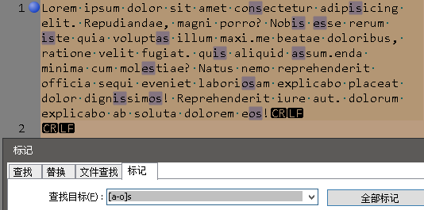

= 正则表达式(Regular Expression)
:toc:

---

== 匹配单个字符

==== 匹配 "任意"一个"单个字符" -> .

|===
|正则符号 |说明

|点号 .
|可以匹配除“\n”和"\r"之外的**任何单个字符。**
|===

[source, typescript]
....
s.m
....

image:./img_re/01 点号1.png[]

在同一个正则表达式里, 允许使用多个. 字符， 它们既可以连续出现( 一个接着一个 一一 **.. 将匹配任意两个字符)**， 也可以间隔着出现在模式的不同位置。

[source, typescript]
....
.e.
....

[source, typescript]
....
.a..
....

---

==== 匹配 特殊字符, 需要转义 -> \特殊字符

[source, typescript]
....
.a..\.
....

对元字符进行转义, 需要用到\字符。这意味着\字符也是一个元字符，因此, 在需要匹配\本身的时候，我们必须把它转义为\\。

在一个完整的正则表达式里，字符\ 的后面永
远跟着另一个字符。

---

== 匹配 一组字符

==== 匹配 多个字符中的某一个 -> []

|===
|正则符号 |说明

|[xyz]
|字符集合。匹配结果是: 能够与该集合里的**任意一个成员**相匹配的文本。
|===

[source, typescript]
....
[bcd]o
....

[source, typescript]
....
[bcd]o[rl]
....

==== 连字符 -> 比如 [a-z]

连字符表示"范围", 能匹配指定范围内的任意字符。 +
模式[0-9] 的功能与[0123456789] 完全等价.

又如: +
[A-Z] ，匹配从A到z 的所有大写字母。 +
[A-z] ，匹配从ASCll字符A 到ASCIl字符z 的所有字母。这个模式一般不常用，因为它还包含着[和^等在ASCII字符表里排列在z和a
之间的字符。

[source, typescript]
....
[a-o]s
....

**注意: 在定义一个字符区间的时候，一定要避免让这个区间的尾字符小于它的首字符(例如[3-1]) 。这种区间是没有意义的，而且往往会让整个模式失效。**

注意: **- (连字符)是一个特殊的元字符，作为元字符它只能用在[和]之间。在字符集合以外的地方，- 只是一个普通字符，只能与 - 本身相匹配。**因此，在正则表达式里, - 字符不需要被转义.

**在同一个字符集合里, 还可以给出多个字符区间。**比如说，下面这个模式可以匹配任何一个字母(无论大小写)或数字，但除此以外的其他字符(既不是数字也不是字母的字符)都不匹配:
[source, typescript]
....
[A-Za-z0-9]
....

---

==== 取非匹配 -> ^

**在某些场合，我们需要反过来做，给出一组不需要得到的字符。换句话说，除了那个字符集合里的字符，其他字符都可以匹配。**

可以**用元字符^ 来表明你想对一个字符集
合进行"取非"匹配。**这与逻辑非运算很相似，只是这里的操作数是字符集合而己。

[source, typescript]
....
[ns]a[^0-9]\.xls
....

image:./img_re/02 中括号4.png[]

这里 [^0-9] 匹配的是任何不是数字的字符。

**注意: ^的效果将作用于给定字符集合里的 所有字符或字符区间，而不是仅限于紧跟在^ 字符后面的 那一个字符或字符区间。**

---

== 元字符

元字符大致可以分为两种:  +
一种是用来匹配文本的, 比如. ，  +
另一种是正则表达式的语法所要求的, 比如[ 和]  。

==== 匹配 空白字符 -> \n \r \t

我们经常会遇到需要对原始文本里的非打印空白字符, 进行匹配的情况。比如说，我们可能需要把所有的"制表符"找出来，或者我们需要把"换行符"找出来，这类字符很难被直接输入到一个正则表达式里， 但我们可以以使用表4-1 列出的特殊元字符来输入它们。

空白元字符:

|===
|元字符 |说明

|\n
|换行符

|\r
|回车符

|\t
|制表符(Tab键)

|===

---

==== 匹配 数字\d , 非数字\D

|===
|元字符 |说明

|\d
|任何一个数字字符, 等价于 [0-9]

|\D
|任何一个非数字字符, 等价于 [^0-9]

|===

---

==== 匹配 字母和数字\w, 与 非字母和数字\W

|===
|元字符 |说明

|\w
|任何一个字母与数字字符(大小写均可)或下划线字符, 等价于 [a-zA-Z0-9_] +
注意! \w也能匹配数字!! 和\d一样.

|\W
|任何一个非字母, 非数字, 或非下划线字符. 等价于 [^A-Za-z0-9_]

|===

[source, typescript]
....
\w
....

[source, typescript]
....
\w\d
....

---

==== 匹配 空白字符\s, 与 非空白字符\S

|===
|元字符 |说明

|\s
|任何一个空白字符, 等价于[\f\n\r\t\v]

|\S
|任何一个非空白字符, 等价于[^\f\n\r\t\v]

|===

---

== 重复匹配

如何匹配多个"连续重复出现"的字符或字符集合。

|===
|可匹配次数 |0次 | 1次 | 多次 | 等价于 | 举例

|? +
零次或一次
|√
|√
|×
|{0,1}
|"do(es)?" 可以匹配 "do" 、 "does"

|+ +
一次或多次
|×
|√
|√
|{1,}
|'zo+' 能匹配 "zo" 以及 "zoo"，但不能匹配 "z"

|* +
零次或多次
|√
|√
|√
|{0,}
|zo* 能匹配 "z" 以及 "zoo"

|===

|===
|写法 |匹配次数 |举例

|{n}
|匹配确定的 n 次。
|'o{2}' 不能匹配 "Bob" 中的 'o'，但是能匹配 "food" 中的两个 o。

|{n,}
|至少匹配n 次。
|'o{2,}' 不能匹配 "Bob" 中的 'o'，但能匹配 "foooood" 中的所有 o。 +
'o{1,}' 等价于 'o+'。 +
'o{0,}' 则等价于 'o*'。

|{n,m}
|其中n \<= m。最少匹配 n 次且最多匹配 m 次。请注意在逗号和两个数之间不能有空格。
|"o{1,3}" 将匹配 "fooooood" 中的前三个 o。 +
'o{0,1}' 等价于 'o?'。 +

|===

---

==== 匹配一个或多个字符 -> 加号+

要想匹配同一个字符(或字符集合) 的多次重复， 只要简单地给这个字符(或字符集合)加上一个 +字符 作为后缀就行了。

**\+匹配一个或多个字符(至少一个; 不匹配零个字符的情况) **。 +
比如，a 匹配a本身， a+ 将匹配一个或多个连续出现的a.  +
类似地， [0-9] 匹配任意单个数字， [0-9]+
将匹配一个或多个连续的数字。

注意: **在给一个字符集合加上+后缀的时候，必须把+放在这个字符集合的外面。**比如说， [0-9]+ 是正确的， [0-9+] 则不是。

[0-9+] 其实也是一个合法的正则表达式， 但它匹配的不是一个或多个数字; 它定义了一个由数字0到9 和+ 构成的字符集合，因而只能匹配一个单个的数字字符或加号。

下面, 我们来匹配到电子邮箱地址
[source, typescript]
....
\w+@\w+\.\w+
....

但是, 上面的正则表达式写法, 还有一个小纰漏:  +
我们只想到了在@字符的后面会有一个 .字符 分开两个字符串的情况，但没有想到在@字符的前面可能也会有.字符存在! 比如: ben.forta@forta.com

为了解决这个问题, 我们需要匹配字符集合[\w.]。

[source, typescript]
....
[\w.]+@[\w.]+\.\w+
....

即:

|===
|[\w.]+ |@ |[\w.]+ |\. |\w+

|匹配任意多个的单个字母或数字或点号, 一直到有@出现为止
|
|将匹配字符集合[\w.] (字母数字
 字符、下划线, 和点号. ) 的一次或多次重复出现, 一直到后面是\.\w为止
|
|

|===

细心的读者可能已经注意到了:我们没有对字符集合[\w.]里的.字符进行转义。尽管如此，它还是把原始文本立的.字符匹配出来了。**一般来说，当在字符集合旦使用的时候, 像.和+这样的元字符, 将被解释为普通字符, 不需要被转义，但转义了也没有坏处。[\w.]的使用效果与[\w\.]是一样的。**

---

==== 匹配零个或多个字符 -> *

如果你想匹配一个可有可无的字符，也就是该字符可以出现零次或多次的情况，就要使用 *星号元字符来完成。

星号*的用法与+完全一样，只要把它放在一个字符(或一个字符集合)的后面， 就可以匹配该字符(或字符集合)连续出现零次或多次的情况。 +
比如说，模式 B.* Forta 将匹配: +
B Forta +
B. Forta +
Ben Forta +
和其他有类似规律的组合。

[source, typescript]
....
\w+[\w.]*@[\w.]+\w+
....

即:

|===
|\w+ |[\w.]* |@ |[\w.]+ |\w+

|负责匹配电子邮件地址里的第一个字符(一个字母数字字符，不包括. 字符)
|负责匹配电子邮件地址里第一个字符之后、@字符之前的所有字符，这个部分可以包含零个或多个字母数字字符 和.字符。
|
|
|

|===

可以把*理解为一个用来表明这样一种含义的元字符:
"在我前面的字符(或字符集合)足可选的".

*与+的区别是: +
+匹配一个或多个字符(或字符集合) ， 最少要匹配一次; +
*匹配零个或任意多个字符(或字符集合) ，可以没有匹配。

星号*是一个元字符。如果需要匹配*本身，就必须使用它的转义序列\* 。

---

==== 匹配零个或一个字符 -> ?

? 只能匹配一个字符(或字符集合)的零次或一次出现，最多不超过一次.

如果需要在一段文本里匹配某个特定的字符(或字符集合)而该字符可能出现、也可能不出现，用? 无疑是最佳的选择。

[source, typescript]
....
https?://[\w./]+
....

又如, 对于空白行,  在windows下, 可以用 \r\n\r\n 来匹配, 但linux中, 只需用\n\n 即可. 那么如果我们想同时适配win和linux呢? 可以用:
[source, typescript]
....
[\r]?\n[\r]?\n
....

[\r]?\n 匹配一个可选的\r 和一个必不可少的\n。

注意: 上面, 我们使用的是[\r]? 而不是\r? 。[\r]定义了一个字符集合，该集合只有元字符\r这一个成员，因而[\r]? 在功能上与\r? 完全等价。

**[]的常规用法是把多个字符定义为一个集合，但有不少程序员喜欢把一个字符也定义为一个集合。这么做的好处是可以增加可读性**和避免产生误解，让人们一眼就可以看出哪个字符与哪个元字符相关联。

这里必须提醒大家注意这样一个细节: **如采你打算同时使用 [ ] 和 ? 时，千万记得应该把 ? 放在字符集合的外面。**具体到刚才那个匹配URL地址的例子，写成 http[s]?:// 是正确的，若是写成http[s?]:// 可就弄巧成拙了。

?是一个元字符。如果需要匹配?本身，就必须使用它的转义序列 \? 。

---

== 匹配的重复次数(interval) -> {n}

重复次数要用{和}字符来给出，把数值写在它们之间。

{ 和 }是元字符。如果需要匹配 { 和 } 本身，就应该用\对它们进行转义。使用它们的转义序列 \{ 和 \} 比较稳妥。

==== 为重复匹配次数, 设定一个精确的值

下面来匹配一个十六进制数值:
[source, typescript]
....
#[0-9A-Fa-f]{6}
....

---

==== 为重复匹配次数, 设定一个区间 -> {min,max}

可以设定一个重复匹配的最小值和最大值。比如, {2,4} 的含义是最少重复2次、最多重复4次。

重复次数可以是0 。比如，{0,3}表示重复次数可以是 0 、1 、2 或3 。
我们曾经讲过，? 匹配它之前一个字符(或字符集合)的零次或一次出现。因此，从效果上看，? 等价于 {0,1} 。

[source, typescript]
....
(\d{1,2}[-\/]){1,2}\d{2,4}
....

上面, 我们使用了/ 的转义序列 \/ 。

---

==== 匹配"至少重复多少次" -> {n,}

{ }语法的最后一种用法是: **给出一个最小的重复次数(但不必给出一个最大值)** . +
{} 的这种用法, 与我们用来为重复匹配次数设定一个区间的 {min,max} 语法很相似，只是省略了最大值部分而己。比如说，{3,} 表示至少重复3次，与之等价的说法是"必须重复3 次或更多次"。

下面, 我们把所有大于或等于$100美元的金额找出来:
[source, typescript]
....
\d+: \$\d{3,}\.\d*
....

---

==== 防止过度匹配 -> ?

*和+都是所谓的"贪婪型"元字符，它们在进行匹配时的行为模式, 是多多益善, 而不是适可而止的。它们会尽可能地从一段文本的开头, 一直匹配到这段文本的末尾，而不是从这段文本的开头, 匹配到碰到第一个匹配时为止。

**在不需要这种"贪婪行为"的时候该怎么办?答案是使用这些元字符的"懒惰型"版本("懒惰"在这里的含义是匹配尽可能少的字符**，与"贪婪型"元字符的行为模式刚好相反)。

**懒惰型元字符的写法很简单，只要给贪婪型元字符加上一个?后缀即可。**

表5-1 列出了几个常用的贪婪型元字符, 和它们的懒惰型版本:

|===
|贪婪型元字符 |懒惰型元字符

|*
|*?

|+
|+?

|{n,}
|{n,}?
|===

例如, 只匹配html的<B>元素
[source, typescript]
....
<[Bb]>.*?</[Bb]>
....

---

---

== 位置匹配

==== 单词边界 -> \b

第一种边界(也是最常用的边界), 是由限定符 \b 来指定的单词边界。 +
顾名思义，\b用来匹配一个单同的开始或结尾。 +
**b是英文boundary(边界)的首字母.**

如, 只匹配cat单词(是完整的单词! 而不是cat三个字母可以在出现另一个单词的中间)
[source, typescript]
....
\bcat\b
....

在文本段落里，单词cat的前后部有一个空格， 而这将与模式 \bcat\b 相匹配(空格是用来分隔单词的字符之一)。 +
单词scattered 中的字符序列cat不能与这个模式相匹配， 因为它的前一个字符是s、后一个字符是t(这两个字符都不能与\b相匹配)。

\b到底匹配什么东西呢? 简单地说，\b 匹配的是一个这样的位置: 这个位置位于一个能够用来构成单词的字符(字母、数字和下划线，也就是与 \w 相匹配的字样), 和一个不能用来构成单坷的字符(也就是与 \W 相匹配的字符)之间。

这里要特别注意的是，**如果你想匹配一个完整的单词，就必须在你想要匹配的文本的前后, 都加上 \b 限定符。**

如果你后边不加 \b 的话, 就会造成:

试比较:

注意: \b 匹配且只匹配一个位置, 不匹配任何字符. 用 \bcat\b 匹配到的字符串的长度是3个字符(c,a,t), 而不是5个字符。

**如果你想表明不匹配一个单词边界, 请使用\B** +
正如我们在第4章里见到的那样，同一个元字符的大写形式, 与它的小写形式, 在功能上往往刚好相反。

下例，我们将使用 \B 来查找其前后都有多余空格的连字符:

\B-\B 将匹配一个前后都不是单词边界的连字符。 nine-digit 和 pass -key 中的连字符不能与之匹配， 但color - coded 中的连字符可以与之匹配。

试比较: +

---

==== 字符串边界 -> ^str$

用来定义字符串边界的元字符有两个: +

|===
|元字符 |功能

|^
|用来定义字符串开头

|$
|用来定义字符串结尾
|===

^是几个有着多种用途的元字符之一:
|===
|^的出现位置 |功能

|当^出现在一个字符集合里(被放在[和]之间), 并紧跟在左方括号[的后面时
|求非

|当^在一个字符集合的外面, 并位于一个模式的开头
|用来定义字符串结尾
|匹配字符串的开头
|===

例如 +
[source, typescript]
....
^\s*<\?xml.*\?>
....

^匹配一个字符串的开头位置，所以 ^\s* 将匹配一个字符串的开头位置和随后的零个或多个空白字符 (这解决了<?xml> 标签前允许有空格、制表符、换行符等空白字符的问题〉。

不过, 上面的写法是一个"贪婪型"匹配, 因此, 最好的办法是把 .* 替换为 .*? 。

$ 匹配输入字符串的结尾位置。 +
除了位置上的差异， $的用法与^完全一样。

比如说，在一份Web页面里，</html>标签的后面不应该再有任何实际内容，而这一点可以用下面这个模式来检查:

[source, typescript]
....
</[Hh][Tt][Mm][Ll]>\s*$
....

我们用了4个字符集合, 来分别匹配H、T、M、L等4个字符(这样就可以对这几个字符的各种大小写组合形式, 进行处理了)， **\s*$ 匹配一个字符串结尾处的零个或多个空白字符。**

注意:  模式 ^.*$ (头尖尾美)是一个在语法上完全正确的正则在达式; 它几乎总能找到一个匹配，但没有任何实际用途.

---

==== 分行匹配模式

我们刚刚讲过， ^匹配一个字符串的开头， $匹配一个字符串的结尾。但这一结论并非绝对正确， 它还有一个例外, 或者说有一种改变这种行为的办法。

有许多正则表达式, 都支持"使用一些特殊的元字符, 去改变另外一些元字符行为"的做法，用来启用"分行匹配模式" (multiline mode) 的(?m) 记号就是一个"能够改变其他元字符行为"的元字符序列。

注意: 有许多正则表达式的实现, 不支持(?m)。

**"分行匹配模式"将使得正则表达式引擎, 把"行分隔符"当作一个"字符串分隔符"来对待。**

**在"分行匹配模式"下，^不仅匹配正常的字符串开头， 还将匹配"行分隔符(换行符)"后面的开始位置(这个位置是不可见的)** ; 类似地，$不仅匹配正常的字符
串结尾， 还将匹配行分隔符(换行符)后面的结束位置。

**在使用时，(?m) 必须出现在整个模式的最前面，** 就像下面这个例子里那样。在这个例子里，我们将使用一个正则表达式, 把一段JavaScript代码里的注释内容全部查找出来:

[source, typescript]
....
(?m)^\s*//.*$
....

|===
|(?m) |^ |\s* |// |.* |$

|
|匹配一个字符串的开始
|是任意多个空白字符
|// (JavaScript代码里的注释标签)
|任意文本
|字符串的结束

|===

如果不加(?m) , 则只能找出第一条注释(并认为这条注释将一直延续到文件的末尾，因为*是一个"贪婪型"元字符) 。加上(?m)前缀之后，(?m)^\s*//.*$ 将把换行符视为一个字符串分隔符，这样就可以把每一行注释都匹配出来了。 +
不过我在nodepad++里实验, 开头不加(?m) 也能匹配到每一个js注释.

---

== 使用子表达式(subexpression) 对表达式进行"分组"和"归类" -> ()

比如你想找出html中的重复空格代码, 如下:
[source, typescript]
....
&nbsp;{2,}
....

这是无效的! **因为 {2,} 只作用于紧挨着它的前一个字符，本例中那是一个分号。**如此一来，这个模式只能匹配像&nbsp;;;;; 这样的文本，但无法匹配&nbsp;&nbsp; 。

这就引出了"子表达式"的概念。子表达式是一个更大的表达式的一部分; **把一个表达式划分为一系列子表达式的目的, 是为了把那些子表达式当作一个独立元素来使用。** 子表达式必须用(和)括起来。

[source, typescript]
....
(&nbsp;){2,}

/*
(&nbsp;) 是一个子表达式，它将被视为一个独立元素，
而紧跟在它后面的 {2,}将作用于这个子表达式(而不仅仅是分号)。这个模式解决了我们的问题。
*/
....

又例: 用一个正则表达式来查找IP地址. +
IP地址的格式是以英文句号分隔的四组数字，例如 12.l59.46.200 。因为**每组数字由1 个、2个或3 个数字字符构成**，所以这4组数字可以统一使用模式\d{l, 3}来匹配。

[source, typescript]
....
(\d{1,3}\.){3}\d{1,3}
....

|===
|(\d{1,3}\.){3} |\d{1,3}

|先用( 和 ) 把表达式 \d{l,3}\. 括起来使它成为一个子表达式， +
 再用(\d{l,3}\.){3} 把这个子表达式重复了3 次(它们对应着IP地址里的前3组数字)
|匹配IP地址里的最后一组数字

|===

上面匹配ip地址的语法, 当然是对的, 不过, 它还有一个小纰漏: IP地址里的每一组数字都不能大于255 ，可是上面那个模式还能匹配诸如345, 700, 999之类的数字序列.

所有, **有句话你一定要牢记: 把必须匹配的情况考虑周全, 并写出一个匹配结果符合预期的正则表达式, 很容易; 但是把不需要匹配的情况也考虑周全, 并确保它们都将被排除在匹配结果以外, 则往往要困难得多。**

**为了提高可读性，有不少用户喜欢给表达式的每一个子
在达式, 都加上括号。**比如, 把上面那个例子里的模式写成 (\d{1,3}\.){3}(\d{1, 3}) 。**这种做法在语法上完全成立，对表达式的实际行为也没有任何不良影响**(但视乎具体的正则表达式实现，这对匹配操作的速度可能会有点儿影响) 。

又例: 下面, 把一条用户记录里的年份数字完整地匹配出来.

[source, typescript]
....
19|20\d{2} //错误的写法
....

上面的模式只匹配到了19，随后两位数字没有被匹配到。为什么会这样? 因为** | 操作符是把位于它左边和右边的两个部分, 都作为一个整体来看待的**，它会把模式 19|20\d{2} 解释为: 19 或 20\d{2} ( 也就是把 \d{2} 解释为以20开头的那个表达式的一部分)。换句话说，它将匹配数字序列19, 或以20开头的任意4位数字。

正确的写法是:
[source, typescript]
....
(19|20)\d{2}
....

---

==== 子表达式的嵌套

子表达式允许多重嵌套.

**在分析嵌套的各个子表达式的时候，应该按原"先内后外"的原则来进行,** 而不是从第一个字符开始一个字符一个字符地去尝试。

---

== 回溯引用(backreference): 前后一致匹配

假设, 我们要匹配html代码的<H1>到<H6> ，

[source, typescript]
....
<[hH][1-6]>.*?</[hH][1-6]>
....

上面的写法看起来不错，但有个纰漏:

出现这种情况的根源是: 这个模式的第2部分(用来匹配结束标签的那个部分) 对这个模式的第l部分(用来匹配开始标签的那个部分)毫无所知。要解决这个问题，就要使用"回溯引用"功能:

[source, typescript]
....
<[hH]([1-6])>.*?</[hH]\1>
....

---

==== 回溯引用匹配 -> \1

假设你想找出一段文本中的连续重复出现的单词, **"回溯引用"允许正则表达式模式, 引用到前面的匹配结果**.

[source, typescript]
....
[ ]+(\w+)[ ]+\1
....

|===
|[ ]+ |(\w+) |[ ]+ |\1

|匹配一个或多个空格
|匹配一个或多个字母或数字字符.  +
注意，\w+是括在括号里的，它是一个子表达式。 +
这个子表达式不是用来进行重复匹配的，这里根本不涉及重复匹配的问题。 +
这个子表达式, 只是把整个模式的一部分单独划分出来, 以便在后面引用。
|
|这是一个"回溯引用"，而它引用的正是前面划分出来
 的那个子表达式. +
 当(\w+) 匹配到单词 of 的时候，\1 也匹配单词of;  +
 当(\w+) 匹配到单词 and 的时候，\1也匹配单词and 。

|===

**\1 代表着模式里的第1个子表达式，\2代表着第2个子表达式, \3代表着第3个; 依次类推。**

**"回溯引用"匹配, 通常从1 开始计数(\1、\2等)。在许多实现里，第0个匹配(\0) 可以用来代表整个正则表达式。**

"回溯引用", 指的就是: 模式的后半部分 引用在前半部分中定义的子表达式.  +
**你也可以把"回溯引用", 理解成是变量。**

**"回溯引用"只能引用小括号()中的片段**, 即"子表达式" ----用(和)括起来的正则表达式的片段。

虽然"回溯引用"受到普遍的支持，但这种方法也存在着一个严重的不足: 如果"子表达式"的相对位置发生了变化，整个匹配模式, 也许就不能完成原来的工作，删除或添加子表达式的后果, 可能更为严重。 +
为了弥补这一不足，一些比较新的正则表达式实现, 还支持**"命名捕捉" (named capture): 给某个子表达式起一个唯一的名字(犹如变量名)，然后用这个名字(而不是相对位置)来引用这个子表达式.**

---

==== "回溯引用"在替换操作中的应用

比如, 匹配到邮箱地址后, 把它变成可点击的链接:
[source, typescript]
....
(\w[\w\.]*@[\w\.]+\w+)  //查找
<a href="\1">\1</a>     //替换成
....

替换前 +

替换后 +

注意: "回溯引用"语法, 在不同的正则表达式实现
里, 有很大的差异: JavaScript要用 $ 来代替 \ .

又例:
把电话格式,从类似 313-555-1234, 改成 (313) 555-1234

[source, typescript]
....
(\d{3})-((\d{3})-(\d{4}))  //查找
\(\1\) \2                  //替换
....

替换前 +

替换后 +

或者也可以写成:
[source, typescript]
....
(\d{3})-(\d{3})-(\d{4}) //查找 <--被划分成3个子表达式
\(\1\) \2-\3            //替换
....

**因此, 在对文本进行重新排版的时候， 把文本分解成多个"子表达式"的做法, 往往非常有用.**

---

== 前后查找 lookaround

前后查找(lookaround)，即对某一位置的前、后内容进行查找. +
换言之, 它是这样一个模式: 它包含的匹配本身并不返回，而是用于确定正确的匹配位置，它并不是匹配结果的一部分。换句话说，你在进行的是"向前查找"(lookahead) 和"向后查找"(lookbehind)。

Java、.NET 、PHP和Perl 都支持"向后查找"(但有一些限制), JavaScript 和ColdFusion不支持"向后查找"。

---

==== 向前查找 lookahead -> yyy(?=xxx) => 只返回yyy

向前查找指定了一个必须匹配, 但不在结果中退回的模式。 +
向前查找实际就是一个子表达式，而且从格式上看也确实如此。 +
从语法上看，**一个向前查找模式, 其实就是一个以?= 开头的子表达式，需要匹配的文
本跟在 =的后面。**

例如, 找出url的协议名部分
[source, typescript]
....
.+(?=:)
....

|===
|.+ |(?=:)

|匹配任意文本
|子表达式(?=:) 匹配: 。 +
**注意，被匹配到的冒号: 并没有出现在最终的匹配结果里; 我们用 ?= 向正则表达式引擎表明: 只要找到冒号: 就行了，不要把它包括在最终的匹配结果里，用术语来说，就是"不消费"它。**
|===

有些正则表达式的文档, 使用术语"消费" (consume) 来
表达"匹配和返回文本"的含义。在向前查找里，被匹配的文本不包含在最终返回的匹配结果里，这被称为"不消费" 。

而如果你写成正常的:
[source, typescript]
....
.+(:)
....

就会发现, 子表达式(:) 正确地匹配到了冒号: , 并消费了这个字符一一 冒号:出现在了最终的匹配结果里。

**注意: 向前查找(和向后查找)匹配本身, 其实是有返回结果的，只是这个结果的字节长度永远是0而已。因此、前后查找操作, 有时也被称为零宽度(zero-width) 匹配操作。**

**事实上, 任何一个"子表达式", 都可以转换为一个"向前查找表达式", 只要给它加上一个 ?= 前缀即可。**

在同一个搜索模式里, 可以使用多个"向前查找表达式"，它们可以出现在模式里的任意位置(而不仅仅是出现在整个模式的开头) 。

---

==== 向后查找 lookbehind -> (?\<=xxx)yyy => 只返回yyy

许多正则表达式实现, 还支持**"向后查找"，也就是查找"出现在被匹配文本之后的字符"(但不消费它)，"向后查找"操作符是 ?\<= 。**

?\<= 与 ?= 的具体使用方法大同小异: **它必须用在一个子表达式里，而且后跟要匹配的文本。**

[source, typescript]
....
(?<=\$)[0-9.]+  //匹配到的结果, 不包含美元$符号
....

**可以这样记忆: 把 \<= 看做是一个向左飞行的火箭, 火箭的屁股后方, 即右侧, 即是我们想要保留的数据对象. 火箭括号里的内容本身, 不需要保留.**

如果你写成: +
[source, typescript]
....
\$[0-9.]+   //匹配到的结果, 就包含美元$符号了!
....

注意: "向前查找"模式的长度是可变的，它们可以包含.和+之类的元字符，所以非常灵活。 +
而"向后查找"模式只能是固定长度，这是一条几乎所有的正则表达式实现都遵守的限制。

---

==== 把"向前查找"和"向后查找"结合起来 -> (?\<=xxx)yyy(?=xxx) => 只返回yyy

[source, typescript]
....
(?<=\<[tT][iI][Tt][Ll][Ee]>)(.*)(?=</[tT][iI][Tt][Ll][Ee]>)
....

image:./img_re/06 前后查找5.png[]

|===
|(?<=<[tT][iI][Tt][Ll][Ee]>) |(.*) |(?=</[tT][iI][Tt][Ll][Ee]>)

|(?<=xxx) 向后查找操作, 它匹配(但不消费) <TITLE>
|
|(?=xxx) 向前查找操作，它匹配(但不消费) </TITLE>

|===

---

==== 对前后查找"取非" -> yyy(?!xxx) 与 (?\<!xxx)yyy

前后查找还有一种不太常见的用法, 叫作"负前后查找"( negative lookaround ) 。 +
负向前查找( negative lookahead) 将: 向前查找不与给定模式相匹配的文本; +
负向后查找(negative lookbehind ) 将: 向后查找不与给定模式相匹配的文本。

^是用来对"字符集合"进行"取非"处理的操作符. 但 ^ 不能用来对"前后查找"进行"取非"处理。所以, 这里必须使用另外一种语法: 前后查找必须用 ! 来取非(它将替换掉= )。

|===
|操作符 |说明

|(?=)
|正向前查找

|(?!)
|负向前查找

|(?\<=)
|正向后查找

|(?<!)
|负向后查找
|===

一般来说，凡是支持"向前查找"的正则表达式, 也都同时支持"正向前查找"和"负向前查找"。 +
类似地，凡是支持"向后查找"的正则表达式, 也都同时支持"正向后查找"和"负向后查找"。

例如, 我们来只查找价格, 不带上美元符号
[source, typescript]
....
(?<=\$)\d+  //向后查找(但不消费)字符$
....

接下来，我们再去查找, 且只查找数量:

[source, typescript]
....
\b(?<!\$)\d+
....

|===
|\b |(?<!\$) |\d+

|
|是一个"负向后查找"，它使得最终的匹配结果, 只包含那些不以$开头的数值。把操作符 ?\<= 改为操作符 ?<!  就使得整个模式, 从一个"正向后查找",变成了一个"负向后查找"。
|

|===

---

== 嵌入条件

90

---

== 书目

正则表达式必知必会

---
