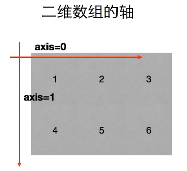

:toc:
:toclevels: 3
:sectnums:

---

== 安装 numpy

.安装 numpy
[%collapsible]
====
pip3 install --user numpy scipy matplotlib

或用清华源: +
pip3 install numpy scipy matplotlib -i https://pypi.tuna.tsinghua.edu.cn/simple

pip3 install numpy scipy matplotlib -i https://repo.huaweicloud.com/repository/pypi/simple

- 清华大学：https://pypi.tuna.tsinghua.edu.cn/simple
- 华为云：https://repo.huaweicloud.com/repository/pypi/simple
- 阿里云：http://mirrors.aliyun.com/pypi

在使用pip的时候加参数-i
====

.测试是否安装成功
[%collapsible]
====
[source, python]
....
from numpy import *

print(eye(4)) # 会输出一个4阶单位阵
....
====

官方文档::
https://numpy.org/devdocs/

---

== 轴 axis

image:img/02.png[]

---

== 增

=== 创建 ndarray 数组 -> np.arange(num1, num2, num3, ...)

.创建 ndarray 数组
[%collapsible]
====

[source, python]
....
import numpy as np

# 方法1:
a1 = np.array([1,2,3]) # 创建ndarray数组
print(a1) # [1 2 3]
print(type(a1)) # <class 'numpy.ndarray'> ndarray 就是 numpy中 的数组类型

# 方法2:
a2 = np.array(range(10))
print(a2) # [0 1 2 3 4 5 6 7 8 9]

# 方法3:
a3 = np.arange(10)
print(a3) # [0 1 2 3 4 5 6 7 8 9]

a4 = np.arange(4,10,2) # 从4开始, 到不包括10, 步长为2
print(a4) # [4 6 8]
....
====

---

==

---

== 删

---

== 改

=== 转置 obj.transpose()

.对数组进行转置 -> obj.transpose()
[%collapsible]
====
[source, python]
....
import numpy as np

a = np.arange(12).reshape((3,4))
print(a)

'''
[[ 0  1  2  3]
 [ 4  5  6  7]
 [ 8  9 10 11]]
'''

b = a.transpose() # 做转置, 即行变列, 列变行
print(b)

'''
[[ 0  4  8]
 [ 1  5  9]
 [ 2  6 10]
 [ 3  7 11]]
'''
....
====

.对数组进行转置, 方法2: 对轴做交换 -> obj.swapaxes(1,0)
[%collapsible]
====
[source, python]
....
import numpy as np

a = np.arange(12).reshape((3,4))
print(a)

'''
[[ 0  1  2  3]
 [ 4  5  6  7]
 [ 8  9 10 11]]
'''

b = a.swapaxes(1,0) # 将轴交换 (默认是 0,1 的顺序), 相当于做转置, 即行变列, 列变行
print(b)

'''
[[ 0  4  8]
 [ 1  5  9]
 [ 2  6 10]
 [ 3  7 11]]
'''
....
====

---

=== 修改数据的行列数 -> obj.reshape( (新行数,新列数) )

该方法, 输入一个tuple作为参数.

.将数组, 改成两层嵌套的 3行4列
[%collapsible]
====
[source, python]
....
a1 = np.arange(12)
print(a1.shape) # (12,)

a1 = a1.reshape((3,4)) # 进行修改, 改成3行4列
print(a1)

'''
[[ 0  1  2  3]
 [ 4  5  6  7]
 [ 8  9 10 11]]
 '''

print(a1.shape) # (3, 4)
....

====

.将数组, 改成三层嵌套
[%collapsible]
====
[source, python]
....
a1 = np.arange(24)
print(a1.shape) # (24,)

a1 = a1.reshape((2,3,4)) # 改成三层嵌套, 相当于是3维空间的.
'''
改成3层列表嵌套:
第一层是两个list,
第二层的每个list中, 又包含3个list.
第三层的每个list中, 又包含4个数值.
于是就共有 2*3*4 = 24个数值.
'''

print(a1)

'''
[[[ 0  1  2  3]
  [ 4  5  6  7]
  [ 8  9 10 11]]

 [[12 13 14 15]
  [16 17 18 19]
  [20 21 22 23]]]
 '''
....
====

.将三维数组, 重新改为二维数组
[%collapsible]
====
[source, python]
....
print(a1.shape) # (2, 3, 4) <- a1目前是三维数组, 有三层嵌套.

a1_2Dimension = a1.reshape((2,12)) # 重新改成2行12列,即二维空间中的值

print(a1_2Dimension)

'''
[[ 0  1  2  3  4  5  6  7  8  9 10 11]
 [12 13 14 15 16 17 18 19 20 21 22 23]]
'''

print(a1_2Dimension.shape) # (2, 12)
....
====

.将多维数组, 改成一维数组 (即只有一行, 只有一个list)
[%collapsible]
====
[source, python]
....
import numpy as np

a1 = np.arange(24)
a1 = a1.reshape((4,6)) # 先改成4行6列
print(a1.shape) # (4, 6)

a1 = a1.reshape((24,)) # 改回一维数组. 即将列表中的全部24个元素, 放在一个list中.
print(a1) # [ 0  1  2  3  4  5  6  7  8  9 10 11 12 13 14 15 16 17 18 19 20 21 22 23]
....
====

.将多维数组, 改成一维数组 -> 直接用 obj.flatten()方法
[%collapsible]
====
[source, python]
....
import numpy as np

a1 = np.arange(24)
a1 = a1.reshape((4,6)) # 先改成4行6列

a1_一行 = a1.flatten() # 将多维数组, 展开成一维的
print(a1_一行) # [ 0  1  2  3  4  5  6  7  8  9 10 11 12 13 14 15 16 17 18 19 20 21 22 23]
....
====

---

===

---

=== 给数组中的每个元素, 同时加上一个数字

.给数组中的每个元素, 同时加上(加减乘除)一个数字
[%collapsible]
====
[source, python]
....
import numpy as np

a1 = np.arange(10)
print(a1) # [0 1 2 3 4 5 6 7 8 9]

a2 = a1 + 5 # 将a1数组中的每个元素, 都加上5
print(a2) # [ 5  6  7  8  9 10 11 12 13 14]

a2 = a1 * 3 # 将a1数组中的每个元素, 都乘上3
print(a2) # [ 0  3  6  9 12 15 18 21 24 27]
....
====

---

---

=== 让两个数组, 对应元素相加

.让两个数组, 对应元素相加
[%collapsible]
====
[source, python]
....
import numpy as np

a1 = np.arange(6).reshape(2,3)
a2 = np.arange(100,106).reshape(2,3)

print(a1)
'''
[[0 1 2]
 [3 4 5]]
'''

print(a2)
'''
[[100 101 102]
 [103 104 105]]
'''

a3 = a1 + a2 # a1 和a2 数组中的 对应元素相加
print(a3 )
'''
[[100 102 104]
 [106 108 110]]
'''
....
====

---

=== 不同行列数的两个数组, 做加减乘除

.两个数组, 列数相同: stem:[ a_{3 \times 4} - b_{1 \times 4}]
[%collapsible]
====
[source, python]
....
import numpy as np

a = np.arange(12).reshape((3,4))
print(a)

'''
[[ 0  1  2  3]
 [ 4  5  6  7]
 [ 8  9 10 11]]
 '''

b = np.arange(4)
print(b) # [0 1 2 3]

print(a-b) # a是3行4列的, b是1行4列的, 那么这两个数组相减, 怎么减呢? 既然它们列数相同, 那就用每行上的相应列数元素, 来减. 即: 用a的每一行上的列元素, 去减b的行上的对应列元素.

'''
[[0 0 0 0]  <- a的第1行中: a_11 - b_11, a_12 - b_12, a_13 - b_13, a_14 - b_14,
 [4 4 4 4]  <- a的第2行中: a_21 - b_11, a_22 - b_22, a_23 - b_13, a_24 - b_14,
 [8 8 8 8]] <- a的第3行中: a_31 - b_11, a_32 - b_12, a_33 - b_13, a_34 - b_14,
 '''
....
====

.两个数组, 行数相同:  stem:[ a_{3 \times 4} - b_{3 \times 1}]
[%collapsible]
====
[source, python]
....
import numpy as np

a = np.arange(12).reshape((3,4))
print(a)

'''
[[ 0  1  2  3]
 [ 4  5  6  7]
 [ 8  9 10 11]]
 '''

b = np.arange(3).reshape((3,1)) # b是3行1列
print(b)

'''
[[0]
 [1]
 [2]]
 '''

print(a-b) # a是3行4列, b是3行1列, 这两个数组相减, 既然它们行数相同, 那就用a的每一列上的"每个行元素", 去减b的列上的"对应行元素".

'''
[[0 1 2 3]  <- = a_11-b_11, a_12-b_11, a_13-b_11, ...
 [3 4 5 6]  <- = a_21-b_21, a_22-b_21, a_23-b_21, ...
 [6 7 8 9]] <- = a_31-b_31, a_32-b_31, a_33-b_31, ...
 '''
....
====

---

=== 将数组中, 符合某条件的数值, 进行批量修改

.将数组中, 符合某条件的数值, 进行批量修改
[%collapsible]
====
[source, python]
....
import numpy as np

a1 = np.arange(12)
a1 = a1.reshape((3, 4))

a1[a1<8] = 0 # 将数组中小于8的 数值, 都赋值为0
print(a1)

'''
[[ 0  0  0  0]
 [ 0  0  0  0]
 [ 8  9 10 11]]
'''
....
====

---

== 查

=== 查看数据类型 -> obj.dtype

.查看数据类型 -> obj.dtype
[%collapsible]
====
[source, python]
....
a4 = np.arange(4,10,2) # 从4开始, 到不包括10, 步长为2
print(a4) # [4 6 8]

print(a4.dtype) # int32
....
====

---

=== 查看数据的行列数 -> obj.shape

.查看数据的行列数 -> obj.shape
[%collapsible]
====
[source, python]
....
a1 = np.array([[1,2,3],[4,5,6]])
print(a1.shape) # (2, 3) 两行三列
....
====

.查看数组数据的"行数"和"列数" -> obj.shape的返回值, 是个tuple, 第一个元素就是行数, 第二个元素就是列数.
[%collapsible]
====
[source, python]
....
import numpy as np

a1 = np.arange(24)
a1 = a1.reshape((4,6)) # 先改成4行6列

print(a1.shape) # (4, 6) <- 这是个元祖, 第一个数字是行数, 第二个数字是列数. 那么我们就能用索引, 来应用到它们了.

print(a1.shape[0]) # 4 <- 元祖中的第一个item, 是行数
print(a1.shape[1]) # 6 <- 元祖中的第2个item, 是列数

# 所以, 当我们不知道一个数组中到底有多少元素时, 也不知道它们被划分成了几行几列, 但我们想把它们变成一行, 就可以先查出它们的行数和列数, 就能知道: 元素总数 = 行数 * 列数.
a1_元素总数 = a1.shape[0] * a1.shape[1] # 行数 * 列数 = 一个数组中的元素总数
a1_oneLine = a1.reshape((a1_元素总数,))
print(a1_oneLine) # [ 0  1  2  3  4  5  6  7  8  9 10 11 12 13 14 15 16 17 18 19 20 21 22 23]
....
====

---

=== 查看数组中元素, 与某数相比的大小情况

.查看数组中元素, 与某数相比的大小情况
[%collapsible]
====
[source, python]
....
import numpy as np

a1 = np.arange(12)
a1 = a1.reshape((3,4))

print(a1 < 10) # 可以直接用数学比较符号, 来查看数组中各个元素与某数相比的大小情况

'''
[[ True  True  True  True]
 [ True  True  True  True]
 [ True  True False False]]
 '''

#查看数组中小于10的数值, 具体是哪些
print(a1[a1<10]) # [0 1 2 3 4 5 6 7 8 9]
....
====

---

=== 对数组进行切片

.取出某些行, 或某些列
[%collapsible]
====
[source, python]
....
import numpy as np

a = np.arange(20).reshape((4, 5))  # type: np.ndarray
print(a)

'''
[[ 0  1  2  3  4]
 [ 5  6  7  8  9]
 [10 11 12 13 14]
 [15 16 17 18 19]]
'''

# 取出某一行
print(a[2])  # 取出 index=2的, 即第3行.  [10 11 12 13 14]

# 取出连续的多行:
print(a[1:])  # 取出 "index = 1到最后" 的这几行.

'''
[[ 5  6  7  8  9]
 [10 11 12 13 14]
 [15 16 17 18 19]]
 '''

# 取出不连续的多行:
print(a[[0, 2]])  # 注意: 这里不是冒号(不是取"连续的行"). 而是逗号, 即单独取不连续的行或列. 本例, 是取"index =0 和 2 的这两行. 注意: 要把多行的各自索引值, 写在一个list中

'''
[[ 0  1  2  3  4]
 [10 11 12 13 14]]
 '''

# 取出某一列:
print(a[:, 1])  # [ 1  6 11 16] <- 逗号前面是写行的索引值, 逗号后面是写列的索引值. 这里取出 index =1 的列. 注意: 逗号前的冒号不能少.

# 取出连续的多列:
print(a[:, 2:])  # 取出"index = 2到最后" 的列

'''
[[ 2  3  4]
 [ 7  8  9]
 [12 13 14]
 [17 18 19]]
'''

# 取不连续的多列
print(a[:, [0, 2, 4]])  # 取出 index=0,2,4 的这三列.

'''
[[ 0  2  4]
 [ 5  7  9]
 [10 12 14]
 [15 17 19]]
'''

# 取某一行某一列上的那个数值
print(a[1,2]) # 7 <- 取 index=1的行, 及 inde=2的列 上的值. 同样, 逗号前写"行数"的索引值, 逗号后写"列数"的索引值

# 同时取多行多列的数组子集
# 比如, 取第2-3行, 第3-4列的 那块数组子集.
print(a[1:3,2:4]) # 注意, 切片索引是"包头不包尾"的.

'''
[[ 7  8]
 [12 13]
'''

#取多个"不相邻的行列交叉点"上的数值. 只要把这几个数值的index(行与列的), 输进去即可.
# 比如,我们来取三个值: 其索引值分别是: index=行1列2, index=行2列0, index=行3列4
print(a[[1,2,3],[2,0,4]]) #  <- 即三个数的行index, 放在逗号前面; 三个数的列index, 放在逗号后面. [ 7 10 19]
....

image:img/03.png[]
====

---

== numpy 读取本地文件(csv文件)中的数据 -> np.loadtxt()

[source, python]
....
numpy.loadtxt(fname, <- 文件路径
dtype=<class 'float'>, <- 数据读取出来后, 指定的存储类型
comments='#', <- 跳过文件中指定参数开头的行（即不读取）. 比如, 注释语句使用 '#' 作为开头标识的, 就可以把这些行跳过.
delimiter=None, <- 本地文件中的用来分割数据的字符串
converters=None,
skiprows=0, <- 本地文件中, 跳过的行数
usecols=None, <- 读取的列数 (因为可能我们不需要读取本地文件中的全部列数)
unpack=False, <- # 设为true时, 进行转置. 即行变列 , 列变行
ndmin=0,
encoding='bytes', <- 对读取的文件进行预编码
max_rows=None,
*,
quotechar=None,
like=None)
....

.例如, 读取一个csv文件
[%collapsible]
====
[source, python]
....
import numpy as np

path_csv = r"C:\phpStorm_proj\py\csv.csv"

a1 = np.loadtxt(path_csv, delimiter=",", dtype="int")

print(a1)
'''
[[ 1  2  3  4  5]
 [ 6  7  8  9 10]
 [11 12 13 14 15]]
 '''

a1 = np.loadtxt(path_csv, delimiter=",", dtype="int", unpack=True) # unpack=True 对矩阵进行转置. 原行变列, 原列变行. 即读取csv文件进来的时候, 就进行转置的预操作.

print(a1)

'''
[[ 1  6 11]
 [ 2  7 12]
 [ 3  8 13]
 [ 4  9 14]
 [ 5 10 15]]
 '''
....
====

