- 我latex踩过的坑
  collapsed:: true
	- 希腊字母, 不能直接显示. 必须用latex的转义
	- 像下面这种有大括号"说明"的,  1. 尽量少用在上下标这样的指数的说明上, 会有莫名其妙的报错.  2. 不要写成两行, 否则字体大小会变成大号的, 不会自动缩小.
		- 对于复杂的公式, 直接拷代码容易出错的, 就用 axmath 导出emf, 
		  然后在 https://cloudconvert.com/emf-to-svg 或  https://convertio.co/zh/svg-pdf/ 或 https://convertio.co/zh/emf-svg/ 这里变成 svg, 
		  再拖到chrome里面, ctrl+p 打印成 pdf, 
		  再用 acrobat pdf 打开, 剪裁. 再插入 latex里面.
		- 
	- ### 若要支持直接能打字希腊字母, 就要在头部引入:
	  background-color:: red
	  collapsed:: true
		- ```
		  % 支持直接打字希腊字母
		  \usepackage{fontspec}
		  \setmainfont{NotoSerif-Regular.ttf}[
		  BoldFont=NotoSerif-Bold.ttf,
		  ItalicFont=NotoSerif-Italic.ttf,
		  BoldItalicFont=NotoSerif-BoldItalic.ttf,
		  ]
		  ```
	- boxed边框里面, 不能用 `\\`换行
	-
- 在线latex表格 : https://www.latex-tables.com/#
  background-color:: blue
  collapsed:: true
	- ### **在线生成LaTex表格网站**
	- `https://www.latex-tables.com/#`
	- ###   效果展示
	  
	  
	- ###   教程细节
	- ####  第一步：在Excel中画好自己的表格
	  
	  例如我想得到上面的效果展示图，很明显有各种单元格的合并和对齐。那么我首先就要在Excel中做好这些。Excel表中的原始数据如下图所示
	  
	  
	- ####  第二步：打开在线网站，将Excel数据上传导入
	  
	  如下操作图所示
	  
	  
	  然后我们就会得到下面所示的上传之后的初始图
	  
	  
	- ####  第三步：调整格式
	  
	  > 
	  
	  我们看到初始图对齐方式不对，而且没有边框。所以我们需要对上传之后的原始图调整格式。这个过程也是特别简单，只需要使用控件进行控制。具体操作如下所示
	- #####  首先调整对齐方式
	- 选中所有，然后点击`Align Center`，就可以让全部居中，然后第一列，也就是`Models`这一列应该是左对齐，做法是类似的。
	  
	  
	  
	  将`Models`[左对齐](https://so.csdn.net/so/search?q=%E5%B7%A6%E5%AF%B9%E9%BD%90&spm=1001.2101.3001.7020)之后并且可以在上面加上这个`Table`的`caption`得到的效果图如下。
	  
	  
	- #####  然后调整边框
	- 这一步也很方便，直接用鼠标点击画笔进行描线即可，如下图所示。
	- 按照自己的需求画边框即可，
	  
	  
	- 在线表格最终效果如下图
	  
	  
	- #####  最后生成LaTeX公式
	  
	  > 
	  
	  画好边框之后，我们就得到了最终的效果图。然后只需要生成LaTeX公式即可
	- 直接点击`Generate`按钮，然后就得到了表格对应的LaTeX代码。我们将其复制并写入自己的Tex源文件中，完结撒花！o(*￣▽￣*)ブ
	  
	  
	-
- 在axmath中, 完美例题的跨度, 可以在latex中,不用缩放图片, 字体大小也适中.
  collapsed:: true
	- 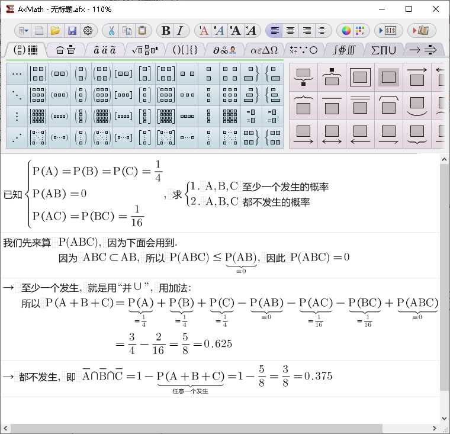
-
- emf 转 svg
	- https://convertio.co/zh/emf-svg/
-
- ---
- 安装 latex
	- 官网 https://www.tug.org/texlive/
	- 下载流程
	  collapsed:: true
		- 教程 https://zhuanlan.zhihu.com/p/56982388
		- 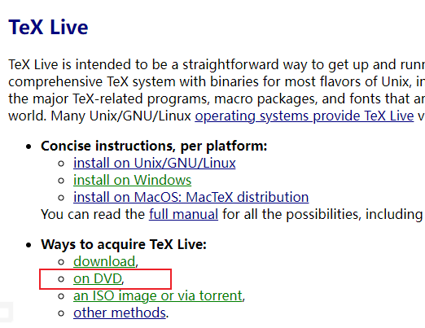
		- 
		- 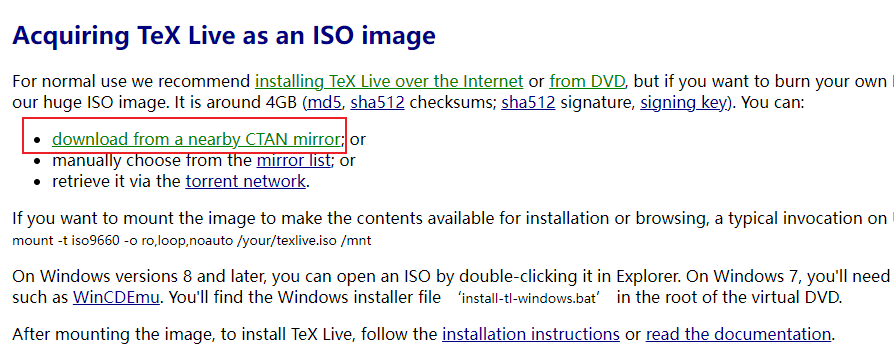
		- 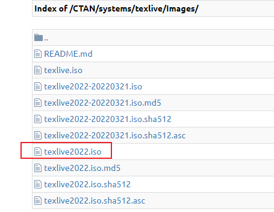
		-
	- 安装:
	  collapsed:: true
		- 将下载的iso文件, 解压
		- 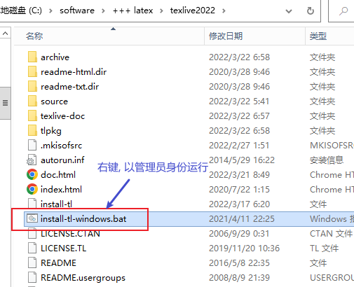
		- 安装路径, 一定要是英文的. 安装需要半小时
		-
		-
		-
	- 初次使用
	  collapsed:: true
		- 开始菜单, 打开这个程序
		- 
		- 选择 XeLaTex,  它对中文支持更好
		- 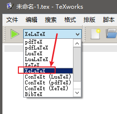
		- 然后拷贝如如下代码
		- ```
		  
		  \documentclass[UTF8]{ctexart}
		  
		  \begin{document}
		  
		  \section{中文} 中文论文排版测试。
		  
		  \end{document}
		  ```
		- 保存后, 按绿色按钮预览
		- 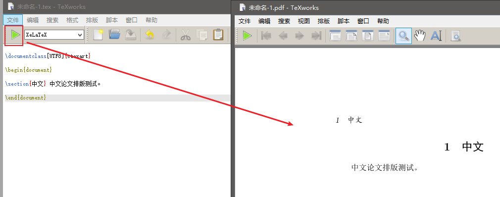
	- latex中的文件类型
	  collapsed:: true
		- 首先对LaTeX文档中应当包含的文件进行说明：
		  | 文件类型 | 功能 |
		  | ---- | ---- | ---- |
		  | .cls | 类文件，通过文档最前面的\documentclass命令导入 |
		  | .cfg | 模板配置文件 |
		  | .bib | 使用bibligraphy方式导入参考文献时，参考文献管理 |
		  | .tex | 我们写文档内容的文件 |
		  | .sty | 包文件，通常使用\usepackage导入，也需要安装 |
		  | .bbl | 其编译之后形成的文件 |
- ---
- TeXstudio软件设置
	- 界面转中文语言
	  collapsed:: true
		- 
		- 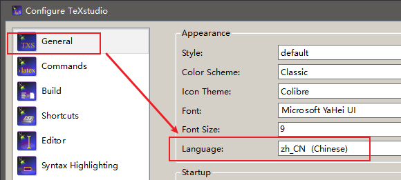
		-
	- 配置各种latex编译器
	  collapsed:: true
		- 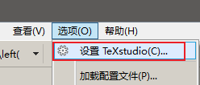
		- 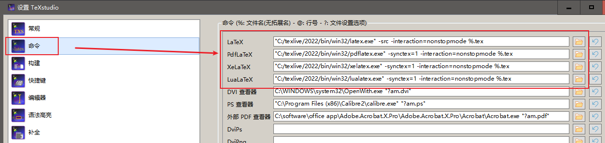
	- 显示行号
	  collapsed:: true
		- 在选项（O）-> 设置TeXstudio(C) 里面
		- 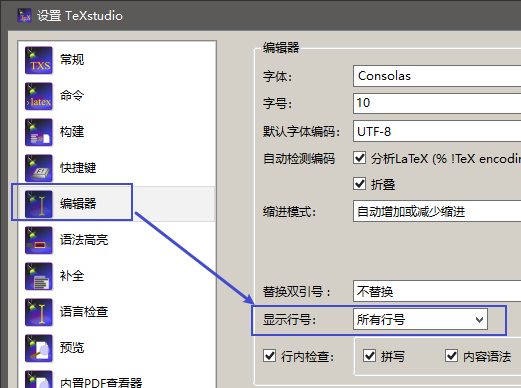
		- 现在, 每行代码前就有行号了
		- 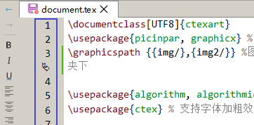
		-
	- 初次代码测试
	  background-color:: red
	  collapsed:: true
		- ```
		  \documentclass[UTF8]{ctexart}
		  
		  
		  \usepackage{picinpar, graphicx} % 导入这个库后,就能支持插入表格
		  \graphicspath {{img_math/},{img2/}} %图片目录在当前目录的 img 和 img2文件夹下
		  \usepackage{float} 
		  \usepackage{subfigure}
		  
		  \usepackage{algorithm, algorithmic, amsmath, amssymb,bm} % 支持数学公式输入
		  % \usepackage[fleqn]{amsmath} % 公式左对齐
		  
		  \usepackage{ctex} % 支持字体加粗效果, 代码为 \textbf{加粗}
		  
		  
		  \usepackage{multicol} %用于实现在同一页中实现不同的分栏
		  \usepackage{wrapfig} %用于实现图文混排
		  \setlength{\parindent}{0pt} % 放在段首，之后的所有段落都将取消首行缩进
		  
		  % 页面边距设置
		  \usepackage{geometry} %导入版面设置的宏包
		  \geometry{left=1.5cm, right=1.5cm, top=2cm, bottom=2cm} % 使用命令：\geometry{left=左边距,right=右边距,top=上边距,bottom=下边距}
		  
		  \usepackage[skins]{tcolorbox} % 导入该包, 才能支持彩色文本框效果.  必须标注skin，才能使用shadow命令显示阴影
		  
		  \usepackage{soul} % 支持英文高亮
		  \usepackage{xcolor} 
		  \newcommand{\mathcolorbox}[2]{\colorbox{#1}{$\displaystyle #2$}}
		  
		  
		  
		  % 支持直接打字希腊字母 (但注意: 会导致另一些字符不可见, 比如 ∞ 等)
		  % \usepackage{fontspec}
		  % \setmainfont{NotoSerif-Regular.ttf}[
		  % BoldFont=NotoSerif-Bold.ttf,
		  % ItalicFont=NotoSerif-Italic.ttf,
		  % BoldItalicFont=NotoSerif-BoldItalic.ttf,
		  % ]
		  
		  %支持修改公式中字体的颜色
		  \usepackage{xcolor}
		  
		  
		  
		  \title{你的标题写在这里}
		  % \author{作者名字}
		  % \date{\today}
		  
		  
		  
		  
		  \begin{document}
		  	\maketitle  %这行代码, 让你前面的 title, author, date生效
		  	\newpage  %分页
		  	
		  	\section{大标题} %大标题
		  	中文论文排版测试。
		  	\subsection {第二级标题} %会形如: 1.1,  2.1,   3.1 
		  	\subsubsection {第三级标题} %会形如 1.1.1,   2.1.1
		  	
		  	%插入表格
		  	\begin{table}[!t]
		  		\renewcommand{\arraystretch}{1.3}
		  		\caption{An Example of a Table}
		  		\label{table_example}
		  		\centering
		  		\begin{tabular}{|c||c|}
		  			\hline
		  			One & Two\\
		  			\hline
		  			Three & Four\\
		  			\hline
		  		\end{tabular}
		  	\end{table}
		  
		  
		  %插入图片. 图片目录一定要和.tex文件在同一目录下.
		  % 另外注意: [!t]、[width=2.5in] 这个是不能缺的
		  \begin{figure}[!t]
		  	\centering
		  	\includegraphics[width=2.5in]{img/j1.jpg}L
		  	\caption{Simulation results for the network.}
		  	\label{fig_sim}
		  \end{figure}
		  
		  
		  %插入latex公式
		  \begin{equation}
		  	\frac{2} {4}
		  	\int_a^b f(x) dx
		  \end{equation}
		  
		  	\begin{align}
		  		& 3\sqrt{x} - 2 \sqrt[3]{x} +4 \\
		  		& = 3x^{1/2} - 2 x^{1/3} +4 \\
		  		& when \ \mbox{当} x → ∞时, (3x^{1/2} - 2 x^{1/3} +4 ) ~ 3x^{1/2} \\
		  		& \text{显示中文}
		  	\end{align}
		  
		  \end{document}
		  ```
	- ### ★自定义代码片段
	  background-color:: red
		- 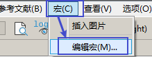
		- 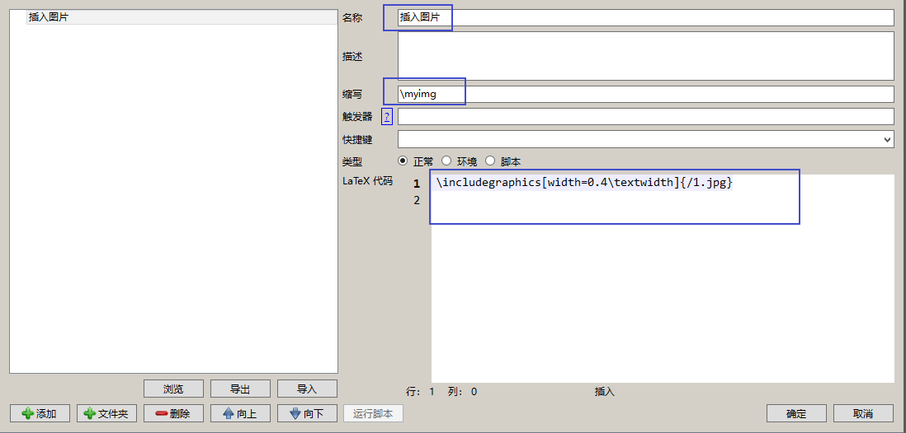
		- 然后, 你就可以输入 `\你自定义的缩写` 来输入该代码片段了
	- ### 自定义快捷键
	  background-color:: red
	  collapsed:: true
		- 将 ctrl+u, 作为给选中的文本添加"下划线"的快捷键. 注意, 使用时, 要先按 ctrl+m后, 再接着按 ctrl+u 才能生效
		  collapsed:: true
			- 在宏里面编辑脚本
			- ```
			  %SCRIPT
			  txt = cursor.selectedText()
			  editor.write("\\underline{"+txt+"}")
			  cursor.clearSelection()
			  ```
		- 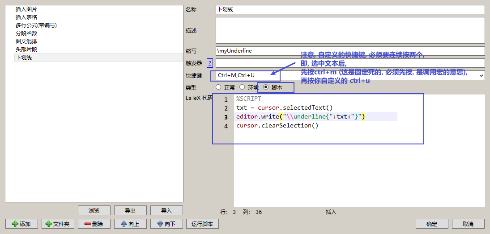
	- 自定义快捷键: 给选中的文本, 添加上双引号
		- %SCRIPT
		  txt = cursor.selectedText()
		  editor.write("``"+txt+"\"")
		  cursor.clearSelection()
		-
		- 或者, 脚本为:
		- %SCRIPT
		  txt = cursor.selectedText() 
		  editor.replaceSelectedText("``" + txt + "\"")
		- 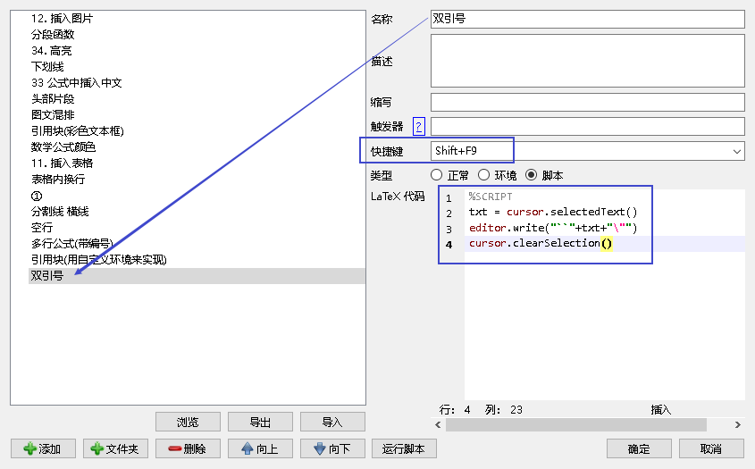
	- 更改texstudio的默认快捷键, 向 phpstorm看齐
	  collapsed:: true
		- phpstorm 的快捷键表
			- https://blog.csdn.net/qq_48046065/article/details/127145912
		- 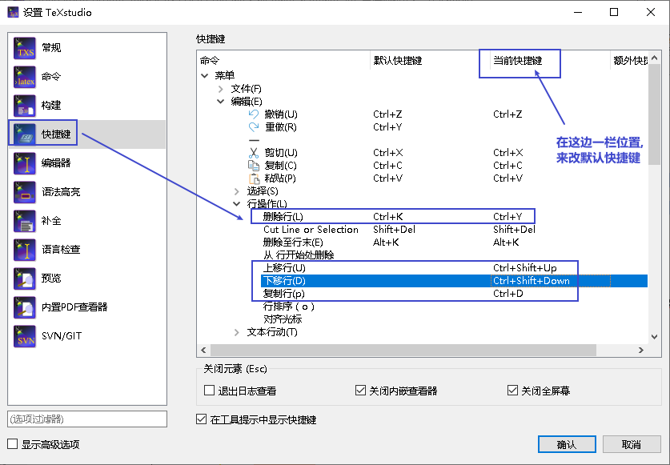
	- ### ★自定义环境
	  background-color:: red
	  collapsed:: true
		- 通过 `\newenvironment` 命令可以自定义environment，格式为  `\newenvironment{name}{pre}{after}` ，其中 `name` 表示environment的名称， `pre` 表示 `内容` 前的内容， `after` 表示内容后的内容。
		- 例子1:
		  collapsed:: true
			- ```
			  \newenvironment{myenv}{前面添加\par}{尾部添加}
			  
			  ---------
			  
			  \begin{myenv}
			  	周芷若 \par  % \par 是指切换下一段，类似换行。
			  \end{myenv}
			  
			  
			  ```
			- 可以看到，使用自定义environment  `myenv` ，他会自动在文档前面和后面增加指定的内容。
			- 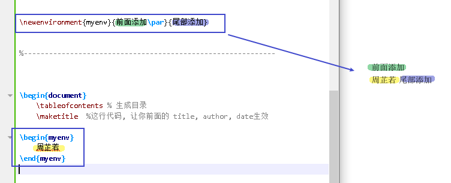
		- 例子2:
		  collapsed:: true
			- 其实就很容易看出，**environment的本质为**：将 `\begin{name}` 替换为 `pre` ，将 `\end{name}` 替换为 `after`
			- ```
			  \newenvironment{myenv}
			  { 
			  	\begin{tcolorbox}[title = {例},boxrule={0.1em},colframe={black!10}, colback={black!3},colbacktitle={black!10},coltitle={black}]
			  %		\begin{align*}  % 注意, 加上这句代码, 似乎通不过, 不加则能通过.
			  }
			  {		
			  %		\end{align*}
			  	\end{tcolorbox}
			  }
			  
			  ------------
			  
			  \begin{myenv}
			  	zhou \ zhi \ ruo 
			  \end{myenv}
			  ```
			- 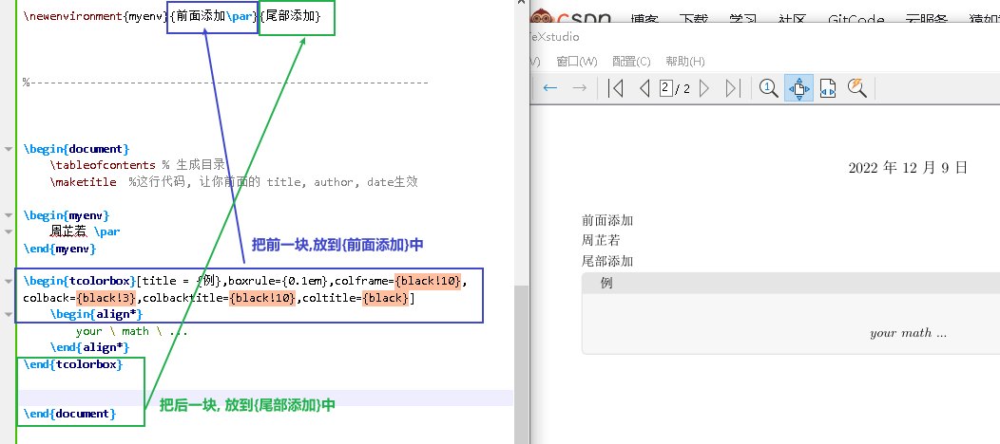
			- 
	- ### ★★一个主页面, 链接(嵌入)进来多个子页面.
	  background-color:: red
	  collapsed:: true
		- 教程 https://blog.csdn.net/xovee/article/details/119065307
		- 大型 LaTeX 项目一般拥有多个.tex文件. LaTeX 有两个包可以支持在多文件项目中进行单文件编译：
		- `subfiles` ：你可以单独编译每个子文件，每个子文件都会用到主文档的 preamble。
		- `standalone` ：每一个子文件类似于一个单独的文件，它们可以在之后合并到主文档里，它们各自的 preamble 也会纳入到主文档中。当你需要在多个文档中重用一个文件的时候，这个包非常有用，例如，tikz 图片。
		-
		- 比如, 现在, 我们有如下目录结构,  根目录下有一个主页面(学习测试.tex), 然后还有一个子目录, 里面有两个子页面.tex
		- 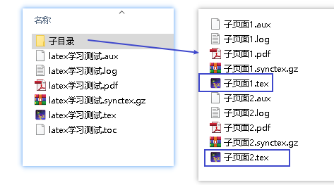
		-
		- 首先来看  `subfiles`  包 . 这个包可以解决大多数问题，它非常容易使用。
		- 现在, 我们要在主页面里面, 来链接, 嵌入这两个子页面.
		- ```
		  \usepackage{subfiles} %  支持将"子页面"导入本"主文件"中. 本语句要放在头部设置的最后 Best loaded last in the preamble
		  
		  --------
		  
		  \section{下面调用子页面1}
		  \subfile{子目录/子页面1} % 调用子页面.  链接进来的页面的路径, 写在{}括号里
		  
		  \section{下面调用子页面2}
		  \subfile{子目录/子页面2} % 链接进来的页面的路径在此. 即每个外部的文件, 都由命令\subfile{}引入。
		  ```
		- 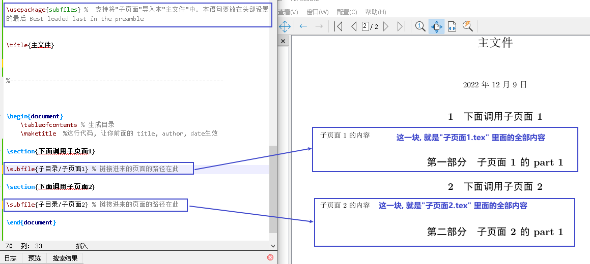
		- 注意: 这种链接方法的话, 每个子文件都必须有它自己的 preamble，并且要引入所有让子页面正常运行的包。
	- ### 自定义宏包
		- 在[LaTeX](https://so.csdn.net/so/search?q=LaTeX&spm=1001.2101.3001.7020)中自定义宏包的方法很简单，首先要注意的是宏包文件的扩展名是sty；其次每个宏包文件的开头都有两行固定格式的声明语句：
		  
		  ```
		  \NeedsTeXFormat{LaTeX2e}
		  \ProvidesPackage{宏包名称}[附带说明]
		  
		  - 1
		  - 2
		  ```
		  
		  示例：
		  
		  ```
		  \NeedsTeXFormat{LaTeX2e}
		  \ProvidesPackage{自定义宏包}[2022-08-14 自定义宏包示例]
		  
		  - 1
		  - 2
		  ```
		  
		  调用自定义宏包的命令同样是\usepackage。
		-
	-
	- ### ★★★ 多个latex文件, 共用一个头部设置 preamble
	  background-color:: red
	  collapsed:: true
		- [自己动手写latex宏包](https://www.cnblogs.com/yishuiliunian/archive/2011/04/05/2005632.html)
		- 写一个宏包的基本工作就是将你原本很长的文档导言拷贝到一个分离的文件中去，这个文件需要以 .sty 结尾，文件中需要使用一个专用的命令：
		- \ProvidesPackage{package name}
		- 这个命令应该在宏包文件起始处使用，用于声明 LaTeX 宏包的名称，当用户尝试两次引入同一个宏包时，\ProvidesPackage 命令会给出宏包重复引用的错误信息。
		- 哪些内容应当放入宏包文件中呢？当然是你的大多数 LaTeX 文档都要用到宏包、自定制的排版命令，把这些东西丢到宏包里，就可以实现复用。宏包使用得当，可以避免很多繁琐的输入与排版命令的记忆。
		-
		- 教程 https://www.cnblogs.com/mashiqi/p/6033323.html
		- 将你的头部设置中的所有代码, 存在一个 myPreamble.sty 文件中, 存在项目根目录下, 内容如下
		  background-color:: red
			- ```
			  
			  \NeedsTeXFormat{LaTeX2e}
			  \ProvidesPackage{myPreamble} % 这前两句必须要写! 即创建一个你自己的宏包
			  
			  
			  
			  \usepackage{tipa}% 这里用于支持音标显示。此包必须在ctex宏包之前，否则会报错。
			  
			  
			  \usepackage{picinpar, graphicx} % 导入这个库后,就能支持插入表格
			  \graphicspath {{img_math/},{img2/}} %图片目录在当前目录的 img 和 img2文件夹下
			  \usepackage{float} 
			  \usepackage{subfigure}
			  
			  \usepackage{algorithm, algorithmic, amsmath, amssymb,bm} % 支持数学公式输入
			  % \usepackage[fleqn]{amsmath} % 公式左对齐
			  
			  \usepackage{ctex} % 支持字体加粗效果, 代码为 \textbf{加粗}
			  
			  
			  \usepackage{multicol} %用于实现在同一页中实现不同的分栏
			  \usepackage{wrapfig} %用于实现图文混排
			  \setlength{\parindent}{0pt} % 放在段首，之后的所有段落都将取消首行缩进
			  
			  % 页面边距设置
			  \usepackage{geometry} %导入版面设置的宏包
			  \geometry{left=1.5cm, right=1.5cm, top=2cm, bottom=2cm} % 使用命令：\geometry{left=左边距,right=右边距,top=上边距,bottom=下边距}
			  
			  \usepackage[skins]{tcolorbox} % 导入该包, 才能支持彩色文本框效果.  必须标注skin，才能使用shadow命令显示阴影
			  
			  \usepackage{soul} % 支持英文高亮
			  \usepackage{xcolor} 
			  \newcommand{\mathcolorbox}[2]{\colorbox{#1}{$\displaystyle #2$}}
			  
			  %支持修改公式中字体的颜色
			  \usepackage{xcolor}
			  
			  % 支持直接打字希腊字母
			  %\usepackage{fontspec}
			  %\setmainfont{CMU Serif}
			  
			  
			  
			  \newenvironment{myEnvSample}
			  { 
			  	\begin{tcolorbox}[title = {例},boxrule={0.1em},colframe={black!10}, colback={black!3},colbacktitle={black!10},coltitle={black}]
			  		%		\begin{align*}  % 注意, 加上这句代码, 似乎通不过, 不加则能通过.
			  		}
			  		{		
			  			%		\end{align*}
			  	\end{tcolorbox}
			  }
			  
			  
			  
			  \usepackage{subfiles} %  支持将"子页面"导入本"主文件"中. 本语句要放在头部设置的最后 Best loaded last in the preamble
			  
			  ```
		- 然后, 就能在每个子页面中, 调用这个统一的myPreamble.sty文件, 来引入所有头部内容. 就能多个tex页面公用同一个头部设置了. 在子页面中, 这样引入:
			- ```
			  
			  \documentclass[UTF8]{ctexart}
			  
			  \usepackage{subfiles}  
			  
			  %下面的语句, 引入你的头部设置文件
			  \usepackage{C:/phpStorm_proj/02_myself_ID_EGO/+100 latex_all_math_sel/study test/myPreamble} % 注意, 这里不需要加扩展名.sty! 
			  %必须是绝对路径，才能让各个tex在单独编译时使用到
			  
			  -------------
			  
			  \begin{document}
			  	\includegraphics[width=0.4\textwidth]{../img2/j1.jpg}
			      %虽然我们在本子页面中, 没有引入 对插入图片的包的支持,  
			      %但由于我们已经写在统一头部设置文件中, 所以这里链接了它后, 依然能插入图片成功
			  \end{document}
			  ```
		-
	-
	-
	-
	- 注释掉某行   按 ctrl+t (temp)
	- 删除整行  按 ctrl+k
	- 删除本行光标后的内容 Alt+K
	- 选中单词 Ctrl+D
	- 选中整行 (以回车键为分界)  Ctrl+L
	  background-color:: red
	-
	- 编译 F5
	- 生成 PDF: F6
	-
	- 插入行内公式：ctrl+shift+M （math的意思）
	  collapsed:: true
		- 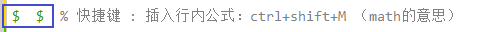
		- 注意, 这个快捷键, 和搜狗输入法有冲突, 必须在搜狗中关闭快捷键
		- 
	- ★ tex文本与pdf文本相互定位：ctrl+鼠标点击，或者F7(显示鼠标位置的pdf文本）
	  background-color:: red
	-
	-
-
- ---
- latex 语法
	- 符号大全
	  collapsed:: true
		- https://www.cnblogs.com/kz16/p/15520637.html
	- 页面边距
	  collapsed:: true
		- ```
		  % 页面边距设置
		  \usepackage{geometry} %导入版面设置的宏包
		  \geometry{left=1.5cm, right=1.5cm, top=2cm, bottom=2cm} % 使用命令：\geometry{left=左边距,right=右边距,top=上边距,bottom=下边距}
		  ```
		- 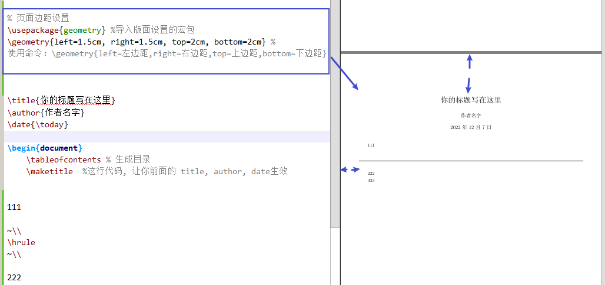
	- 纸张大小的设置
		- ```
		  %导入版面设置的宏包
		  \usepackage{geometry}
		  \geometry{papersize={20cm, 15cm}} % 使用命令：\geometry{papersize={宽, 高}}
		  ```
	-
	- 支持数学公式
	  collapsed:: true
		- ```
		  要想使用\begin{align} 来输入数学公式的话，
		  需要在 \begin{document} 之前插入\usepackage{amsmath}
		  ```
	- ★ 在数学公式中, 支持中文字体
	  background-color:: red
	  collapsed:: true
		- 将中文, 输在 \mbox{ } 或 \text{} 里面.
	- 字体加粗  `\textbf{...}`
	  background-color:: red
	  collapsed:: true
		- 要引入这个包, 才能使用字体加粗效果
		- ```
		  \usepackage{ctex} % 支持字体加粗效果, 代码为 \textbf{加粗}
		  ```
		- 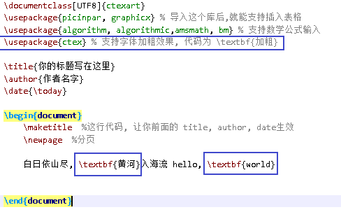
	- 下划线 `\underline{...}`
	  background-color:: red
	- 大于号 >：`\textgreater`
	- 小于号 <： `\textless`
	- 大于等于 ≥：`\geq`
	- 小于等于 ≤：`\leq`
	- 方块 □:  `\Box 或 \square`
	- 等价 ~ : `\sim`
	- latex无法直接输入 arccot 的问题: 改输入 `\operatorname{arccot} `
	- 输入带圈的数字 ① ② 这些: `\textcircled{1}`
	- 角度中的 度° : `^\circ`
	- 任何∀: `\forall `
	- 存在∃ : `\exists`
	- 破折号: 用三个段横线表示 ---
	- 波浪线 ~ : `\sim`
	-
	-
	- ### 数学公式
		- 修改数学公式中的颜色
		  background-color:: red
		  collapsed:: true
			- ```
			  %支持修改公式中字体的颜色
			  \usepackage{xcolor}
			  
			  --------
			  在数学公式中, 使用下面的语句
			  {\color{red}123}  % 将123变成红色
			  ```
		-
		- 行内公式 , 有三种写法:
		  collapsed:: true
			- ```
			  	行内公式的写法
			  	
			  	方法1:	
			  	% 行内公式, 写在两个$中
			  	$ \int_a^b f(x) dx$  
			  	
			  	方法2:
			  	% 也可以写在两个 \(  \) 中
			  	\( \frac{a} {b} \)
			  	
			  	方法3:
			  	% 写在 math 环境中
			  	\begin{math}
			  		\int_a^b f(x) dx
			  	\end{math}
			  ```
			- 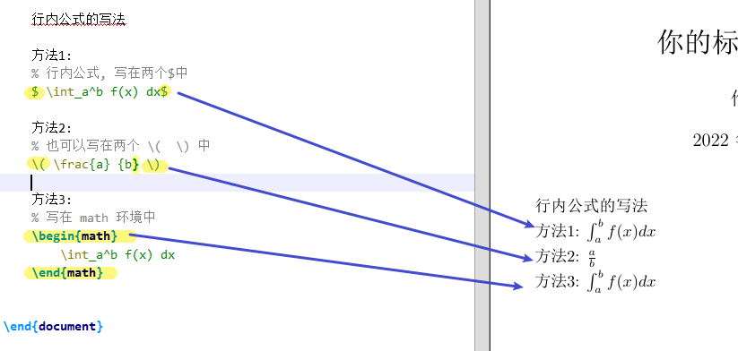
		- 行间公式, 有三种写法
		  collapsed:: true
			- ```
			  	行内公式的写法
			  	
			  	方法1:	
			  	% 行内公式, 写在两个$$  $$中
			  	$$ \int_a^b f(x) dx $$
			  	
			  	方法2:
			  	% 也可以写在两个 \[  \] 中
			  	\[ \frac{a} {b} \]
			  	
			  	方法3:
			  	% 写在 displaymath 环境中
			  	\begin{displaymath}
			  		\int_a^b f(x) dx
			  	\end{displaymath}
			  ```
			- 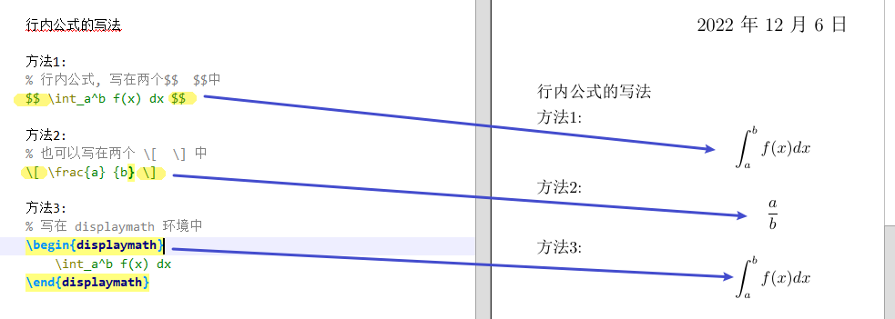
		- 在数学模式中, 使用中文:  `\text()`
		  collapsed:: true
			- 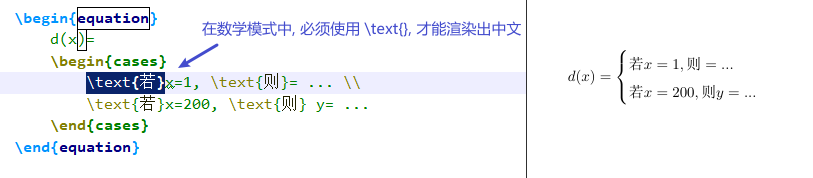
		-
		- 让数学公式, 带编号
		  background-color:: red
		  collapsed:: true
			- 单独成行的行间公式在LaTeX里由equation环境包裹。更多情况的是，我们需要罗列一系列公式，并令其按照等号对齐。目前最常用的是align环境，它将公式用 & 分隔为两部分并对齐。
			- 与equation环境相似的，可以用equation*环境生成不带编号的行间公式。与之相似的还有最常用的无编号行间公式环境 `\[...\]`，以及现在基本被淘汰的 `$$...$$` 环境。当然，还有完全等价的displaymath环境。
			- ```
			  	如果想让公式有编号, 就写在 equation 环境中
			  
			  	\begin{equation}
			  		\int_a^b f(x) dx \\  %注意: 在equation环境中,这样直接换行, 是无效的
			  		a^2 + b^2 = c^2
			  	\end{equation}
			  
			  
			  	\begin{equation}
			  		\begin{aligned}  % 在equation环境中, 必须再内部嵌套使用 aligned环境, 才能支持换行
			  			\int_a^b f(x) dx \\ 
			  			a^2 + b^2 = c^2				
			  		\end{aligned}	
			  \end{equation}
			  ```
			- 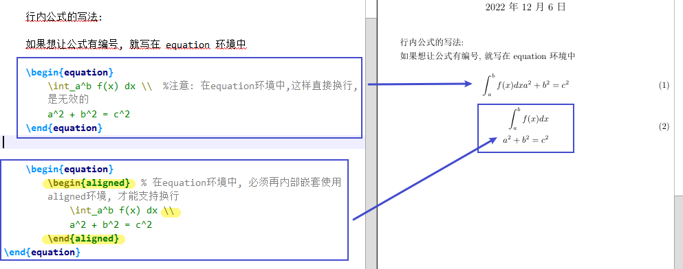{:height 217, :width 529}
		- 让数学公式, 无编号
		  collapsed:: true
			- ```
			  	如果不想让"行间公式"有编号, 就写在 equation* 环境中
			  
			  	\begin{equation*}
			  		\int_a^b f(x) dx \\  %注意: 在equation环境中,这样直接换行, 是无效的
			  		a^2 + b^2 = c^2
			  	\end{equation*}
			  
			  
			  	\begin{equation*}
			  		\begin{aligned}  % 在equation环境中, 必须再内部嵌套使用 aligned环境, 才能支持换行
			  			\int_a^b f(x) dx \\ 
			  			a^2 + b^2 = c^2				
			  		\end{aligned}	
			  	\end{equation*}
			  ```
			  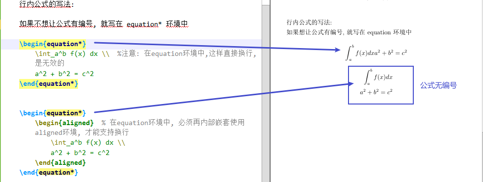
		- 数学公式中, 不能有空行, 否则报错
		  background-color:: green
		  collapsed:: true
			- 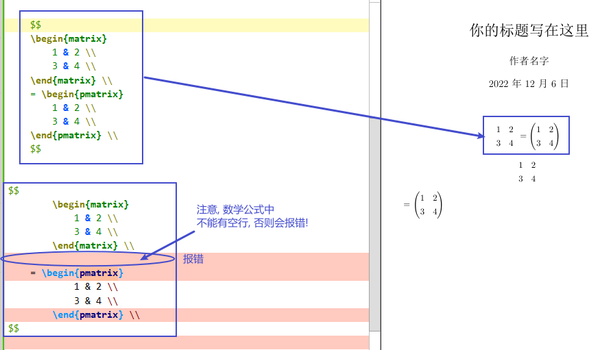
		- 多行公式 gather环境
		  background-color:: red
		  collapsed:: true
			- ```
			  	\begin{gather}  % gather环境能支持换行, 与每行编号
			  		a +b \\
			  		c-d   % 注意, 这最后一行后, 就不需要再加换行符\\了, 否则会多出一行隐藏的空行, 虽然它不会显示出来, 但会有编号. 结果这里就会变成 3个编号.
			  	\end{gather}
			  	
			  	
			  	\begin{gather*}  % gather*环境能支持换行, 但不编号
			  		a +b \\
			  		c-d 		
			  	\end{gather*}
			  
			  
			  	\begin{gather}  % gather环境中, 能用 \notag 来阻止编号
			  		a +b  \notag \\
			  		c-d 		
			  	\end{gather}
			  ```
			- 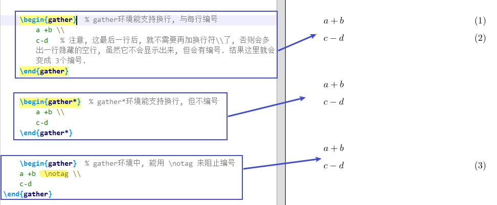
		- 多行公式  align环境
		  background-color:: red
		  collapsed:: true
			- ```
			  	\begin{align}  % align环境, 能支持换行, 与每行编号
			  		& a +b \\
			  		& c-d+e   % 注意, 这最后一行后, 就不需要再加换行符\\了, 否则会多出一行隐藏的空行, 虽然它不会显示出来, 但会有编号. 结果这里就会变成 3个编号.
			  	\end{align}
			  
			  	
			  	\begin{align*}  % align*环境, 能支持换行, 但不编号
			  		a +b &= 123 \\
			  		c-d +e &= 456789		
			  	\end{align*}
			  ```
			- 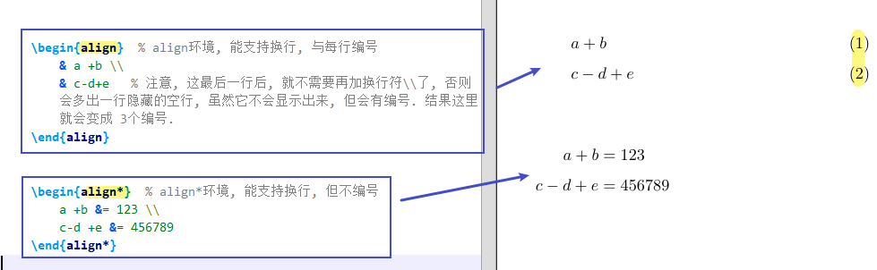
		- gather 和 align 环境的区别
		  collapsed:: true
			- 公式对齐用到的两个环境：align（对齐）和gather（居中）。
			  align环境主要是进行分隔符（&）指定的公式某个位置对齐，gather则是公式居中（没有分隔符），两者皆有自动的公式编号功能，另外还有少些用到的对齐环境aligned（对齐不编号）。我们利用这些环境来进行对多行公式进行编号。
			- gather和align是单独使用的，每行公式都有一个编号，某一行不添加编号，则在该行公式末加一句 `\notag`。align 和gather 有对应的不带编号的版本align* 和gather*
			  gathered和aligned是在 equation 环境中用的，是把几行公式组合为一个整体编号。
			- 参考《The LaTeX Mathematics Companion》的 2.11 一节。
			  或者《Ishort》4.4节。
		- 将多行公式, 只做一个编号 :  在equation环境中, 用 split环境
		  background-color:: red
		  collapsed:: true
			- ```
			  	\begin{equation}
			  		\begin{split}
			  			ab + bc\\
			  			&= cd  + xy \\
			  			&= ef
			  		\end{split}
			  	\end{equation}
			  ```
			- 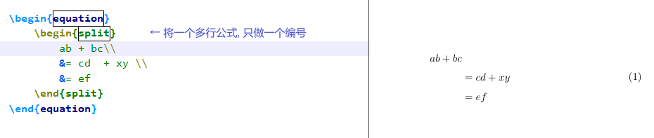
		-
		- 分段函数, 有大括号的: 在equation环境中, 用 cases环境
		  background-color:: red
		  collapsed:: true
			- ```
			  	\begin{equation}
			  		d(x)=
			  		\begin{cases}
			  			\text{若}x=1, \text{则}= ... \\
			  			\text{若}x=200, \text{则} y= ... 
			  		\end{cases}
			  	\end{equation}
			  ```
			- 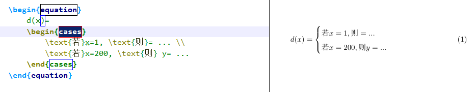
		-
		- 矩阵的写法
		  collapsed:: true
			- ```
			  	\[
			  	\begin{aligned}
			  			\begin{matrix}
			  				1 & 2 \\
			  				3 & 4 \\
			  			\end{matrix} \\
			  		\\
			  			\begin{pmatrix}  % 小括号
			  				1 & 2 \\
			  				3 & 4 \\
			  			\end{pmatrix} \\
			  		\\
			  			\begin{bmatrix}   % 中括号
			  			1 & 2 \\
			  			3 & 4 \\
			  		\end{bmatrix} \\
			  		\\ 
			  			\begin{Bmatrix}   % 大括号
			  			1 & 2 \\
			  			3 & 4 \\
			  		\end{Bmatrix} \\
			  		\\
			  		\begin{vmatrix}   % 单竖线
			  			1 & 2 \\
			  			3 & 4 \\
			  		\end{vmatrix} \\
			  		\\
			  		\begin{Vmatrix}   % 双竖线
			  			1 & 2 \\
			  			3 & 4 \\
			  		\end{Vmatrix} \\
			  	\end{aligned}
			  	\]
			  ```
			- 
		-
		-
	-
	- ### 图像
		- 插入图像  `\includegraphics[width=2.5cm]{j1.jpg}`
		  background-color:: red
		  collapsed:: true
			- 注意: `\includegraphics` 是支持 `png, eps, pdf` 的，不支持 `svg`
			- ```
			  \graphicspath {{img/},{img2/}} %图片目录在当前目录的 img 和 img2文件夹下
			  ---
			  \includegraphics[scale=0.3]{j1.jpg} % 插入图片. 这张图是在 img目录下的. 因为上面已经声明了图片目录的路径, 所以这里就不需要引用图片路径了, 可以直接引用图片名字.
			  \includegraphics[width=3cm]{j3.jpg} % 插入图片. 这张图是在 img2 目录下的
			  
			  %也可以使用绝对路径
			  \includegraphics[width=0.4\textwidth]{D:/Users/czm/Desktop/神经网络论文/1.jpg}    % 注意要使用/
			  
			  ```
			- 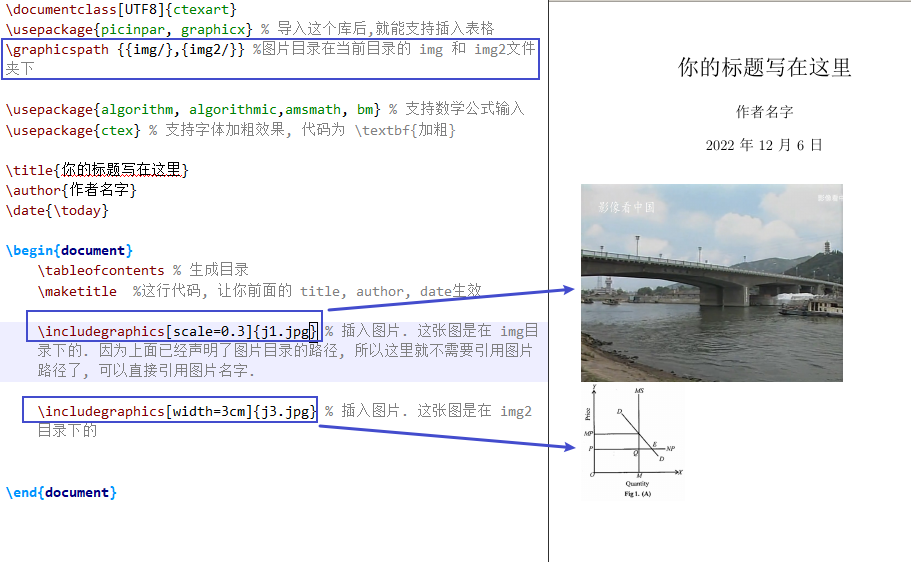
			-
		- 设置图片缩放宽度
		  collapsed:: true
			- ```
			  \includegraphics[width=0.5\linewidth ]{j1.jpg} % width=0.5\linewidth 表示将图像等比例缩小至页面整行文本宽度的0.5倍。
			  ```
			- 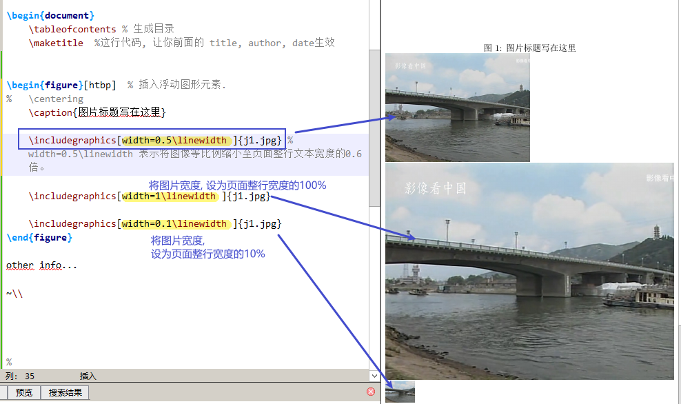
		- `\begin{figure}`
		  collapsed:: true
			- ```
			  \begin{figure}[htbp]  % 插入浮动图形元素. 默认位置会放在页面底部
			  	\centering % 注意, 这个代码顺序不能颠倒, 必须写在图片引用语句的前面, 才能让本figure浮动元素, 居中显示.
			  	\caption{图片标题写在这里}
			  	\includegraphics[width=2.5cm]{j1.jpg}
			  \end{figure}
			  
			  other info...
			  
			  ~\\  % 空行
			  
			  \begin{figure}[htbp] 
			  	\includegraphics[width=2.5cm]{j1.jpg}
			  	\caption{图片标题写在这里}
			  	\centering  % 如果你这条语句写在图片引用后面, 是不会生效的. 图片不会居中
			  \end{figure}
			  ```
			- 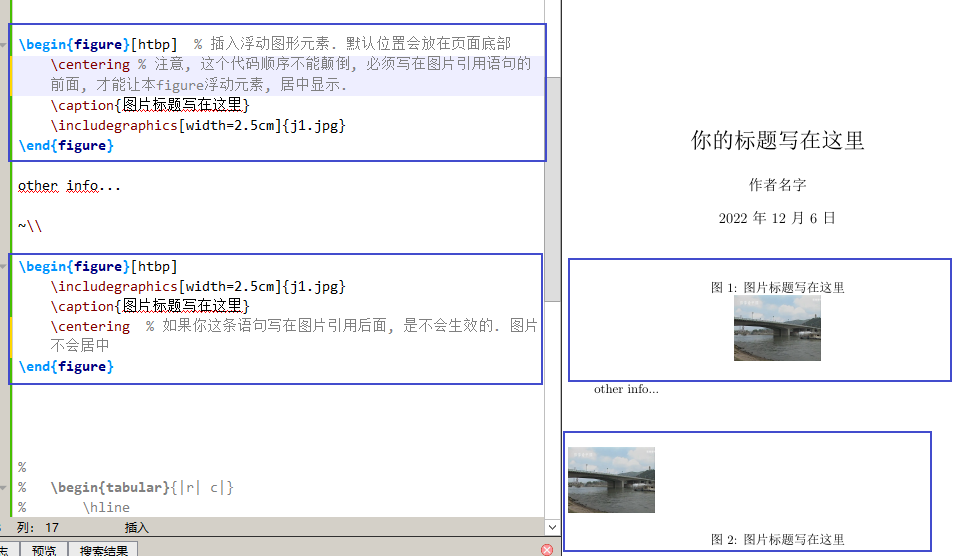
			- ```
			  \begin{figure}[~]是图片环境，常用选择项[htbp]是浮动格式：
			  
			  [h] ~ here，当前位置。将图形放置在正文文本中给出该图形环境的地方。如果本页所剩页面不够，这一参数将不起作用。
			  [t] ~ top，顶部。将图形放置在页面的顶部。
			  [b] ~ bottom，底部。将图形放置在页面的底部。
			  [p] ~ page of its own，浮动页。将图形放置在一个允许有浮动对象的页面上。
			  
			  一般使用[htb]这样的组合，只用[h]是没有用的。这样组合的意思就是LaTex会尽量满足排在前面的浮动格式，就是h-t-b这个顺序，让排版的效果尽量好。
			  
			  [!h]只是试图放在当前位置。如果页面剩下的部分放不下，还是会跑到下一页的。一般而言，用[!h]选项通常会出现不能正确放置的问题，所以常用[ht]、[htbp]等。
			  这里加感叹号的意思是 忽略 “美学” 标准。
			  ```
		- 让图片在一行上并排排列
		  collapsed:: true
			- ```
			  \usepackage{float} 
			  \usepackage{subfigure}
			  
			  ---
			  
			  \begin{figure}[htbp]%调节图片位置，h：浮动；t：顶部；b:底部；p：当前位置
			  \includegraphics[width=0.25\textwidth]{/0023.png}
			  \includegraphics[width=0.25\textwidth]{/0024.png}
			  \end{figure}
			  ```
		- latex 插入 矢量图,   将 svg 转成 pdf 即可
		  collapsed:: true
			- 方法:
			  1. 将svg拖到 chrome浏览器里面, 按 ctrl+p 打印成 PDF
			  2. 然后将PDF拖到 acrobat pro 里面, 进行裁剪, 剪掉白边即可, 然后保存
			  3. 就能在 latex里, 直接插入这个pdf 矢量图片了
			- 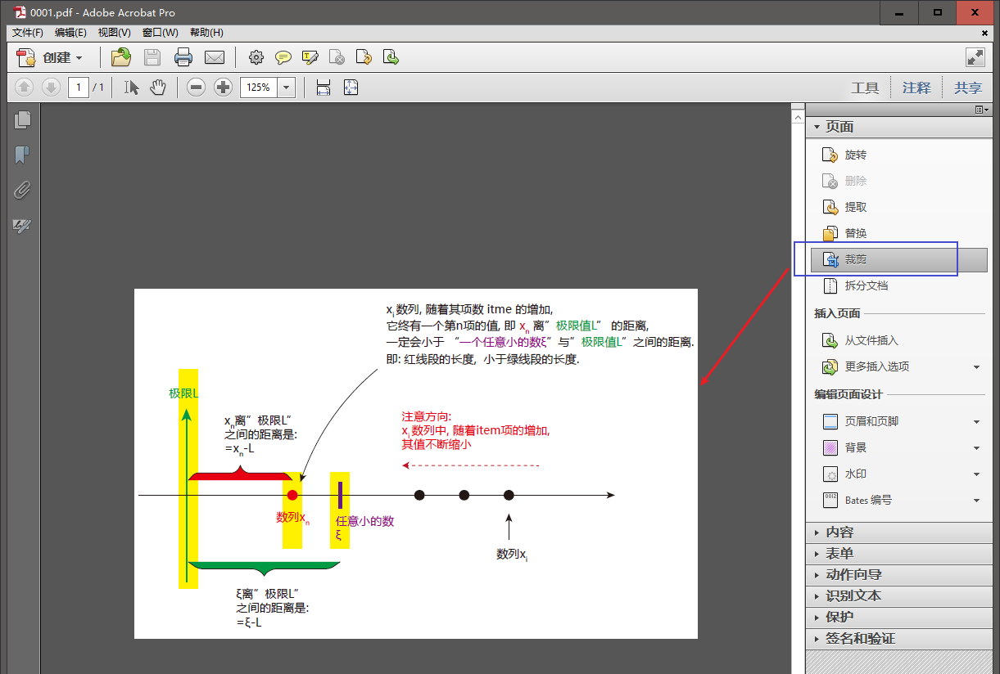
			-
		-
	-
	- ### 表格
		- 插入表格
		  collapsed:: true
			- 注意: 表头的 对齐 {l c c r}, 一定要加上这些 l, c等标识, 否则会出错.
			- ```
			  	\begin{tabular}{l c c r}  % 表格中的列, 用{l c c r}来表示, 其中l(left)表示该列左对齐, c(center)代表该列中对齐, r(right)代表该列右对齐
			  		name & age & sex &  info \\
			  		zrx & 18 &  male &  sth.. \\
			  		wyy & 2000 & femal & sthing... \\
			  	\end{tabular}
			  
			  ~\\ % 加空行
			  
			  	\begin{tabular}{r| c| c |l}
			  		name & age & sex &  info \\
			  		zhouZhiRuo & 18 &  male &  sth.. \\
			  		wangYuYuan & 2000 & femal & sthing... \\
			  	\end{tabular}	
			  
			  ~\\
			  
			  	\begin{tabular}{r| c| c |l}
			  		\hline  % 表格中的横线
			  		name 	& age & sex &  info \\
			  		\hline
			  		zhouZhiRuo & 18 &  male &  sth.. \\
			  		\hline
			  		wangYuYuan & 2000 & femal & sthing... \\
			  		\hline
			  	\end{tabular}
			  ```
			- 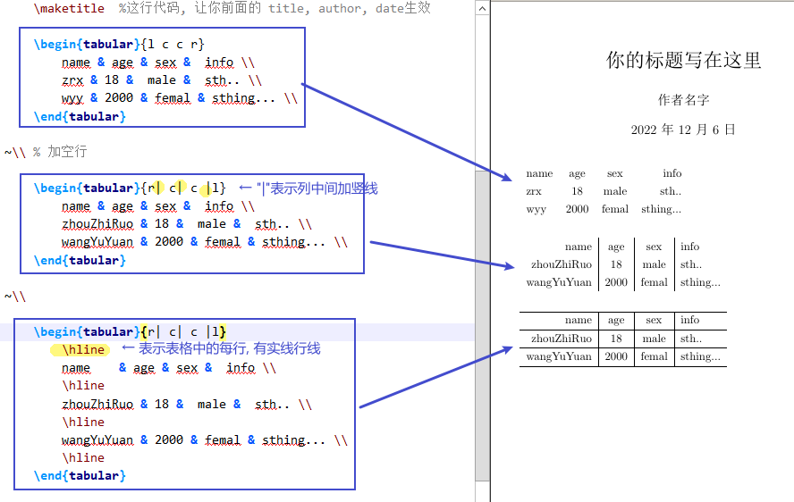
		- 在表格单元格内手动换行 (但注意: 下面这种方法, 有缺陷. 文字长的话, 它不会在单元格内自动换行!)
		  background-color:: red
			- ```
			  先导入宏包 
			  \usepackage{makecell}
			  
			  用命令：\makecell[居中情况]{第1行内容 \\ 第2行内容 \\ 第3行内容 ...}
			  参数说明：
			  [c]是水平居中，[l]水平左居中，[r]水平右居中；
			  *[c]水平 + 垂直居中，*[l]垂直居中 + 水平左居中，*[r]垂直居中 + 水平右居中。
			  
			  --------
			  在表格内, 用 \makecell[l]{上一行写在这里 \\ 下一行写在这里}
			  
			  如: 
			  \begin{tabular}{|p{0.6\textwidth}|p{0.4\textwidth}|}
			  	\hline
			  	\makecell{上一行 \\ 下一行} &  \\
			  	\hline
			  	&  \\
			  	\hline
			  \end{tabular}
			  ```
		- Table和Tabular的区别
		  collapsed:: true
			- 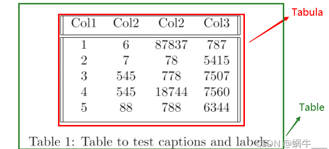
			- 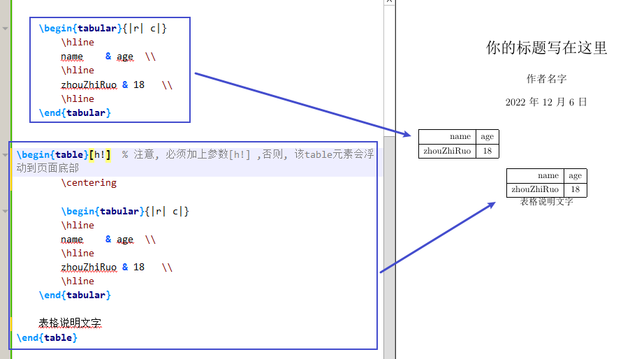
			- `\begin{table}[h!]` 中的`[h!]`是表格的参数，用来调整表格位置，具体有参数有
			  | 参数 | 位置 | 官方解释 |
			  | ---- | ---- | ---- |
			  | h | 以浮动的方式放置在当前位置，大概实在原文本出现的位置，但不完全是 | Place the float here, i.e., approximately at the same point it occurs in the source text (however, not exactly at the spot) |
			  | t | 放置在页面顶部 | Position at the top of the page. |
			  | b | 放置在页面底部 | Position at the bottom of the page. |
			  | p | 只为浮动设置一个特殊页面 | Put on a special page for floats only. |
			  | ! | 覆盖LaTex用于确认“良好”浮动的内部参数 | Override internal parameters LaTeX uses for determining “good” float positions. |
			  | H | 将浮动精确的放置在Latex代码中的位置，需要导入float包，与`h!`等价 | Places the float at precisely the location in the LATEX code. Requires the float package. This is somewhat equivalent to h! |
		- 表格中的列, 自定义宽度百分比
		  background-color:: red
		  collapsed:: true
			- ```
			  \begin{tabular}{|p{0.6\textwidth}|p{0.4\textwidth}|}
			  	\hline
			  先验概率 : 是指根据以往经验和分析得到的概率，它往往作为``由因求果"问题中的``因"出现. 	
			  &  ``先验概率"的计算比较简单，没有使用``贝叶斯公式".\\
			  	\hline
			  后验概率: 是基于新的信息，修正原来的``先验概率"后, 所获得的更接近实际情况的概率估计.	
			  & ``后验概率''的计算，要使用``贝叶斯公式".
			  	  \\
			  	\hline
			  \end{tabular}
			  ```
			- 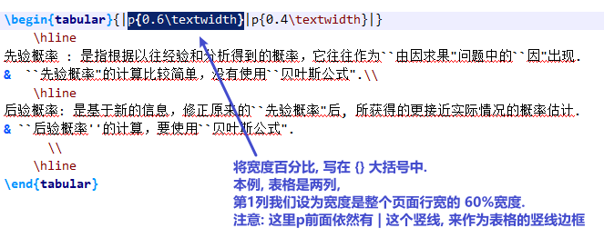
			- 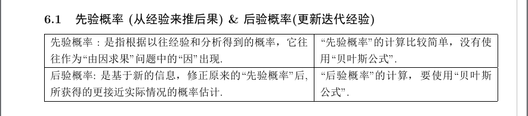
	-
	- ---
	- ### 分栏
		- ★ 图文混排 wrapfigure环境
		  background-color:: red
		  collapsed:: true
			- ```
			  \usepackage{wrapfig} %用于实现图文混排
			  
			  -----------
			  
			  \begin{wrapfigure}[5]{r}[0em]{0.2\textwidth} % 靠文字内容的左侧
			  	\includegraphics[width=0.2\textwidth]{j1.jpg}	
			  \end{wrapfigure}
			  
			  111... 111... 111... 111... 111... 111... 111... 111... 111... 111... 111... 111... 111... 111... 111... 111... 111... 111... 111... 111... 111... 111... 111... 111... 111... 111... 111... 111... 111... 111... 111... 111... 111... 111... 111... 111... 111... 111... 111... 111... 111... 111... 111... 111... 111... 111... 111... 111... 111... 111... 111... 111... 111... 111... 111... 111... 111... 111... 111... 111... 111... 111... 111... 111... 111... 111... 111... 111... 111... 111... 111... 111... 111... 111... 111... 111... 111... 111... 111... 111... 111... 
			  ```
			- 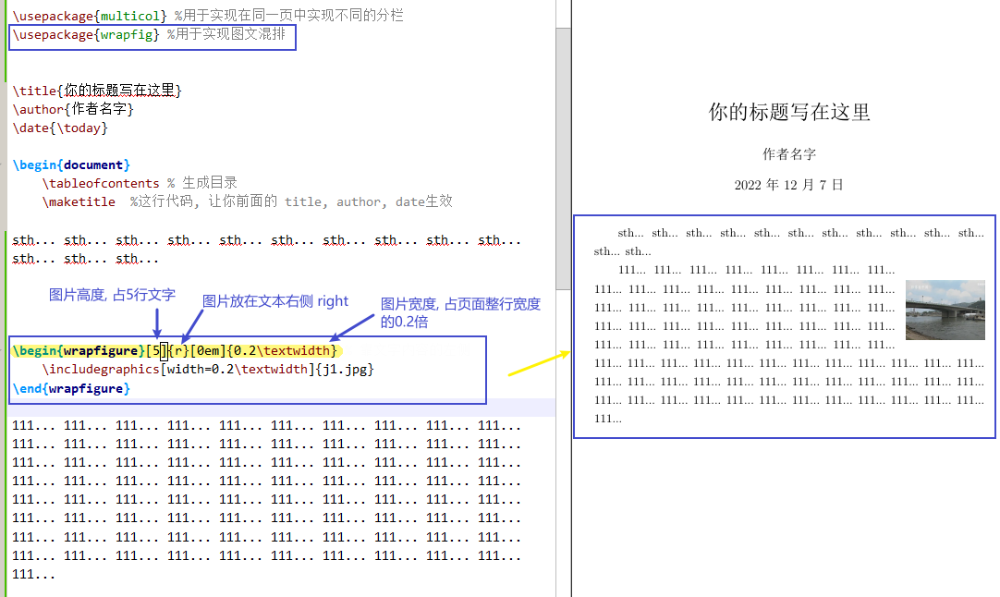
			- 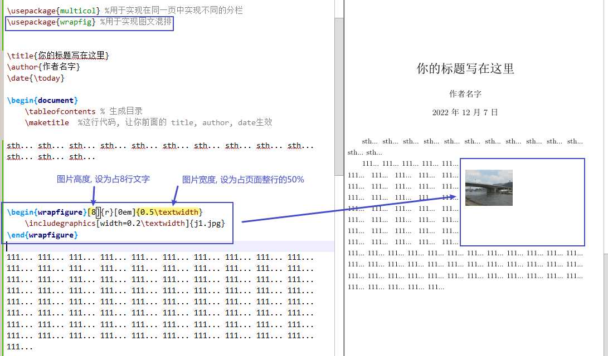
			- `\begin{wrapfigure}[行数]{位置}[超出长度]{宽度}<图形>\end{wrapfigure}`
			- 这其中的5个参数, 分别是:
				- 1.注意，行数两边是方括号，不是花括号！是指图形高度所占的文本行的数目，如果不给出此选项， wrapfig 会自动计算。
				- 2.位置
				  是指图形相对于文本的位置，须给定下面四项的一个。
				  r,R 表示图形位于文本的左边。
				  l,L 表示图形位于文本的右边。
				  i,R 表示图形位于页面靠里的一边（用在双面格式里）。
				  o,O 表示图形位于页面靠外的一边。
				- 3.超出长度
				  是指图形超出文本边界的长度，缺省为 0pt。
				- 4.宽度
				  指图形的宽度。 wrapfig 会自动计算 图形的高度。不过，我们也可设定图形的高度，具体可见 wrapfig.sty 内 的说明。
			- 注意事项
			  collapsed:: true
				- 在 wrapfigure 后必须紧接着输入段落文字，否则会出错。
				- 不能在任何列表环境中使用 wrapfigure，也不能在 列表环境前后使用，除非两者之间有一空行或分段指令 \par。
				- 如果将 wrapfigure 放在 \parbox 或小页环境 等分组中，文本折行必须在这些分组前结束。
				- 在双栏页版式中不能使用 wrapfigure。
				- 如果在 wrapfigure 中使用 figure 等 浮动对象，它的编号有可能不正确。
				- 如果在 wrapfigure 中使用 table 等浮动对象， 它上下方的横线可能被忽略，必须自己再加入。
				- 在折行的文本中， \linewidth 并没有改变。
			-
			-
			-
			-
		- 局部左右分栏(但无法控制哪个内容只在左栏, 哪个只在右栏)
		  collapsed:: true
			- ```
			  \usepackage{multicol} %用于实现在同一页中实现不同的分栏
			  ---
			  \begin{document}
			  
			      \columnseprule=1pt         % 实现插入分隔线, 就是分栏中, 中间的竖线
			  
			      \begin{multicols}{2}       % 分两栏 若花括号中为3则是分三列
			      你的内容写在这里... 会分成两栏显示
			      \end{multicols}
			  
			  \end{document}
			  ```
			- 
	-
	- ### 目录结构
	  collapsed:: true
		- LaTeX 中有七级标题
		- part、chapter、section、subsection、subsubsection、paragraph、subparagraph。
		- ctexart 类没有 chapter 结构。
		- 每级结构都有一个带星号的版本。如：`\section*{}`。
		- 使用 `\tebleofcontents`命令自动生成目录。
		- 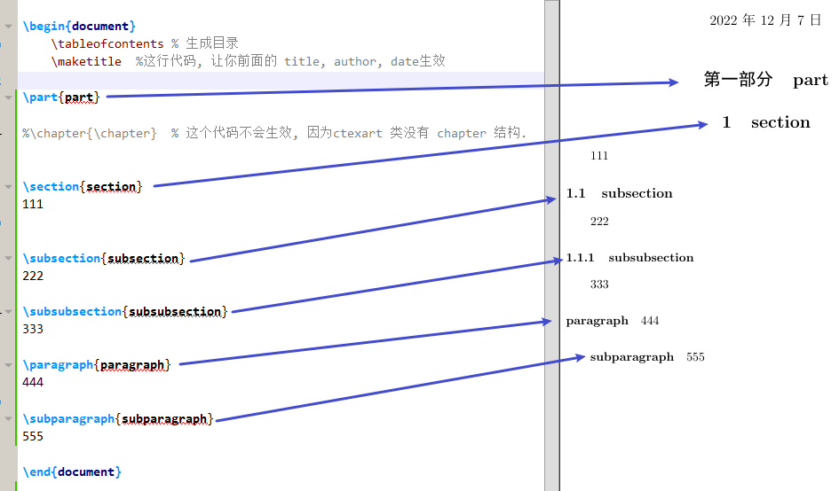
	-
	- ### 彩色文本框, 可做引用
	  background-color:: red
	  collapsed:: true
		- 我常用的两种样式
			- ```
			  \tcbuselibrary{breakable} % 让下面的 tcolorbox 支持跨页
			  \tcbuselibrary{skins} % 让tcolorbox的跨页, 能去掉跨页中间的上下黑线
			  \usepackage[skins]{tcolorbox} % 导入该包, 才能支持彩色文本框效果.  必须标注skin，才能使用shadow命令显示阴影
			  
			  --------------
			  
			  % 下面的参数是:
			  %colframe={color}	即color of frame，设置边框的颜色。
			  %colback={color}	即color of background，设置背景的颜色。
			  %coltitle={color}	color of title text，设置标题的字体颜色。
			  %colbacktitle={color}	即color of title background，标题的背景颜色。
			  %boxrule={length}	设置边框的厚度
			  
			  \begin{tcolorbox}[title = {你的标题内容},boxrule={0.1em},colframe={black!10}, colback={white},colbacktitle={black!10},coltitle={black},breakable,enhanced jigsaw]
			  	上
			  	\tcblower
			  	下
			  \end{tcolorbox}
			  
			  
			  
			  \begin{tcolorbox}[title = {你的标题内容},boxrule={0.1em},colframe={black!10}, colback={black!3},colbacktitle={black!10},coltitle={black},breakable,enhanced jigsaw]
			  	上
			  	\tcblower
			  	下
			  \end{tcolorbox}
			  ```
			- 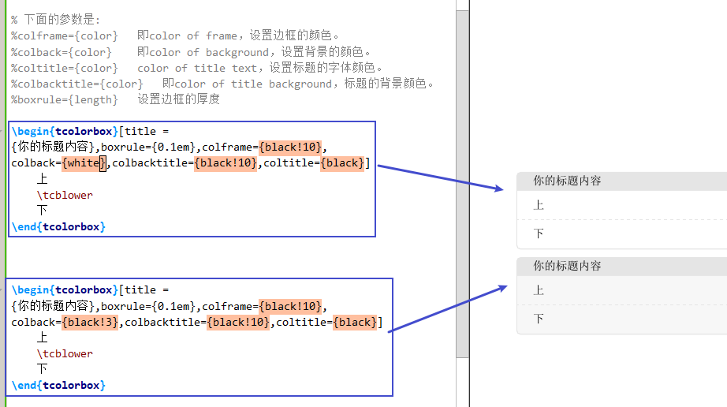
		- 例子1:
		  collapsed:: true
			- ```
			  % 下面的参数是:
			  %colframe={color}	即color of frame，设置边框的颜色。
			  %colback={color}	即color of background，设置背景的颜色。
			  %coltitle={color}	color of title text，设置标题的字体颜色。
			  %colbacktitle={color}	即color of title background，标题的背景颜色。
			  %boxrule={length}	设置边框的厚度
			  
			  \begin{tcolorbox}[title = {你的标题内容},boxrule={0.1em},colback={white},colbacktitle={black!10},coltitle={black}]
			  	上
			  	\tcblower
			  	下
			  \end{tcolorbox}
			  
			  
			  \begin{tcolorbox}[title = {你的标题内容},boxrule={0.1em},colback={white},colbacktitle={black!50},coltitle={black}]
			  	上
			  	\tcblower
			  	下
			  \end{tcolorbox}
			  
			  
			  \begin{tcolorbox}[title = {你的标题内容},boxrule={0.1em},colback={white},colbacktitle={black!100},coltitle={black}]
			  	上
			  	\tcblower
			  	下
			  \end{tcolorbox}
			  ```
			- 
		- 自定义颜色
			- ```
			  \definecolor{my-blue}{cmyk}{0.80, 0.13, 0.14, 0.04, 1.00} %自定义颜色, 赋予一个新变量my-blue
			  ----------
			  \begin{tcolorbox}[title = {你的标题内容},boxrule={0.1em},colback={white},colbacktitle={my-blue},coltitle={black}]
			  	上
			  	\tcblower
			  	下
			  \end{tcolorbox}
			  ```
			- 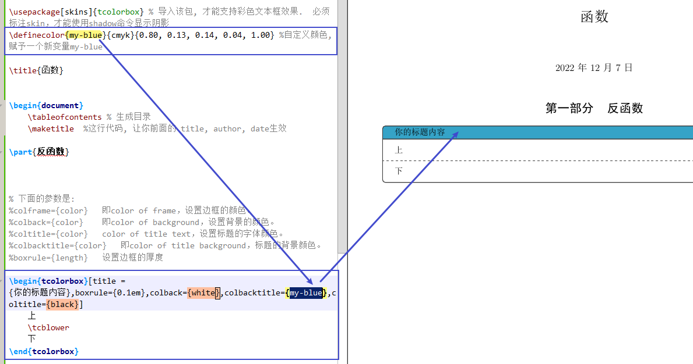
		- 例子2
		  collapsed:: true
			- ```
			  \usepackage[skins]{tcolorbox} % 导入该包, 才能支持彩色文本框效果.  必须标注skin，才能使用shadow命令显示阴影
			  -------
			  1.
			  % 在默认情况下，tcolorbox 输出了一个深灰色圆角边框、浅灰底色的文本框。
			  \begin{tcolorbox}
			  	朝辞白帝彩云间 \textbf{千里江陵一日还}.
			  \end{tcolorbox}
			  
			  
			  2. % 增加了一条虚线。这条虚线由 \tcblower 控制，它将 tcolorbox 中的内容分成了上下两部分。
			  \begin{tcolorbox}
			  	朝辞白帝彩云间 \textbf{千里江陵一日还}.
			  	\tcblower % 虚线
			  	你的文本内容2
			  \end{tcolorbox}
			  
			  
			  3. % 这里，我们给 tcolorbox 环境传入了一个名为 title 的参数，它的值是 I Love Sophia。顾名思义，这给 tcolorbox 输出的文本框起了一个名字。默认情况下，这个名字会显示在文本框的头部。
			  \begin{tcolorbox}[title = {你的标题内容}]
			  	朝辞白帝彩云间 \textbf{tcolorbox} 千里江陵一日还.
			  	\tcblower
			  	两岸猿声啼不住
			  \end{tcolorbox}
			  
			  
			  4.
			  朝辞白帝彩云间 \tcbox[tcbox raise base]{千里江陵一日还}
			  ```
			- 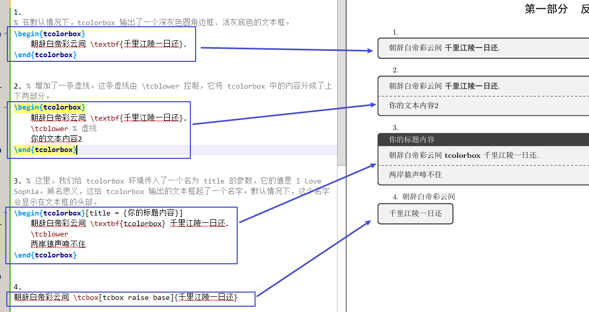
		- 例子3
		  collapsed:: true
			- ```
			  % 下面的参数是:
			  %colframe={color}	即color of frame，设置边框的颜色。
			  %colback={color}	即color of background，设置背景的颜色。
			  %coltitle={color}	color of title text，设置标题的字体颜色。
			  %boxrule={length}	设置边框的厚度
			  
			  \begin{tcolorbox}[title = {你的标题内容},colframe={gray},colback={yellow},coltitle={red},boxrule={0.1em}]
			  	朝辞白帝彩云间 \textbf{tcolorbox} 千里江陵一日还.
			  	\tcblower
			  	两岸猿声啼不住
			  \end{tcolorbox}
			  ```
			- 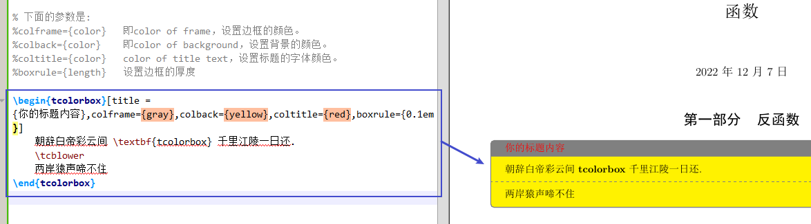
		- 详细说明文档
		  collapsed:: true
			- ## 基本环境
			- tcolorbox：是tcolorbox宏包所提供的最主要的环境。
			- ## 基本命令
			  
			  tcolorbox宏包提供的命令，多以“tcb”开头，为“***TC***olor***B***ox”的缩写。
			  
			  | 命令 | 说明 |
			  | \tcblower | 指示开始tcolorbox的下半部分 |
			  | \tcbset{options} | 为此命令之后的所有顶层tcolorbox设置options。（不包括包含在tcolorbox内部的tcolorbox。） |
			  | \tcbsetforeverylayer{options} | tcbset for every layer，为此命令之后的所有的tcolorbox设置options。 |
			  | \tcbox{content} | 根据content的宽度建立一个无下半部分的、不可分页的tcolorbox。 |
			  | \newtcolorbox{name}{options} | 建立一个以name作为环境名的，预设options的tcolorbox。（类比于\newenvironment） |
			  | \renewtcolorbox{name}{options} | 更新以name作为环境名的tcolorbox，类比于\renewenvironment |
			  | \newtcbox{name}{options} | 建立一个以name作为环境名的，预设options、无下半部分、不可分页tcolorbox。（类比于\newcommand） |
			  | \renewtcbox{name}{options} | 更新以name作为环境名的，预设options、无下半部分、不可分页tcolorbox。（类比于\renewcommand） |
			  | \tcolorboxenviroment{name}{options} | 基于已有的name环境，建立一个预设options的tcolorbox。 |
			- ## tcolorbox基本的可设置参数
			  
			  tcolorbox的可设置参数庞杂繁复，主要分为以下几类：
			- 标题相关的，包括：
			  
			  | 标题相关的设置 | 说明 |
			  | title={title} | 设置tcolorbox的标题 |
			  | notitle | 去除tcolorbox的标题行 |
			  | adjusted title={text} | 配合adjusted title使用，将tcolorbox的标题行的高度设置为adjusted title的高度。 |
			  | adjusted text={text} | 配合adjusted title使用，为tcolorbox标题行设置高度。 |
			  | squeezed title={title} | 将过长的标题压缩到一行 |
			  | titlebox={mode} | 指定标题行内容的处理方式，mode的可选值包括visible和invisible。 |
			  | detach title | 将tcolorbox的标题行内容脱离预定位置，并存储在 \tcbtitletext 中。格式化的标题可通过 \tcbtitle 读取。 |
			  | attach title | 将标题行的内容恢复到原来的位置 |
			  | attach title to upper={text} | 将text插入到格式化的标题和tcolorbox内容之间。 |
			  | subtitle style={options} | 设置副标题的格式 |
			- 上、下部分相关的，tcolorbox可以通过\tcblower被分为上下两部分：
			  
			  | 上下部分相关参数 | 说明 |
			  | upperbox={mode} | 上半部分内容的处理方式。（类似于titlebox、lowerbox），mode的可选值包括visible和invisible。 |
			  | lowerbox={mode} | 下半部分内容的处理方式。（类似于titlebox、upperbox），mode的可选值包括visible和invisible。 |
			  | saveto={filename} | 将tcolorbox的内容（也包括下半部分）保存至filename中 |
			  | savelowerto={filename} | 将下半部分的内容保存至filename中。 |
			  | lower separated={true|false} | 是否显示上下部分的分割线。 |
			- 字体相关的
			  
			  | 字体相关设置 | 说明 |
			  | fonttitle={content} | 设置在标题前的内容，可包括格式化命令 |
			  | fontupper={content} | 设置在上半部分前的内容，可包括格式化命令 |
			  | fontlower={content} | 设置在下半部分前的内容，可包括格式化命令 |
			- 颜色相关的
			  
			  | 颜色相关设置 | 说明 |
			  | colframe={color} | 即color of frame，设置边框的颜色。 |
			  | colback={color} | 即color of background，设置背景的颜色。 |
			  | title filled={true|false} | 可理解为是否填充标题， |
			  | colbacktitle={color} | 即color of title background，标题的背景颜色。 |
			  | colupper={color} | color of upper text，上半部分字体颜色 |
			  | collower={color} | color of lower text，下半部分字体颜色 |
			  | coltext={color} | 同时设置上下部分的字体颜色。 |
			  | coltitle={color} | color of title text，设置标题的字体颜色。 |
			- 文本排列相关的，依然分为标题、上半部分、下半部分（除了表中提到的方式，还有一些快捷设置文本排列的参数，此表省略）：
			  
			  | 文本排列相关设置 | 说明 |
			  | halign={alignment} | horizontal alignment，即文本的水平对齐方式（仅包括上半部分）。可选值包括justify、left、flush left、right、flush right、center和flush center。 |
			  | halign upper={alignment} | 同halign={alignment} |
			  | halign lower={alignment} | 设置下半部分文本的对齐方式。 |
			  | halign title={alignment} | 设置标题的对齐方式。 |
			  | valign={alignment} | vertical alignment，上半部分垂直对齐方式。可选值包括top、center、bottom、scale（即拉伸或压缩文本以符合tcolorbox的高度）以及scale*（受限的scale）。 |
			- tcolorbox大小、形状相关的：
			  
			  | 形状设置参数 | 说明 |
			  | width={length} | 设置tcolorbox的宽度。 |
			  | text width={length} | 设置上半部分文本的宽度。 |
			  | add to width={length} | 在现有的宽度上加上length。 |
			  | height={length} | 设置高度。 |
			  | text height={length} | 设置上半部分文本的高度。 |
			  |  | 设置上边框的厚度 |
			  | toprule={length} | 设置下边框的厚度 |
			  | bottomrule={length} | 设置左边框的厚度 |
			  | leftrule={length} | 设置右边框的厚度 |
			  | rightrule={length} | 设置标题下边框的厚度 |
			  | boxrule={length} | 设置边框的厚度 |
			  | 弧度相关设置 | 说明 |
			  | arc={length} | 设置四个角的内半径。 |
			  | circular arc | 将arc设置为内部文本的一半。 |
			  | bean arc | 将arc设置tcolorbox高度和宽度中较小值的一半。 |
			  | octogon arc | 嗯，一般何少用到吧，可以看看tcolorbox的说明。 |
			  | outer arc={length} | 设置四角的外边的半径 |
			  | 角落设置 | 说明 |
			  | sharp corners={position} | 将指定的角落设置为直角。可选值包括：northwest、northeast、southwest、southeast、north、south、east、west、downhill、uphill和all。 |
			  | rounded corners={position} | 将指定角落设置为弧形，可选值同shrap cornes。 |
			- 间距相关设置：显然间距的设置又可分为上、下、左、右，标题和文本。
			  
			  | 间距相关设置 | 说明 |
			  | boxsep={length} | 该值将会加到设置的上下左右间隔上。 |
			  | left={length} |  |
			  | lefttitle={length} |  |
			  | leftupper={length} |  |
			  | leftlower={length} |  |
			  | right={length} |  |
			  | righttitle={length} |  |
			  | rightupper={length} |  |
			  | rightlower={length} |  |
			  | top={length} |  |
			  | toptitle={length} |  |
			  | bottom={length} |  |
			  | bottomtitle={length} |  |
			  | middle={length} | 设置上下部分文本与上下分割线之间的距离。 |
			- 透明设置，以小数的形式设置透明比例。
			  
			  | 透明设置 | 说明 |
			  | opacityframe={fraction} | 边框的透明程度 |
			  | opacityback={fraction} | 上下部分背景的透明程度 |
			  | opacitybacktitle={fraction} | 标题背景的透明程度 |
			  | opacityfill={fraction} |  |
			  | opacityupper={fraction} | 上半部分文本的透明程度 |
			  | opacitylower={fraction} | 下半部分文本的透明程度 |
			  | opacitytext={fraction} | 同时设置上下部分文本的透明程度 |
			  | opacitytitle={fraction} | 标题文本的透明程度 |
			- ## 其他设置
			  
			  除了上述的常用设置外，tcolorbox还包括一些可以实现某些特效的设置，包括：
			- 类似 before title、after title 等的在文本前后加入其他内容的设置，
			- 以tabulars、tabularx为代表的绘制表格相关的设置，
			- 类似tikz upper、tikz lower等的绘图设置，
			- 以overlay为代表的叠层设置，
			- 在跨页时（overlay broken等）的操作等设置，
			- 包括skip的可用来设置tcolorbox与周围段落间隔的设置，
			- 设置tcolorbox与其他文本对齐方式的设置，包括tcbox raise、on line等，
			- Bounding Box相关的设置，
			- 以spread inwards、spread outwards为代表的扩展到页面边缘的设置，
			- 包括extrude等的突出设置，
			- …………
			- ## 结语
			  
			  善用tcolorbox，可以做出非常酷炫的效果。然而由于tcolorbox的设置参数过于繁杂（毕竟tcolorbox自带一份长达500多页的说明书），大多数时候我们只会使用其一小部分功能，并不能完整的真是其真正的实力。另外，由于tcolorbox很多功能基于tikz，掌握tcolorbox的高端功能，必然需要对tikz有一定的认知。
	- ---
	- 生成toc目录
	  collapsed:: true
		- ```
		  \tableofcontents % 生成目录  ←该语句写在 \begin{document} 里面
		  ```
		- 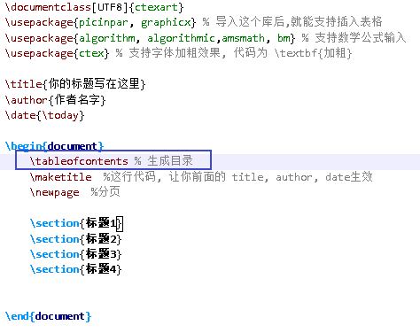
		-
	- 分页
		- ```
		  \newpage  %分页
		  ```
	- 取消段首缩进 (全局生效)
	  background-color:: red
	  collapsed:: true
		- ```
		  \setlength{\parindent}{0pt} % 放在段首，之后的所有段落都将取消首行缩进
		  ```
		- 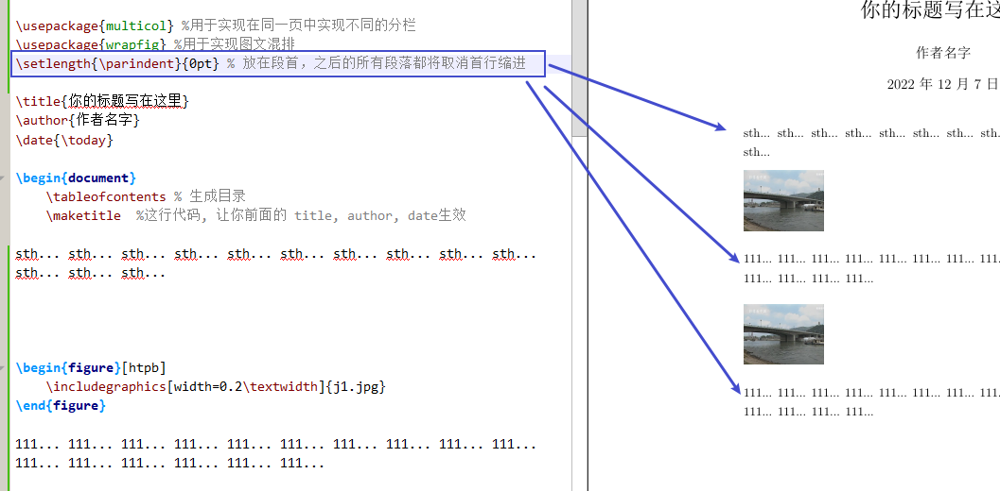
	- 取消段首缩进 (指定某行生效)
	  collapsed:: true
		- ```
		  \noindent %只取消该段的首行缩进
		  ```
		- 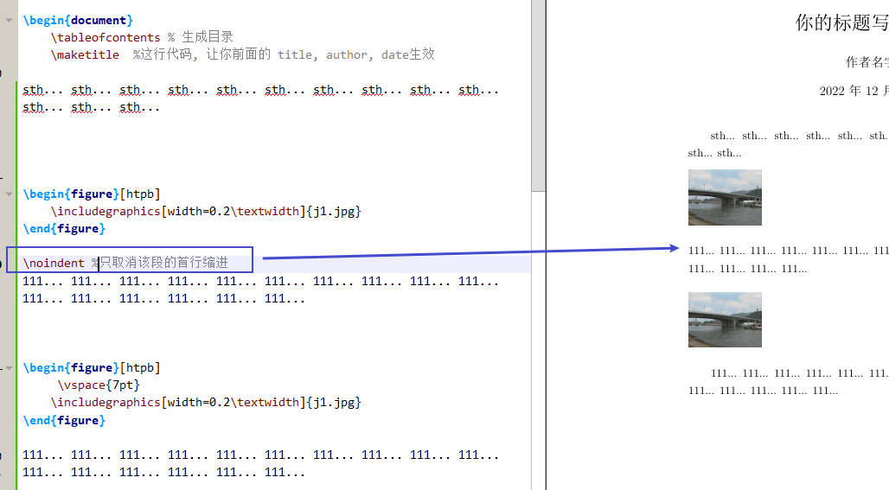
	- 加空行 :
	  background-color:: red
		- ```
		  \vspace{1em}  % 推荐!! 1em，就是你当前字符大小的一个距离。
		  
		  
		  ~\\       % 加空行. 不推荐, 会变成空两行
		  ```
	-
	- ### 分割线
		- 分割线 实线横线  `\hrule` 或 `\hrulefill`
		  background-color:: red
		  collapsed:: true
			- ```
			  ~\\
			  \hrule
			  ~\\
			  ```
			- 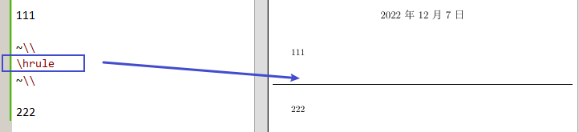
		- 分割线, 虚线 `\dotfill`
		  collapsed:: true
			- 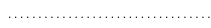
			-
		- 分割线, 完全空白
		  collapsed:: true
			- ```
			  1 \\
			  \hfill \\
			  3
			  ```
			- 
			-
		- \hspace{长度} ： 插入指定距离的水平空白间隔。
		  background-color:: red
		- `\hphantom{文本}`：插入指定“文本”宽度的水平空白。
		  background-color:: red
	- ### 高亮  hight light
	  background-color:: yellow
	  collapsed:: true
		- ```
		  % 头部先导入包
		  \usepackage{soul} % 支持高亮
		  \usepackage{xcolor} 
		  
		  --------
		  
		  \hl{This will be highlight.}  % 注意! 此方法不支持高亮汉字, 只能高亮英文和公式
		  
		  \protect\hl{This will be highlight.}
		  ```
		- 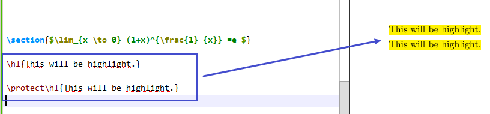
	-
	- 单引号和双引号
	  collapsed:: true
		- ```
		  	'hel'lo -- "你好" \\  % 单引号和双引号, 不能这样写
		  	`hel'lo -- ``你好"  % 因为latex中, 左引号要用`, 右引号才是'
		  ```
		- 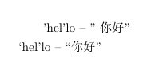
	- 连字符, 有三种写法
	  collapsed:: true
		- ```
		  	abc - def \\
		  	abc -- def \\
		  	abc --- def   % 这种效果最好
		  ```
		- 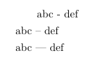
		-
	-
	-
- 乱数假文
	- ```
	  \usepackage{lipsum} % 该包能让你能输入乱数假文段落
	  
	  -----------
	   \lipsum[1-5]  % 这一行用以生成一段以“Lorem ipsum”开头的无意义文字的第一至第五自然段
	  
	  ```
-
- (不推荐使用!! 会导致 空行失效 )让段落中的文字, 左对齐, 而非默认的两段对齐: 添加下面的包即可
	- ```
	  \usepackage[document]{ragged2e}  % 副作用是, 会导致空行失效
	  ```
-