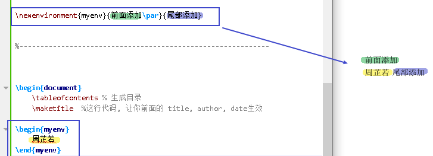
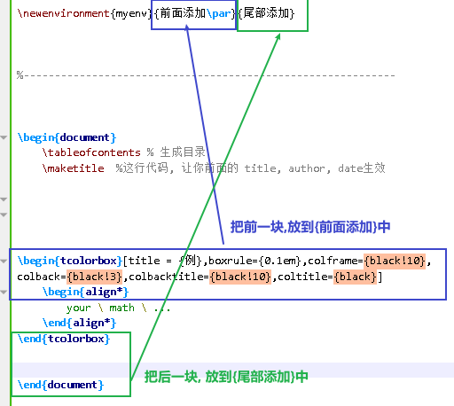
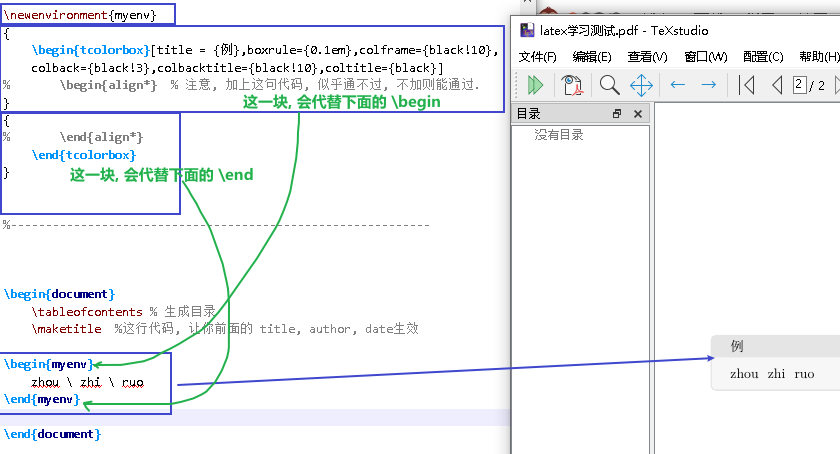
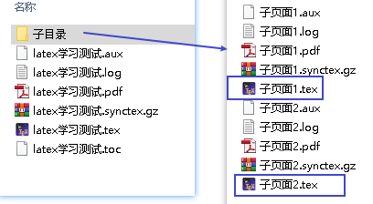
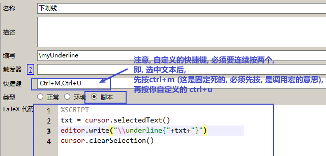

=  latex 和 TeXstudio
:toc: left
:toclevels: 3
:sectnums:

---

== ★★

=== 自定义"环境"

自定义你的"环境" (相当于html标签, 可以包裹内容, 来赋予内容意义与样式等)


.标题
====
例如：
```
\newenvironment{myenv}{前面添加\par}{尾部添加}  % \par 是指切换下一段，类似换行

---------

\begin{myenv}
	周芷若 \par
\end{myenv}
```


====

自定义environment, 要通过 `\newenvironment` 命令.  +
格式为  `\newenvironment{你自定义的环境名}{你"内容"前面的代码}{你"内容"基本面的代码}`.



.标题
====
比如, 我们来创建一个"引用块"的自定义彩色文本框. 我们就来创建这个自定义环境:

```
\newenvironment{myenv}
{
	\begin{tcolorbox}[title = {例},boxrule={0.1em},colframe={black!10}, colback={black!3},colbacktitle={black!10},coltitle={black}]
%		\begin{align*}  % 注意, 加上这句代码, 似乎通不过, 不加则能通过.
}
{
%		\end{align*} % 注意, 加上这句代码, 似乎通不过, 不加则能通过.
	\end{tcolorbox}
}

------------

\begin{myenv}    % 调用你创建的环境
	zhou \ zhi \ ruo
\end{myenv}
```


====

---

=== (链接)嵌入其他页面内容

一个主页面, 链接(嵌入)进来多个其他子页面

.标题
====
比如, 现在我们有如下目录结构:  根目录下有一个主页面(比如叫"学习测试.tex"), 然后还有一个子目录, 里面有两个子页面.tex



现在, 我们在主页面里面, 来(链接)嵌入这两个子页面的内容.

```
\usepackage{subfiles} %  支持链接. 本句最好放在头部设置的最后 Best loaded last in the preamble

--------

\section{下面调用子页面1}
\subfile{子目录/子页面1} % 调用子页面. 要链接进来的页面的路径, 写在{}括号里

\section{下面调用子页面2}
\subfile{子目录/子页面2} % 链接进来的页面的路径写在此.
```

image:img_LaTeX/067.png[,]
====

---

=== 自定义宏包 (.sty 格式)

你可以把常用的要引入的包, 写在一个宏包文件中. 这样, 你就能在多个tex 文件中, 来共享链接到这个宏包, 让每个 tex文件拥有共同的"头部设置 preamble".

".sty宏包" 文件的格式如下:

```
% 下面这两句, 是固定开头, 必须要写! 即创建一个你自己的宏包
\NeedsTeXFormat{LaTeX2e}
\ProvidesPackage{你这个宏包的名字写在这里}

% 开始导入你的常用宏包
\usepackage{...}
\usepackage{...}
\usepackage{...}
```

如, 我常用的自定义宏包(里面引入了我所有常用的包), 内容如下:

```


\NeedsTeXFormat{LaTeX2e}
\ProvidesPackage{myPreamble}


\usepackage{makecell} % 让表格内支持手动换行, 需使用代码 \makecell{ 上一行 \\ 下一行 }

\usepackage{tipa}% 这里用于支持音标显示。此包必须在ctex宏包之前，否则会报错。


\usepackage{picinpar, graphicx} % 导入这个库后,就能支持插入表格
\graphicspath {{img_math/},{img2/}} %图片目录在当前目录的 img 和 img2文件夹下
\usepackage{float}
\usepackage{subfigure}

\usepackage{algorithm, algorithmic, amsmath, amssymb,bm} % 支持数学公式输入
% \usepackage[fleqn]{amsmath} % 公式左对齐

\usepackage{ctex} % 支持字体加粗效果, 代码为 \textbf{加粗}


\usepackage{multicol} %用于实现在同一页中实现不同的分栏
\usepackage{wrapfig} %用于实现图文混排
\setlength{\parindent}{0pt} % 放在段首，之后的所有段落都将取消首行缩进

% 页面边距设置
\usepackage{geometry} %导入版面设置的宏包
\geometry{left=1.5cm, right=1.5cm, top=2cm, bottom=2cm} % 使用命令：\geometry{left=左边距,right=右边距,top=上边距,bottom=下边距}


%导入版面设置的宏包
\usepackage{geometry}
\geometry{papersize={18cm, 32cm}} % 使用命令：\geometry{papersize={宽, 高}}


\usepackage[skins]{tcolorbox} % 导入该包, 才能支持彩色文本框效果.  必须标注skin，才能使用shadow命令显示阴影

\usepackage{soul} % 支持英文高亮
\usepackage{xcolor}
\newcommand{\mathcolorbox}[2]{\colorbox{#1}{$\displaystyle #2$}}

%支持修改公式中字体的颜色
\usepackage{xcolor}

% 支持直接打字希腊字母
%\usepackage{fontspec}
%\setmainfont{CMU Serif}

% 支持输入实心五角星 ★, 命令是 \ding{72}, 注意: 这个命令不需要用$$来括起来
\usepackage{pifont}


\tcbuselibrary{breakable} % breakable：让tcolorbox支持跨页
\tcbuselibrary{skins} % 让tcolorbox的跨页, 能去掉跨页中间的上下黑线
\newenvironment{myEnvSample}
{
	\begin{tcolorbox}[title = {例},boxrule={0.1em},colframe={black!10}, colback={black!3},colbacktitle={black!10},coltitle={black},breakable,enhanced jigsaw]
		%		\begin{align*}  % 注意, 加上这句代码, 似乎通不过, 不加则能通过.
		}
		{
			%		\end{align*}
	\end{tcolorbox}
}


\usepackage{subfiles} %  支持将"子页面"导入本"主文件"中. 本语句要放在头部设置的最后 Best loaded last in the preamble


\usepackage{lipsum} %  支持输出 乱数假文 lorem段落. 比如用命令:   \lipsum[1-5] 来生成一段以“Lorem ipsum”开头的无意义文字的第一至第五自然段

\usepackage{pdfpages} %支持导入pdf


\usepackage{hyperref} % 支持超链接


```

将上面的文件, 存在你项目根目录下, 取名 myPreamble.sty

然后, 就能在每个子页面中, 调用这个统一的 myPreamble.sty文件, 来引入所有头部内容. 就能多个tex页面公用同一个头部设置了. 在子页面中, 这样引入:

```
\documentclass[UTF8]{ctexart}

\usepackage{subfiles}

%下面的语句, 引入你自定义的宏包. 注意: 必须是绝对路径，才能让各个tex在单独编译时引用到
\usepackage{C:/phpStorm_proj/02_myself_ID_EGO/+100 latex_all_math_sel/study test/myPreamble} % 注意, 这里不需要加扩展名.sty! 只需文件名即可.

-------------

\begin{document}
	\includegraphics[width=0.4\textwidth]{../img2/j1.jpg}
    %虽然我们在本子页面中, 没有引入对"图片"包的支持, 但由于该语句我们已经写在自定义的宏包中,所以这里链接了它后, 依然能成功插入图片
\end{document}
```


---

== ★

=== 自定义快捷键 (在 TeXstudio编辑器 中)

比如, 我们要给选中的内容, 添加"下划线", 就在"宏"里面编辑脚本:

```
%SCRIPT
txt = cursor.selectedText()   //将所选中的内容, 赋给一个变量txt
editor.write("\\underline{"+txt+"}")   //在该变量txt前后, 加上下划线代码
cursor.clearSelection()
```



---


