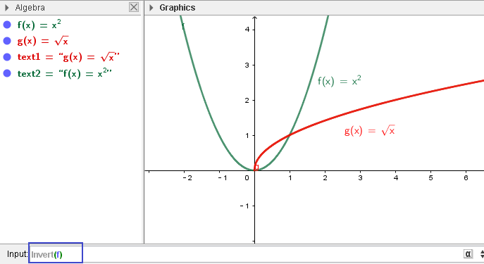
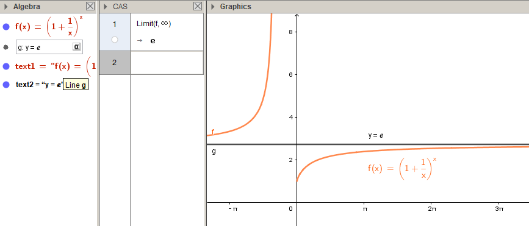
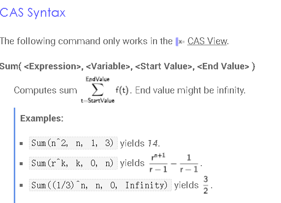
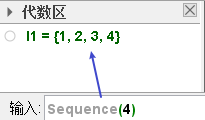
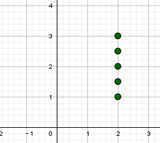
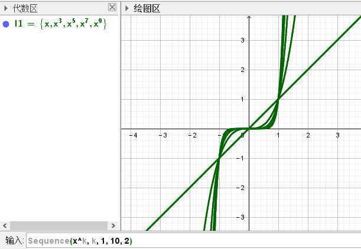

:toc: left
:toclevels: 3
:sectnums:

---

== 在 CAS 中使用变量名 ->  varName:= ...

https://zhuanlan.zhihu.com/p/369962898

---

== 反函数 -> invert(原函数)

---

== 分段函数

用 "if(区间段1, 函数体2, 区间段2, 函数体2)" 语句来输入分段函数.

....
f(x) = If(-π < x < 0, 1 / (1 + cos(x)), x ≥ 0, x ℯ^(-x²))
....

---

== 求极限

要在CAS Calculator 中 输入： Limit(函数, x趋向的值)

---

== 求导数 -> 直接输入 : 函数名' 即可

比如你的函数名叫 f = ..., 则:

- 1次导, 就输入  f'
- 2次导, 就输入  f''
- 3次导, 就输入  f'''

---

== 用Σ累加

官网文档 +
https://wiki.geogebra.org/en/Sum_Command

---

== 斜率场 slope field -> SlopeField( <f(x,y)> )

---

== 序列点 (级数)

官网文档: +
https://wiki.geogebra.org/en/Sequence_Command

[options="autowidth"]
|===
|Header 1 |Header 2

|Sequence(4)
|← 单纯地创建4个点(1,2,3,4), 包装在一个list中.

|2^Sequence(4)
|← creates the list {2, 4, 8, 16}

|Sequence(7,13)
|← creates the list {7, 8, 9, 10, 11, 12, 13}

|7..13
|← 是Sequence(7,13) 语句的更简洁写法

|Sequence((2, k), k, 1, 3, 0.5)
|← 序列点的坐标是(x=2, y=k), k值(即y值)的范围从1到3, 以0.5为步长间隔.

|Sequence(x^k, k, 1, 10, 2)
|← 函数是 stem:[x^k], k的取值范围从1到10, 以2为步长, 即k值就是3,5,7,9, 共四条stem:[x^k]函数曲线.

|===

---
