:toc: left
:toclevels: 3
:sectnums:

---

官方文档 https://wiki.geogebra.org/en/Vector_and_Matrix_Commands

== 矢量,向量

==== 创建矢量 -> 矢量变量名=Vector[点1,点2]

....
v= Vector((-1,2)) //创建一个终点坐标是(-1,2), 起始点为原点 的向量.

u=Vector[A,B]
// 矢量方向是从A到B. 并且, 将这个新建的矢量变量赋给 u.
....

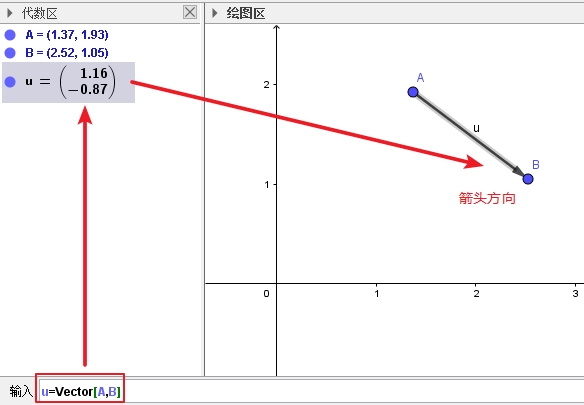

....
又如: 创建一个起点为(1,1)坐标, 终点为(3,4)坐标的向量:
Vector((1, 1), (3, 4))

如果你只执行命令: Vector((3, 2)), 就就是从原点(0,0)出发, 以(3,2)为终点坐标的向量.
....

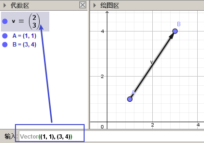

官方文档 https://wiki.geogebra.org/en/Vector_Command

---

==== 创建矢量 -> 矢量变量名=Vector[某点]

....
a=Vector[A]
// 创建原点到 A 点的向量
....

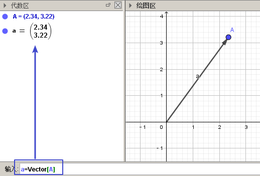

---

==== 自定义"向量的起点坐标"

Vector( <Start Point>, <End Point> )

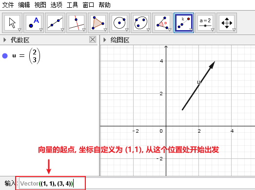

将起点设定为在原点(0,0)上 :

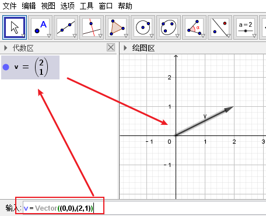

---

== 矩阵

官方文档
https://wiki.geogebra.org/en/Vector_and_Matrix_Commands

=== ★ 重要

==== #把矩阵化为"简化阶梯型" -> ReducedRowEchelonForm()#

使用函数 ReducedRowEchelonForm()

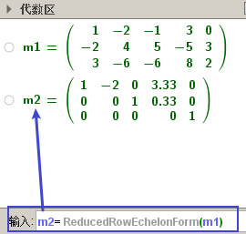

官方文档 https://wiki.geogebra.org/en/ReducedRowEchelonForm_Command

---

==== #将新基矩阵, 应用于一个向量身上, 做变换 -> ApplyMatrix( <Matrix>, <Object> )#

如: 对stem:[\vec{x}], 应用一个M(新基)矩阵, 来做变换. 即: stem:[M\vec{x} = \vec{b}]

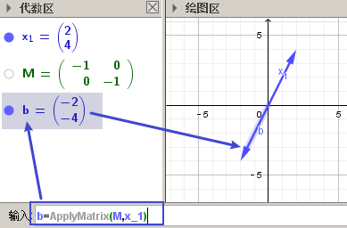

---

==== #获取矩阵的秩 rank -> MatrixRank( <Matrix> )#

....
如, 首先创建一个矩阵A :
A = {{1, 2, 3}, {1, 1, 1}, {2, 2, 2}}

然后使用命令, 获取它的 rank数:
MatrixRank(A)
....

image:img_geogebra/geogebra_77.png[]

---

==== #获取行列式的值 -> Determinant( <Matrix> )#

....
如, 先创建一个矩阵:
A = {{1, 2}, {3, 4}}

再算出它作为行列式的值:
Determinant(A)
....

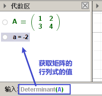

---

=== 其他

说明文档
https://wiki.geogebra.org/s/zh/index.php?title=%E7%9F%A9%E9%99%A3&variant=zh-hans

==== 在"代数区"中输入矩阵

....
用 {{1, 2, 3}, {4, 5, 6}, {7, 8, 9}} 表示一个 3x3 矩阵
....

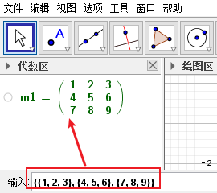

---

==== 在"绘图区"中输入矩阵

在指令列输入:
....
FormulaText({{1, 2, 3}, {4, 5, 6}, {7, 8, 9}})
....
会产生一个 LaTeX 格式的矩阵。 +

或从代数区, 拖曳一个矩阵物件, 放到绘图区。

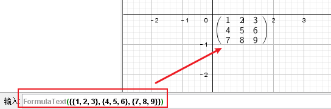

---

==== 两个矩阵相加

sum1 = m1 + m2

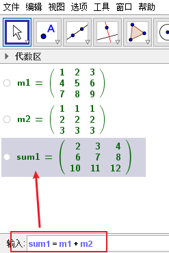

---

==== 两个矩阵相乘

(注意: Matrix1 的行数, 与 Matrix2 的列数必须相等，才能进行矩阵乘法运算。)
....
product_1 = m1 * m2
....

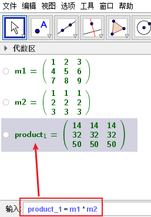

---

==== 矩阵的数乘

将矩阵 Matrix 的每一个元素乘上 Number
....
Matrix * Number
....
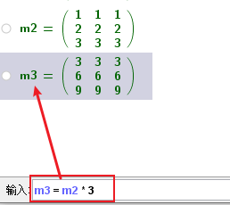

---

==== 单位矩阵 -> Identity( <阶数Number> )

命令:  +
I = Identity[4]

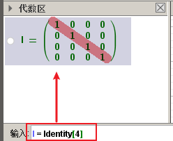

---

==== #逆矩阵 : Invert[某矩阵]#

官方文档说明  https://wiki.geogebra.org/en/Invert_Command

命令: +
A矩阵的逆矩阵 = Invert[A矩阵]  //中括号改成小括号也行

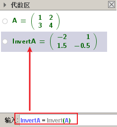

---

==== #将矩阵"转置" -> Transpose(某矩阵)#

....
如: 先创建一个矩阵
A = {{1, 2, 3}, {4, 5, 6}, {7, 8, 9}}

再对A 进行转置:
Transpose(A)
....

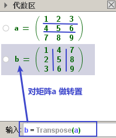

---

==== 获取矩阵中的"某行某列"的元素 -> matrix(i, j)（ i 和 j 为整数）, 会取出矩阵第 i 列第 j 行的元素。

matrix(1, 1) 取出第一列第一行的元素

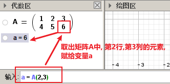

---

==== 获取一个矩阵的"行数"和"列数" -> Dimension( <Object> )

....
如, 先创建一个矩阵:
A= {{1, 2}, {3, 4}, {5, 6}}

再获取它的行列数:
Dimension(A)
....

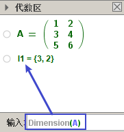

---

==== 获取垂直于某直线的"垂直向量" -> PerpendicularVector( <Line> )

创建垂直于"直线"的向量::
....
如: 先设一条直线, 赋值给 j:
j= Line((1, 4), (5, -3))

然后执行命令:
u = PerpendicularVector(j)
就创建出了垂直于 直线j 的垂直向量 u (从原点出发)
....

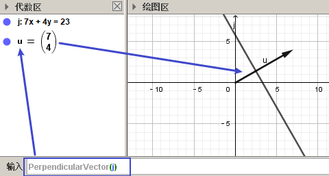

垂直于"线段"的向量::
如:
....
先创建一个线段, 赋值给k:
k = Segment((3, 2), (14, 5))

再执行命令:
PerpendicularVector(k)
创建出一条垂直于k 的向量 (从原点出发)
....

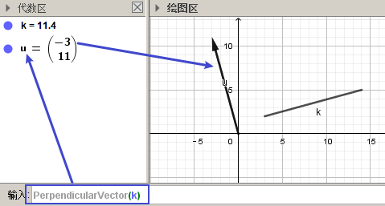

垂直于"某向量"的向量::
....
先创建一个向量u:
u = Vector((-12, 8))

再创建一个垂直于u 的新向量:
PerpendicularVector(u)
....

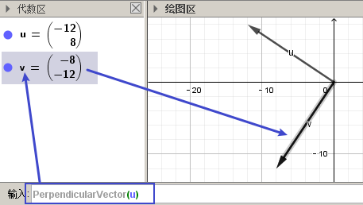

---

==== 创建一个垂直于平面的向量 -> PerpendicularVector(xOyPlane)

....
PerpendicularVector(xOyPlane)
....

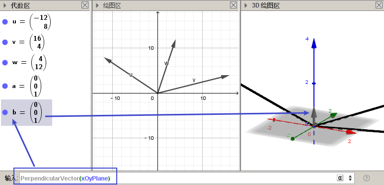

---

==== 创建一个垂直于某向量, 但"模长"只为1的新向量 (即"单位垂直向量") -> UnitPerpendicularVector( <Vector> )

....
如, 首先, 创建一个线段 s :
s = Segment((1,1), (4,5))

然后, 创建一个垂直于s的, 模长为1 的新向量:
UnitPerpendicularVector(s)
....

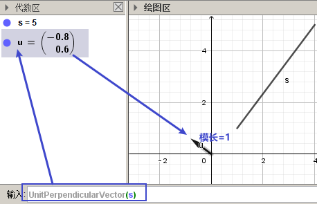

---

==== 创建一个与某向量, 同方向, 但模长为1的新向量 -> UnitVector(v)

....
如, 首先, 创建一个向量v:
v=(3,4)

然后, 创建一个与 v 同方向, 但模长为1 的新向量:
UnitVector(v)
....

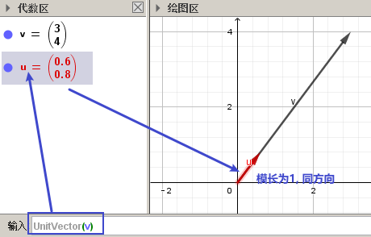

---

== 重要

==== #特征值 Eigenvalues# -> Eigenvalues({{1, 2}, {3, 4}})

https://wiki.geogebra.org/en/Eigenvalues_Command

==== #特征向量 Eigenvectors# -> Eigenvectors({{1, 2}, {3, 4}})

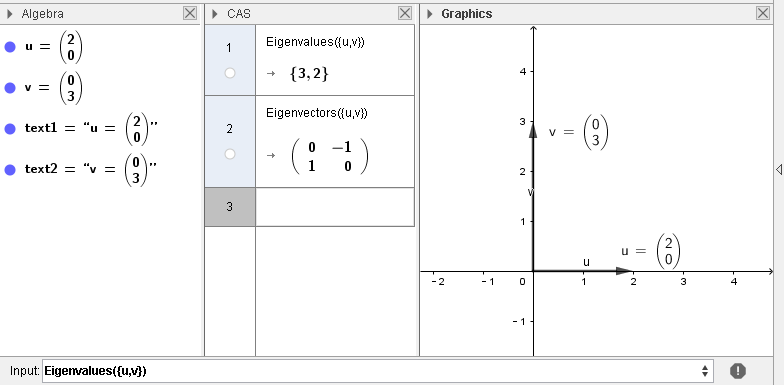

---
