:toc:
:toclevels: 3
:sectnums:

---

官方文档
https://wiki.geogebra.org/en/Text_Commands

== ★ 重要

==== 修改小数点显示的精度位数

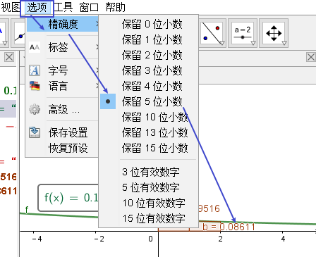

---

==== #将小数显示成"分数"形式 -> FractionText( <Number> )#

....
如, 先创建一个点:
A=(1.33,0.8)

把它显示成分数(文本)形式:
FractionText(A)
....

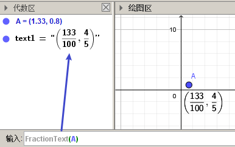

---

==== 使用根号和分数形式, 来表示无理数 -> SurdText( <Number> )

....
SurdText(2.414213562373095)
....

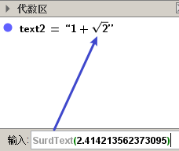

---

== 其他

=== 使用科学计数法 -> ScientificText( <Number> )

....
ScientificText(0.002)
....

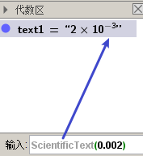

....
ScientificText(e,5)
....

要指定小数点后位数, 可以写在第二个参数中:: ScientificText( <Number>, <Precision> )

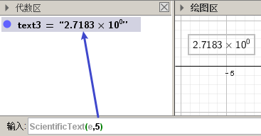

---

=== 创建连分数 -> ContinuedFraction( <Number> )

....
如:
ContinuedFraction(5.45)
....

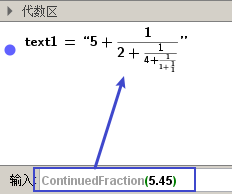

若只想保留3层的话, 可以带上第二个参数::
....
ContinuedFraction(5.45, 3) //连分数只保留3层.
....

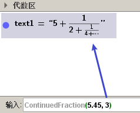

---

=== 旋转文本 -> RotateText( <Text>, <Angle> )

....
RotateText("a = 5", 45°)
....

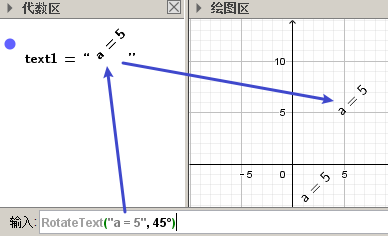

---

=== 表格文本形式 -> TableText( <List>, <List>, ... )

Creates a text that contains a table of the list objects.

....
TableText({x^2, 4}, {x^3, 8}, {x^4, 16})
....

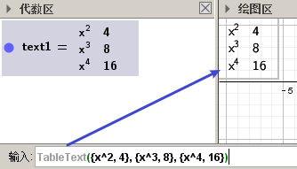

---

==== 把每个list, 竖过来显示 -> TableText( <List>, <List>, ..., "v")

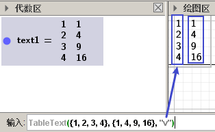

---

==== #把每个list, 竖过来显示, 并右对齐 -> TableText( <List>, <List>, ..., "vr")#

....
TableText({11.2, 123.1, 32423.9, "234.0"}, "vr")
....

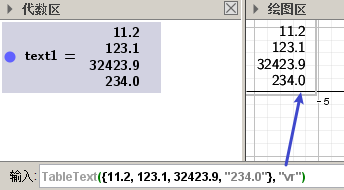

---

==== #把每个list, 竖过来显示, 并按小数点对齐 -> TableText( <List>, <List>, ..., "v.")#

creates a text whose elements are aligned on decimal points.

....
TableText({{2011.56, 2, 3.7, 4}, {1, 4.2, 9, 16.365}}, "v.")
....

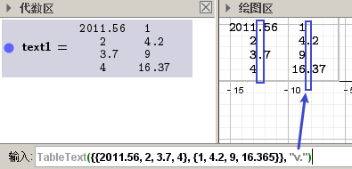

---

==== 把每个list, 竖过来, 以百分比显示, 并按小数点对齐 -> TableText( <List>, <List>, ..., "v%")

creates a text whose elements are converted to a percentage, and aligned on decimal points

....
TableText({{2011.56, 2, 3.7, 4}, {1, 4.2, 9, 16.365}}, "v%")
....

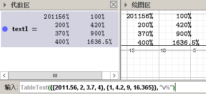

---

==== #显示为"联立公式"形式 -> TableText({{"公式1","公式2"}},"{v")#

....
TableText({{"2x+3y=5","5x+8y=12"}},"{v")
....

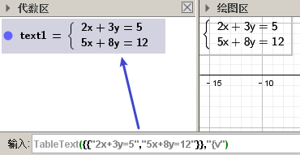

---

==== 其他的 list显示效果, 见官方文档

https://wiki.geogebra.org/en/TableText_Command
