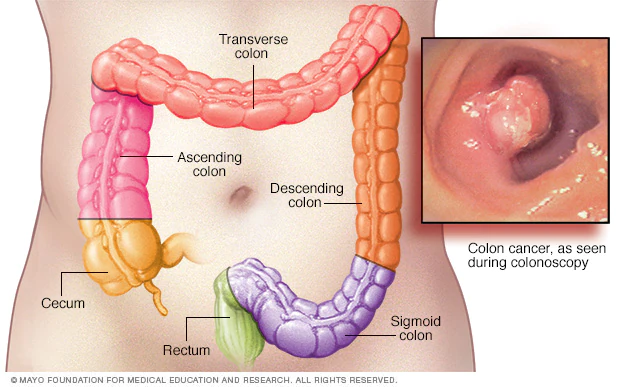
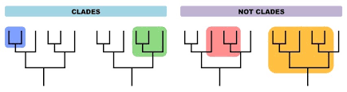
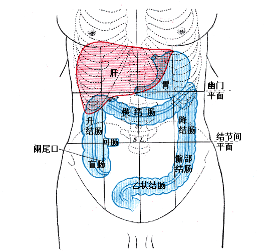

= Colon Cancer 结肠癌 -> 一种口腔细菌(具核梭杆菌)与结肠癌有关
:toc: left
:toclevels: 3
:sectnums:
:stylesheet: ../myAdocCss.css

'''

== Colon Cancer Linked to Mouth Bacteria 结肠癌与口腔细菌有关

A healthy colon 结肠 is _a marvelously 奇迹般地；不可思议地；令人惊讶地 effective organ_ that *squeezes* (v.) nutrients  营养物；养分 and water *out of* food /while pumping out 大量生产（或制造） waste. But sometimes small clumps （尤指树或植物的）丛，簇，束，串；（人的）群，组；（草的）堆；（毛发的）缕 of abnormal cells grow (v.) on the colon’s lining 衬层；内衬；衬里;（身体器官内壁的）膜 and turn into cancer. _Colon cancer_ is relatively common but tricky (a.)难办的；难对付的 to catch; it can only be confirmed with a colonoscopy 结肠镜检查 or surgery.

[.my2]
健康的结肠, 是一个非常有效的器官，可以从食物中挤出营养和水分，同时排出废物。但**有时，小块异常细胞, 会在结肠内壁生长并转化为癌症。#"结肠癌"相对常见，但很难发现。只能通过结肠镜检查或手术来确认。#**

[.my1]
.案例
====
.colon

====

*Pinning down* _colon cancer_’s genetic 基因的；遗传学的 or environmental causes /`谓` has been a complex and long-running quest 探索，寻找，追求（幸福等）, but a new study in Nature /points to a promising clue: a bacterium 后定 typically found in the human mouth. The study found that /a specific subtype, or clade 分化枝；进化枝, within a subspecies [生物] 亚种 of _Fusobacterium nucleatum_  梭形杆菌 was linked to _colon cancer_ growth and progression.

[.my2]
确定"结肠癌"的遗传或环境原因, 是一项复杂而长期的探索，但《自然》杂志上的一项新研究指出了一条有希望的线索：##一种通常在人类口腔中发现的细菌。##研究发现，#"具核梭杆菌"亚种内的"特定亚型"或"进化枝", 与结肠癌的生长和进展有关。#

[.my1]
.案例
====
.clade

.Fusobacterium nucleatum
核形杆菌：一种常见的细菌，存在于人体口腔、肠道和生殖道等部位，与多种疾病有关。

====

A decade ago scientists discovered that /the bacterium 细菌 was also found in _colon cancer_ more often than in normal colon tissue 结肠组织. "This was particularly interesting /because this microbe in noncancerous 非癌的 individuals is usually not present (v.) below the mouth."

[.my2]
**"具核梭杆菌"与"牙菌斑"和"牙龈炎"相关，自然存在于口腔微生物组中。**十年前，科学家发现**这种细菌在"结肠癌"中的出现频率, 高于正常结肠组织。**“这特别有趣，因为非癌症个体中的这种微生物通常不存在于口腔下方。”

The team first analyzed the genomes 基因组；染色体组 of _F. nucleatum_ found in colon tumors /in order to *compare* them *with* those found in the mouth. It collected colon tumors 结肠肿瘤 from approximately 100 people /and then broke up the tumors and placed them on _agar 琼脂（一种植物胶） plates_ /to allow the microbes present (a.)（人）在场的，出席的 to grow.

[.my2]
研究小组首先分析了结肠肿瘤中发现的具核梭杆菌的基因组，以便将它们与口腔中发现的基因组进行比较。它收集了大约 100 人的结肠肿瘤，然后将肿瘤打碎，并将其放置在"琼脂平板"上，让其中的微生物生长。

[.my1]
.案例
====
.genome
( biology 生) the complete set of genes in a cell or living thing 基因组；染色体组 +

.agar plate
琼脂平板：一种通常是无菌的培养皿，内部填充了经过准备的含有营养物质的"琼脂固体培养基"。在这种培养基上，可以将细菌扩增并进行研究。 +

====

After *isolating* (v.)（使）隔离，孤立，脱离 the F. nucleatum *from* these cultures 培养物；培养细胞；培养菌；（为医疗、科研或食品生产而作细胞或细菌的）培养, the scientists performed (v.) a process called _long-read sequencing_ 长读长测序 to get a comprehensive 综合性的，全面的 look at the bacterium’s genome.

[.my2]
从这些培养物中分离出具核梭杆菌后，科学家们进行了一种称为"长读长测序"的过程，以全面了解该细菌的基因组。

[.my1]
.案例
====
.long-read sequencing
long-read sequencing，LRS 长读长测序.
====

The team *compared* these sequences from the colon cancer tissues *with* those of F. nucleatum from the mouth of healthy individuals. This revealed 揭示；显示；透露 two main clades within a subspecies (called F. nucleatum animalis) that were distinguished (v.)区分；辨别；分清 by differences in _DNA bases_ 碱 and patterns of _encoded proteins_ 编码蛋白质. Bacteria in the two clades /also had distinct appearances under the microscope: specimens 样品；样本；标本 in the second clade /were longer and thinner than those from the first.

[.my2]
**研究小组将来自"结肠癌组织"的这些序列, 与来自健康个体口腔的"具核梭菌"的序列, 进行了比较。这揭示了一个亚种（称为动物具核梭菌）内的两个主要进化枝，**它们通过 DNA 碱基, 和编码蛋白质模式的差异, 进行区分。这两个进化枝中的细菌, 在显微镜下也有不同的外观：第二个进化枝中的样本, 比第一个进化枝中的样本, 更长更薄。

[.my1]
.案例
====
.base
[ C] a chemical substance, for example an alkali , that can combine with an acid to form a salt 碱
====

F.nucleatum animalis from the colon tumors /fell (v.)属于（某类、群体、责任范围） overwhelmingly into the second clade. This clade’s genomes /`谓` seemed to code (v.) for characteristics 后定 that would help the bacteria survive (v.) the perilous journey from the mouth to the intestine 肠 —such as the ability to gain nutrients in hostile environments (such as an inflamed gastrointestinal 胃肠的 tract) or to better invade (v.) cells. These microbes also have “one of the most potent acid-resistant systems” found in bacteria, which lets them tolerate (v.) the stomach’s acidic environment.

[.my2]
**来自"结肠肿瘤"的"具核梭菌"绝大多数落入第二分支。这个分支的基因组似乎编码了一些特征，这些特征可以帮助细菌在"从口腔到肠道"的危险旅程中, 生存下来，**例如在恶劣环境（例如发炎的胃肠道）中, 获取营养, 或更好地侵入细胞的能力。*这些微生物还具有细菌中发现的“最有效的耐酸系统之一”，这使它们能够耐受胃的酸性环境。*

The findings suggested that /the microbes in the second clade were more strongly associated with colon cancer, leading the researchers to explore (v.) further /how these microbes interacted (v.)相互作用 with the intestine 肠 in a mouse model. They gave one group of mice a single oral (a.)用口的；口腔的；口服的 dose of F. nucleatum animalis from clade 1 /and another a dose of clade 2 /and then counted (v.) the number of tumors that formed. Mice in the clade 2 group /developed a significantly higher number of large _intestinal tumors_ *in comparison with* 与……比较，同……比较起来 those given clade 1 bacteria or a nonbacterial control.

[.my2]
**研究结果表明，第二个分支中的微生物, 与"结肠癌"的相关性更强，**这促使研究人员进一步探索, 这些微生物如何在小鼠模型中, 与"肠道"相互作用。他们给一组小鼠口服单剂量的来自进化枝 1 的具核梭菌，另一组小鼠口服剂量的进化枝 2，然后计算形成的肿瘤数量。与接受进化枝 1 细菌或非细菌对照的小鼠相比，进化枝 2 组的小鼠出现大肠肿瘤的数量, 明显增多。

When the scientists measured (v.) _metabolic 新陈代谢的 molecules inside tumors_ from the mice with clade 2 bacteria, they found #more# molecules 后定 *associated with* 与……有关 _cellular 细胞的；由细胞组成的 damage_ from _oxidative 氧化的 stress_, cancer cell division and inflammation #than# mice in the control and clade 1 bacteria groups. “This supports (v.) the idea /that clade 2 bacteria *are contributing to* this proinflammatory 促炎的, pro-oncogenic 促进致瘤的 environment,” Zepeda-Rivera says.

[.my2]
当科学家们测量携带进化枝 2 细菌的小鼠肿瘤内的代谢分子时，他们发现，与对照组和进化枝 1 细菌组的小鼠相比，与"氧化应激"、"癌细胞分裂", 和"炎症"造成的细胞损伤相关的分子更多。 Zepeda-Rivera 说：“这支持了这样的观点，即进化枝 2 细菌, 对这种促炎、促癌环境做出了贡献。”

though 虽然，尽管；可是，不过, that more evidence from a larger group of people with colon cancer /is needed, as well as more research /to see how exactly the bacteria might *contribute to* inflammation and cancer progression.

[.my2]
需要更多来自更多"结肠癌"患者的证据，以及更多研究来了解细菌到底如何促进"炎症"和"癌症"进展。

The study’s findings /might also help (v.) in the search for a low-cost, noninvasive 非侵袭的；非侵害的 strategy to identify (v.) people at higher risk for colon cancer.  “We need an approach that enables us *to zero (v.) in on* 集中全部注意力于,（用枪炮等）瞄准 people with higher risk.”  A test could be developed *to simply screen (v.)筛查；检查 for* the presence of this bacteria 方式状 with _a mouth swab_ (n.)（医用的）拭子，药签 or _stool 大便；粪便 sample_; clade 2 bacteria were found to be more prevalent (a.)盛行的，普遍的 in _fecal 排泄物的 samples_ from those with colon cancer, too.

[.my2]
这项研究的结果, 也可能**有助于寻找一种低成本、无创的策略, 来识别结肠癌高危人群。** “我们需要一种方法，使我们能够将风险较高的人归零，”**可以开发一种测试，通过口腔拭子或粪便样本, 来简单地筛查这种细菌的存在。**研究还发现，2 分支细菌在结肠癌患者的粪便样本中也更为普遍。

[.my1]
.案例
====
.zero
*zero (v.) ˈin on sb/sth* +
(1) to fix all your attention on the person or thing mentioned 集中全部注意力于 +
- They *zeroed in on* the key issues.他们集中讨论了关键问题。 +
(2) to aim guns, etc. at the person or thing mentioned （用枪炮等）瞄准

.screen
[ often passive] (v.)*~ (sb) (for sth)* : to examine people in order to find out if they have a particular disease or illness 筛查；检查 +
- Men over 55 should be regularly screened (v.) for prostate cancer. 55岁以上的男性应定期做前列腺癌检查。

.swab
(n.)
1.a piece of soft material used by a doctor, nurse, etc. for cleaning wounds or taking a sample from sb's body for testing（医用的）拭子，药签 +
2.an act of taking a sample from sb's body, with a swab 用拭子对（人体）化验标本的采集 +

-> 缩写自 swabber,拖把，尤指清扫甲板的拖把，来自荷兰语 zwabber,来自 Proto-Germanic*swabb, 拖，可能来自拟声词，模仿拖地的声音。后用于指医用的拭子，药签，且成为主要词义。 +

====

'''

== (pure) Colon Cancer Linked to Mouth Bacteria

A healthy colon is a marvelously effective organ that squeezes nutrients and water out of food while pumping out waste. But sometimes small clumps of abnormal cells grow on the colon’s lining and turn into cancer. Colon cancer is relatively common but tricky to catch; it can only be confirmed with a colonoscopy or surgery.

Pinning down colon cancer’s genetic or environmental causes has been a complex and long-running quest, but a new study in Nature points to a promising clue: a bacterium typically found in the human mouth. The study found that a specific subtype, or clade, within a subspecies of Fusobacterium nucleatum was linked to colon cancer growth and progression.

A decade ago scientists discovered that the bacterium was also found in colon cancer more often than in normal colon tissue. "This was particularly interesting because this microbe in noncancerous individuals is usually not present below the mouth."

The team first analyzed the genomes of F. nucleatum found in colon tumors in order to compare them with those found in the mouth. It collected colon tumors from approximately 100 people and then broke up the tumors and placed them on agar plates to allow the microbes present to grow.

After isolating the F. nucleatum from these cultures, the scientists performed a process called long-read sequencing to get a comprehensive look at the bacterium’s genome.

The team compared these sequences from the colon cancer tissues with those of F. nucleatum from the mouth of healthy individuals. This revealed two main clades within a subspecies (called F. nucleatum animalis) that were distinguished by differences in DNA bases and patterns of encoded proteins. Bacteria in the two clades also had distinct appearances under the microscope: specimens in the second clade were longer and thinner than those from the first.

F.nucleatum animalis from the colon tumors fell overwhelmingly into the second clade. This clade’s genomes seemed to code for characteristics that would help the bacteria survive the perilous journey from the mouth to the intestine—such as the ability to gain nutrients in hostile environments (such as an inflamed gastrointestinal tract) or to better invade cells. These microbes also have “one of the most potent acid-resistant systems” found in bacteria, which lets them tolerate the stomach’s acidic environment.

The findings suggested that the microbes in the second clade were more strongly associated with colon cancer, leading the researchers to explore further how these microbes interacted with the intestine in a mouse model. They gave one group of mice a single oral dose of F. nucleatum animalis from clade 1 and another a dose of clade 2 and then counted the number of tumors that formed. Mice in the clade 2 group developed a significantly higher number of large intestinal tumors in comparison with those given clade 1 bacteria or a nonbacterial control.

When the scientists measured metabolic molecules inside tumors from the mice with clade 2 bacteria, they found more molecules associated with cellular damage from oxidative stress, cancer cell division and inflammation than mice in the control and clade 1 bacteria groups. “This supports the idea that clade 2 bacteria are contributing to this proinflammatory, pro-oncogenic environment,” Zepeda-Rivera says.

though, that more evidence from a larger group of people with colon cancer is needed, as well as more research to see how exactly the bacteria might contribute to inflammation and cancer progression.

The study’s findings might also help in the search for a low-cost, noninvasive strategy to identify people at higher risk for colon cancer.  “We need an approach that enables us to zero in on people with higher risk.”  A test could be developed to simply screen for the presence of this bacteria with a mouth swab or stool sample; clade 2 bacteria were found to be more prevalent in fecal samples from those with colon cancer, too.

'''

== colon 结肠

colon: ( anatomy 解) the main part of the large intestine (= part of the bowels )结肠 +

结肠，中国古称回肠，是大多数脊椎动物**消化系统的最后一部分，**在将固体废物排出体外前吸收水和盐。 +
*按《格雷氏解剖学》定义，人体"结肠"并不等同"大肠"；但许多书籍与学者将之视为同义词*，且将"盲肠"视为"升结肠"的一部分.

**结肠（colon）是介于"盲肠"与"直肠"之间的一段大肠，**结肠在右髂窝内续于盲肠，在第3骶椎平面连接直肠。结肠分升结肠、横结肠、降结肠和乙状结肠4部，大部分固定于腹后壁. +
**结肠的排列酷似英文字母“M”，将小肠包围在内。**结肠的直径自其起端6cm，逐渐递减为乙状结肠末端的2.5cm，这是结肠肠腔最狭细的部位。

[.small]
[options="autowidth" cols="1a,1a"]
|===
|Header 1 |Header 2

|
| +
1.升结肠 2.横结肠 3.降结肠 4.乙状结肠 5.直肠
|===

在不同的生物体之间的"结肠"的功能, 有差异。结肠主要是负责储存废物，回收水，保持水分平衡，吸收一些维生素，如维生素K，并提供辅助菌群发酵的位置。

*食糜达到"结肠"的时候，大部分的营养物质和90％的水, 已经被人体吸收。在这时，剩下的是一些电解质如钠，镁，氯, 以及摄入食物中不能消化的部分*（例如，摄入的直链淀粉的很大一部分，迄今尚未消化的蛋白质，以及主要是可溶性或不溶性的碳水化合物的膳食纤维）。

由于通过大肠的肌肉移动食糜，剩余的水大部分被吸收，而食糜混有粘液和细菌（称为肠道菌群），成为粪便。**当粪便进入"升结肠"时尚算是液体。**结肠肌肉将含水量高的粪便向前移动，**并慢慢地吸收所有多余的水分。当粪便进入"降结肠"时已成为半固态。**其中细菌分解食物纤维为自己的养料，产生醋酸，丙酸和丁酸等副产品，这又是滋养结肠内壁细胞的养份。**蛋白质无法在此消化。**

**大肠不产生消化酶 - 化学性消化是食糜到达大肠前, 在"小肠"完成。**

*结肠的pH值在5.5和7之间（微酸性至中性）。*

其他动物，包括猿和其他灵长类动物, 有比例较大的结肠，使它们能从植物材料得到更多的养分，所以它们饮食中植物材料比例, 能够比人类高。

'''

== Colorectal cancer 大肠直肠癌

局限在肠壁的"大肠直肠癌"可能借由手术治愈，然而当癌症已扩散或转移时则不然，此时则以改善生活品质, 及症状为治疗目标。*在美国，五年存活率约65%.*

75~95%的大肠癌发病人群没有或少见遗传因素。**其他危险因素包括: **年龄增大、男性、**“脂肪”高摄入量（high intake of fat）、酒精或红肉、 加工肉品、肥胖、吸烟和缺乏体能锻炼。大约10%的病例与缺乏运动有关。**饮酒的危害在超过每天一杯后逐步提升。

**结肠癌在早期并无明显症状，直到发病中晚期发现为止，**许多组织建议定期筛检疾病，目前检查直肠癌的方式是利用粪便潜血筛检和结肠镜检查。其症状有：

- 改变排便习惯 +
- 便血或直肠出血 +
- 大便有黏液 +
- 感觉排便功能不全 +

==== 分期

**医学界对癌症进行分期（分级）的目的, 主要是有利于指导临床治疗决策, 以及预测病人的预后，**对结肠癌分期也是一样。分期大致有3大方法：

[.small]
[options="autowidth" cols="1a,1a"]
|===
|Header 1 |Header 2

|美国联合癌症委员会（AJCC）大肠直肠癌的分期法
|- 0期：*原位癌，没有局部淋巴结之转移，没有远处转移。*
- I 期：**肿瘤侵犯到黏膜下层或肌肉层，**没有局部淋巴结之转移，没有远处转移。
- II 期：**肿瘤侵犯穿透肌肉层, 至浆膜层或无腹膜覆盖之大肠及直肠周围组织，**没有局部淋巴结之转移，没有远处转移。
- III 期：**肿瘤直接侵犯至其他器官，有局部淋巴结之转移，**但没有远处转移。
- IV 期：*肿瘤直接侵犯至其他器官，有局部淋巴结之转移和远处转移。*

|Dukes分期法
|于1932年，由病理学家Cuthbert Dukes所提出，以英文字母ABCD分别取代以罗马数字I至IV来代表第一至第四期。

- A期是表示癌症局限在肠道本身。 +
- B期表示侵犯至肠道外的脂肪组织, 未有其它转移。 +
- C期表示有了淋巴结转移，且不论肿瘤是否以穿出肠道。 +
- D则代表有了远处器官转移。 +

|Astler-Coller分期法
|于1954年提出，根据Dukes分期法将B、C两期再作进一步细分。

- B1指肿瘤局限于固有层肌肉内侧。
- B2是指肿瘤侵犯至肠壁周边的脂肪组织。
- C1是有了淋巴结转移，旦未侵犯肠壁外的脂肪组织。
- C2则是肿瘤有淋巴转移, 而且合并侵犯到周边的脂肪组织。
|===

'''

