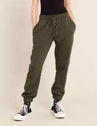

= Dark Triad 黑暗三性格
:toc: left
:toclevels: 3
:sectnums:
:stylesheet: ../myAdocCss.css

'''

== 为什么坏男孩更吸引人?

In fact, people with dark personalities 性格 may look hotter /when they try harder than do those with more stable character traits 特性.

Scientists gave personality 性格 tests to more than 100 subjects 接受试验者；实验对象 /to rate (v.) them for what's called Dark Triad 黑暗三性格 trait （人的个性的）特征，特性，特点 — that's Machiavellianism (adj.)马基雅弗利的,权谋术的,不择手段的, narcissism(n.)自恋 and psychopathy (n.)心理变态. They then took different photographs of each subject.

One was a so-called “adorned 被修饰的 condition” where the participants were turned out 出席 /clothed 穿着…衣服的 and styled  把…设计（或缝制、做）成某种式.
In the “unadorned 未经装饰的 condition” they were presented 出席 *as neutrally (adv.)保持中立 as possible*: their hair was pulled back 拉回, 撤出, they changed into 换上衣服,(使)变为 grey _sweat 汗 pants_ 长运动裤；绒裤 and _tee shirts_, and they wore (v.) no makeup 化妆品 or other adornments 装饰物. And they maintained neutral 中性的 facial 脸上的 expressions 面部表情.

[.my1]
.案例
====
.sweat pant

====

The pictures were then shown to volunteers. who rated them for attractiveness 吸引力. And the people who exhibited 展现出 the Dark Triad traits /were rated (v.) as significantly 显著地 more attractive in the adorned 被修饰的,装饰 state *than* in their unadorned state. But the subjects who did not have dark traits /did not get an attractiveness boost 增强 from getting dressed up 打扮 and coiffed 做过头发的,做成某种发型. The study is the journal Social Psychological Personality and Science.

[.my2]
如果一个人性格中具有黑暗的一面，那么他看起来可能比性格更稳定的人更性感。 +
科学家们对100名受试者进行了性格测试，以评估他们的黑暗性格，即权谋主义、自恋和精神病态。然后为每位受试者拍不同的两组照片。一组是所谓的“装酷”，参与者穿衣时尚，显得很有个性。在“条件朴素”这一组，他们尽可能显得中性：头发被拉回原样，换上了灰色长运动裤和T恤，不化妆，也不戴任何饰品，就连面部表情也显得很中性化。 +
之后将这些照片拿给志愿者看，让他们评价这些人的魅力指数。结果志愿者普遍认为，具有黑暗性格的人在“装酷”的时候更有魅力。而那些不具有黑暗性格的人即使盛装打扮，烫染了头发也并不显得有魅力。这项研究发表在《社会心理和人格科学》杂志上。

[.my1]
.标题
====
.Triad
[ˈtraɪ-æd] n.三个一组;三件一套;三位一体

.dark triad
黑暗三性格：自我中心(自恋者)、热爱冒险刺激且心狠手辣(心理变态者)、善于撒谎喜将人玩弄于股掌(权谋者)。 +
美国新墨西哥州立大学强纳森教授主持研究针对两百名大学生的三种坏男人特质做了深入人格测验。结果显示，黑暗性格分数越高的男子，女人缘越好，且偏爱短暂的露水关系。 +
伊利诺伊州布拉德雷大学进行的另一个研究，对象扩及57国、35000人，也发现坏男人较能赢得女性青睐。研究主持人史密特教授说：“黑暗性格分数越高的男人，越会逢场作戏、短暂谈爱，放诸四海皆然，不受文化或国家限制。”

.narcissism
/ˈnɑːr-sɪsɪ-zəm/ +
-> 来自古希腊神话，英俊青年Narcissus拒绝了神界第一美女Echo的爱，却爱上了自己在水中的倒影，不幸溺水而死，后用于心理学名词，自恋，孤芳自赏。

.psychopathy
/saɪˈkɑːpəθɪ/ +
-> psycho- +‎ -pathy.

.coiffed
（coif 的过去式和过去分词）

.coif
[kɔɪf] n. 盖以头巾，戴紧帽 +
v. 戴紧帽；覆以头巾；梳理；给……做发型 +
image:../img/coif.jpg[,10%]
====

'''

== <pure> 为什么坏男孩更吸引人?

In fact, people with dark personalities may look hotter when they try harder than do those with more stable character traits.

Scientists gave personality tests to more than 100 subjects to rate them for what's called Dark Triad trait — that's Machiavellianism, narcissism and psychopathy. They then took different photographs of each subject.

One was a so-called “adorned condition” where the participants were turned out clothed and styled.
In the “unadorned condition” they were presented [as neutrally as possible]: their hair was pulled back, they changed into grey sweat pants and tee shirts, and they wore no makeup or other adornments. And they maintained neutral facial expressions.

The pictures were then shown to volunteers who rated them for attractiveness. And the people who exhibited the Dark Triad traits were rated as significantly more attractive in the adorned state than in their unadorned state. But the subjects who did not have dark traits did not get an attractiveness boost from getting dressed up and coiffed. The study is the journal Social Psychological Personality and Science.

'''
