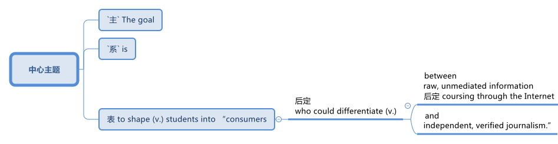
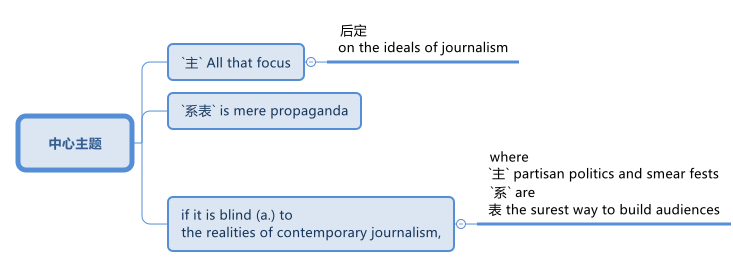

= ★ 如何教育孩子辨别'虚假信息'和'阴谋论'?
:toc: left
:toclevels: 3
:stylesheet: ../myAdocCss.css

'''

== Schoolkids Are Falling (v.) Victim to Disinformation （尤指政府机构故意发布的）虚假信息，假消息 and Conspiracy 阴谋论 Fantasies 梦想，幻想. 小学生正在成为虚假信息和阴谋幻想的受害者

...Yet some children insisted that these conspiracy 阴谋论 fantasies 幻想 were true. *Both* misinformation 虚假消息, which includes _honest mistakes_ 无心之过, *and* disinformation, which involves an intention 意图，目的 to mislead 误导，将……引入歧途, have had “a growing impact on students over the past 10 to 20 years,”

[.my1]
.标题
====

一些孩子坚持认为这些阴谋幻想是真实的。加德纳说，包括无心错误在内的错误信息, 和涉及误导意图的虚假信息“, 在过去 10 到 20 年里对学生的影响越来越大”.
====

Children, it turns out, are _ripe 时机成熟的；适宜的 targets_ for fake news. Age 14 *is* [when kids often start] *believing in* unproven conspiratorial 阴谋的；阴谋者的 ideas, according to a study published in September 2021 in the British Journal of Developmental Psychology. Many teens also have trouble (n.) 伴随状 assessing (v.)评价，评估 the credibility 可靠性，可信度 of online information.

In a 2016 study involving nearly 8,000 U.S. students, Stanford University researchers found that more than 80 percent of middle schoolers believed that `主` an advertisement *labeled as* sponsored 赞助,资助 content `系`  was actually a news story. The researchers also found that less than 20 percent of high schoolers seriously questioned (v.) spurious (a.)虚假的；伪造的 claims (n.)声明；宣称；断言 in social media.

When college students in the survey looked at _a Twitter post_ touting (v.) 兜售；推销;标榜；吹捧；吹嘘 a poll 民意调查，民意测验 favoring (v.) gun control, more than two thirds failed to note that `主` _the liberal antigun groups_ behind the poll `谓` could have influenced the data.

[.my2]
====

事实证明，#儿童是假新闻的成熟目标(理想目标)#。根据 2021 年 9 月发表在《英国发展心理学杂志》上的一项研究，##孩子们在 14 岁时往往开始相信未经证实的阴谋论。##许多青少年也难以评估在线信息的可信度。斯坦福大学研究人员在 2016 年对近 8,000 名美国学生进行的一项研究中发现，超过 80% 的中学生认为标记为赞助内容的广告实际上是新闻报道。研究人员还发现，只有不到 20% 的高中生认真质疑社交媒体上的虚假说法.

当参与调查的大学生查看推特上宣传支持枪支管制的民意调查的帖子时，超过三分之二的人没有注意到, 民意调查背后的"自由派反枪支团体"可能影响了数据。
====

Certain curricula 课程(curriculum 的复数形式) try to train (v.) students *to give more weight to* journalistic 新闻业的；新闻工作（者）的 sources, but some researchers argue (v.) that this practice ignores (v.) the potential biases (n.)偏见 of publications and reporters.  +
Other courses push (v.) students to identify (v.) where information comes from /and ask (v.) how the content helps (v.) those disseminating (v.)散布，传播（信息、知识等） it.  +
Overall 全部地；总的说来 there are very few data showing the best way to teach (v.) children how to tell (v.) 识别；分辨；区分；辨认 fact from fiction 虚构的事，谎言.

[.my2]
某些课程试图训练学生更加重视新闻来源，但一些研究人员认为，这种做法忽视了出版物和记者的潜在偏见。其他课程促使学生确定信息的来源，并询问内容如何帮助传播者。#总的来说，很少有数据显示, 怎样才是"教孩子分辨事实与虚构"的最佳方法。#

[.my1]
.标题
====
.tell  ~ A from B( not used in the progressive tenses or in the passive 不用于进行时或被动语态 ) to distinguish one thing or person from another 识别；分辨；区分；辨认 +
[ VN] +
•It was hard to tell the difference between the two versions. 很难分辨出这两个版本有什么区别。

====

Children are _ripe targets_ for fake news. Age 14 is [when kids often start] *believing in* unproven conspiratorial ideas, according to a 2021 study.

[.my2]
====

儿童是假新闻的成熟目标。根据 2021 年的一项研究，孩子们在 14 岁时往往开始相信未经证实的阴谋论。
====

`主` Most _media literacy ((n.)读写能力)媒体素养 approaches_ 方法 `谓` “begin (v.) to look (v.) thin  薄的；细的 /_when you ask, ‘Can you show me the evidence?’_”. ... and “each group *goes out of its way* 特地；格外努力 to diss  (v.)看不起，作践（尤指用侮辱性言辞） the other.” These approaches have not *been compared* (v.) head-to-head (n.a.)白刃战；正面交锋的；面对面的, and some have only small studies supporting them. Like online media sources themselves, it is hard to know which ones to trust.

[.my2]
当你要求提供证据时，大多数媒体素养的方法‘看起来就显得很薄弱’…… ##而且‘每个团体都会极力贬低其他团体’。这些方法尚未进行直接比较，有些方法只有小型研究支持。##就像在线媒体来源本身一样，很难知道哪些值得信任。

[.my1]
.标题
====
.Media Literacy 媒介素养
媒体素养就是一个人认识、评判、运用传媒的态度与能力，是指人们面对传媒各种信息时的选择能力、理解能力、质疑能力、评估能力、创造能力、制造能力、思辨性反应能力等。

.dis
(v.) ( diss ) ( informal ) [ VN] ( especially NAmE ) to show a lack of respect for sb, especially by saying insulting things to them 看不起，作践（尤指用侮辱性言辞）

====

News literacy is a subset 子集 of _media literacy 媒体素养 research_ that deals (v.) 对付；应付；解决；处理 directly with ① _the propagation （观点、理论等的）传播 of conspiracies_ (n.)密谋策划；阴谋;阴谋论 and ② _the ability_ *to distinguish* (v.)区分；辨别；分清 real news *from* fake stories.  +
It entails (v.)牵涉；需要；使必要 a set of skills that help people judge (v.) _the reliability (为人很可靠)可依靠性，可靠性 and credibility_ 可信任性(可相信他的话是真的)  of news and information.  +
But as with 正如；与……一样 media literacy, researchers have very different ideas about how _this type of news analysis_ should be taught (v.).

[.my2]
##新闻素养, 是"媒体素养研究"的一个子集，直接涉及阴谋的传播, 以及区分"真实新闻"和"虚假故事"的能力。它需要一套技能, 来帮助人们判断新闻和信息的"可靠性"和"可信度"。##但与媒体素养一样，研究人员对于如何教授此类新闻分析, 有着截然不同的想法。

[.my1]
.标题
====
.Reliable：
-consistently good in quality or performance +
- able to be trusted +
- a person or thing with trustworthy qualities +

.Credible： 
-able to be believed +
- convincing +
- capable of persuading people that something will happen or be successful

可信任(credible)的人不一定是能依靠的(reliable)。一个穷光蛋再值得信任在物质上也不可能是能依靠的. +
能依靠的人也不一定永远是可信的。父母是我们永远的依靠，但有时候为了爱会有美丽的谎言.

.credibility
N-UNCOUNT If someone or something has credibility, people believe in them and trust them. 可信性 +
- The police have lost their credibility.
 警察已经失去了他们的可信性。

====

Some programs, teach (v.) students to discern (v.)觉察出；识别；了解;（依稀）看出，分辨出，听出 _the quality of the information_ in part by learning how _responsible (a.)（对某人、某事）负责的 journalism_ works (v.).  +
They study ① how journalists pursue (v.)追逐；跟踪;追求；致力于 news, ② how to distinguish (v.)区分；辨别；分清 between different kinds of information / ③ and how to judge (v.) evidence behind reported stories.

The goal is to shape (v.) students into “consumers 消费者 who could differentiate (v.)区分；区别；辨别 #between# _raw, unmediated (a.)无中介的；未经调停的 information_ *coursing (v.)快速地流动；奔流 through* the Internet #and# _independent  独立的；自主的；自治的, verified (a.)已查清的；已证实的 journalism_ 新闻业；新闻工作.”

[.my1]
.标题
====

一些项目，部分通过学习"什么是负责任的新闻工作方式", 来教会学生辨别信息的质量。他们研究了记者如何追踪新闻、如何区分不同类型的信息, 以及##如何判断报道背后的证据。##目标是将学生塑造成"消费者“ -- #能够区分通过互联网传播中的'原始、未经中介的信息'(未经处理,即未经过验证的, 可能是错误的信息或谎言) 和'独立、经过验证的新闻'(即已经被验证过真伪的信息)。#
====

Yet some _media literacy_ scholars  `谓`  doubt (v.) the efficacy 功效，效力 of these approaches.  +
Hobbs, for instance, wrote a 2010 paper arguing that these methods glorify (v.)吹捧；吹嘘；美化 journalism, ignore (v.) its many problems and do (v.) little to instill (v.)徐徐滴入；逐渐灌输 critical thinking 批判性思维 skills.  +

“`主` All that focus (n.) on the ideals 理想 of journalism `系`  is mere propaganda  (n.)宣传；鼓吹 if it is blind (a.) to the realities of _contemporary 当代的；现代的 journalism_, where `主` _partisan （对某个人、团体或思想）过分支持的，偏护的，盲目拥护的 politics_ and _smear (v.)弄脏；弄上油污, 诽谤；诋毁 fests_ 盛会;活动、盛宴、节日  `系`  are _the surest (a.)最确信的；最确实的；最一定的（sure 的最高级） way_ to build audiences,” she stated (v.)陈述，说明.

[.my2]
然而，一些媒体素养学者怀疑这些方法的有效性。例如，霍布斯 (Hobbs) 在 2010 年写了一篇论文，认为这些方法美化了新闻业，却忽视了它的许多问题，并且对培养批判性思维技能几乎没有帮助。 “如果对当代新闻业的"现实"视而不见，那么所有关注"新闻业理想"的言论都只是宣传，#在当代新闻业，党派政治和诽谤是建立受众的最可靠方式#，”她说。

[.my1]
.标题
====
.Smear fests (Google中似乎搜索不到这个词)
chat GPT 的解释: "Smear fests" refers to events or situations in journalism where there is a deliberate and concerted effort to spread false or damaging information about someone or something, usually for the purpose of discrediting them or tarnishing their reputation. It implies a sensationalized and often unethical approach to journalism, where the focus is on creating scandalous stories rather than reporting accurate and balanced information.

“Smear fests” 是一个具有贬义的表达，指的是以中伤、诽谤他人或散布负面言论为主要内容的活动或现象。这种活动通常是为了贬低或毁坏某人的声誉，尤其是在政治或媒体环境中。这里的 “fests” 是 “festivals”（节日、盛会）的缩写，用来讽刺性地强调这种中伤行为的普遍性或频繁性。 +
因此，"smear fests" 可以翻译为“中伤盛宴”或“恶意攻击潮”，指的是一种有组织或大规模的中伤、诽谤活动。

====

Other approaches teach (v.) students methods for evaluating  (v.)评估 the credibility 可靠性，可信度 of news and information sources, in part by determining (v.)查明；测定；准确算出 the goals and incentives (n.)激励；刺激；鼓励 of those sources. They teach (v.)students to ask: Who created (v.) the content and why? And what do other sources say? But these methods are relatively new and have not been widely studied (v.).

[.my2]
====

其他方法, 教给学生评估新闻和信息来源可信度的方法，部分方法是, 确定这些来源的目标和动机。##他们教学生问：谁创造了内容，为什么？其他消息来源又怎么说？##但这些方法相对较新，尚未得到广泛研究。
====

"Some approaches to _media literacy_ *not only* don't work (v.) *but* might actually backfire (v.) by increasing _students' cynicism_ (n.)人皆自私论; 愤世嫉俗论;(对事情的成功或人的诚信的) 怀疑." — Peter Adams, News Literacy Project

[.my2]
====

“#一些提高媒体素养的方法不仅不起作用，而且实际上可能会因增加学生的愤世嫉俗, 而适得其反。#” ——彼得·亚当斯，新闻素养项目
====

`主` The lack of rigorous  (a.)(测试、制度、程序) 严格缜密的 studies of the different approaches `系`  is indeed a major roadblock 路障, says Paul Mihailidis, a civic 市民的;市政的；城市的 media and journalism expert at Emerson College.  +
He is the principal 最重要的；主要的 investigator of _the Mapping (v.) Impactful Media Literacy Practices_ initiative 倡议；新方案, a research project supported by the _National Association_ 协会，社团 for _Media Literacy Education_ 媒体素养教育.

“`主` Most of the science done `系` is very small scale, very exploratory (a.)探索的；探究的；探测的. It’s very qualitative (a.)质量的；定性的；性质的,” he says. That is not simply because of a lack of resources, he adds. “There’s also a lack of clarity (n.)清晰；清楚；明确 about what the goals are.”

[.my2]
艾默生学院的公民媒体和新闻专家保罗·米海利迪斯表示，缺乏对不同方法的严格研究, 确实是一个主要障碍。他是“绘制有影响力的媒体素养实践计划”的首席研究员，该研究项目由国家媒体素养教育协会支持。 “##大多数科学研究规模都非常小，非常具有探索性。##这是非常定性的，”他说。他补充道，这不仅仅是因为缺乏资源。 “目标是什么也缺乏明确性。”

[.my1]
.标题
====
.qualitative
[ usually before noun] connected with how good sth is, rather than with how much of it there is 质量的；定性的(而非定量的)；性质的 +
• qualitative analysis/research 定性分析╱研究 +
• There are qualitative differences between the two products. 这两种产品存在着质的差别。

====

Moreover, `主` the small amount of research that does exist (v.) `谓` has largely been conducted 组织；安排；实施；执行 with _college students_ 大学生, not _the middle school 中学 or high school 高中 students_ who are so vulnerable (a.) to disinformation. Indeed, `主` the various 各种各样的 approaches that are being used (v.) in K–12 classrooms `谓` have hardly 几乎不，几乎没有 been tested at all.

As part of his current research initiative, Mihailidis and his team interviewed (v.) the heads of all major organizations that are part of _the National Media Literacy Alliance_ 联盟，同盟, which works (v.) to promote (v.)促进；推动 media literacy education.  +
“We are finding, repeatedly 重复地，再三地, that `主` #many of the ways# in which they support (v.) schools and teachers —resources, guidelines, best practices, etcetera 等等 —`谓` #are not studied# (v.) in much of a rigorous (a.)（测试、系统或程序）严密的，缜密的 fashion 以…方式,” he says.

[.my2]
此外，##现有的少量研究主要是针对"大学生"进行的，而不是针对容易受到虚假信息影响的"初中生或高中生"。事实上，K-12 教室中使用的各种方法, 几乎都没有经过测试。##作为他当前研究计划的一部分，Mihailidis 和他的团队采访了"国家媒体素养联盟"的所有主要组织的负责人，该联盟致力于促进媒体素养教育。 “我们一再发现，他们支持学校和教师的许多方式——资源、指南、最佳实践等——都没有得到严格的研究，”他说。

[.my1]
.标题
====
.in (a)... ˈfashion
( formal ) in a particular way 以…方式 +
•How could they behave in such a fashion? 他们的态度怎么会这样呢？  +
•She was proved right, in dramatic fashion, when the whole department resigned. 整个部门的人都辞了职，戏剧性地证明她是对的。

====

Some researchers, including Wineburg 人名, are trying *to fill (v.) in* the research gaps.  +
In a study published in 2019, Wineburg and his team `谓` compared `主` how _10 history professors_, _10 journalism fact-checkers_ 事实核查员 and _25 Stanford undergraduates_ 本科生  `谓` evaluated (v.)评估 websites and information on social and political issues 重要议题；争论的问题.  +

They found that /whereas （用以比较或对比两个事实）然而，但是，尽管 historians and students were often fooled  (v.)愚弄  by manipulative (a.)善于操纵的；会控制的；会摆布人的 websites, _journalism fact-checkers_ were not.  +
In addition 此外，另外, `主` their methods of analysis `谓` differed (v.) significantly: historians and students tried to assess (v.)评估，评定（性质、质量） _the validity （法律上的）有效，合法性；（正式的）认可;符合逻辑 of websites and information_ by ① _reading (v.) vertically_ (ad.)垂直地, ② _navigating (v.)导航;航行 within a site_ to learn (v.) more about it, but fact-checkers ①*read (v.) laterally* 旁边地,侧面地, ②opening _new browser tabs_ for _different sources_ /③and *running (v.) searches* to judge (v.)判断；断定 the original website’s credibility.

image:../img/133.svg[,100%]

[.my2]
====

包括Wineburg在内的一些研究人员正试图填补研究空白​​。在 2019 年发表的一项研究中，Wineburg 和他的团队比较了 10 名历史教授、10 名新闻事实核查员和 25 名斯坦福本科生如何评估有关社会和政治问题的网站和信息。 +
他们发现，##虽然历史学家和学生经常被操纵性网站所愚弄，但"新闻事实核查员"却不会。##此外，#他们的分析方法也大不相同：# 历史学家和学生, 试图通过垂直阅读、在站点内导航, 以了解更多信息来评估网站和信息的有效性，#但"事实核查者"是横向搜寻、打开不同来源打的网页, 并运行搜索, 来判断原始网站的可信度。#
====

Still, even if _news literacy education_ teaches (v.) specific skills well, some researchers question (v.)质询；问 its broader (a.)宽广的, longer-term impact. +
Once students learn (v.) how to evaluate (v.) websites and claims, how confident (a.) can we be that they will retain (v.) these skills and use (v.) them *down the line*?  +

[.my1]
.案例
====
.down the line
informal : later, after an activity or situation has been continuing for a period of time 稍后，在活动或情况持续一段时间后 +
- There may be more costs *further down the line*.  未来可能还会有更多成本。 +
- Now, three years *down the line*, we’re beginning to see the problems with the treatment.  现在，三年后，我们开始看到治疗的问题。

down the line 将来 +
另外这个短语也可以说成 *down the road / track* +
- Whether that will happen *further down the line* we cannot say.
将来这个是否会发生，我们也说不准。 +
- Somewhere *down the line* I think he'll be elected to high office.
将来的某个地方，他会被选为要职。

====

How *sure* (a.) can we *be* that /these methods will inculcate (v.)反复灌输；谆谆教诲 students with skepticism (n.)怀疑态度；怀疑论 about _conspiracy (n.)阴谋，密谋 theories_ and _disinformation campaigns_ 虚假信息宣传活动 ?  +
And will these methods lead (v.) students to become civically 属于或关于公民、城市、公民身份或社区事务的 engaged (a.) members of society? “There’s always this kind of leap into ‘that will make our democracy and news systems stronger.’ And I don’t know if that’s necessarily (ad.) the case,” Mihailidis says.

[.my2]
====

即使"新闻素养教育"很好地教授了具体技能，一些研究人员仍对其更广泛的、长期的影响表示质疑。一旦学生学会了如何评估网站和信息的真实性，我们又能多么有信心他们会在今后保留这些技能并加以使用？我们又能多么确定这些方法会让学生对阴谋论和虚假信息宣传保持怀疑？这些方法会让学生成为积极参与社会的公民吗？‘总是有人认为这会让我们的民主和新闻系统变得更强大。但我不知道这是否一定如此，’Mihailidis 说道。
====

`主` Pressing (v.) students to be skeptical 不相信的，持怀疑态度的 about all information `谓` also may have unexpected (a.)想不到的，意外的 downsides  缺点；不利方面.   +
Some approaches ... `谓` might actually backfire (v.) by increasing students’ cynicism 愤世嫉俗；犬儒主义 /or exacerbating (v.)使恶化；使加剧 misunderstandings about the way _news media work_.

Students may begin to read (v.) all kinds of nefarious (a.)罪恶的；不道德的 motives [into everything]. Although it is good to ask students to challenge (v.)挑战;质询；质疑；提出异议 their assumptions, the hole that opens up, that invites people *to look for* new explanations, that hole can *be filled* 方式状 in deeply problematic 造成困难的；产生问题的 ways. +
It’s very easy for students to go *from* healthy _critical thinking_ 批判性思维 *to* unhealthy skepticism 怀疑态度；怀疑论 and the idea that _everyone is lying (v.) all the time_.

[.my2]
#迫使学生对所有信息持怀疑态度,# 也可能会产生意想不到的负面影响。因为它们会增加学生的愤世嫉俗, 或加剧对新闻媒体工作方式的误解。##”学生们可能会开始“将各种邪恶的动机解读到一切事物中”。虽然要求学生挑战他们的假设是件好事，但“这个漏洞打开了，它邀请人们寻找新的解释，这个漏洞可能会以非常有问题的方式被填补。”, “学生很容易从健康的批判性思维, 转变为不健康的怀疑主义”, 以及认为每个人都一直在撒谎。#

To avoid these potential problems, Ashley advocates  (v.)拥护；支持；提倡 for _broad approaches_ that help students develop (v.) mindsets 观念模式；思维倾向 in which they become comfortable 自信而无忧虑的；自在的 with uncertainty.  +
According to educational psychologist William Perry of Harvard University, students *go through* 执行某行动；实行某方法；履行某程序;完成（或做完）艰难（或令人不快）的事 various stages of learning.  +

First children are black-and-white thinkers —they think (v.) there are right answers and wrong answers. Then they develop into relativists  相对论的; 相对主义的, realizing that knowledge can be contextual (a.)与上下文有关的；与语境相关的.  +
This stage can be dangerous, however. It is the one where, as Russell notes (v.), people can come to believe (v.) there is no truth.  +

Ashley adds (v.) that when students think everything is a lie, they also think there is no point in engaging with difficult topics.  *Instead of* 代替，而不是 driving students to apathy (n.)冷漠；淡漠, the goal is to steer  (v.)操纵；引导;驾驶（船、汽车等）；掌控方向盘 them toward awareness 认识，意识；感悟能力 and engagement.

[.my2]
====

为了避免这些潜在的问题，阿什利提倡采用广泛的方法, 来帮助学生培养能够适应不确定性的心态。哈佛大学的教育心理学家威廉·佩里认为，学生会经历不同的学习阶段。 +
第一个孩子是非黑即白的思考者——他们认为答案有正确和错误。然后他们发展成为相对主义者，意识到知识可以是"情境性"的。然而，这个阶段可能很危险。正如罗素指出的那样，人们会开始相信没有真相。阿什利补充说，#当学生认为一切都是谎言时，他们也会认为讨论困难的话题是没有意义的。我们的目标不是让学生变得冷漠，而是引导他们提高认识和参与度。#
====

But many more studies will be needed (v.) for researchers to reach a comprehensive understanding 全面理解 of _what works_ (v.) and _what doesn’t over the long term_.  +
“What we’re facing `系` are _transformational 与转变有关的 changes_ in the way _we receive (v.), process (v.) and share (v.) information_. We’re in the middle of _the most profound 巨大的；深切的；深远的 revolution_ in 500 years.”

[.my2]
====

但##研究人员还需要进行更多的研究，才能全面了解从长远来看什么有效、什么无效。##“我们面临的是接收、处理和共享信息方式的变革。我们正处于 500 年来最深刻的革命之中。”
====

'''

== 附录

==== Difference Between Reliability and Credibility 可靠性与可信度之间的区别

Reliability vs Credibility

可靠性与可信度

Since credibility and reliability seem to have somewhat similar meanings finding the difference between reliability and credibility can be a little hard. When we speak of people, law, and even different sources of information, we use the terms reliable and credible. We wonder how reliable a source is, and how credible a story is. In this sense, these two are not identical in meaning. Credibility refers to whether something can be believed as true and accurate. Reliability, on the other hand, refers to relying on someone or something or being able to have trust and faith. It is true that the two terms are similar to a certain extent, but they are not synonymous. This article attempts to clarify the difference between the two words.

由于可信度和可靠性似乎具有相似的含义，因此找出可靠性和可信度之间的差异可能有点困难。当我们谈到人、法律甚至不同的信息来源时，我们会使用可靠和可信这两个词。我们想知道消息来源的可靠性以及故事的可信度。从这个意义上来说，两者的意义并不相同。可信度是指某件事是否可以被相信是真实和准确的。另一方面，可靠性是指依赖某人或某物或能够拥有信任和信念。确实，这两个术语在一定程度上相似，但它们不是同义词。本文试图阐明这两个词之间的区别。

What does Credibility mean?

信誉是什么意思？

When paying attention to the word credible, it can be defined as the ability to be believed in. Let us try to understand this through an example. You meet a friend at a cafeteria after a long time and she or he goes on about his new job, which seems almost too good to be true. After coming back, you might relate the incident to a family member and comment on the friend’s new job as an exaggerated version of reality or else as a made up story. In such an instance, you are questioning the credibility of the information that you just received by analyzing the facts that you have gained. So, if the information sounds out of context or false, we consider it as lacking credibility. If it is possible and we consider it to be true, we call it credible. Thus, when using the word credibility, one has to bear in mind whether the information can be believed or not.

当注意“可信”这个词时，它可以被定义为被相信的能力。让我们尝试通过一个例子来理解这一点。很久以后，你在自助餐厅遇到了一位朋友，她或他继续谈论他的新工作，这似乎好得令人难以置信。回来后，你可能会将这件事与家人联系起来，并评论朋友的新工作是现实的夸大版本，或者是编造的故事。在这种情况下，您是在通过分析您获得的事实来质疑您刚刚收到的信息的可信度。因此，如果信息听起来断章取义或虚假，我们认为它缺乏可信度。如果可能并且我们认为它是真实的，我们称之为可信的。因此，在使用可信度一词时，必须牢记信息是否可信。

What does Reliability mean?

可靠性是什么意思？

This word, Reliability, denotes dependability, trust and faith in something or someone. Unlike in the first instance of credibility, the attention paid to whether the information is believable is less. Let us try to understand this through an example as well.

可靠性这个词表示对某事或某人的可靠性、信任和信心。与最初的可信度不同，对信息是否可信的关注较少。让我们也尝试通过一个例子来理解这一点。

I rely on your good counsel.

我相信你的忠告。

When looking at this example, it highlights that the speaker depends on the advices of the person whom he or she addresses. It also highlights that the person trusts the individual who is being addressed. Even in situations where we say I rely on you, on her or him, all these denote the same fact of dependency. Let us take another example.

查看此示例时，它强调说话者依赖于他或她所针对的人的建议。它还强调了此人信任正在处理的个人。即使在我们说我依赖你、依赖她或他的情况下，所有这些都表示相同的依赖事实。让我们再举一个例子。

She is a very reliable person.

她是一个非常可靠的人。

Once again, this means that the person is very trustworthy and on whom one can depend. So , through the explanations of the two terms what is apparent is that reliability focuses more on being able to rely on, depend on or trust whereas credibility is a question of being able to believe in something.

再次，这意味着这个人非常值得信赖并且可以依赖。因此，通过对这两个术语的解释，可以明显看出，可靠性更侧重于能够依赖、依赖或信任，而可信度则是能够相信某事物的问题。

Difference Between Reliability and Credibility

What is the difference between Reliability and Credibility?

可靠性和可信度有什么区别？

• Credibility refers to whether something can be believed as true.

• 可信度是指某件事是否可以被相信是真实的。

• Reliability refers to relying on someone or something or being able to have trust and faith.

• 可靠性是指依赖某人或某事或能够拥有信任和信念。

• If a piece of information is reliable then it is also credible. However, the information’ s credibility does not always guarantee its reliability.

• 如果一条信息可靠，那么它也是可信的。然而，信息的可信度并不总是保证其可靠性。

'''

== Schoolkids Are Falling Victim to Disinformation and Conspiracy Fantasies

...Yet some children insisted that these conspiracy fantasies were true. Both misinformation, which includes honest mistakes, and disinformation, which involves an intention to mislead, have had “a growing impact on students over the past 10 to 20 years,”

Children, it turns out, are ripe targets for fake news. Age 14 is when kids often start believing in unproven conspiratorial ideas, according to a study published in September 2021 in the British Journal of Developmental Psychology. Many teens also have trouble assessing the credibility of online information.

In a 2016 study involving nearly 8,000 U.S. students, Stanford University researchers found that more than 80 percent of middle schoolers believed that an advertisement labeled as sponsored content was actually a news story. The researchers also found that less than 20 percent of high schoolers seriously questioned spurious claims in social media.

When college students in the survey looked at a Twitter post touting a poll favoring gun control, more than two thirds failed to note that the liberal antigun groups behind the poll could have influenced the data.

Certain curricula try to train students to give more weight to journalistic sources, but some researchers argue that this practice ignores the potential biases of publications and reporters. Other courses push students to identify where information comes from and ask how the content helps those disseminating it. Overall there are very few data showing the best way to teach children how to tell fact from fiction.

Children are ripe targets for fake news. Age 14 is when kids often start believing in unproven conspiratorial ideas, according to a 2021 study.

Most media literacy approaches “begin to look thin when you ask, ‘Can you show me the evidence?’”. ... and “each group goes out of its way to diss the other.” These approaches have not been compared head-to-head, and some have only small studies supporting them. Like online media sources themselves, it is hard to know which ones to trust.

News literacy is a subset of media literacy research that deals directly with the propagation of conspiracies and the ability to distinguish real news from fake stories. It entails a set of skills that help people judge the reliability and credibility of news and information. But as with media literacy, researchers have very different ideas about how this type of news analysis should be taught.

Some programs, teach students to discern the quality of the information in part by learning how responsible journalism works. They study how journalists pursue news, how to distinguish between different kinds of information and how to judge evidence behind reported stories. The goal is to shape students into “consumers who could differentiate between raw, unmediated information coursing through the Internet and independent, verified journalism.”

Yet some media literacy scholars doubt the efficacy of these approaches. Hobbs, for instance, wrote a 2010 paper arguing that these methods glorify journalism, ignore its many problems and do little to instill critical thinking skills. “All that focus on the ideals of journalism is mere propaganda if it is blind to the realities of contemporary journalism, where partisan politics and smear fests are the surest way to build audiences,” she stated.

Other approaches teach students methods for evaluating the credibility of news and information sources, in part by determining the goals and incentives of those sources. They teach students to ask: Who created the content and why? And what do other sources say? But these methods are relatively new and have not been widely studied.

"Some approaches to media literacy not only don't work but might actually backfire by increasing students' cynicism." —Peter Adams, News Literacy Project

The lack of rigorous studies of the different approaches is indeed a major roadblock, says Paul Mihailidis, a civic media and journalism expert at Emerson College. He is the principal investigator of the Mapping Impactful Media Literacy Practices initiative, a research project supported by the National Association for Media Literacy Education. “Most of the science done is very small scale, very exploratory. It’s very qualitative,” he says. That is not simply because of a lack of resources, he adds. “There’s also a lack of clarity about what the goals are.”

Moreover, the small amount of research that does exist has largely been conducted with college students, not the middle school or high school students who are so vulnerable to disinformation. Indeed, the various approaches that are being used in K–12 classrooms have hardly been tested at all. As part of his current research initiative, Mihailidis and his team interviewed the heads of all major organizations that are part of the National Media Literacy Alliance, which works to promote media literacy education. “We are finding, repeatedly, that many of the ways in which they support schools and teachers—resources, guidelines, best practices, etcetera—are not studied in much of a rigorous fashion,” he says.

Some researchers, including Wineburg, are trying to fill in the research gaps. In a study published in 2019, Wineburg and his team compared how 10 history professors, 10 journalism fact-checkers and 25 Stanford undergraduates evaluated websites and information on social and political issues. They found that whereas historians and students were often fooled by manipulative websites, journalism fact-checkers were not. In addition, their methods of analysis differed significantly: historians and students tried to assess the validity of websites and information by reading vertically, navigating within a site to learn more about it, but fact-checkers read laterally, opening new browser tabs for different sources and running searches to judge the original website’s credibility.

Still, even if news literacy education teaches specific skills well, some researchers question its broader, longer-term impact. Once students learn how to evaluate websites and claims, how confident can we be that they will retain these skills and use them down the line? How sure can we be that these methods will inculcate students with skepticism about conspiracy theories and disinformation campaigns? And will these methods lead students to become civically engaged members of society? “There’s always this kind of leap into ‘that will make our democracy and news systems stronger.’ And I don’t know if that’s necessarily the case,” Mihailidis says.

Pressing students to be skeptical about all information also may have unexpected downsides.  Some approaches ... might actually backfire by increasing students’ cynicism or exacerbating misunderstandings about the way news media work. Students may begin to read all kinds of nefarious motives into everything. Although it is good to ask students to challenge their assumptions, the hole that opens up, that invites people to look for new explanations, that hole can be filled in deeply problematic ways. It’s very easy for students to go from healthy critical thinking to unhealthy skepticism and the idea that everyone is lying all the time.

To avoid these potential problems, Ashley advocates for broad approaches that help students develop mindsets in which they become comfortable with uncertainty. According to educational psychologist William Perry of Harvard University, students go through various stages of learning. First children are black-and-white thinkers—they think there are right answers and wrong answers. Then they develop into relativists, realizing that knowledge can be contextual. This stage can be dangerous, however. It is the one where, as Russell notes, people can come to believe there is no truth. Ashley adds that when students think everything is a lie, they also think there is no point in engaging with difficult topics.

But many more studies will be needed for researchers to reach a comprehensive understanding of what works and what doesn’t over the long term. “What we’re facing are transformational changes in the way we receive, process and share information. We’re in the middle of the most profound revolution in 500 years.”

'''

