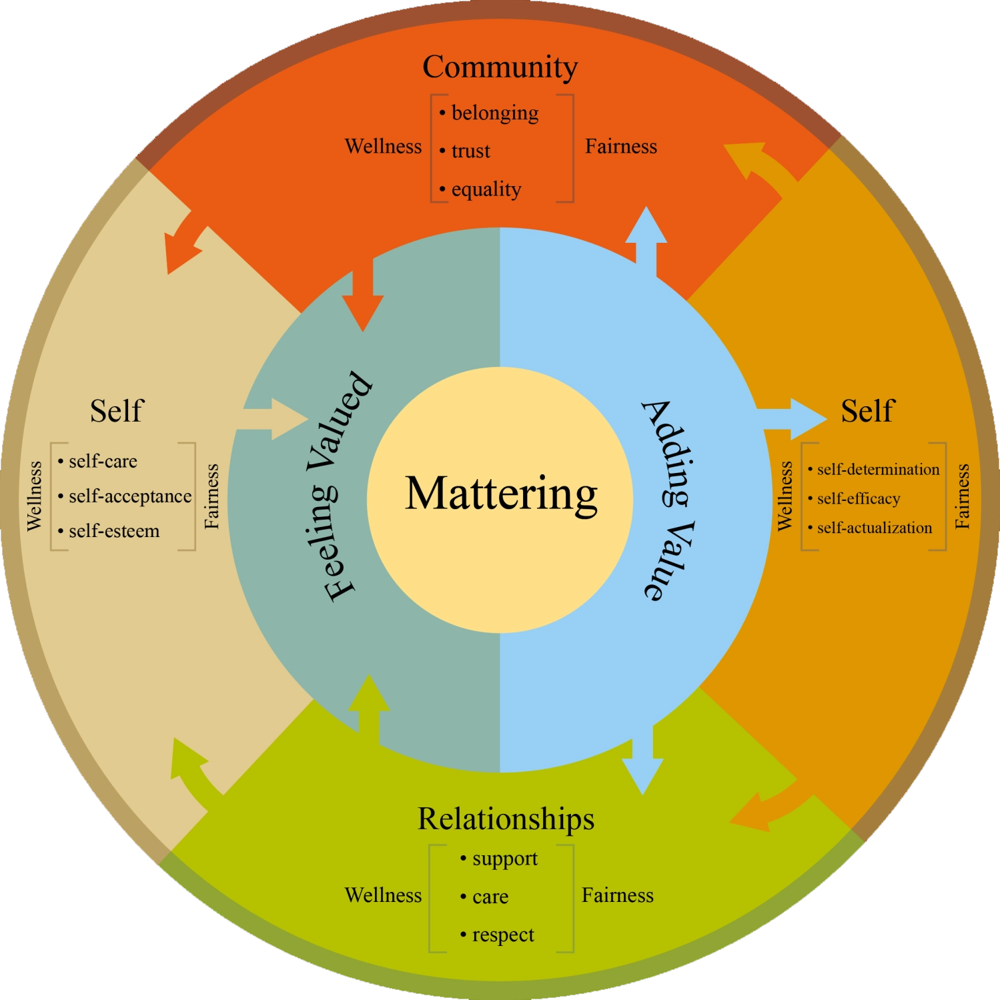

= ★★★ 自我重要感  → "认为你自己很重要"这种自我价值感, 非常重要!
:toc: left
:toclevels: 3
:sectnums:
:stylesheet: ../myAdocCss.css

'''

== Do You ‘Matter’ (v.) to Others? The Answer Could Predict Your Mental Health

In South Carolina `主` a grieving 感到悲痛；（因某人的去世而）悲伤 mother whose son died by suicide `谓`  *hands out* stickers *to* young people. The sticker bears (v.)显示；带有 the words “Jackson Matters (v.)事关紧要；要紧；有重大影响 /and So Do You.”  `主` To be important to others —to matter (v.) — `谓` has become more than just 不仅仅是 a truism 不言而喻的道理；自明之理；老生常谈.  +

[.my1]
.标题
====
.truism
/ˈtruːɪzəm/
-> true,真实的，事实的，-ism,主义，思想。
====

“You Matter (v.)事关紧要；要紧；有重大影响” is the tagline 标语；品牌口号 of the National _Suicide Prevention_ hotline. And the phrase “Black Lives Matter (v.)” calls attention to _the exclusionary 排斥（性）的；排除在外的 racism_ 种族主,种族歧视义 /*to* which _more than one in eight_ Americans *is exposed* 易受攻击（或批评）的；无保护的.

Over the past 30 years, but *never more so than* now 但从来没有像现在这样, psychologists have formalized (v.)（通过规则）使有固定体系，使定形 “mattering” into a _psychological construct_ /that uniquely predicts (v.) depression, suicidal (a.)想自杀的；有自杀倾向的 thoughts or other mental ills. It also foretells (v.)（尤指用魔力）预知，预言 _physical resilience_ 快速恢复的能力；还原能力 among the elderly.

[.my1]
.案例
====
.never more so than + 某个时间段
首先这个句型是从 more so 生发出来的，more so 表示"更加如此"、"尤其如此"，more 是比较级，表示"更加"，so 表示"如此"，指代前句交待的情况。 +
合在一起，【never more so than + 某时间段】意思是，*没有任何时候比某时间段更为如此，换言之，某时间段最为如此。*

- He had a tendency for violence, never more so *than* after drinking.
他有暴力倾向，酒后最为如此。或"他有暴力倾向，酒后最严重"。
====

[.my2]
南卡罗来纳州一位悲伤的母亲因儿子自杀而向年轻人发放贴纸。贴纸上写着“杰克逊很重要，你也很重要。”被他人看重和重视,已经不仅是一种废话。 ##“你很重要”是国家自杀预防热线的标语。##而“黑人的命也是命”这句话则呼吁人们关注排除性种族主义，这种主义会影响超过八分之一的美国人。 +
30年来，心理学家已将“重视”的概念正式化为一种心理建构，能独特地预测抑郁、自杀倾向或其他心理疾病，同时也预示着老年人的身体韧性。

Increasingly #a consensus# 一致的意见；共识 is building 后定 #that# mattering *stands (v.) on its own* 独立地，单独地 in psychological terms: “There is no other construct  后定 that *gets at* 到达某处；接近某人（或某物）；够得着某物 people’s need 后定 to feel (v.) valued /and *seen* by others *as* important,” says Gordon Flett of York University in Ontario, author of The Psychology of Mattering: Understanding (v.) the Human Need (n.) to Be Significant 有重大意义的；显著的 (2018).

Mattering *overlaps (v.)（范围方面）部分重叠 with* _self-esteem_  自尊（心）, _social support_ and _a sense of belonging_ 归属感, he says, but is not identical 完全同样的；相同的.  +
What’s especially powerful, he says, is that /*compared to* other psychological states, `主` a low _sense of mattering_ `系` is more amenable (a.)可用某种方式处理的 to change (v.).  +
And that goal can be achieved with years of therapy. “People can learn to engage 与…建立密切关系；尽力理解 with others in ways that foster (v.)促进；助长；培养；鼓励 their own _sense of mattering_,” he says.

[.my2]
越来越多的人一致认为，从心理学的角度来看，“被重视的感觉”是独立存在的，“没有其他的建构(心理学变量), 能够反映人们被他人看重, 和认为自己重要的需求”，安大略省约克大学的戈登·弗莱特说道，他是《重视心理学：理解人类的重要性需求》（2018）一书的作者。他表示，“重视”与自尊、社会支持, 和归属感, 有所重叠，但并不相同。他还说，#特别强大的是，与其他心理状态相比，'低重视感'更容易改变。这个目标可以通过多年的治疗来实现。#“人们可以学会以促进自己的重视感的方式, 与他人互动，”他说。

[.my1]
.标题
====
.There is no other construct /that gets at people’s need to feel valued /and seen by others as important.
这句话的意思是：“没有其他概念,  可以满足人们"需要感到被重视"和"被视为重要"的需求。”该句的主语是“no other construct”，意为“没有其他概念”，动词是“gets at”，意为“满足、达到”，宾语是“people’s need to feel (v.) valued /and seen by others [as important]”，意为“人们需要感到被重视, 和被视为重要”。

.amenable
(a.) ~ to sth( formal ) : that you can treat in a particular way 可用某种方式处理的 +
-> 前缀a- 同ad-. 词根men, 伸出，引导，威胁，见 menace，威胁。此处用引导义，可引导的，顺从的。

- ‘Hamlet’ is the least amenable (a.) of all Shakespeare's plays /to being summarized. 在莎士比亚所有的戏剧中，《哈姆雷特》最难概括。

.foster
-> 来自food,喂养，食物。

====

In 1981 /sociologist Morris Rosenberg created _a five-item mattering scale_ with questions such as “How much do other people *depend on* you?” and “How much would you *be missed* (v.)怀念；思念 if you went away?”  +
Rosenberg, renowned (a.)有名的；闻名的；受尊敬的 for his widely used _Rosenberg Self-Esteem 自尊（心） Scale_, was not the one who eventually 最后；终于 tested (v.) the measure.

In the early 1990s, over a beer at an annual meeting, Rosenberg *suggested to* sociologist R. Jay Turner *that* the mattering scale be included in a large, planned (a.) Toronto community survey.

In 1997 /Turner *suggested to* his student John Taylor, now a Florida State University sociologist, *that* he analyze (v.) the survey’s 民意调查；民意测验 mattering data for his doctoral 博士的 dissertation 专题论文；学位论文.  +
*As much as* 尽管, 虽然 `主` the scale `谓` *made sense* 有道理；有意义；讲得通 to him intuitively 凭直觉,直观的, Taylor says, he *couldn’t help 忍不住 but* ask himself, “Is it the same wine in a different bottle?” — perhaps just _a repackaged 重新包装；改变……的形象  form_ of self-esteem 自尊（心）, for instance 例如.

[.my1]
.案例
====
.dis·ser·ta·tion
-> dis-, 分开，散开。-sert, 安排，连接，词源同series, insert. 即分开安排，各个讨论，引申词义专题论文。比较discuss, discourse, disquisition.

.sb can (not) help (doing) sth | sb can not help but do sth
used to say that it is impossible to prevent or avoid sth 某人忍不住（或无法抑制）做某事；不可能避免某事

.as much as = much as   虽然，尽管（表让步）
引导让步状语从句 相当于 even though : despite the fact that 的用法，现代英语中常用 much as (前面的 as 经常省略)。 +
- *As much as* I respect him, I still have to disagree with him on this point.
尽管我很尊敬他，但在这一点上我仍然和他意见不同。 +
====

But after a 2001 study 后定 he conducted 组织；安排；实施；执行 on mattering, any _lingering (a.)拖延的；缠绵的；缓慢消失的；迟迟不去的  doubts_ vanished (v.). “Mattering makes a unique contribution,” Taylor says. “It’s distinct (a.)截然不同的；有区别的  from self-esteem, social support and other factors; it’s an important part of the self-concept.”

[.my2]
====

1981年，社会学家Morris Rosenberg 创建了一个五项事项的重要性量表，其中包括“#其他人有多么依赖您？#”和“#如果您离开了，会有多少人想念您？#”Rosenberg 因其广泛使用的Rosenberg自尊量表而闻名，但最终测试该量表的不是他。 +
在1990年代初，Rosenberg在一次年度会议上, 建议社会学家R. Jay Turner将"重要性量表"包含在计划中的多伦多社区调查中。1997年，Turner建议他的学生John Taylor（现为佛罗里达州立大学社会学家）分析其博士论文的调查数据。Taylor说，尽管这个量表在直觉上很有意义，但他不禁问自己，“这个"自我重要性感知", 是否只是"自尊心"变量概念的另一种马甲呢? (难道这只是不同包装的相同酒吗)？”。

但是，在他进行的2001年关于"重要性"的研究之后，任何对此持有的疑虑都消失了。Taylor说：“'自我重要性感知'这个因素, 是独立的, 是做出了其独特贡献的。即, 它与"自尊心"、"社会支持"和其他变量因素, 都不同. 它们不是一回事. '自我重要性感知'这个变量是独立的, 是"自我概念"的重要组成部分。”
====

==== MEASURING MATTERING

`主` Scales 后定 to assess  (v.)评价，评定 mattering `谓` have multiplied (v.)成倍增加；迅速增加 in the ensuing (a.)随后的 (时间) years.  +
Besides _Flett’s Anti-Mattering Scale_ (with items such as “*To what extent* have you been made to feel you are invisible?”) and _a Work Mattering Scale_, developed by Ae-Kyung Jung and Mary J. Heppner. at the University of Missouri, scientists can now measure (v.) your _sense of significance_ 重要性，意义 to family, to your university, and to the larger community and society. One scale even does so for your romantic partner.

[.my1]
.案例
====
.To what extent *have you been made* to feel you are invisible?
在这句话中，使用被动态 “have you been made to feel” 是为了强调外部力量或他人对你的影响，而不是你自己主动产生的感觉。 +
"have you been made to feel"：被动态的结构, 表明某种力量或他人使你产生了某种感觉。在这里，重点是你"被动地"感受到自己仿佛是“隐形的”，而不是你自己"主动"认为自己“隐形”。
====

Mattering *is defined as* consisting of three components 部件；组件. Brown University sociologist Gregory Elliott describes them as: +
- Awareness 知道；认识；意识；兴趣: Do people *pay attention to* 注意 you /or walk right by you 从你身边走过? +
- Importance: Do you have people who take a real interest in your well-being 健康；安乐；康乐? +
- Reliance 依靠，信任: Are there people who would come to you for help, support or advice?

[.my1]
.案例
====
.aware·ness
(n.)~ (of sth) |~ (that...) : knowing sth; knowing that sth exists and is important; being interested in sth知道；认识；意识；兴趣 +
•an awareness of the importance of eating a healthy diet认识到健康饮食的重要性

.well-being
[ U] general health and happiness 健康；安乐；康乐

====

[.my2]
====
衡量"重要性"的量表, 其中所测量的问题清单数目, 已经增加了。除了Flett的"反重要性"量表（包括“您是否感到自己是无形的？”等项目）和由密苏里大学的Ae-Kyung Jung和Mary J. Heppner开发的"工作重要性"量表外，科学家现在可以衡量您在家庭、大学和更大社区和社会中的重要性。甚至有一个量表可以衡量您对恋人的重要性。

##重要性, 被定义为由三个组成部分组成。##布朗大学社会学家格雷戈里·艾略特（Gregory Elliott）将它们描述为： +
- #你被意识到#：人们是否关注您或走过您？ +
- #你的重要性#：是否有人真正关心您的福祉？ +
- #你被他人依赖#：对你来说, 有这类人存在吗? 即是否有人会来找您寻求帮助、支持或建议？
====

A sense of significance (or insignificance 无意义；不重要；无价值) begins in childhood. “`主` What makes _neglect 忽略；忽视；不予重视 by parents_ so destructive  (a.)破坏性的，毁灭性的,” Flett says, `系` is “the message it sends to the child who is made to feel irrelevant (a.)无关紧要的；不相关的, invisible and insignificant (a.)微不足道的；无足轻重的.”

In teenagers, an absence of mattering is highly destructive (a.).  +
In a landmark 地标；里程碑，转折点 study of 2,000 adolescents in 2009, Elliott found that /as `主` _teens’ feeling_ of mattering in their family `谓` decreased, antisocial, aggressive 好斗的；挑衅的,富于攻击性的 or self-destructive (a.)自毁的 behaviors rose (v.).  +
Conversely 相反地，反过来说, if you believe you matter (v.) to your family, you are less likely to go astray (ad.)走错方向；误入歧途,迷失.  +

Clemson University psychologist Robin Kowalski has been coding (v.) teenagers’ posts on Reddit’s “Suicide Watch 自杀观察” page. “About half felt (v.) that they didn’t matter (v.),” she says, citing  (v.)引用；引述；援引 posts such as “I just want to matter (v.)” and “No one *cares about* me.”

[.my1]
.标题
====
.astray
-> astray = a（处于…状态）+stray（迷路的）→迷路的

重要感（或不重要感）始于童年。“父母忽视之所以如此破坏性，”Flett说，“是因为它向那些被认为是无关紧要、看不见和微不足道的孩子, 传递了信息。”

##在青少年中，缺乏"自我是有重要性"的这种感觉, 是非常破坏性的。##在2009年对2,000名青少年进行的一项具有里程碑意义的研究中，艾略特发现，##随着青少年"在家庭中感到重要性"的减少，回导致反社会、攻击性, 或自我毁灭行为的增加。相反，如果您相信自己对家庭很重要，那么您就不太可能走上歧途。##克莱姆森大学心理学家罗宾·科瓦尔斯基（Robin Kowalski）一直在编码Reddit“自杀观察”页面上青少年的帖子。她说：“约一半人觉得自己无关紧要”，并引用了“我只想有所作为”和“没有人关心我”的帖子。
====

Taylor’s 2001 study *linked* mattering *to* mental health.  +
In a 2018 study, he went (v.) further, showing a strong correlation 相互关系；相关；关联 with physical health. He and his colleagues Michael McFarland and Dawn Carr conducted (v.) _in-depth (a.)彻底的；深入详尽的 psychological interviews_ 访谈；面试；面谈 of 1,026 Tennessee 田纳西州 residents, ages 22 to 69, followed by _a battery 一系列；一批；一群 of_ physiological measurements 测量；度量 such as blood pressure, _cortisol 皮质醇 levels_ and _hip-to-waist ratio_ 腰臀比.  +

The research team found that `主` #allostatic 应变调节的 load# 负载，重荷 —the general _wear and tear 磨损,损耗 of stress_ on the body over time 来自压力所造成的磨损, 作用在身体上,随着时间推移所造成的影响 — `谓` #increased# with age, and `主` those who did not feel (v.) a strong sense of mattering to others `谓` had significantly greater _allostatic load_.  +
“ `主` Even minute  (a.)极小的，微小的 variations (n.) 变化，变动 in mattering `系`  are stronger predictors of _physical and mental health_ *than* social support,” he says.

Social support *is seen as* a defining (a.)最典型的；起决定性作用的 factor in describing (v.) _physical resilience_ 恢复力，复原力, but it can also encompass (v.)包含，包括 troubled (a.) relationships with family.  +
“Mattering is a cleaner measure,” he says. “It captures (v.) only _the positive effects_ of _close 亲密的；密切的 personal ties_.”

[.my2]
====
泰勒（Taylor）在2001年的研究中, 将"重要性"与"心理健康"联系起来。在2018年的一项研究中，他进一步表明了与"身体健康"的强相关性。他和他的同事迈克尔·麦克法兰（Michael McFarland）和唐·卡尔（Dawn Carr）, 对1,026名田纳西州居民进行了深入的心理访谈，年龄在22岁至69岁之间，然后进行了一系列生理测量，如血压、皮质醇水平和臀围与腰围比。研究小组发现，##随着年龄的增长，压力对身体的总体磨损（allostatic load）增加，那些没有感到"自己对他人有强烈重要性"感觉的人, 具有更大的 allostatic load (适应负荷)。##他说：“#即使是'重要性'上微小的变化, 也比'社会支持'能更强地预测身体和心理健康。#

”####'社会支持'被视为描述'身体健康恢复弹性'的决定性因素，##但##它也可以包括与'家庭关系不良'的关系##。##他说：“重要性是一个更清晰的度量标准。”它只捕捉亲密个人关系的积极影响。” (就是说, "社会支持"和"被视为重要性" 是两个独立变量, "社会支持"能预测的范围更广; 而"Mattering (被视为重要性)"只预测人际关系和心理健康, 后者更精确!)
====

[.my1]
.标题
====
.Allostatic load
##Allostatic load 是指由于个体长期处于"应激"状态下, 所引起的身体系统累积性损伤的总和。##简单来说，#它是身体对压力的适应过程, 所产生的"生物学性反应"的累积效果。# +
**人们在面对不同类型的压力时，身体会释放出一系列的生物学性反应，**如心率加快、血压升高、皮质醇分泌增加等。*这些反应的频繁发生, 可以导致身体的器官系统长期处于高应激状态，最终导致机体的疾病风险增加。这些生物学性反应的累积效果, 就是 allostatic load。* +
Allostatic load 通常用于描述心理应激和身体健康之间的关系，它可以反映出个体长期的心理应激水平，对于预测慢性疾病的风险, 有一定的参考价值。

====

==== SCHOOL, WORK, COMMUNITY, SOCIETY

We derive (v.)（从…中）得到，获得 our sense of significance *not just* from our personal relationships, says University of Miami community psychologist Isaac Prilleltensky, *but* from work and community.  +
Prilleltensky created his own scale to measure (v.)  this broadened 拓展，扩大 measurement.  +
In his _Mattering in Domains 领域，范围 of Life Scale_ (MIDLS), people assess (v.) their degree 程度 of _feeling “worthy (a.), acknowledged (v.a.)公认的；被普遍认可的;承认（权威、地位） and appreciated_ 欣赏；赏识；重视,” *as well* 也；同样地 their sense of contributing to others.  These feelings *relate to* four domains 领域: the self, relationships, work (paid or unpaid) and community.

[.my2]
====
学校、工作、社区、社会

迈阿密大学社区心理学家艾萨克·普里莱特斯基（Isaac Prilleltensky）表示，##我们不仅从我们的个人关系中, 获得"重要性"感，而且从工作和社区中获得。##普里莱特斯基创建了自己的量表, 来衡量这种扩展测量。在他的"生活领域重要性感"量表（MIDLS）中，人们评估自己感到“有价值、被认可, 和受到赞赏”的程度，以及他们对他人做出贡献的感觉。这些感觉涉及四个领域：自我、关系、工作（有偿或无偿）和社区。
====

Prilleltensky took those elements /and created _the image of a wheel_ with _“mattering” occupying (v.) its center_. `主` “Feeling (v.) valued (a.)” and “adding value” `谓` form (v.) semicircles 半圆形 around the target, and `主` an outer circle `谓` *replicates* (v.)重复，复制 _the four domains_ for _each of the “value” categories_ [*in the adjacent 邻近的，毗连的 inner ring*].  +

The goal is *to come up with* 提出；想出 a “virtuous  (a.)品行端正的；品德高的 cycle,” he wrote, “where `主` the benefits of _feeling valued_ (a.) `谓` will *lead to* adding value.” _The more_ others make you feel (v.) you matter, he noted, _the more likely_ you are to contribute to them, reaping (v.)收割（庄稼），获得;取得（成果）；收获 notice and appreciation.

_Mattering scales_ have begun to make appearances  (n.)露面,出现 in the workplace.  +
Investigating (v.) _nurse burnout_  (n.)精疲力竭;（火箭）熄火点，燃烧终止 in a nationwide 全国性的 survey, Julie Haizlip, a nursing professor and pediatrician 儿科医生 at the University of Virginia (UVA), and her colleagues found that `主` nurses who reported (v.) higher levels of _**mattering (v.) to** patients and co-workers_ `谓` had less burnout 精疲力竭；过度劳累. “ +

In health care 医疗保健, it seems to be *more about* the interpersonal (a.)人际关系的，人际的 *than* the organizational (a.)组织的，安排的；有关组织（或机构）的.  +
Mattering occurs (v.) in the small moments,” Haizlip says. It might involve /holding _a frightened patient’s hand_ or your colleagues _**ordering** (v.) lunch *for* you_ and _knowing (v.) which sandwich you like_.

In her current study of _nursing and medical students_ at UVA 美国弗吉尼亚大学（The University of Virginia） and the _Medical College_ 医学院 of Wisconsin, Haizlip has learned that /`主` _instilling (v.)徐徐滴入；逐渐灌输 a sense of mattering_ `谓` can be *as simple as* remembering (v.) students’ names during their rotations 旋转；转动,轮换；交替, `主` a task `谓` helped along （与某人）一道，一起 by _distributing (v.) photographs of incoming (a.) students_.

[.my2]
====
普里莱特斯基（Prilleltensky）将这些元素结合起来，创造了一个轮子的形象，其中“重要性”占据了中心位置。 “感到有价值”和“增加价值”形成了目标周围的半圆形，而外圈则复制了相邻内环中每个“价值”类别的四个领域。他写道，目标是提出一个“美德循环”，“你感到自己有价值, 其好处是, 这能导致你继续给自己增加价值。”他指出，其他人让你感到你很重要，你就越有可能为他们做出贡献，获得关注和赞赏。

重要性量表, 已经开始在工作场所出现。在一项全国调查中, 调查护士的疲劳情况时，弗吉尼亚大学（UVA）的护理教授和儿科医生朱莉·海兹利普（Julie Haizlip）及其同事发现，那些报告说, "自己对患者和同事的重要性"感觉更高的护士, 其疲劳程度就更低。海兹利普说：“在医疗保健方面，它似乎更多地涉及人际关系, 而不是组织关系。重要性发生在小时刻。”它可能涉及握住害怕的患者的手, 或您的同事为您订购午餐, 并知道您喜欢哪种三明治。

在她目前在UVA和威斯康星医学院进行的护理和医学生研究中，海兹利普发现，灌输"重要性感", 可以像在轮换期间记住学生的名字一样简单，分发新生的照片, 有助于完成这项任务.
====

_The importance of mattering_ differs (v.) by gender. When queried (v.)询问 by researchers, women “almost universally”一致地；共同,在各种情况下地  report (v.) _higher levels of mattering_ in their relationships, Taylor says, and he notes that /this has been true _from the 1990s to today_ *even through* changes in women’s roles.  +
Both men and women *derive* (v.)（从…中）得到，获得 a sense of mattering *from* close relationships, but women *do so* more than men [*from* their roles 后定 as parents and close friends], reports a recent study by Baylor University sociologists Rebecca Bonhag and Paul Froese.

Men’s sense of significance, the study finds, *stems (v.) more from* their _perceived 注意到；意识到；察觉到 status and social class_ within the broader community /*and through* membership in groups. +
*Donating (v.)（尤指向慈善机构）捐赠，赠送 to* local organizations, for example, is linked to mattering for men /but less so for women.  +

One intriguing 非常有趣的；引人入胜的；神秘的 finding is that `主` men who strongly identified as Republican 共和党党员 and were active (a.)积极的 on social media 社交媒体 `谓` felt a greater sense of mattering; the same link was not found for men who were independents or Democrats 民主党人.  +
It’s not possible to say _what causes (v.) what_ 什么导致了什么(即很难确认"谁因谁果",因果关系), but Bonhag speculates (v.)推测，猜测 that `主` men who have lost (v.) some sense of mattering `谓` find it [in _being strongly partisan_ (n.)坚定的支持者；铁杆拥护者].  If that’s the case, she says, “that would be a troubling (a.)令人不安的; 令人烦恼的  trend 趋势.”  +
On the other hand, she suggests, social media may help _men feel (v.) connected to others_ /in ways _women get from their close ties_.

[.my2]
.标题
====
重要性因性别而异。泰勒说，当研究人员询问时，女性“几乎普遍”表示，在她们的人际关系中，她们的能得到的"受重视性感"更高。他指出，从20世纪90年代到今天，即使女性角色发生了变化，这种情况也是如此。贝勒大学社会学家Rebecca Bonhag和Paul Froese最近的一项研究报告称，#男性和女性都从"亲密关系"中获得"受重视感"，但女性比男性更多地从"父母和亲密朋友的角色"中, 来获取"自我被重视的感觉"。#

研究发现，##男性的重要性感, 更多地来自于他们##在更广泛的社区中##的地位和社会阶层，##以及他们在群体中的成员身份 (#男人是政治动物,更看重权力地位#)。例如，**向当地组织捐款, 对男性来说意义重大，但对女性来说意义不大。**一个有趣的发现是，那些强烈认为自己是共和党人、在社交媒体上活跃的男性, 感觉自己更重要; 但在无党派人士或民主党人中, 则没有发现同样的联系。很难说是什么导致了这个现象，但邦哈格推测，**那些失去了"自我重要性感觉"的人, 会在"成为强烈的党派人"这件事中, 找回这种"自己被受重视"的感觉 (即加入组织, 你就有了自我重视感和归属感, 你就觉得自己有意义了, 有价值了)。**如果是这样的话，她说，“这将是一个令人不安的趋势。” 另一方面，她认为，社交媒体可能会帮助男性感受到与他人的联系，就像女性从亲密关系中获得的一样。
====

==== MATTERING, SUICIDE AND HOMICIDE (n.)（蓄意）杀人罪

`主` Not *mattering to* another person `谓` has been linked to both suicidal and even homicidal (a.)（使）可能会杀人的 thinking. Several scholars *have attributed* _mass shootings_ at least *partly to* such a deficit 不足额；缺款额；缺少;赤字；逆差；亏损.  +
The 2007 _Virginia Tech_ 技校;理工大学 shooter `谓` left a chilling (a.)（常与残暴有关）令人恐惧的，令人害怕的 manifesto 宣言, which Elliott *paraphrases (v.)（用更容易理解的文字）解释，释义，意译 as* “None of you recognize (v.)认识；认出；辨别出 who I am, so I have to show you I’m important.”  +

A 2003 study examined _media reports (n.) of the writings_ 文章,（某作家或专题的）著作，作品 of _10 mass shooters_. A consistent theme 始终如一的主题, Flett says, could *be summarized as* “I have been made *to feel like* I don't matter, but I matter (v.)  more than you people realize.”

As `主` _the mattering concept_ `谓` gains (v.) more notice, it *is being incorporated   (v.)将…包括在内；包含；吸收；使并入 into* mental health interventions 心理健康干预. The _You Matter_ lifeline （水上救援的）救生索;命脉；生命线 represents (v.) one key example. `主` Calling (v.) 988 `谓` *opens a way for* people with _suicidal thoughts_ (n.) /to feel (v.) _someone will listen_ and _they will matter (v.) to another person_.

[.my2]
====
物质，自杀, 和他杀

**"觉得自己不受重视", 与"自杀"甚至"杀人"的想法有关。**一些学者将大规模枪击事件, 至少部分地归因于这种赤字。这位 2007 年弗吉尼亚理工大学枪手, 留下了一份令人不寒而栗的宣言，埃利奥特将其解释为“你们谁都不认识我，所以我必须向你们证明我很重要。” 2003 年的一项研究, 调查了"媒体对 10 名大规模枪击案的报道"。 Flett 说，*一个始终如一的主题可以概括为: “我一直觉得自己不受重视，但我比你们意识到的要更重要。”*

随着"重要性"概念获得更多关注，它正在被纳入心理健康干预措施。 You Matter 生命线就是一个重要的例子。拨打 988, 能为有自杀念头的人打开了一条生路，让他们觉得有人会倾听，他们对另一个人很重要。
====

[.my1]
.标题
====
.homicide
-> homi人 + -cid 切 + -e

====

`主` #Perceiving  (v.)注意到；意识到；察觉到 opportunities# 后定 ① to become (v.) *involved in* an activity /and ② *to have a voice* in decision-making, researchers found, `谓` #increased# (v.) middle schoolers’ _sense of mattering_ in two rural Michigan school districts.

`主` Simply noticing (v.) the kids, Maine’s Tinkham says, `谓` makes a difference: a store owner 店主, for example, simply saying, “Justin, I haven’t seen you for a while. How you doing?”  +
Many interventions 干预，干涉 *occur (v.) spontaneously* 自发地，不由自主地；自然地 without _an institution *as* an intermediary_ 中间人；调解人. Adolescents can join (v.) and volunteer (v.) in _church_ or _leadership groups_.

Helping others _increases (v.) mattering_. `主`## Older people##, who connect (v.) socially on Facebook, some research has found, `谓` #feel# (v.) an increase in _how much they matter to others_ /as they *interact (v.) with* others *more* [on the site].

[.my2]
====
研究人员发现，感知到"参与一项活动, 并在决策中发表意见"的机会，增加了密歇根州两个农村学区的中学生的"自视重要性感"。

缅因州的 Tinkham 说，只要注意到孩子们，就会有所不同：例如，店主只需说：“贾斯汀，我有一段时间没见到你了。你好吗？”许多干预是在没有机构作为中介的情况下自发发生的。青少年可以加入教会, 或领导团体并担任志愿者。帮助他, 人会增加自我的重要性感。

一些研究发现，在 Facebook 上进行社交联系的老年人, 在该网站上与他人互动越多，他们就越觉得自己对他人的重要性。
====

For _a neglected 被忽视的，被忽略的 or abused child_, an intervention may arrive (v.) as _a trusted  (a.)可信的，可靠的 adult_ who *cares* (v.) and *pays (v.) attention* — a relative 亲戚，亲属, a teacher, a coach  教练；私人教师.  +
Some _clinical 临床的；临床诊断的 accounts_ 叙述；报告 *acknowledge (v.) that* `主` establishing the feeling of mattering `谓`  might involve (v.) major life upheavals (n.)剧变；激变；动乱；动荡, but `主` establishing it `系` is *by no means* 绝不，决不，一点也不 an impossible goal. “Once they *matter (v.) to* someone,” Flett says, “they can no longer think (v.), ‘I don’t *matter to* anyone.’”

[.my2]
====

对于一个被忽视或受虐待的孩子，干预可能是来自一个值得信赖的,关心和关注的成年人——亲戚、老师、教练。一些临床报告承认，建立重要感可能涉及重大的生活剧变，但建立它绝不是一个不可能实现的目标。 “一旦他们对某人很重要，”弗莱特说，“他们就不会再想，‘我对任何人都不重要。’”
====

'''

== 附录

==== psychological construct

A psychological construct is a framework used to describe psychological phenomena, such as behavior, emotion, or experience. These things don’t have a physical presence, so they cannot be objectively measured by looking at their size, weight, or appearance. By labeling a construct, researchers can make inferences about these abstract concepts. +
"心理构造"是用于描述心理现象（例如行为、情感或体验）的框架。这些东西没有物理存在，因此无法通过观察它们的大小、重量或外观来客观地测量它们。通过标记一个结构，研究人员可以对这些抽象概念做出推断。

Constructs are used in psychological research and theory to help explain different mental processes, traits, emotions, and other aspects of human behavior. +
建构在心理学研究和理论中被用来帮助解释不同的心理过程、特征、情绪和人类行为的其他方面。

Some examples of constructs in psychology include:
心理学结构的一些例子包括： +
- Intelligence 智力 +
- Motivation 动机 +
- Personality traits (such as the Big 5 personality traits of extraversion, openness, neuroticism, agreeableness, and conscientiousness)  人格特质（例如外向性、开放性、神经质、宜人性和责任心这5大人格特质） +
- Self-esteem 自尊 +
- Attitudes 态度 +
- Emotions 情绪 +
- Subjective well-being 主观幸福感 +
- Self-control 自我控制 +
- Happiness 幸福 +
- Self-determination 自决

'''

== (pure) Do You ‘Matter’ to Others? The Answer Could Predict Your Mental Health

In South Carolina a grieving mother whose son died by suicide hands out stickers to young people. The sticker bears the words “Jackson Matters and So Do You.” To be important to others—to matter—has become more than just a truism. “You Matter” is the tagline of the National Suicide Prevention hotline. And the phrase “Black Lives Matter” calls attention to the exclusionary racism to which more than one in eight Americans is exposed.

Over the past 30 years, but never more so than now, psychologists have formalized “mattering” into a psychological construct that uniquely predicts depression, suicidal thoughts or other mental ills. It also foretells physical resilience among the elderly.

Increasingly a consensus is building that mattering stands on its own in psychological terms: “There is no other construct that gets at people’s need to feel valued and seen by others as important,” says Gordon Flett of York University in Ontario, author of The Psychology of Mattering: Understanding the Human Need to Be Significant (2018). Mattering overlaps with self-esteem, social support and a sense of belonging, he says, but is not identical. What’s especially powerful, he says, is that compared to other psychological states, a low sense of mattering is more amenable to change. And that goal can be achieved with years of therapy. “People can learn to engage with others in ways that foster their own sense of mattering,” he says.

In 1981 sociologist Morris Rosenberg created a five-item mattering scale with questions such as “How much do other people depend on you?” and “How much would you be missed if you went away?” Rosenberg, renowned for his widely used Rosenberg Self-Esteem Scale, was not the one who eventually tested the measure. In the early 1990s, over a beer at an annual meeting, Rosenberg suggested to sociologist R. Jay Turner that the mattering scale be included in a large, planned Toronto community survey. In 1997 Turner suggested to his student John Taylor, now a Florida State University sociologist, that he analyze the survey’s mattering data for his doctoral dissertation. As much as the scale made sense to him intuitively, Taylor says, he couldn’t help but ask himself, “Is it the same wine in a different bottle?”—perhaps just a repackaged form of self-esteem, for instance. But after a 2001 study he conducted on mattering, any lingering doubts vanished. “Mattering makes a unique contribution,” Taylor says. “It’s distinct from self-esteem, social support and other factors; it’s an important part of the self-concept.”

MEASURING MATTERING
Scales to assess mattering have multiplied in the ensuing years. Besides Flett’s Anti-Mattering Scale (with items such as “To what extent have you been made to feel you are invisible?”) and a Work Mattering Scale, developed by Ae-Kyung Jung and Mary J. Heppner at the University of Missouri, scientists can now measure your sense of significance to family, to your university, and to the larger community and society. One scale even does so for your romantic partner.

Mattering is defined as consisting of three components. Brown University sociologist Gregory Elliott describes them as:

Awareness: Do people pay attention to you or walk right by you?
Importance: Do you have people who take a real interest in your well-being?
Reliance: Are there people who would come to you for help, support or advice?

A sense of significance (or insignificance) begins in childhood. “What makes neglect by parents so destructive,” Flett says, is “the message it sends to the child who is made to feel irrelevant, invisible and insignificant.”

In teenagers, an absence of mattering is highly destructive. In a landmark study of 2,000 adolescents in 2009, Elliott found that as teens’ feeling of mattering in their family decreased, antisocial, aggressive or self-destructive behaviors rose. Conversely, if you believe you matter to your family, you are less likely to go astray. Clemson University psychologist Robin Kowalski has been coding teenagers’ posts on Reddit’s “Suicide Watch” page. “About half felt that they didn’t matter,” she says, citing posts such as “I just want to matter” and “No one cares about me.”

Taylor’s 2001 study linked mattering to mental health. In a 2018 study, he went further, showing a strong correlation with physical health. He and his colleagues Michael McFarland and Dawn Carr conducted in-depth psychological interviews of 1,026 Tennessee residents, ages 22 to 69, followed by a battery of physiological measurements such as blood pressure, cortisol levels and hip-to-waist ratio. The research team found that allostatic load—the general wear and tear of stress on the body over time—increased with age, and those who did not feel a strong sense of mattering to others had significantly greater allostatic load. “Even minute variations in mattering are stronger predictors of physical and mental health than social support,” he says. Social support is seen as a defining factor in describing physical resilience, but it can also encompass troubled relationships with family. “Mattering is a cleaner measure,” he says. “It captures only the positive effects of close personal ties.”

SCHOOL, WORK, COMMUNITY, SOCIETY
We derive our sense of significance not just from our personal relationships, says University of Miami community psychologist Isaac Prilleltensky, but from work and community. Prilleltensky created his own scale to measure this broadened measurement. In his Mattering in Domains of Life Scale (MIDLS), people assess their degree of feeling “worthy, acknowledged and appreciated,” as well their sense of contributing to others. These feelings relate to four domains: the self, relationships, work (paid or unpaid) and community.

Sign Up
Prilleltensky took those elements and created the image of a wheel with “mattering” occupying its center. “Feeling valued” and “adding value” form semicircles around the target, and an outer circle replicates the four domains for each of the “value” categories in the adjacent inner ring. The goal is to come up with a “virtuous cycle,” he wrote, “where the benefits of feeling valued will lead to adding value.” The more others make you feel you matter, he noted, the more likely you are to contribute to them, reaping notice and appreciation.

Mattering scales have begun to make appearances in the workplace. Investigating nurse burnout in a nationwide survey, Julie Haizlip, a nursing professor and pediatrician at the University of Virginia (UVA), and her colleagues found that nurses who reported higher levels of mattering to patients and co-workers had less burnout. “In health care, it seems to be more about the interpersonal than the organizational. Mattering occurs in the small moments,” Haizlip says. It might involve holding a frightened patient’s hand or your colleagues ordering lunch for you and knowing which sandwich you like.

In her current study of nursing and medical students at UVA and the Medical College of Wisconsin, Haizlip has learned that instilling a sense of mattering can be as simple as remembering students’ names during their rotations, a task helped along by distributing photographs of incoming students.

The importance of mattering differs by gender. When queried by researchers, women “almost universally” report higher levels of mattering in their relationships, Taylor says, and he notes that this has been true from the 1990s to today even through changes in women’s roles. Both men and women derive a sense of mattering from close relationships, but women do so more than men from their roles as parents and close friends, reports a recent study by Baylor University sociologists Rebecca Bonhag and Paul Froese.

Men’s sense of significance, the study finds, stems more from their perceived status and social class within the broader community and through membership in groups. Donating to local organizations, for example, is linked to mattering for men but less so for women. One intriguing finding is that men who strongly identified as Republican and were active on social media felt a greater sense of mattering; the same link was not found for men who were independents or Democrats. It’s not possible to say what causes what, but Bonhag speculates that men who have lost some sense of mattering find it in being strongly partisan. If that’s the case, she says, “that would be a troubling trend.” On the other hand, she suggests, social media may help men feel connected to others in ways women get from their close ties.

MATTERING, SUICIDE AND HOMICIDE
Not mattering to another person has been linked to both suicidal and even homicidal thinking. Several scholars have attributed mass shootings at least partly to such a deficit. The 2007 Virginia Tech shooter left a chilling manifesto, which Elliott paraphrases as “None of you recognize who I am, so I have to show you I’m important.” A 2003 study examined media reports of the writings of 10 mass shooters. A consistent theme, Flett says, could be summarized as “I have been made to feel like I don't matter, but I matter more than you people realize.”

As the mattering concept gains more notice, it is being incorporated into mental health interventions. The You Matter lifeline represents one key example. Calling 988 opens a way for people with suicidal thoughts to feel someone will listen and they will matter to another person.

Perceiving opportunities to become involved in an activity and to have a voice in decision-making, researchers found, increased middle schoolers’ sense of mattering in two rural Michigan school districts.

Simply noticing the kids, Maine’s Tinkham says, makes a difference: a store owner, for example, simply saying, “Justin, I haven’t seen you for a while. How you doing?” Many interventions occur spontaneously without an institution as an intermediary. Adolescents can join and volunteer in church or leadership groups. Helping others increases mattering. Older people, who connect socially on Facebook, some research has found, feel an increase in how much they matter to others as they interact with others more on the site.

For a neglected or abused child, an intervention may arrive as a trusted adult who cares and pays attention—a relative, a teacher, a coach. Some clinical accounts acknowledge that establishing the feeling of mattering might involve major life upheavals, but establishing it is by no means an impossible goal. “Once they matter to someone,” Flett says, “they can no longer think, ‘I don’t matter to anyone.’”

'''
