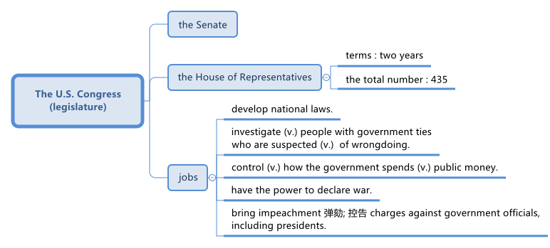

=  美国众议院的职责有哪些?
:toc: left
:toclevels: 3
:stylesheet: ../myAdocCss.css

'''

== What Is the US House of Representatives? 美国众议院是什么？

The U.S. Congress is the nation’s legislature 立法机关；立法机构. It is made of two parts: _the Senate_ 参议院 and _the House of Representatives_ (代表;众议院议员) 众议院.

_The House of Representatives_ is called “the House” for short. And sometimes it is called “the People’s House.”

That term was chosen as a nickname because `主` the men who wrote the U.S. Constitution in 1787 `谓` set few restrictions on who could serve there. They wanted the House to be *as close as possible* to everyday Americans.

One of the writers of the Constitution, James Madison, wrote about the House _years later_ 多年以后. He noted, “The door of this part of the federal government is open to merit 优点；美德；值得赞扬（或奖励、钦佩）的价值 of every description, whether native (a.)本地的；当地的 or adoptive (a.)收养的；有收养关系的, whether young or old, and *without regard (n.)注意；关注；关心 to* poverty or wealth, or *to* any particular profession 声明；宣称；表白 of religious faith.”

[.my2]
====

#美国国会, 是国家的立法机关。它由两部分组成："参议院"和"众议院"。# 众议院简称“众议院”。有时它被称为“人民之家”。 +
之所以选择这个词作为昵称，是因为 1787 年制定美国宪法的人对谁可以在美国任职几乎没有任何限制。他们希望众议院尽可能贴近普通美国人。 +

宪法起草者之一詹姆斯·麦迪逊几年后撰写了有关众议院的文章。他指出，“联邦政府这部分的大门向各种优点敞开，无论是本土的还是收养的，无论年轻还是年老，不考虑贫穷或财富，也不考虑任何特定的宗教信仰职业。”
====

The country’s Constitution-writers also *made* the terms 期限；任期 for _House members_ *short*, compared to the president and senators – only two years. One reason is so House members would have to stay *in close contact with* the people who live in the area they represent. Otherwise, voters would soon have a chance to push (v.) them out of office.

[.my2]
====

与总统和参议员相比，该国宪法起草者还缩短了##众议院议员的任期——只有两年。##原因之一是众议院议员必须与居住在他们所代表地区的人们保持密切联系。否则，选民很快就有机会将他们赶下台。
====

==== Speaking of voters…

[.my2]
说到选民……

One of the other central ideas 中心思想 about the House of Representatives is that known as “proportional 相称的；成比例的；均衡的 representation.” The idea was that /each member of the House would represent (v.) 30,000 U.S. citizens. That situation would enable _states with large populations_ to send (v.) more lawmakers to Congress.

The House continued to grow into the 20th century. Finally, in 1929, lawmakers officially limited the total number of House members to 435. Today, each member of the House represents (v.) about 700,000 people.

[.my2]
====

关于众议院的其他核心思想之一是所谓的“比例代表制”。这个想法是众议院的每位议员将代表 30,000 名美国公民。这种情况将使人口众多的州, 能够向国会派遣更多的议员。 +
进入 20 th 世纪，众议院继续发展。最终，在 1929 年，##立法者正式将众议院议员总数限制为 435 人。##如今，众议院每位议员代表约 70 万人。
====

==== What do _members of the House_ do?

Members of the House, along （与某人）一道，一起 the senators, develop (v.) national laws. They also help voters who live in their districts  地区；区域 deal with problems related to the government.

And _members of the House_ have other important jobs. They can investigate (v.) _people with government ties_ who are suspected (v.) 怀疑（某人有罪） of wrongdoing. For example, members of the House have looked into 调查；审查 cases of _bribery (n.)行贿；受贿；贿赂, corruption, and abuses of power_.

[.my2]
====

众议院议员做什么？ +
#众议院议员和参议员一起, 制定国家法律。他们还帮助居住在其选区的选民处理与政府有关的问题。# +
##众议院议员##还有其他重要的工作。##他们可以调查"与政府有关系的"人, 如果他们涉嫌不当行为的话。##例如，#众议院议员调查了贿赂、腐败和滥用权力案件。#
====

In the 1950s, the House _Un-American Activities Committee_ demanded (v.) information from private citizens 后定 suspected of communist activity. But critics said the committee had gone too far. In time, the Supreme Court limited Congress’ power to investigate (v.) issues related to the law, instead of people’s private beliefs.

Over its history, the House has brought _impeachment 弹劾; 控告 charges_ against government officials, including presidents, more than 60 times. But only a few officials were removed from office. Of those, some were federal judges accused of being drunk （酒）醉 at court 法院；法庭；审判庭.

[.my2]
====

20 世纪 50 年代，众议院"非美活动委员会"要求涉嫌共产主义活动的普通公民提供信息。但批评人士表示，该委员会做得太过分了。随着时间的推移，##最高法院限制了国会的权力，使得国会不能再调查人们的私人信仰，只能调查与法律相关的问题。##因此，国会被限制调查私人信仰，不能再对人们的信仰进行干涉。

历史上，众议院已对包括总统在内的政府官员提出弹劾指控 60 多次。但只有少数官员被免职。其中一些是被指控在法庭上醉酒的联邦法官。
====

==== ‘Power of the purse’ and war powers

[.my2]
“钱包的力量”和战争权力

Members of Congress also have what some call “the power of the purse 钱包.” In other words, they control (v.) how the government spends (v.) public money. +
The House of Representatives website explains that the Constitution-writers wanted *to put* _spending decisions_ 消费决策 *in* the hands of _the people’s representatives_ in Congress.

Similarly, the Constitution-writers did not want _the chief executive_ *to decide alone* whether to take the country to war. They wanted to make war *difficult to enter*. They also wanted to *prevent* the president *from* going to war because of political or personal interests. So they wrote that the Congress had the power to declare war. +
But in truth, lawmakers *have only officially “declared war”* 11 times. The last time was in 1942. Since then, Congress has simply approved (v.)批准，通过（计划、要求等） the use of military force.

[.my2]
====
##国会议员##还拥有一些人所说的“钱包的力量”。换句话说，他们##控制着政府如何支出公共资金。## +
众议院网站解释说，宪法起草者希望将"支出(如何花钱)的决定权", 交给国会人民代表。

同样，宪法起草者也不希望"行政长官"单独决定是否将国家带入战争。他们想让战争变得难以进入。他们还想阻止总统出于政治或个人利益而发动战争。所以他们写道，#国会有权宣战。# +
但事实上，议员们只正式“宣战”了11次。上一次是在1942年。此后，国会干脆只是"批准"允许使用军事力量。
====

'''

== (pure) What Is the US House of Representatives?

The U.S. Congress is the nation’s legislature. It is made of two parts: the Senate and the House of Representatives.

The House of Representatives is called “the House” for short. And sometimes it is called “the People’s House.”

That term was chosen as a nickname because the men who wrote the U.S. Constitution in 1787 set few restrictions on who could serve there. They wanted the House to be as close as possible to everyday Americans.

One of the writers of the Constitution, James Madison, wrote about the House years later. He noted, “The door of this part of the federal government is open to merit of every description, whether native or adoptive, whether young or old, and without regard to poverty or wealth, or to any particular profession of religious faith.”

The country’s Constitution-writers also made the terms for House members short, compared to the president and senators – only two years. One reason is so House members would have to stay in close contact with the people who live in the area they represent. Otherwise, voters would soon have a chance to push them out of office.

.Speaking of voters…

One of the other central ideas about the House of Representatives is that known as “proportional representation.” The idea was that each member of the House would represent 30,000 U.S. citizens. That situation would enable states with large populations to send more lawmakers to Congress.

The House continued to grow into the 20th century. Finally, in 1929, lawmakers officially limited the total number of House members to 435. Today, each member of the House represents about 700,000 people.

.What do members of the House do?

Members of the House, along the senators, develop national laws. They also help voters who live in their districts deal with problems related to the government.

And members of the House have other important jobs. They can investigate people with government ties who are suspected of wrongdoing. For example, members of the House have looked into cases of bribery, corruption, and abuses of power.

In the 1950s, the House Un-American Activities Committee demanded information from private citizens suspected of communist activity. But critics said the committee had gone too far. In time, the Supreme Court limited Congress’ power to investigate issues related to the law, instead of people’s private beliefs.

Over its history, the House has brought impeachment charges against government officials, including presidents, more than 60 times. But only a few officials were removed from office. Of those, some were federal judges accused of being drunk at court.

.‘Power of the purse’ and war powers

Members of Congress also have what some call “the power of the purse.” In other words, they control how the government spends public money.

The House of Representatives website explains that the Constitution-writers wanted to put spending decisions in the hands of the people’s representatives in Congress.

Similarly, the Constitution-writers did not want the chief executive to decide alone whether to take the country to war. They wanted to make war difficult to enter. They also wanted to prevent the president from going to war because of political or personal interests. So they wrote that the Congress had the power to declare war.

But in truth, lawmakers have only officially “declared war” 11 times. The last time was in 1942. Since then, Congress has simply approved the use of military force.

'''

