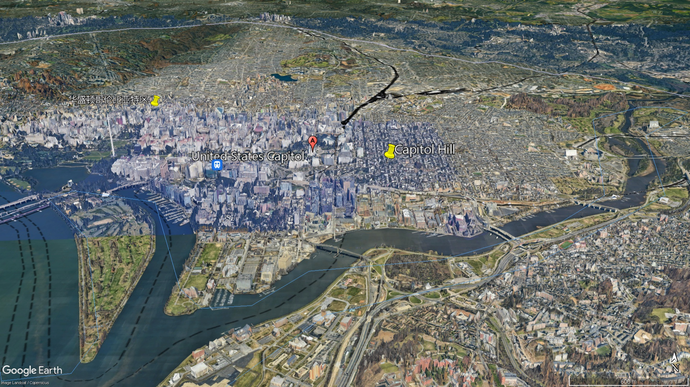
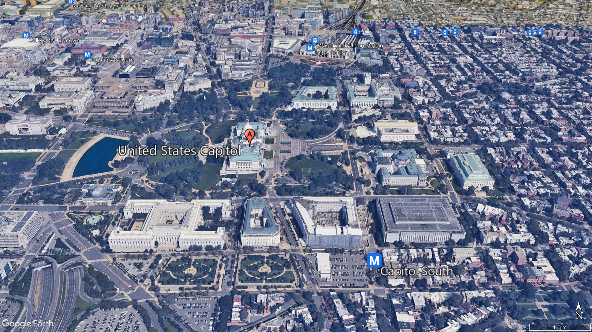
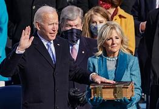

= 美国国会大厦, 是美国国会开会的地方, 也是总统发表"国情咨文"的地方.
:toc: left
:toclevels: 3
:stylesheet: ../myAdocCss.css

'''

== What Is the US Capitol Building? 美国国会大厦是什么？

image:../img/140.svg[,100%]

the Capitol （美国）国会大厦 building is the home of the U.S. Congress. In other words, the Capitol is the place where the country’s lawmakers meet to discuss, make and approve (v.) legislation. The House of Representatives meets (v.) in the building’s south wing. The Senate meets (v.) in its north wing.

The two large meeting rooms for lawmakers are called chambers 会议厅,（议会的）议院. Usually House members and senators meet in their own chambers. But from time to time 偶尔，有时，不时地, they gather together in the House chamber, which is larger.

[.my2]
##国会大厦, 是美国国会的所在地。##换句话说，##国会大厦是国家立法者开会讨论、制定和批准立法的地方。##众议院在大楼南翼举行会议。参议院在其北翼举行会议。 +
立法者的两个大会议室, 被称为"会议厅"。通常, 众议院议员和参议员在自己的议事厅开会。但他们时不时会聚集在更大的众议院议事厅。

[.my1]
.案例
====

.Capitol
United States Capitol (美国国会大厦) , 位于美国首都"华盛顿特区"的国会山.

image:../img/Capitol.png[,20%]

image:../img/Capitol-Campus-Map_Legend.jpg[,100%]

====

These gatherings 聚会 are called _joint sessions (（法庭的）开庭，开庭期；（议会等的）会议，会期) 联席会议 of Congress_ 国会联席会议. They happen (v.) at least once a year when the president gives a speech that is called _the State of the Union 国情咨文 address_ (n.)演说；演讲. Sometimes _joint sessions_ of Congress happen after an election 选举，推选（尤指从政） or when a foreign leader speaks.

[.my2]
====

##这些聚会称为"国会联席会议"。当总统发表称为"国情咨文"的演讲时，这种情况至少每年发生一次。##有时，"国会联席会议"会在选举后, 或外国领导人发表讲话时举行。
====

U.S. lawmakers also gather at the Capitol when a president is sworn-in 宣誓就职, 使宣誓就职. Years ago, those swearing-in ceremonies – called inaugurations 就职典礼 – sometimes took place inside the building. But today they usually are held outside. `主` Many people who have never visited Washington, DC `谓` may still recognize the Capitol building because they have seen pictures of it during a presidential inauguration.

[.my2]
##当总统宣誓就职时，##美国立法者##也会聚集在国会大厦。##多年前，这些宣誓仪式（称为就职典礼）有时在大楼内举行。但如今，它们通常在室外举行。许多从未访问过华盛顿特区的人可能仍然认出国会大厦，因为他们在总统就职典礼期间看过它的照片。

[.my1]
.案例
====
.sworn
(a.) made after you have promised to tell the truth, especially in court （尤指在法庭上）宣过誓的，宣誓证明的 +
-> a sworn statement 宣誓证词

.inauguration 就职典礼
inaugurate (v.)~ sb (as sth) to introduce a new public official or leader at a special ceremony 为（某人）举行就职典礼 / to officially open a building or start an organization with a special ceremony 为…举行落成仪式（或创建仪式） +
=> in-,进入，使，augur,占卜，预示，预兆。来自古希腊罗马时期通过占卜来决定吉凶，以及是否从事政治，经济，军事活动，但该词用来指就职。

====

'''

== What Is the US Capitol Building?

the Capitol building is the home of the U.S. Congress. In other words, the Capitol is the place where the country’s lawmakers meet to discuss, make and approve legislation. The House of Representatives meets in the building’s south wing. The Senate meets in its north wing.

The two large meeting rooms for lawmakers are called chambers. Usually House members and senators meet in their own chambers. But from time to time, they gather together in the House chamber, which is larger.

These gatherings are called joint sessions of Congress. They happen at least once a year when the president gives a speech that is called the State of the Union address. Sometimes joint sessions of Congress happen after an election or when a foreign leader speaks.

U.S. lawmakers also gather at the Capitol when a president is sworn-in. Years ago, those swearing-in ceremonies – called inaugurations – sometimes took place inside the building. But today they usually are held outside. Many people who have never visited Washington, DC may still recognize the Capitol building because they have seen pictures of it during a presidential inauguration.

'''

