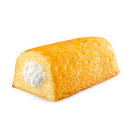

= 酒和干燥, 能降低微生物繁殖, 延长食物的保质期
:toc: left
:toclevels: 3
:sectnums:
:stylesheet: ../myAdocCss.css

'''

== Why Does Fruitcake Last (v.) So Long? 水果蛋糕为什么能保存这么久？

Nowadays fruitcakes are a holiday delicacy /still prized (v.)珍视；高度重视 for their long-lasting freshness. +

[.my2]
如今，水果蛋糕已成为节日美食，因其持久的新鲜度而备受推崇。 +

[.my1]
.案例
====
.prize
(v.)
[ usually passive]*~ sth (for sth)* : to value sth highly 珍视；高度重视 +
- an era /when honesty was prized above all other virtues尊诚实为美德之首的时代
====

According to the U.S. Department of Agriculture, these seemingly indestructible 不可摧毁的；破坏不了的 pastries 油酥糕点 /typically stay (v.) fresh for six months in the pantry 食品贮藏室；食品贮藏柜 /and *up to* a year when refrigerated. +

[.my2]
根据美国农业部的说法，这些看起来坚不可摧的糕点, 在食品储藏室里, 通常可以保鲜六个月，冷藏后可以保鲜一年。 +

[.my1]
.案例
====
.pastry
[ U]a mixture of flour 面粉, fat and water or milk that is rolled out flat and baked as a base or covering for pies , etc. 油酥面团；油酥面皮 +
image:../../img/pastry.jpg[,10%]

.pantry +
image:../../img/pantry.jpg[,10%]

====

One ingredient 成分；（尤指烹饪）原料 that bolsters (v.)改善；加强 fruitcake’s 水果蛋糕 longevity 长寿；长命；持久 /is alcohol. +

[.my2]
*延长水果蛋糕保质期的一种成分, 是酒精。* +

[.my1]
.案例
====
.bolster
-> 词源同 ball, 原来指鼓起来的垫子，枕头，护垫等，主要作名词使用。后来做动词使用，指支持，保护。
====

Many classic home recipes /involve (v.) soaking 浸泡；浸湿；浸透；湿透 the cake in rum 朗姆酒, brandy or bourbon 波旁威士忌酒—liquor 烈性酒 /that can add (v.) some flavor /but is mostly used for its antimicrobial properties 性质；特性. +

[.my2]
许多经典的家庭食谱, 都涉及将蛋糕浸泡在朗姆酒、白兰地或波本酒中，*这些酒可以增加一些风味，但主要是因为其"抗菌特性"。 +*

Alcohol makes a fruitcake more acidic (v.)酸性的, creating a harsh environment for many common foodborne 食物传播性 microbes. +
Booze 酒精饮料 destroys (v.) the cells of many bacteria, _mold 霉菌 spores_ 孢子 and other _potential pathogens_ (病原体；病原菌)潜在病原体 that survive (v.) the baking process /or accumulate (v.) when food *is left out* at room temperature. +

[.my2]
**酒精会使水果蛋糕变得更加酸性，为许多常见的食源性微生物, 创造了恶劣的环境。** +
*酒会破坏许多细菌、霉菌孢子和其他潜在病原体的细胞，这些病原体会在烘烤过程中存活下来，或者在食物放在室温下时, 积聚起来。* +

[.my1]
.案例
====
.booze
-> beer的变体，z音使语气更强烈。

.spore
( biology 生) one of the very small cells that are produced by some plants and that develop into new plants 孢子 +
-> 来自希腊语 spora,种子，播种，来自 speirein,播种，来自 PIE*sper,播洒，播种，词源同

*孢子（spore）是脱离亲本后, 能直接或间接发育成新个体的生殖细胞。* 孢子一般有休眠作用，能在惡劣的環境下保持自有的傳播能力，並再在有利條件之下才直接發育成新個體。孢子一般都是微小的單細胞。

====

But *even though* alcohol is common in _traditional homemade recipes_, _commercially prepared fruitcakes_ rarely contain (v.) it. +
The _shelf life_ （食品等的）货架期，保存期 of an alcohol-free 不含…的；免于 fruitcake /is likely shorter than one 后定 prepared with spirits 烈酒. +

[.my2]
但尽管酒精在传统的自制食谱中很常见，*但商业制作的水果蛋糕, 却很少含有酒精。* +
*不含酒精的水果蛋糕的保质期, 可能比用烈酒制作的水果蛋糕的保质期短。* +

The fruit in a fruitcake /is often dried 使变干 *instead of* fresh, which reduces (v.) moisture 潮气；水汽；水分 /and creates (v.) this dessert’s （饭后）甜点，甜食 notoriously (ad.)众所周知地，声名狼藉地 dry texture. This, *along with* the high sugar content, **sucks (v.) up** much of the water that bacteria need to survive. +

Foods with low amounts of moisture, like fruitcakes and Twinkies 夹馅面包, are resistant (a.)抵抗的；有抵抗力的 to the growth of microorganisms /because you need a certain amount of moisture for spoilage (n.)（食物的）变质，腐败 and pathogenic microorganisms 微生物，微生虫 to grow. +

[.my2]
**水果蛋糕中的水果, 通常是干的, 而不是新鲜(多汁)的，这会减少水分, **并造成这种甜点众所周知的干燥质地。 *这与高糖含量一起，吸收了细菌生存所需的大量水分。*
水分含量低的食品，如水果蛋糕和奶油夹心蛋糕，能够抵抗微生物的生长，*因为腐败和病原微生物的生长需要一定量的水分。* +

[.my1]
.案例
====
.Twinkies

====

commercially prepared fruitcakes and Twinkies /have antibacterial 灭菌的；抗菌的 and antifungal 抗真菌的；杀真菌的 preservatives (n.)防腐剂 to increase (v.) their _shelf life_. +

[.my2]
商业制备的水果蛋糕和奶油夹心, 含有抗菌和抗真菌"防腐剂"，以延长其保质期。 +

==== A FRUIT CAKE’S DENSE TEXTURE STALLS (v.)（使）熄火，抛锚;暂缓；搁置；停顿 STALENESS 腐败；陈腐 +

[.my2]
水果蛋糕的致密质地, 可防止变质 +

Fruitcakes have a reputation for being *as heavy as* a rock.
But it’s partly *thanks to* this high density /that they stay (v.) fresh longer #than# breads and cakes 后定 with light, fluffy 松软的;绒毛般的；覆有绒毛的 textures. +

[.my2]
水果蛋糕以重如岩石而闻名。
但部分归功于这种高密度，它们比质地轻盈、蓬松的面包和蛋糕, 保鲜时间更长。 +

The interplay (n.)相互影响（或作用） between density and moisture /influences (v.) how quickly foods become stale. +

[.my2]
"密度"和"湿度"之间的相互作用, 会影响食物变质的速度。 +

[.my1]
.案例
====
.stale
--> 来自 PIE*stel,放置，站立，词源同 stall,stand.引申比喻义久放的，陈腐的，污浊的。
====

When bread is baked, water in the dough （用于制面包和糕点的）生面团 /rearranges (v.)重新排列，重新整理 starch 淀粉；含淀粉的食物 molecules 分子 *from* a rigid structure *to* a disorganized (a.)缺乏组织的；杂乱无章的 one /that helps to form (v.) air pockets 气穴；气泡. +
Baked goods 后定 made  (v.)  with wetter dough /`谓` have more air pockets, which create (v.) a soft, light texture. +

[.my2]
烘烤面包时，面团中的水, 会将淀粉分子从"刚性结构", 重新排列成"无序结构"，从而有助于形成气穴。用湿面团制成的烘焙食品, 有更多的气穴，从而产生柔软、轻盈的质地。 +

[.my1]
.案例
====
.air pocket
1.a closed area that becomes filled with air 气窝 +
2.an area of low air pressure /that makes a plane suddenly drop while flying 气阱，气穴（使飞机突然下降的低气压区）
====

But the porousness 多孔性 also *exposes* (v.) more starches
淀粉质食品 *to* the outside air, which *draws out* water /and eventually shuffles (v.)把（纸张等）变换位置，打乱次序;洗（牌） the starch 淀粉；含淀粉的食物 molecules *back into* a solid crystalline (a.)晶状的 structure. _The resulting (a.)因而发生的，作为结果的 rigidity_ makes (v.) _once-supple (a.)易弯曲的；柔韧的 baked goods_ stale (a.)不新鲜的,陈腐的 and tough (a.) to chew. +

[.my2]
但多孔性, 也使更多的淀粉暴露在外部空气中，从而吸出水分，最终将淀粉分子重新打乱成固体晶体结构。 由此产生的刚性, 使曾经柔软的烘焙食品, 变得陈旧且难以咀嚼。 +

Fruitcake’s denser (a.)密集的；浓厚的 texture /allows (v.) far fewer _air pockets_ to form (v.), protecting (v.) more of the starches from the air. +

[.my2]
*水果蛋糕的质地更致密，形成的气穴要少得多，从而保护更多的淀粉免受空气的影响。* +

==== COULD YOU STOMACH (v.)能吃；吃得下 A 50-YEAR-OLD FRUITCAKE? +

[.my2]
您能接受 50 年的水果蛋糕吗？ +

Like a fine wine, a well-made 做工精良的 fruitcake can actually get more flavorful /over time. +
Tannins 丹宁酸；鞣酸类 *ooze (v.)（浓液体）渗出，慢慢流出 out of* the dried fruit, chemically changing (v.) the cake’s composition to produce a fruity and spicy (a.)加有香料的；用香料调味的 taste. +
Some bakers recommend (v.) intentionally 故意地，有意地 aging (v.) fruitcakes for a few weeks to months /in a cool, dark place /to enhance the taste and texture. +

[.my2]
就像美酒一样，精心制作的水果蛋糕, 实际上会随着时间的推移, 变得更加美味。
单宁从干果中渗出，通过化学方式改变蛋糕的成分，产生果香和辛辣的味道。
一些面包师建议故意将水果蛋糕放在凉爽、黑暗的地方陈化几周到几个月，以增强味道和质地。 +

[.my1]
.案例
====
.ooze
(v.) *~ from/out of/through sth |~ out |~ (with) sth* : if a thick liquid oozes from a place, or if sth oozes a thick liquid, the liquid flows from the place slowly（浓液体）渗出，慢慢流出 +
- Blood oozed (v.) out of the wound. 血从伤口慢慢流出来。
====

But these pleasant, complex flavors /only last (v.) about a year or two, Le says. +
This is because of oxidation 氧化, a process whereby chemical reactions between the food and oxygen /*transform* (v.) unsaturated 不饱和的 fatty acids 脂肪酸 *into* compounds 混合物，化合物 called _lipid 脂质；类脂 hydroperoxides_ 氢过氧化物. +
Further breakdown 分解 of these compounds /creates (v.) smaller molecules such as aldehydes 醛类；乙醛 and ketones 酮, which can create (v.) bitter or unpleasantly leatherlike flavors and aromas 芳香. +

[.my2]
但勒说，这些令人愉快、复杂的味道只能持续大约一两年。
这是因为氧化，这是食物和氧气之间发生化学反应, 将"不饱和脂肪酸", 转化为"脂质氢过氧化物"的化合物的过程。
这些化合物的进一步分解会产生更小的分子，例如醛和酮，它们会产生苦味或令人不愉快的皮革味道和香气。 +

The likelihood /that any of the fats in a [50-year-old] fruitcake *are* not oxidized or rancid /is pretty low. +
That said, even though a decades-old fruitcake /might taste (v.) like a leather shoe, eating it /probably won’t make you dangerously sick. +

[.my2]
50年的水果蛋糕中, 任何一种脂肪没有被"氧化"或"腐臭"的可能性都很低。
也就是说，尽管几十年前的水果蛋糕, 尝起来可能像皮鞋，但吃它可能不会让你患上危险的疾病。 +

[.my1]
.案例
====
.decade
a period of ten years, especially a period such as 1910–1919 or 1990–1999 十年，十年期（尤指一个年代）
====

the dessert’s _characteristic (a.)典型的；独特的；特有的 resistance_ to _pathogen growth_ /greatly reduces (v.) the risk of foodborne illnesses from _Escherichia coli_ 大肠杆菌 or _Salmonella bacteria_ 沙门氏菌. +

[.my2]
该甜点对"病原体生长"的独特抵抗力, 大大降低了大肠杆菌或沙门氏菌引起的食源性疾病的风险。

'''

== Why Does Fruitcake Last So Long?

Nowadays fruitcakes are a holiday delicacy still prized for their long-lasting freshness. According to the U.S. Department of Agriculture, these seemingly indestructible pastries typically stay fresh for six months in the pantry and up to a year when refrigerated.

One ingredient that bolsters fruitcake’s longevity is alcohol. Many classic home recipes involve soaking the cake in rum, brandy or bourbon—liquor that can add some flavor but is mostly used for its antimicrobial properties. Alcohol makes a fruitcake more acidic, creating a harsh environment for many common foodborne microbes. Booze destroys the cells of many bacteria, mold spores and other potential pathogens that survive the baking process or accumulate when food is left out at room temperature.

But even though alcohol is common in traditional homemade recipes, commercially prepared fruitcakes rarely contain it. The shelf life of an alcohol-free fruitcake is likely shorter than one prepared with spirits.

The fruit in a fruitcake is often dried instead of fresh, which reduces moisture and creates this dessert’s notoriously dry texture. This, along with the high sugar content, sucks up much of the water that bacteria need to survive. Foods with low amounts of moisture, like fruitcakes and Twinkies, are resistant to the growth of microorganisms because you need a certain amount of moisture for spoilage and pathogenic microorganisms to grow.

commercially prepared fruitcakes and Twinkies have antibacterial and antifungal preservatives to increase their shelf life.

A FRUIT CAKE’S DENSE TEXTURE STALLS STALENESS

Fruitcakes have a reputation for being as heavy as a rock. But it’s partly thanks to this high density that they stay fresh longer than breads and cakes with light, fluffy textures.

The interplay between density and moisture influences how quickly foods become stale. When bread is baked, water in the dough rearranges starch molecules from a rigid structure to a disorganized one that helps to form air pockets. Baked goods made with wetter dough have more air pockets, which create a soft, light texture. But the porousness also exposes more starches to the outside air, which draws out water and eventually shuffles the starch molecules back into a solid crystalline structure. The resulting rigidity makes once-supple baked goods stale and tough to chew. Fruitcake’s denser texture allows far fewer air pockets to form, protecting more of the starches from the air.

COULD YOU STOMACH A 50-YEAR-OLD FRUITCAKE?

Like a fine wine, a well-made fruitcake can actually get more flavorful over time. Tannins ooze out of the dried fruit, chemically changing the cake’s composition to produce a fruity and spicy taste. Some bakers recommend intentionally aging fruitcakes for a few weeks to months in a cool, dark place to enhance the taste and texture. But these pleasant, complex flavors only last about a year or two, Le says. This is because of oxidation, a process whereby chemical reactions between the food and oxygen transform unsaturated fatty acids into compounds called lipid hydroperoxides. Further breakdown of these compounds creates smaller molecules such as aldehydes and ketones, which can create bitter or unpleasantly leatherlike flavors and aromas. The likelihood that any of the fats in a [50-year-old] fruitcake are not oxidized or rancid is pretty low.

That said, even though a decades-old fruitcake might taste like a leather shoe, eating it probably won’t make you dangerously sick. the dessert’s characteristic resistance to pathogen growth greatly reduces the risk of foodborne illnesses from Escherichia coli or Salmonella bacteria.

'''

