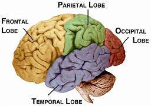

= 0047 John Fetterman Shows How Well the Brain Recovers after Stroke
:toc: left
:toclevels: 3
:sectnums:

'''

== John Fetterman Shows How Well the Brain Recovers after Stroke

John Fetterman, a Democratic candidate （竞选或求职的）候选人，申请人, suffered *an ischemic 缺血性的；局部缺血的 stroke* —the obstruction 堵塞，阻挡（通道等） of a vessel /that supplies (v.) blood to a part of the brain —in May. The blockage causes (v.) brain cells *to be starved (a.)挨饿; 饿死 of* essential oxygen and nutrients. Within minutes, the cells start to die.

Aphasia 失语症, or the inability to understand or express speech, is very common following a stroke, impacting an estimated 估计的，预计的 third of people who have one.  `主` Those /who have a stroke in their left brain hemisphere, which *serves as* the center of language processing in most people, /`系`  are particularly vulnerable （身体上或感情上）脆弱的，易受…伤害的. For the brain to recover, it must *modify* and *adapt to* this new injury, a process *known as* neural plasticity 可塑性；塑性. But neuroscientists 神经系统科学家 *still have many questions about* how the brain rewires 重新接线,给（建筑物或设备）换新电线, particularly *with regard to* 关于,至于 language.

*The fundamental mysteries 迷,神秘 (性) include* (v.) how `主`  the surviving brain regions /after a stroke /`谓`  *take over* 接管；接收 the functions of language /and why this reorganization process is more successful in some people than others, says Stephen Wilson, head of the Language Neuroscience Laboratory at Vanderbilt University. “There’s a lot to learn,” he adds.

[.my1]
.标题
====
.ischemic
/ɪsˈkiːmɪk/ adj.缺血性的；局部缺血的

.aphasia
/əˈfeɪʒə/ (n.)失语（症） +
-> 前缀a-，没有，不能。词根phas, 说话，同phone, 说话。-ia, 疾病后缀。

约翰·费特曼 (John Fetterman) 是民主党候选人, 他在 5 月发生了缺血性中风——向大脑的一部分供血的血管阻塞。阻塞导致脑细胞缺乏必需的氧气和营养。几分钟内，细胞开始死亡。

失语症，或无法理解或表达言语，在中风后很常见，估计有三分之一的人受到影响。 左脑半球中风的人尤其容易受到伤害，而左脑半球是大多数人的语言处理中心。为了使大脑恢复，它必须修改并适应这种新的损伤，这一过程称为神经可塑性。但神经科学家对大脑如何重新布线仍有许多疑问，尤其是在语言方面。

范德比尔特大学语言神经科学实验室负责人斯蒂芬威尔逊说，基本的谜团包括中风后幸存的大脑区域如何接管语言功能，以及为什么这种重组过程在某些人身上比其他人更成功。 “有很多东西要学，”他补充道。

====

When humans are young, both the right and left brain hemispheres /*are heavily involved in* speech, according to a 2020 study /published in the Proceedings 诉讼,会议录,论文集  of the National Academy of Sciences USA. The researchers found that, starting at around six years old, `主` the neural network /involved in language /`谓` gradually becomes more *confined (v.)限制，使局限；关押,使离不开 to* the left hemisphere —although the right hemisphere still *plays a role in* processing things such as the emotion in someone’s voice.

Young brains are very plastic 可塑的；有塑性的 /and far more *adept* (a.)内行的；熟练的；擅长的 than older brains *at* responding to injuries. In the womb 子宫 and early after birth, neurons are just developing /and `主` connections `系`  are just forming, so with any stroke /during that time, the brain *has a massive ability* to reorganize (v.)重新组织；改组；整顿 and rewire.

In fact, a study /published this month in PNAS /found that, following a stroke in an infant’s 婴儿；幼儿 left hemisphere, the language network /*flips (v.)（使）快速翻转，迅速翻动 over to* the right hemisphere. The investigation’s participants 参加者, who *ranged from* nine *to* 26 years old, have lived very normal and healthy lives /despite their early-life strokes, says Elissa Newport, *lead author* of the study /and director of the Center for *Brain Plasticity and Recovery* at Georgetown University.

[.my1]
.标题
====
.adept
(a.)~ (at/in sth)~ (at/in doing sth) good at doing sth that is quite difficult 内行的；熟练的；擅长的 SYN skilful

根据 2020 年发表在美国国家科学院院刊上的一项研究，当人类年轻时，右脑和左脑半球都会大量参与言语活动。研究人员发现，从六岁左右开始，与语言有关的神经网络逐渐变得更加局限于左半球——尽管右半球仍然在处理诸如某人声音中的情绪等事物方面发挥作用。

年轻的大脑具有很强的可塑性，并且比年长的大脑更善于应对伤害。 “在子宫内和出生后的早期，神经元刚刚发育，连接刚刚形成，所以在这段时间发生任何中风，大脑都具有重组和重新布线的强大能力.

事实上，本月发表在 PNAS 上的一项研究发现，在婴儿左半球中风后，语言网络会翻转到右半球。该研究的主要作者、乔治敦大学大脑可塑性和恢复中心主任 Elissa Newport 说，这项调查的参与者年龄从 9 岁到 26 岁不等，尽管他们早年中风，但他们过着非常正常和健康的生活。
====

How well the brain adapts, however, may be influenced by *the size of the lesion* （因伤病导致皮肤或器官的）损伤，损害 caused by the stroke. I had a stroke /while in the womb, resulting a hole /in my left temporal 太阳穴的；颞的 lobe 身体器官的）叶；（尤指）肺叶，脑叶, a crucial language area. Interestingly, my language network remained in my left hemisphere, possibly because the lesion （因伤病导致皮肤或器官的）损伤，损害 was small enough /that there was sufficient healthy brain tissue *left over* 剩下；留下 /for that network to operate (v.)运转；工作, Newport suggests.

It’s unclear /`主` how long this ability to reorganize (v.)重新组织；改组；整顿 language to the opposite hemisphere —or successfully move it to the remaining healthy tissue — `谓` lasts. Scientists do know, however, that *as people age*, the brain’s neural networks, including the one for language, become more fixed. “When this network is damaged in adulthood 成年,成人时期, *it’s not like* you can just rebuild that circuit elsewhere,” Wilson says. “There are only certain parts of the brain /that can do this.”

[.my1]
.标题
====
.lobe
/loʊb/ a part of an organ in the body, especially the lungs or brain （身体器官的）叶；（尤指）肺叶，脑叶 +
-> 来自希腊语lobos,耳垂，来自PIE*logwos,低垂。后用于指肺叶或脑叶。

然而，大脑的适应能力可能会受到中风引起的损伤大小的影响。我在子宫内时中风，导致我的左颞叶出现一个洞，这是一个重要的语言区域。有趣的是，我的语言网络保留在我的左半球，纽波特建议说，这可能是因为病变足够小，留下足够的健康脑组织供该网络运行。

目前尚不清楚这种将语言重组到另一半球的能力——或成功地将其转移到剩余的健康组织——能持续多久。然而，科学家们确实知道，随着人们年龄的增长，大脑的神经网络（包括语言神经网络）变得更加固定。 “当 [this network] 在成年期受损时，你无法在其他地方重建该回路，”Wilson 说。 “只有大脑的某些部分可以做到这一点。”
====

Consequently 因此，结果, the location of the stroke *is a big determinant* 决定因素；决定条件 in whether someone will be able to recover from their aphasia  失语（症） or not. In a study /published in April in Brain, Wilson’s lab /recruited 招聘，雇佣 334 adults with a left hemisphere stroke, including 218 /who were experiencing (v.)经历；感受到 aphasia, and found that /`主` those with a lesion near *the front of the brain* /`谓` recovered well from their initial aphasia. This was the case /even if the lesion *extended into* some parts of the left temporal 太阳穴的；颞的 /and *parietal 腔壁的；颅顶骨的 lobes* 顶叶；顶骨叶, respectively located (v.) behind the ear /and at the back and top of the head.

But `主` people who had significant lesions in *the temporoparietal 颞顶的 junction* 交叉路口，汇合处，枢纽站, an area in the back of *the temporal lobe* /where it meets *the parietal lobe*, `谓` experienced (v.) notable language deficits 赤字；逆差；亏损 /that lasted (v.) far longer *than* they did in the other adults. This region of the brain /has long *been known as* crucial for language —particularly a part of the back of *the left temporal lobe* 后定 called Wernicke’s area, which was discovered in 1874 /by German neurologist Carl Wernicke.

[.my1]
.标题
====
.temporoparietal junction
image:../img/temporoparietal junction.png[,300px]

因此，中风的位置, 是一个人能否从"失语症"中恢复的重要决定因素。在 4 月份发表在 Brain 杂志上的一项研究中，Wilson 的实验室招募了 334 名患有左脑半球中风的成年人，其中包括 218 名正在经历失语症的人，并发现, 那些在大脑前部附近有病变的人, 从最初的失语症中恢复得很好。即使病变扩展到左颞叶和顶叶的某些部分，分别位于耳后、头后部和顶部，情况也是如此。

但是，颞顶交界处（颞叶后部与顶叶相遇的区域）有明显损伤的人, 会经历明显的语言缺陷，持续时间比其他成年人长得多。长期以来，大脑的这个区域, 一直被认为对语言至关重要 ——尤其是左颞叶后部, 称为韦尼克区的部分，该区域于 1874 年, 由德国神经学家卡尔韦尼克发现。

====

The adult brain /still *has tremendous potential*  潜力，可能性;潜在的；可能的 to heal (v.) itself /within the first few months /following a stroke, says Kiran, who has seen *stroke patients* recover (v.) from aphasia /and *go back to* living a completely normal life. Experts disagree (v.)有分歧，意见不合,不一致 *as to* 至于，关于；就……而论 when this recovery process plateaus  (不再有变化或进展的) 稳定阶段,高原, but *it seems to be* around six to nine months /after the injury, she says. Still, more and more research is showing that /“`主` the ability for the brain /to continue to recover and reorganize `谓` continues (v.) all life long,” Kiran says.

[.my1]
.标题
====

Kiran 说，成年人的大脑在中风后的最初几个月内, 仍有巨大的自愈潜力，他已经看到中风患者从"失语症"中恢复过来, 并重新过上完全正常的生活。她说，专家们对这种恢复过程何时达到稳定状态, 意见不一，但似乎是在受伤后六到九个月左右。尽管如此，越来越多的研究表明，“大脑持续恢复和重组的能力会持续终生，”Kiran 说。
====

'''

== <pure> John Fetterman Shows How Well the Brain Recovers after Stroke

John Fetterman, a Democratic candidate, suffered an ischemic stroke—the obstruction of a vessel that supplies blood to a part of the brain—in May. The blockage causes brain cells to be starved of essential oxygen and nutrients. Within minutes, the cells start to die.

Aphasia, or the inability to understand or express speech, is very common following a stroke, impacting an estimated third of people who have one.  Those who have a stroke in their left brain hemisphere, which serves as the center of language processing in most people, are particularly vulnerable. For the brain to recover, it must modify and adapt to this new injury, a process known as neural plasticity. But neuroscientists still have many questions about how the brain rewires, particularly with regard to language.

The fundamental mysteries include how the surviving brain regions after a stroke take over the functions of language and why this reorganization process is more successful in some people than others, says Stephen Wilson, head of the Language Neuroscience Laboratory at Vanderbilt University. “There’s a lot to learn,” he adds.

When humans are young, both the right and left brain hemispheres are heavily involved in speech, according to a 2020 study published in the Proceedings of the National Academy of Sciences USA. The researchers found that, starting at around six years old, the neural network involved in language gradually becomes more confined to the left hemisphere—although the right hemisphere still plays a role in processing things such as the emotion in someone’s voice.

Young brains are very plastic and far more adept than older brains at responding to injuries. In the womb and early after birth, neurons are just developing and connections are just forming, so with any stroke during that time, the brain has a massive ability to reorganize and rewire.

How well the brain adapts, however, may be influenced by the size of the lesion caused by the stroke. I had a stroke while in the womb, resulting a hole in my left temporal lobe, a crucial language area. Interestingly, my language network remained in my left hemisphere, possibly because the lesion was small enough that there was sufficient healthy brain tissue left over for that network to operate, Newport suggests.

It’s unclear how long this ability to reorganize language to the opposite hemisphere—or successfully move it to the remaining healthy tissue—lasts. Scientists do know, however, that as people age, the brain’s neural networks, including the one for language, become more fixed. “When [this network] is damaged in adulthood, it’s not like you can just rebuild that circuit elsewhere,” Wilson says. “There are only certain parts of the brain that can do this.”

Consequently, the location of the stroke is a big determinant in whether someone will be able to recover from their aphasia or not. In a study published in April in Brain, Wilson’s lab recruited 334 adults with a left hemisphere stroke, including 218 who were experiencing aphasia, and found that those with a lesion near the front of the brain recovered well from their initial aphasia. This was the case even if the lesion extended into some parts of the left temporal and parietal lobes, respectively located behind the ear and at the back and top of the head.

But people who had significant lesions in the temporoparietal junction, an area in the back of the temporal lobe where it meets the parietal lobe, experienced notable language deficits that lasted far longer than they did in the other adults. This region of the brain has long been known as crucial for language—particularly a part of the back of the left temporal lobe called Wernicke’s area, which was discovered in 1874 by German neurologist Carl Wernicke.

The adult brain still has tremendous potential to heal itself within the first few months following a stroke, says Kiran, who has seen stroke patients recover from aphasia and go back to living a completely normal life. Experts disagree as to when this recovery process plateaus, but it seems to be around six to nine months after the injury, she says. Still, more and more research is showing that “the ability for the brain to continue to recover and reorganize continues all life long,” Kiran says.

'''
