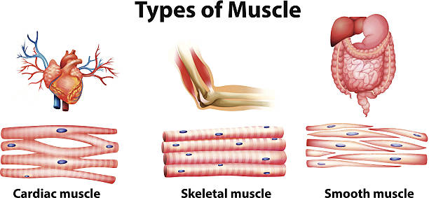

=  0073. How to Keep Muscles Strong as You Age 随着年龄的增长，如何保持肌肉强壮
:toc: left
:toclevels: 3
:sectnums:

'''

== How to Keep Muscles Strong as You Age 随着年龄的增长，如何保持肌肉强壮

Almost everyone shrinks （使）缩水，收缩 with old age. `主` *The exact 精确的；准确的 age* 后定 people start (v.) to see muscle mass 质量 `谓` *decline  varies*,  but many begin to see noticeable changes in their 30s. Studies suggest that muscle mass decreases by about 3 to 8 percent per decade 十年期 after age 30 and at higher rates after age 60. Losing that strength may *not only* be frustrating 使懊恼；使沮丧 in keeping up with 跟上，紧跟 daily activities *but* can *also* have significant 显著的 health consequences.

“If you look at who’s shrinking, and how much they’re shrinking, it predicts really important stuff 东西，玩意儿,基本特征；特质, like how long you’re going to live, how vulnerable you are to getting sick and having to be in the hospital, how likely you are to develop problems taking care of yourself,”

[.my1]
.标题
====
几乎每个人都会随着年龄的增长而萎缩。人们开始出现肌肉质量下降的确切年龄各不相同，但许多人在 30 多岁时就开始出现明显的变化。研究表明，30 岁后，肌肉质量每十年减少约 3% 至 8%，而 60 岁后下降速度更快。失去力量不仅会影响日常活动，还会对健康产生严重后果。

“如果你看看谁在萎缩，以及他们萎缩的程度，它会预测一些非常重要的事情，比如你能活多久，你会生病和住院的脆弱性程度有多少，你在照顾自己方面出现问题的可能性有多大。”
====

There are three main types of muscle tissue:

- *smooth muscle* 平滑肌；不随意肌 lines （在某物的内部）形成一层;沿…形成行（或列、排） the gut 消化道；肠道 wall and organs, except the heart;
- *cardiac 心脏的 muscle* is striated 有条纹的 and covers the heart;
- and *skeletal 骨骼的 muscle*, which can be found in the arms and legs, is also striated.

Skeletal muscle is often the kind that’s assessed (v.)评估，评定 for sarcopenia 肌肉减少症, a type of muscular 肌肉的 atrophy 萎缩 in which age-related loss (n.) of muscle and strength is accelerated (v. a.)使加速; 加速. Sarcopenia was classified as a disease in 2016.

Muscle tissue is made up of 由……组成，由……构成 long, slim fibers, each one containing a single muscle cell. The cells produce specific proteins — actin 肌动蛋白 and myosin 肌浆球蛋白 — that cause muscles *to contract （使）收缩，缩小 and relax* like rubber bands at different speeds. But as we age, there is a decline in the overall number of muscle cells —along with mitochondria 线粒体, which are essential for producing and storing energy in muscle. Mutations （生物物种的）变异，突变 build up *over time* 随着时间的推移，逐渐地 in the cells, sometimes causing the production of defunct 不再起作用的,失灵的 proteins, which makes those rubber bands overstretched or less snappy 活泼的；敏捷的.

[.my1]
.标题
====
.smooth muscle
( anatomy 解) the type of muscle found in the organs inside the body, that is not under conscious control 平滑肌；不随意肌

image:../../img/smooth muscle.jpg[,30%] +

.sarcopenia
肌肉减少症(Sarcopenia)是一种骨骼肌数量和力量减少,引发肌力下降、骨折、胰岛素抵抗等一系列临床症状的疾病。

.atrophy (n.)  (v.)  萎缩
前缀a-, 不，非。词根trophy, 营养，见hypertrophy, 营养过剩。

.muscle cell
image:../../img/muscle cell.jpg[,30%]

.actin
image:../../img/actin.webp[,50%]

.mitochondria
image:../../img/mitochondria.jpg[,20%]

.snappy
lively; quick 活泼的；敏捷的 +
-> snap,咬，抓，-y,形容词后缀。比喻用法。 +
• a snappy tune 活泼的曲调

肌肉组织主要分为三种类型：平滑肌、肠壁和器官（心脏除外）；心肌有横纹并覆盖心脏；手臂和腿部的骨骼肌也有横纹。骨骼肌通常是评估肌肉减少症的类型，肌肉减少症是一种肌肉萎缩症，其中与年龄相关的肌肉和力量损失加速。肌肉减少症于 2016 年被列为一种疾病。

肌肉组织由又长又细的纤维组成，每根纤维都含有一个肌细胞。这些细胞产生特定的蛋白质——肌动蛋白和肌球蛋白——导致肌肉像橡皮筋一样以不同的速度收缩和放松。但随着年龄的增长，肌肉细胞总数以及线粒体数量都会减少，而线粒体对于肌肉产生和储存能量至关重要。斯图登斯基说，随着时间的推移，细胞中的突变会不断累积，有时会导致产生失效的蛋白质，从而使橡皮筋过度拉伸或变得不那么灵活。
====

Faulty 不完美的；有错误的；有缺陷的 muscle proteins and mitochondria 线粒体, along with some other changes with age, have been linked to the impairment of the connection between muscles and the nervous system, called the neuromuscular 神经肌肉的 junction 汇合处；接合点. This junction between motor nerves and muscle tissue is where brain signals are transmitted 传送；输送 for muscle contraction 收缩；缩小 and movement. Issues in communication between nerves and muscles can create weakness and a decline in muscle mass.

[.my1]
.标题
====

有缺陷的肌肉蛋白质和线粒体，以及其他一些随着年龄的变化，与肌肉和神经系统之间的连接（称为神经肌肉接头）的损害有关。运动神经和肌肉组织之间的连接处, 是传输肌肉收缩和运动的大脑信号的地方。神经和肌肉之间的沟通问题, 会导致无力和肌肉质量下降。
====

Changes in hormone levels are also linked to age-related muscle loss. The gradual  逐渐的 decrease in testosterone 睾酮；睾丸素 we experience as we age, for example, can lead to a decrease  减少，降低 in the production of muscle proteins. Poor diet and malnutrition 营养不良 also influence muscle loss — generally, `主` appetite 食欲；胃口 and food intake （食物、饮料等的）摄取量，吸入量 `谓` tend to decrease with age.

[.my1]
.标题
====

激素水平的变化, 也与年龄相关的肌肉损失有关。例如，随着年龄的增长，睾丸激素逐渐减少，可能会导致肌肉蛋白质的产生减少。不良饮食和营养不良, 也会影响肌肉损失——一般来说，食欲和食物摄入量, 往往会随着年龄的增长而下降。
====

Though natural aging *plays a dominant role in* sarcopenia 肌肉减少症, lack of physical activity also contributes (v.) to the loss of muscle mass. As people age, they tend to become less active.

Sedentary (a.)需要久坐的;惯于久坐不动的 or less active lifestyles don’t always lead to muscle loss in older adults, but movement and exercise influence (v.) muscle size and strength. `主` Just a short break in muscle use `谓` can cause a reduction in muscle mass, even in younger people.

[.my1]
.标题
====
.sedentary +
词源同 sit,seat.-ary,形 容词后缀。引申词义久坐不动的，定居的等。

尽管自然衰老, 在肌肉减少症中起主导作用，但缺乏体力活动, 也会导致肌肉质量损失。格雷说，随着人们年龄的增长，他们往往会变得不那么活跃。久坐或不太活跃的生活方式, 并不总是会导致老年人的肌肉损失，但运动和锻炼, 会影响肌肉的大小和力量。即使在年轻人中，肌肉使用的短暂中断, 也会导致肌肉质量减少. (犹如宇航员在太空中, 不锻炼就会肌肉萎缩)
====

`主` Proper diet and physical activity `谓` can combat some age-related muscle loss. Maintaining muscle *comes down to* 主要涉及到,归根结底 continued movement. “*Doesn’t matter* 无关紧要, 无所谓 if you garden (v.)做园艺工作  or if you ride a bicycle like I do or if you go to the gym,” she says. “You can help maintain your muscle mass by continuing to do the things that you're already doing.”

[.my1]
.标题
====

格雷说，适当的饮食和身体活动, 可以对抗一些与年龄相关的肌肉损失。保持肌肉, 归根结底就是持续运动。 “无论你是否像我一样园艺、骑自行车或去健身房，都没有关系，”她说。 “你可以通过继续做你已经在做的事情, 来帮助保持你的肌肉质量。”
====

Research over the decades have shown that resistance training in older adults can help to increase muscle mass. Several types of resistance training and exercises can help older adults, but Gray recommends high-velocity 速度 resistance-training 阻力训练 programs. High-velocity resistance training targets muscle power (lifting weight quickly) in addition to strength (lifting a heavier weight). Typically, high-velocity training is practiced among athletes 运动员,擅长运动的人, such as football players, but Gray says basic exercises, such as power chair 电动轮椅 stands, leg lifts and triceps 三头肌 extensions, can also help older adults perform daily life activities.

[.my1]
.标题
====
.resistance-training 阻力训练
举重等重物进行的锻炼活动，尤其是为了增强肌肉力量。

.tricep
image:../../img/tricep.png[,30%]

几十年来的研究表明，老年人的阻力训练, 有助于增加肌肉质量。几种类型的阻力训练和练习, 可以帮助老年人，但格雷建议采用高速阻力训练计划。除了力量（举起较重的重量）之外，高速阻力训练还针对肌肉力量（快速举起重量）。通常情况下，运动员（例如足球运动员）会进行高速训练，但格雷表示，基本练习（例如电动椅站立、抬腿和三头肌伸展）, 也可以帮助老年人进行日常生活活动。
====

Muscle loss is a common contributor to severe falls and accidents that lead to injury or physical disability in older adults. Low muscle mass from sarcopenia 肌肉减少症 can impact how well individuals can *cope with* cancer treatment, surgeries and heart and lung problems, Studenski says. It’s why understanding the causes of muscle loss and *keeping up with* regular activity is important as we age, Gray says. Remember, bulk （大）体积；大（量） isn’t everything, she adds. Even if people don’t notice muscle mass gains (v.)获得；赢得;获益 through resistance training at first, “you actually get stronger *long before* your muscles get bigger,” Studenski says. “That exercise is doing something to the wiring （给建筑物或机器供电的）线路 to the nervous system connection to the muscle.”

[.my1]
.标题
====

.wiring
(n.)[ U] the system of wires that is used for supplying electricity to a building or machine （给建筑物或机器供电的）线路 +
• to check the wiring 检查线路

image:../../img/wiring.jpg[,30%]

肌肉损失, 是导致老年人受伤, 或身体残疾的严重跌倒和事故的常见原因。斯图登斯基说，肌肉减少症导致的低肌肉质量, 会影响个人应对癌症治疗、手术以及心肺问题的能力。格雷说，这就是为什么随着年龄的增长，了解肌肉损失的原因, 并保持定期活动很重要。她补充道，请记住，体积并不是一切。即使人们一开始没有注意到通过阻力训练获得的肌肉质量增加，“实际上，早在你的肌肉变大之前, 你就变得更强壮了，”斯图登斯基说。 “这项练习正在对神经系统与肌肉的连接产生影响。”
====

'''

== How to Keep Muscles Strong as You Age

Almost everyone shrinks with old age. The exact age people start to see muscle mass decline varies,  but many begin to see noticeable changes in their 30s. Studies suggest that muscle mass decreases by about 3 to 8 percent per decade after age 30 and at higher rates after age 60. Losing that strength may not only be frustrating in keeping up with daily activities but can also have significant health consequences.

“If you look at who’s shrinking, and how much they’re shrinking, it predicts really important stuff, like how long you’re going to live, how vulnerable you are to getting sick and having to be in the hospital, how likely you are to develop problems taking care of yourself,”

There are three main types of muscle tissue: smooth muscle lines the gut wall and organs, except the heart; cardiac muscle is striated and covers the heart; and skeletal muscle, which can be found in the arms and legs, is also striated. Skeletal muscle is often the kind that’s assessed for sarcopenia, a type of muscular atrophy in which age-related loss of muscle and strength is accelerated. Sarcopenia was classified as a disease in 2016. Muscle tissue is made up of long, slim fibers, each one containing a single muscle cell. The cells produce specific proteins—actin and myosin—that cause muscles to contract and relax like rubber bands at different speeds. But as we age, there is a decline in the overall number of muscle cells—along with mitochondria, which are essential for producing and storing energy in muscle. Mutations build up over time in the cells, sometimes causing the production of defunct proteins, which makes those rubber bands overstretched or less snappy, Studenski says.

Faulty muscle proteins and mitochondria, along with some other changes with age, have been linked to the impairment of the connection between muscles and the nervous system, called the neuromuscular junction. This junction between motor nerves and muscle tissue is where brain signals are transmitted for muscle contraction and movement. Issues in communication between nerves and muscles can create weakness and a decline in muscle mass.

Changes in hormone levels are also linked to age-related muscle loss. The gradual decrease in testosterone we experience as we age, for example, can lead to a decrease in the production of muscle proteins. Poor diet and malnutrition also influence muscle loss—generally, appetite and food intake tend to decrease with age.

Though natural aging plays a dominant role in sarcopenia, lack of physical activity also contributes to the loss of muscle mass. As people age, they tend to become less active.

Sedentary or less active lifestyles don’t always lead to muscle loss in older adults, but movement and exercise influence muscle size and strength. Just a short break in muscle use can cause a reduction in muscle mass, even in younger people.

Proper diet and physical activity can combat some age-related muscle loss, Gray says. Maintaining muscle comes down to continued movement. “Doesn’t matter if you garden or if you ride a bicycle like I do or if you go to the gym,” she says. “You can help maintain your muscle mass by continuing to do the things that you're already doing.”

Research over the decades have shown that resistance training in older adults can help to increase muscle mass. Several types of resistance training and exercises can help older adults, but Gray recommends high-velocity resistance-training programs. High-velocity resistance training targets muscle power (lifting weight quickly) in addition to strength (lifting a heavier weight). Typically, high-velocity training is practiced among athletes, such as football players, but Gray says basic exercises, such as power chair stands, leg lifts and triceps extensions, can also help older adults perform daily life activities.

Muscle loss is a common contributor to severe falls and accidents that lead to injury or physical disability in older adults. Low muscle mass from sarcopenia can impact how well individuals can cope with cancer treatment, surgeries and heart and lung problems, Studenski says. It’s why understanding the causes of muscle loss and keeping up with regular activity is important as we age, Gray says. Remember, bulk isn’t everything, she adds. Even if people don’t notice muscle mass gains through resistance training at first, “you actually get stronger long before your muscles get bigger,” Studenski says. “That exercise is doing something to the wiring to the nervous system connection to the muscle.”

'''

