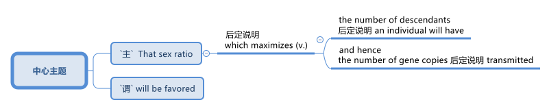

= 001
:toc: left
:toclevels: 3
:sectnums:
:stylesheet: ../../../../myAdocCss.css

'''

- (001.) #That sex ratio# 性别比例 will *be favored* (v.)将被青睐,将被选择  后定说明 #which# maximizes (v.) 使最大化 ① #the number# of descendants 后代；后裔 后定说明 an individual will have /and hence 因此；所以 ② #the number# of _gene copies_ 基因拷贝 后定说明 transmitted (v.) 传递；传播.

'''

- (001.) That sex ratio will be favored which maximizes the number of descendants an individual will have and hence the number of gene copies transmitted.

那种能"使个体后代数量最大化"、从而"使基因副本传递数量最大化"的性别比例，将会受到青睐。

[.small]
[options="autowidth" cols="1a,1a"]
|===
|Header 1 |Header 2

|语序
|正常语序 (还原后)： +
The sex ratio​ (which maximizes (v.) the number of descendants 后定说明 an individual will have /and hence the number of _gene copies_ transmitted (v.) ) will be favored. +
直译：那个（能使"个体拥有的后代数量"最大化，从而也使传递的"基因副本数量"最大化的）性别比例, 将受到青睐。 +

即: +
原句： That sex ratio will be favored [which maximizes...] +
还原： [That sex ratio which maximizes...] will be favored.

|That sex ratio will be favored (v.) ... 中的 favored 是动词还是形容词?
|favored 是 动词（具体说是动词的过去分词），与前面的 "will be" 构成了被动语态。

主语： That sex ratio which maximizes the number of descendants...（那种能使后代数量最大化的性别比） +
谓语： will be favored (v.) （将被青睐 / 将被选择）

为什么它看起来像形容词？ +
**在英语中，很多"过去分词"（如 interested, broken）确实可以转换成"形容词"。##但在“will be + 过去分词”这种表达"将来被动语态"的句子中，它的动词属性更强，##**强调的是一种进化的筛选过程。

|which maximizes (v.) ... 中的 which, 修饰的是哪个?
|#*which maximizes (v.) ... 这个定语从句，修饰前面的主语 “That sex ratio”.*#

|the number of gene copies 后定说明  transmitted​(v.)  (被传递的基因副本数量)
|其中 *transmitted*​ 是过去分词**作"后置定语"，**相当于 gene copies that are transmitted (被传递的基因副本)。
|===

