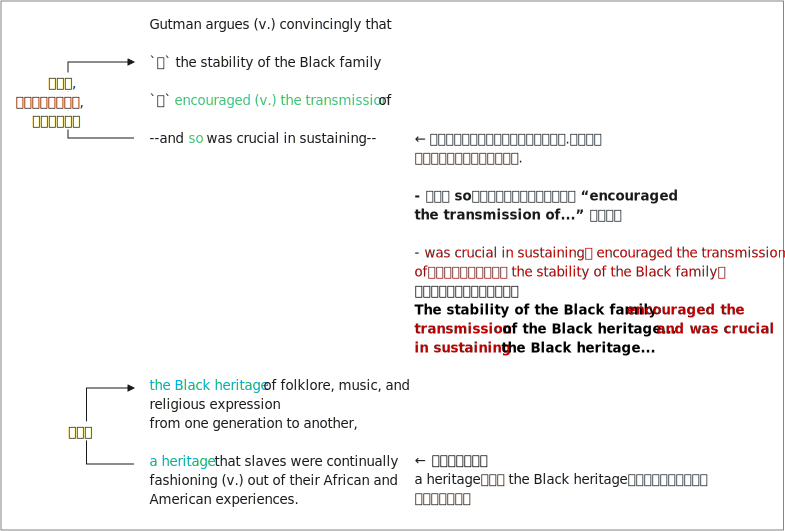

= 007
:toc: left
:toclevels: 3
:sectnums:
:stylesheet: ../../../../myAdocCss.css

'''

- (007.) Gutman *argues convincingly 有说服力地 that* 令人信服地论证说 /`主` the stability of Black family `谓` encouraged #the transmission 传播；传递 of# --and so 因此、所以 was crucial 至关重要的 in sustaining (v.) --#the Black heritage 遗产；传统 of# folklore 民间传说, music, and religious expression 宗教表达 from one generation to another, 同位语 #a heritage#  遗产，传统 that slaves were continually fashioning (v.) 塑造；形成 out of their African and American experiences 经历. +

'''

- (007.) Gutman argues convincingly that the stability of the Black family encouraged the transmission of--and so was crucial in sustaining--the Black heritage of folklore, music, and religious expression from one generation to another, a heritage that slaves were continually fashioning out of their African and American experiences.

古特曼令人信服地论证道，黑人家庭的稳定, 促进了黑人民间传说、音乐和宗教表达等遗产的传承——因此在维持这些遗产方面至关重要——而这些遗产, 是奴隶们根据其非洲和美洲的经历, 不断塑造而成的。
