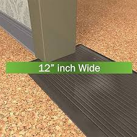

= 010
:toc: left
:toclevels: 3
:sectnums:
:stylesheet: ../../../../myAdocCss.css

'''

- (010.) `主` #*Such* variations# 变化；差异 in size, shape, chemistry 化学；化学成分，化学反应, _conduction speed_ 传导速度, excitation threshold (门槛，门口；阈，界，起始点；开端，起点) 兴奋阈值, and the like #*as*# had been demonstrated (v.证明，证实)像……已经被证明的那样 in nerve cells 神经细胞 `谓` #remained (v.) negligible 微不足道的；可忽略的 in significance# 重要性，意义 /for 对于...而言 any _possible correlation_ 关联；相关性 with the _manifold (a.)多种多样的；多方面的 dimensions_ 多种维度 of mental experience 心理体验. +

[.my1]
.案例
====
- (010.) Such variations in size, shape, chemistry, conduction speed, excitation threshold, and the like as had been demonstrated in nerve cells remained negligible in significance for any possible correlation with the manifold dimensions of mental experience.

神经细胞中已显示的尺寸、形状、化学性质、传导速度、兴奋阈值等方面的变异，对于其与心理经验的多重维度之间可能存在的任何关联来说，其重要性仍然微不足道。

尽管（在神经细胞层面）科学家们已经发现了各种各样的物理/化学差异（如大小、形状等），但作者认为，这些差异对于解释我们复杂的心理体验（思想、情感、意识的各种维度）来说，其意义是微不足道的。也就是说，作者在否定一种简单的“神经差异决定心理差异”的"还原论"观点。

.#*Such*# variations in size, shape, chemistry, conduction speed, excitation threshold, and the like #*as*# had been demonstrated in nerve cells

▶ DeepSeek:

Such... as...是一个固定搭配，意思是“像……那样的……”。这里的 as从句，就是在具体定义“像什么样”的差异。
• +
作用：限定了这是“哪一类”差异。即，*是“已经在神经细胞中被证明存在的”那种差异。*

....
核心主语：[Such variations]
         │
         ├─── 定语1 (in...)：说明是哪些“方面”的差异。
         │    └─ in [size, shape, chemistry, conduction speed, excitation threshold, and the like]
         │
         └─── 定语2 (as...)：说明是“什么样”的差异。
              └─ as [had been demonstrated in nerve cells]
                 （“像……已经被证明的那样”）
....

验证方法：尝试将 as从句移到 in...短语前面，看是否改变原意。

- 原结构：variations in X, Y, Z #*as had been demonstrated*#...
- 调整后：variations #*as had been demonstrated*#... in X, Y, Z

含义几乎不变，都表示“已被证明的、在X,Y,Z方面的差异”。#*这证明了 as从句和 in短语是"平行地"修饰核心词 variations​ 的。*#

▶ gemini:

`主` #*Such variations*# in size, shape, chemistry, conduction speed, excitation threshold, and the like #*as had been demonstrated*# in nerve cells `谓` remained negligible in significance...

它涉及到了一个由 as 引导的定语从句，并且这个 as 具有一种特殊的指代功能。 +

在 Such... as... 结构中，#*as 引导的从句, 用来对 Such 后面修饰的名词, 进行限定或说明。翻译成中文通常是：“像……那样的（差异）”。*#

- 主语： *Such* variations... #*as had been demonstrated（那些已被证明的差异）*#
- 谓语： remained（依然、保持）
- 表语： negligible in significance（在重要性上微不足道）
- 目的/对象： for any possible correlation with...（对于与……的任何可能关联）

翻译： 虽然神经细胞在大小、形状、化学性质等方面存在差异（而且这些差异已经被实验证明了），但这些差异在解释“复杂的心理体验”时，依然显得微不足道。 +
作者想强调：“虽然我们发现了差异，但这些差异解释不了问题。”

在这种结构中，as 经常可以被看作是 that 或 which 的“双胞胎”，但它专门喜欢和 such 或 the same 搭配。

- Read #*such books as (which)*# will do you good. (读**那些书**对你有好处。)

.as引导的定语从句

- I'll buy *the same bike /后定 as I lost* yesterday.
- She wore *the same dress /that she wore* at Marys wedding. 她穿着她在May婚礼上穿过的同一条裙子。
- She wore *the same dress /as her young sister wore*. 她穿着和她妺妺所穿的一样的裙子。

.threshold +
门槛，门口；阈，界，起始点；开端，起点，入门；机场跑道入口

====

'''

