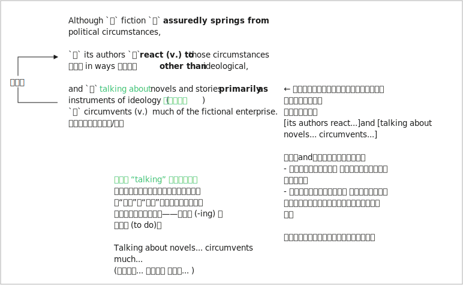

= 021
:toc: left
:toclevels: 3
:sectnums:
:stylesheet: ../../../../myAdocCss.css

'''

- (021.) Although fiction 小说 assuredly 无疑地；确定地 *springs (v.)跳；跃；蹦  from* 源于；来自;突如其来地从（某处）出现 political circumstances,  ① `主` its authors `谓` *react (v.) to* those circumstances *in ways* 以...方式 后定说明 other than 除了……以外 ideological (意识形态的)除意识形态之外的, and ② `主` #*talking about* novels and stories# *primarily 主要地，首要地，根本地 as* _instruments 仪器；[机]工具 of ideology_ 意识形态 `谓` #circumvents# (v.)规避；绕过 much of _the fictional enterprise_ (事业心，进取心;事业；事业体)指“小说创作/小说艺术这项事业或工程”. +

'''

- (021.) Although fiction assuredly springs from political circumstances, its authors react to those circumstances in ways other than ideological, and talking about novels and stories primarily as instruments of ideology circumvents much of the fictional enterprise.

尽管小说无疑源于政治环境，但其作者对这些环境的反应, 并非只是意识形态层面的，而将小说和故事主要当作意识形态的工具来谈论，会忽视小说创作的诸多方面。

.its authors `谓` *react (v.) to* those circumstances

react +
(v.)  *~ (to sth) (by doing sth)* : to change or behave in a particular way as a result of or in response to sth 起反应；（对…）作出反应；回应 +
•Local residents have *reacted angrily to* the news. 当地居民对这一消息表示愤怒。 +
•I nudged her /but she didn't react. 我用胳膊肘捅了她一下，可她没有反应。

(v.) to become ill/sick after eating, breathing, etc. a particular substance（对食物等）有不良反应，过敏 +
•People can *react (v.) badly to* certain food additives. 人们对某些食品添加剂会严重过敏。

