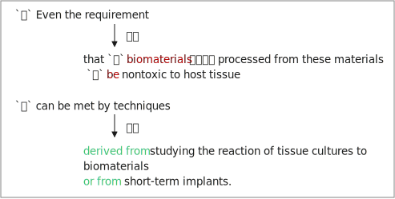

= 039
:toc: left
:toclevels: 3
:sectnums:
:stylesheet: ../../../../myAdocCss.css

'''

- (039.) `主` #*Even the requirement*# 要求 后定说明 #that# `主` biomaterials 生物材料 后定说明 processed 加工；处理 from these materials `系` #*be* nontoxic 无毒的 to# host tissue 宿主组织 `谓` #*can be met*# 满足 by techniques 技术 *derived from* 源自；来源于 studying (v.) _the reaction 反应 of tissue cultures 组织培养 to biomaterials_ 生物材料 *or from* _short-term 短期的 implants_ 植入物.

[.my1]
.案例
====
- (039.) Even the requirement that biomaterials processed from these materials be nontoxic to host tissue can be met by techniques derived from studying the reaction of tissue cultures to biomaterials or from short-term implants.

即使是要求"从这些材料中加工出的生物材料, 对宿主组织无毒"，也可以通过研究组织培养物对生物材料的反应, 或通过短期植入物获得的技术, 来满足。

即使是这样的要求，［即（从这些材料中加工出来的）生
物材料么应该对"受移植者的组织"无害］，也能够/通过［从研究（组织培
养对生物材料的）反应而来的，或从"研究短期移植"而来的］技术/来满
足。

.DeepSeek:

[.my3]
[options="autowidth" cols="1a,1a"]
|===
|Header 1 |Header 2

|主干结构：
Even the requirement... can be met by techniques  derived from... or from...
|主语：​ Even the requirement（甚至这个要求） +
谓语：​ can be met（可以被满足） +
方式状语：​ by techniques derived from... or from...（通过...或...的技术）

|Even the requirement 后定说明 that `主` *biomaterials* processed from these materials `系` *be nontoxic to* host tissue
|- that... 同位语从句，解释前面 requirement 的具体内容
- 结构：that + 主语 + *(should) be + 表语（虚拟语气结构）*

- 主语：biomaterials 后定说明  processed (v.) from these materials（从这些材料加工的生物材料） +
.. 过去分词短语作后置定语：processed 后定说明 from these materials（从这些材料加工的）
- 系表结构：be nontoxic (a.) to host tissue（对宿主组织无毒）

#*在 requirement 等表示"要求、建议"的名词后的同位语从句中，常用虚拟语气（should + 动词原形，should可省略），所以这里用be而不是are。*#

|Even the requirement that ... can be met by techniques *derived from* studying the reaction of tissue cultures to biomaterials *or from* short-term implants.
|by techniques derived from studying... or from short-term implants

• 介词短语作方式状语，说明"如何满足要求"
• 核心：techniques（技术）
• 后置定语：derived from... or from...（来源于...或...的）
.. 并列来源1：studying (v.) the reaction of _tissue cultures_ 组织培养物 to biomaterials（研究 "组织培养物"对生物材料的反应）
.. 并列来源2：short-term implants（短期植入物）
|===

'''
