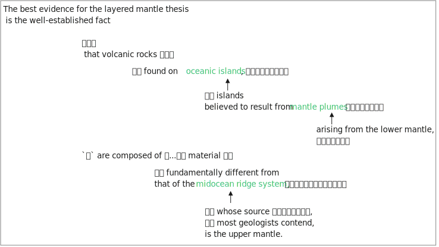
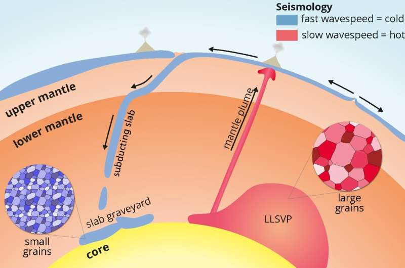

= 050
:toc: left
:toclevels: 3
:sectnums:
:stylesheet: ../../../../myAdocCss.css

'''

- (050.) #The best evidence# 证据 for the _layered 分层的 mantle 地幔 thesis_ 论点；论题；论文 #is# _the well-established 公认的；既定的 fact_ that `主` #volcanic 火山的 rocks# 后定说明 found on oceanic 海洋的；大洋的 islands, islands 后定说明 believed to result from 由……引起；产生于 mantle plumes 地幔柱 后定说明 arising from 起源于；产生于 the lower 下部的；下方的 mantle, `谓` #*are composed of*# 由……组成 material (n.)材料；原料 后定说明 fundamentally 根本上；从根本上说 different from 与……不同 that of _the midocean (n.)海洋中央；洋中 ridge 海岭 system_ 系统, `主` #whose source# 来源；源头, most geologists 地质学家 contend (v.)主张；认为；声称, `系` #is# the upper 上部的；上方的 mantle.

'''

- (050.) The best evidence for the layered mantle thesis is the well-established fact that volcanic rocks found on oceanic islands, islands believed to result from mantle plumes arising from the lower mantle, are composed of material fundamentally different from that of the midocean ridge system, whose source, most geologists contend, is the upper mantle.

我的翻译:最佳证据(关于地幔分层理论的), 是公认的事实：*火山岩* (该火山岩是发现于"海洋岛屿"上的, 该岛屿被认为是起源于"地幔柱"的, 该地幔柱是起源于"下地幔"上升的), *是由材料组成的* (这些材料根本不同于"洋中脊系统", 洋中脊系统的来源(大多数地质学家认为)源自"上地幔").

地幔分层理论的最佳证据是这样一个公认的事实：在海洋岛屿上发现的火山岩（这些岛屿被认为是地幔柱从下地幔上升形成的），其物质组成与"洋中脊系统"（大多数地质学家认为其源自上地幔）的物质根本不同。

对于地幔分层论来说，/最好的证据就是这样的一个确凿的
事实，{即（在海洋上的岛屿——即人们相信是产生于从下层地幔中升
起来的地幔柱的那些岛屿——上发现的）火山岩石是形成/于一些这样
的材料，［此材料从根本上不同于构成中部海脊的材料，（而中部海脊
的来源，很多地质学家论辩道，是上层地幔）］}。

.DeepSeek

关键术语 +
layered mantle thesis：分层地幔论题（地幔分为上、下地幔的理论） +
oceanic islands：海洋岛屿（如夏威夷、冰岛等热点火山岛） +
mantle plumes：地幔柱（从地幔深处上升的热物质流） +
midocean ridge system：洋中脊系统（海底扩张中心） +
upper mantle：上地幔 +
lower mantle：下地幔 +

.The best evidence for ... is the well-established fact that...

*well-established fact ：译为"已确立的事实"而非"众所周知的事实"，因为 well-established 在学术语境中强调 "科学界已接受、证据充分"​ ，而不仅仅是"很多人知道"。*

.volcanic rocks found on oceanic islands, ..., *are composed of* #material# 后定说明 *fundamentally different from* #that# of the midocean ridge system

- fundamentally different ：译为"根本不同"而非"基本不同"，因为 fundamentally 强调 本质上的、根本性的差异。

- that of the midocean ridge system : #*that 指代 material，避免重复*#

