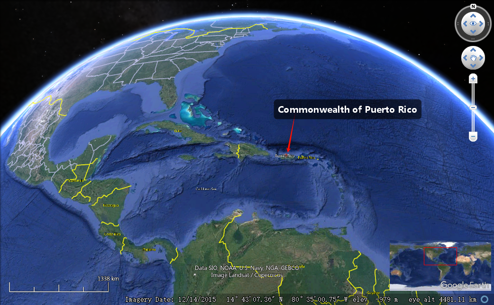

= 068
:toc: left
:toclevels: 3
:sectnums:
:stylesheet: ../../../../myAdocCss.css

'''

=== 句子

- (068.) Even `主` _##the “radical” 激进的；极端的 critiques##_ 批评；批判 of _the mainstream 主流的 research 研究 model_ 模型；模式, such as _the critique 批评；批判 后定说明 developed (v.)发展；形成 in Divided Society_, `谓` #*attach*# (v.)把……固定；把……附（在……上） the issue 问题；议题 of _ethnic 民族的；种族的 assimilation_ 同化；吸收 too mechanically 机械地；呆板地 #*to*# factors 因素；要素 of _economic 经济的 and social 社会的 mobility_ 流动性；移动性 /and *are thus 因此；所以 unable 不能的；无法的 to illuminate* (v.)阐明；说明 _the cultural 文化的 subordination_ 从属地位；隶属 of Puerto Ricans 波多黎各人 as _a colonial 殖民的 minority_ 少数群体；少数民族.

[.my2]
甚至对主流研究模式的“激进”批评 (例如《分裂的社会》一书中提出的那种批评)，也将"民族同化问题", 过于机械地与"经济和社会流动性因素"联系起来，因而无法阐明波多黎各人 (作为一个殖民少数族裔) 在文化上的从属地位。

[.my1]
.案例
====
- (068.) Even the “radical” critiques of the mainstream research model, such as the critique developed in Divided Society, attach the issue of ethnic assimilation too mechanically to factors of economic and social mobility and are thus unable to illuminate the cultural subordination of Puerto Ricans as a colonial minority.

即使是对主流研究模式的“激进”批判，例如《分裂社会》中提出的批判，也过于机械地将民族同化问题与经济和社会流动性因素联系起来，因此无法阐明波多黎各人作为殖民地少数民族的文化从属地位。

....
【句子主干】
├─ 状语：Even
├─ 主语：the “radical” critiques
│       │
│       └─ 【后置定语】 of the mainstream research model
│            │
│            └─ 【同位语举例】 , such as the critique developed in Divided Society,
│                 │
│                 └─ 【后置定语 (修饰 critique)】 developed in Divided Society
├─ 谓语1：attach (v.)
├─ 宾语1：the issue
│       │
│       └─ 【后置定语】 of ethnic assimilation
├─ 状语1 (方式)：too mechanically
├─ 状语1 (对象)：to factors
│       │
│       └─ 【后置定语】 of economic and social mobility
├─ 并列连词：and
├─ 谓语2：are thus unable (a.) to illuminate (v.)
├─ 宾语2：the cultural subordination
│       │
│       └─ 【后置定语】 of Puerto Ricans
│               │
│               └─ 【同位语】 as a colonial minority
....

这句话是作者对现有学术批评 (包括“激进”批评) 的再批评。其论证逻辑是：

- 锁定批评对象：即便是那些对"主流研究模式" (即“同化论”) 的所谓“激进”批评 (例如《分裂的社会》中的观点)，也存在问题。

- 指出其核心缺陷：这些批评虽然试图挑战主流，但其分析框架仍未跳出窠臼。它们依然过于机械地​ (too mechanically) 将波多黎各人的"民族同化"问题，仅仅与"经济和社会流动性因素"挂钩。
- 阐明缺陷后果：由于这种机械的"经济决定论"视角，这些批评因而​ (thus) 无法看到和阐明​ (are unable to illuminate) 一个更根本的问题：波多黎各人作为一个殖民少数族裔​ (colonial minority) 所遭受的"文化从属"​ (cultural subordination) 地位。这种文化从属是殖民历史的直接遗产，无法仅用经济流动来解释。

简单说：作者认为，现有的“激进”批评还不够“激进”，因为它们只换了汤 (批评主流)，没换药 (仍用"经济决定论"分析)，因此依然无法触及"殖民主义"造成的文化压迫这一核心。

.Even `主` the “radical” critiques of the mainstream research model ... `谓` *#attach#* (v.) the issue of _ethnic assimilation_ *too mechanically #to#* factors of _economic and social mobility_

- too mechanically : 过于机械地。批评这些理论将复杂的社会文化过程简单、直接、单一地归因于经济和社会因素，忽视了文化、政治、历史维度。

- economic and social mobility : 经济与社会流动性。**指个人或群体, 在社会经济地位 (如职业、收入、教育) 和社会阶层上的上升或下降变化。主**流理论常将"成功的同化"等同于"向上流动"。

...and are thus unable to illuminate (v.) the _cultural subordination_ of Puerto Ricans as a colonial minority.

- cultural subordination : 文化从属/文化臣属。*指一个群体在文化上处于被支配、被贬低、被迫适应"主流文化"的地位，其自身的文化价值、语言、传统被系统性压制或边缘化。*

- Puerto Ricans : 波多黎各人。波多黎各是美国的一个自由邦，其居民是美国公民，但在政治地位、经济关系和文化认同上, 具有特殊的殖民历史和后殖民处境。

====

'''

=== Commonwealth of Puerto Rico 波多黎各自由邦

- 1493年哥伦布在第二次航行来到此岛，此后西班牙在此地建立殖民据点。
- 1809年西班牙将波多黎各设为西班牙的海外省，1868年爆发争取独立和人身自由的起义，成立波多黎各共和国，史称“拉雷斯呼声”，但是很快被当局镇压下去。
- *1898年美西战争爆发，美军占领波多黎各。西班牙战败后，在1898年的巴黎条约中将"波多黎各"割让给美国，自此波多黎各总督由美国总统指派。*
- *#1917年美国给予波多黎各居民"美国公民"的地位。#*
- 1930年代波多黎各人民, 在波多黎各国民党的领导下举行起义，成立"波多黎各共和国"，但再次被镇压。
- 1948年开始, 总督由波多黎各居民选举产生。
- 1950年2名波多黎各反政府人士, 刺杀美国总统杜鲁门失败。
- 1952年波多黎各颁布自己的宪法，在宪法中确立在"美国内领地"的地位。*1997年，美国在波多黎各举行全民公投，否决作为美国第51州加入联邦的议案。*

波多黎各政府为三权分立联邦制：行政部门、立法部门、与司法部门。其中行政部门由民选总督领导（相当于州长），也是波多黎各最高行政长官. **波多黎各司法体制, 为混合欧陆法系和英美法系，因为之前西班牙为欧陆法系, 但美国则为英美法系。**总督和议员为直接民选，每任任期四年。

#*波多黎各仍为美国的一个“Unincorporated territory 未合并领土”.*#

#*波多黎各人就如何作出改变进行选择，有“成为美国一州”、“扩大自治权”和“完全独立”三个选项供投票者选择。*# 2012年11月6日，波多黎各公投61%赞成成为美国第51州。但尚需美国国会通过才能真正成为一州。

波多黎各的现状很难在短时间内改变。长达一个世纪以上的美国管辖, 使得波多黎各在经济上严重依赖美国，其传统拉丁文化和语言也严重美国化，更多人使用英语。**老一代的"独立派"几乎绝迹，独立派也已经非常少。主流是维"持现状派"和"建州派"。**

近几年的经济衰退及糟糕的财政赤字, 又使得"建州派"增长迅速。惟波多黎各政府现在不稳定的财政措施，以及濒临破产与经济萧条，美国作为管理者并不想收入囊中，使得美国的波多黎各虽有加入意愿，但建州的路趋于困难。

'''

=== grok: Commonwealth of Puerto Rico 波多黎各

波多黎各（Puerto Rico）是美国的 unincorporated territory（未合并领土）。这种地位让波多黎各属于美国，但不是美国本土的一部分（not part of the United States in the full sense）。

[.my3]
[options="autowidth" cols="1a,1a"]
|===
|Header 1 |Header 2

|什么是未合并领土（Unincorporated Territory）？
|#*未合并领土*# 是美国宪法框架下的一种特殊领土分类，##**指美国拥有主权（sovereignty）的海外或岛屿地区，但国会（Congress）没有正式将其“合并”（incorporate）进美国联邦体系，成为未来州（state）的候选地。**##简单来说：

- 合并领土（Incorporated Territory）：宪法完全适用，就像本土州一样。##**历史上大多数大陆领土（如阿拉斯加、夏威夷）都是先作为"合并领土"，然后成为"州"。**##目前唯一剩下的"合并领土"是帕尔米拉环礁（Palmyra Atoll），一个无人居住的小岛。

- ##**未合并领土（Unincorporated Territory）：宪法只部分适用（partial application）。基本权利（如言论自由、正当程序）通常适用，但其他部分（如某些税收条款、陪审团审判权）可能不自动适用。**##国会拥有“全权”（plenary power）根据《宪法》第 4 条第 3 款（Territorial Clause）随意制定规则。

这个分类源于 1901—1922 年的 Insular Cases（岛屿案件），一系列最高法院判决。##**当时美国通过美西战争（Spanish-American War）获得波多黎各、关岛、菲律宾等海外领土。法院认为这些地方的居民是“异族”（alien races），文化不同，不能像本土一样完全适用宪法，因此发明了“未合并”概念。**##比喻来说，就像美国捡到一个遥远的“海外房产”，但决定不把它改造成自家客厅的一部分，而是保持“附属品”地位，只给部分“房东权益”。

|波多黎各的具体情况：
|- *1898 年从西班牙获得后，根据 Foraker Act（1900 年）成为"未合并领土"。*
- 1917 年 Jones Act 授予居民美国公民身份（U.S. citizenship）。
- *1952 年通过本地宪法，成为“自由邦”（Commonwealth of Puerto Rico，Estado Libre Asociado），有自己的政府、议会、法院，但仍受国会最终管辖。*
- ##**居民是美国公民，但不能在总统大选中投票、**##在国会只有一位无投票权的驻地专员（Resident Commissioner），#*也不缴"联邦所得税"（但缴其他联邦税如社保税），联邦福利也较少（如 Medicaid 资金比例低）。*#

#*目前美国有 5 个有人居住的"未合并领土"：波多黎各、关岛、北马里亚纳群岛、美属维尔京群岛、萨摩亚群岛（American Samoa，后者居民甚至不是"公民"，而是“国民” nationals）。*#

|美国为什么拒绝波多黎各成为第 51 个州？
|波多黎各多次举行公投（referendum / plebiscite），多数支持成为州：

- 2012 年："州地位"支持率 61 %（排除空白票）。
- 2020 年：52.5 % 支持立即成为"州"。
- 2024 年："州地位"得票 58.61 %（选项为州地位、自由联合、独立；当前领土地位未列入）。

尽管如此，**美国国会从未批准。**原因复杂，涉及政治、经济、文化和历史因素：

- #*"国会"拥有最终决定权，且"公投"不具约束力:*# +
##**成为新州, 需要国会"简单多数通过"（Admission Act）。波多黎各公投,是非约束性的（non-binding），国会可以完全忽略，**##就像过去多次一样。比喻来说，波多黎各的公投像“求婚”，但国会是“家长”，可以一直拖着不点头。

- 党派政治考量：怕改变国会平衡: +
波多黎各人口约 320 万，如果成为州，将增加 2 名参议员和约 5—6 名众议员（比 21 个现有州还多）。**多数分析认为，新州议员很可能偏民主党（Democratic-leaning），因为岛上穷人多、支持社会福利。这让共和党（Republicans）强烈反对，**担心失去国会多数。民主党虽较支持，但也因党派分歧和优先事项（如移民、经济）而未全力推动。

- 经济和财政负担: +
*波多黎各经济长期衰退，债务危机严重*（2016 年通过 PROMESA 法案设立联邦监督委员会）。*成为州后，美国联邦政府需提供更多福利*（如完整 Medicaid、残疾补助 SSI），可能增加数百亿美元支出。同时，岛上免联邦所得税的优势消失，可能引发本地不满。*国会担心“财政黑洞”。*

- 文化、身份认同与历史遗留问题: +
**波多黎各人有强烈西班牙语文化, 和拉丁身份，**许多人担心成为州, 会稀释本土文化（语言、节日等）。独立派和维持现状派（commonwealth 支持者）认为州地位是“殖民终结的假象”。历史上 Insular Cases 的种族主义基础（认为“异族”不适合完全平等）虽被批评，但至今未被最高法院完全推翻（2022 年 Vaello Madero 案仍维持差异待遇）。

- 缺乏足够政治意愿和紧迫感: +
*国会优先处理本土议题（如通胀、移民、战争）。波多黎各虽有支持"州地位"的议员*（如 Resident Commissioner Jenniffer González-Colón），*但##法案##*（如 2022 年 H.R. 8393）##**常在众议院通过后, 卡在参议院。**##特朗普时期和共和党控制国会时，反对更强烈。

|===

总之，"未合并领土"是一种“永久附属”地位，让美国能控制海外领土, 而不给完全平等。

'''

=== "未合并领土, 自由邦, 合并领土, 正式的州", 这几个概念的区别是什么?

grok:

这些概念, 在美国法律和宪法框架下有明确的区分，#*主要基于" 美国宪法 是否完全适用"、"领土是否被视为美国本土的一部分"、"自治程度"以及"与联邦政府的最终关系"。它们都属于美国拥有的领土（U.S. insular areas 或 territories），但地位从“最附属”到“最平等”排列。*#

[.my3]
[options="autowidth" cols="1a,1a,1a,1a,1a,1a,1a"]
|===
|概念|英文名称|是否美国“本土”一部分？|宪法适用程度|自治程度与权利|当前例子（有人居住）|通俗比喻（方便理解）

|未合并领土|Unincorporated Territory|否（#*属于美国, 但不属于美国本土*#）|只部分适用（fundamental rights 基本权利适用，其他如某些刑事审判权、税收条款可能不全）|国会 plenary power 全权管辖；#*居民是美国公民（除美属萨摩亚外）；无总统选举投票权、无国会投票代表*#|波多黎各、关岛、北马里亚纳群岛、美属维尔京群岛|像美国“租”或“捡到”的海外房产，美国是房东，有最终决定权，但不把它当自家客厅的一部分，只给部分房客权益

|自由邦 |Commonwealth (of the U.S. insular area)|#*否（仍是"未合并领土"的一种形式）*#|与"未合并领土"相同，只部分宪法适用|有自己的宪法、本地政府、选举州长和议会；比普通未合并领土有“更发达的关系”（more highly developed relationship），国会通过协议（如 Public Law 600）授权本地自治|波多黎各（1952 年起）、北马里亚纳群岛（1986 年起）|像“升级版租约”：房东（国会）给了更多自主权，允许房客自己写家规（本地宪法），但房东随时能改或收回；本质仍是未合并领土，不是新类别

|合并领土|Incorporated Territory|是（#*完全视为美国本土*#）|宪法完全适用（full corpus of the Constitution）|##**与州几乎相同，但尚未正式成为州；**##一旦合并，就不可逆（perpetual state）|目前只有一个无人居住的：帕尔米拉环礁（Palmyra Atoll）|像美国把房产正式“并入”自家房产证，宪法所有条款自动适用，未来很可能升级成“房间”（州）

|正式的州|U.S. State|是（美国本土核心组成部分）|宪法完全适用|#*双重主权（dual sovereignty）：有州主权 + 联邦主权*#；有总统选举投票权、2 名参议员 + 众议员（有投票权）、完整联邦福利和税收义务|50 个州（如加州、纽约州） + 历史上从领土升级的阿拉斯加、夏威夷|像美国大家庭的正式成员：有完整投票权、缴所有税、享受所有福利，但也要承担联邦义务；地位最高、最平等
|===

关键区别总结（通俗版）

- 未合并领土 vs 合并领土：这是最核心的宪法区分，源于 1901 年最高法院的 Insular Cases（岛屿案件）。 +
.. #*未合并 = 宪法不全适用（因为当时认为海外岛屿居民“文化不同”，不适合全套宪法）；*# 波多黎各是典型的"未合并"。 +
.. ##**合并 = 宪法全套适用，像本土一样。**##

- 自由邦 Commonwealth 不是独立类别，而是 "未合并 + 有组织（organized） + 更高自治" 的子类型。波多黎各用这个名字（西班牙语 Estado Libre Asociado，自由联合邦），听起来像“独立国家”，但法律上仍是"未合并领土"。国会可以随时干预（如 2016 年 PROMESA 法案设立联邦监督委员会，控制波多黎各财政）。

- 州 是终极目标：##**从领土 → 合并领土 → 国会通过 Admission Act 成为州。**##阿拉斯加和夏威夷就是这样升级的。波多黎各如果成为第 51 个州，就从“附属”变成“平等成员”。

为什么波多黎各的“自由邦”名字, 容易混淆？

- Commonwealth : 国家，独立的政治共同体（尤指民主共和国）；英联邦（the Commonwealth）；界，组织；（自愿加入美国的）自治政区，自治政体（如波多黎各）；（美国的）州（尤指肯塔基、马萨诸塞、宾夕法尼亚和弗吉尼亚）；（澳大利亚）联邦；<古>公益

- ##**“Commonwealth” 这个词在美国本土**##也用（如马萨诸塞州、马里兰州、宾夕法尼亚州、弗吉尼亚州、肯塔基州都是 Commonwealth），但##**意思只是“州”的别称。**##
- 在海外领土上，它特指“与联邦有更紧密协议的未合并领土”，给本地人更大自治感，但不改变宪法地位。最高法院多次确认：1952 年宪法没有让波多黎各“脱离”领土地位，只是国会“委托”了一些权力。

简单一句话概括区别：

- 未合并领土 = 美国拥有的“附属地”，宪法半适用。
- #*自由邦 = "未合并领土"的“升级自治版”*#（波多黎各、北马里亚纳专用标签）。
- ##**合并领土 = 美国本土的“预备州”，**##宪法全适用。
- 州 = 美国大家庭的正式成员，地位最高。

这些分类让美国能控制海外领土，却不必给居民"完全平等的权利和义务"。波多黎各的现状就是这种“中间状态”的典型代表。

'''

=== 对于自由邦, 国会可以随时干预. 这是什么意思?

grok:

#*国会可以随时干预*#（Congress can intervene at any time）这个说法，指的是在美国宪法和法律框架下，波多黎各（Puerto Rico）作为未合并领土（unincorporated territory）的本质地位没有改变，即使它自称“自由邦”（Commonwealth），#*国会仍然拥有对它的全权管辖权（plenary power）。这意味着国会可以单方面修改、限制、甚至废除波多黎各的"自治"安排，而不需要波多黎各本地政府的同意。*#

[.my3]
[options="autowidth" cols="1a,1a"]
|===
|Header 1 |Header 2

|1.宪法基础：Territorial Clause（领土条款）
|美国宪法第 4 条第 3 款明确规定：
“#*国会对于由联邦购买或征服得来的领土，有权制定一切必要规则和条例。*#” +
##**这条条款, 赋予国会对所有"未合并领土"的"绝对立法权"（plenary authority）。**##

最高法院在多个判例中反复确认：

- #*波多黎各虽然有自己的宪法（1952 年通过），但这只是国会授权（delegated by Congress）的结果。*#
- #*国会可以随时收回、修改或附加条件, 给这份“授权”。*#

比喻来说：波多黎各的自治, 就像国会借给它的一把钥匙，国会随时可以把钥匙拿回来，或者换一把新钥匙，甚至把门锁死。

|2.“随时干预”的实际表现（历史和现实例子）
|
2016 年 PROMESA 法案（Puerto Rico Oversight, Management, and Economic Stability Act）
这是最典型的“国会干预”案例。 +
当时波多黎各债务危机严重（欠债超过 700 亿美元），几乎破产。
美国国会直接通过 PROMESA 法案，设立了一个由 7 人组成的联邦监督委员会（Financial Oversight and Management Board for Puerto Rico，简称“控制委员会”或“财政控制委员会”）。

这个委员会的权力极大：

- 可以否决波多黎各政府预算。
- 可以强迫削减公共开支（包括养老金、教师薪水）。
- 可以批准或否决债务重组计划。
- *委员会成员由美国总统和国会任命，波多黎各州长和议会无权罢免。*

*这相当于国会把波多黎各的财政主权“接管”了 几年*（委员会权力到 2026 年或更晚才可能结束）。 +
*许多波多黎各人把这视为“新殖民主义”，因为本地民选政府, 在财政上完全被外人控制。*

税收和福利政策: +
*国会可以单方面决定 波多黎各居民享受哪些联邦福利、缴哪些税。*

例如：波多黎各居民不缴"联邦所得税"（除了某些情况），但 Medicaid（医疗补助）资金上限, 远低于本土州（per capita capitation），导致医疗资源短缺。国会可以随时改这条规则（增加或减少福利），波多黎各无权反对。

司法和刑事管辖: +
联邦法院对波多黎各有完整管辖权。国会可以修改联邦法律如何适用于波多黎各（例如某些宪法权利的适用范围）。

选举和代表权 : +
国会可以决定, 波多黎各是否继续只有一位无投票权的驻地专员（Resident Commissioner），或者是否允许其参与"总统初选"（目前只能参加民主党初选，共和党视情况）。这些规则都是国会定的。

|3.通俗比喻：为什么说“随时可以干预”
|*想象国会是“房东”，波多黎各是“长期租户”*：

1952 年，*房东给了租户一份“长期租约”（本地宪法），允许租户自己装修、自己管家务（自治）*。 +
*但租约里写得很清楚：房东保留“随时进门检查、改装、甚至收回房子”的权利。* +
*如果租户欠房租太多（债务危机），房东可以派“物业管理公司”（控制委员会）进去接管财务。* +
*租户可以抗议，但法律上房东有绝对权力，因为房子本来就是房东的。* +

|4.波多黎各人自己的看法
|*支持成为州的人认为：只有成为第 51 个州，才能摆脱这种“国会随时可以干预”的不确定性，获得完整宪法保护。*
|===

总结一句话：
##**“国会可以随时干预”的意思就是——波多黎各的自治, 是国会“借给它”的权力，不是宪法赋予的永久权利。国会想收回来、改规则、加条件，都可以单方面做决定，**##而波多黎各本地政府只能被动接受。这正是为什么很多人把波多黎各的地位称为“二等公民”或“殖民遗留问题”。

'''
