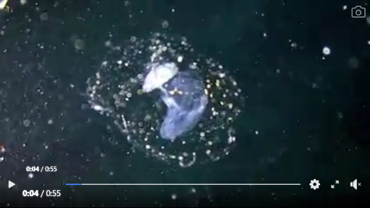

= 075
:toc: left
:toclevels: 3
:sectnums:
:stylesheet: ../../../../myAdocCss.css

'''

- (075.) `主` A very specialized 专门的；专业的；特定的 _feeding 摄食的；进食的 adaptation_ 适应（性）；改编本；改写本 in zooplankton 浮游动物 `系` #is# that of _the tadpolelike 像蝌蚪的 appendicularian_ 尾海鞘纲动物 who lives in a walnut-sized 核桃大小的 (or smaller) balloon 囊状物；气球 of mucus 黏液 equipped with 配备有；装有 filters 过滤器；滤光片；滤声器 that capture (v.)捕获；捕捉；俘获 and concentrate (v.)使集中；聚集；浓缩 phytoplankton 浮游植物.

'''

浮游动物中一个高度特化的进食适应，是那个 (属于) 蝌蚪状尾海鞘的 (适应) (这个尾海鞘生活在一个核桃大小 (或更小) 的黏液球中，这个黏液球配备有过滤器，这些过滤器能捕获并聚集浮游植物)。

流畅的整体译文 +
浮游动物中存在着一种高度特化的进食适应，其代表便是蝌蚪状的尾海鞘。这种动物生活在一个由黏液构成的、核桃大小 (或更小) 的球状“房子”里，这个“房子”上装备有能捕获并富集浮游植物的过滤器。

- (075.) A very specialized feeding adaptation in zooplankton is that of the tadpolelike appendicularian who lives in a walnut-sized (or smaller) balloon of mucus equipped with filters that capture and concentrate phytoplankton.

浮游动物中一种非常特殊的摄食适应是蝌蚪状尾海鞘，它生活在一个核桃大小（或更小）的粘液气囊中，气囊配备有过滤器，可以捕获并浓缩浮游植物。

这句话旨在描述一种特定浮游动物 (尾海鞘) 高度特化的摄食方式。

- 提出总述：在浮游动物界，存在一种高度特化的进食适应 (A very specialized feeding adaptation)。
- 指明主体：这种适应属于蝌蚪状的尾海鞘 (that of the tadpolelike appendicularian)。
- 描述其形式：这种动物的特殊之处在于，它居住在自己建造的一个黏液“房子”里 (who lives in a... balloon of mucus)。
- 解释其原理：这个黏液“房子”不是简单的居所，而是一个精密的捕食装置——它装备了过滤器 (equipped with filters)。
- 说明其功能：这些过滤器, 能主动捕获水中的浮游植物并将其聚集起来 (that capture and concentrate phytoplankton)，供尾海鞘食用。

本质上，这是在介绍一种“会自己建带滤网的房子来高效捕食”的浮游动物的生存策略。

.A very _specialized feeding adaptation_ in zooplankton `系` is that of _the tadpolelike appendicularian_

- specialized feeding adaptation :  特化的进食适应。 specialized 指“专门化的、特化的”，*adaptation* 在生物学中**指"生物为适应环境, 而形成的特殊结构或行为"。**此处指浮游动物为获取食物, 而演化出的特殊方式。

- zooplankton : 浮游动物。漂浮或游动能力微弱、随波逐流的水生小动物 (如小虾、水母幼体、各种幼虫)。

- #*that of : 那个 (…的)。that 是指示代词，指代前面提到的 adaptation，以避免重复。of表示所属关系。整个短语意思是“那个 (属于) …的 (适应)”。*# +
that of的指代：that 指代主句主语 A very specialized feeding adaptation， of表示所属。##**is that of...等于 is the adaptation of...。**##这是为了避免重复。

- tadpolelike appendicularian : 蝌蚪状的尾海鞘。tadpolelike 意为“像蝌蚪一样的”。appendicularian 是“尾海鞘”，一种微小的海洋浮游被囊动物，因其幼虫状的、有尾巴的成体外形像蝌蚪,而得名。

.appendicularian 尾海鞘纲动物

The animal itself is small, translucent, and you can see it wagging its tail. Appendicularians build a house around them, made of mucus and cellulose, that looks like a bubble, with a set of filters inside. When the filters clog, every few hours, they leave the house, and build a new one.

这种动物体型很小，半透明，你可以看到它在摇尾巴。尾索动物会在自己周围建造一个由黏液和纤维素构成的“房子”，看起来像个气泡，里面有一套过滤系统。每隔几个小时，当过滤系统堵塞时，它们就会离开原来的“房子”，建造一个新的。

.A very specialized feeding adaptation in zooplankton `系` is that of the tadpolelike appendicularian *who lives in* _a walnut-sized (or smaller) balloon of mucus_ *equipped with* filters that capture (v.) and concentrate (v.) phytoplankton.

- walnut-sized (or smaller) balloon of mucus : 核桃大小 (或更小) 的黏液球。walnut-sized 是一个复合形容词，意为“核桃大小的”。balloon 在此是比喻，指一个中空的、充满水的球状结构。这是尾海鞘用自身分泌的黏液建造的、可居住的、带有滤食结构的“房子”。

- equipped with filters : 配备有过滤器。equipped with 意为“装备有、带有”。这些“过滤器”是黏液球结构的一部分，用于滤食。

- capture (v.) and concentrate (v.)  phytoplankton : 捕获并聚集浮游植物。capture是捕获，concentrate 是使集中、浓缩。phytoplankton 是浮游植物，是浮游动物的主要食物来源。过滤器的作用不仅是拦截食物，还能将其聚集起来，提高摄食效率。

- 多重后置定语嵌套：句子的核心信息层层嵌套在定语中。中心词 appendicularian 被一个很长的定语从句修饰，而这个定语从句的宾语 balloon又带有后置定语 of mucus 和 equipped with filters，filters 又被另一个定语从句 that capture... 修饰。*形成了一个“动物 -> 其房子 -> 房子的过滤器 -> 过滤器的功能”的链条。*

.书作者解说

（在浮游动物中出现的）（一种很具体化的用来捕食的）适
应，就是TA这种动物的适应；{它生存于一个核桃大小（或更小）的M
的球状物中，［M球装备了一些（能够捕捉并聚拢浮游植物的）过滤装
置］}。

**GRE和GMAT考试中比较有特色的一个语言现象, 就是 that
(those) of 的频繁出现。that (those) of 的作用是省略掉与前面一样的名词
性成分，**从而起到简化句子的结构、缩短句子的长度的作用。然而对于
初学GRE和GMAT的人来说，在复杂句式中一旦遇到，往
往一下子搞不清楚这个that（或those）指的是前面众多名词性成分中间
的哪一个。解决这个问题的办法，就是多读、反复读这样的句子，熟能
生巧。

