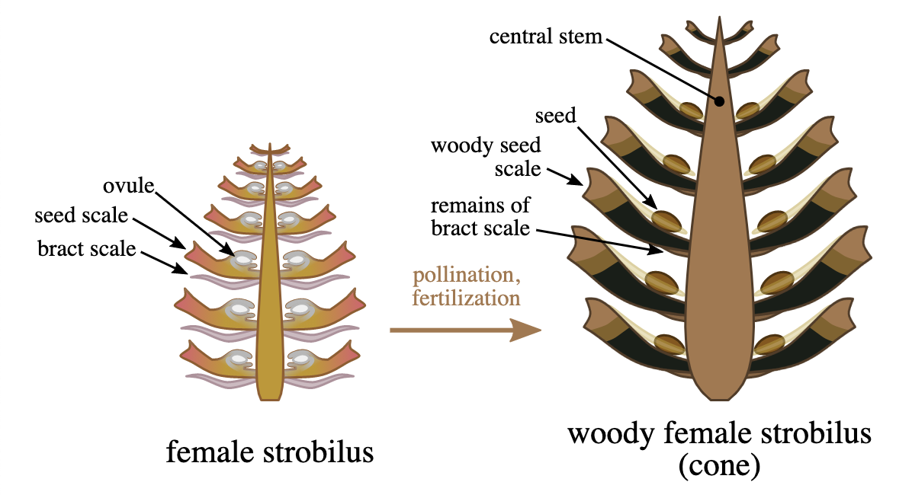
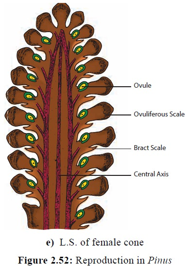

= 086
:toc: left
:toclevels: 3
:sectnums:
:stylesheet: ../../../../myAdocCss.css

'''

- (086.) For example, `主` _##the spiral 螺旋形的；螺旋式的 arrangement##_ 排列；布置 of _scale-bract (苞) 鳞片苞片的 complexes_ 复合物；综合体 on _ovule-bearing 具胚珠的 pine cones_ (锥形体) 松果，where _the female 雌性的；雌的 reproductive 生殖的；繁殖的 organs_ 器官 of conifers 针叶树；松柏科植物 are located 位于；坐落于, `系` #is important 重要的 to# the production 产生；制造 of _air flow 气流 patterns_ 模式；样式 后定说明 that *spiral* (v.)螺旋形移动；盘旋上升（或下降） over the cone’s surfaces 表面, thereby 因此；从而 *passing* (v.)传递；传送 _airborne 空气传播的 pollen_ 花粉 *from* one scale 鳞片 *to* the next.

'''

例如，螺旋状排列 (这个排列是鳞苞复合体的, 在具胚珠的松果上的, 松柏类植物的雌性生殖器官位于此处)，对于产生"气流模式" (这些模式在松果表面,螺旋流动) 是重要的，从而将空气中的花粉,从一个鳞片传递到下一个鳞片。

流畅的整体译文 +
例如，在承载胚珠的松果 (即松柏类植物雌性生殖器官所在之处) 上，鳞苞复合体的螺旋状排列方式，对于在松果表面形成螺旋流动的气流模式至关重要。而这种螺旋气流能将空气中的花粉从一个鳞片输送到下一个鳞片。

- (086.) For example, the spiral arrangement of scale-bract complexes on ovule-bearing pine cones, where the female reproductive organs of conifers are located, is important to the production of air flow patterns that spiral over the cone’s surfaces, thereby passing airborne pollen from one scale to the next.

例如，带胚珠的松果（针叶树的雌性生殖器官所在之处）上鳞苞复合体的螺旋排列，对于产生在松果表面螺旋流动的气流模式至关重要，从而使空气中的花粉从一个鳞片传递到下一个。

....
【主句】
├─ 举例引导语：For example
├─ 主语：the spiral arrangement
│       │
│       ├─ 【后置定语】 of scale-bract complexes
│       │       │
│       │       └─ 【后置定语】 on ovule-bearing pine cones
│       │               │
│       │               └─ 【非限制性定语从句】 , where the female reproductive organs... are located,
│       │                       (where 指代 on pine cones)
│       │
├─ 系动词+表语：is important
├─ 【目的状语】 to the production
│       │
│       └─ 【后置定语】 of air flow patterns
│               │
│               └─ 【定语从句】 that spiral over the cone’s surfaces
│                       │
│                       └─ 【现在分词短语 (结果状语)】 , thereby passing airborne pollen...
│                               (thereby 表示“借此、从而”，passing 的逻辑主语是 the air flow patterns)
│
└─ 主句完整主干：...arrangement is important to the production of...
....

这句话是一个 具体例证，用以说明植物结构, 如何精妙地适应并利用"风媒传"粉。

核心结构：以具胚珠的松果​ (即雌球果) 为例。*其上的鳞苞复合体​ (scale-bract complexes) 呈螺旋状排列*​ (spiral arrangement)。

结构的重要性：*这种特定的螺旋排列方式, 至关重要​ (is important)，因为它能促使产生特定的气流模式*​ (to the production of _air flow patterns_)。

气流模式的特征：*这种气流模式, 是沿着松果表面螺旋流动的*​ (that spiral (v.) over the cone’s surfaces)。

气流的功能 (结果)：*这种螺旋流动的气流 从而​ (thereby) 起到一个关键作用：将空气中漂浮的花粉​ (airborne pollen) 从一个鳞片高效地传递到相邻的下一个鳞片*​ (from one scale to the next)。

生物学意义：**这远非简单的“风大花粉多”。松果的螺旋结构, 像一个精密的生物风机或导流板，能主动引导和操控局部气流，使花粉不再完全依赖随机飘散，而是能被气流系统地“扫过”或“输送”到各个潜在的受粉位置 (各个鳞片下的胚珠)，大大提高了风媒传粉的效率和确定性。**这是对“风媒传粉纯属随机”传统观点的有力补充和修正。

.For example, `主` _##the spiral arrangement##_ of _scale-bract complexes_ on _ovule-bearing pine cones_, where _the female reproductive organs_ of conifers are located, `系` #is important# to the production of _air flow patterns_ that *spiral* (v.) over the cone’s surfaces, thereby *passing* (v.) airborne pollen *from* one scale *to* the next.

- spiral arrangement : 螺旋状排列。指松果上的鳞片, 呈螺旋线状排列，这是植物学中常见的"斐波那契数列"排列。

- scale-bract complexes : 鳞苞复合体。scale指松果的木质鳞片，bract 指"苞片" (通常较小，位于鳞片基部)。在松果上，它们常合生为一个复合结构，称为“鳞苞复合体”，是松果的基本单元。

- ovule-bearing _pine cones_ (松果): 具胚珠的松果。松柏类的“球果”分雌雄，雌球果 (即松果) 承载胚珠 (未来发育为种子)。ovule-bearing 明确这是雌性繁殖结构。

- _female reproductive organs_ of conifers : 松柏类植物的雌性生殖器官。指胚珠及其附属结构 (珠鳞等)，它们位于雌球果 (松果) 的鳞片内侧。

- air flow patterns : 气流模式。指空气在松果表面及周围流动时的方向和形态。

- spiral (v.)  over the cone’s surfaces : 在松果表面螺旋流动。spiral作动词，描述气流沿着松果鳞片的螺旋排列路径流动。

- airborne pollen : 空气中的花粉。指随风传播的花粉。

.书作者解说

本句的两大难点中，一是结构复杂，二是专有名词较多。其中只有后面的三个单词我们有可能根据常识大概猜出其含义。那么现场阅读时遇到这种东西又该如何处理呢？

**可以肯定的是，ETS的出题者 并没有期望读者都是生物学家或者是
物理学家，而且##从众多文章的出题的情况来看，也根本不可能考到任何
必须对专有名词作精确理解的内容。##读到这种东西的时候，读者的首要
任务是**从联系文章主题的角度，**读出这句话与文章主题有关的意思，从
而理解它在文章中的作用。** +

比如这个句子，读者只要能够读出 the
arrangement of _female reproductive (a.) organs_ of conifers 松柏类，针叶树；球果植物 `系` are important to reduce (v.)  the pollen waste 这个意思即可。

