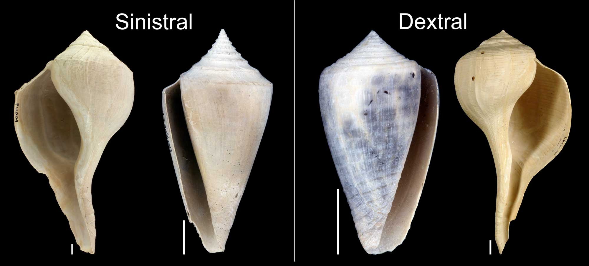

= 111
:toc: left
:toclevels: 3
:sectnums:
:stylesheet: ../../../../myAdocCss.css

'''

- (111.) However, some broods (n.)（动物的）一窝幼崽 possess (v.)拥有；具有 a few snails 蜗牛 of _the opposing 相反的；对立的 hand_, and in _predominantly 主要地；大部分地 sinistral 左旋的；左向的 broods_, `主` the incidence 发生率；出现率 of dextrality 右旋；右向性 `系` is surprisingly 惊人地；出人意料地 high.

'''

然而，一些蜗牛窝,拥有少数相反旋向的蜗牛，并且在主要为左旋的蜗牛窝中，右旋的发生率高得惊人。

- (111.) However, some broods possess a few snails of the opposing hand, and in predominantly sinistral broods, the incidence of dextrality is surprisingly high.

然而，一些孵化出的蜗牛群中会存在少数方向相反的蜗牛，而在以左旋蜗牛为主的群中，右旋蜗牛的出现率高得惊人。

- a few snails of the opposing hand +
hand在此是生物学隐喻，指蜗牛壳的旋转方向，就像人的“左手”和“右手”。opposing hand指与所在窝主要旋向,相反的个体。

- in predominantly sinistral broods : +
在主要为左旋的蜗牛窝中。predominantly 是“主要地、占优势地”。sinistral 是专业术语，指贝壳旋转方向,为左旋​ (壳口朝向观察者时，开口在左侧，螺旋为逆时针方向)。

- the incidence of dextrality  +
右旋的发生率。incidence指发生率、出现频率。dextrality 是专业术语，与 sinistral相对，指贝壳右旋​ (壳口在右侧，螺旋为顺时针方向)。

第一个观察 (普遍性例外)：However引出一个与预期 (可能认为每窝蜗牛旋向完全一致) 相反的事实：有些蜗牛窝中会出现少数旋向相反的个体​ (some broods possess a few snails of the opposing hand)。这说明遗传并非100%严格。

第二个观察 (不对称性例外)：进一步，在一个更具体的条件下​ (in predominantly sinistral broods)，即 “主要为左旋的蜗牛窝”​ 中，右旋个体的出现率居然异常地高​ (the incidence of dextrality is surprisingly high)。

这暗示了旋向的遗传可能不是对称的。左旋窝中出现右旋后代的概率，可能比右旋窝中出现左旋后代的概率要高。这种不对称性是值得关注的科学现象。

.书作者解说

作者只是单纯地想说左旋窝的"右旋几率"么？ 作者的真实意图，
是想将两种窝的情况做一个对比，把句子补全就是：在左旋窝中会出现
右旋，右旋窝中有左旋；但"左旋窝中的右旋数量",要远远高于"右旋窝中的
左旋数量"。这篇文章对这句话出了一道题，答案就是——"右旋窝中的左
旋数量", 少于"左旋窝中的右旋数量"。

ETS的出题者的语言表述, 常常闪烁其辞. 其真实含义，需要读者自己考察。

