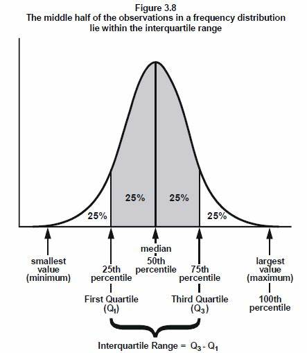
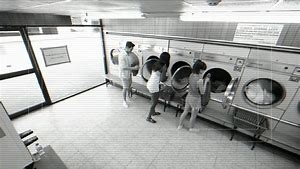

= eco 2020 - (36-37)
:toc:

---

== 36. Business and the next recession

When economies *change*, *so do* recessions. What *will* the next one *look like*?

商业和下一次衰退 +
当经济发生变化时，衰退也会随之变化。下一个会是什么样子?

Feb 20th 2020 | PARIS +
eco 2020-2-22 / Business / Business and the next recession: Downturn, disrupted

*CAST YOUR mind back to* 2007.

Flashy(a.)(`=flashy :  attracting attention by being bright, expensive, large, etc. 俗艳的；（因昂贵、巨大等）显眼的;/穿着奢华的;/炫耀技艺的`) types 具有某种特征的人；典型 *were showing off* 炫耀；卖弄；显示 their first-generation iPhones.

====
- type : n. *a person of a particular character, with particular features, etc.* 具有某种特征的人；典型 +
-> She's *the artistic type*. 她是艺术家一类的人。 +
-> *He's not the type* to be unfaithful. 他不是背信弃义的那种人。
====

Netflix *sent* DVDs through the post 邮政；邮递；邮寄 for people who *did not have* the time *to drop into*(`= : to pay an informal visit to a person or a place 顺便访问；顺便进入`) a branch of Blockbuster 一鸣惊人的事物；（尤指）非常成功的书（或电影）;但在本文中是公司名(英国DVD租赁公司Blockbuster, 已破产).

====
- blockbuster => block，大块。buster, 炸开，来自burst, 爆裂，字母r脱落。
====

The biggest firms in the world *were* old-economy stalwarts(`=stalwart : （政党等组织的）忠诚拥护者，坚定分子`) *such as* General Electric and Royal Dutch Shell. (`= : 通用电气公司(General Electric Co.)和荷兰皇家壳牌有限公司(Royal Dutch Shell Plc)`)

====
- stalwart => 拼写变体形式自 stalworth,坚定的，坚决的，等同于 stall,固定位置，地方，worth,价值。
====

Myspace 一社交网站 *ruled* online.

That seemingly distant(a.)遥远的；远处的；久远的 era  *was* `主` when America, *followed by* Europe and most of the rich world, `谓` last *fell into* recession.

[Since then] `主` the way people *buy products*, *entertain themselves*, *move around* and *borrow money* `谓` *has altered* （使）改变，更改，改动 and [in some cases] *been revolutionised* 彻底改变；完全变革 by a mighty band  一伙人；一帮人 of global technology titans.

让你的思绪回到2007年。 +
华而不实的人正在炫耀他们的第一代iPhone。 +
Netflix通过邮局, 为那些没有时间进入Blockbuster分支机构的人, 提供dvd。 +
世界上最大的公司, 是传统经济的坚实拥护者，如通用电气(General Electric)和荷兰皇家壳牌(Royal Dutch Shell)。 +
Myspace还统治着网络。 +
那个看似遥远的时代是美国、欧洲和大多数富裕国家, 最后一次陷入衰退的时候。 +
从那以后，人们购买产品、自娱自乐、四处走动和借钱的方式, 发生了变化，在某些情况下，这些变化还被一群强大的全球科技巨头彻底改变了。

“The composition(`= : the different parts which sth is made of; the way in which the different parts are organized 成分；构成；组合方式`) of the economy *has changed* since 2007, and hence *so will* the nature of recessions 经济衰退; 萧条,” *says* Douglas Elliott of Oliver Wyman, a consultancy 咨询公司.

*Working out* the impact of the next recession *is* important *because* one *is* on the way, sooner or later.

Past recessions *have been* costly.

The Economist *calculates that* {in the most recent downturn(n.)（商业经济的）衰退，下降，衰退期 `主` 11m people `谓` *lost their jobs* in rich economies /and `主` profits of big listed(a.)与（伦敦）股票交易所主板市场（有关）的；上市的 firms in Europe and America `谓` *dropped* by 51% and 30%, respectively 分别地；各自地，独自地}.

Stockmarkets always *take* a battering(n.)(`= :  a violent attack that injures or damages sb/sth 殴打；猛击`) *when* the economy *turns* (see chart 1).

Recessions *matter to* governments and central banks, which *must work out* how *to respond*, and to firms and investors, because downturns *sort*(`=*sort sth out (from sth)* : （从…中）区分出来，辨别出来`) the wheat 小麦（植物）；小麦（籽实） *from* the chaff(`=chaff : 谷壳；糠;（作为牛饲料的）麦秸，干草`)(`=*SORT OUT/SEPARATE THE WHEAT FROM THE CHAFF* : to distinguish useful or valuable people or things from ones that are not useful or have no value 识别优劣；分清好坏；去芜存菁`).

====
- chaff => 来自PIE gep, 咬，咀嚼，词源同jaw, jowl. +

====

[In the past three recessions] the shares of American firms in the top quartile(`=quartile :( statistics 统计 ) one of four equal groups into which a set of things can be divided according to the distribution of a particular variable 四分位数；四分位值;根据某一特定变量的分布，可以将一组事物分成四等分的组中的一种`) of each of ten sectors *rose* by 6% on average, while those in the bottom quartile *fell* by 44%.

====
- quartile +

====

奥纬咨询(Oliver Wyman)的道格拉斯•埃利奥特(Douglas Elliott)表示:“自2007年以来，经济结构发生了变化，因此衰退的性质也将随之改变。” 解决下一次衰退的影响, 是很重要的，因为它迟早会到来。 +
过去的经济衰退, 代价高昂。据《经济学人》计算，在最近一次经济衰退中，发达国家有1100万人失业，欧洲和美国大型上市公司的利润, 分别下降了51%和30%。 +
当经济转向时，股市总是遭受重创(见表1)。衰退对政府和中央银行, 以及企业和投资者, 都很重要，它们必须想出应对的办法，因为经济衰退能对市场起到去芜存菁的作用。在过去的三次经济衰退中，美国在10个行业中每一个行业的前四分位数中的公司, 他们的股票, 平均上涨了6%，而那些在最后四分位数中的企业的股票, 下跌了44%。

[In some important ways] the corporate(a.)公司的 world *looks similar to* the picture in 2007.

American firms *are* big earners, with corporate profits steady(a.)稳定的；恒定的 at 8.5% of GDP, and many industries *are* relatively highly concentrated(a.) 密集的；集中的.

In Europe profitability 盈利能力 and concentration *remain lower*.

As in 2007, Western firms *remain* highly globalised 全球化的 *despite* the trade war. Big listed firms 上市公司 in America *make* 31% of their sales outside their home market, while [for large European companies] the figure *is* 53%.

在一些重要的方面，企业界看起来与2007年的情况相似。美国公司是大赢家，公司利润稳定在GDP的8.5%，许多行业相对高度集中。在欧洲，盈利能力和集中度仍然较低。与2007年一样，尽管发生了贸易战，西方公司仍然是高度全球化的。美国的大型上市公司31%的销售额来自海外市场，而欧洲大型公司的这一数字为53%。

Much *has also changed*.

First, the digital world *is* more dominant.

An economic bounceback 弹回；反射 *has fuelled* 给…提供燃料;增加；加强；刺激 the rise of global tech giants that *have disrupted* 扰乱；使中断；打乱 incumbents(n.)(`=incumbent : a person who has an official position 在职者；现任者`) in retail, taxis, hotels and many other businesses.

The example of tech upstarts(n.)自命不凡的新上任者；狂妄自大的新手 *has seeped*(`=seep : 渗；渗透`) *through to* non-tech firms, which *are* now more asset-light 轻资产（指企业紧紧抓住自己的核心业务，而将非核心业务外包出去）.

====
- seep => 来自古英语 sipian,渗透，流出，来自 Proto-Germanic sip,渗透，流出，来自 PIE seip,流出， 溢出，词源同 soap,sebum.
====

Managers *have shifted* IT spending *from* buying servers *to* renting them through the cloud, for example.

The second change *is that* bosses *may have* less room *to cut costs*.

Third, some firms *have heaped* 堆积（东西）；堆置;在…上放很多（东西） *on* debt /and *engaged in* accounting(n.)会计，会计学 puffery(`=puffery :  (宣传或广告中的)吹捧;夸大广告`), *increasing* what John Kenneth Galbraith, an economist, *called* “the bezzle” 在尚未败露的贪污中得到的金钱 : money (no one *is aware*) *has gone missing*.

====
- bezzle : 黑金，哈佛大学经济学教授约翰.肯尼思.加尔布莱斯用它指“*在尚未败露的贪污中得到的金钱*”——出处《穷查理宝典》查理.芒格著，第一册，推荐书目，《富裕社会》选段中提及。
====

Boom times *paper over*(`=*paper over sth* : to cover a wall with wallpaper in order to hide sth 糊壁纸遮盖; /to try to hide a problem or disagreement in a way that is temporary and not likely to be successful 暂时掩盖，权且掩饰（问题或分歧）`) cracks 裂纹；裂缝, for instance by *allowing* firms *to delay* writing down(`=*WRITE STH DOWN* :  to reduce the value of assets when stating it in a company's accounts 减记，划减（资产的账面价值）;/写下；记录下`) the value of misfiring (枪)哑火; 射不出子弹;不起动；打不着火;不奏效；不起作用 acquisitions 购置物；收购的公司；购置的产业；购置；收购.

很多事情, 发生了变化。 +
首先，如今的世界, 数字经济更占主导地位。经济反弹推动了全球科技巨头的崛起，打破了零售、出租车、酒店和许多其他行业的现有格局。科技公司中那些自命不凡者的例子, 已经渗透到非科技公司，这些公司现在更为轻资产。例如，管理人员已经将IT支出, 从原先的购买服务器, 转而只通过云来租用服务器上。 +
第二个变化是，老板们削减成本的空间可能变小了。 +
第三，一些公司债台高筑，并且吹嘘公司的财务情况, 增加了对尚未暴露出来的金钱的贪污. 这被经济学家 John Kenneth Galbraith 称为 bezzle. 即指: 没人意识到, 这些钱钱已经不见了。 +
经济繁荣时期, 会掩盖了财务漏洞，例如, 公司会允许对失败的收购, 推迟进行价值减记。

*Start with* the first change, the rise of digital technology.

The most visible difference *is* in the nature of the largest firms: seven of the ten most valuable firms in the world *are* now tech outfits, *up from* two in 2010 (see chart 2).

In America the top five -- Alphabet, Apple, Amazon, Facebook and Microsoft -- *account for* 13% of the profits of S&P(`= : 标准普尔 Standard & Poor`) 500 firms.

This *is* forecast *to rise to* about 20% in five years’ time.

At *less than* 5%, their share of S&P 500 employment 雇用; 工作；职业；受雇 *is* small /but they *have become* America’s largest investors, *ploughing*(`= : 犁（田）；耕（地）；翻（土）;/*plough sth back (in/into sth)ˌ /plough sth back in* : 把（利润）再投资;/犁埋；使秸秆还田`) $189bn *into* the economy last year (*including* research and development), *equivalent to* 17% of investment by big publicly(ad.) listed companies.

我们来看第一个变化 -- 数字科技的崛起。 +
最明显的不同在于大公司的性质：现在世界上最有价值的十家公司中, 有七家是科技公司，而在2010年只有两家(见图表2)。 +
在美国，标准普尔500指数中上市公司的总利润, 其前五名--Alphabet、苹果、亚马逊、Facebook和微软--合计就占有13%的份额。预计5年后，这一比例将升至20%左右。 +
而他们的雇员数量, 只占该指数中公司的所有雇员数量的不到5%. 但他们已经成为美国最大的投资者，去年向经济投入了1890亿美元(包括研发)，相当于大型上市公司投资的17%。

`主` How the tech giants *weather*(v.)经受住，平安地渡过（困难） a recession `系` *is* thus 因此；从而；所以 of great importance.

Investors *may view* these firms *as* impregnable(a.)(`=impregnable : 坚不可摧的；牢不可破的`), but they *are heavily exposed to* 暴露；显露；露出;使面临，使遭受（危险或不快） revenues  (公司、组织或政府的) 收入 that *are* cyclical(`=cyclical : 周期的`) (see chart 3), *including* advertising, consumer spending and business IT spending, which *were all sensitive 敏感的 to* the economic mood 气氛；氛围 in the pre-digital age.

====
- pregnable => 来自古法语prenable,可占领的，可攻破的，来自（缩写自）拉丁语prehendere,抓住，占领，词源同comprehend,prehensile.插入字母g可能是习惯性作用。
====

Novel 新颖的；与众不同的；珍奇的 business models *may offer* some protection.

Perhaps Facebook users *will spend more time online* if they *lose their job*?

Maybe advertisers *will slash(v.)大幅度削减；大大降低;（用利器）砍，劈 spending*(n.) on TV, newspaper and billboard 广告牌 advertising before *taking the knife to* digital spending.

因此，这些科技巨头如何度过经济衰退, 至关重要。投资者可能认为这些公司坚不可摧，但它们的收入是周期性的(见表3)，换言之, 他们的收入依然对前数字时代的传统经济形势, 非常敏感。因为包括他们的广告客户、消费者支出, 和企业IT支出，都会受到传统经济衰退的影响 +
新的商业模式可能会提供一些保护。如果Facebook的用户失去工作，他们是否变得会花更多时间来上网吗? 对广告商们来说, 经济衰退时, 他们可能会先削减在传统的电视、报纸和广告牌上的广告支出，最后再来削减网上的数字广告支出。

*There is evidence that* the pain *could be* acute.

[In downturns in 2000-02 and 2007-08] sales growth at Amazon and Microsoft *slowed sharply*.

Smartphone sales *have already slowed*.

A recession *may see* 经历；遭受 consumers *hanging on to* 保留；不卖掉；不放弃;抓紧某物 devices [for longer] *rather than* trading up(`=*trade up* : to sell sth in order to buy sth more expensive 卖次买好；（卖掉原有的以便）买更贵的东西; /to give sth you have used as part of the payment for sth more expensive 以旧物折价添钱买较贵的东西；折价贴换`) to the newest handset 手机;电话听筒;（电视等的）遥控器.

Fortress  城堡；堡垒；要塞；设防的地方 balance-sheets 要塞式资产负债表 *offer* a measure of safety: the big five tech firms *have* $270bn of net cash 净现金.

有证据表明疼痛可能是剧烈的。在2000-02年和2007-08年的经济低迷时期，亚马逊和微软的销售增长大幅放缓。智能手机的销售已经放缓。经济衰退可能会导致消费者更长时间地使用手机，而不是购买最新款的手机。堡垒式资产负债表, 提供了一种安全的衡量标准:五大科技公司拥有2700亿美元的净现金。

Beyond the giants, insurgents(`=insurgent : 起义者；叛乱者；造反者`) *have emerged*.

====
- insurgent => insurgent
====

Airbnb and Uber *have turbocharged* 用涡轮给增压 the matching of buyers and sellers.

Financial innovators *such as* LendingClub(`= : 美国一网络借贷平台`)) and SoFi(`= : 该公司也是做网贷的`)) *facilitate*(v.)促进；促使；使便利 millions of loans(`= : money that an organization such as a bank lends and sb borrows 贷款；借款`) by *connecting* people who need money *with* those with some to spare(`= : *~ sth/sb (for sb/sth) /~ (sb) sth* : to make sth such as time or money available to sb or for sth, especially when it requires an effort for you to do this 抽出；拨出；留出；匀出`).

Subscription （报刊等的）订阅费，订购款，订阅，订购 offerings *have flourished*, *delivering* 递送；传送；交付；运载 anything *from* ready-made meals *to* makeup.

[For many] this *will be* their first downturn; [for some] it *may be* their last.

在巨人之外，起义者已经出现。Airbnb和优步(Uber)推动了买家和卖家之间的匹配。像LendingClub和SoFi这样的金融创新机构, 通过将需要资金的人, 与那些有闲钱的人联系起来，为数百万笔贷款提供便利。订阅服务蓬勃发展，从即食食品到化妆品应有尽有。对许多人来说，这将是他们的第一次经受经济衰退; 但对另一些人来说，这可能是最后一次。

Not all *will be hit* as badly as *might be expected*.

A recession in Brazil in 2015-16 *hit* demand for Uber rides(n.)（乘车或骑车的）短途旅程 *[hard]*, but higher unemployment *meant* more cash-strapped  缺钱的；手头紧的 drivers *were* available, *reducing(v.) costs*(n.) and *improving service*.

Likewise 同样地；类似地 `主` a downturn `谓` *could help* Airbnb *win* market share *from* hotels *if it means* more people *make* their homes *available for rent* 目的状 in search of cash.

A crisis *may [not so much] 与其说是 impact* tech companies *[as]* 倒不如说是 accelerate the decline of the “old”, non-digital economy.

====
- *not so much... as...*．是一个常用的并列连词，其含义相当于rather than，意为"*与其说是……倒不如说是……*"。和其它连接词一样，它可以连接词与词，短语与短语以及句子与句子。 +
-> He *isn't so much* ill *as* depressed．（＝He's depressed rather than ill．）他不是生病，而是情绪低落。 +

当连接句子时，*not so much... as... 连接的往往是because或that引起的从句，意思是"倒不是因为……而是因为……"。as后的that有时可省去。* +
-> It's *not so much that* the machine is out of order *as (that)* I have not learned to operate it．倒不是机器出了故障，而是我还没有学会操作。 +

*该并列连词中的as, 可用but (rather) 替换，即出现该连词的一种变体：not so much... but (rather)...* +
-> It is *not so much* the actual population of the world *but* its rate of increase which is important．重要的与其说是实际的世界人口总数，倒不如说是世界人口增长率。
====

并不是所有的人, 都会像预期的那样受到严重打击。巴西2015-16年的经济衰退, 沉重打击了消费者对优步打车的需求，但优步司机们更高的失业率, 反过来却意味着有更多资金紧张的司机, 想要寻找工作, 结果就降低了企业的用人成本，并改善了服务。同样地，如果经济低迷意味着更多的人会出租自己的房子, 以追求现金的话, 则这有助于Airbnb从其竞争对手 -- 酒店手中, 赢得市场份额。换言之, 经济危机与其说是可能会对科技公司造成影响，不如说是它会加速“旧的”非数字经济的衰落。

`主` The tech darlings(n.)备受宠爱的人；宠儿 that *look* most vulnerable `系` *are* those that *offer* “micro-luxuries”: `主` discretionary(a.)(`=discretionary : Discretionary things are not fixed by rules but are decided on by people in authority, who consider each individual case. 酌情决定的;自由决定的；酌情行事的；便宜行事的`) spending consumers `谓` *can quickly forgo*(`=forego :  If you forego something, you decide to do without it, although you would like it. 放弃`).

*Expect*(v.)预料；预期；预计 Deliveroo (food delivery), Bird (electric-scooter 小型摩托车 rentals(n.)出租；租赁；招租) and Peloton (subscription exercise （身体或脑力的）活动，锻炼，运动 bikes) *to feel the pinch*(`=*feel the pinch* : to not have enough money 手头拮据；经济困难`).

====
- scooter +

- exercise bike +
image:../../+ img_单词图片/e/exercise bike.jpg[]
====

Those with high fixed costs *will be especially exposed* 随着 *as* demand *falls*.

WeWork, a tech-tinged 略带 (某种感情或性质) 的 property firm, *is committed 承诺，保证（做某事、遵守协议或遵从安排等） to* $47bn of lease （房屋、设备或土地的）租约，租契 payments over the next 15 years or so.

====
- tinged : ADJ *If something is tinged with a particular colour, it has a small amount of that colour in it.* 略带 (某种颜色) 的 +
-> His dark hair *was just tinged with grey*.
他的黑发只是略带灰色。 +
ADJ *If something is tinged with a particular feeling or quality, it has or shows a small amount of that feeling or quality.* 略带 (某种感情或性质) 的 +
-> Her homecoming *was tinged with sadness*.
她的返乡略带伤感。
====

Such firms *may not be good at* retreating 撤退;退出; 离开. “If you’re a 30-year-old tech founder, who *has never been* through a recession, you *think* things *grow forever*. Cutting costs *isn’t* part of your playbook(`= : a book containing a range of possible set plays 剧本集`),” *says* Tom Holland of Bain, another consultancy.

那些看起来最脆弱的科技宠儿, 是那些提供“微型奢侈品”的公司: 酌情消费的消费者, 可以很快地放弃花钱。 +
Deliveroo(送餐服务)、Bird(电动车租赁服务)和Peloton(健身自行车租赁服务)这些公司, 预计都将感受到压力。随着需求下降，那些固定成本很高的企业, 将受到特别大的影响。 +
科技房地产公司WeWork承诺, 在未来15年左右, 支付470亿美元的租金。 +
这些公司可能不擅长撤退。“如果你是一位30岁的科技公司创始人，从未经历过经济衰退，你就会认为公司会永远发展下去。另一家咨询公司贝恩的汤姆•霍兰德说。

While it *is not* Silicon Valley’s forte(`=forte : 强项`), ruthless  残酷无情的；残忍的 cost-cutting *has always been* part of the playbook for companies (outside the tech industry) when the economy *slumps*(`=slump : （价格、价值、数量等）骤降，猛跌，锐减; /重重地坐下（或倒下）`).

[In the last recession] the labour costs of American firms *dropped by 7%* in total *as* they *laid off* （因工作不多而）解雇 workers /and *squeezed* 挤压；捏;严格限制，削减，紧缩（资金） wages *to protect* shareholders and *avoid* default(n.)违约（尤指未偿付债务）.

====
- forte =>  -fort-力量,强壮 + -e

- squeeze +
image:../../+ img_单词图片/s/squeeze.jpg[]
====

尽管这不是硅谷的强项，但在经济衰退时，无情的成本削减, 一直是科技行业以外公司的策略之一。在上一次经济衰退中，美国公司的劳动力成本总共下降了7%，因为他们解雇了工人，为了保护股东和避免违约, 而压缩了工资。

The austerity(n.)(`=austerity : a situation when people do not have much money to spend because there are bad economic conditions （经济的）紧缩；严格节制消费;/苦行；禁欲`) game

====
- austerity => austere（简朴的）+ity（名词后缀）→朴素、艰苦. 词源同sear, 烧焦。
====

紧缩的游戏

Room for manoeuvre  细致巧妙的移动；机动动作;策略；手段；花招；伎俩 *is* now more limited.

In some cases *this is because* cost structures *have changed*.

`主` Over $200bn of annual corporate IT spending, for example, `谓` *has shifted to* cloud-computing providers(n.) *such as* AWS and Microsoft.

Costs that *used to come* in lumps (on a big server once a decade) *now arrive* as a quarterly bill for software-as-a-service.

This *could help*. [If a firm *is going bust*(a.)破产] it *may find* {it easier *to pay* its cloud bill *[than]* *to flog* 出售（某物给某人） unwanted hardware}.

But firms *are losing* flexibility *to preserve cash* by *delaying* capital spending 资本开支，资本支出；资本投资.

现在回旋余地更加有限。在某些情况下，这是因为成本结构已经改变。例如，每年超过2000亿美元的企业IT支出已经转移到了AWS和微软等云计算提供商身上。过去成堆的成本(在大型服务器上，每十年一次)现在变成了软件即服务的季度账单。这可能会有帮助。如果一家公司即将破产，它可能会发现支付云计算账单比兜售不需要的硬件更容易。但公司正在失去通过推迟资本支出来保存现金的灵活性。

Meanwhile the social context （事情发生的）背景，环境，来龙去脉 *has shifted*.

In 2019 the heads of 181 of the largest firms in America *said* they *shared* a “fundamental 十分重大的；根本的;基础的；基本的 commitment” *[not just] to* their owners *[but] to* their customers, employees, suppliers and communities, too.

Many CEOs *privately regard* these kinds of declarations *as* decorative 装饰性的；作装饰用的 fluff(`=fluff : 没多大意义的娱乐;/（禽兽，尤指幼者的）绒毛;/（衣服等上的）绒毛，蓬松毛团，尘团`).

====
- fluff => 来自拉丁语vellus, 羊毛，词源同wool, fleece. 或来自辅音丛fl, 扑腾，拍打，词源同flap, flop. 用来指绒毛，绒屑。
====

This *will be tested* in a downturn （商业经济的）衰退，下降，衰退期 因为 as `主` *laying off* workers and *outsourcing*(`=outsource :  to arrange for sb outside a company to do work or provide goods for that company 把…外包;交外办理；外购`) jobs abroad `谓` *come* under more political fire.

“You *don’t want to be seen* firing(v.) people, especially if you’re still profitable,” *says* one European boss.

“It *will be* more of a last resort 应急措施；可首先（或最后）采取的手段. We *may have to take a bit more pain* before *announcing* lay-offs 下岗人员.”

与此同时，社会环境也发生了变化。2019年，美国181家最大公司的负责人表示，他们不仅对公司所有者，也对客户、员工、供应商和社区做出了“基本承诺”。许多首席执行官私下里认为，这类声明不过是装饰性的空话。这将在经济低迷时期受到考验，因为裁员和将工作外包到海外, 将面临更多的政治压力。一位欧洲老板说:“你不希望被人看到你在裁员，尤其是你还在赚钱的时候。”“这将是最后的手段。在宣布裁员之前，我们可能还得承受一些痛苦。”

The final change *is that* a long period without a downturn *has encouraged* bad habits *that mean* some firms *are* too indebted(a.)负债的, or *are hiding* nasty secrets.

Such problems *are usually spotted* [once 一…就；一旦；当…时候 it is *too* late *to fix* them].

The Asian crisis of 1997 *featured* 以…为特色；由…主演；以…为主要组成 crony 好友；密友-capitalists  裙带资本主义；权贵资本主义；唯亲资本主义 *crippled 使残废；使跛；使成瘸子;严重毁坏（或损害） by* debt-currency mismatches; [in 2000-01] it *was imploding*(`=implode : to burst or explode and collapse into the centre 向心聚爆；内爆；向内坍塌`) dotcom 网站;互联网络公司 firms and frauds(n.)欺诈罪；欺骗罪;骗子；行骗的人 at Enron and WorldCom; and [in 2007-09] banks built on rotten(a.)腐烂的；腐败的；腐朽的 foundations *crumbled*  坍塌；损坏；崩裂.

====
- crony => 来自词根chrono, 时间，见chronicle, chronology.
====

最后一个变化是，长时间的经济不衰退助长了一些坏习惯，这意味着一些公司负债累累，或者隐藏着肮脏的秘密。一旦这些问题已经积重难返时, 它们往往才被发现(一旦发现这些问题时，往往为时已晚。)1997年亚洲金融危机的特点是, 裙带资本主义因债务货币错配而瘫痪;2000年至2001年，它曾内爆了网络公司和安然(Enron)和世通(WorldCom)的欺诈行为;而在2007-09年，建立在腐朽基础上的银行崩溃了。

`主` *Predicting* these fiascos `系` *is hard* /but there *are* some general warning signs.

After a long bout(n.)(`=bout : *~ (of sth/of doing sth)* a short period of great activity; a short period during which there is a lot of a particular thing, usually sth unpleasant 一阵；一场；（尤指坏事的）一通，一次;/（疾病的）发作；发病期`) of dealmaking, `主` goodwill 信誉；商誉 (the difference *[between]* what the acquirer(`= : In business, an acquirer is a company or person who buys another company. 收购方`) *pays for* a target *[and]* its book value(`=*book value* : In business, the book value of an asset is the value it is given in the account books of the company that owns it. 账面价值`) `系` *is* at a record high of $3.6trn for S&P 500 firms.

This *can indicate* 表明；显示; 象征；暗示 trouble.

[In 2000-01 and 2007-09] `主` firms `谓` *made* huge goodwill write-offs(`=write-off :  A write-off is something, such as a living expense, that can be deducted from your taxes. 从税中扣除的费用`) 当 as they *confessed 供认，坦白，承认（错误或罪行） to* dodgy(a.)(`=dodgy : seeming or likely to be dishonest 狡猾的；狡诈的；可疑的`) deals.

预测这些惨败是困难的，但有一些普遍的警告信号。经过长时间的交易，标准普尔500指数公司的商誉(收购者为收购目标支付的价格, 与其账面价值之间的差额)达到了创纪录的3.6万亿美元。这可能意味着麻烦。在2000-01年和2007-09年期间，由于企业承认存在不正当交易，它们进行了巨额商誉冲销。

[In America] `主` 97% of firms in the S&P 500 in 2017 `谓` *presented* at least one metric(n.)度量标准;按公制制作的；用公制测量的 of their performance *in a way* that *was inconsistent(a.)不一致；相矛盾 with* Generally Accepted Accounting Principles 会计原则, or GAAP, up from 76% before the last downturn, *according to* Audit 审计；稽核 Analytics 分析学；解析学, a consultancy.

`主` The number of large American firms *mentioning* “adjustments” to profits `谓` *has more than doubled* since the last recession (see chart 4).

根据审计分析(一家咨询公司)的数据，在美国，2017年标准普尔500指数中97%的公司至少用一种与公认会计准则(GAAP)不一致的方式, 来衡量他们的业绩，而在上一次经济衰退之前，这一比例是76%。自上次经济衰退以来，提到利润“调整”的美国大公司的数量, 增加了一倍多(见表4)。

`主` Over 60% of American mergers(n.) and acquisitions(n.) `谓` *were financed* last year *with loans* that *include* “add-backs”, a rapidly rising accounting phenomenon.

These *allow* buyers *to ignore* inconvenient 不方便的；引起麻烦的；造成困难的 expenses 开支；花费；费用 more or less at will, for example by *assuming* {merging firms *will successfully cut costs* 一旦 once combined}.

Loan documents *are drawn up* 拟订；制订；起草 *using* the fiddled 篡改；伪造；对…做手脚 profit figures 利润数字 *as a baseline*.

去年，超过60%的美国并购交易,是通过包括“附加费用”在内的贷款来融资的，“附加费用”是一种迅速增长的会计现象。这使得买家可以忽略或多或少的不方便的开支，例如假设合并后的公司一旦合并, 就能成功地削减成本。贷款文件是用虚报的利润数字作为基准编制的。

Often the losers *are* firms with too much debt.

[If a recession *is triggered* by rising(a.) interest rates] `主` they `谓` *get hit* [just before the downturn *begins*] /and again [once it *is* `表` in full swing(`=*in full swing* : having reached a very lively level 在热烈进行中；处于兴盛阶段`)], 因为 as sales *slide* 衰落（成）；逐渐陷入；逐渐衰退（到） /and they *struggle to meet*(`= : to pay sth 支付；偿付`) interest costs or refinance loans.

[Since 2007] overall corporate debt *has risen*.

[In Europe] non-financial corporate debt *now stands at* nearly 110% of GDP, *compared with* under 90% in 2007.

[In America] businesses *are now borrowing* more than households [for the first time] since 1991.

通常情况下，输家是负债过多的公司。如果经济衰退是由不断上升的利率引发的，他们就会在经济衰退开始前受到打击，而一旦经济衰退全面展开，他们又会再次受到打击，因为销售下滑，他们难以支付利息成本或为贷款再融资。自2007年以来，整体企业债务一直在上升。在欧洲，非金融公司的债务现在接近GDP的110%，而2007年还不到90%。在美国，自1991年以来，企业借贷首次超过家庭。

Much of the money *has gone to* companies with far less ability *to repay*(v.)归还；偿还；清偿 their current debts, *let alone* 更不用说 when a downturn *strikes*.

[In the rich world] one in eight established 著名的；成名的；公认的 companies *makes* too little profit *to pay* the interest on their loans, *let alone* the principal 本金；资本.

*That is up* [from one in 14] in 2007, *according to* the Bank for International Settlements （欠款的）支付，偿付，结算; 国际清算银行.

A recession (*half as bad as* the 2007-09 slump 萧条期；衰退;/（价格、价值、数量等）骤降，猛跌，锐减) *would result in* $19trn(`= : trillion 万亿；兆`) of corporate debt -- nearly 40% of the total -- *being owed 欠（债）；欠（账） by* such straitened(a.)经济拮据的；穷困的；经济状况恶化的 companies, *according to* the IMF.

Janet Yellen, a former chair of the Federal Reserve 储备（量）；储藏（量）; 美国联邦储备委员会, *has warned that* “if we *have* a downturn in the economy, there *are* a lot of firms that *will go bankrupt*, I *think*, because of this debt. It *would probably worsen*(v.)（使）变得更坏，变得更糟，恶化 a downturn.”

大部分资金都流向了无力偿还当前债务的公司，更不用说在经济低迷时期了。在发达国家，八分之一的老牌企业利润微薄，无法支付贷款利息，更不用说本金了。根据国际清算银行(Bank for International Settlements)的数据，这一比例高于2007年的1 / 14。根据国际货币基金组织的数据，如果经济衰退的程度只有2007-09年经济衰退的一半，那么将会导致19万亿美元的公司债务——几乎是债务总额的40%——被这些经济拮据的公司所拖欠。美联储(Federal Reserve)前主席珍妮特耶伦(Janet Yellen)曾警告说，“如果我们的经济出现衰退，我认为会有很多公司因为这些债务而破产。”这可能会加剧经济下滑。”

Optimists 乐观的人；乐天派 *argue that* the structure of debt *has become* more flexible.

Banks *are* in better shape(`= : the physical condition of sb/sth 状况；情况`) *thanks to* new (albeit(`=albeit : 尽管；虽然`) *largely untested*) regulations(n.) *enacted* 通过（法律） since 2008, and 因此 so *should be able to* keep lending(v.) if the economy *sours*(v.)（使）变坏，恶化;（牛奶等）变味，酸腐.

====
- shape : *the physical condition of sb/sth* 状况；情况 +
-> *What sort of shape* was the car in after the accident? 这车出过事故以后状况如何？ +
-> He's *in good shape* for a man of his age. 作为那把年纪的人来说，他身体不错。 +
-> I like *to keep in shape* (= keep fit) . 我喜欢保持健康。
====

Businesses *have been able to secure(v.)（尤指经过努力）获得，取得，实现 loans*(n.) with fewer strings(n.)(`= :  special conditions or restrictions 特定条件（或限制）`) attached, for example if they *look like* they *may struggle to repay the money*.

In America, businesses now *borrow* increasingly *from* lenders 放款人 outside the banking system, *such as* the private offices 私人办公室 of rich families, or pension 养老金；退休金；抚恤金 funds.

These, some say, *can knock heads together quickly*(`=*bang/knock your/their heads together* : ( informal ) to force people to stop arguing and behave in a sensible way 强行制止人们争吵并使之恢复理智`) and *help* firms *recover*.

*It* is best *to take* such statements(`= : something that you say or write that gives information or an opinion 说明；说法；表白；表态`) *with a pinch of salt*(`=*take sth with a pinch of salt* : to be careful about believing that sth is completely true 不完全相信；半信半疑`).

A mini-panic in late 2018 *saw* the price of many private-debt instruments(`= : something that is used by sb in order to achieve sth; a person or thing that makes sth happen 促成某事的人（或事物）；手段;/ 器械；仪器；器具`) *plunge* 暴跌；骤降；突降, *suggesting* the system *is* fragile.

乐观主义者认为，债务结构已经变得更加灵活。得益于2008年以来实施的新法规(尽管大部分未经测试)，银行的状况有所好转，因此，如果经济不景气，银行应该能够继续放贷。企业能够以更少的附加条件获得贷款，例如，如果它们看起来可能难以偿还贷款。在美国，企业现在越来越多地从银行系统外的借贷者那里借款，比如富裕家庭的私人办公室，或者养老基金。一些人说，这些措施可以迅速使企业恢复元气。对这种说法最好要有所保留。在2018年末的一场小恐慌中，许多私人债务工具的价格大幅下跌，表明这个体系是脆弱的。

Winners and losers

赢家和输家

Who *will be* the winners? Every recession *has* them.

Warren Buffett *picked up*(`= :  to buy sth, especially cheaply or by chance （碰巧或廉价地）买到`) assets(n.)资产；财产 (on the cheap) in 2007-09, while JPMorgan Chase *cemented* 加强，巩固（关系等）;（用水泥、胶等）粘结，胶合 its place *as* America’s leading bank  [当...时 *as* the industry *retrenched*(`=retrench : 节约；紧缩开支`)].

`主` Firms that *thrive in* downturns `谓` *tend to have* the clarity(n.)清晰；清楚；明确 of purpose and financial muscle(`= : physical strength 体力;/肌肉；肌`) *to keep investing* and *growing* 当...时 *as* others *pull back*, *says* Martin Reeves of the BCG(`= : 波士顿咨询公司 Boston Consulting Group`) Henderson Institute.

It *is* a test 检验；考验 of management and culture [but also] *requires* strong balance-sheets: 15% of firms in the S&P 500 *have* more cash *than* debt, *including* Apple and Monster Beverage(`=beverage :（除水以外的）饮料`) 怪兽饮料公司.

Investors with money *are watching and waiting*.

The private-equity（公司的）股本；资产净值;（公司的）普通股(`= : equity in a business that is raised from private sources, as opposed to shares that can be traded publicly 私募股权;从私人渠道筹集的股份，而不是公开交易的股份`) industry *has* some $2trn of cash.

Mr Buffett *sits on* $128bn.

谁将是获胜者?每次经济衰退都有。沃伦•巴菲特在2007年至2009年廉价收购了一些资产，而摩根大通在银行业紧缩之际, 巩固了其美国领先银行的地位。波士顿咨询公司亨德森研究所(BCG Henderson Institute)的马丁•里夫斯(Martin Reeves)说，在经济低迷时期蓬勃发展的公司, 往往有明确的目标和雄厚的财力，在其他公司纷纷撤出的时候, 继续投资和发展。这是对管理和文化的一种考验，但也需要强有力的资产负债表:标准普尔500指数中15%的公司, 拥有比债务更多的现金，包括苹果和Monster Beverage。有资金的投资者正在观望和等待。私募股权行业拥有大约2万亿美元的现金。巴菲特坐拥1280亿美元。

A recession *will come, eventually*.

[When it *does*] it *will batter*(v.)连续猛击；殴打 companies that *have been sustained* only by low interest rates.

`主` The churn 剧烈搅动；（使）猛烈翻腾;（制作黄油的）搅乳器 [当 as those businesses *are sold, restructured or dissolved*] `谓` *will extract* 索取，设法得到（对方不愿提供的信息、钱财等）;提取；提炼 an economic and human toll （战争、灾难等造成的）毁坏；伤亡人数.

Recriminations(`=recriminations : an angry statement that sb makes accusing sb else of sth, especially in response to a similar statement from them 指责；反诉；反控`) *will fly*, then *abate*(v.)（使）减弱，减退，减轻，减少.

====
- abate => 前缀a-同ad-. -bate同beat, 指打压下去。
====

In time 经过一段时间之后；迟早；最后；终于, `主` the more productive firms that *survived* `谓` *will think of* ways *to invest money profitably*.

That *will lead to* new jobs, then economic growth, then exuberance(n.)(`=exuberance : Exuberance is behaviour that is energetic, excited, and cheerful. 快乐有活力的行为`) -- and the cycle *will start* all over again 再一次，重新.

====
- exuberant => ex-, 向外。-uber, 乳房，乳汁，词源同udder. 原指多产的，丰富的，引申义兴高采烈的。
====

经济衰退终将来临。届时，它将重创仅靠低利率支撑的企业。随着这些企业被出售、重组或解散，动荡将造成经济和人员损失。相互指责会甚嚣尘上，然后平息下来。随着时间的推移，那些幸存下来的生产率更高的公司将会想办法进行有利可图的投资。这将带来新的就业机会，然后是经济增长，然后是繁荣——然后这个周期将重新开始。

---

== 36. Business and the next recession 纯净版

When economies *change*, so *do* recessions. What *will* the next one *look like*?

Feb 20th 2020 | PARIS +

*CAST YOUR mind back to* 2007. Flashy(a.) types *were showing off* their first-generation iPhones. Netflix *sent* DVDs *through* the post *for* people who *did not have* the time *to drop into* a branch of Blockbuster. The biggest firms in the world *were* old-economy stalwarts(n.) *such as* General Electric and Royal Dutch Shell. Myspace *ruled* online. That seemingly distant era *was* when America, *followed by* Europe and most of the rich world, last *fell into recession*. Since then `主` the way people *buy products*, *entertain* themselves, *move around* and *borrow money* `谓` *has altered* and in some cases *been revolutionised by* a mighty band of global technology titans.

“The composition of the economy *has changed* since 2007, and [hence] so *will* the nature of recessions,” *says* Douglas Elliott of Oliver Wyman, a consultancy. `主` *Working out* the impact of the next recession `系` *is* important *because* one *is* on the way, sooner or later. Past recessions *have been costly*. The Economist *calculates that* in the most recent downturn 11m people *lost their jobs* in rich economies /and profits(n.) of big listed firms in Europe and America *dropped by 51% and 30%, respectively*. Stockmarkets *always take a battering* when the economy *turns* (see chart 1). Recessions *matter to* governments and central banks, which *must work out* {how *to respond*}, and to firms and investors, because `主` downturns `谓` *sort the wheat from the chaff*. [In the past three recessions] `主` the shares of American firms in the top quartile of each of ten sectors `谓` *rose by 6%* on average, while those in the bottom quartile *fell by 44%*.

[In some important ways] the corporate world *looks similar to* the picture in 2007. American firms *are* big earners, *with* corporate profits *steady at* 8.5% of GDP, and many industries *are* relatively highly concentrated(a.). [In Europe] profitability and concentration *remain lower*. As in 2007, Western firms *remain* highly globalised *despite* the trade war. Big listed firms in America *make* 31% of their sales *outside their home market*, while [for large European companies] the figure *is* 53%.

Much *has also changed*. First, the digital world *is* more dominant. An economic bounceback *has fuelled* the rise of global tech giants that *have disrupted* incumbents(n.) (in retail, taxis, hotels and many other businesses). The example of tech upstarts *has seeped through to* non-tech firms, which *are* now more asset-light. Managers *have shifted* IT spending(n.) *from* buying servers *to* renting(v.) them through the cloud, for example. The second change *is that* bosses *may have less room* to cut costs. Third, some firms *have heaped [on debt]* and *engaged in* accounting(n.) puffery(n.), *increasing* what John Kenneth Galbraith, an economist, *called* “the bezzle”: money no one *is* aware *has gone missing*. Boom times(n.) *paper over* cracks, for instance *by allowing* firms *to delay* writing down the value of misfiring(a.) acquisitions.

*Start* with the first change, the rise of digital technology. The most visible difference *is* in the nature of the largest firms: seven of the ten most valuable firms in the world *are* now tech outfits, *up [from two]* in 2010 (*see* chart 2). In America `主` the top five  -- Alphabet, Apple, Amazon, Facebook and Microsoft -- `谓` *account for* 13% of the profits of S&P 500 firms. This *is* forecast *to rise to* about 20% in five years’ time. At less than 5%, their share of S&P 500 employment *is* small /but they *have become* America’s largest investors, *ploughing* $189bn *into* the economy last year (*including* research and development), *equivalent to* 17% of investment by big publicly listed companies.

`主` How the tech giants *weather*(v.) a recession `系` *is* thus of great importance. Investors *may view* these firms *as* impregnable, but they *are heavily exposed to* revenues(n.) that *are* cyclical (see chart 3), *including* ① advertising, ② consumer spending(n.) and ③ business IT spending, which *were all sensitive(a.) to* the economic mood in the pre-digital age. Novel business models *may offer* some protection. Perhaps Facebook users(n.) *will spend more time online* if they *lose their job*? Maybe advertisers *will slash* spending(n.) (on TV, newspaper and billboard advertising) before *taking the knife to* digital spending.

*There is evidence that* the pain *could be* acute. [In downturns in 2000-02 and 2007-08] sales growth at Amazon and Microsoft *slowed sharply*. Smartphone sales *have already slowed*. A recession *may see* consumers *hanging on to* devices [for longer] rather than *trading up to* the newest handset. Fortress balance-sheets *offer* a measure of safety: the big five tech firms *have* $270bn of net cash.

Beyond the giants, insurgents(n.) *have emerged*. Airbnb and Uber *have turbocharged* the matching of buyers and sellers. `主` Financial innovators *such as* LendingClub and SoFi `谓` *facilitate* millions of loans by *connecting* people who need money *with* those with some to spare. Subscription offerings(n.) *have flourished*, *delivering* anything (*from* ready-made meals *to* makeup). [For many] this *will be* their first downturn; [for some] it *may be* their last.

Not all *will be hit* [*as badly as* might be expected]. A recession in Brazil in 2015-16 *hit* demand for Uber rides(n.) *[hard]*, but higher unemployment *meant* `主` more cash-strapped drivers `系` *were* available, *reducing* costs(n.) and *improving* service. Likewise a downturn *could help* Airbnb *win* market share *from* hotels *if* it *means* {more people *make* their homes available *for* rent *in search of* cash}. A crisis *may [not so much] impact* tech companies /*[as] accelerate* the decline of the “old”, non-digital economy.

`主` The tech darlings that *look* most vulnerable `系` *are* those that *offer* “micro-luxuries”: `主` discretionary(a.) spending consumers `谓` *can quickly forgo*. *Expect* Deliveroo (food delivery), Bird (electric-scooter rentals) and Peloton (subscription exercise bikes) *to feel the pinch*. Those with high fixed costs *will be especially exposed* as demand falls. WeWork, a tech-tinged property firm, *is committed to* $47bn of lease(n.) payments(n.) over the next 15 years or so. Such firms *may not be good at* retreating. “If you’re a 30-year-old tech founder, who *has never been* through a recession, you *think* things *grow forever*. Cutting costs *isn’t* part of your playbook,” *says* Tom Holland of Bain, another consultancy.

While it *is not* Silicon Valley’s forte, `主` ruthless(a.) cost-cutting `谓` *has always been* part of the playbook *for* companies outside the tech industry when the economy *slumps*. [In the last recession] the labour costs of American firms *dropped by 7% [in total]* as they *laid off* workers /and *squeezed wages* 目的状 *to protect* shareholders /and *avoid default*(n.).

The austerity(n.) game

Room for manoeuvre *is* now more limited. [In some cases] this is because cost structures *have changed*. `主` Over $200bn of annual corporate IT spending(n.), for example, `谓` *has shifted to* cloud-computing providers(n.) *such as* AWS and Microsoft. `主` Costs that *used to come* in lumps (on a big server once a decade) `谓` now *arrive as* a quarterly bill for software-as-a-service. This *could help*. If a firm *is going bust*(a.) it *may find* it easier *to pay* its cloud bill *[than]* *to flog* unwanted hardware. But firms *are losing* flexibility (*to preserve* cash by *delaying* capital spending).

Meanwhile the social context *has shifted*. In 2019 the heads of 181 of the largest firms in America *said* they *shared* a “fundamental commitment” *[not just] to* their owners *[but] to* their customers, employees, suppliers and communities, too. Many CEOs privately *regard* these kinds of declarations *as* decorative fluff. This *will be tested* in a downturn 因为 as `主` *laying off* workers /and *outsourcing*(v.) jobs *[abroad]* `谓` *come* under more political fire. “You *don’t want to be seen* firing(v.) people, especially if you’re still profitable,” *says* one European boss. “It *will be* more of a last resort. We *may have to take a bit more pain* before *announcing* lay-offs.”

The final change *is that* `主` a long period without a downturn `谓` *has encouraged* bad habits *that mean* `主` some firms `系` *are* too indebted(a.), or *are hiding* nasty secrets. Such problems *are usually spotted* [once it is *too* late *to fix* them]. The Asian crisis of 1997 *featured* crony-capitalists *crippled by* debt-currency mismatches; [in 2000-01] it *was imploding* dotcom firms and frauds(n.) at Enron and WorldCom; and [in 2007-09] `主` banks *built on* rotten foundations `谓` *crumbled*.

`主` *Predicting* these fiascos `系` *is* hard /but there *are* some general warning signs. After a long bout(n.) of dealmaking, `主` goodwill (the difference *[between]* what the acquirer *pays for* a target *[and]* its book value) `系` *is* at a record high of $3.6trn for S&P 500 firms. This *can indicate* trouble. [In 2000-01 and 2007-09] firms *made* huge goodwill write-offs(n.) *as* they *confessed to* dodgy(a.) deals.

In America `主` 97% of firms in the S&P 500 in 2017 `谓` *presented* at least one metric of their performance [*in a way* that *was inconsistent(a.) with* Generally Accepted Accounting Principles, or GAAP], *up from 76%* before the last downturn, *according to* Audit Analytics, a consultancy. `主` The number of large American firms *mentioning* “adjustments” to profits `谓` *has more than doubled* since the last recession (see chart 4).

Over 60% of American mergers(n.) and acquisitions(n.) *were financed* last year *with* loans that *include* “add-backs”, a rapidly rising accounting phenomenon. These *allow* buyers *to ignore* inconvenient expenses [more or less at will], for example by *assuming* {merging firms *will successfully cut costs* once combined}. Loan documents *are drawn up*(v.) *using* the fiddled profit figures *as* a baseline.

Often the losers *are* firms with too much debt. [If a recession *is triggered* by rising(a.) interest rates] they *get hit* [just before the downturn *begins*] /and *again* [once it *is* in full swing], as *sales slide*(v.) /and they *struggle to meet* interest costs or refinance loans. [Since 2007] overall corporate debt *has risen*. [In Europe] non-financial corporate debt now *stands* at nearly 110% of GDP, *compared with* under 90% in 2007. [In America] businesses *are now borrowing* more *than* households(n.) [for the first time] since 1991.

Much of the money *has gone to* companies(n.) with far less ability *to repay* their current debts, *let alone* when a downturn *strikes*. [In the rich world] one in eight established(a.) companies *makes* too little profit *to pay* the interest on their loans, *let alone* the principal(n.). That *is* up from *one in 14* in 2007, *according to* the Bank for International Settlements. `主` A recession *half as bad as* the 2007-09 slump(n.) `谓` *would result in* $19trn of corporate debt -- nearly 40% of the total -- *being owed by* such straitened companies, *according to* the IMF. `主` Janet Yellen, a former chair of the Federal Reserve, `谓` *has warned that* “if we *have* a downturn in the economy, there *are* a lot of firms that *will go bankrupt*, I *think*, because of this debt. It *would probably worsen* a downturn.”

Optimists *argue that* the structure of debt *has become* more flexible. Banks *are* in better shape *thanks to* new (albeit *largely untested*) regulations(n.) *enacted* since 2008, and so *should be able to keep lending* if the economy *sours*. Businesses *have been able to secure loans* [with fewer strings attached], for example *if they look like* they *may struggle to repay the money*. In America, businesses now *borrow increasingly from* lenders(n.) outside the banking system, such as the private offices of rich families, or pension funds. These, some *say*, *can knock heads together quickly* and *help firms recover*. *It* is best *to take* such statements [*with a pinch of salt*]. A mini-panic in late 2018 *saw* the price of many private-debt instruments *plunge*, *suggesting* {the system *is* fragile}.

Winners and losers

Who *will be* the winners? Every recession *has* them. Warren Buffett *picked up* assets(n.) on the cheap [in 2007-09], while JPMorgan Chase *cemented* its place *as* America’s leading bank 当 *as* the industry *retrenched*. `主` Firms that *thrive in* downturns `谓` *tend to have* the clarity of purpose and financial muscle *to keep investing and growing* 当 as others *pull back*, *says* Martin Reeves of the BCG Henderson Institute. It *is* a test of management and culture *[but also] requires* strong balance-sheets: `主` 15% of firms in the S&P 500 `谓` *have* more cash than debt, *including* Apple and Monster Beverage. Investors with money *are watching and waiting*. The private-equity industry *has* some $2trn of cash. Mr Buffett *sits on* $128bn.

A recession *will come, eventually*. [When it *does*] it *will batter* companies that *have been sustained* only by low interest rates. `主` The churn(n.) as those businesses *are sold, restructured or dissolved* `谓` *will extract* an economic and human toll. Recriminations *will fly*, then *abate*. In time, `主` the more productive firms that *survived* `谓` *will think of* ways *to invest money profitably*. That *will lead to* new jobs, then economic growth(n.), then exuberance(n.) -- and the cycle *will start* [all over again].

---

== 36. Business and the next recession 词汇解说

---

== 37. Spies often use(v.) businesses [as cover]

It *can end* in tears

Feb 22nd 2020 |

ESPIONAGE(n.) AND business *have long been entangled*. In “Live and Let Die”, Ian Fleming’s second novel, James Bond *masquerades as* a businessman *working for* Universal Export, a flimsy front(n.) company *for* MI6 that *occupies* a “big, grey building(n.) near Regent’s Park”. In “On Her Majesty’s Secret Service”, *published* almost a decade later, *the game is up*. “作为 *As* cover, solid cover, Universal *was* ‘brûlé’ with the pros”, *rues*(v.) Bond. “It *had been* in use too long. All the secret services(n.) in the world *had penetrated it* by now. Obviously Blofeld *knew* all about it.”

`主` Ernst Blofeld, head of Spectre, a global criminal syndicate(n.) -- a man *in need of* secret communications -- `谓` *would doubtless also have been wise* to Crypto AG, a Swiss company that *rose* to dominate(v.) the global market for cipher machines after the second world war. By the 1990s *it* was apparent *that* the firm *was in bed with* the National Security Agency (NSA), America’s eavesdroppers. `主` The truth, it *turns out*, `系` *was* even more remarkable. From 1970 to the 2000s, at least, Crypto AG *was wholly owned* by the CIA and, until 1993, the BND, Germany’s spy agency, *according to* the Washington Post. “It *was* the intelligence coup of the century,” *crowed* a CIA report. “Foreign governments *were paying good money… for* the privilege of *having* their most secret communications read.”

The history of intelligence *is littered with* such front companies, *used* to collect(v.) intelligence or *carry out* covert skulduggery(n.). `主` “Active Measures: The Secret History of Disinformation and Political Warfare”, a forthcoming book by Thomas Rid, `谓` *describes* how the CIA *seed-funded* and *controlled* a printing house in Berlin in the 1950s *to spread propaganda* in the Soviet bloc. It *published* ① political pamphlets and ② news magazines, forged(a.) and real(a.), *as well as* ③ a lonely-hearts newsletter, ④ a women’s magazine, and even ⑤ publications *devoted to* astrology and jazz. It *was* one of many publishing houses and publications around the world that *were covertly subsidised* by the CIA and KGB *to spread influence*.

Some fake firms *have been* devilishly crafty(a.). In the 1970s, at the height of the Troubles, the British Army *established* a brothel(n.) and launderette(n.) in Belfast. *[Not only] could* soldiers *use* laundry vans *to move around discreetly*, *[but]* IRA suspects’ clothes *could be tested for* explosive residue(n.) (both operations *were eventually exposed* and *shot up*). MI6 *similarly operated* a bogus(a.) travel agency that *would lure* republicans *to* Spain with free holidays, where they *could be recruited as* double agents. In the 1980s Mossad, Israel’s spy agency, *ran* a Sudanese beach resort that *was used* to smuggle(v.) out thousands of Jews from neighbouring Ethiopia.

*As well as* creating(v.) sham(a.) companies, `主` spies `谓` *have also cultivated(v.) a cosy relationship with* the real corporate world. MI6 and the CIA *were both reputed*(a.) *to have close dealings with* oil companies and the press. `主` Kim Philby, a Soviet double-agent in MI6, `谓` *served briefly as* this newspaper’s correspondent in the Middle East *shortly before* his defection. More recently, American telecoms firms *have been paid* hundreds of millions of dollars a year *to co-operate with* the government, often *going beyond* legal obligations *to do so*; the NSA *has lauded* AT&T *for* its “extreme willingness to help”. American spies *are also reported* to have paid(v.) RSA, a security company, $10m *to use* a flawed(a.) technique that *made it easier* to break(v.) a widely used form of encryption (the company *denies* this).

Such clandestine(a.) suborning(n.) *is* even simpler for dictators. The KGB *would occasionally divert(v.) flights* by Aeroflot, the Soviet national airline, *to collect intelligence* from the air. Today, America *fears that* `主` Huawei, a Chinese telecoms giant that *wants to build* Western 5G networks, `谓` *could help* China’s espionage efforts.

In some respects(n.), the private sector *is more important to* spooks(n.) *than ever*. Tech companies *hold* more personal data *than* state-owned telecoms firms ever did. And 原因状[*as* the use of biometric border controls(n.) *makes it trickier* for spies *to travel* under an alias(n.) -- fingerprints *are* harder(a.) to fake *than* passports] -- `主` the CIA and others `谓` *have relied increasingly on* recruiting(v.) and placing(v.) employees *in* legitimate companies *so* they *can travel* under their real names [with commercial cover].

*What is in it* for the suits? Money, for a start. Before it *was bought outright*(ad.), Crypto AG *was handed* large sums of cash *[both] to buy* its loyalty *[and] to ensure that* its back-doored cipher machines *would have an edge* over competitors. Companies *might also get access to* secrets. MI6 *would funnel*(v.) useful titbits(n.) *to* national champions like BP and British Airways, *according to* a former intelligence officer. Today the CIA *provides* pliant(a.) corporate partners *with* “special, tailor-made briefings(n.)”, *according to* a recent report by Jenna McLaughlin and Zach Dorfman for Yahoo News.

Live and *let die*

Yet cloak-and-dagger arrangements *can go badly wrong*. `主` Companies that *collaborate with* spooks(n.) `谓` *can put* -- often unwitting -- employees abroad *at risk*. In 1992 `主` Hans Buehler, a salesman for Crypto AG, `谓` *was detained* in Iran for nine months /and *freed* only after a $1m ransom payment (he *claimed* he *knew* nothing of the firm’s back doors). Then there *are* the reputational(a.) costs. An aggrieved(a.) Mr Buehler *went to* the press, and `主` the firm’s secret `谓` *trickled(v.) into the open*, 伴随状,结果状 *prompting* German spies *to walk out of the deal* (with a tidy(a.) five-fold return on the original investment). Crypto AG *was wound up* in 2018; its once-illustrious(a.) brand name *is now destroyed*.

A worse fate *befell*(v.) Ferranti, a British engineering firm that *purchased* International Signal and Control (ISC), an American arms contractor that *turned out to be* a CIA front(n.) for rampant gun-running. Ferranti *went bankrupt* in short order. [When James Guerin, ISC’s CEO, *was convicted of* fraud(n.) and illicit(a.) arms dealing], `主` Bobby Ray Inman, a former deputy(n.) director of the CIA, `谓` *wrote to* the judge [*with* a character reference]: “Mr Guerin *displayed* patriotism *toward* our country… *even though* it *could have risked* unfavourable publicity(n.) *for his company*.” Alas, `主` gratitude(n.) from the spooks `系` *is* scant(a.) consolation *for* aggrieved(a.) shareholders.

---

== 37. Spies often use businesses as cover 词汇解说

1. espionage :  /ˈespiə-nɑːʒ/  n. 间谍活动；谍报活动；刺探活动 +
=> e-, 缓音字母。spy, 间谍。

1. masquerade : /ˌmæskəˈreɪd/  v. *~ as sth* : to pretend to be sth that you are not 假扮；乔装；伪装 / n. 化装舞会；假面舞会 +
=>  来自法语mascarade,戴面具，词源同mask,-ade,名词后缀。引申词义乔装，伪装。

1. flimsy :  /ˈflɪmzi/ a. badly made and not strong enough for the purpose for which it is used 劣质的；不结实的 / ( of material 材料 ) thin and easily torn 薄而易损坏的 / difficult to believe 不足信的 +
-> a flimsy table 不结实的桌子 +
-> a flimsy piece of paper/fabric/plastic 薄薄的一张纸╱一块织物╱一片塑料 +
-> a flimsy excuse/explanation 站不住脚的借口╱解释
+
=> 可能来自film的拼写变体，薄膜，膜片，引申词义脆弱的，劣质的。-s, 复数后缀，比较ballsy, folksy. 或直接来自flimflam, 胡扯，欺骗，劣质。 +
image:../../+ img_单词图片/f/flimsy.jpg[]

1.  front 表面；外表;  *~ (for sth)* : a person or an organization that is used to hide an illegal or secret activity  非法（或秘密）活动掩护者 +
-> Rudeness is just *a front* for her shyness. 她的粗鲁只是为了掩饰她的羞怯。 +
-> The travel company is just *a front for drug trafficking*. 这家旅行社不过是毒品交易的掩护场所

1. universal : a. done by or involving all the people in the world or in a particular group 普遍的；全体的；全世界的；共同的 /true or right at all times and in all places 普遍存在的；广泛适用的  +
-> Such problems are *a universal feature of old age*. 这类问题是老年人的通病。 +
-> Universal Export 环球出口(公司) +
-> *universal facts* about human nature 人性的普遍现象

1. occupy : v. to live or work in a room, house or building 使用（房屋、建筑）；居住 / to fill or use a space, an area or an amount of time 使用，占用（空间、面积、时间等）  +
-> *He occupies an office* on the 12th floor. 他在12楼有一间办公室。

1. regent : /ˈriːdʒənt/  a person who rules a country because the king or queen is too young, old, ill/sick, etc. 摄政者；摄政王 +
=> reg-,国君，国王，词源同 regal,-ent,人。用于指摄政王。 +
-> Regent’s Park 摄政公园

1. pro :  /proʊ/  n. ( informal ) a person who works as a professional, especially in a sport 从事某职业的人；职业运动员；职业选手；老手 +
-> a golf pro 职业高尔夫球选手 +
-> He handled the situation *like an old pro* (= sb who has a lot of experience) . 他像行家一般处理了这一局面。

1. rue : /ruː/  v. ( old-fashioned ) [ VN ] ( formal ) to feel bad about sth that happened or sth that you did because it had bad results 对…感到懊恼；懊悔 +
SYN regret  +
->  *He rued(v.) the day* they had bought such a large house. 他懊悔他们买了这样大的一所房子。

1.  the *secret service* 情报处; 特务机关

1. penetrate /ˈpenətreɪt/ v. 渗透，打入（组织、团体等） +
-> The sun's radiation *penetrates the skin*. 太阳的辐射能透进皮肤。

1. spectre :  /ˈspektər/ n.  a ghost 鬼；幽灵;/ ~ (of sth) something unpleasant that people are afraid might happen in the future 恐惧；恐慌；忧虑 +
-> The country is haunted *by the spectre(n.) of civil war*. 内战仿佛一触即发，举国上下一片恐慌。

1. syndicate :  /'sɪndɪ-kət/  a group of people or companies who work together and help each other in order to achieve a particular aim 辛迪加；企业联合组织；财团；私人联合会 +
=> syn-,一起，-dic,说话，命令，-ate,名词后缀。用于指财团或企业联合组织。

1. secret communication 保密通信

1. cipher :  /ˈsaɪfər/  n.[ UC ] a secret way of writing, especially one in which a set of letters or symbols is used to represent others 密码；暗号 +
-> a message in cipher 密码信 +
-> cipher machines 密码机
+
=> 来自古法语cifre,零，来自意大利语cifra,零，来自阿拉伯语sifr,零，来自s-f-r,空的，空无，词源同zero.因为古人早期对数字零的认识不足，该词逐渐被赋予神秘色彩，词义也由零引申为密码。相关词： decipher：解密，解码。

1. *the National Security Agency* (NSA) 美国国家安全局

1.  eavesdrop : /ˈiːvz-drɑːp/ v.  *~ (on sb/sth)* : to listen secretly to what other people are saying 偷听，窃听（其他人谈话） +
-> We caught him *eavesdropping outside the window*. 我们撞见他正在窗外偷听。 +
-> eavesdropper 偷听者
+
=> 其中eave是单词“屋檐”，-drop和drip（水滴）同源；它的本义是指，下雨天，屋檐落下的雨滴和房屋外壁之间的区域；其实就是指会有人在屋檐下偷听屋内的谈话。eave（屋檐）和over（在上方）同源，屋檐就位于房屋的上方。

1. *turn out* :  to be discovered to be; to prove to be 原来是；证明是；结果是 +
-> The job *turned out to be harder* than we thought. 这工作结果比我们想象的要难。

1. coup : /kuː/ n. 政变 +
-> to stage/mount a coup 发动政变

1. crow : v. （尤指在其他人不成功时）扬扬自得地夸口，自鸣得意;/ （尤指在清晨）啼叫，打鸣 +
-> *He won't stop crowing about* his victory. 他滔滔不绝地夸耀自己的胜利。

1. read : n. a good, interesting, etc. ~ a book, an article, etc. that is good, etc. 好的（或有意思等的）读物；好书（或文章等） +
-> His thrillers are always *a gripping read*. 他的惊险小说向来引人入胜。

1. *be littered with sth* : [ VN ] to contain or involve a lot of a particular type of thing, usually sth bad 使饱含，使遍布（一般指不好的东西）/litter :to be spread around a place, making it look untidy 使乱七八糟；使凌乱 +
-> Your essay *is littered with* spelling mistakes. 你的文章里到处是拼写错误。

1. carry out : 履行；实施；执行；落实;完成（任务）
-> *to carry out* a promise/a threat/a plan/an order 把承诺╱威胁╱计划╱命令付诸行动

1. skulduggery :  /skʌlˈdʌɡəri/ n. dishonest behaviour or activities 阴谋诡计；花招；欺骗 +
=> 来自苏格兰方言 sculduddery,通奸，淫荡行为，词源不详。后词义委婉化为花招，欺骗。 +
-> ...accusations of *political skulduggery*. ...政治欺诈的控告。

1. *Active Measures* 积极措施,积极手段

1. disinformation （尤指政府机构故意发布的）虚假信息，假消息 +
-> *They spread disinformation* in order to discredit politicians.
他们为破坏政治家们的名声故意散布假信息。

1. bloc : /blɑːk/  a group of countries that work closely together because they have similar political interests （政治利益一致的）国家集团 +
->  ...the former Soviet bloc. …前苏联阵营。

1. pamphlet :  /ˈpæmflət/ : a very thin book with a paper cover, containing information about a particular subject 小册子；手册 +
image:../../+ img_单词图片/p/pamphlet.jpg[] +

1. forge : v.  to make an illegal copy of sth in order to cheat people 伪造；假冒 /to shape metal by heating it in a fire and hitting it with a hammer; to make an object in this way 锻造；制作 +
-> to forge a passport/banknote/cheque 伪造护照╱钞票╱支票 +
image:../../+ img_单词图片/f/forge.jpg[] +

1. lonely-hearts : ADJ A *lonely hearts* section in a newspaper or a lonely hearts club is used by people who are trying to find a lover or friend. (通过报纸或俱乐部)征求伴侣的; 征友的

1. newsletter : a printed report containing news of the activities of a club or organization that is sent regularly to all its members （某组织的）内部通讯，简讯

1.  astrology : /əˈstrɑːlədʒi/ 占星术；占星学 +
=> astr-星 + -o- + -logy…学科

1. publishing houses 出版社

1. covert : a. secret or hidden, making it difficult to notice 秘密的；隐蔽的；暗中的 +
-> covert operations/surveillance 暗中活动╱监视

1. subsidize :  /ˈsʌb-sɪdaɪz/ v. to give money to sb or an organization to help pay for sth; to give a subsidy 资助；补助；给…发津贴 +
->  The housing projects *are subsidized by the government*. 这些住房项目得到政府的补贴。
+
=> sub-,在下，-sid,坐下，安排，词源同 sit,settle. 引申比喻义帮助，援助，后用于指补贴，津贴， 资助费等。比较其同源异义词 subside,沉降。

1. devilishly :/ˈdevə-lɪʃli/  ( old-fashioned ) extremely; very 极其；非常 +
=> 来自devil, 魔鬼。词义演变比较damnedest, fucking good. +
-> a devilishly hot day 酷热的一天

1. crafty :  /ˈkræ-fti/ a. clever at getting what you want, especially by indirect or dishonest methods 巧妙的；（尤指）狡诈的，诡计多端的 +
=> 来自craft, 工艺。 +
-> He's a crafty old devil. 他是个奸诈狡猾的家伙。

1. brothel :  /ˈbrɑːθl/  妓院 +
=> 来自break的比喻义，原指堕落的人，后指妓女，最后指妓女呆的地方。

1. launderette :  /ˌlɔːndəˈret/  ( laun·drette ) ( both BrE ) ( NAmE Laun·dro·mat   /ˈlɔːndrəmæt/   ) a place where you can wash and dry your clothes in machines that you operate by putting in coins 投币式自助洗衣店 +
=> 品牌名，来自launder,洗衣，-ette,小词后缀 +

1. laundry :  /ˈlɔːn-dri/  n.  clothes, sheets, etc. that need washing, that are being washed, or that have been washed recently 要（或正在）洗的衣物；刚洗好的衣物 /the process or the job of washing clothes, sheets, etc. 洗衣物；洗衣物的活 /a business or place where you send sheets, clothes, etc. to be washed 洗衣店；洗衣房 +
=> laund(-lut-)洗 + -ry名词词尾 +
-> a pile of clean/dirty laundry 一摞干净的╱脏的衣物 +
-> The hotel has *a laundry service*. 旅馆提供洗衣服务。

1. van : a covered vehicle with no side windows in its back half, usually smaller than a lorry/truck, used for carrying goods or people 客货车；厢式送货车 +
-> a delivery van 送货车 +

1.  Irish Republican Army : (IRA) 爱尔兰共和军

1. residue :  /ˈrezɪduː/  a small amount of sth that remains at the end of a process 剩余物；残留物；残渣 +
=> 来自拉丁语 residuum,留下，残留，来自 residere,坐下，休息，留下，来自 re-,向后，往回，sedere,坐下，词源同 sit,sedentary. +
-> *pesticide residues* in fruit and vegetables 残留在水果和蔬菜中的杀虫剂

1. *shoot sth up* : 开枪打坏；击毁;/注射（毒品）

1. bogus :  /ˈboʊ-ɡəs/ a. pretending to be real or genuine 假的；伪造的 +
-> a bogus doctor/contract 冒牌医生；伪造的合同 +
=> 词源不确定。通常认为来自bogey, 鬼怪，形容其突然出现。

1.  travel agency : a company that arranges travel and/or accommodation for people going on a holiday/vacation or journey 旅行社

1. republican : a person who supports a form of government with a president and politicians elected by the people with no king or queen 拥护共和政体的人；共和主义者

1. Mossad :  /ˈmɒsæd/  摩萨德,以色列情报机关

1. Sudanese :  /ˌsuːdəˈniːz/ 苏丹（人）的，苏丹文化的

1. resort :  /rɪˈzɔːt/  旅游胜地；度假胜地 +
-> seaside/ski/mountain, etc. resorts 海滨、滑雪、山区等度假胜地

1. Ethiopia :  /ˌiːθiˈoʊpiə/  埃塞俄比亚

1. sham : /ʃæm/  a. [ only before noun ] ( usually disapproving ) not genuine but intended to seem real 虚假的；假装的 +
=> 来自 PIE*skem,遮盖，隐藏，词源同 hide,shame. 引申词义假象，伪装等。 +
-> a sham marriage 假结婚

1. cultivate :  /ˈkʌltɪveɪt/ v. 建立（友谊）；结交（朋友）；获得（支持）; /耕；耕作 +
-> He purposely tried to cultivate good relations with the press. 他特意设法与新闻界搞好关系。

1. cosy : /ˈkoʊzi/  a. friendly and private 亲密无间的；密切的 /warm, comfortable and safe, especially because of being small or confined 温暖舒适的（尤指狭小的室内地方） +
-> *a cosy chat* with a friend 与朋友亲切的闲聊

1. reputed :/rɪˈpjuːtɪd/ a. *~ (to be sth/to have done sth)* : generally thought to be sth or to have done sth, although this is not certain 所谓；普遍认为；号称 +
->   *He is reputed(a.) to be* the best heart surgeon in the country. 他号称是这个国家最好的心脏外科医生。 +
->  The house *is wrongly reputed(a.) to have been* the poet's birthplace. 这所房子被误以为是诗人的出生地。 +
->  She sold her share of the company *for a reputed(a.) ￡7 million*. 她的公司股份, 据说卖了700万英镑。

1. dealings : [ pl. ] business activities; the relations that you have with sb in business （商业）活动，往来 +
-> Have you had any *previous dealings*(n.) with this company? 你曾与这家公司有过业务往来吗？

1. correspondent 记者；通讯员

1. defection : n. 反水,倒戈,背叛,叛逃 +
=>  de-下降 + -fect-做,作 + -ion名词词尾 / defect =>  de-, 不，非，使相反。-fect, 做，词源同fact, effect. 即没做好的，缺陷。 +
-> Do they gamble on *cooperation* (high payoff (某行动的) 收益) or *defection* (low, but sure payoff)?
他们是在赌合作(高回报)还是背叛(低，但是肯定有回报)吗？

1. laud:  /lɔːd/   +
-> the NSA(`= :  美国国家安全局 National Security Agency`) *has lauded* 赞扬；赞美；称赞 AT&T *for* its “extreme willingness to help”. +
=> 来自拉丁语laudis,称赞，歌颂，来自PIE*leu,唱，拟声词，词源同lied.

1. a *flawed*(a.)有错误的；有缺点的；有瑕疵的 technique

1. encryption : /ɪnˈkrɪpʃn/ +
...that made it easier *to break*(v.)破译；破解 a widely used form of *encryption* 加密；加密术 +
=> en-, 进入，使。-crypt, 遮盖，隐秘。

1. clandestine :  /klænˈdestɪn,ˈklændəstaɪn/ a. done secretly or kept secret 暗中从事的；保密的；秘密的 +
->  a clandestine meeting/relationship 秘密会议╱关系
+
=> 来自PIE kel,遮盖，隐藏，词源同cellar (地窖；酒窖；地下室), hole.在词源上与 clan 没有任何关系。

1. suborn :   /səˈbɔːrn/ v. to pay or persuade sb to do sth illegal, especially to tell lies in court 收买，买通（使作伪证等）；唆使（他人犯法） +
-> *to suborn a witness* 收买证人 +
-> *Such clandestine(a.) suborning* is even simpler for dictators 独裁者. 这种秘密的收买, 对独裁者来说甚至更简单。
+
=> sub-,在下，-orn,安排，装饰，词源同 order,adorn.即私下安排好的，引申词义收买，买通。

1. divert /daɪˈvɜːrt/ :  +
-> The KGB *would occasionally divert(v.)使转向；使绕道；转移 flights* by Aeroflot.

1. espionage : n.  /ˈespiənɑːʒ/  间谍活动；谍报活动；刺探活动 +
=> e-, 缓音字母。spy, 间谍。 +
-> America fears(v.) that Huawei could help *China’s espionage*(n.) efforts.

1.  spook :  /spuːk/ n. a ghost 鬼 /( especially NAmE ) a spy 间谍；特工  +
=> 来自荷兰语 spook,鬼怪，幽灵，词源不详，可能改写自 specter,鬼怪，幽灵。引申词义间谍 ， 特工，字面意思即内鬼。 +
-> In some respects （事物的）方面，细节, the private sector （尤指一国经济的）部门，领域，行业 *is more important to* spooks 间谍；特工(复数) *than ever*. 在某些方面，对间谍来说, 私营企业情报的价值, 比以往任何时候都更重要。

1. biometric : /ˌbaɪoʊˈmetrɪk/ a. using measurements of human features, such as fingers or eyes, in order to identify people 生物统计的;通过测量人的特征，如手指或眼睛，来识别人 +
-> 由于,因为 as the use of *biometric(a.) border controls* makes(v.) it trickier(a.) for spies(n.) to travel under an alias. 因为对边界的控制, 使用了生物识别技术, 使得间谍通过化名来进行跨境活动, 变得更加困难（因为指纹比护照更难伪造） +

1. tricky : a. difficult to do or deal with 难办的；难对付的

1. alias :  /ˈeɪliəs/ n. a false or different name, especially one that is used by a criminal （尤指罪犯所用的）化名，别名 /a name that can be used instead of the usual name for a file, Internet address, etc. （文件、互联网地址等用的）别名，假名 +

1. place (v.) 使（人）处于某位置；安置；安顿 +
-> the CIA and others 谓 have relied increasingly on *recruiting(v.) and placing(v.) employees in legitimate 合法的；法律认可的；法定的 companies* so they can travel [under their real names] with commercial 贸易的；商业的 cover.

1. suits :n.[ usually pl. ] ( informal ) a person with an important job as a manager in a company or organization, especially one thought of as being mainly concerned with financial matters or as having a lot of influence （具影响力的）高级管理人员（尤指财务方面的）/ suit 套装；西装；西服? +
-> What is in it *for the suits*? Money, for a start. 对高级管理人员来说, 这意味着什么? 首先是金钱.

1. outright : ad. clearly and completely 完全彻底；干净利落 +
-> The group *rejects(v.) outright(ad.)* any negotiations with the government. 这个团体断然拒绝与政府进行任何谈判 +
-> Before *it was bought outright*(ad.)... 在被全盘收购之前 +
-> Neither candidate *won outright*. 两个候选人谁也没干脆利落地获胜。

1. cipher machine [通信] 密码机

1.  edge : n. ~ (on/over sb/sth) a slight advantage over sb/sth （微弱的）优势 +
-> Crypto AG *was handed* large sums of cash [both] to buy its loyalty /[and] to ensure that 主 its back-doored 后门；非法途径 cipher machines 谓 *would have an edge*(n.) （微弱的）优势 over competitors.  +
Crypto AG 投入了大量资金，一方面是为了收买其忠诚，另一方面是为了确保其非法的密码机, 对其竞争对手保持微弱的优势。

1. funnel :  /ˈfʌnl/  v.  to move or make sth move through a narrow space, or as if through a funnel （使）流经狭窄空间，经过漏斗形口子 +
-> Barricades *funnelled* the crowds towards the square. 设置的路障控制人流涌向广场。 +
-> MI6 *would funnel* useful titbits(n.) *to* national champions like BP and British Airways, according to a former intelligence officer.

1. titbit :  /ˈtɪtbɪt/ n. a small but interesting piece of news 花絮；趣闻；逸事; /小片食物 +
=> 来自 tidbit 拼写变体。tid,软的，嫩的，bit,小块。 +
-> *titbits of gossip* 飞短流长

1. BP : British Petroleum 英国石油公司

1. pliant :  /ˈplaɪənt/ ( of a person or their body 人或人体 ) soft and giving way to sb, especially in a sexual way 绵软顺从的；柔顺的 / ( sometimes disapproving ) willing to accept change; easy to influence or control 温顺的；容易摆布的 +
=> 来自ply,弯，转，-ant,形容词后缀。引申词义柔顺的，温顺的。
+
-> her pliant body 她那柔软的肢体 +
-> Today the CIA provides(v.) *pliant(a.) corporate partners* [with “special, tailor-made briefings]. 如今，CIA为顺从的企业合作伙伴, 提供“特制的定制简报”。

1. tailor : n. （尤指为顾客个别定制男装的）裁缝 / v. ~ sth to/for sb/sth to make or adapt sth for a particular purpose, a particular person, etc. 专门制作；订做 +
=>  tail切 + -or名词词尾,人
+
-> Special programmes of study *are tailored*(v.) to the needs of specific groups. 制订特殊课程，以满足特定群体的需要。 +

1. briefing : n.  *meeting in which people are given instructions or information* 传达指示会；情况介绍会 +
-> *a press briefing* 新闻发布会
+
(2) [ CU ] *the detailed instructions or information that are given at such a meeting* 详细指示；详情介绍 +
-> Captain Trent gave his men *a full briefing*. 特伦特队长给了他的下属详细的指示。 +
-> *a briefing session/paper* 任务发布会╱文件

1. *cloak-and-dagger* :  cloak-and-dagger activities are secret and mysterious, sometimes in a way that people think is unnecessary or ridiculous 秘密的，神秘兮兮的（有时被认为不必要或荒谬） +
cloak （尤指旧时的）披风，斗篷 +
dagger  /ˈdæɡə(r)/ 匕首；短剑 +
-> Yet *cloak-and-dagger arrangements* can go badly wrong. 然而，这些隐秘的安排, 可能会严重出错。

1. ransom : /ˈrænsəm/ n. 赎金 +
-> ransom money 赎金

1. Then 另外；还有；再者；而且 there *are* the reputational 名誉上的 costs.  +
此外还有名誉损失。

1. aggrieved :  /əˈɡriːvd/ a. *~ (at/by sth)* feeling that you have been treated unfairly 愤愤不平的；感到受委屈的 /( law 律 ) suffering unfair or illegal treatment and making a complaint 受害的；受委屈的 +
=> 前缀ag-同ad-, 向，往。-grieve, 同词根grav。指沉重的，受委屈的。 +
-> *An aggrieved(a.) Mr Buehler* 谓 went to the press, and the firm’s secret *trickled(v.) into the open*.

1. trickle : v. （使）滴，淌，小股流淌;（使）慢慢走，缓慢移动 +
-> Tears *were trickling down* her cheeks. 眼泪顺着她的面颊流了下来。 +
-> News *is starting to trickle out*. 消息渐渐传了出来。

1. *walk out (of sth)* : to leave a meeting, performance, etc. suddenly, especially in order to show your disapproval 突然离去，退场，退席（尤为表示异议）

1. tidy :  /ˈtaɪdi/  a.  ( informal ) a tidy amount of money is fairly large 高额的；可观的 /( especially BrE ) arranged neatly and with everything in order 整洁的；整齐的；井然有序的；井井有条的 +
SYN considerable +
-> It must have cost *a tidy sum*. 这准花了相当大的一笔钱。

1. *WIND UP* : ( of a person 人 ) to find yourself in a particular place or situation 以…告终（或终结）;/*WIND STH UP* : 关闭（公司、企业等）；停止营业;/把（汽车窗玻璃等）摇上 +
-> Crypto AG *was wound 转动（把手） up* in 2018; its once-illustrious(a.) brand name *is now destroyed*. Crypto AG在2018年倒闭;它曾经辉煌的品牌如今已不复存在。

1. illustrious :  /ɪˈlʌstriəs/ a. very famous and much admired, especially because of what you have achieved 著名的；杰出的；卓越的 +
=>  il-向内 + -lustr-光,照 + -i- + -ous形容词词尾 +
-> a long and illustrious career 长期卓越的事业

1. befell v. 降临；发生 +
-> A worse fate *befell*(v.) Ferranti. 更糟糕的命运降临在Ferranti身上

1. contractor : a person or company that has a contract to do work or provide goods or services for another company 承包人；承包商；承包公司 +
-> an American arms contractor.

1. rampant :  /ˈræmpənt/  a. ( of sth bad 坏事 ) existing or spreading everywhere in a way that cannot be controlled 泛滥的；猖獗的 /( of plants 植物 ) growing thickly and very fast in a way that cannot be controlled 疯长的 +
=> 来自 ramp,狂暴。 +
-> ...that turned out to be 结果是；原来是 a CIA front(n.) 非法（或秘密）活动掩护者 for *rampant(a.) gun-running* 军火走私.

1. in short order 迅速地，立即 +
-> Ferranti went bankrupt *in short order*.

1. convict : v. ~ sb (of sth) to decide and state officially in court that sb is guilty of a crime 定罪；宣判…有罪 +
-> James Guerin, ISC’s CEO, *was convicted(v.) of* fraud 欺诈罪；欺骗罪 and illicit(a.)非法的；违法的 arms dealing.

1. illicit :  /ɪˈlɪsɪt/  a. not allowed by the law SYN illegal 非法的；违法的 / not approved of by the normal rules of society 违背社会常规的；不正当的 +
-> illicit drugs 违禁药物 +
-> an illicit love affair 不正当的风流韵事

1. deputy 副手；副职；代理 +
-> 主 Bobby Ray Inman, *a former deputy director* of the CIA, 谓 wrote to the judge with a character reference.

1. *character reference* : a statement of a person's good qualities, written by someone who knows the person well, that is sent to a future employer
（给未来雇主的）品行证明书，介绍信，推荐信

1. patriotism  /ˈpeɪtriə-tɪzəm/ 爱国主义；爱国精神

1. unfavourable : a. *~ (for/to sth)* ( of conditions, situations, etc. 条件、形势等 ) not good and likely to cause problems or make sth more difficult 不利的；有害的 /showing that you do not approve of or like sb/sth 不赞成的；否定的；不喜欢的 +
-> an unfavourable exchange rate 不利的汇率 +
-> *an unfavourable comment* 负面的评论 +
-> The documentary presents him *in a very unfavourable light* . 这部纪录片从十分负面的角度来描绘他。 +
-> “Mr Guerin displayed patriotism 爱国主义；爱国精神 toward our country… even though *it could have risked unfavourable publicity*(n.)（媒体的）关注，宣传，报道 for his company.”

1. Alas   /əˈlæs/ （表示悲伤或遗憾）哎呀，唉

1. gratitude : n. ~ (to sb) (for sth) the feeling of being grateful and wanting to express your thanks 感激之情；感谢 +
=>  -grat-恩惠 + -i- + -tude情况,状态,性质 +
->  He smiled at them *with gratitude* . 他向他们笑了笑表示谢意。 +
-> Alas, *gratitude(n.) from the spooks* is scant(a.) for aggrieved(a.) shareholders 股东. 唉，对于愤愤不平的股东来说，来自情报人员的感激之情并不足以安慰他们。

1. scant :  /skænt/ a. hardly any; not very much and not as much as there should be 一丁点的；微小的；不足的；欠缺的 +
-> *I paid scant attention to* what she was saying. 我没大注意她在说什么。 +
-> The firefighters went back into the house *with scant(a.) regard for their own safety*. 消防员奋不顾身地返回那座房子。
+
=> 来自古诺斯语 skamt,短的，来自 Proto-Germanic skamma-,短的，可能来自 PIE sek,砍，切， 词源同 short,segment.引申词义微小的，不足的。

1. consolation  使感到安慰的人（或事）；安慰；慰藉 +
=> con-, 强调。-sol, 安慰，安抚，词源同solace,hilarious. +
-> a few words of consolation 几句安慰的话 +
-> The children were *a great consolation* to him when his wife died. 他妻子去世后，几个孩子就是他极大的安慰。

