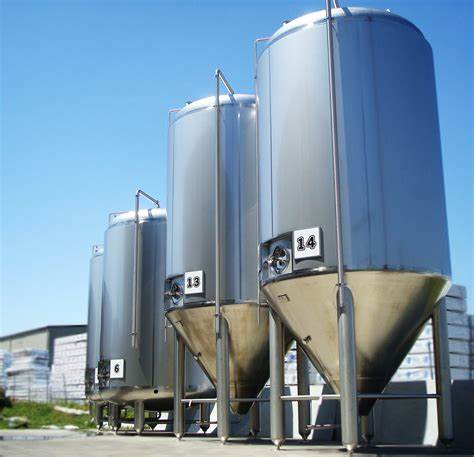
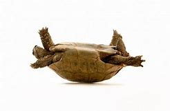

= eco 2020 - (38-39)
:toc:

---

== 38. Covid-19 is teaching hard lessons about China-only supply chains

(2020-02-29 / China / Chaguan: Globalisation under quarantine)

At the very least, an emotional decoupling *is* under way

Feb 27th 2020 |

UNTIL ABOUT the third week of January, only a few pharmaceutical executives, drug-safety inspectors and dogged(a.) China hawks *cared that* a large share of the world’s supply of antibiotics *depends on* a handful of Chinese factories. These *include* a cluster in Inner Mongolia, a northern province of windswept(a.) deserts, grasslands and unlovely industrial towns. Then *came* the covid-19 outbreak, and quarantine(n.) controls(n.) that *locked down* factories, ports and whole cities across China.

Chinese leaders *insist that* they *are well* on the way *to conquering* the virus, *allowing* them *to reopen* “leading enterprises and key links with important influence” in global supply chains. A victory over the novel coronavirus *will once again demonstrate* “the notable advantages of leadership by the Communist Party of China”, President Xi Jinping *told* 170,000 officials by video-conference on February 23rd. But even if all those boasts(n.) *come true*, foreign governments and business bosses *will not quickly forget* a frightening lesson: for some vital products, they *depend on* one country.

Where once only a few specialists *worried about* the market share *enjoyed by* the industrial chemists of Hohhot or Shijiazhuang, China’s dominance of the active pharmaceutical ingredient (API) sector *is* now the subject of hard questions in Washington’s corridors of power and the chancelleries of Europe. `主` *Ending* the world’s dependence on Chinese APIs `系` *would not be* a technical challenge. China *has not been dominant* for long. America’s last penicillin fermenter *closed* in 2004, as `主` clusters of Chinese factories, many state-owned or subsidised, `谓` *offered* efficiencies that foreign rivals *could not match*. Rather, change *would involve* upending(v.) well-established political and economic theories, *starting with* the wisdom of *allowing* private companies *to seek out* the best-value goods, with little heed(n.) *paid to* their origin.

There *is* much speculation about whether covid-19 *will accelerate* trends(n.) in America and other Western countries *to decouple* from China. In truth, `主` a rush to diversify in certain sectors `系` *is* more likely, and `主` even such a hedging of bets `谓` *would build on* trends(n.) that *have been visible* for some time.

The US-China Economic and Security Review Commission, a congressional body, *held hearings*(n.) in July 2019 *on* threats and opportunities *created by* China’s medical industries. The tone *quickly veered(v.) towards* the doomy. A senior Pentagon official, Christopher Priest, *declared that* “`主` the national-security risks of increased Chinese dominance of the global API market `谓` *cannot be overstated*(v.).” He *invited* the hearing *to imagine* China *interrupting* supplies of irreplaceable drugs, such as those that *protect* troops *against* anthrax. Another witness, Benjamin Shobert, a health-care strategist at Microsoft, *noted that* mutual dependency *was once seen as* a reason *to believe that* Sino-American relations *were* stable and safe. But in an age of rising distrust, if those same calculated dependencies *were* to become a source of fear, then “`主` much of what *has supported* the modern era of globalisation `系` *is no longer valid*.”

For implacable China hawks like Peter Navarro, who *advises* President Donald Trump *[on trade]*, the covid-19 crisis *is* a told-you-so moment. On February 23rd Mr Navarro *told* Fox Business, a television channel, *that* America *had outsourced* “far too much” of its supply chain for essential medicines. “We *have got to get it back onshore*,” he *said*. Mr Navarro, an economic nationalist and vocal(a.) tariff advocate, *is little loved* by America’s trade partners. Yet his talk of nations needing to control certain forms of production *finds an echo* in rich-world capitals.

Joerg Wuttke, the president of the European Union Chamber of Commerce in China, *says* `主` China’s dominance in sectors like pharmaceuticals and pesticides `系` *is* a topic of concern when he *visits* officials in Berlin, Brussels and elsewhere. It *does not help that* China *has shown* itself willing(n.) *to use* trade *to bully* other countries during political disputes, as when it *denied* the export of rare earths *to* Japan in 2012. He *does not expect* firms *to leave China altogether*, because it *drives* global growth in so many sectors. But Mr Wuttke *expects* the epidemic *to intensify* European discussions about industrial policy. “The globalisation of *putting* everything where production is the most efficient, *that is over*.”

James McGregor, a China veteran who *heads* the Chinese operations of APCO, an American consultancy, *watched* businesses *putting ever more eggs in the China basket* for a decade. *Hit by* rising(a.) labour costs, trade tensions and now the virus, `主` companies `谓` *have concluded that* they *need to diversify* -- though many *are struggling to find* countries (with China’s infrastructure and adaptable labour force). Against that, `主` some firms (that are in China to sell to China) `谓` *are expanding production* there, in part *to avoid* the uncertainty of tariffs. The most capable high-tech companies *see China as* “the market of the future” for *[such]* promising(a.) industries *[as]* autonomous vehicles, robotics and the internet of things. They *may be rewarded* [for their faith]. “We *are going to see* the Chinese government *be extraordinarily nice to* companies [once this virus is over],” *suggests* Mr McGregor.

Foreign trade without foreigners

One visible impact of the virus *may be* to speed(v.) changes at the top of firms. Multinationals *have increasingly appointed* Chinese executives (often Western-educated) *to run* their China operations. The epidemic *may accelerate* departures [among the foreigners who *remain*]. Air pollution *has already driven many [away]*. Some old-timers *feel* less welcome in a China (*taking* a nationalist, authoritarian *turn*). Now they *are living alone* [after *evacuating* their families], or in temporary *exile* abroad *scrambling* to find children school places(n.) in home countries *they barely know*. “A lot of my contemporaries *don’t need* much of a push” to leave, *says* a long-time China hand. Even if covid-19 *burns out soon*, it *has clarified* how the world *is growing warier(a.) of* China. Few firms *can afford* to leave completely. But an emotional decoupling *is under way*.

---

== 38. Covid-19 is teaching hard lessons about China-only supply chains 词汇解说

1. *at the (very) least* : used after amounts to show that the amount is the lowest possible （用于数量之后）至少，最少 +
-> It'll take a year, *at the very least*. 这至少需要一年时间。

1. decoupling : the separation of previously linked systems so that they may operate independently 关联系统分离;去耦, 解耦 +

1. *under way* : having started 已经开始；在进行中 +
-> *Preparations are well under way* for a week of special events in May. 五月份特别活动周的准备工作, 已经顺利开展。

1. pharmaceutical :  /ˌfɑːr-mə-ˈsuːtɪkl/  a. connected with making and selling drugs and medicines 制药的；配药的；卖药的 +
-> *the pharmaceutical industry* 制药业 +
=> 来自希腊语pharmakeia,用药，药品，制药，治疗，巫术，来自pharmakis,巫术，魔力，咒语。词义演变比较leech,医生，古义为念咒的人。

1. dogged:  /ˈdɔːɡɪd/  a showing determination; not giving up easily 顽强的；坚持不懈的 SYN tenacious +
=> 来自dog的褒义用法。 +
-> dogged determination/persistence 顽强的决心╱毅力

1. executive :  /ɪɡˈze-kjə-tɪv/  n. a person who has an important job as a manager of a company or an organization （公司或机构的）经理，主管领导，管理人员 / [C+sing./pl.v.] a group of people who run a company or an organization （统称公司或机构的）行政领导，领导层

1. antibiotic :  /ˌæntibaɪˈɑːtɪk/  抗菌素；抗生素（如青霉素）

1. windswept : a. having strong winds and little protection from them 受大风吹的；当风的

1. quarantine : n. [ U ] a period of time when an animal or a person that has or may have a disease is kept away from others in order to prevent the disease from spreading （为防传染的）隔离期；检疫 +
=> 来自拉丁语quadraginta,四十，来自quadr-,四，-gin,十，词源同ten,dean.现词义来自17世纪意大利威尼斯港对来自瘟疫区的商品和货物实行的四十天隔离检验以确保瘟疫不会入境。 +
-> *The dog was kept in quarantine* for six months. 这条狗被检疫隔离了六个月。

1. *key link* : [经] 关键环节；[经] 中心环节

1. demonstrate : v. *~ sth (to sb)* : to show sth clearly by giving proof or evidence 证明；证实；论证；说明 +
-> These results *demonstrate(v.) convincingly that* our campaign is working. 这些结果有力地证明，我们的运动正在发挥作用。

1. boast :  /boʊst/  n.夸耀；夸口

1. vital :  /ˈvaɪ-tl/  a. *~ (for/to sth)* necessary or essential in order for sth to succeed or exist 必不可少的；对…极重要的 +
-> the vitamins *that are vital for health* 保持健康必不可少的维生素

1.  once : at some time in the past 曾；曾经 +
-> I once met your mother. 我曾经见过你母亲。

1. the market share 市场占有率；市场份额

1. ingredient 成分；（尤指烹饪）原料 +
-> Our skin cream contains(v.) only *natural ingredients*. 我们的护肤霜只含天然成分。 +
=> in-,进入，使，-gred,走，层级，词源同grade,degree.即走进去的，成为其中一部分的，引申词义成份，因素。

1. API : active pharmaceutical ingredient 活性药物成分

1. corridor : /ˈkɔːrɪ-dɔːr/ n. ( NAmE also also hall·way ) a long narrow passage in a building, with doors that open into rooms on either side （建筑物内的）走廊，过道，通道

1. *THE CORRIDORS OF POWER* : ( sometimes humorous ) the higher levels of government, where important decisions are made 权力走廊（高层政治决策机构） +
->  Washington’s corridors of power

1. chancellery :  /ˈtʃænsələri/  the staff in the department of a chancellor 大臣（或大法官等）官署的全体工作人员 / [ Cusually sing. ] the place where a chancellor has his or her office 大臣（或大法官等）的官署 +
-> the chancelleries of Europe

1. penicillin : /ˌpenɪˈsɪlɪn/ 青霉素；盘尼西林

1. fermenter : /fɚ'mɛntɚ/ n. [轻] 发酵罐；发酵器 +

1. subsidize :  /ˈsʌbsɪ-daɪz/ [ VN ] to give money to sb or an organization to help pay for sth; to give a subsidy 资助；补助；给…发津贴 +
-> The housing projects *are subsidized by the government*. 这些住房项目得到政府的补贴。

1. upend :  /ʌpˈend/ v.  to turn sb/sth upside down 翻倒；倒放；使颠倒 +
-> *The bicycle lay upended* in a ditch. 自行车翻倒在一条小水沟里。 +

1. well-established : ADJ If you say that something is well-established, you mean that it has been in existence for a long time and is successful. 确立已久的

1. *give/pay heed (to sb/sth) /take heed (of sb/sth)* : to pay careful attention to sb/sth 留心；注意；听从 +
But few at the conference in London last week *heeded(v.) his warning*.
但几乎没有人在上周伦敦会议上注意他的警告。 +
=> 来自PIE*kadh,躲避，保护，词源同hat,hood.引申词义注意，留心。
+
...starting with the wisdom of allowing private companies to seek out the best-value goods, *with little heed(n.) paid to* their origin. +
首先要明智地允许私营公司寻找价值最高的商品，而不是关注它们的原产地。

1. speculation : n. *~ (that...) /~ (about/over sth)* the act of forming opinions about what has happened or what might happen without knowing all the facts 推测；猜测；推断 +
-> *There was widespread speculation that* she was going to resign. 人们纷纷推测她将辞职。

1. decouple : v. ~ sth (from sth) ( formal ) to end the connection or relationship between two things （使两事物）分离，隔断

1. diversify : v. /daɪˈvɜːr-sɪfaɪ/  (n.)增加…的品种；从事多种经营；扩大业务范围;（使）多样化，变化，不同 +
=> di-分开 + -vers-转 + -ify动词词尾 +
-> Patterns of family life *are diversifying*(v.). 家庭生活模式正在变得多样化。

1. hedge : /hɛdʒ/ N-COUNT Something that is a *hedge against* something unpleasant will protect you from its effects. 防备手段 ;几面下注; /树篱 +
-> Gold is traditionally *a hedge against inflation*.
黄金传统上是一种防范通货膨胀的手段。 +
image:../../+ img_单词图片/h/hedge.jpg[]

1. Review 评审，审查

1. congressional : a. 立法机构的；代表大会的；（美国）国会的 +
->  a congressional committee/bill 代表委员会；国会议案

1. hearing : n. an official meeting at which the facts about a crime, complaint, etc. are presented to the person or group of people who will have to decide what action to take 审讯；审理；听审；听证会

1. veer :  /vɪr/ v.  (especially of a vehicle 尤指车辆等) to change direction suddenly 突然变向；猛然转向;/(of a conversation or way of behaving or thinking 说话、行为或思想 /( technical 术语 ) ( of the wind 风 ) to change direction 改变方向  +
=> 来自 PIE*wer,弯，转，词源同 versus,toward.
+
-> The bus *veered(v.) onto the wrong side of the road*. 公共汽车突然驶入了逆行道。 +
-> The debate *veered away from the main topic of discussion*. 争论脱离了讨论的主题。 +
-> The wind *veered(v.) to the west*. 风向转西。

1. doomy : /ˈduːmi/ a.  suggesting disaster and unhappiness 显示灾难（或厄运）的；令人沮丧的 +
-> doomy predictions 不祥的预测 +
-> Their new album *is their doomiest*. 他们的新专辑是他们最失败的作品。

1. overstate :v.  to say sth in a way that makes it seem more important than it really is 夸大；夸张；言过其实 +
->  The seriousness of the crime *cannot be overstated*(v.) .  这一罪行的严重性怎么说也不为过。

1. interrupt : v. to stop sth for a short time 使暂停；使中断 +
-> *We interrupt(v.) this programme* to bring you an important news bulletin. 我们暂停本节目，插播重要新闻。

1. irreplaceable : /ˌɪrɪˈpleɪsəbl/ a. too valuable or special to be replaced （因贵重或独特）不能替代的 +
-> irreplaceable drugs

1. anthrax :  /ˈæn-θræks/  炭疽（牛羊疾病，人偶得，可致命） +
=> 来自希腊词anthrax, 炭，煤。此处指皮肤学的一种疾病症状，有如炙热的红炭。

1. witness : a person who gives evidence in court 证人;/a person who is present when an official document is signed and who also signs it to prove that they saw this happen 见证人；连署人

1. strategist : /ˈstrætə-dʒɪst/  a. a person who is skilled at planning things, especially military activities 战略家；善于筹划部署的人

1. mutual : a. used to describe feelings that two or more people have for each other equally, or actions that affect two or more people equally 相互的；彼此的 /[ only before noun ] shared by two or more people 共有的；共同的 +
-> *mutual respect/understanding* 相互的尊敬╱理解 +
-> We met at the home of *a mutual friend*. 我们在彼此都认识的朋友家中会面。

1. calculated : a. [ usually before noun ] carefully planned to get what you want 精心策划的；蓄意的 +
-> a calculated insult 蓄意的侮辱
+
*BE CALCULATED TO DO STH* : to be intended to do sth; to be likely to do sth 打算做；故意做；可能做

1. implacable :  /ɪmˈplækəbl/  a. ( of strong negative opinions or feelings 强烈的消极看法或感情 ) that cannot be changed 不能改变的;/ unwilling to stop opposing sb/sth 不愿和解的；不饶人的 +
=> im-,不，非，-plac,抚慰，安抚，词源同please,placate.
+
-> implacable hatred 难以化解的仇恨 +
-> an implacable enemy 死敌

1. hawk : a person, especially a politician, who supports the use of military force to solve problems 鹰派分子；主战分子 / 鹰；隼

1. outsource : v. [ V ] ( business 商 ) to arrange for sb outside a company to do work or provide goods for that company 交外办理；外购; 把…外包 +
-> We *outsource*(v.) all our computing work. 我们把全部计算机技术工作包给外边去做。

1.  essential medicines 基本药物

1. vocal : a. telling people your opinions or protesting about sth loudly and with confidence 大声表达的；直言不讳的 +
-> *He has been very vocal*(a.) in his criticism of the government's policy. 他对政府政策的批评一直是直言不讳。

1. tariff :  /ˈtærɪf/ n. a tax that is paid on goods coming into or going out of a country 关税 /a list of fixed prices that are charged by a hotel or restaurant for rooms, meals, etc., or by a company for a particular service （旅馆、饭店或服务公司的）价目表，收费表

1. advocate :  /ˈædvəkeɪt；-et/  n. *~ (of/for sth/sb)* a person who supports or speaks in favour of sb or of a public plan or action 拥护者；支持者；提倡者 /v. to support sth publicly 拥护；支持；提倡 +
=> 前缀ad-, 去，往。词根voc, 说，同voice. +
-> *a staunch advocate*(n.)) of free speech 言论自由的坚定拥护者

1.  the European Union *Chamber （议会的）议院 of Commerce* in China 中国欧盟商会

1. pesticide : /ˈpestɪ-saɪd/ 杀虫剂 +
=> pest,害虫，-cid,杀，词源同herbicide.

1. bully : v. *~ sb (into sth/into doing sth)* to frighten or hurt a weaker person; to use your strength or power to make sb do sth 恐吓；伤害；胁迫 +
-> *My son is being bullied* at school. 我儿子在学校里受欺负。

1. dispute : n.  *~ (between A and B) /~ (over/about sth)* an argument or a disagreement between two people, groups or countries; discussion about a subject where there is disagreement 争论；辩论；争端；纠纷 +
=> dis-分离 + -put-考虑 + -e动词词尾 → 各人想法不一样,各抒己见
+
-> *industrial/pay disputes* 劳资╱工资纠纷

1.  *rare earth* 稀土

1. altogether : ad. (used to emphasize sth) completely; in every way （用以强调）完全，全部 +
-> The train went slower and slower *until it stopped altogether*. 火车愈来愈慢，最后完全停了。 +
-> I am not *altogether happy about* the decision. 我对这个决定并不十分满意。 +
-> It was *an altogether different situation*. 这完全是另外一种情况。

1. intensify : v. to increase in degree or strength; to make sth increase in degree or strength （使）加强，增强，加剧 +
=> in-入,向内 + -tens-延伸 + -ify动词词尾 +
-> The opposition leader *has intensified(v.) his attacks* on the government. 反对派领袖加强了对政府的攻击。

1. operation : the activity or work done(v.) in an area of business or industry （工商业）活动，业务
-> the firm's *banking operations* overseas 这家公司的国外银行业务

1. *put all your eggs in one basket* : to rely on one particular course of action for success rather than giving yourself several different possibilities 寄希望于一件事情上

1. adaptable : a. ( approving ) able to change or be changed in order to deal successfully with new situations 有适应能力的；能适应的 +
-> Successful businesses *are highly adaptable(a.) to economic change*. 成功的企业对于经济转变的适应能力很强。

1. *labour force* （全公司或全国的）劳动力

1. the internet of things 物联网

1. extraordinary : a. not normal or ordinary; greater or better than usual 不平常的；不一般的；非凡的；卓越的 +
-> an extraordinary achievement 卓越的成就

1. *Foreign trade* 外贸，[贸易] 对外贸易

1. multinational : n.  /ˌmʌltiˈnæʃnəl/  a company that operates in several different countries, especially a large and powerful company 跨国公司

1. departure : n.  *~ (from...)* the act of leaving a place; an example of this 离开；起程；出发 +
-> *His sudden departure* threw the office into chaos. 他的突然离去使这个部门陷入一片混乱。

1. old-timer : an old man 老人 /a person who has been connected with a club or an organization, or who has lived in a place, for a long time 老会员；老成员；老居民；老资格的人

1. nationalist 民族主义者；怀有本民族优越感者;国家主义者

1. authoritarian :  /əˌθɔːrəˈte-riən/  a. believing that people should obey authority and rules, even when these are unfair, and even if it means that they lose their personal freedom 威权主义的；专制的 +
-> an authoritarian regime/government/state 威权主义的政体╱政府╱国家

1. evacuate :v. to move people from a place of danger to a safer place （把人从危险的地方）疏散，转移，撤离 +
-> Police evacuated(v.) nearby buildings. 警方已将附近大楼的居民疏散。

1. exile : /ˈeksaɪl,ˈeɡzaɪl/ v. n. 流放；放逐 +
-> the party's exiled leaders 该党的流亡领袖
-> to be/live *in exile*(n.) 在流放中；过流放生活

1. scramble : v. *~ (for sth)* to push, fight or compete with others in order to get or to reach sth 争抢；抢占；争夺 +
-> Shoppers *were scrambling to get* the best bargains. 顾客争先恐后地抢购最便宜的特价商品

1. contemporary :  /kənˈtempəreri/  a person who lives or lived at the same time as sb else, especially sb who is about the same age 同代人；同辈人；同龄人 +
-> He was *a contemporary of Freud* and may have known him. 他是弗洛伊德的同代人，可能认识弗洛伊德。

1. long-time : [ only before noun ] having been the particular thing mentioned for a long time 为时甚久的 +
->  his long-time colleague 他的老同事

1.  *hand in sth* : the part or role that sb/sth plays(v.) in a particular situation; sb's influence in a situation 角色；作用；影响 +
->  China hand 中国通 +
-> Early reports suggest *the hand of rebel* forces(v.)使发生（尤指趁他人尚未准备） in the bombings. 早期的报道暗示叛乱武装插手了爆炸案。 +
-> Several of his colleagues *had a hand* in his downfall. 他的几位同事对他的下台起了作用。 +
-> This appointment was an attempt *to strengthen her hand* in policy discussions. 这次任命旨在加强她在政策讨论中的作用。

1. clarify : v.  to make sth clearer or easier to understand 使更清晰易懂；阐明；澄清 +
-> to clarify a situation/problem/issue 澄清情况╱问题

1. wary :  /ˈweri/ a. *~ (of sb/sth) /~ (of doing sth)* : careful when dealing with sb/sth because you think that there may be a danger or problem （对待人或事物时）小心的，谨慎的，留神的，小心翼翼的 +
-> *Be wary of strangers* who offer you a ride. 提防那些主动让你搭车的陌生人。 +
-> *She was wary(a.) of* getting involved with him. 她唯恐和他有牵连。

1. *under way* : having started 已经开始；在进行中 +
-> *Preparations are well under way* for a week of special events in May. 五月份特别活动周的准备工作已经顺利开展。

---

== 39. The Trump administration doesn’t like high-skilled immigrants either

( 2020-02-29 /United States /  High-skilled immigration: The invisible wall)

The White House *is quietly making life hard* for them

Feb 29th 2020 | WASHINGTON, DC

[WHEN `主` SURESH IYER, who *designs* trading technology *for* a large financial firm in New York, `谓` *moved to* America from Mumbai in 2013] he *was not sure* {how long he *would stay*}. But his career *thrived*, his wife *moved* to join him /and soon they had a daughter. The family *put down roots* /and *decided* they *would like to settle permanently*. But it is not easy. Mr Iyer -- a pseudonym -- *is* on an H1B visa, a temporary permit for highly-skilled workers. He and his wife *qualify for* green cards (and their daughter *is* an American citizen). But *thanks to* an annual cap on the number of cards *available to* Indian workers, they *could be waiting* decades *to get them*. Mr Iyer’s *feels* {his life *is* on hold}. “It *is getting* crazier and crazier,” he says.

[Since long before his election in 2016] Donald Trump *has attacked* undocumented(a.) immigrants, whom he *sees as* criminals(n.) *coming* to sell drugs, *commit crimes* and *steal jobs*. His signature policy, *to build* a wall *on* the Mexican border, *has been fitfully effected*, though *without* the alligator moat (he *reportedly wanted*). When Mr Trump first *promised* to construct(v.) the wall, he *said* {it *would have* a “big beautiful door” *to let in* legal migrants}. In fact, under his administration, legal migrants *are finding* themselves *shut out too*. It *is not* only those *banned by* the president’s more dramatic(a.) executive orders; `主` families like Mr Iyer’s `谓` *are being affected* by the grinding of sand into the wheels of the immigration system. The American Immigration Lawyers Association (AILA), an industry group, *calls this* the president’s invisible wall.

`主` *Waiting* times *for* almost all sorts of visas, permits and renewals `谓` *have shot up*. *Applying for* a green card while in the United States *took* six and a half months in 2016; it now *takes* almost a year. `主` Work permits(n.), *typically issued to* the spouses of certain foreign workers, which *used to* take(v.) two months to process, `谓` now *take* almost twice that [on average]. Overall `主` the “adjudication rate”, or the share of applications *processed* in a given year, `谓` *has fallen sharply*, *from* 72% in 2015 *to* 56% last year. The number of visa forms (outstanding) *is* at its highest level ever, with 5.7m outstanding.

*Is* this gumming up of the system `表` deliberate(a.)? *It* is hard *to prove that*, *says* Sarah Pierce, of the Migration Policy Institute, a think-tank. But several policies *seem* perfectly designed(v.) to lengthen(v.) queues. All employment-based green-card applicants(n.) *must now have* a face-to-face interview, which *swallows up* officials’ time. `主` More and more applicants(n.) for work visas `谓` *are being asked* to provide(v.) supporting(a.) documents *to show* what their job *will involve* /or *prove* their qualifications. Before Mr Trump *took office*, at most a fifth of workers *were asked for* extra evidence. In the final quarter of last year, three-fifths *were*.

And *it is getting more expensive*. `主` *Applying for* a marriage-based green card, which *costs* $1,760 now, `谓` *will rise to* $2,750. *Becoming* a citizen will *go* from $640 to $1,170. Some people *would even have to pay* $50 *to apply for* asylum(n.). Yet staffing *is not increasing*. In fact, *as* Greg Chen of AILA *points out*, some of the agency’s budget *has even been directed towards* Immigration and Customs Enforcement, the agency *responsible for* deportations.

When somebody *was refused* an extension to their visa in the past, they *were usually trusted* to leave(v.) the country (and most *did*). These days they *are thrown straight into* immigration courts *for* deportation, *says* Mr Chen. Many of these people *probably qualified for* a visa, and *simply made a mistake* in *filling in* their applications.

Some groups *have been singled out*. In April 2017 Mr Trump *signed* the “*Buy* American, *Hire* American” executive order. That *tightened rules on* the H1B visas, the one (Mr Iyer *uses*), most of which *go to* Indian tech workers. Since Mr Trump’s executive order, denial rates *have shot up*, particularly [at large Indian-owned consultancies]. [In 2016] Infosys, one such company which *is* the largest single recipient of H1Bs, *was allowed* 14,000 visas. Just 3% of applicants *were rejected*. By last year, the figure *had fallen to* just 3,200 /and 36% of applicants *were rejected*. Consultancies *are being told*(v.) *to provide* evidence of exactly which clients(n.) (their workers *would be serving*), *for* the three-year length of their visas. *So much* for that big beautiful door.

---

== 39. The Trump administration doesn’t like high-skilled immigrants either 词汇解说

1. trading technology 交易技术,贸易技术

1. *put down roots*  : 定居；（到一个新地方）落地生根

1. settle : (v.)定居;殖民；作为移民在殖民地定居 +
-> *She settled in Vienna* after her father's death. 父亲死后，她就在维也纳定居了。

1. pseudonym :  /ˈsuːdənɪm/  假名；化名；笔名 +
=> pseudo-,假的，伪的，-onym,名字，词源同name,anonymous.

1. H-1B 签证 +
美国的签证，从A类签证一直到Z类签证。 +
H-1B 签证的特点: +
- 非移民签证. 但H1B持有人允许申请移民美国.
- 发放给美国公司雇佣的外国籍有专业技能的员工. 即发给特殊专业人员(Specialty Occupations 工作；职业) 的临时工作签证(Temporary Worker Visas) (H-1B)
- 在美国工作三年，然后可以再延长三年.
- 每年都有配额限制.
- 申请日期是每年的4月1日. 每年4月1日公布的配额其实是下一年度的配额，而下一年度的配额生效日期是当年的10月1日. 即如果你5月拿到了配额和签证，你必须等到10月1日才能在美国为你的雇主工作。
- 申请时, 需要有美国雇主的担保. 即, 必须首先拿到一家美国公司的录用书。

1. *qualify (sb) (for sth)* : to have or give sb the right to do sth 有权，使有权（做某事） +
-> *To qualify*, you must have lived in this country for at least three years. 你必须在这个国家居住至少三年才能享有此权利。

1. green card : N-COUNT A green card is a document showing that someone who is not a citizen of the United States has permission to live and work there. 绿卡 (允许外国公民在美国生活和工作的证件) +
Permanent Resident Card 永久居留卡(但未入籍) , 绿卡，即外国人永久居留证. +
- 持有绿卡, 可以在一定时间内免去入境签证.
- 在美国国内没有选举权.
- 绿卡在持有人离开美国时间过长之后, 很可能被撤销. 而移民美国的话, 其美国公民身份几乎一辈子不能撤销.

1. cap : an upper limit on an amount of money that can be spent or borrowed by a particular institution or in a particular situation （可用或可借资金的）最高限额 +
-> The government has placed(v.) *a cap on local council spending*. 政府给地方议会的经费支出, 规定了最高限额。 +
-> But thanks to *an annual cap*(n.) on the number of cards available to Indian workers, they could be waiting decades to get them. +
-> 但由于印度工人每年可获得的绿卡数量受到限制，他们可能要等上几十年才能拿到绿卡。

1. *on hold* : delayed until a later time or date 推迟；中断 +
-> *She put her career on hold* to have a baby. 她中断了事业以便生孩子。

1. undocumented adj. 无事实证明的；无正式文件的, 非法入境的 +
-> undocumented immigrant 无证件的移民, 非法移民

1. criminal : a person who commits a crime 罪犯

1. signature :  /ˈsɪɡnətʃər/  n. the act of signing sth 签名；署名；签字；签署 +
-> Two copies of the contract *will be sent to you for signature*. 合同一式两份，将送交您签署。

1. fitfully : ad.断断续续的；一阵阵的；间歇的 +
-> Electricity *comes fitfully* 电力供应时断时续

1. alligator :  /ˈælɪɡeɪtər/  钝吻鳄

1. moat : /moʊt/ 护城河 +
=> 来自PIE*smut,污泥的，脏的，词源同smut,mud.后词义由城墙过渡到护城河。

1. dramatic : (of a change, an event, etc. 变化、事情等 ) sudden, very great and often surprising 突然的；巨大的；令人吃惊的;/戏剧性的；戏剧般的；夸张做作的 +
-> a dramatic increase/fall/change/improvement 暴涨；暴跌；巨变；巨大的改进

1. grind : *grind sth into sth /grind sth in* :  to press or rub sth into a surface 用力挤压，用力擦（入表层） / *~ sth (down/up) /~ sth (to/into sth)* to break or crush sth into very small pieces between two hard surfaces or using a special machine 磨碎；碾碎；把…磨成粉 +
-> He *ground his cigarette* into the ashtray. 他把香烟按在烟灰缸里捻灭。

1. visa : *a stamp or mark* put in your passport by officials of a foreign country that gives you permission to enter, pass through or leave their country （护照的）签证 +
-> visa form(n.) 签证的表格

1. permit : n. an official document that gives sb the right to do sth, especially for a limited period of time 许可证，特许证（尤指限期的） +
->  to issue a permit 签发许可证

1. renewal : /rɪˈnuːəl/ n. the act of making a contract, etc. valid for a further period of time after it has finished （对合同等的）有效期延长，展期，续订，更新 +
-> *The lease comes up for renewal*(n.) at the end of the month. 本租约到月底需要办理展期。

1. *shoot up* : to rise suddenly by a large amount 陡增；猛涨；迅速上升;/蹿个儿；迅速长高 +
-> *Ticket prices shot up* last year. 去年票价猛涨。 +
-> Since Mr Trump’s executive order, *denial rates have shot up*, particularly [at large Indian-owned consultancies].

1. issue : /ˈɪsjuː/ v. *~ sth (to sb) /~ sb with sth* :  to give sth to sb, especially officially （正式）发给，供给
-> to issue passports/visas/tickets 发护照╱签证╱票

1. spouse : /spaʊs,spaʊz/ ( formal ) ( law 律 ) a husband or wife 配偶

1. overall : generally; when you consider everything 一般来说；大致上；总体上 +
-> *Overall*, this is a very useful book. 总的来说，这是一本很有用的书。

1. adjudication 裁定；判决 +
-> *the “adjudication  rate”*, or the share of applications (processed  in a given year) “裁决率”，即某一年受理申请的比例

1. process : v.  to walk or move along slowly in, or as if in, a procession 列队行进；缓缓前进 / to deal officially with a document, request, etc. 审阅，审核，处理（文件、请求等） +
-> It will take a week *for your application to be processed*. 审核你的申请需要一周时间。

1. outstanding : a.  (of payment, work, problems, etc. 款项、工作、困难等) not yet paid, done, solved, etc. 未支付的；未完成的；未解决的 +
-> She has *outstanding(a.) debts of over ￡500*. 她未清偿的债务超过500英镑。 +
-> A lot of work *is still outstanding*(a.). 许多工作尚未完成。

1. gum sth up: 用黏胶将某物粘牢

1. queue :  n. ( BrE ) ( NAmE also *line* ) a line of people, cars, etc. waiting for sth or to do sth （人、汽车等的）队，行列 +
-> the bus queue 排队等候公共汽车的人

1. applicant :  /ˈæplɪkənt/  n. *~ (for sth)* : a person who makes a formal request for sth (= applies for it), especially for a job, a place at a college or university, etc. 申请人（尤指求职、进高等学校等） +
-> There were over 500 applicants for the job. 有500多人申请这份工作。 +
-> All employment-based green-card applicants. 所有为了工作目的的绿卡申请人 +
-> a marriage-based green card

1. at most 至多, 不超过 +
-> I do it for maybe *an hour at most*. 我或许最多呆一个钟头。

1. the final quarter  第四季度, 最后一个季度 +
the first quarter： 第一季度

1. asylum :  /əˈsaɪləm/ n. ( also formal also poˌlitical aˈsylum ) [ U ] protection that a government gives to people who have left their own country, usually because they were in danger for political reasons （政治）庇护，避难 +
=>  a（没有）+syl（抓捕权）+um（地方）→没有抓捕权的地方→庇护所 +
-> to seek/apply for/be granted *asylum* 寻求╱申请╱获准政治避难

1. staffing : N-UNCOUNT Staffing refers to the number of workers employed to work in a particular organization or building. 配备的职员人数 +
-> *Staffing levels in prisons* are too low. 监狱里的人员配备数量太少。

1. customs : n. /ˈkʌstəmz/ ( usually *Customs* ) ( BrE also also *Customs and Excise* ) ( US also  *US Customs Service* ) the government department that collects taxes on goods bought and sold and on goods brought into the country, and that checks what is brought in （政府部门）海关 +
-> a customs officer 海关官员 +
-> Immigration and Customs Enforcement  移民和海关的执法

1.  enforcement : N-UNCOUNT If someone carries out the enforcement of an act or rule, they enforce it. 执行 +
->  The doctors want *stricter enforcement* of existing laws. 医生们希望现行法律的执行能更严格。

1. deportation :  /ˌdiːpɔːrˈteɪʃn/  驱逐出境；放逐

1. *single sb/sth out (for sth/as sb/sth)* : to choose sb/sth from a group for special attention 单独挑出 +
-> *She was singled out* for criticism. 把她单挑出来进行批评。

1. *executive order* 行政命令；行政令

1. consultancy : n. a company that gives expert advice on a particular subject to other companies or organizations 咨询公司
-> a management/design/computer, etc. consultancy 管理、设计、计算机等咨询公司

1. recipient : n.  /rɪˈsɪpiənt/  a person who receives sth 受方；接受者 +
=> re-,向后，往回，-cip,抓住，词源同 receive,participate.即接收者。 +
->  recipients of awards 领奖者

1. *So much for* : used to express disappointment at the fact that a situation is not as you thought it was （表示失望或恼火）…到此为止，…只好作罢 +
-> The car won't start. *So much* for our trip to the beach. 汽车又出毛病了，我们去海边的旅行只好作罢。

