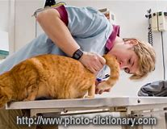

= eco
:toc:

---

== 100. Spring freeze

(eco 2020-5-2/China/Graduate unemployment: Spring freeze)

In China, millions of students brace(v.) for joblessness

The government is anxious, too

Apr 30th 2020 | SHANGHAI

Editor’s note: The Economist is making some of its most important coverage of the covid-19 pandemic *freely available to* readers of The Economist Today, our daily newsletter. 目的状 To receive it, register here. For our coronavirus tracker and more coverage, see our hub

“GRADUATION *EQUALS* unemployment” has long been a common saying in China (the nouns *share* a character). It *is often used* in jest by university students 当...时 as final exams *loom*(v.). But for the 9m [or so] *due to graduate* in June -- a record high -- the words *convey*(v.) a dark reality. As China *limps back to* work(n.) after covid-19, their job prospects are truly bleak. They *will enter* the workforce 当...时 as prospective employers *mull*(v.) lay-offs(n.) or hiring freezes. For a middle class (*used(a.) to* relentlessly strong economic growth), the shock will be great.

As it *surveys* an economy (*ravaged* by the disease), the leadership’s biggest worry is unemployment. In February the urban jobless rate jumped to 6.2%, the highest ever. In March it fell slightly to 5.9% as businesses reopened. But official figures *mask*(v.) the scale of the problem. Urban unemployment could reach 10% this year, *reckons* the Economist Intelligence Unit, a sister company of The Economist. And that does not include the tens of millions of migrants who *sat out* the epidemic in their ancestral(a.) villages. Many of them now *have* no jobs *to return to* in the cities.

China’s leaders *describe* the problem of graduate unemployment *as* a matter of “paramount importance”. In recent days university officials *around* the country *have been holding meetings* to discuss(v.) how to ensure that {[as many as possible] *find* jobs}. They *have often used* similar language, *stressing* the “urgency” of this “political task” *relating to* “social stability”. Jobless migrants *make* officials anxious, too. But the party *frets more about threats* involving better-educated people (with urban roots /and strong social networks).

Last year just over half of entrants(n.) to China’s urban workforce *were* university graduates. Usually about 60% of them would be hired by small- and medium-sized enterprises. But such firms *have been* among those (*hardest-hit* by the coronavirus). On April 14th Li Keqiang, the prime minister, told his cabinet that the situation for this year’s graduates *was* “grim”.

Companies *normally begin* *scouring*(v.) campuses *for* recruits soon after the spring-festival holiday (another big hiring round *takes place* in the autumn). This time, however, with universities *shut* and big gatherings *banned*, the entire process *was “wiped out”*, says a business veteran.

Some employers *have gone* digital, using video interviews and online tests. But many, *reeling from* the impact of work stoppages(n.) and still-tepid(a.) consumer demand, *have cut* hiring. A survey of 1m companies by Peking University’s Guanghua School of Management and Zhaopin, a job-search site, *found* there *were* 30% fewer openings(n.) in the first quarter *compared with* last year. Those for fresh graduates in finance *fell* by more than 50% this spring, according to Boss Zhipin, another recruitment website -- even as the number of final-year students (*searching for* a job) *rose* by half. With less competition, firms that are still hiring *can pick* the best and brightest. But they are also likely *to plump for* old hands rather than trainees.

Competition for graduate jobs *had already grown fierce* in recent years, particularly for the most prestigious positions. Now it is cut-throat(a.). Miriam Zhang, a graduate from Weifang, a city in the northern province of Shandong, *has sent out* 100 applications in the past two months and got responses only to six. One job, she *heard*, *had attracted* 3,000 hopefuls(n.).

At least the epidemic *has helpfully “weeded out”* weak or dodgy companies, Ms Zhang *notes*. She *is* now keener(a.) than ever *to get hired* by a big firm, and *is mainly searching for* openings(n.) at state-owned companies. In a survey by China Youth Daily, an official newspaper, more than 60% of respondents *said* covid-19 *had steered* them *towards* “more stable” work. [To many] that *means* finding an employer with links to the government.

Officials are trying to satisfy such demand. They have promised more openings in the civil service (not least in rural areas) as well as in the army. They *have directed* state-owned businesses *to boost* their recruitment of new graduates. Sinopec, an oil giant, *is hiring* another 3,500 *on top of* the 6,600-odd *it has already taken on* -- the most people *it has ever signed up* in a year. Other state-owned firms *are also taking on* record numbers. They *are giving preference(n.) to* graduates from Hubei province, where the outbreak *began*. (This is *in response to* an appeal from the central government that firms *should stop* *discriminating(v.) against* Hubei residents, who *are often treated with suspicion* because of their province’s reputation as a covid-19 disaster zone.) The government has also told universities to offer an additional 200,000 places for graduate studies.

Until recently, job-hunting (involving intercity travel) *was hampered* by quarantine-related restrictions. Even though such measures *have been eased* in most places, hassles(n.) *remain* (see Chaguan). Wang Zheqi, who is meant(a.) to graduate this year in Shanghai, had hoped to use her dorm room as a base for job-hunting. Instead she is stuck in her hometown because her university is still closed and she *cannot afford* off-campus accommodation in Shanghai.

Students *did not have to search for jobs* until the 1990s. Instead they had to take positions (*assigned to them* by the government). As a result of covid-19, officials *are getting more involved in* finding(v.) work for students *than* they have been since those days. Xinchao Media, an advertising company, says that the government of Chengdu, the south-western city where the firm is headquartered, *has offered* to recommend graduates *for* its job openings. The city of Beijing, among others, has launched a recruitment website for people preparing to graduate.

Many governments *are also rewarding* firms that *hire* graduates. In Shanghai, the district of Pudong *is offering* them subsidies and *reduced* social-security payments worth up to 2,000 yuan ($282) for each local graduate they take on. Others *are giving* refunds(n.) on social-security contributions(n.) *to* companies that *do not lay off* workers.

The government is right to worry about social stability. Well-educated young people have been in the vanguard(n.) of many of China’s biggest protest movements of the past century. `主` Students (whose futures *are clouded* by the unaffordability of housing(n.) /and competition for jobs with immigrants from the Chinese mainland) `系` were *at the forefront of* last year’s unrest in Hong Kong. As the covid crisis *subsides*(v.) in China, social tensions are becoming more evident. Hundreds of shop owners recently *took to* the streets of the southern city of Guangzhou and dozens *gathered* outside a mall in Wuhan, the capital of Hubei, *to demand* rent deductions after weeks of unemployment. (Videos of the protests were swiftly removed from the internet.)

Graduating at a time of such economic hardship could be more than just a temporary setback. Studies show that it can have “a huge impact” on lifetime earnings, says Li Jin of the University of Hong Kong. That is because many *will go into* a different line of work *from* the one they had hoped to pursue, and for lower pay. In normal times, according to Zhaopin, a third of Chinese graduates *aim to earn* between 6,000 and 8,000 yuan a month in their first jobs, but fewer than one in five *end up* doing so. Their disappointment *will be* far greater this year -- and *may last* well beyond it.

*Dig* deeper:
For our latest coverage of the covid-19 pandemic, *register for* The Economist Today, our daily newsletter, or *visit* our coronavirus tracker and story hub

---

== 100. Spring freeze 词汇

1. *brace(v.) ~ sb/yourself (for sth)* : to prepare sb/yourself for sth difficult or unpleasant that is going to happen （为困难或坏事）使作准备；使防备

1. coverage(n.): the reporting of news and sport in newspapers and on the radio and television 新闻报道

1. newsletter(n.)  /ˈnuːz-letər/ a printed report containing news of the activities of a club or organization that is sent regularly to all its members （某组织的）内部通讯，简讯

1. GRADUATION : the act of successfully completing a university degree, or studies at an American high school （大学或美国高中的）毕业

1. *common saying* 民间流传的通俗语句, 俗语

1. jest :(n.) ( old-fashioned ) ( formal ) something said or done to amuse people 笑话；俏皮话；打趣；玩笑
+
=> 来自拉丁语gesta,事迹，英雄故事，来自gerere,带来，词源同belligerent,digest.原指讲述英雄故事，通常带有夸张色彩，最后引申词义开玩笑，打趣，逗笑。

1. *in jest* : as a joke 开玩笑地；闹着玩

1. or so 大约，左右

1. convey(v.) /kənˈveɪ/  *~ sth (to sb)* : to make ideas, feelings, etc. known to sb SYN communicate 表达，传递（思想、感情等） +
-> Please convey(v.) my apologies to your wife. 请向你的妻子转达我的歉意。

1. limp : v. to walk slowly or with difficulty because one leg is injured 瘸着走；跛行；蹒跚 / to move slowly or with difficulty after being damaged （受损后）缓慢行进，艰难地移动

1. workforce : n. all the people in a country or an area who are available for work （国家或行业等的）劳动力，劳动大军，劳动人口 +
-> A quarter of *the local workforce* is/are unemployed. 本地四分之一的劳动力都失业了。

1. prospective : a. expected to do sth or to become sth 有望的；可能的；预期的；潜在的 / expected to happen soon 即将发生的；行将来临的 +
-> *a prospective buyer* 可能的买主 +
-> They are worried about *prospective changes* in the law. 他们担心即将修改法律。

1. mull /mʌl/ : *MULL STH OVER* : to spend time thinking carefully about a plan or proposal 认真琢磨，反复思考（计划、建议等）
+
=> 来自中古英语mullyn,磨粉，来自PIE*mel,磨，锤打，词源同mill,mallet.引申词义认真琢磨， 反复思考。

1. lay-offs : n. 下岗人员
1. lay-off : PHRASAL VERB If workers *are laid off*, they are told by their employers to leave their job, usually because there is no more work for them to do. 解雇

1. relentless : a. not stopping or getting less strong 不停的；持续强烈的；不减弱的 +
-> *her relentless pursuit* of perfection 她对完美的不懈追求

1. *used(a.) ~ to sth/to doing sth* :  familiar with sth because you do it or experience it often 习惯于；适应 +
-> *I'm not used to eating so much* at lunchtime. 我不习惯午饭吃那么多。

1. survey : v. to look carefully at the whole of sth, especially in order to get a general impression of it 查看；审视；审察 +
-> The next morning *we surveyed the damage* caused by the fire. 次日清早我们查看了火灾的破坏情况。

1. ravage /ˈrævɪdʒ/ v. [ VN ] [ usually passive ] to damage sth badly 毁坏；损坏；严重损害 +
=> 来自拉丁语 rapere,抓走，夺走，词源同 rape,ravish.

1. *the highest ever* 创历史新高. +
ever : ad. used in negative sentences and questions, or sentences with if to mean ‘at any time’ （用于否定句和疑问句，或与if连用的句子）在任何时候，从来

1. mask : v.  to hide a feeling, smell, fact, etc. so that it cannot be easily seen or noticed 掩饰；掩藏 +
-> *She masked(v.) her anger* with a smile. 她用微笑来掩饰她的愤怒。

1. *Intelligence Unit* 智库

1. *SIT STH OUT* :  to stay in a place and wait for sth unpleasant or boring to finish 耐心等到结束；熬到结束 +
-> *We sat out the storm* in a cafe. 我们坐在一家咖啡馆里，一直等到暴风雨过去。

1. ancestral /ænˈsestrəl/ : ADJ You use ancestral to refer to *a person's family in former times*, especially when the family is important and has property or land that they have had for a long time. 祖先的；祖传的 +
-> ...the family's *ancestral home* in southern Germany. …这一家在德国南部的祖宅。 +
-> *Ancestral Spirit* 先祖之魂, 先祖之灵

1. paramount  /ˈpærəmaʊnt/ a. more important than anything else 至为重要的；首要的 +
-> This matter is *of paramount importance* . 此事至关重要。
+
=> 来自古法语paramont,超过，超越，来自par,通过，穿过，整个的，amont,上面，山顶，词源同amount,mountain.即到达山顶，引申词义至高无上的，至尊的。首字母大写Paramount为好莱坞电影公司名。

1. *fret (v.) ~ (about/over sth)* ( especially BrE ) to be worried or unhappy and not able to relax 苦恼；烦躁；焦虑不安 +
-> *Fretting about it* won't help. 苦恼于事无补
+
=> 来自Proto-Germonic*fra-etan, 吞噬，吃尽，*fra-, 完全的，词源同per-, *etan, 吃，词源同eat. 用来指魔鬼或维京海盗，后用于心理含义，指焦虑紧张等。

1. entrant  /ˈentrənt/  n. a person who has recently joined a profession, university, etc. 新职员；新生；新会员；新成员

1. cabinet : n. ( usually *the Cabinet* ) [ C+sing./pl.v. ] a group of chosen members of a government, which is responsible for advising and deciding on government policy 内阁

1. scour (v.) /ˈskaʊər/ *~ sth (for sb/sth)* to search a place or thing thoroughly in order to find sb/sth （彻底地）搜寻，搜查，翻找

1. campus : n. the buildings of a university or college and the land around them （大学、学院的）校园，校区

1. recruit : /rɪˈkruːt/ n. a person who joins an organization, a company, etc. 新成员

1. round : n.
a set of events which form part of a longer process 阶段；轮次 +
-> *the next round* of peace talks 下一轮和谈

1. *wipe sb/sth out* : [ often passive ] to destroy or remove sb/sth completely 彻底消灭；全部摧毁 +
-> Whole villages *were wiped out* by the earthquake. 地震把整座整座的村庄夷为平地。

1. *reel (v.) ~ (at/from/with sth)* to feel very shocked or upset about sth 感到震惊；感觉心烦意乱
+
v.[ usually + adv./prep. ] to move in a very unsteady way, for example because you are drunk or have been hit 踉跄；摇摇晃晃地挪动；蹒跚 /to seem to be spinning around and around 似乎在不停旋转；仿佛天旋地转 +
-> When he opened his eyes, *the room was reeling*. 他睁开眼睛时，房间似乎在不停地旋转。
+
image:../../+ img_单词图片/r/reel.jpg[]

1. stoppage :  /ˈstɑːpɪdʒ/ n.  a situation in which people stop working as part of a protest or strike 停工；罢工 /( sport 体 ) an interruption in the game for a particular reason 中断比赛 /  a situation in which sth does not move forward or is blocked 堵塞；阻塞 +
=> stop,停止，停工，-age,名词后缀。
+
-> Play resumed quickly *after the stoppage*. 比赛中断后不久又继续进行。 +
-> *a stoppage of blood* to the heart 通往心脏血液的阻塞

1. tepid :  /ˈtepɪd/ a. slightly warm, sometimes in a way that is not pleasant 不冷不热的；微温的；温吞的 +
->  a tepid bath 温水浴

1. openings : n. a job that is available 空缺的职位 +
-> *There are several openings* in the sales department. 销售部有几个空缺。

1. final-year students 毕业前最后一年的学生, 即将毕业的大学生

1. competition :  /ˌkɑːmpəˈtɪʃn/ n. *~ (between/with sb) /~ (for sth)* [ U ] a situation in which people or organizations compete with each other for sth that not everyone can have 竞争；角逐

1. the best and brightest +
 bright :
intelligent; quick to learn 聪明的；悟性强的

1. *plump (v.) for sb/sth* : ( informal ) to choose sb/sth from a number of people or things, especially after thinking carefully 慎重挑选；筛选

1. trainee :  /ˌtreɪˈniː/ n. a person who is being taught how to do a particular job 接受培训者；实习生；见习生

1. graduate jobs 毕业生就业

1. prestigious : /preˈstiːdʒəs/ a. [ usually before noun ] respected and admired as very important or of very high quality 有威望的；声誉高的 +
-> a prestigious university 名牌大学
+
=> 这个单词的本意就是魔术表演中的招数、特技的意思。它源自praestringere，由prae（pre，在……前面）+ stringere（捆绑），字面意思就是“在人面前假装把自己捆绑起来”。

1. cut-throat : a. ( of an activity 活动 ) in which people compete with each other in aggressive and unfair ways 竞争激烈的；残酷无情的；不公的

1. application : n. *~ (to sb) (for sth/to do sth)* :  a formal (often written) request for sth, such as a job, permission to do sth or a place at a college or university 申请；请求；申请书；申请表

1. hopeful : n. a person who wants to succeed at sth 希望成功的人；雄心勃勃的人 +
-> *50 young hopefuls* are trying for a place in the England team. 50名雄心勃勃的年轻人亟欲跻身英格兰队。

1. *weed sth/sb out* : to remove or get rid of people or things from a group because they are not wanted or are less good than the rest 清除，剔除，淘汰（不需要的或较差的人或物）

1. dodgy : /ˈdɑːdʒi/ a. not working well; not in good condition 有毛病的；运转不良的；状况不佳的 /involving risk, danger or difficulty 冒险的；危险的；困难的 /seeming or likely to be dishonest 狡猾的；狡诈的；可疑的 +
-> I can't play -- *I've got a dodgy knee*. 我不能玩了—我的膝盖出了毛病。 +
-> If you *get into any dodgy situations*, call me. 如果你遇上什么难事，给我打电话。
-> He made a lot of money, using some *very dodgy methods*. 他采用极其狡诈的手段赚了许多钱。 +

1. respondent : n. a person who answers questions, especially in a survey 回答问题的人；（尤指）调查对象 /
( law 律 ) a person who is accused of sth 被告

1. steer : v. to take control of a situation and influence the way in which it develops 操纵；控制；引导 / to control the direction in which a boat, car, etc. moves 驾驶（船、汽车等）；掌控方向盘 +
-> He managed *to steer(v.) the conversation away* from his divorce. 他设法把话题从他离婚一事上引开。

1. *not least* 尤其；相当重要地

1. Sinopec 中国石化（中国石化公司）

1. *on top of sth/sb* :  in addition to sth 除…之外 +
-> He gets commission *on top of* his salary. 他除了薪金之外还拿佣金。

1. the 6,600-odd +
odd : ( no comparative or superlative; usually placed immediately after a number 无比较级或最高级；通常紧接在数字后面 ) approximately or a little more than the number mentioned 大约；略多 +
How old is she -- *seventy odd*? 她多大年纪？七十出头？

1. *take sb on* :  to employ sb 聘用；雇用 /[no passive] to play against sb in a game or contest; to fight against sb （运动或比赛）同某人较量；反抗；与某人战斗 +
-> *to take on* new staff 雇用新员工 +
-> *to take somebody on* at tennis 与某人比赛打网球

1. *sign on/upˌ sign sb on/up* : to sign a form or contract which says that you agree to do a job or become a soldier; to persuade sb to sign a form or contract like this （使）签约受雇（或入伍） +
-> He *signed on* for five years in the army. 他签了在部队服役五年的合同。

1. preference : /ˈprefrəns/ n. *~ (for sb/sth)*  a greater interest in or desire for sb/sth than sb/sth else 偏爱；爱好；喜爱

1. discriminate :  /dɪˈskrɪmɪneɪt/ v. *~ (against sb) /~ (in favour of sb)* to treat one person or group worse/better than another in an unfair way 区别对待；歧视；偏袒

1. graduate studies 研究生学位的学习

1. job-hunting n. 求职, v.求职（job-hunt的ing形式）

1. intercity : a. ( of transport 交通运输 ) travelling between cities, usually with not many stops on the way 城市间的，城际的，市际的（通常中途停站不多） +
-> an intercity rail service 城际铁路运输服务

1. hamper : v. [ VN ] [ often passive ] to prevent sb from easily doing or achieving sth 妨碍；阻止；阻碍 / n. a large basket with a lid, especially one used to carry food in （尤指用于盛食物的）带盖大篮子

1. quarantine /ˈkwɔːrəntiːn/ : n. a period of time when an animal or a person that has or may have a disease is kept away from others in order to prevent the disease from spreading （为防传染的）隔离期；检疫 /v.  to put an animal or a person into quarantine （对动物或人）进行检疫，隔离 +
-> The dog *was kept in quarantine*(n.) for six months. 这条狗被检疫隔离了六个月。

1. hassle : /ˈhæsl/ n. a situation in which people disagree, argue or annoy you 分歧；争论；烦恼 /a situation that is annoying because it involves doing sth difficult or complicated that needs a lot of effort 困难；麻烦 +
-> Do as you're told and *don't give me any hassle*! 告诉你怎么做就怎么做，别跟我顶嘴！ +
-> Send them an email  -- *it's a lot less hassle* than phoning. 给他们发个电邮吧，这比打电话省事多了。

1. meant : ADJ You use *meant to* to say that something or someone was intended to be or do a particular thing, especially when they have failed to be or do it. 原本 /PHRASE If you say that something is meant to happen, you mean that it is expected to happen or that it ought to happen. 理应 +
->  Everything *is meant(a.) to* be businesslike.
所有的事情原本应该是公事公办的。 +
-> The peculiar thing about getting engaged is that *you're meant(a.) to announce it to everyone*.
订婚特别要做的事, 是你理应该向每个人宣布你订婚了。

1. dorm :  /dɔːrm/ n. N-COUNT A dorm is the same as a . 同dormitory 宿舍

1. off-campus : 在校外；不住校

1. accommodation : [ U ] ( BrE ) a place to live, work or stay in 住处；办公处；停留处 / accommodations [ pl. ] ( NAmE ) somewhere to live or stay, often also providing food or other services 住宿；膳宿
+
-> *rented/temporary/furnished accommodation* 租的╱临时的╱有家具的住处
+
=> ac（=ad，去）+ com（强化语气）+mod（尺寸）+ate（动词后缀）→改变尺寸→使适应、调解。

1. recommend : v. ~ sb/sth (to sb) (for/as sth) to tell sb that sth is good or useful, or that sb would be suitable for a particular job, etc. 推荐；举荐；介绍 +
-> the government of Chengdu, the south-western city where the firm is headquartered, *has offered* to recommend(v.) graduates *for* its job openings. 该公司总部所在的西南城市成都的政府, 已经提出为其招聘的职位推荐毕业生。

1. job opening 职位空缺

1. refund : n. a sum of money that is paid back to you, especially because you paid too much or because you returned goods to a shop/store 退款；返还款；偿还金额 +
->  a tax refund 税金退款

1. contribution : n. a sum of money that you pay regularly to your employer or the government in order to pay for benefits such as health insurance, a pension, etc. （给雇主或政府用作医疗保险、养老金等津贴的）定期缴款 +
-> Others are giving refunds(n.) on *social-security contributions*(n.) to companies that do not lay off workers. 另一些地方政府, 则将社保基金返还给那些没有进行裁员的公司。

1. vanguard :  /ˈvænɡɑːrd/ n. the leaders of a movement in society, for example in politics, art, industry, etc. （政治、艺术、工业等社会活动的）领导者，先锋，先驱者  /the part of an army, etc. that is at the front when moving forward to attack the enemy 先头部队；前卫；尖兵 +
=> 来自法语 avant-garde,先锋，先头部队，avant,前面，为 advance 原型，garde,护卫，词源同 guard. +
-> Well-educated young people have been *in the vanguard(n.) of many of China’s biggest protest movements* of the past century.

1. unaffordability : 负担不起 +
-> the unaffordability of housing +

1. housing: n. houses, flats/apartments, etc. that people live in, especially when referring to their type, price or condition （统称，尤指住房类型、价格、条件）住房，住宅 +
-> public/private housing 公共╱私人住房

1. *AT/IN/TO THE FOREFRONT (OF STH)* : in or into an important or leading position in a particular group or activity 处于最前列；进入重要地位（或主要地位） +
-> Women have always been *at the forefront of the Green movement*. 妇女总是在环境保护运动的最前列。

1. unrest : n.  [ U ] a political situation in which people are angry and likely to protest or fight 动荡；动乱；骚动 +
-> industrial/civil/social/political/popular unrest 工业╱平民╱社会╱政治╱民众动乱

1. subside : v. to become calmer or quieter 趋于平静；平息；减弱；消退 /
( of water 水 ) to go back to a normal level 回落；减退 +
=> sub-,在下，向下，-sid,坐，词源同 sit,sedentary.即坐下去的，引申比喻义沉降，下陷等。
+
-> I took an aspirin and *the pain gradually subsided*(v.). 我服了一片阿司匹林，疼痛逐渐缓解了。 +
-> The flood waters *gradually subsided*. 洪水缓缓回落。 +
image:../../+ img_单词图片/s/subside.jpg[]

1. *take to sth* : to go away to a place, especially to escape from danger （尤指为逃避危险）逃往，躲到 +
-> The rebels *took to* the hills. 反叛者躲进山里。 +
-> Hundreds of shop owners recently *took to* the streets of the southern city of Guangzhou *to demand* rent deductions after weeks of unemployment.

1. rent : n.  [ UC ] an amount of money that you regularly pay so that you can use a house, etc. 租金 +
/ v. *~ sth (from sb)* to regularly pay money to sb so that you can use sth that they own, such as a house, some land, a machine, etc. 租用，租借（房屋、土地、机器等） / *~ sth (out) (to sb)* to allow sb to use sth that you own such as a house or some land in exchange for regular payments 出租；将…租给

1. setback : n. a difficulty or problem that delays or prevents sth, or makes a situation worse 挫折；阻碍 +
-> The breakdown in talks represents *a temporary setback* in the peace process. 谈判破裂意味着和平进程暂时受阻。

1. lifetime earnings 终生所得 +
-> In all, the report analyzed *lifetime earnings* for 137 majors.
该份报告共分析了137个专业的职业生涯总收入。

---

== 101.  Battling to be American

(eco 2020-5-2 / United States / Military service and citizenship: Battling to be American)

`主` The path to citizenship for those who *put on* American uniform `谓` *has narrowed*

Military service *was* a time-honoured(a.) way *to earn* citizenship. No longer

Apr 30th 2020 | NEW YORK

WHEN Baron Friedrich von Steuben 人名, a Prussian officer helping the Continental Army, *asked* for a translator at Valley Forge 地名 *to address* some troops during America’s revolutionary war, the story goes that he was told there was no need. This particular group *were* immigrants and *spoke* German. Colonial militias *offered* state citizenship *to* soldiers. The Continental Congress *granted* citizenship *even to* enemy soldiers who *switched* sides. The baron *was later given* American citizenship *for helping to see off* the Brits.

Since 1952, immigrants *have been able to apply for* citizenship after one year of honourable service during peacetime. In wartime they *have been able to become Americans* almost as soon as they join up. Since the September 11th *attacks*(v.) in 2001, more than 100,000 service members *have become* citizens. But this avenue(n.) to citizenship *is* no longer assured.

*In order for* the naturalisation process *to begin*, the Department of Defence *has to sign* an honourable-service certification form. Without it, the Citizenship and Immigration Services (USCIS) *will not consider* the applicant. In October 2017 the department *adopted* stricter vetting(n.); as a result, *claims* a new lawsuit, it is very difficult for service members *to be naturalised speedily*. This policy change(n.) *is* “a departure from pretty close to 200 years of US history”, says Muzaffar Chishti of the Migration Policy Institute, a think-tank.

Ange Samma, along with five other active-duty(a.) service members, and the American Civil Liberties Union (ACLU), an advocacy(n.) group, *filed*(v.) a class-action lawsuit(n.) against the Department of Defence on April 24th. Private Samma *enlisted* in 2018 and *is serving* in South Korea. *Originally from* Burkina Faso 非洲一国家名, he *came to* America *as* a teenager. According to the suit, it *took* multiple requests(n.) for him *to receive* the honourable-service certification form. When he finally did, USCIS *rejected it* 因为 as his officers *had not filled it out properly*. Without citizenship, he *cannot get* security clearance for some army work. He *is not* alone. Scarlet Kim, an ACLU lawyer, *says that* thousands of service members *are having* similar difficulties.

In 2018 there *was* a 70% drop in naturalisation applicants(n.) from the armed forces [after the extra vetting(n.) *was put in place*]. The lawsuit says the servicemen *would have been naturalised faster* if they *had taken* the lengthy civilian route. Their applications *are being rejected* at a higher rate *than* civilian ones. Margaret Stock, a retired lieutenant-colonel and now an immigration lawyer, says some serving soldiers *are placed in* deportation proceedings by the same government that they *volunteered to fight for*, before the application process *has been completed*.

Some countries *are loosening* citizen-enlistment rules because of military-recruitment problems, but only a few *make* service a path to citizenship as America does. This distinction *helps with* recruiting. [Without immigrants] the army *would have failed to meet* its goals nearly every year between 2002 and 2013. A Department of Defence report(n.) in 2016 *found that* non-citizens *perform(v.) better*, *have* lower attrition rates and *are more likely to have* medical and IT expertise *than* their citizen counterparts. *Not only do* they *make* useful recruits(n.) to the armed forces; they *would make* good citizens, too.

---

== 101. Battling to be American 词汇解说

1. citizenship : n. the state of being a citizen and accepting the responsibilities of it 公民身份（或义务） /the legal right to belong to a particular country 公民权利（或资格） +
-> French citizenship 法国国籍

1. time-honoured : /ˈtaɪm ɑːnərd/ a. ( BrE ) ( NAmE -honored ) respected because it has been used or done for a long time 古老而受到尊重的；历史悠久的；由来已久的 +
-> They showed their approval *in the time-honoured way* (= by clapping, for example) . 他们以传统的方式表示同意。

1. Prussian : /'prʌʃən/ adj. 普鲁士的 /n. 普鲁士人；普鲁士语

1. continental : /ˌkɑːntɪˈnentl/  大洲的；大陆的 +
-> the Continental Army : 大陆军(美国1775年大陆会议组建的, 乔治华盛顿任司令)

1. translator （尤指专职）翻译，译员

1. address : v. 演说；演讲 / *~ sb /~ sth to sb* ( formal ) to say sth directly to sb 向…说话  +
->  *he addressed me* in English. 他用英语跟我说话.

1. militia : /məˈlɪʃə/   n. [ sing.+sing./pl.v. ] a group of people who are not professional soldiers but who have had military training and can act as an army 民兵组织；国民卫队 +
-> Colonial militias 殖民地民兵

1. grant : v. [ often passive ] ~ sth (to sb/sth)~ (sb) sth to agree to give sb what they ask for, especially formal or legal permission to do sth （尤指正式地或法律上）同意，准予，允许 /to admit that sth is true, although you may not like or agree with it （勉强）承认，同意 +
-> The Continental Congress *granted* citizenship *even to* enemy soldiers who switched sides.

1. *see sb off* : ( BrE ) to defeat sb in a game, fight, etc. （在游戏、战斗等活动中）打败，击败 / to go to a station, an airport, etc. to say goodbye to sb who is starting a journey 为…送行；送别 +
-> The home team *saw off the challengers* by 68 points to 47. 主队以68:47击败前来挑战的客队。 +
-> The baron  *was later given* American citizenship *for helping to see off* the Brits.

1. baron  /ˈbærən/  :  a nobleman of the lowest rank. In Britain, barons use the title Lord ; in other countries they use the title Baron . 男爵（最低一级贵族。英国男爵头衔为Lord；其他国家为Baron） /a person who owns or controls a large part of a particular industry 工商业巨头
=> 词源不确定，可能来自词根bar, 重，指重要的人，有影响力的人。 +
-> a press baron 报业大王

1. Brit : ( informal ) a person from Britain 英国人

1.  the September 11th : 911

1. citize : n. a person who has the legal right to belong to a particular country 公民  /a person who lives in a particular place 居民；市民 +
-> Since the September 11th *attacks*(v.) in 2001, more than 100,000 service members *have become* citizens. 自2001年911恐怖袭击以来，已经有超过10万名军人成为美国公民。

1. avenue : /ˈævənuː/  n. a choice or way of making progress towards sth 选择；途径；手段 /(abbr. [ "Ave.", "Av." ] ) a street in a town or city （城镇的）大街 /( BrE ) a wide straight road with trees on both sides, especially one leading to a big house 林荫道（尤指通往大住宅者） +
=> 前缀a-同ad-.词根ven, 来，见advent.
+
-> a hotel *on Fifth Avenue* 第五大街上的一家旅馆 +
-> *Several avenues* are open to us. 有几个办法可以供我们选择。

1. assured : a. certain to happen 必将发生的；确定的 +
-> Success *seemed assured*(a.). 看来已必胜无疑。 +
-> But this avenue(n.) to citizenship *is no longer assured*(a.). 但这条能获得美国公民身份的道路方法, 不再有保障。

1. naturalisation :  /ˌnætʃrələˈzeɪʃn/ n. 归化入籍 +
-> In order for *the naturalisation process* to begin(v.), the Department of Defence has to sign(v.) an honourable-service *certification form*. Without it, the Citizenship and Immigration Services (USCIS) will not consider *the applicant*. +
申请人为了其入籍程序能启动，必须先让国防部来签署一份荣誉服役的证明表格。否则，美国公民及移民服务局(USCIS)将不考虑申请人的入籍申请。

1. certification : n. the act of certifying sth 证明；鉴定 / the process of giving certificates for a course of education 出具课程结业证书 +
-> *the medical certification* of the cause of death 为死因出具医学鉴定

1. applicant : n. ~ (for sth) a person who makes a formal request for sth (= applies for it), especially for a job, a place at a college or university, etc. 申请人（尤指求职、进高等学校等）

1. adopt : v. to start to use a particular method or to show a particular attitude towards sb/sth 采用（某方法）；采取（某态度） /to formally accept a suggestion or policy by voting 正式通过，表决采纳（建议、政策等） +
-> All three teams *adopted different approaches* to the problem. 三个队处理这个问题的方法各不相同。 +
-> *to adopt a resolution* 通过一项决议

1. vetting : n. 审查，审核 /vet : to find out about a person's past life and career in order to decide if they are suitable for a particular job 审查（某人过去的生活和职业） +
=> 缩写自veteran. +
-> All candidates *are carefully vetted(v.) for security* reasons. 由于安全的缘故，所有的求职申请人都要经过严格的审查。 +

1. lawsuit : n. ( suit ) a claim or complaint against sb that a person or an organization can make in court 诉讼；起诉 +
-> *He filed(v.) a lawsuit* against his record company. 他对给他录制唱片的公司提起了诉讼。

1. naturalize : /ˈnætʃrəˌlaɪz/ v.  to make sb who was not born in a particular country a citizen of that country 使加入…国籍；使成为某国公民；归化 / to introduce a plant or an animal to a country where it is not native 引进（动植物）；移植 +
-> In October 2017 the department *adopted* stricter vetting(n.); as a result, *claims* a new lawsuit, it is very difficult for service members *to be naturalised(v.) speedily*.  +
2017年10月，该部门采取了更严格的审查; 因此，一项新的诉讼声称，服役人员很难迅速入籍。

1. departure : n.  *~ (from sth)* an action that is different from what is usual or expected 背离；违反；逾越 / *~ (from...)* the act of leaving a place; an example of this 离开；起程；出发  +
-> *It was a radical departure* from tradition. 这从根本上违背了传统。 +

1. pretty : to some extent; fairly 颇；相当 / very 十分；非常；极；很 +
-> *I'm pretty sure* I'll be going. 我相当肯定会去的。 +
-> Things are looking *pretty good*! 形势看来很不错！ +
-> This policy change(n.) is “a departure from *pretty close to 200 years of US history*”. 这一政策变化“背离了美国将近200年来的历史惯例”。

1.  *along with sb/sth* : in addition to sb/sth; in the same way as sb/sth 除…以外（还）；与…同样地 +
-> Ange Samma, *along with* five other active-duty service members, and the American Civil Liberties Union (ACLU), an advocacy group, filed(v.) a class-action lawsuit against the Department of Defence on April 24th. +
4月24日，安热·萨姆马，连同其他5名现役军人，以及倡导组织美国公民自由联盟(ACLU)，对国防部提起了集体诉讼。

1. active-duty a. 现役的 / active duty :N-UNCOUNT Someone who is *on active service* is taking part in a war as a member of the armed forces. 战时服役

1. Civil Liberties Union  公民自由联盟 +

1. advocacy :   /ˈædvəkəsi/ n. *~ (of sth)* ( formal ) the giving of public support to an idea, a course of action or a belief （对某思想、行动方针、信念的）拥护，支持，提倡 /N-UNCOUNT An advocacy group or organization is one that tries to influence the decisions of a government or other authority. 游说 (组织) +
->  I support your *advocacy of free trade*.
我支持你的自由贸易倡议。 +
-> an advocacy group  游说组织

1. file : v. *~ (for sth)* to present sth so that it can be officially recorded and dealt with 提起（诉讼）；提出（申请）；送交（备案） +
-> *to file(v.) a claim*/complaint/petition/lawsuit 提出索赔╱申诉；呈交诉状；提起诉讼 +

1.  class-action : N-COUNT A *class action* is a legal case brought by a group of people rather than an individual. 共同起诉 +
-> Ange Samma, along with five other active-duty service members*, and the American Civil Liberties Union (ACLU), an advocacy group, *filed(v.) a class-action lawsuit*(n.) against the Department of Defence on April 24th. +
4月24日，安热·萨姆马，连同其他5名现役军人，以及倡导组织美国公民自由联盟(ACLU)，对国防部提起了集体诉讼。

1. lawsuit : n. ( suit ) a claim or complaint against sb that a person or an organization can make in court 诉讼；起诉 +

1. private : n. (abbr. Pte ) [ C ] ( BrE ) a soldier of the lowest rank in the army 二等兵，列兵（级别最低的士兵） +
-> Private (John) Smith 列兵（约翰•）史密斯

1. enlist : v. *~ (sb) (in/into/for sth) /~ (sb) (as sth)* : to join or to make sb join the armed forces （使）入伍；征募；从军 +
-> Private Samma *enlisted* in 2018 and *is serving* in South Korea. 二等兵萨玛于2018年入伍，目前在韩国服役。

1. clearance : n. [ UC ] *official permission* that is given to sb before they can work somewhere, have particular information, or do sth they want to do （录用或准许接触机密等以前的）审查许可，审核批准 /[ U ] *official permission* for a person or vehicle to enter or leave an airport or a country （人、交通工具出入空港或出入境的）许可，准许 +
-> *I'm waiting for clearance* from headquarters. 我在等待总部的录用审查许可。 +
The pilot was waiting for *clearance for take-off*. 飞行员在等待起飞的许可。 +
-> Without citizenship, he *cannot get security clearance* for some army work. 没有公民身份，他就无法获得在某些军队工作的安全许可。 +
-> security clearance  安全调查后的许可; 忠诚调查

1. *in place* : working or ready to work 在工作；准备就绪 /( also into ˈplace ) in the correct position; ready for sth 在正确位置；准备妥当 +
->  All the arrangements *are now in place* for their visit. 他们来访的一切都安排就绪了。 +
-> Carefully *lay each slab in place*. 要仔细铺好每一块石板。 +
-> In 2018 there *was* a 70% drop in naturalisation applicants(n.) from the armed forces [after the extra vetting(n.) *was put in place*]. 2018年，在实施额外的审查后，来自军队的入籍申请人下降了70%。

1. lengthy : a. very long, and often too long, in time or size 很长的；漫长的；冗长的 +
->  *the lengthy process* of obtaining a visa 获得签证的漫长过程 +
-> The lawsuit says the servicemen would have been naturalised(v.) faster *if they had taken the lengthy(a.) civilian route*. 该诉讼称，如果这些军人选择漫长的平民路线，他们入籍的速度会更快。

1. civilian :  /səˈvɪliən/  n. a. a person who is not a member of the armed forces or the police 平民；老百姓；庶民 +
-> He left the army and *returned to civilian(a.)  life*. 他从军队退了役，重新过上平民百姓的生活

1. lieutenant :  /luːˈtenənt/ n. ( abbr. *Lieut.Lt* ) an officer of middle rank in the army, navy, or air force （陆军）中尉；（海军或空军）上尉 /( in compounds 构成复合词 ) an officer just below the rank mentioned 仅低于…官阶的官员 +
-> *a lieutenant colonel* 中校 +
=> 来自古法语lieu tenant,替代，副职，lieu,地方，tenant,占用，引申词义代替，副职官员，陆军中尉等。

1. deportation : n. 驱逐出境；放逐 +
->  some serving soldiers *are placed in deportation(n.) proceedings* by the same government that they *volunteered to fight for*, before the application process *has been completed*. +
一些现役士兵在入籍申请程序完成之前，就被他们自愿为之奋斗的同一个政府置于驱逐出境的程序中。

1. enlistment : N-UNCOUNT Enlistment is the act of joining the army, navy, marines, or air force. 参军 /N-VAR Enlistment is the period of time for which someone is a member of one of the armed forces. 服兵役期 +
-> Some countries *are loosening citizen-enlistment rules* because of military-recruitment problems, but only a few *make* service a path to citizenship as America does. This distinction *helps with* recruiting. +
一些国家由于军队招募问题正在放宽公民入伍的规定，但只有少数国家像美国一样将服役作为获得公民身份的途径。这个特点有助于招募士兵。

1. distinction : ~ (between A and B) a clear difference or contrast especially between people or things that are similar or related 差别；区别；对比 /[ sing. ] the quality of being sth that is special 特质；特点；不同凡响 +
-> *She had the distinction of* being the first woman to fly the Atlantic. 她不同凡响，是第一个飞越大西洋的女子。

1. non-citizen = alien 非本国公民的人

1. attrition :  /əˈtrɪʃn/ n. a process of making sb/sth, especially your enemy, weaker by repeatedly attacking them or creating problems for them （尤指给敌人造成的）削弱，消耗 +
=> 前缀at-同ad-. -tri,同turn, 转，磨。 attuned 适应的 前缀at-同ad-. tune, 曲调。指舞曲一致。 +
-> It was *a war of attrition* . 这是一场消耗战。+
-> *attrition rate* [军] 损耗率；退学率 +

---

