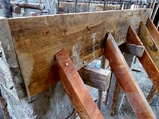

= eco 2020
:toc:

---

== 102. Flowerbeds of enterprise

(eco 2020-5-2 / Business / Chinese entrepreneurs: Flowerbeds of enterprise )

Private companies *have put down* strong roots in China

The pandemic and a more assertive Communist Party *are testing* their resilience

Apr 30th 2020 | HANGZHOU, SHANGHAI AND XIAMEN

`主` TO SAY THAT China’s economy has been hurt by covid-19 `系` is `宾` *putting it mildly*. `主` The 6.8% year-on-year fall in GDP in the first quarter `谓` *ended* a 28-year stretch of continuous, mostly rapid growth. The Communist Party, which *derives(v.) legitimacy from* rising living standards, *is keen*(a.) to put the slump behind it. President Xi Jinping *is reversing* a harsh lockdown and *propping up* state firms. But the world’s second-biggest economy *will not heal* by Mr Xi’s fiat alone.

For a collectivist state, China *is remarkably reliant(a.) on* private enterprise. *As* it *ages*(v.), and its economy *shifts from* manufacturing for export *to* domestic services, the entrepreneurial class *should grow* in stature. Right now, though, the corona-crisis and, under Mr Xi, a more hands-on, inward-looking regime *are testing* private-sector resilience *like never before*.

The People’s Republic *recognised* its first private business in 1980, when a 19-year-old street hawker(n.) named Zhang Huamei *registered* her stall selling buttons and toys in the port city of Wenzhou. Since then the party *has developed* its own form of “economic gardening” -- the notion, *popularised in America* in the 1980s, that grassroots entrepreneurs *drive*(v.) growth. It *told* business folk *what not to do* -- certain industries, such as tobacco, *were* out of bounds -- but otherwise *let them grow unimpeded*. *As* Jonathan Woetzel of McKinsey, a consultancy, *puts it*, China’s garden *has had more in common with* the deliberate wilderness of an English one *than* with manicured(a.) French lawns.

Horticultural(a.) miracle

This approach *has let* entrepreneurship *put down deep roots* in China over the past 40 years. By 2017 budding(a.) business owners *were registering* close to 6m firms a year -- or more than 15,000 a day -- nearly three times the figure in 2010. Private firms *contribute* three-fifths of GDP and four-fifths of urban employment. Private wealth *funds*(v.) 70% of investment. Wenzhou’s party bosses today *proudly proclaim that* 99% of its businesses *are privately owned* and one in five locals *has founded* a company.

Chinese internet startups *are* a case in point. IT Juzi, a research firm, *reckons that* between 2015 and 2018 some $1.3trn in venture capital *flowed into* such firms. More than 130,000 *have been created* since 2001. Many ventures *fail*. The Asian Development Bank *reckons that* the average life expectancy of all small firms in China *is* less than four years, half that in America. Research by Renmin University in Beijing in 2016 *found that* only `主` 2% of graduates who *began* a first business `谓` *succeeded*. Yet the same survey *found that* four in five *still wanted to try* their hand at starting one.

This zeal *may stem from* a belief that anyone can make it big. Chen Long, provost of the Hupan School of Entrepreneurship in Hangzhou, a startup-rich city in Zhejiang province, *puts* his compatriots’ entrepreneurial vim(n.) *down to* “countless examples of success”, which *give “a sense that* you can change your own fate”. In Fujian, *a hive of business activity* in pre-Mao days, people *asked about* the secret of business success *recite* a folk song: “Three parts of your life *the heavens determine*(v.), the other seven *you can* if you’re hard-working.”

`主` Tales like that of Jack Ma, who *twice failed to get into university* and *started* Alibaba, an e-commerce titan, in a cramped Hangzhou apartment, `谓` *enrapture*(v.) millions. Biographies of rock star founders(n.) like him or his namesake(n.) Pony Ma of Tencent, an online games-to-payments giant, *fly off the shelves*. Their pronouncements(n.) *become* aphorisms. And, *as* Roger King of the Hong Kong University of Science and Technology *points out*, `主` their riches -- the two Messrs Ma *are worth* a combined $88bn -- `谓` *provoke* admiration *rather than* envy.

This sentiment *may be reinforced* by the high share of startups that *turn into* “unicorns”. China *has* 206 privately held companies *valued* at $1bn or more, more than any other country. Beijing alone *hosts* 82, more than San Francisco’s tally(n.) of 55, according to Hurun Report, a research firm. They *include* ByteDance, the world’s mightiest unicorn (which *owns* TikTok, a hit(n.) short-video app, and *is valued* at $90bn or thereabouts).

Unicorns *are not*, of course, a representative sample of private enterprise. But they *nonetheless illustrate that* Chinese entrepreneurship *is broad* as well as deep. According to Vision Plus Capital, a venture-capital firm, a big share of the herd *grazes around* cities (with a high startup density per million residents), such as Hangzhou (31), Shenzhen (27) and Beijing (24). But their founders *are* a more geographically diverse(a.) bunch. Hurun *lists* 112 founders of Chinese startups worth $1.5bn or more. `主` The 78 whose birthplace (The Economist *has been able to identify* in China) `谓` *hail from* 20 provincial-level regions (see map).

The founders of Kuaishou, a video-sharing app, Musical.ly, which *became* TikTok, and WeChat, a ubiquitous(a.) messaging app *owned by* Tencent, *all came from* inland Hunan province. Its capital, Changsha, *houses*(v.) more than 12,000 companies in the creative and cultural industries, *luring* more go-getters(n.) in these fields. Longyan, an otherwise unremarkable city in Fujian province, *has spawned* Zhang Yiming of ByteDance and Wang Xing of Meituan-Dianping, a now-listed super-app with a market capitalisation of $75bn.

Successful founders *often nurture*(v.) entrepreneurship in their home regions. A dozen Longyan-bred ones, *including* Mr Wang and Mr Zhang, *have participated in* a “Summit of New Rising Internet Stars from Longyan”. Cai Wensheng, a Fujianese high-school dropout(n.) who *made* billions 方式状 *trading* internet domain names, *has invested in* dozens of local startups. In 2015 Alibaba’s Mr Ma *opened* the Hupan School, *dreamed up* in the midst of the global financial crisis (a few years earlier) *as* China’s answer to Harvard Business School (itself founded during the banking panic of 1907).

If businesspeople *have been tending(v.) to* the entrepreneurial garden, local authorities *have been heaping* fertiliser on it. Zhejiang, where Wenzhou *is also located*, *embraced* small businesses as soon as Deng Xiaoping *lifted* the Mao-era ban on them in 1979. Lending(n.) from Zhejiang’s state banks *allowed* some early stars *to rise*. They *included* Zong Qinghou, a juice-and-soda tycoon who *founded* Wahaha in 1987; Guo Guangchang, an industrialist(n.) who *began* Fosun Group in 1992; and later Ding Lei of NetEase, a gaming giant *set up* in 1997.

More recently Dream Town, a state-run startup village near Alibaba’s campus in Hangzhou, *has been handing out* cash and free office space *to* promising founders. Xiamen, a city in Fujian, *offers* the 3,000 startups (in its Software Park) 双宾 generous(a.) subsidies for rent and research and development. Firms *got* preferential loans and a two-year waiver(n.) on corporate tax, *plus* a discount for another three.

China’s vibrant(a.) ecosystem of private enterprise *faces* three challenges. First, Chinese startups and small businesses, *like* everywhere else in the world, *have been hit hard* by the lockdowns. Their revenues *fell* by almost 60% in March, year on year, according to a survey by Tsinghua University in Beijing. CBInsights, a data provider, *says* the number of deals involving Chinese startups *dropped* by nearly 40% in the first quarter, *compared with* the previous one, *to* the lowest level since 2016. Early-stage funding *declined* by 70%.

*To help out*, Beijing *has told* banks *that* smaller companies *may delay* loan repayments up to the end of June. [On April 23rd] officials in Zhongguancun, the capital’s tech hub, *teamed up with* 30 venture-capital firms *to launch* a 30bn yuan ($4.2bn) investment campaign *to support* startups. Some large corporations *are stepping up*, too. Xiaomi, a smartphone-maker, *participated in* nine equity deals(n.) in the first quarter, one more than in the previous three months. Alibaba *has launched* the “2020 Spring Thunder Initiative” *to help* smaller export-oriented businesses *expand into* new markets. Ant Financial, its finance arm, *has teamed up with* hundreds of commercial banks *to offer loans(n.) to* tens of millions of smaller firms. Ant’s payment business, AliPay, *is helping* 50,000 merchants(n.) *move online*, in part *by providing* free online courses. Daniel Zhang, Alibaba’s boss, *said* the company *must “stand [arm in arm]” with* the little guy.

Inconstant gardeners

Not everyone *is* as obliging(a.). State-owned lenders *refuse to extend new loans to* many smaller firms, *favouring* lumbering(a.) state-owned champions. And Beijing’s ongoing(a.) crackdown on informal sources of lending, *on which* most private businesses *rely*, *has starved* many of resources.

This increasingly heavy hand *is* the private sector’s second problem. The party *looks more hostile(a.) to it* than at any time since before Deng *set up* “special economic zones”, capitalist(a.) sandboxes for firms, in the 1980s. Mr Xi *favours* state-led development *over* private-sector effervescence(n.), *maybe seeing* the cult of entrepreneurs *as* a rival source of authority. The former party boss in Zhejiang and provincial(a.) head of equally enterprising(a.) Fujian *has disappointed* those (who *say* breakthroughs(n.) *require* an environment where people are free, *in the words of* R. May Lee, “*to indulge*, *to daydream* and *to do things differently*”). Ms Lee *stepped down* as dean of the School of Entrepreneurship and Management at ShanghaiTech University in 2018 *partly out of* frustration over increasing state control of the curriculum.

The third worry for many Chinese firms *is* the prospect of *being shut off from the world*. This *is not* wholly China’s fault; America *has limited* exports of certain technologies to Chinese buyers *as* part of a trade war between the two superpowers. But Mr Xi’s pursuit of greater autonomy from the West *will make it harder* for Chinese firms *to procure* kit and components unavailable at home, *including* advanced microprocessors, and, increasingly, *to attract* business partners abroad. Officials’ early response to the virus, when they *tried to suppress* reports of the original outbreak in Hubei province, *has only added to* foreign queasiness of all things Chinese.

It is a testament to the private sector’s strength in China that it *has held up*. The share prices of smaller listed firms *have done* only half *as badly* in the pandemic *as* those of their counterparts in America and Europe. Whereas America’s small businesses *have underperformed* its biggest corporations by a factor of two, in China the small fry *have done nearly as well as* the whales (see chart). Once the crisis *passes*, venture capitalists, *including* home-grown ones, *will no doubt loosen* their purse strings.

And although Mr Xi *has been less green-fingered(a.) than* his predecessors, he *is unlikely to pave*(v.) over China’s flowerbeds of enterprise. The party *realises that* its promise of future growth(n.) *requires* a robust private sector. *As* one veteran foreign observer *adds*, it is also a useful “vaccine” -- one that *inoculates*(v.) the regime *against* those too wilful(a.) to serve(v.) its interests as bureaucrats. Better for them *to channel(v.) energy into* entrepreneurship. Luckily for Mr Xi, many *are still happy* to do just that.

---

== 102. Flowerbeds of enterprise 词汇解说

1. flowerbed 花坛

1. assertive : a. expressing opinions or desires strongly and with confidence, so that people take notice 坚定自信的；坚决主张的 +

1. resilience :  /rɪˈzɪliəns/  n. the ability of people or things to feel better quickly after sth unpleasant, such as shock, injury, etc. 快速恢复的能力；适应力 /the ability of a substance to return to its original shape after it has been bent, stretched or pressed 还原能力；弹力 +
-> The pandemic and a more assertive Communist Party *are  testing their resilience*. 疫情和更加自信的共产党, 正在考验他们的应变能力 +
image:../../+ img_单词图片/r/resilience.jpg[100,100]

1. put : v. [ + adv./prep. ] to express or state sth in a particular way 说；表达 +
->  She *put it very tactfully*. 她的话说得很巧妙。 +
-> *Put simply* , we accept their offer or go bankrupt. 简单地说吧，我们要么接受他们的条件，要么破产。 +
-> I was, *to put it mildly* , annoyed (= I was extremely angry) . 说得温和点儿，我相当恼火。 +
-> `主` TO SAY THAT China’s economy has been hurt by covid-19 `系` is `宾` *putting it mildly*. 说成中国经济受到新冠肺炎疫情的冲击, 已经算是客气的了。

1. year-on-year :  adj. 与上年同期数字相比的

1. *DERIVE FROM STH /BE DERIVED FROM STH* : to come or develop from sth 从…衍生出；起源于；来自 / *DERIVE STH FROM STH*  to get sth from sth （从…中）得到，获得;（从…中）提取 +
-> The word ‘politics’ *is derived from* a Greek word meaning ‘city’.  politics一词源自希腊语，意思是city。 +
-> The new drug *is derived from fish oil*. 这种新药是从鱼油中提炼出来的。 +
-> The Communist Party, which *derives legitimacy from* rising living standards, is keen to put the slump behind it. 共产党渴望摆脱经济衰退, 因为它是从不断提高的生活水平中来获得合法性的。

1. legitimacy :  /lɪˈdʒɪtɪməsi/ 合法性; 正统性

1. slump :n. ~ (in sth) a sudden fall in sales, prices, the value of sth, etc. （销售量、价格、价值等的）骤降，猛跌，锐减 /a period when a country's economy or a business is doing very badly 萧条期；衰退 /v.  to sit or fall down heavily 重重地坐下（或倒下）+
->  a slump in profits 利润锐减 +

1. reverse : v.  to change sth completely so that it is the opposite of what it was before 颠倒；彻底转变；使完全相反 / to change a previous decision, law, etc. to the opposite one 撤销，废除（决定、法律等） +
-> *to reverse(v.) a procedure*/process/trend 彻底改变程序╱过程╱趋势 +
-> The Court of Appeal *reversed the decision*. 上诉法庭撤销了这项裁决。 +
-> President Xi Jinping *is reversing* a harsh lockdown and *propping up* state firms.

1. prop:  /prɑːp/  v. *~ sth/sb (up) (against sth)* to support an object by leaning it against sth, or putting sth under it etc.; to support a person in the same way 支撑 +
/*prop sth up* : (1) to prevent sth from falling by putting sth under it to support it 撑起；支起 / to help sth that is having difficulties 帮助；扶持；救济 +
=> 来自pro-,向前，-pag,固定，词源同page,compact.
+
->   *She propped herself up* on one elbow. 她单肘撑起身子。 +
-> President Xi Jinping *is reversing* a harsh lockdown and *propping up* state firms. +

1. fiat :  /ˈfiːæt/ n.  [ CU ] ( formal ) an official order given by sb in authority （当权者的）法令，命令，谕 +
=> 来自拉丁语facere的被动语态，词源同fact, feat, 即谕令，使做，使完成。
-> But the world’s second-biggest economy *will not heal* by Mr Xi’s fiat(n.) alone.

1. collectivist : ADJ Collectivist means relating to collectivism. 集体主义的 +
-> a collectivist state

1. reliant : a. *~ on/upon sb/sth* : needing sb/sth in order to survive, be successful, etc. 依赖性的；依靠的 +
-> For a collectivist state, China *is remarkably reliant(a.) on* private enterprise.

1. entrepreneurial : /ˌɑːntrəprəˈnɜːriəl/ ADJ Entrepreneurial means having the qualities that are needed to succeed as an entrepreneur. 具有创业素质的 +
-> *As* it *ages*(v.), and its economy *shifts from* manufacturing for export *to* domestic services, *the entrepreneurial class* should grow(v.) in stature. +
随着老龄化(或者是说, 中国经济体变得成熟)，以及经济从出口制造业向国内服务业的转变，创业阶层的地位应该会提高。

1. stature :   /ˈstætʃə(r)/ n. the importance and respect that a person has because of their ability and achievements 声望；名望 +
an actress *of considerable stature* 颇有名望的女演员

1. hands-on :a.doing sth rather than just talking about it 动手的；实际操作的 +
->  a hands-on style of management 事事过问的管理方式

1.  inward-looking : ADJ If you describe a people or society as *inward-looking*, you mean that they are more interested in themselves than in other people or societies. 更关注自己的 +
-> Right now, though, the corona-crisis and, under Mr Xi, `主` *a more hands-on, inward-looking regime* `谓` are testing(v.) private-sector resilience [like never before]. 一个更加亲力亲为、更加内向的政权正在以前所未有的方式考验私营部门的韧性。

1. like never before 前所未有

1. recognize : v. ~ sb/sth (as sth) to accept and approve of sb/sth officially （正式）认可，接受，赞成 +
-> The UK *has refused to recognize* the new regime. 英国已拒绝承认这个新的政权

1. hawker :  /ˈhɔːkər/ a person who makes money by hawking goods 沿街叫卖者；小贩 +
=> 来自低地德语hoken,扛在肩上叫卖，走街串巷，来自Proto-Germanic*huk,叫卖，词源同huckster. +
-> The People’s Republic *recognised* its first private business in 1980, when a 19-year-old street hawker(n.) named Zhang Huamei *registered* her stall selling buttons and toys in the port city of Wenzhou. +
1980年，中国承认了第一家私营企业。当时，19岁的街头小贩张华梅在港口城市温州注册了自己的摊位，出售纽扣和玩具。

1. stall :  a table or small shop with an open front that people sell things from, especially at a market SYN stand 货摊，摊位，售货亭（尤指集市上的）

1. notion : n. *~ (that...) /~ (of sth)* an idea, a belief or an understanding of sth 观念；信念；理解 +
=> -not-知道 + -ion名词词尾 +
->  a political system based on *the notions of equality and liberty* 建立在自由平等观念基础上的政治体系

1. popularize : /ˈpɑːpjələraɪz/ v. to make a lot of people know about sth and enjoy it 宣传；宣扬；推广 /to make a difficult subject easier to understand for ordinary people 使通俗化；使普及 +
-> “economic gardening” -- the notion, *popularised in America* in the 1980s, that grassroots entrepreneurs *drive*(v.) growth. +
“经济园艺学”形式——这一概念于20世纪80年代在美国流行开来，即草根企业家推动经济增长。

1. tobacco 烟叶；烟草

1. *OUT OF BOUNDS* : (1) ( in some sports 某些体育运动 ) outside the area of play which is allowed 出界；界外 /(2) ( NAmE ) not reasonable or acceptable 不合理的；令人无法接受的 +
-> His demands *were out of bounds*. 他的要求不合理 +
-> It *told* business folk *what not to do* -- certain industries, such as tobacco, *were* out of bounds -- but otherwise *let them grow unimpeded*. +
它告诉商人们什么不该做——某些行业，比如烟草，是不允许被做的 -- 但在其他方面则让它们不受限制地发展。

1. unimpeded : /ˌʌnɪmˈpiːdɪd/ a. ( formal ) with nothing blocking or stopping sb/sth 无障碍的；无阻挡的 +
-> *an unimpeded view* of the bay 一览无余的海湾风光 +
-> free and *unimpeded trade* 自由顺畅的贸易

1.  in common ( technical 术语 ) by everyone in a group 共有；公有 +
/ *in common with sb/sth* : ( formal ) in the same way as sb/sth 与…相同 +
/*have sth in common (with sth)* : ( of things, places, etc. 东西、地方等 ) to have the same features, characteristics, etc. 有相同的特征（或特点等） / *have sth in common (with sb)* : ( of people 人 ) to have the same interests, ideas, etc. as sb else （想法、兴趣等方面）相同
+
->  The two cultures *have a lot in common*. 这两种文化具有许多相同之处。 +
-> *As* Jonathan Woetzel of McKinsey, a consultancy, *puts it*, China’s garden *has had more in common with* the deliberate wilderness of an English one *than* with manicured French lawns. +
正如麦肯锡咨询公司的Jonathan Woetzel所说，中国的经济花园更像是英国那样的精心布置的荒野，而不像是精心修剪的法国草坪。

1. wilderness : n. a large area of land that has never been developed or used for growing crops because it is difficult to live there 未开发的地区；荒无人烟的地区；荒野 /a place that people do not take care of or control 荒芜的地方；杂草丛生处

1. manicured : /ˈmænɪkjʊrd/  a. ( of hands or fingers 手或手指 ) with nails that are neatly cut and polished 精心护理的；修剪整齐的 /( of gardens, a lawn , etc. 花园、草坪等 ) very neat and well cared for 整齐的；护理得很好的 +
=> mani-,手，词源同manual,cure,处理，护理，治疗。引申词义指甲护理。

1. lawn : [ C ] an area of ground covered in short grass in a garden/yard or park, or used for playing a game on 草坪；草地

1. horticultural : /ˌhɔːrtɪˈkʌltʃərəl/  ADJ Horticultural means concerned with horticulture. 园艺的; 园艺学的 +
=> horti-花园 + -cult-培育 + -ure名词词尾horti-为拉丁语名词hortus, -i, m(花园)的词干 +
->  ...the John A. Sibley *Horticultural Centre*.
…约翰A.西布莉园艺中心。 +
-> Horticultural(a.) miracle 园艺奇迹

1. budding : a. [ only before noun ] beginning to develop or become successful 开始发展的；崭露头角的 +
-> a budding artist/writer 一位艺术界╱文坛新秀 +
-> By 2017 budding(a.) business owners *were registering* close to 6m firms a year

1. fund : v. to provide money for sth, usually sth official 为…提供资金；拨款给 +
-> Private wealth *funds*(v.) 70% of investment. 私人投资占了总投资额的70%。

1. party boss 党的首领；党魁

1. proclaim : v. [ also VN to infalso V wh- ] to publicly and officially tell people about sth important 宣布；宣告；声明 +
->  The president *proclaimed a state of emergency*. 总统宣布了紧急状态。 +
-> Wenzhou’s party bosses today *proudly proclaim that* 99% of its businesses *are privately owned* and one in five locals *has founded* a company. +
温州的党政领导如今自豪地宣布，温州99%的企业都是民营企业，五分之一的温州人创办了公司。

1. *a case in point* : a clear example of the problem, situation, etc. that is being discussed 明证；恰当的例证 +
-> Chinese internet startups *are a case in point*. 中国的互联网初创企业就是一个很好的例子。

1. *venture capital* : n. ( business 商 ) money that is invested in a new company to help it develop, which may involve a lot of risk 风险资本（投入新公司的资金，风险很大）

1. venture : n. a business project or activity, especially one that involves taking risks （尤指有风险的）企业，商业，投机活动，经营项目 +
-> More than 130,000 *have been created* since 2001. Many ventures *fail*. 自2001年以来，风险投资已经创造了超过13万个小企业, 其中许多风险小企业失败。

1. only `主` 2% of graduates who *began* a first business `谓` *succeeded*. 只有2%的毕业生在第一次创业中成功。

1. *try your hand (at sth)* : to do sth such as an activity or a sport for the first time 初试身手 +
-> Yet the same survey *found that* four in five *still wanted to try their hand at* starting one. 然而，同样的调查发现，五分之四的人仍想初次创业。

1. zeal : n. *~ (for/in sth)* ( formal ) great energy or enthusiasm connected with sth that you feel strongly about 热情；激情 +
-> This zeal *may stem from* a belief that anyone can make it big.

1. provost n. (in Britain) the person in charge of a college at some universities （英国某些大学的）学院院长 +
=> 来自拉丁语propositus,首长，头领，来自pro-,向前，在前，-posit,放置，词源同position.后用于称呼学院院长或教务长。

1. compatriot :  /kəmˈpeɪtriət/  a person who was born in, or is a citizen of, the same country as sb else 同胞；同国人

1. vim : /vɪm/ n. [ U ] ( old-fashioned informal ) energy 精力；活力；力量 +
=> 来自拉丁语 vis,力量，精力，-m,宾格后缀，比较 am,him,来自 PIE*weie,追寻，渴求，词源同 win,Venus.

1. *PUT STH DOWN TO STH* : to consider that sth is caused by sth 把…归因于 +
-> What do you *put her success down to*? 你认为她是靠什么成功的？ +
-> Chen Long, provost of the Hupan School of Entrepreneurship in Hangzhou, a startup-rich city in Zhejiang province, *puts* his compatriots’ entrepreneurial vim *down to* “countless examples of success”, which *give “a sense that* you can change your own fate”. +
杭州的湖畔创业学院(Hupan School of Entrepreneurship)院长陈龙, 将国人的创业热情归结为: “无数成功的例子”让人们“感觉到你可以改变自己的命运”。

1. entrepreneurship :  /ˌɑːntrə-prəˈnɜːr-ʃɪp/  N-UNCOUNT Entrepreneurship is the state of being an entrepreneur, or the activities associated with being an entrepreneur. 企业家(身份、行为); 企业家精神

1. *a hive of activity/industry* :  a place full of people who are busy 忙碌的场所；繁忙的地方 /hive : n.
( also bee·hive ) [ C ] a structure made for bees to live in 蜂房；蜂箱 +
-> In Fujian, *a hive of business activity* in pre-Mao days, people *asked about* the secret of business success *recite* a folk song: “Three parts of your life *the heavens determine*(v.), the other seven *you can* if you’re hard-working.” +
福建, 一个在前毛的时代繁华的地方, 当被问及商业成功的秘诀时，人们背诵了一首民歌：“人的命运, 三分天注定, 七分靠努力。”

1. recite : v. *~ (sth) (to sb)* to say a poem, piece of literature, etc. that you have learned, especially to an audience （尤指对听众）背诵，吟诵，朗诵

1. cramped : a. a cramped room, etc. does not have enough space for the people in it 狭窄的；狭小的

1. enrapture :  /ɪnˈræptʃər/  v. [ VN ] [ usually passive ] ( formal ) to give sb great pleasure or joy 使欣喜若狂；使兴高采烈 +
=> en-使… + -rapt-抓 + -ure名词词尾 → 使整个心神被抓住 +
-> `主` Tales like that of Jack Ma, who *twice failed to get into university* and *started* Alibaba, an e-commerce titan, in a cramped(a.) Hangzhou apartment, `谓` *enrapture*(v.) millions.

1. biography : n. the story of a person's life written by sb else; this type of writing 传记；传记作品 +

1. founder : n. a person who starts an organization, institution, etc. or causes sth to be built （组织、机构等的）创建者，创办者，发起人 +

1.  namesake : n. a person or thing that has the same name as sb/sth else 同名的人（或物） +
-> Unlike *his more famous namesake*, this Bill Clinton has little interest in politics. 这位比尔•克林顿和那位著名的同名人不同，对政治没什么兴趣。 +

1. *fly off the shelves*  飞出货架 ,衍伸义是"脱销"。 +
-> Biographies of rock star founders(n.) like him or his namesake(n.) Pony Ma of Tencent, an online games-to-payments giant, *fly off the shelves*. +
想马云这样的摇滚巨星般的创始人, 以及与他同姓的网上游戏支付巨头腾讯的创始人马化腾(Pony Ma)，他们的传记都很畅销。

1. pronouncement : n. ( formal ) ~ (on sth) a formal public statement 声明；公告；宣告 +

1. aphorism :  /ˈæfərɪzəm/  n. ( formal ) a short phrase that says sth true or wise 格言；警句 +
=> 由ap-（=apo-，远离）和horizein（界限），字面意思就是“定义、精炼的话” +
-> Their pronouncements(n.) *become* aphorisms. 他们所说过的话都成了格言.

1. Messrs :  /ˈmesərz/  n. （法）各位先生（等于Messieurs） ( BrE ) ( NAmE Messrs. ) (used as the plural of 'Mr' before a list of names and before names of business companies) （Mr的复数形式，用于一组人名或公司名称前） +
-> *Messrs Smith, Brown and Jones* 史密斯、布朗和琼斯先生

1. provoke : v.  to cause a particular reaction or have a particular effect 激起；引起；引发 +
-> The announcement *provoked a storm of protest*. 这个声明激起了抗议的风潮。 +
-> `主` their riches -- the two Messrs Ma *are worth* a combined $88bn -- `谓` *provoke* admiration *rather than* envy. 他们的财富——马云和马云的财富加起来价值达880亿美元——让人羡慕而非嫉妒。

1. sentiment : n. [ CU ] ( formal ) a feeling or an opinion, especially one based on emotions （基于情感的）观点，看法；情绪 +
-> the spread of *nationalist sentiments* 民族主义情绪的传播 +

1. unicorn : （传说中的）独角兽 / 独角兽公司一般指投资界对于10亿美元以上估值，并且创办时间相对较短（一般为十年内）还未上市的公司的称谓。 +
-> This sentiment *may be reinforced* by the high share of startups that *turn into* “unicorns”. 这种观点, 可能会随着创业公司变成“独角兽”的高比例率, 而得到强化。

1. tally :   /ˈtæli/ a record of the number or amount of sth, especially one that you can keep adding to 记录；积分表；账 +
-> Keep *a tally(n.) of* how much you spend while you're away. 在外出期间，把你的花费都记录下来。 +
-> China has 206 *privately held companies* 定 valued(v.) at $1bn or more, more than any other country. Beijing alone hosts(v.) 82, more than San Francisco’s *tally(n.) of 55*.  中国有206家估值在10亿美元或以上的民营企业，比其它任何国家都多。 仅北京就有82个城市，超过旧金山的55个。

1. hit : n. a person or thing that is very popular 很受欢迎的人（或事物） +
-> The duo were *a real hit* in last year's show. 这一对搭档在去年的演出中大受欢迎。 +
-> a hit(n.) musical 风靡一时的音乐剧 +
-> They *include* ByteDance, the world’s mightiest unicorn (which *owns* TikTok, a hit(n.) short-video app, and *is valued* at $90bn or thereabouts). +
其中包括全球最强大的独角兽公司字节跳动(该公司拥有热门短视频应用TikTok，估值约为900亿美元)。

1. thereabouts : /ˌðeər-əˈbaʊts/ ad. ( usually used after or 通常用于or之后 ) near the place mentioned 在那附近 /（数量、时间等）大约，左右，上下 +
=> there,那里，about,大约，-s,副词所有格。 +
-> He comes from *Leeds or thereabouts*. 他是利兹或其附近的人。 +
-> They paid *$100 000 or thereabouts* for the house. 他们买那房子花了大约10万元。

1. representative : a. ~ (of sb/sth) typical of a particular group of people 典型的；有代表性的 +
-> Unicorns are not, of course, *a representative sample* of private enterprise. 当然，独角兽公司并不是私营企业的典型代表。

1. nonetheless :  /ˌnʌnðəˈles/  despite this fact 尽管如此 +
-> The problems are not serious. *Nonetheless*, we shall need to tackle them soon. 问题不严重，不过我们还是需要尽快处理。 +
-> But they *nonetheless illustrate that* Chinese entrepreneurship *is broad* as well as deep. 但它们仍然说明了...

1. herd : n. a group of animals of the same type that live and feed together 兽群；牧群 / ( usually disapproving ) a large group of people of the same type 人群；芸芸众生 +
-> the common herd (= ordinary people) 普通百姓

1. graze : v. ( of cows, sheep, etc. 牛、羊等 ) to eat grass that is growing in a field （在草地上）吃青草 +
-> a big share of the herd *grazes(v.) around* cities (with a high startup density per million residents), such as Hangzhou (31), Shenzhen (27) and Beijing (24). +
有很大比例的兽群(可能指初创小企业)都聚集在每百万居民中创业密度较高的城市，如杭州(31)、深圳(27)和北京(24).

1. diverse :  /daɪˈvɜːrs/  a. very different from each other and of various kinds 不同的；相异的；多种多样的；形形色色的 +
-> people *from diverse cultures* 不同文化背景的人

1. bunch : n. [ sing. ] ( informal ) a group of people 群体 +
-> The people that I work with *are a great bunch*. 和我一起工作的那些人很不错。 +
-> But their founders *are* a more geographically diverse(a.) bunch. 但它们的创始人, 在地理上更加多样化。

1. *hail from...* : ( formal ) to come from or have been born in a particular place 来自；出生于 / hail :v. 下雹 +
-> His father *hailed from Italy*. 他父亲出生于意大利 +
-> `主` The 78 whose birthplace (The Economist *has been able to identify* in China) `谓` *hail from* 20 provincial-level regions (see map). 《经济学人》能够鉴定其出生来源的企业创始人, 分布于中国20个省级地区(见地图)。

1. ubiquitous :   /juːˈbɪkwɪtəs/ a. ( formal ) ( humorous ) seeming to be everywhere or in several places at the same time; very common 似乎无所不在的；十分普遍的 +
=> ubi,哪里，-quit,任意。即无处不在的。 +
-> *the ubiquitous bicycles* of university towns 大学城里处处可见的自行车 +
-> WeChat, a ubiquitous(a.) messaging app *owned by* Tencent.

1. houses : v. to be the place where sth is kept or where sth operates from 是（某物）的贮藏处（或安置处）；收藏；安置 +
-> The museum *is housed* in the Old Court House. 博物馆设在旧法院大楼里。 +
-> Its capital, Changsha, *houses*(v.) more than 12,000 companies in the creative and cultural industries, *luring* more go-getters in these fields. 它的首都长沙, 拥有12000多家创意和文化产业公司，吸引了更多这些领域的有进取心的人。

1. go-getter : n. ( informal ) a person who is determined to succeed, especially in business （尤指商业上的）实干家，志在必得的人

1. unremarkable : a. ordinary; not special or remarkable in any way 一般的；平常的；平凡的；平庸的 +
-> an unremarkable life 平淡的生活

1. listed : V-T/V-I If a company is listed, or if it lists, on a stock exchange, it obtains an official quotation for its shares so that people can buy and sell them. 使 (公司) 上市; (公司) 上市 +
-> Meituan-Dianping, *a now-listed(a.) super-app* with a market capitalisation of $75bn. 美团-大众点评是一款现已上市的超级应用，市值达750亿美元。

1. capitalisation : n. 市值（等于capitalization）

1. nurture : /ˈnɜːrtʃər/ v. to care for and protect sb/sth while they are growing and developing 养育；养护；培养 /
to help sb/sth to develop and be successful 扶持；帮助；支持 +
->  children *nurtured by loving parents* 受到慈爱的父母养育的孩子 +
-> Successful founders *often nurture*(v.) entrepreneurship in their home regions.

1. bred : breed的过去式和过去分词 +
-> A dozen Longyan-bred(a.) ones, *including* Mr Wang and Mr Zhang, *have participated in* a “Summit of New Rising Internet Stars from Longyan”. 包括王和张在内的12位龙岩人, 参加了“龙岩互联网新星峰会”。

1. dropout : n. a person who leaves school or college before they have finished their studies 辍学者；退学者 +
-> Cai Wensheng, a Fujianese high-school dropout(n.) who *made* billions 方式状 *trading* internet domain names, *has invested in* dozens of local startups.  +
蔡文生，一位福建的高中辍学生, 他通过互联网域名交易赚了数十亿美元，已经投资了数十家当地初创企业。

1. domain name : ( computing 计 ) a name which identifies a website or group of websites on the Internet 域名

1. *dream sth up* : ( informal ) to have an idea, especially a very unusual or silly one 凭空想出，虚构出（尤指荒诞不经的事） +

1. answer : n. a person or thing from one place *that may be thought to be as good as a famous person or thing* from another place 足以媲美的人；堪称相当的事物 +
-> The new theme park will be *Britain's answer to Disneyland*. 英国新的主题乐园, 可与迪斯尼乐园媲美。 +
-> In 2015 Alibaba’s Mr Ma *opened* the Hupan School, *dreamed up* in the midst of the global financial crisis (a few years earlier) *as* China’s answer to Harvard Business School (itself founded during the banking panic of 1907). +
2015年，阿里巴巴的马创办了湖畔商学院(Hupan School)，这是在几年前全球金融危机期间构想出来的 中国版哈佛商学院(Harvard Business School)。

1. tend :v. *~ (to) sb/sth* to care for sb/sth 照料；照管；护理 +
-> Doctors and nurses *tended(v.) the injured*. 医生和护士护理受伤者。

1. heap : v. *~ sth (up)* to put things in an untidy pile 堆积（东西）；堆置 / *~ A on B /~ B with A* to put a lot of sth in a pile on sth 在…上放很多（东西） +
-> She *heaped* my plate *with* food. 她往我的盘子里夹了很多食物。 +
-> If businesspeople *have been tending(v.) to* the entrepreneurial garden, local authorities *have been heaping* fertiliser on it. 如果说, 商人们一直在照料这个创业花园，那么地方当局也一直在给它施肥。

1. lending : n. ( finance 财 ) the act of lending money 放款；贷放 +
-> *Lending(n.) by banks* rose to $10 billion last year. 去年银行发放的贷款增至100亿元。 +
-> *Lending(n.) from Zhejiang’s state banks* allowed(v.) some early stars to rise.

1. industrialist :  /ɪnˈdʌstriəlɪst/ n. a person who owns or runs a large factory or industrial company 工业家；实业家；工厂主 +
-> Guo Guangchang, an industrialist(n.) who *began* Fosun Group in 1992. 1992年创立复星集团的实业家郭广昌

1. startup village  创业村

1. *hand sth out (to sb)* : (1) to give a number of things to the members of a group 分发某物 /(2) to give advice, a punishment, etc. 提出，给予（建议、惩罚等） +
-> Could you *hand these books out*, please? 请把这些书发给大家好吗？ +
-> He's always *handing out advice to people*. 他总是喜欢教训人。 +
-> More recently Dream Town, a state-run startup village near Alibaba’s campus in Hangzhou, *has been handing out* cash and free office space *to* promising founders.

1. generous :a. more than is necessary; large 丰富的；充足的；大的 +
-> The car *has a generous amount of space*. 这辆汽车的空间很大。 +
-> Xiamen, a city in Fujian, offers(v.) the 3,000 startups (in its Software Park) 双宾 *generous(a.) subsidies*(n.) for rent and research and development.  +
福建省厦门市, 为其软件园内的3000家初创企业, 提供了丰厚的租金补贴和研发补贴。

1. subsidy :  /ˈsʌbsədi/ n. [ CU ] money that is paid by a government or an organization to reduce the costs of services or of producing goods so that their prices can be kept low 补贴；补助金；津贴

1. preferential :  /ˌprefəˈrenʃl/  a. [ only before noun ] giving an advantage to a particular person or group 优先的；优惠的；优待的 +
->  Don't expect *to get preferential treatment* . 不要指望受到优待。 +

1. waiver :  /ˈweɪvər/  n. ( law 律 ) a situation in which sb gives up a legal right or claim; an official document stating this （对合法权利或要求的）弃权；弃权声明 +
=> 来自 waif,摇摆，舍弃，扔弃。 +
-> Firms got *preferential loans* and *a two-year waiver(n.) on corporate tax*, plus(v.) a discount for another three. 企业获得了优惠贷款,和两年的企业税减免，另外还有三年的折扣。
image:../../+ img_单词图片/w/waiver.jpg[100,100]

1. corporate tax 企业税

1. vibrant : a. full of life and energy 充满生机的；生气勃勃的；精力充沛的 +
-> China’s vibrant(a.) ecosystem of private enterprise. 中国充满活力的民营企业生态系统

1. year on year 与上一年年同期相比

1. involve : v. if a situation, an event or an activity involves sb, they take part in it or are affected by it 牵涉；牵连；影响 +
-> How many vehicles *were involved in the crash*? 这次撞车事故涉及多少辆汽车？ +
-> the number of deals *involving* Chinese startups `谓` *dropped* by nearly 40% in the first quarter. 今年第一季度涉及中国初创企业的交易数量, 下降了近40%.

1. *help out /help sb out* :to help sb, especially in a difficult situation 帮助某人摆脱（困境） +
-> When I bought the house, my sister *helped me out* with a loan. 我买这所房子时，我姐姐借给了我一笔钱解了急。 +
-> *To help out*, Beijing *has told* banks *that* smaller companies *may delay* loan repayments up to the end of June.  +
为了帮助小企业摆脱困境，中国政府已告知银行，规模较小的企业可以将贷款偿还, 推迟至6月底。

1.  team : v. [ VN ] [ usually passive ] to put two or more things or people together in order to do sth or to achieve a particular effect 使互相配合；使协作；使合作 +
-> He *was teamed with* his brother in the doubles. 他被安排和哥哥搭档参加双打。
+
*team up (with sb)* : to join with another person or group in order to do sth together 合作；（与某人）结成一队  +
/ *team sb/sth up (with sb)* : to put two or more people or things together in order to do sth or to achieve a particular effect 使互相配合；协作；合作
+
-> [On April 23rd] officials in Zhongguancun, the capital’s tech hub, *teamed up with* 30 venture-capital firms *to launch* a 30bn yuan ($4.2bn) investment campaign *to support* startups. +
4月23日，北京科技中心中关村的官员, 与30家风险投资公司联手, 发起了一项300亿元人民币(42亿美元)的投资活动，以支持初创企业。

1. venture-capital : N-UNCOUNT Venture capital is capital that is invested in projects that have a high risk of failure, but that will bring large profits if they are successful. 风险资本

1. *step up* : to come forward 走上前去 / *step sth up* : to increase the amount, speed, etc. of sth 增加，提高（数量、速度等） +
-> *He has stepped up his training* to prepare for the race. 他为准备那场比赛加强了训练。 +
-> Some large corporations *are stepping up*, too.

1. *equity deal* 股权交易

1. initiative : n. [ C ] a new plan for dealing with a particular problem or for achieving a particular purpose 倡议；新方案 +
-> *a government initiative* to combat unemployment 政府应付失业问题的新方案 +
-> Alibaba has launched *the “2020 Spring Thunder Initiative*(n.)”. 阿里巴巴启动了“2020年春雷计划”

1. export-oriented : adj. 出口导向型；面向出口的

1. Ant Financial 蚂蚁金服

1. merchant : ˈmɜːr-tʃənt/  n. a person who buys and sells goods in large quantities, especially one who imports and exports goods 商人；批发商；（尤指）进出口批发商

1. inconstant : a. ( formal ) not faithful in love or friendship （对爱情或友情）不忠的，不专一的 / not constant; variable 不定的  +
-> Inconstant gardeners 变化无常的园丁

1. obliging : /əˈblaɪdʒɪŋ/  a. very willing to help 乐于助人的；热情的 +
=> ob-,向前，朝向，-lig,绑定，词源同ligament,league.原指用誓言捆绑的，给予承诺的。后引申诸相关词义。 +
-> *They were very obliging*(a.) and offered to wait for us. 他们非常热情，主动提出等候我们。 +
-> Not everyone *is* as obliging(a.). 并不是每个人都乐于助人。

1. lumbering : a. moving in a slow, heavy and awkward way 缓慢吃力的；步态笨拙的 +
-> a lumbering dinosaur 迈着缓慢而沉重步子的恐龙 +
-> State-owned lenders *refuse to extend new loans to* many smaller firms, *favouring* lumbering(a.) state-owned champions. +
国有银行拒绝向许多小公司提供新的贷款，偏爱那些行动迟缓的国有巨头企业。

1. ongoing : a. [ usually before noun ] continuing to exist or develop 持续存在的；仍在进行的；不断发展的 +
-> *an ongoing debate*/discussion/process 持续的辩论╱讨论╱过程 +

1. starve : v. to suffer or die because you do not have enough food to eat; to make sb suffer or die in this way （使）挨饿，饿死
-> Beijing’s ongoing(a.) crackdown on informal sources of lending, *on which* most private businesses *rely*, *has starved* many of resources. +
中国政府对多数私营企业依赖的非正式贷款来源的持续打击，导致许多贷款源消失。

1. heavy hand 高压手段; 强硬措施 +
-> *This increasingly heavy hand* is the private sector’s second problem. 这种日益增长的高压手段, 是私企领域面临的第二个问题。

1. capitalist : a. ( also less frequent also cap·it·al·is·tic /ˌkæpɪtəˈlɪstɪk/  ) based on the principles of capitalism 资本主义的 +
-> *a capitalist society*/system/economy 资本主义社会╱体制╱经济 +
-> “special economic zones”, *capitalist sandboxes* for firms.  经济特区, 是为中国企业提供的资本主义沙盒.

1. effervescence : /ˌefə-ˈve-sns/  n. 冒泡；[化工] 泡腾；欢腾 +
image:../../+ img_单词图片/e/effervescence.jpg[100,100]

1. cult : /kʌlt/  n. [ usually sing. ] ~ (of sth) a way of life, an attitude, an idea, etc. that has become very popular （对生活方式、看法、观念等的）狂热，时尚，崇拜 +
=> 来自PIE*kwel,弯，转，耕作，词源同cycle,colony.原指农耕文明靠天吃饭，因而对神灵的无 比虔诚。 +
-> *An extraordinary personality cult*(n.) had been created around the leader. 在这位领导人的周围兴起了一场异乎寻常的个人崇拜。 +
-> Mr Xi *favours* state-led development *over* private-sector effervescence(n.), *maybe seeing* the cult of entrepreneurs *as* a rival source of authority. 习更偏爱由国家政府来主导的发展, 而不是私人企业领域的沸腾(繁荣), 他可能将"对企业家的崇拜"现象, 视为是对其权威的挑战.

1. provincial :  /prəˈvɪnʃl/  a. [ only before noun ] connected with one of the large areas that some countries are divided into, with its own local government 省的；一级行政区的 +

1. enterprising :  /ˈentər-praɪzɪŋ/  a. ( approving ) having or showing the ability to think of new projects or new ways of doing things and make them successful 有事业心的；有进取心的；有创业精神的 +
-> The former party boss in Zhejiang /and *provincial(a.) head* of *equally enterprising(a.) Fujian* has disappointed(v.) those who say {breakthroughs require(v.)  an environment where people are free}, in the words of R. May Lee, “to indulge, to daydream and to do things differently”. +
这位前浙江市委书记(指习), 他同样也是进取的福建省的省长, 让一些人感到失望，这些人表示，要想取得经济突破, 就需要一个环境，用R.May Lee 的话说，在这个环境中，人们可以自由地“沉湎、放开思想，并以不同的方法做事”。

1. breakthrough :  /ˈbreɪk-θruː/ n. an important development that may lead to an agreement or achievement 重大进展；突破 +
-> *a significant breakthrough* in negotiations 谈判中的重大突破

1. indulge : v. *~ in sth /~ yourself (with sth)* to allow yourself to have or do sth that you like, especially sth that is considered bad for you 沉湎，沉迷，沉溺（于…） / *~ in sth* : to take part in an activity, especially one that is illegal 参加，参与（尤指违法活动） +
-> They went into town *to indulge in* some serious shopping. 他们进城去大肆购物。

1. daydream : n. pleasant thoughts that make you forget about the present 白日梦；幻想；空想 /vi. 做白日梦

1. *out of sth* : used to show the reason why sth is done （表示原因）因为，出于 +
-> I asked *out of curiosity*. 我因为好奇问了问。 +
-> Ms Lee *stepped down* as dean of the School of Entrepreneurship and Management at ShanghaiTech University in 2018 *partly out of* frustration over increasing state control of the curriculum. +
Lee在2018年辞去了上海科技大学(ShanghaiTech University)创业与管理学院(School of Entrepreneurship and Management)院长一职，部分原因是, 他对政府越来越多地控制上课课程的内容, 感到失望。

1. frustration : n. [ U ] the feeling of being frustrated 懊丧；懊恼；沮丧

1. autonomy : n. the freedom for a country, a region or an organization to govern itself independently 自治；自治权 /the ability to act and make decisions without being controlled by anyone else 自主；自主权 +
-> giving individuals *greater autonomy in their own lives* 在生活中给个人更大自主权的. +

1. procure :  /prəˈkjʊr/  v. *~ sth (for sb/sth)* ( formal ) to obtain sth, especially with difficulty （设法）获得，取得，得到 +
=> 来自拉丁语procurare,关心，照看，管理，看护，来自pro-,向前，代表，-cur,关切，照看，词源同cure,pedicure.引申词义得到，获得，特指费尽心力取得。
+
-> *She managed to procure* a ticket for the concert. 她好不容易弄到一张音乐会入场券 +
-> America *has limited* exports of certain technologies to Chinese buyers *as* part of a trade war between the two superpowers. But Mr Xi’s pursuit of greater autonomy from the West *will make it harder* for Chinese firms *to procure*(v.) kit and components unavailable at home, *including* advanced microprocessors, and, increasingly, *to attract* business partners abroad. +
作为两个超级大国之间贸易战的一部分，美国已经限制向中国买家出口某些技术。但习追求"从西方取回更大的自治权"的努力, 也使中国企业更难从西方获得中国国内无法生产的装备和组件, 包括先进的微处理器, 并且, 也越来越难以吸引外国的商业伙伴。

1. microprocessor : n. ( computing 计 ) a small unit of a computer that contains all the functions of the central processing unit 微处理器；微处理机

1. queasiness : /ˈkwiːzinəs/ n. 恶心 / *queasy*  /ˈkwiːzi/ a. feeling sick; wanting to vomit 恶心的；欲吐的 /slightly nervous or worried about sth 稍感紧张的；略有不安的；心神不定的 +
=> 词源不详，可能来自qu-所表示的拟声词，模仿松软，颤动或颤抖的声音，词源同quaver,quiver. 引申词义恶心的，欲吐的。
+
Officials’ early response to the virus, when they *tried to suppress* reports of the original outbreak in Hubei province, *has only added to* foreign queasiness(n.) of all things Chinese. +
官员们早期对病毒的反应，即他们试图压制Hubei最初爆发疫情的报道，只会增加外国人对所有中国事物的反感。

1. testament : n. [ Cusually sing.U ] *~ (to sth)* a thing that shows that sth else exists or is true 证据；证明 +
-> The new model is *a testament* to the skill and dedication of the workforce. 这种新型产品显示了全体员工的技术水平和敬业精神。 +
-> *It is a testament* to the private sector’s strength in China that it has held up.

1. *hold up* :to remain strong and working effectively 支持住；承受住；支撑得住

1. listed firm 上市公司

1. underperform : /ˌʌndər-pərˈfɔːrm/ v.  to not be as successful as was expected 发挥不够；表现不理想 +
->  Smaller companies' stocks *generally have underperformed larger ones* in the past several years. 在过去的几年里，较小公司的股票在总体上表现不如较大公司的股票。 +
-> Whereas America’s small businesses *have underperformed* its biggest corporations by a factor of two.  在美国，小企业的表现要比大公司差两倍.

1. factor : [ C ] the amount by which sth increases or decreases （增或减的）数量，倍数 +
-> The real wage of the average worker *has increased by a factor of over ten* in the last 70 years. 近70年来工人的实际工资平均增长超过了十倍

1. whales 鲸；庞然大物 +
-> in China the small fry *have done nearly as well as* the whales(n.). 而在中国，小企业的表现几乎和大公司一样好.

1. purse : n.  the amount of money that is available to a person, an organization or a government to spend 资金；财源；备用款 /钱包，皮夹子（尤指女用的） +
-> We have holidays *to suit every purse*(n.). 我们有适合不同消费计划的度假安排。 +
-> Once the crisis *passes*, venture capitalists, *including* home-grown ones, *will no doubt loosen* their purse strings. 一旦危机过去，风险投资家们, 包括中国本土的, 无疑会放松银根。

1. purse strings : n. a way of referring to money and how it is controlled or spent 资金（或支出）的管理 +
-> Who *holds the purse strings* in your house? 你们家里谁管钱？ +
-> The government *will have to tighten the purse strings* (= spend less) . 政府将不得不紧缩开支。

1. fingered : /ˈfɪŋɡəd/  ADJ marked or dirtied by handling 用手指摸或弄脏的 +
She fingered(v.) the silk gently. 她轻轻地触摸丝绸。

1. green-fingered  具有高超种植花木蔬菜技能的, 植物技艺高超的人 +
-> And although Mr Xi *has been less green-fingered(a.) than* his predecessors, he *is unlikely to pave*(v.) over China’s flowerbeds of enterprise. +
尽管习没有他的前任那么擅长园艺，但他不太可能为中国企业的花坛铺平道路。

1. predecessor :  /ˈpredəsesər/ a person who did a job before sb else 前任

1. pave : v. *~ sth (with sth)* to cover a surface with flat stones or bricks （用砖石）铺（地） +
*PAVE THE WAY (FOR SB/STH)* : to create a situation in which sb will be able to do sth or sth can happen （为…）铺平道路，创造条件

1. vaccine :  /vækˈsiːn/ n. a substance that is put into the blood and that protects the body from a disease 疫苗；菌苗 +
=> 来自拉丁语 vacca,母牛，可能来自拟声词，词源同 vaquero.

1. inoculate :  /ɪˈnɑːkjuleɪt/ v. [ VN ] *~ sb (against sth)* to protect a person or an animal from catching a particular disease by injecting them with a mild form of the disease （给…）接种，打预防针 +
=> in-,进入，使，-oc,眼，词源同eye,ocular.比喻用法，由眼引申词义针眼，打针。 +
-> it is also a useful “vaccine” -- one that *inoculates*(v.) the regime *against* those too wilful(a.) to serve its interests as bureaucrats. +
这也是一种有用的“疫苗”—— 能让这个政权防御那些那些太过于任性地为官僚主义的利益服务的人。
+
=>  too...to...并不全部都表示否定. 如果 too后为表示情感的形容词，例如：glad, pleased, happy, sad等时，表示的是肯定意义。例如：He is too sad to hear the bad news.听到不幸的消息他太悲伤了。 She is too nice a girl to get along with. 她是一个如此可爱的女孩，很好相处。 +

1. wilful : a. [ usually before noun ] ( of a bad or harmful action 不友好或有害行为 ) done deliberately, although the person doing it knows that it is wrong 故意的；有意的；成心的 /determined to do what you want; not caring about what other people want 任性的；固执的；倔强的 +
-> *wilful damage* 蓄意破坏 +
> *a wilful child* 任性的孩子

1. serve : v. *~ (sb) (as sth) /~ (in/on/with sth) /~ (under/with sb)* to work or perform duties for a person, an organization, a country, etc. （为…）工作，服务，履行义务，尽职责 +
-> He *served as a captain* in the army. 他曾是一名陆军上尉。

1. bureaucrat : /ˈbjʊrə-kræt/ n. ( often disapproving ) an official working in an organization or a government department, especially one who follows the rules of the department too strictly 官僚主义者；官僚

1. channel : v. *~ sth (into sth)* to direct money, feelings, ideas, etc. towards a particular thing or purpose 为…引资；引导；贯注 /n.  ( also chan·nels [ pl. ] ) a method or system that people use to get information, to communicate, or to send sth somewhere 途径；渠道；系统 +
 ->  He *channels his aggression into* sport. 他把他的好斗劲倾注于体育比赛之中。 +
->  Better for them *to channel(v.) energy into* entrepreneurship. 更好的办法是让他们把精力投入到创业家精神(即创业)中。

