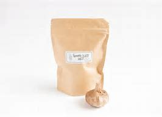
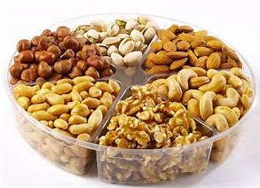
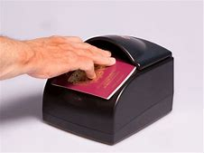
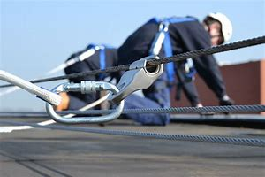
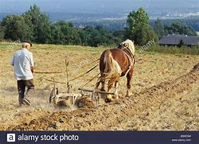

= eco 2020
:toc:

---

== 103. Imagine(v.) the post-pandemic misery of business travel

(eco 2020-5-2 / Business / Bartleby: The road to hell )

The public announcements *could be* worrying, at the least

May 2nd 2020 |

GOVERNMENTS *ARE keen to get employees back to work* in order to limit the economic damage of covid-19. And some companies *will also be eager to send employees out* in search of clients. But a vaccine *is unlikely to be ready for* at least another 12 months. So the next business trip you make *might be* an endurance test. *Imagine*(v.) the public announcements that travellers will hear.

Ding dong. Welcome to the renamed Heathrow Waystation 5. We *decided* the word “terminal” *might be* a little off-putting(a.) to passengers in the current circumstances. Please *check in* your baggage so it can be disinfected(v.): apologies to those whose suitcases *are made out of* genuine leather *as* there *will probably be* stains. But never mind, it *will be* a good excuse *to go shopping* when you get to your destination. After check-in, *head(v.) straight to* security *for* your nasal(a.) swab and temperature check. As everyone *needs to stand* six feet (two metres) apart, the queue *currently snakes* around the building.

When you *make it through security*, *head to* duty-free where you can choose from our extensive selection of hand sanitisers. *Hope you ate(v.) before you arrived* because none of the restaurants is open. Travel safely. Ding dong.

Welcome *aboard* Acme Airlines flight 107 to New York. I am your pilot, Captain Richards. Social-distancing rules *mean* no co-pilot 因为 as there is not enough room in the cockpit for more than one person. But don’t worry; I *brought* a flask of coffee with me and I *haven’t fallen asleep* on a flight yet. If I don’t give you an update every 30 minutes, the cabin crew *will hammer* on the cockpit door.

We *won’t be able to give you* our normal in-flight food and beverage service *but please enjoy* the complimentary(a.) bottle of water, packets(n.) of salted nuts(n.) and crisps(n.), and the empty seat next to you. Just a warning, though, to those of you *who have chosen to sit* by the window. Passengers *must observe*(v.) distancing rules(n.) 因此 so you *won’t be allowed* to squeeze(v.) past the person in the aisle seat if they fall asleep. In any case, only three people *are allowed* in the line for the restroom at any time. You *may want to go easy on* that water. If you *need* anything extra, the cabin crew *will come and help you*. Give them a few minutes 因为 as they *need to don*(v.) a hazmat suit first.

Ladies and gentlemen, you *have arrived at* JFK airport. We have good news and bad news. The good news is that passenger traffic is lower than normal. The bad news is that, given the need to disinfect(v.) the electronic passport reader after each use, the line for immigration *is* still two hours long. And no, you *can’t use* your cell phone *to catch up on calls* while you are in the waiting area. Welcome to the land of the free. Be brave.

*Good afternoon* and *thanks for choosing* Hotel Purgatory(n.) for your stay. Our motto: you *can check in* any time you like but, if we *hear* you coughing, you *can never leave*. Your disinfected room pass *is already available* in a disinfected envelope. Unfortunately, 因为 as only one person *is allowed* in the elevator at a time, the wait time to get to your room *is* 60 minutes. By the way, the same delay *applies* in the morning, so if you *are heading for* meetings, you had better *book*(v.) an early alarm call. There are no baggage porters, so we *hope* you *packed light*.

*To reduce* the risk to staff, the room *will be cleaned* only after you leave, so *make your own bed*. *Feel free(a.) to take home* the shampoo in the shower: no one else *wants to touch* it. The spa, pool and bar *are closed* for obvious reasons, and there is no room service. *Enjoy your stay*.

*Morning(v.) all* and welcome to the 2020 Risk Managers’ Conference. Or *should that be* the Risk Takers’ Conference? Ha ha. *Rest assured* this is a fully sanitised room. This year’s slogan: We *Care About* Your Health Because Your Employer Doesn’t. When it comes to questions, we *won’t be passing round* microphones, so *please speak* as loudly as possible. Panel sessions *are* difficult at the moment, so *will be limited to* two speakers at opposite ends of the stage.

We *are afraid that* a buffet lunch is unavailable 因此 so *take a chance on* one of the street-food carts *outside* the conference centre. Your choice *will sort out* the real risk managers *from* the also-rans. This *wouldn’t be* a conference *without* exhibition *stands in* the foyer. Our sponsors *will be delighted to see you*, but only from a safe distance, and *wearing* a mask. Finally, please *familiarise yourself with* the exits behind me, on the left and right. Obviously they are there in case of a fire but they *could come in handy* if someone has a coughing fit.

---

== 103. Imagine the post-pandemic misery of business travel 词汇解说

1.  The public announcements 公开声明

1. vaccine :  /vækˈsiːn/  n. a substance that is put into the blood and that protects the body from a disease 疫苗；菌苗

1. endurance : n. [ U ] the ability to continue doing sth painful or difficult for a long period of time without complaining 忍耐力；耐久力 +
->  He showed *remarkable endurance* throughout his illness. 他在整个生病期间表现出非凡的忍耐力 +
-> the next business trip you make *might be* an endurance test. 你的下一次出差可能是一次对忍耐力的考验。

1. Ding dong 叮咚

1. off-putting : a. ( informal ) ( especially BrE ) not pleasant, in a way that prevents you from liking sb/sth 令人烦恼的；令人讨厌的 +
=> From put off. +
-> I find *his manner very off-putting*. 我觉得他的举止令人颇为厌恶。 +
-> We *decided* the word “terminal” *might be* a little off-putting(a.) to passengers in the current circumstances. 我们认为，在目前的情况下，“终点站”这个词可能会让乘客感到不快。

1. *check in (at...)* : to go to a desk in a hotel, an airport, etc. and tell an official there that you have arrived （在旅馆、机场等）登记，报到 +
-> *Please check in* at least an hour before departure. 请至少在飞机起飞前一小时办理登机手续。 +
-> *We've checked in* at the hotel. 我们已经在旅馆登记入住。

1. *check sth in* : to leave bags or cases with an official to be put on a plane or train 托运（行李） +
-> Please *check in* your baggage so it can be disinfected. 请办理行李托运手续，以便消毒.

1. disinfect : v. to clean sth using a substance that kills bacteria 给…消毒

1. apologies to those whose suitcases *are made out of* genuine leather *as* there *will probably be* stains. 对那些手提箱是真皮的人表示歉意，因为可能会有污渍。

1. stain : n. [ C ] a dirty mark on sth, that is difficult to remove 污点；污渍

1. nasal :  /ˈneɪzl/ a. connected with the nose 鼻的；与鼻子相关的 +
-> the nasal passages 鼻道 +
-> After check-in, *head(v.) straight to* security *for* your nasal(a.) swab and temperature check. 办理登机手续(或托运行李)后，直接前往安检处进行鼻腔拭子和体温检查。

1. swab :  /swɑːb/  n. a piece of soft material used by a doctor, nurse, etc. for cleaning wounds or taking a sample from sb's body for testing （医用的）拭子，药签 /an act of taking a sample from sb's body, with a swab 用拭子对（人体）化验标本的采集 +
-> to take a throat swab 用棉签从咽部采集化验样品 +
image:../../+ img_单词图片/s/swab.jpg[100,100]

1. snake : v. [ + adv./prep. ] to move like a snake, in long twisting curves; to go in a particular direction in long twisting curves 曲折前行；蛇行；蜿蜒伸展 +
-> As everyone *needs to stand* six feet (two metres) apart, the queue *currently snakes* around the building. 因为每个人需要彼此距离6英尺(2米)远，所以现在排队的队伍, 都绕着排到了大楼外。

1. duty-free : a. ( of goods 商品 ) that you can bring into a country without paying tax on them 免关税的 /n. +
-> We bought *a load of duty-frees* (= duty-free goods) at the airport. 我们在机场买了许多免税商品。

1. extensive :a. covering a large area; great in amount 广阔的；广大的；大量的 +
-> *Extensive repair work* is being carried out. 大规模的修缮工作正在进行。 +
-> *an extensive range of* wines 各种各样的葡萄酒 +
-> When you make it through security, head(v.) to duty-free where you can choose(v.) from our *extensive selection of hand sanitisers*. 当您通过安检后，前往免税店，在那里您可以从我们种类繁多的洗手液中进行选择。

1. sanitizer : /'sænə,taɪzɚ/ n. 食品防腐剂；消毒杀菌剂（等于sanitiser）

1. *Welcome aboard* Acme Airlines flight 107 to New York. 欢迎乘坐(登机)Acme航空公司 前往纽约的107航班。

1. co-pilot : a second pilot who helps the main pilot in an aircraft （飞机的）副驾驶员

1. cockpit :  /ˈkɑːkpɪt/  n. the area in a plane, boat or racing car where the pilot or driver sits （飞机、船或赛车的）驾驶舱，驾驶座 +
=> 来自cock和pit的组合词。
image:../../+ img_单词图片/c/cockpit.jpg[100,100]

1. flask :  /flæsk/  a bottle with a narrow top, used in scientific work for mixing or storing chemicals 烧瓶 +
-> *a flask of tea/coffee* 一保温瓶的茶╱咖啡 +
=> 来自PIE*plek, 转，编织，词源同ply, complicate, flax. 引申义制陶等容器，陶器，瓶罐。比较cruse, crockery. +
image:../../+ img_单词图片/f/flask.jpg[100,100] +
image:../../+ img_单词图片/f/flask2.jpg[100,100] +

1. cabin crew : n. [ C+sing./pl.v. ] the people whose job is to take care of passengers on a plane （飞机上的）全体乘务员 /cabin one of the areas for passengers to sit in a plane （飞机的）座舱 +
-> I brought(v.) *a flask of coffee* with me and I haven’t fallen asleep on a flight yet. If I don’t give you an update every 30 minutes, *the cabin crew* will hammer(v.) on the cockpit door.

1. in-flight : a. [ only before noun ] provided or happening during a journey on a plane 飞行中供应（或发生）的 +
-> an in-flight meal/movie 飞行中提供的餐食╱电影

1. beverage :  /ˈbevərɪdʒ/ n.  ( formal ) any type of drink except water （除水以外的）饮料 +
=>  betroth = bever（喝）+age（名词后缀，表物品）→喝的东西→饮料 词源解释：bever←拉丁语bibere（喝） 同源词：beer（啤酒） +
image:../../+ img_单词图片/b/beverage.jpg[100,100]

1. complimentary :  /ˌkɑːmplɪˈmentri/  a. given free 免费的；赠送的 +
=> 来自compliment, 恭贺，道贺。现该词主要用于在基本服务基础上的免费升级，如免费升舱，免费早餐等。 +
-> *complimentary tickets* for the show 演出赠券 +
-> We won’t be able to give you our *normal in-flight food* and *beverage service* but please enjoy(v.) *the complimentary(a.) bottle of water*, *packets(n.) of salted nuts(n.) and crisps(n.)*, and the empty seat next to you. +
我们将无法为您提供正常的机上餐饮服务，但请享用免费赠送的瓶装水、袋装咸坚果和薯片，以及您旁边的空座位。

1. packet : ( BrE ) a small paper or cardboard container in which goods are packed for selling （商品的）小包装纸袋，小硬纸板盒 +
-> *a packet of biscuits*/cigarettes/crisps 一包饼干╱香烟╱油炸土豆片 +

1. nut : ( often in compounds 常构成复合词 ) a small hard fruit with a very hard shell that grows on some trees 坚果 +

1. crisp :  /krɪsp/n. ( also poˌtato ˈcrisp ) ( both BrE ) ( NAmE also chip poˈtato chip ) a thin round slice of potato that is fried until hard then dried and eaten cold. Crisps are sold in bags and have many different flavours. 油炸土豆片，炸薯片（有多种风味，袋装） +
image:../../+ img_单词图片/c/crisp.jpg[100,100]

1. squeeze : v. ~ (sb/sth) into, through, etc. sth~ through, in, past, etc. to force sb/sth/yourself into or through a small space （使）挤入；挤过；塞入 +
-> Just a warning, though, to those of you who have chosen to sit by the window. Passengers must observe(v.) distancing rules(n.) 因此 so you won’t be allowed *to squeeze(v.) past the person in the aisle seat* if they fall asleep. +
不过，对于那些选择坐在窗边的人，这里有个警告。乘客必须遵守保持距离的规则，因此, 如果坐在过道座位上的人睡着了，你就不能从他身边挤(垮)出去。

1. observe : v. to obey rules, laws, etc. 遵守（规则、法律等） +
-> Will the rebels *observe(v.) the ceasefire*? 叛乱者会遵守停火协议吗？

1. aisle : n. a passage between rows of seats in a church, theatre, train, etc., or between rows of shelves in a supermarket （教堂、戏院、火车等座位间或超级市场货架间的）走道，过道 +
=> 来自词根ala-, 翼，借指走廊，过道等。拼写受单词isle（岛）影响，最终拼写俗化为aisle.

1.  *go easy on/with sth* : ( informal ) used to tell sb not to use too much of sth 省着点；少用些；别浪费 +
-> *Go easy on* the sugar. 糖要省着点用。 +
-> In any case, only three people *are allowed* in the line for the restroom at any time. You *may want to go easy on* that water. 无论如何，在任何时候，只有三个人可以排队上厕所。你可能需要少喝点水。

1. don :  /dɑːn/ v.
 [ VN ] ( formal ) to put clothes, etc. on 披上；穿上；戴上 +
=> 1.学究，来自拉丁语dominus, 主，上帝，词源同domain. 学生俚语。 2.穿上，来自do on, do，放置。 +
-> *He donned(v.) his jacket* and went out. 他穿上短上衣出去了。 +
-> If you *need* anything extra, the cabin crew *will come and help you*. Give them a few minutes 因为 as they *need to don*(v.) a hazmat suit first. +
如果你需要额外的服务，机组人员会来帮助你。给他们几分钟时间，因为他们需要先穿上防护服。

1. passport reader 电子护照阅读器 +
-> We have good news and bad news. The good news is that passenger traffic is lower than normal. The bad news is that, given the need to disinfect(v.) the electronic passport reader after each use, the line for immigration *is* still two hours long. +
我们有好消息和坏消息。好消息是，客流量低于正常水平。坏消息是，考虑到每次使用后都需要对电子护照阅读器进行消毒，入境检查的队伍仍然要排两个小时。 +

1. *catch up on sth* : (1) to spend extra time doing sth because you have not done it earlier 补做（未做的事）；赶做；补上 /(2) to find out about things that have happened 了解（已发生的事情）  +
-> I have a lot of work *to catch up on*. 我有许多工作要补做。 +
-> We spent the evening *catching up on each other's news*. 我们那一晚上都一直在彼此通报情况。 +
-> And no, you *can’t use* your cell phone *to catch up on calls* while you are in the waiting area. 而且，在等候区你不能用手机补接电话。

1. Purgatory :  /ˈpɜːr-ɡə-tɔːri/  n. ( usually Purgatory ) ( in Roman Catholic teaching 罗马天主教教义 ) a place or state in which the souls of dead people suffer for the bad things they did when they were living, so that they can become pure enough to go to heaven 炼狱 /( informal humorous ) any place or state of suffering 受难的处所（或状态）；惩戒所；折磨；磨难 +
=> 单词purgatory（炼狱）原本是一个基督教的术语，指的是人死后，灵魂被“锤炼”、“净化”的地方。单词purgatory来自pure（纯净），字面意思就是“净化的场所”。
+
-> Getting up at four o'clock every morning *is sheer purgatory*. 每天早上四点起床简直是活受罪。 +
-> *Good afternoon* and *thanks for choosing* Hotel Purgatory(n.) for your stay. Our motto: you *can check in* any time you like but, if we *hear* you coughing, you *can never leave*. +
下午好，感谢您选择炼狱酒店。我们的座右铭是:你可以随时入住，但如果我们听到你咳嗽，你就永远不能离开。

1. motto :  /ˈmɑːtoʊ/ n. a short sentence or phrase that expresses the aims and beliefs of a person, a group, an institution, etc. and is used as a rule of behaviour 座右铭；格言；箴言 +
=> 来自意大利语motto,格言，来自拉丁语muttire,说，咕哝，词源同mutter,mot,motet.

1. Your disinfected room pass *is already available* in a disinfected envelope. Unfortunately, 因为 as only one person *is allowed* in the elevator at a time, the wait time to get to your room *is* 60 minutes. +
你的消毒房卡已经装在消毒信封里了。不幸的是，由于每次只允许一个人进入电梯，您到达您房间的等待时间是60分钟。

1. porter : n. a person whose job is carrying people's bags and other loads, especially at a train station, an airport or in a hotel （尤指火车站、机场或旅馆）行李员，搬运工 /( BrE ) a person whose job is to move patients from one place to another in a hospital （医院里护送病人的）护工 +
-> By the way, the same delay *applies* in the morning, so if you *are heading for* meetings, you had better *book*(v.) an early alarm call. There are no baggage porters, so we *hope* you *packed light*. +
顺便说一下，同样的延迟也适用于早上，所以如果你要去开会，最好提前预约。也没有行李搬运工，所以我们希望你轻装上阵。

1. free : a. *~ (to do sth)* not under the control or in the power of sb else; able to do what you want 能随自己意愿的；随心所欲的 +
-> ‘Can I use the phone?’ ‘Please, *feel free* (= of course you can use it) .’ “我能用一下电话吗？”“请便吧。 +
-> *To reduce* the risk to staff, the room *will be cleaned* only after you leave, so *make your own bed*. *Feel free(a.) to take home* the shampoo in the shower: no one else *wants to touch* it. The spa, pool and bar *are closed* for obvious reasons, and there is no room service. *Enjoy your stay*. +
为了减少对员工的风险，房间只有在你离开后才会打扫，所以请自己铺床。你可以把浴室里的洗发水带回家，没有人想碰它。水疗中心、游泳池和酒吧因为显而易见的原因被关闭了，而且没有客房服务。祝您过得愉快。

1.  Risk Taker 敢于冒险者, 风险承担者

1. rest assured 请放心 +
-> *Rest assured that* we will go. 请放心，我们会去的。 +
-> Mover: *You can rest assured*! 搬运工：您可以放心。 +
-> *Rest assured* this is a fully sanitised room. 请放心，这是一个完全消毒了的房间。

1. *pass sth around/round* : ( BrE ) to give sth to another person, who gives it to sb else, etc. until everyone has seen it 挨个传递某物；传阅 +
-> Can you *pass* these pictures *around* for everyone to look at, please? 请你把这些画传给每个人看一看好吗？ +
-> we *won’t be passing round* microphones, so *please speak* as loudly as possible. 我们不会传递话筒，所以请尽量大声说话。

1. panel : [ C+sing./pl.v. ] a group of specialists who give their advice or opinion about sth; a group of people who discuss topics of interest on television or radio 专家咨询组；（广播、电视上的）讨论小组 +
-> *an advisory panel* 顾问组 +
-> Panel Sessions 分组讨论, 专题讨论会 +
-> Panel sessions *are* difficult at the moment, so *will be limited to* two speakers at opposite ends of the stage. 要实施小组讨论目前很困难，所以人数将被限制在两个演讲者, 位于舞台两端。

1. buffet : /bəˈfe; bʌfɪt/  n. a meal at which people serve themselves from a table and then stand or sit somewhere else to eat 自助餐 +
=> 来自法语bufet, 桌子，橱柜。后指餐厅自助餐。 +
-> a buffet lunch/supper 自助午餐╱晚餐

1. street-food 街边小吃

1. *sort sth out (from sth)* : to separate sth from a larger group （从…中）区分出来，辨别出来 +
-> Could you *sort out the toys* that can be thrown away? 你把可以扔掉的玩具挑出来，好吗？ +
-> We *are afraid that* a buffet lunch is unavailable 因此 so *take a chance on* one of the street-food carts *outside* the conference centre. Your choice *will sort out* the real risk managers *from* the also-rans. +
恐怕我们没有自助午餐提供，所以不妨在会议中心外的街头小吃车上碰碰运气。你的选择将会筛掉失败者, 而筛选出谁是真正的"风险经理"。

1. also-ran : N-COUNT If you describe someone as an also-ran, you mean that they have been or are likely to be unsuccessful in a contest. 落败者

1. foyer : /ˈfɔɪər/  n. a large open space inside the entrance of a theatre or hotel where people can meet or wait （剧院或旅馆的）门厅，休息厅 / ( NAmE ) an entrance hall in a private house or flat/apartment （私宅或公寓的）前厅，门厅 +
=> 来自法语。来自拉丁语focus, 壁炉，炉子。引申词义休息室，前厅，门厅等。 +
-> This *wouldn’t be* a conference *without* exhibition *stands in* the foyer. + 如果会议大厅里没有展览，那就不叫会议了。
image:../../+ img_单词图片/f/foyer.jpg[100,100]

1. sponsor : a person or company that pays for a radio or television programme, or for a concert or sporting event, usually in return for advertising （广播电视节目、音乐会或运动会的）赞助者，赞助商 / a person or company that supports sb by paying for their training or education （培训或教育的）资助者 / a person who introduces and supports a proposal for a new law, etc. （法案等的）倡议者，发起人，倡导者

1. familiarise :  vt. 使熟悉（等于familiarize） *~ yourself/sb (with sth)* to learn about sth or teach sb about sth, so that you/they start to understand it （使）熟悉，了解，通晓 +
-> Finally, please *familiarise yourself with* the exits behind me, on the left and right. Obviously they are there in case of a fire but they *could come in handy* if someone has a coughing fit.  +
最后，请您熟悉一下我身后的左右出口。它们显然会在发生火灾时派上用场，但如果有人咳嗽得厉害，它们也会派上用场。

---

== 104. Averting nightmare on Main Street

(eco 2020-5-2 / Finance and economics / Bailing out small businesses: Averting nightmare on Main Street)

Politicians in America and Europe *scramble to help* small firms

But their schemes *are meeting with* mixed success

May 2nd 2020 | WASHINGTON, DC

RANDY HATHCOCK *appeared to be out of options*. The time *had come* for the owner of H&T Truss Mill, a construction company in Arkadelphia, Arkansas, *to decide* how many of his 16 employees *to sack*. The pandemic *had led to* orders drying up. Then a lifeline *appeared*. The Paycheck Protection Programme (PPP), a scheme *administered* by America’s Small Business Administration, *promised* enough *to cover* two-and-a-half months of wages. It was “an answer to our prayers”, says Mr Hathcock. If he *retains* his staff for two years, the $161,200 loan *turns into* a grant.

Voters *abhor*(v.) bail-outs when they *involve* airlines and Wall Street, but *seem* altogether *happier to provide* succour *to* the likes of Mr Hathcock and Main Street. Politicians in America and Europe *have* all the more reason to help: small and medium-sized businesses (SMEs) *have been clobbered* by the pandemic, *even more* so *than* their larger peers. `主` Fully 60% of people (who *worked for* businesses with fewer than ten employees in America) [at the start of the year] `谓` *have since been fired*, *according to* one study. In Britain, `主` seven in ten firms *managed* by their owners `谓` *say* they *have lost* over half their revenue.

*Even as* the share prices of listed titans *have perked up* --  the S&P 500 index of large American stocks *is* up by 31% since its nadir on March 23rd -- small firms *are becoming ever more uncertain about* their prospects. Most *have* cash buffers(n.) that *stretch to* weeks, not years. Roughly half of American entrepreneurs *do not expect* business *to recover* within two years, according to a survey by academics at Oxford, Princeton and Yale universities (see chart 1).

Schemes like the PPP *should help*. But `主` rich-country bail-out schemes that *were* put together in a rush `谓` *are experiencing* sharp teething pains. As a result, `主` lifelines that are generous on paper `系` *have been* less so [in practice]. Aid *has not reached* the most distressed firms, and *has been hogged*(v.) by larger SMEs savvy(a.) enough *to navigate*(v.) the bail-out bureaucracy, if not by even bigger businesses (see article).

America and Europe *have adopted* similar strategies *to preserve* the fabric of their economies. First *help* SMEs *cut* cash outgoings *quickly*, for example by *delaying* tax deadlines or even *reversing* past payments. Then *find(v.) ways to lend(v.) or grant(v.) cash* so that companies *make it through the lockdown*.

In Europe, the fastest way for businesses to cut costs *has been* `表` *to lay off* workers temporarily. Britain and all members of the European Union now *have* temporary-unemployment schemes that *allow* firms *to cut* staff hours, sometimes *to* zero. Workers *receive* benefits *in lieu(n.) of* most of their salary. When lockdowns *are lifted*, they *will go back to* their old jobs. That *limits* the disruption to *both* their livelihoods *and* their employers’ prospects.

`主` Such short-time working schemes, which *originated* in Germany and *spread* continent-wide after the global financial crisis, `系` *were* once the purview of big firms, says Stefano Scarpetta of the OECD, a policy adviser to rich countries. Now they *have been opened to* SMEs. The take-up(n.) *has been* rapid. Nearly 11m French workers, or roughly half the salaried workforce, *are temporarily unemployed*. In Germany, more than 700,000 firms *have applied*.

America *has* no such federal scheme (though some states *have* smaller programmes in place). Hence the PPP. But the $349bn *originally allocated to* the programme *ran out* just 13 days after it *was launched* on April 3rd. On April 27th a further $310bn *approved* by Congress *became* available; the demand *crashed* the Small Business Administration’s systems. “It’*s been* all hands on deck *trying to get* the loans approved,” says Darrin Williams, the boss of Southern Bancorp, a Mississippi-delta lender, which *helped* unlock(v.) the PPP riches for Mr Hathcock. Even once firms’ applications *have been approved*, delays(n.) in receiving the cash *are* common.

European countries *have also looked* to direct(v.) cash to small firms -- and *faced* similar delays. In Britain, Germany and Italy, among others, the smallest firms (or self-employed workers) *have received* handouts(n.) reasonably *promptly*. Bigger SMEs *are entitled(v.) to* low-interest loans, typically *covering* three months of payroll. Doling(v.) these out *has proved* tricky.

*To ensure* the money *did not end up going to* businesses *with no hope of paying it back*, bankers *were roped in* to assess(v.) potential recipients. Governments *agreed to shoulder* 70-90% of potential loan losses, *limiting* the downside for banks. Still, lending figures *have underwhelmed*. In Spain [after five weeks] only €13.4bn ($14.6bn) out of €100bn in state guarantees *earmarked for* SMEs *have been tapped*. Britain *managed to allocate* a meagre(a.) £4.1bn ($5.1bn) by April 28th. [From early May] it *will join* Germany *in offering* some loans that *are completely underwritten* by the state. Bankers *can distribute* cash *without having to worry about* the creditworthiness of the borrower.

*There will still be suspicions that* the money *is flowing into* the wrong pockets. A study by researchers at the University of Chicago *finds that* `主` SMEs in the bits of America where activity *had fallen most* `系` *were* only half *as likely* to receive PPP funds *as* those in the least-disrupted places.

In Europe, finding ways to help SMEs *is* economically essential. Nearly half of workers *toil*(v.) in firms with fewer than 50 employees (see chart 2). But many of the most troubled companies *are* in Spain or Italy, which *have been hit especially hard* by covid-19, and where governments *have little fiscal space to fund* large-scale bail-outs. That imbalance *has raised complaints that* firms in the European Union *do not really compete* in a single market.

Given the rush, *it is perhaps not much of a surprise that* [neither] America’s [nor] Europe’s schemes *have achieved* all that policymakers *hoped*. Europe’s short-timework schemes *will preserve* employment -- but at huge cost, and at the risk of *keeping employees in jobs* that ought to disappear. America *is now dishing out money* more decisively, but unemployment there *has soared* (see Free Exchange), *[in no small part] owing to* Main Street’s woes. Back in January, roughly half of all small firms *had* at least three employees on their books. By April, a similar share *had none*.

---

== 104. Averting nightmare on Main Street 词汇解说

1. mixed success 成败参半 +
-> But their schemes *are meeting with mixed success*. 但他们的计划成败参半

1. *be out of options 别无选择*

1. Arkansas : /'ɑkənsɔ/  n. （美国）阿肯色州

1. sack : v. ( informal ) ( especially BrE ) to dismiss sb from a job 解雇；炒鱿鱼 +
-> The time *had come* for the owner of H&T Truss Mill *to decide* how many of his 16 employees *to sack*. 建筑公司H&T Truss Mill的老板, 到了该决定要解雇16名员工中的多少人的时候了。

1. lifeline : n. a line or rope thrown to rescue sb who is in difficulty in the water （水上救援的）救生索 / something that is very important for sb and that they depend on 命脉；生命线 +
-> The extra payments are *a lifeline* for most single mothers. 额外补助对大多数单身母亲来说都是赖以生存的生命线。 +

1. Paycheck = paycheque : n. N-COUNT Your paycheque is a piece of paper that your employer gives you as your wages or salary, and which you can then cash at a bank. You can also use paycheque as a way of referring to your wages or salary. 工资支票; 工薪 +

1. It was “an answer to our prayers” 这是“对我们祈祷的回应”。

1. grant : n. ~ (to do sth) a sum of money that is given by the government or by another organization to be used for a particular purpose （政府、机构的）拨款 +
->  If he *retains* his staff for two years, the $161,200 loan *turns into* a grant. 如果他将员工保留(不裁员)两年，那161,200美元的贷款就会变成一笔拨款。

1. voter : n.a person who votes or has the right to vote, especially in a political election （尤指政治性选举的）投票人，选举人，有选举权的人

1. abhor :  /əbˈhɔːr/  v. ( not used in the progressive tenses 不用于进行时 ) [ VN ] ( formal ) to hate sth, for example a way of behaving or thinking, especially for moral reasons SYN detest, loathe （尤指因道德原因而）憎恨，厌恶，憎恶 +
=> 前缀ab-,离开，此外用于强调。词根hor, 恐怖，见horror,惊恐。指厌恶到恐惧的程度。 +
-> Voters *abhor*(v.) bail-outs when they *involve* airlines and Wall Street, but *seem* altogether *happier to provide* succour *to* the likes(n.) of Mr Hathcock and Main Street. +
当纾困涉及航空公司和华尔街时，选民们对此深恶痛绝，但总的来说，他们似乎更乐意为哈托克和典型的美国中产阶级这样的人提供帮助。

1. bail-out n. （经济上的）紧急援助 /
*bail out* : PHRASAL VERB If you *bail someone out*, you help them out of a difficult situation, often by giving them money. (常通过提供资金) 帮助…摆脱困境
+
*bail* : v. to release sb on bail 允许保释（某人） / *bail out (of sth)* (1) to jump out of a plane that is going to crash （从即将坠毁的飞机中）跳伞 /to escape from a situation that you no longer want to be involved in 逃避，摆脱（不想再牵连其中的情况）
+
=>  除了“保释”外，bail还有一个不太常用的含义“往外舀水”，我们可以理解为“往外捞”——捞人或舀水。 常见搭配：bail out（保释出来，脱离困境）；go bail for sb（为某人做保释人）；take bail（允许保释）；bail bond（保释保证书）；bail bonds（保释公司）；save one’s bail（保释后如期出庭）。 趣味记忆：bail →baol→保了→保释 +
image:../../+ img_单词图片/b/bail.jpg[100,100]

1. succour : n. [ U ] ( literary ) help that you give to sb who is suffering or having problems 救助；救援；帮助

1. *the likes of sb/sth* : ( informal ) used to refer to sb/sth that is considered as a type, especially one that is considered as good as sb/sth else （尤指被视为和某人或某事物一样好的）种类，类型 +
-> She didn't want to associate with *the likes of me*. 她不想与我这种类型的人交往。

1.  *Main Street* :  [ U ] typical middle-class Americans 典型的美国中产阶级 +
-> *Main Street* won't be happy with this new program. 中产阶级不会对这个新计划感到高兴的。

1. clobber : /ˈklɑːbər/  v. to hit sb very hard 狠击；狠揍；猛打 / [ often passive ] to affect sb badly or to punish them, especially by making them lose money 极大地打击；惩罚；使受到（严重经济损失） /[ usually passive ] to defeat sb completely 彻底战胜（或击败） +
=> 英国空军俚语，拟声词，模仿炸弹爆炸的声音。 +
-> The paper *got clobbered* with libel damages of half a million pounds. 这家报纸被罚以五十万英镑的诽谤损害赔偿金。 +
-> small and medium-sized businesses (SMEs) *have been clobbered* by the pandemic, *even more* so *than* their larger peers. 中小企业(SMEs)已经受到了疫情大流行的重创，甚至比他们的大同行还要严重。 +
image:../../+ img_单词图片/c/clobber.jpg[100,100]

1. Fully 60% of people (who *worked for* businesses with fewer than ten employees in America) [at the start of the year] `谓` *have since been fired*.  今年年初在美国，雇员人数少于10人的企业中，足足有60%的人被解雇。

1. the share prices  股价

1. *perk up /perk sth up* : ( informal ) to increase, or to make sth increase in value, etc. 上扬；增加；使增值 / *perk* :n. ( also formal also per·quis·ite ) [ usually pl. ] something you receive as well as your wages for doing a particular job （工资之外的）补贴，津贴，额外待遇 +
-> Share prices *had perked up slightly* by close of trading. 收盘时股价略有上扬。

1. nadir : /ˈneɪdɪə(r)/ n. [ sing. ] ( formal ) the worst moment of a particular situation 最糟糕的时刻；最低点 +
=> 来自阿拉伯语nazir,相反的，来自nazir as-samt,反方向的，与天顶相反的底点，词源同zenith.后引申词义最低点。 +
-> *the nadir of his career* 他事业上的低谷 +
-> the S&P 500 index of large American stocks *is* up by 31% since *its nadir*(n.) on March 23rd. 美国大型股票的标准普尔500指数, 从3月23日的最低点上涨了31%

1. buffer : n. *~ (against sth) /~ (between sth and sth)* a thing or person that reduces a shock or protects sb/sth against difficulties 缓冲物；起缓冲作用的人 +
-> She often *had to act as a buffer* between father and son. 她常常不得不在父子之间扮演调解人角色。 +
-> Most *have* cash buffers(n.) that *stretch to* weeks, not years. 大多数小企业的现金储备, 只能维持数周，而不是数年。

1. bail-out : PHRASAL VERB If you bail someone out, you help them out of a difficult situation, often by giving them money. (常通过提供资金) 帮助…摆脱困境

1. teething pain 因长牙而产生的牙床痛 +
-> But `主` rich-country bail-out schemes that *were* put together in a rush `谓` *are experiencing sharp teething pains*. 但是匆忙制定的富国资金援助计划, 正经历着巨大的疼痛。

1. As a result, `主` lifelines that are generous on paper `系` *have been* less so [in practice].  因此，在纸面上慷慨的生命线(资金救助), 在实践中却没有那么慷慨。

1. distressed : a. upset and anxious 烦恼的；忧虑的；苦恼的 /suffering pain; in a poor physical condition 痛苦的；身体虚弱的 +
-> When the baby was born, *it was blue and distressed*. 这婴儿出生时全身发青，非常虚弱。 +
-> Aid *has not reached* the most distressed firms, and *has been hogged*(v.) by larger SMEs savvy(a.) enough *to navigate* the bail-out bureaucracy, if not by even bigger businesses (see article). +
援助并没有到达最困难的公司手中，如果说不是被大企业所霸占的话, 也被那些更大一些的中小企业所多占，他们有足够的能力来搞定资金发放机构。

1. hog :  /hɔːɡ/ v. [ VN ] to use or keep most of sth yourself and stop others from using or having it 多占；独占 / hog : n. ( especially NAmE ) a pig, especially one that is kept and made fat for eating （尤指喂肥供食用的）猪 +
-> *to hog the road* (= to drive so that other vehicles cannot pass) 占着马路中间开车 +
-> *to hog the bathroom* (= to spend a long time in it so that others cannot use it) 长时间占用浴室
+
=> 来自古英语hogg,猪，来自PIE*kau,击，砍，词源同hew,hoe.引申词义阉割，后用来指阉割以育肥食用的猪。 +
image:../../+ img_单词图片/h/hog.jpg[100,100]

1. SME :  abbr. (员工人数少于500的)中小企业（small medium enterprise）

1. savvy : /ˈsævi/  a. ( informal ) ( especially NAmE ) having practical knowledge and understanding of sth; having common sense 有见识的；懂实际知识的；通情达理的  +
/ n.[ U ] ( informal ) practical knowledge or understanding of sth 实际知识；见识；了解 +
-> *savvy(a.) shoppers* 精明的购物者 +
-> *political savvy*(n.) 政治见识
+
=> 加勒比混杂英语，借自法语 savez-vous,是否知道，来自 savez,知道，词源同 savant,vous,你， 词源同 rendezvous.电影《加勒比海盗》中杰克船长口头禅。 +
image:../../+ img_单词图片/s/savvy.jpg[100,100]

1. navigate : v. 导航；确定（船、飞机、汽车等）的位置和方向 / 航行；航海；横渡 /  to find the right way to deal with a difficult or complicated situation 找到正确方法（对付困难复杂的情况） +
-> I'll drive, and *you can navigate*. 我开车，你引路。 +
-> We next *had to navigate*(v.) a complex network of committees. 我们下一步必须设法使各级委员会予以通过。

1. fabric : *the ~ (of sth)* ( formal ) the basic structure of a society, an organization, etc. that enables it to function successfully （社会、机构等的）结构 +
-> America and Europe have adopted(v.) similar strategies to preserve(v.) *the fabric of their economies*. 美国和欧洲已经采取了类似的策略, 来保护他们的经济结构。

1. outgoings : [ pl. ] ( BrE ) the amount of money that a person or a business has to spend regularly, for example every month 开支；经常性费用 +
-> First *help* SMEs *cut* cash outgoings(n.) *quickly*, for example by *delaying* tax deadlines or even *reversing* past payments. +
首先，帮助中小企业迅速削减现金支出，例如，通过推迟缴税期限，甚至取消过去的付款(反转过去的缴税, 那就是指"退税"了)。

1. reverse : v. to change a previous decision, law, etc. to the opposite one 撤销，废除（决定、法律等） +
SYN revoke +
-> The Court of Appeal *reversed(v.) the decision*. 上诉法庭撤销了这项裁决。

1. grant : v. [ often passive ] ~ sth (to sb/sth)~ (sb) sth to agree to give sb what they ask for, especially formal or legal permission to do sth （尤指正式地或法律上）同意，准予，允许 +
-> Then *find(v.) ways to lend(v.) or grant(v.) cash* so that companies *make it through the lockdown*. +
然后想办法给予贷款或准许发放现金，这样小公司就能度过疫情的封闭期。

1. *lay off /lay off sb/sth* : ( informal ) used to tell sb to stop doing sth （让人停止做某事）停止，别再打扰 +
*lay sb off* : to stop employing sb because there is not enough work for them to do SYN make sb redundant （因工作不多而）解雇 +
-> *Lay off me will you* -- it's nothing to do with me. 别找我好不好—这事与我无关。 +
-> *Lay off bullying Jack*. 别再欺负杰克。
+
-> In Europe, the fastest way for businesses to cut costs *has been* `表` *to lay off workers temporarily*. Britain and all members of the European Union now *have* temporary-unemployment schemes that *allow* firms *to cut* staff hours, sometimes *to* zero.   +
在欧洲，企业削减成本的最快方式是暂时裁员。英国和所有欧盟成员国, 现在都有临时失业计划，允许公司削减员工工作时间，有时甚至到零。

1. lieu /luː/ : *IN LIEU (OF STH)* : instead of 替代 +
-> They took cash *in lieu of* the prize they had won. 他们没有领奖品, 而是领了现金。 +
-> Workers *receive* benefits *in lieu of* most of their salary.  工人们得到失业补助金, 来代替了他们大部分的工资。

1. *limit sth to sb/sth* : [ usually passive ] to make sth exist or happen only in a particular place or within a particular group 使（某事只在某地或某群体内）存在（或发生）

1. livelihood  : [ usually sing.U ] n. a means of earning money in order to live 赚钱謀生的手段；生计 +
-> That *limits* the disruption *to* *both* their livelihoods *and* their employers’ prospects. +
这个救援措施, 降低了(限制住了)疫情破坏对员工的生计和雇主前景造成的伤害.

1. purview :   /ˈpɜːr-vjuː/ *WITHIN/OUTSIDE THE PURVIEW OF STH* : ( formal ) within the limits of what a person, an organization, etc. is responsible for; dealt with by a document, law, etc. 在（个人或组织等的）权限之内；在（文件、法律等的）范围内
+ Such short-time working schemes *were* once the purview(n.) of big firms. +
=> 来自盎格鲁法语purveu que,在某规定下，在某条款下，该词原为法律术语，规定某立法机构的范围和权限，来自古法语porveoir,准备，供应，安排，来自拉丁语providere,准备，预见，预防，词源同provide.同时，拼写受view影响俗化，并最终引申新的词义，视野，见识，来自pur-,向前，view,看。

1. take-up : n.[ Using. ] the rate at which people accept sth that is offered or made available to them （福利等的）领受率 +
->  *a low take-up* of government benefits 政府救济金的低领取率 +
-> The take-up(n.) *has been* rapid. 这项政策的推广非常迅速。

1. salaried workforce 领薪员工

1. allocate : v. *~ sth (for sth) /~ sth (to sb/sth) /~ (sb/sth) sth* : to give sth officially to sb/sth for a particular purpose 拨…（给）；划…（归）；分配…（给） +
-> More resources *are being allocated to the project*. 正在调拨更多的资源给这个项目。 +
-> But the $349bn *originally allocated to* the programme *ran out* just 13 days after it *was launched* on April 3rd.  +
但最初拨给该计划的3490亿美元，在4月3日启动后仅13天就用完了。

1. *all hands on deck* : ( also *all hands to the pump* ) ( saying humorous ) everyone helps or must help, especially in a difficult situation 总动员；全体出动;所有的人都过来帮忙; 齐心协力;全体（船员）上甲板（遇紧急情况时命令全体船员上抄甲板待命的呼叫或信号） +
-> There are 30 people coming to dinner tonight, so *it's all hands on deck*. 今天晚上有30人来吃饭，要全体动员了。 +
-> It’*s been* all hands on deck *trying to get* the loans approved.  所有人都在想方设法让贷款获得批准。

1. handout  : n. ( sometimes disapproving ) food, money or clothes that are given to a person who is poor 捐赠品；救济品 +
-> the smallest firms (or self-employed workers) *have received* handouts(n.) reasonably *promptly*. 最小的公司(或个体户)已经相当迅速地收到了救济。

1. promptly : without delay 迅速地；立即 /exactly at the correct time or at the time mentioned 及时地；准时地 +
-> They *arrived promptly* at two o'clock. 他们于两点钟准时到达。

1. entitle : v.  [ often passive ] *~ sb to sth* : to give sb the right to have or to do sth 使享有权利；使符合资格 +
-> *You will be entitled(v.) to your pension* when you reach 65. 你到65岁就有资格享受养老金。

1. payroll : n. [ usually sing. ] the total amount paid in wages by a company （公司的）工资总支出 / a list of people employed by a company showing the amount of money to be paid to each of them （公司员工的）工资名单

1. *dole sth out (to sb)* : to give out an amount of food, money, etc. to a number of people in a group 发放，发给（食物、钱等）；施舍 +
=> 词源同deal, 分发，分配，发配。引申义施舍或失业救济金。 +
-> Bigger SMEs *are entitled(v.) to* low-interest loans, typically *covering* three months of payroll. Doling(v.) these out *has proved* tricky.  +
规模较大的中小企业有资格获得低息贷款，一般可发覆盖到三个月的工资。但事实证明，发放这些贷款非常困难。 +
image:../../+ img_单词图片/d/dole.jpg[100,100]

1. *pay sb back (sth) /pay sth back (to sb)* : to return money that you borrowed from sb （向某人）还钱

1. *rope sb in /rope sb into sth* : [ usually passive ] ( informal ) to persuade sb to join in an activity or to help to do sth, even when they do not want to 劝说某人加入；说服某人帮忙 +
-> *Everyone was roped in* to help with the show. 每个人都被动员来为这次表演出力。 +
-> *To ensure* the money *did not end up going to* businesses *with no hope of paying it back*, bankers *were roped in* to assess(v.) potential recipients. +
为了确保这些钱最终不会流向那些没有能力还钱的企业手中，银行家们被召集起来评估潜在的受助人的资格。

1. downside : n. [ sing. ] the disadvantages or less positive aspects of sth 缺点；不利方面 +

1. underwhelm :  /ˌʌndəˈwɛlm/ V to make no positive impact or impression on; disappoint 未给...留下好印象; 使...失望 +
-> Governments *agreed to shoulder* 70-90% of potential loan losses, *limiting* the downside for banks. Still, lending figures *have underwhelmed*.  +
政府同意承担70-90%的潜在贷款损失，限制了银行面对的不利因素。尽管如此，贷款数据仍令人失望。

1. state guarantee 国家保证

1. earmark : v. [ VN ] [ usually passive ] *~ sb/sth (for/as sb/sth)* to decide that sth will be used for a particular purpose, or to state that sth will happen to sb/sth in the future 指定…的用途；预先安排，确定（未来发生的事情） +
-> The money *had been earmarked for spending on* new school buildings. 这笔款项已指定用于新校舍建设。 +
-> She *was earmarked early as* a possible champion. 人们早就认定她有可能夺冠。 +
->  In Spain [after five weeks] only €13.4bn ($14.6bn) out of €100bn in state guarantees *earmarked for* SMEs *have been tapped*(v.). +
在西班牙，政府为中小企业提供的1000亿欧元担保中，5周后只有134亿欧元(合146亿美元)得到了利用。

1. tap : v. *~ (into) sth* : to make use of a source of energy, knowledge, etc. that already exists 利用，开发，发掘（已有的资源、知识等） +
-> *We need to tap*(v.) the expertise of the people we already have. 我们需要利用我们现有人员的专业知识。

1. meagre : /ˈmiːɡər/ a. ( BrE ) ( NAmE mea·ger ) small in quantity and poor in quality 少量且劣质的 +
-> *a meagre diet* of bread and water 只有面包和水的粗茶淡饭 +
->  *She supplements(v.) her meagre income* by cleaning at night. 她靠夜间做清洁工, 来补充其微薄的收入。 +
-> Britain *managed to allocate* a meagre(a.) £4.1bn ($5.1bn) by April 28th. 到4月28日，英国仅拨款可怜的41亿英镑(51亿美元)。
image:../../+ img_单词图片/m/meagre.jpg[100,100]

1. underwrite : v. to accept financial responsibility for an activity so that you will pay for special costs or for losses it may make 承担经济责任（包括支付特别费用或损失） +
/ to accept responsibility for an insurance policy so that you will pay money in case loss or damage happens 承担保险责任；承保  +
/ to agree to buy shares that are not bought by the public when new shares are offered for sale 包销，承销（未获认购的新发行股份）
+
-> [From early May] it *will join* Germany *in offering* some loans that *are completely underwritten* by the state. +
从5月初开始，它将加入德国的行列，提供一些完全由政府担保的贷款。

1. creditworthiness : /ˈkredɪt-wɜːrðinəs/  n. 信誉; 商誉; 信用; 信用度；有资格接受信用贷款 +
-> Bankers *can distribute* cash *without having to worry about* the creditworthiness of the borrower. 银行可以发放现金，而不必担心借款人的信誉。

1. *as likely to do A as to do B* : “做A事情和做B事情，可能性是一样的 +
-> SMEs in the bits of America where activity *had fallen most* `系` *were* only half *as likely* to receive PPP funds *as* those in the least-disrupted places. +
在美国经济活动下降最多的地区，中小企业获得PPP基金的可能性, 只有那些受影响最小地区的一半。

1. toil : v. to work very hard and/or for a long time, usually doing hard physical work （长时间）苦干，辛勤劳作 /[ + adv./prep. ] to move slowly and with difficulty 艰难缓慢地移动；跋涉 +
=> 来自中古英语 toilen,辛劳，辛苦，部分来自古英语 tilian,努力，劳作，耕地，词源同 till,耕地。 +
-> Nearly half of workers *toil*(v.) in firms with fewer than 50 employees. 近一半的员工在人数少于50人的公司辛劳工作.

1. fiscal : /ˈfɪskl/ a. connected with government or public money, especially taxes 财政的；国库的；国家岁入的 +
=> 来自拉丁语fiscus, 钱篓，钱箱，国库，词源同basket, confiscate.比较budget. +
-> *fiscal policies/reforms* 财政政策╱改革 +
-> ...and where governments *have little fiscal space to fund* large-scale bail-outs. 而这些国家的政府, 几乎没有财政空间来为大规模的纾困提供资金。

1. rush : n. [ sing. ] *~ (of sth)* a sudden strong emotion or sign of strong emotion 迸发的情绪；情绪迸发 +
-> *a sudden rush of excitement/fear/anger* 突然感到的兴奋╱恐惧╱愤怒

1. *dish sth out*:  ( informal ) to give sth, often to a lot of people or in large amounts 大量提供；分发 /  to serve food onto plates for a meal 把（食物）分到盘里（以便用餐） +
-> Students *dished out leaflets* to passers-by. 学生向过路人散发传单。 +
-> America *is now dishing out money* more decisively, but unemployment there *has soared* (see Free Exchange), *[in no small part] owing to* Main Street’s woes. +
美国现在更加果断地发放资金，但失业率却飙升(见自由兑换)，这在很大程度上是由于普通民众的困境。

1. *in no small part*  一点也不小, 在很大来程度源上

1. woe : /woʊ/   n. *woes* [ pl. ] the troubles and problems that sb has 麻烦；问题；困难 /[ U ] great unhappiness 痛苦；苦恼；悲伤；悲哀 +
=> 感叹词。 +
-> *financial woes* 财政困难 +
-> a tale of woe 悲惨的故事 +

1. Back in January, roughly half of all small firms *had* at least three employees on their books. By April, a similar share *had none*. +
今年1月，大约有一半的小企业的账簿上, 至少有三名员工。而到了今年4月，类似的比例为零。

---
