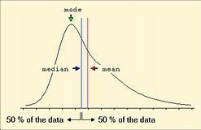

= eco 2020-5-2
:toc:

---

==  Less than zero

(eco 2020-5-2 / Finance and economics / Local finances in America: Less than zero )

America’s cities and states *face* a cash crunch

Help from the federal government and the Federal Reserve *may be* on the way

May 2nd 2020 | WESTCHESTER COUNTY

NO COUNTY IN New York, outside the city and Long Island, *has seen* more cases of covid-19 than Westchester, just north of the Bronx. For weeks tens of thousands of would-be commuters *have been staying home*. Bars, restaurants and other businesses *have been closed*.

Sales-tax revenue, usually around $500m, *may be down* by as much as $100m this year. With fewer people *travelling*, hotel-tax receipts *will be* lower. Meanwhile, spending on emergency and health services *has soared*. The county *may face* a shortfall of up to $160m on a $2.1bn annual budget. It *can hope for* [at best] limited help from the state of New York, which itself *expects* a 14% decline in revenue, *due to* lower corporate- and personal-income-tax receipts, *requiring* $7.3bn in spending cuts(n.) in the next budget. “We’ve done a variety of projections,” *explains* George Latimer, the county executive: “Bad, worse, even worse and totally horrible.”

Mr Latimer *is not* alone. Shortfalls *have hit* local governments across America -- and *not* just in covid-battered places. Wyoming, for instance, *claims* to have around 400 confirmed cases, but *may face* a collapse in revenue of 30% over the next two years, *driven by* low oil prices and electricity demand (it is America’s leading coal-producing state). The National Association of Counties *estimates that* revenue declines and covid-related spending increases *could take* $144bn out of county budgets through the upcoming fiscal year. The Centre on Budget and Policy Priorities (CBPP), a left-leaning think-tank, *reckons that* states *will face* an even bigger shortfall, of $350bn, next year (see chart). The prospect of such shortfalls *led* investors *to sell off* municipal bonds in March, *causing* yields(n.) *to rise sharply*. Terrifying though these numbers are, there *may also be grounds for* hope.

*Start with* the horror. Most states *begin* their next fiscal year on July 1st. States and cities *issue*(v.) debt *to fund* long-term infrastructure projects, such as *building* hospitals or schools. But for the most part -- because of a combination of constitutional requirement, statute and tradition -- they *must balance* their budgets, and *cannot use* debt *to fund* operating costs. When revenues *fall*, therefore, states *must cut spending* or *raise taxes*. *With* so many people *out of work*, and uncertainty(n.) over whether and when consumer spending *will return*, states *will want to keep* tax increases *minimal*. That *leaves* only one alternative: *deep spending* cuts.

Anything remotely discretionary(a.) is probably imperilled, as *is* education, which *was cut heavily* after the 2007-09 crisis. Local governments *may also have to start furloughing* and *firing people*. High unemployment *will make* that *especially painful*. `主` Chris Coons,  a Democratic senator from Delaware who [during the financial crisis] *ran* his state’s most populous county, `谓` *warns that* municipal lay-offs *could hit* “employees (*processing* unemployment cheques) … or those who *will be critical to* retraining and placement of people unemployed now, or folks who *provide* critical community services.”

Fortunately, most states *are* in a better position *than* they were before the last recession. In mid-2019 tax revenues in every state but five *had exceeded* their pre-recession levels (commodity-dependent Wyoming and Alaska *were* among the exceptions). All states but four *reported that* they *had collected* more revenue in the year to July 2019 than expected.

Rainy-day funds *also hit* an all-time high, with the median(n.) *covering* 8% of general-fund expenditures. The healthy average, though, *masks*(v.) wide gaps. On the whole, western states *appear* in better shape *than* hard-hit(a.) north-eastern ones. New York’s kitty, for instance, *is* just 3.2% of general-fund expenditures; New Jersey’s and Pennsylvania’s *are* at 1% each. *Drawing down* around half of these funds *would allow* states *to plug*(v.) around $36bn of the shortfall. Federal aid (*passed* [to date]) *has provided* another $281bn.

More *is probably coming*. A Senate bill *sponsored by* Bob Menendez, a Democrat from New Jersey, and Bill Cassidy, a Republican from Louisiana, *would disburse*(v.) $500bn *to* state and local governments in proportion to their populations, revenue losses and number of covid-19 cases. Its chances of passing the Republican-controlled Senate *are* slim. But even Mitch McConnell, the majority leader -- who at first *suggested that* states *be allowed to go bankrupt* -- *concedes that* cities and states *will probably receive* more federal funds.

In order to *calm* the bond market, the Federal Reserve *has said* it *will buy* up to $500bn of state and local debt. On April 27th it *amended* its programme *to include* more states and cities. It now *plans to buy* investment-grade bonds *issued by* states and counties with a population of at least 500,000, and cities with a population of at least 250,000. That *excludes* smaller places, but *lets* states and counties *use* the proceeds of their sales *to* the Fed *to help* smaller entities.

Investors *hope* the combination of federal loans and aid *can keep* bond markets *stable*. Geoffrey Schechter of MFS Investment Management *believes that* a wave of defaults *is* unlikely: “states and local governments *recognise* they *need* access(n.) to capital markets.” An uncertain couple of months, *followed by* a lean(a.) few years: cautious optimism in a pandemic.

---

== Less than zero 词汇解说

1. crunch :  /krʌntʃ/  n.[ Cusually sing. ] ( especially NAmE ) a situation in which there is suddenly not enough of sth, especially money （突发的）不足，短缺；（尤指）缺钱 /压碎声；碎裂声 +
-> America’s cities and states *face a cash crunch*. 美国的城市和州面临现金短缺

1. would-be : a. used to describe sb who is hoping to become the type of person mentioned （形容想要成为…的人）未来的 +
-> a *would-be* actor 想要成为演员的人 +
-> advice for *would-be parents* 对即将成为父母的人的忠告

1. commuter : n. a person who travels into a city to work each day, usually from quite far away （远距离）上下班往返的人 +
-> For weeks tens of thousands of would-be commuters *have been staying home*. 数周以来，成千上万的通勤者一直待在家里。

1. sales-tax revenue 销售税

1. receipt :  /rɪˈsiːt/  receipts [ pl. ] ( business 商 ) money that a business, bank or government receives （企业、银行、政府等）收到的款项，收入 +
=> re-再,又 + ceipt( -cept- )拿,取 +
-> hotel-tax receipts  酒店税收收入 +
-> net/gross receipts 净收入；总收入

1. shortfall :n. *~ (in sth)* if there is a shortfall in sth, there is less of it than you need or expect 缺口；差额；亏空 +
-> The county *may face* a shortfall of up to $160m on a $2.1bn annual budget.  在21亿美元的年度预算中，该县可能面临高达1.6亿美元的缺口。

1. *at best* : used for saying what is the best opinion you can have of sb/sth, or the best thing that can happen, when the situation is bad （表达最好的看法，或恶劣状况下可能出现的最好转机）充其量 +
-> Their response to the proposal was, *at best*, cool. 他们对提议的反应, 充其量只能说是漠然置之。 +
-> We can't arrive before Friday *at best*. 我们无论如何星期五之前也到不了。 +
-> It *can hope for* [at best] limited help from the state of New York.  它最多只能指望纽约州提供有限的帮助。

1. due : *~ to sth/sb* caused by sb/sth; because of sb/sth 由于；因为 +
-> The project had to be abandoned *due to* a lack of government funding. 这项工程由于缺乏政府的资助而不得不放弃。 +
-> the state of New York, which itself *expects* a 14% decline in revenue, *due to* lower corporate- and personal-income-tax receipts, requiring $7.3bn in spending cuts in the next budget. +
由于企业和个人所得税收入下降，纽约州的收入预计将下降14%，因此下个政府的年度预算中, 需要削减73亿美元的支出。

1.  budget : ( BrE also Budget ) an official statement by the government of a country's income from taxes, etc. and how it will be spent 政府的年度预算 +
-> tax cuts in *this year's budget* 本年度政府预算中的税收削减

1. projection : n. [ C ] an estimate or a statement of what figures, amounts, or events will be in the future, or what they were in the past, based on what is happening now 预测；推断；设想 +
-> We’ve done *a variety of projections*. 我们做了各种各样的预测. +
-> Sales *have exceeded our projections*. 销售量超过了我们的预测。

1. battered : a. [ usually before noun ] attacked violently and injured; attacked and badly damaged by weapons or by bad weather 受到严重虐待的；受到（炮火、恶劣天气）重创的 /batter v. 连续猛击；磨损+
-> *battered women/children* 受虐待的妇女╱儿童 +
-> Rockets and shells continued to hit *the battered port*. 火箭和炮弹继续袭击已遭受重创的港口。 +
-> Shortfalls *have hit* local governments across America -- and not just *in covid-battered places*.
资金短缺打击了美国各地的地方政府——不仅仅是在受新冠肺炎疫情打击的地区。 +

1. Wyoming /wai'əumiŋ/ n. 美国怀俄明州

1. coal-producing 产煤 +
-> it is America’s *leading coal-producing state*. 该州是美国主要的产煤州

1. The National Association of Counties *estimates that* `主` revenue declines /and covid-related spending increases `谓` *could take* $144bn out of county budgets [through the upcoming fiscal year]. +
美国国家县协会(National Association of Counties)估计，到下一财年，财政收入下降, 和与新冠肺炎相关的支出增加, 可能会使县预算减少1440亿美元。

1. The Centre on Budget and Policy Priorities (CBPP) 预算和政策优先中心

1. *sell sth off* : to sell things cheaply because you want to get rid of them or because you need the money 甩卖；抛售；变卖 +
-> The prospect of such shortfalls *led* investors *to sell off* municipal bonds in March, *causing* yields(n.) *to rise sharply*. 这种政府财政收入短缺的前景导致投资者在3月份抛售市政债券，导致收益率大幅上升。

1. municipal :  /mjuːˈnɪsɪpl/  a. [ usually before noun ] connected with or belonging to a town, city or district that has its own local government 市政的；地方政府的 +
=> -mun-防御,公共 + -cip-拿 + -al形容词词尾 +
-> *municipal elections/councils* 地方政府选举；市政委员会

1. yield : [ CU ] the total amount of crops, profits, etc. that are produced 产量；产出；利润 +
-> a high crop yield 作物丰收 +
-> This will give *a yield of 10% on your investment*. 这会给你的投资带来10%的利润。

1. grounds [ Cusually pl. ] *~ for sth/for doing sth* :  a good or true reason for saying, doing or believing sth 充分的理由；根据 +
-> You *have no grounds for complaint*. 你没有理由抱怨。 +
-> The case was dismissed *on the grounds that* there was not enough evidence. 此案以缺乏足够的证据为由被驳回。 +
-> Terrifying though these numbers are, there *may also be grounds for* hope. 尽管这些数字令人恐惧，但仍有理由抱有希望。

1. issue : v. [ often passive ] *~ sth (to sb) /~ sb with sth* : to give sth to sb, especially officially （正式）发给，供给 +
-> to issue(v.) passports/visas/tickets 发护照╱签证╱票 +
-> Most states *begin* their next fiscal year on July 1st. States and cities *issue*(v.) debt *to fund* long-term infrastructure projects, such as *building* hospitals or schools. +
大多数州在7月1日开始下一个财政年度。各州和各城市发行债券，为医院或学校建设等长期基础设施项目, 提供资金。

1. But for the most part -- because of a combination of constitutional requirement, statute and tradition -- they *must balance* their budgets, and *cannot use* debt *to fund* operating costs. +
但在大多数情况下，由于宪法的要求、法规和传统的共同约束，他们必须平衡预算，不能用债务来支付运营成本。

1. alternative : n. a thing that you can choose to do or have out of two or more possibilities 可供选择的事物 +
-> *We had no alternative* but to fire Gibson. 我们别无他法，只有辞退吉布森。
+
-> When revenues *fall*, therefore, states *must cut spending* or *raise taxes*. *With* so many people *out of work*, and uncertainty over whether and when consumer spending *will return*, states *will want to keep* tax increases *minimal*. That *leaves* only one alternative: *deep spending* cuts. +
因此，当收入下降时，各州必须削减开支或提高税收。由于如此多的人失业，以及消费者支出, 是否会, 以及何时会恢复, 这个不确定性存在，各州只能将增税保持在最低限度。这就只剩下一个选择能平衡支出:大幅削减开支。

1. remotely : ad. from a distance 远程地 /far away from places where other people live 在偏僻地方 +
-> *remotely operated* 远程操作的 +
-> The church *is remotely situated* on the north coast of the island. 教堂位于这个岛偏僻的北部海岸。 +
-> *Anything remotely discretionary(a.) is probably imperilled*(v.), as is education, which was cut(v.) heavily after the 2007-09 crisis. +
任何可以自由支配的东西都可能陷于危险境地，教育也是如此，2007-09年金融危机后，教育支出大幅削减。

1. discretionary :  /dɪˈskreʃəneri/ a. [ usually before noun ] ( formal ) decided according to the judgement of a person in authority about what is necessary in each particular situation; not decided by rules 自由决定的；酌情行事的；便宜行事的 +
=> 来自discreet, 慎重。 +
-> Magistrates were given *wider discretionary powers*.
地方法官们被赋予了更广泛的酌情决定权。 +
->

1. imperil :  /ɪmˈperəl/ v. [ VN ] ( formal ) to put sth/sb in danger 使陷于危险；危及 +
=> im-,进入，使，peril,危险，冒险。 +
-> *You imperilled(v.) the lives of other road users* by your driving. 你的驾驶危及了其他道路使用者的生命。

1. furlough : /ˈfɜːrloʊ/  n. ( NAmE ) a period of time during which workers are told not to come to work, usually because there is not enough money to pay them （通常因发不出工资而给的）准假 +
=> 来自荷兰语。fur-, 同per-,完全的，-lough, 爱，许可，许假，词源同love, leave. +
-> Local governments *may also have to start furloughing* and *firing people*. 地方政府也可能不得不开始放假和解雇员工。

1. placement : n. the act of finding sb a suitable job or place to live （对人的）安置，安排 +
-> a *job placement* service 职业介绍所 +
-> placement with a foster family 安置到寄养家庭
+
-> `主` Chris Coons,  a Democratic senator from Delaware who [during the financial crisis] *ran* his state’s most populous county, `谓` *warns that* municipal lay-offs *could hit* “employees (*processing* unemployment cheques) … or those (who *will be critical to* retraining and placement of people unemployed now), or folks (who *provide* critical community services).” +
来自特拉华州的民主党参议员克里斯•库恩斯(Chris Coons), 在金融危机期间管理着该州人口最多的县，他警告说，市政裁员可能会打击“处理失业支票的雇员……或者那些对现在失业人员的再培训和安置至关重要的人，或者那些提供重要社区服务的人。”

1. pre-recession 经济衰退前的

1. commodity :  /kəˈmɑːdəti/ ( economics 经 ) a product or a raw material that can be bought and sold 商品 +
-> Crude oil is *the world's most important commodity*. 原油是世界上最重要的商品。+
-> Fortunately, most states *are* in a better position *than* they were before the last recession. In mid-2019 tax revenues in every state but five *had exceeded* their pre-recession levels (commodity-dependent Wyoming and Alaska *were* among the exceptions).  All states but four *reported that* they *had collected* more revenue in the year to July 2019 than expected. +
幸运的是，大多数州的情况都比上次衰退前要好。2019年年中，除了5个州以外，各州的税收都超过了衰退前的水平(依赖大宗商品的怀俄明和阿拉斯加是例外)。除四个州外，所有州都报告说，在截至2019年7月的一年里，他们的税收收入超过了预期。

1. Rainy-day 雨天；穷困时期 +
-> Rainy-day funds 雨天基金. //“雨天基金”是一笔预留资金，一般在国家处于萧条时期，常规财政收入有所减少时使用，以保障该国财政方面的正常运作。

1. all-time : a. [ only before noun ] (used when you are comparing things or saying how good or bad sth is) of any time （用于比较或表示好坏程度）空前的，创纪录的，一向的 +
-> Unemployment *reached(v.) an all-time record of* 3 million. 失业人数高达300万的创纪录数字。

1. median : /ˈmiːdiən/  a. having a value in the middle of a series of values 中间值的；中间的 /located in or passing through the middle 在中间的；通过中点的 / n. ( mathematics 数 ) the middle value of a series of numbers arranged in order of size 中位数+
-> *the median age/price* 中年；中等价位 +
-> a median point/line 中点╱线 +

1. general-fund [金融] 普通基金；不指定用途的资金

1. expenditure : /ɪkˈspendɪtʃər/ n. the act of spending or using money; an amount of money spent 花费；消费；费用；开支 /the use of energy, time, materials, etc. （精力、时间、材料等的）耗费，消耗  +
-> plans to increase *expenditure(n.) on health* 增加医疗保健开支的计划 +
-> This study represents *a major expenditure of time and effort*. 这项研究意味着要耗费大量的时间和精力。 +
-> Rainy-day funds *also hit* an all-time high, with the median(n.) *covering* 8% of general-fund expenditures. 应急基金(雨天基金)也创下历史新高，中位数占(足以支付；够付)普通基金支出的8%。

1. shape : n. [ U ] the physical condition of sb/sth 状况；情况 +
-> *What sort of shape was the car* in after the accident? 这车出过事故以后状况如何？ +
-> *He's in good shape* for a man of his age. 作为那把年纪的人来说，他身体不错。 +
-> The healthy average, though, *masks*(v.) wide gaps. On the whole, western states *appear* in better shape *than* hard-hit(a.) north-eastern ones. +
然而，健康的平均水平, 掩盖了巨大的现状差距。总体而言，西部各州的情况, 比遭受重创的东北部各州要好。

1. kitty : n. ( informal ) if money is put in a kitty , a group of people all give an amount and the money is spent on sth they all agree on 共同凑集的一笔钱 +
=> 词源不详，可能来自kit,全套。引申词义收集，集中。 +
-> We each *put ￡20 in the kitty* to cover the bills. 我们每人凑20英镑支付账单。 +
-> New York’s kitty, for instance, *is* just 3.2% of general-fund expenditures. 纽约的金额仅占普通基金支出的3.2%.

1. drawdown : N a depletion or reduction, for example of supplies 削减 /指水库等由于抽水而降低水位 +
-> *Drawing down* around half of these funds *would allow* states *to plug*(v.) around $36bn of the shortfall. Federal aid passed to date *has provided* another $281bn.
动用其中约一半的资金, 将使各州能够填补约360亿美元的缺口。到目前为止，通过的联邦援助又提供了2810亿美元。

1. plug : v. to provide sth that has been missing from a particular situation and is needed in order to improve it 补足；补充；供给 / *~ sth (up)* to fill a hole with a substance or piece of material that fits tightly into it 堵塞；封堵 +
-> A cheaper range of products was introduced *to plug(v.) the gap* at the lower end of the market. 推出相对廉价的一系列产品，是为了填补较低档市场的缺口。 +
-> *He plugged(v.) the hole* in the pipe with an old rag. 他用一块旧破布把管子上的那个洞塞住了。 +

1.  *to date* : until now 迄今为止；到目前为止；直到现在 +
-> *To date*, we have received over 200 replies. 到目前为止，我们已收到200多封回信。 +
-> Federal aid (*passed* [to date]) *has provided* another $281bn. 迄今为止，通过的联邦援助又提供了2810亿美元。

1. sponsor : v.  [ VN ] to arrange for sth official to take place 主办；举办；促成 / [ VN ] ( of a company, etc. 公司等 ) to pay the costs of a particular event, programme, etc. as a way of advertising 赞助（活动、节目等） +
-> The US *is sponsoring negotiations* between the two sides. 美国正在安排双方的谈判。 +
-> A Senate bill *sponsored by* Bob Menendez, a Democrat from New Jersey, and Bill Cassidy, a Republican from Louisiana, *would disburse*(v.) $500bn *to* state and local governments in proportion to their populations, revenue losses and number of covid-19 cases. +
由新泽西州民主党人鲍勃•梅内德斯(Bob Menendez)和路易斯安那州共和党人比尔•卡西迪(bill Cassidy)发起的一项参议院法案，将按照各州和地方政府的人口、财政收入损失和新冠肺炎病例数量的比例，向它们支付5000亿美元。

1. disburse : /dɪsˈbɜːrs/ [ VN ] ( formal ) to pay money to sb from a large amount that has been collected for a purpose （从资金中）支付，支出 +
=> dis-, 不，非，使相反。-burse, 钱包，词源同pure, bursary. 即把钱从钱包拿出来，支付。

1. slim : a. a slim chance of success 成功的可能性不大 /( approving ) ( of a person 人 ) thin, in a way that is attractive 苗条的；纤细的 +
-> Its chances of passing the Republican-controlled Senate *are* slim(a.). 它(该由参议院党员提出的法案)通过共和党控制的参议院的机会渺茫。

1. concede : v. *~ sth (to sb) /~ sb sth* to admit that sth is true, logical, etc. 承认（某事属实、合乎逻辑等） +
-> ‘Not bad,’ *she conceded grudgingly*. “不错。”她勉强承认道。 +
->  even Mitch McConnell, the majority leader *concedes that* cities and states *will probably receive* more federal funds.  即使是最初建议允许各州破产的多数党领袖米奇·麦康奈尔也承认，城市和州可能会得到更多的联邦资金。

1. proceeds : N-PLURAL The proceeds of an event or activity are the money that has been obtained from it. (某事件或活动带来的) 收入 +
=> pro-,向前，-ceed,走，词源同accede,concede.引申诸相关词义。 +
-> *The proceeds of the concert* went to charity.
音乐会的收入给了慈善机构。
+
-> In order to *calm* the bond market, the Federal Reserve *has said* it *will buy* up to $500bn of state and local debt. On April 27th it *amended* its programme *to include* more states and cities. It now *plans to buy* investment-grade bonds *issued by* states and counties with a population of at least 500,000, and cities with a population of at least 250,000. That *excludes* smaller places, but *lets* states and counties *use* the proceeds of their sales *to* the Fed *to help* smaller entities. +
为了稳定债券市场，美联储(fed)表示，将购买至多5000亿美元的州债和地方债。4月27日，它修订了计划，将更多的州和城市包括进来。它现在计划购买人口在50万以上的州和县以及人口在25万以上的城市发行的投资级债券。这就排除了小地方，但是允许各州和县使用他们出售给美联储的收益来帮助小的实体。

1. default : n. [ UC ] failure to do sth that must be done by law, especially paying a debt 违约（尤指未偿付债务） +
-> The company is *in default* on the loan. 这家公司拖欠借款。
+
-> Investors *hope* the combination of federal loans and aid *can keep* bond markets *stable*. Geoffrey Schechter of MFS Investment Management *believes that* a wave of defaults *is* unlikely: “states and local governments *recognise* they *need* access(n.) to capital markets.” An uncertain couple of months, *followed by* a lean(a.) few years: cautious optimism in a pandemic. +
投资者希望, 联邦贷款和援助的结合, 能够保持债券市场的稳定。MFS Investment Management的杰弗里•谢克特(Geoffrey Schechter)认为，一波违约潮不太可能发生:“各州和地方政府认识到，它们需要进入资本市场。接下来的几个月充满不确定性，接下来的几年则不景气:在大流行期间持谨慎乐观态度。

1. lean : a. [ usually before noun ] ( of a period of time 一段时间 ) difficult and not producing much money, food, etc. 难以赚钱的；生产不出（食物等）的；贫乏的 / ( usually approving ) ( of people, especially men, or animals 人，尤指男人或动物 ) without much flesh; thin and fit 肉少的；瘦且健康的 +
=> 来自PIE*klei,倾斜，词源同clime,incline. 引申词义依靠。 +
-> *a lean period/spell* 不景气时期

1. cautious : a. *~ (about sb/sth) /~ (about doing sth)* being careful about what you say or do, especially to avoid danger or mistakes; not taking any risks 小心的；谨慎的 +
-> They'*ve taken a very cautious approach* . 他们采取了十分谨慎的态度。

---

