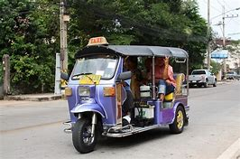
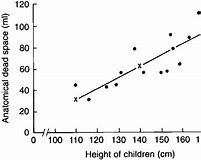

= eco 2020-05-23
:toc:

---

== The great reversal(n.)颠倒；彻底转变；反转；倒置  词汇解说

(eco 2020-5-23 / International / Covid-19 and global poverty: The great reversal)

Covid-19 *is undoing*(v.)消除，取消，废止（某事的影响） years of progress in *curbing* global poverty

The number of very poor people *was steadily falling*; now *it is rising fast*

May 23rd 2020 | DELHI, KAMPALA AND MEXICO CITY

- undo : v. to cancel the effect of sth 消除，取消，废止（某事的影响） +
-> He *undid* most of the good work of the previous manager.
他把前任经理的大部分功绩都毁掉了。 +
-> It's not too late *to try and undo(v.) some of the damage* .
想办法补救部分损失还为时不晚。

JANE KABAHUMA *has been eating one meal a day* since the end of March, when the lockdown *began*. She *used to work* in a hotel, but it *had to close*, along with most businesses in Uganda. She thinks “it will take time” before the work comes back. In five months she is expecting a baby; it may arrive before a job does.

Her standard of living *has plummeted*(v.)暴跌；速降. She used to *pay to fill*(v.) her jerrycans 五加仑罐；金属制液体容器 from a clean tap 水龙头；旋塞, but these days *fetches water* from a dirty well 井；水井, because it is free. She *gets* by, more or less, *with help* from friends and family. But for how long? 但能维持多久呢?

- jerrycan +
image:../../+ img_单词图片/j/jerrycans.jpg[100,100]

In normal times, people in poor countries *have* many ways *to cope with* shocks. If one member of a family *falls sick*, the others *can work* longer hours *to make up for* 弥补；补偿 the lost income. Or they *can ask* cousins(`= : a child of your aunt or uncle`) or neighbours *for help*. Or, if a whole village *is impoverished* 使贫穷;使(质量)贫瘠；使枯竭 by a bad harvest 收成；收获量, they *can ask* a nephew (*working* in a big city or a foreign country) *to send some extra cash*. All these “coping mechanisms” 应对机制, *as* development experts *call them*, *depend on* calamity 灾难；灾祸 *not striking everywhere* at once. Alas, covid-19 *has done just that*.

- calamity : |kəˈlæməti| n. an event that causes great damage to people's lives, property, etc. 灾难；灾祸 +
同义词 disaster +
=> 词源与climate（气候; 氛围; 状况; 局势）同源，天像与灾难有关。 +

In many places, workers *cannot make up for* 弥补；补偿 lost income *by working harder* because demand for their labour *has collapsed*. Empty restaurants *need* no waiters; shuttered malls *need* no mopping 用拖把擦干净,用布擦掉（表面）的液体; and few motorists 驾汽车者；开汽车的人 *are rolling down* their windows *to buy* fruit *from* street hawkers 沿街叫卖者；小贩.

The newly impoverished 赤贫的；不名一文的 *cannot easily get help* from friends or relatives because, *no matter* where in the world they are, they *are all experiencing* a simultaneous(a.)同时发生（或进行）的；同步的 and massive economic shock. The World Bank *predicts that* remittances(n.)汇付；汇款 from migrant workers *will drop* by 20% this year. Male Nepali 尼泊尔语 migrants who are still overseas *are now sending back* only a quarter of what they were in January. Many *send back nothing* at all, *having returned home*.

- remittance:  [rɪˈmɪtns]  n.[不可数名词] the act of sending money to sb in order to pay for sth 汇付；汇款 /[可数名词](formal) a sum of money that is sent to sb in order to pay for sth 汇款金额 +
同义词 payment +
-> *Remittance can be made* by cheque or credit card. 可通过支票或信用卡汇款。

Most countries in the developing world *still require* their citizens *to stay at home*, *except* 除…之外 to duck out 逃避;推脱;回避 for essentials  必不可少的东西；必需品. But *few* of the world’s poorest *can work from home*. And without work, many *cannot eat*. Thus, covid-19 *imperils*(v.)使陷于危险；危及 one of the greatest achievements of recent decades -- the stunning(a.)极有魅力的；绝妙的；给人以深刻印象的;令人惊奇万分的；令人震惊的 reduction in global poverty.

[From 1990 until last year] the number of extremely poor people -- those who *subsist(v.) on* （尤指靠有限的食物或钱）维持生活，度日 less than $1.90 per day -- *fell* from 2bn, or 36% of the world’s population, *to* around 630m, or just 8%. Now, for the first time since 1998, that number *is rising -- very fast*. The big questions *are*: how many millions *will slip(v.)滑 back into* penury(n.)贫困；贫穷? And *will* they *quickly escape （从不愉快或危险处境中）逃脱，摆脱，逃避 again* when the pandemic *is past*, or *will* its effects *be long-lasting*, or even permanent?

- penury :|ˈpenjəri| n. [不可数名词](formal) the state of being very poor 贫困；贫穷 +
同义词 poverty

The answers to those questions *are* maddeningly 使非常生气地；使发疯 hard *to pin down* 找某人查问；使说清楚. The World Bank *estimates that* national lockdowns and the global economic collapse *will push* at least 49m people *into* extreme poverty, *eliminating* 排除；清除；消除;消灭，干掉（尤指敌人或对手）nearly all the gains made since 2017. That *seems* implausibly 难以置信地;似乎不合情理的；不像真实的 rosy 美好的；乐观的 -- the bank’s estimate *was based on* data *published* in April. More recent numbers *are* far gloomier 前景黯淡的；忧郁；愁闷；无望(比较级). For example, on May 17th Goldman Sachs *estimated that* India’s economy *is shrinking* at an annualised 年度的; (利息)按年度计算 rate of 45%. Andy Sumner of King’s College London *estimates that* if global income per head 人均收入 *falls* by 20%, which it *may* for several months at least, the number of extremely poor people *could increase* by 420m -- *as much as* the entire population of South America. That *would wipe out* 彻底消灭；全部摧毁 a decade of gains in the fight against poverty.

- madden : v. to make sb very angry or crazy 使非常生气；使发疯 +
同义词 infuriate +
-> maddening(a.) delays 令人非常气恼的延误

Many poor countries *have copied* the kind of lockdowns that *have been imposed* in rich countries. But the circumstances 条件；环境；状况 *are* utterly 完全地; 彻底地 different. The well-off 富裕的 *are much more likely* to have jobs that *can be done from home*. And workers in rich countries who *cannot do* their jobs, such as hotel receptionists  (宾馆前台) 接待员, (办公室或医院) 接待员 or waiters, *are typically wellsupported* 良好支持 by taxpayers.

By contrast, when India *imposed* a strict and dramatic lockdown on March 24th, `主` the 140m people who *are estimated* to have lost(v.) their jobs `系` *were* suddenly in big trouble. `主` Tens of millions of migrants who *had moved* from villages to cities `谓` suddenly *had* no income, no way *to pay the rent* and no trains *to take them home*, 因为 since *those were also cancelled*. Millions *trudged* （因疲劳或负重而）步履沉重地走，缓慢地走，费力地走 hundreds of kilometres *back to* their home villages, where their families at least *would take them in* 留宿；收留. The lockdown *has been extended to* May 31st, with only small adjustments (see article).

- trudge : v.  /trʌdʒ/ to walk slowly or with heavy steps, because you are tired or carrying sth heavy （因疲劳或负重而）步履沉重地走，缓慢地走，费力地走 / n. a long tiring walk 徒步跋涉；疲惫的长途步行

Similar tales of woe 痛苦；苦恼；悲伤；悲哀 *are coming from* other poor places. Over 80% of Kenyans 肯尼亚人 and Senegalese 塞内加尔人 *reported* a loss of income in early April. In a study for the University of Manchester, 60 Bangladeshi 孟加拉的,孟加拉人 families *have been writing* “money diaries”日记. Before March, about $1,000 a month *passed through* 经过；路过 each household 一家人；家庭；同住一所房子的人 (not all of it income). In April that *fell to* $300 or so.

- woe : /woʊ/ n. woes [ pl. ] the troubles and problems that sb has 麻烦；问题；困难 /[ U ] great unhappiness 痛苦；苦恼；悲伤；悲哀 +
=> 感叹词。 +
-> *financial woes* 财政困难 +
-> *a tale of woe* 悲惨的故事

In middle-income countries, too, lockdowns *have been* excruciating(a.) 极痛苦的；极坏的；糟糕透顶的. Colombia’s *was* so tough that it *sparked 引发；触发,产生电火花 protests* in working-class 工人阶级的；劳动阶级的 barrios （西班牙或西班牙语国家城市的）区. In Altavista, a neighbourhood near San Salvador 萨尔瓦多首都, the capital of El Salvador 萨尔瓦多（中美洲）, people *have taken to hanging* white flags from their windows *to show that* they *have run out of food*.

- excruciating : /ɪkˈskruːʃieɪtɪŋ/  a. extremely painful or bad 极痛苦的；极坏的；糟糕透顶的 +
=> ex-, 向外。-cruc, 十字，折磨，词源同cross, crucifix. +
=> The pain in my back *was excruciating*(a.). 我的背疼痛难忍。

“[Almost overnight] people *go* from having income to having no income,” says Carolina Sánchez-Páramo of the World Bank. Less income *often means* less food. The World Food Programme (WFP) *predicts* a doubling 使加倍 of acute hunger by the end of 2020. David Beasely, its boss, *worries that* the world *could see* “multiple 数量多的；多种多样的 famines 饥荒 of biblical 宏大的；大规模的;有关《圣经》的；《圣经》中的 proportions 比例；倍数关系” within a few months.

- biblical : /ˈbɪblɪkl/ a. connected with the Bible; in the Bible 有关《圣经》的；《圣经》中的 /very great; on a large scale 宏大的；大规模的 +
-> a thunderstorm of *biblical proportions* 特大雷暴

Health-care systems *have been disrupted* [not only] by the virus itself [but also] by lockdowns, which *make it harder* for people *to seek treatment* for other illnesses. A team at Johns Hopkins University *calculates that* across 118 poor and middle-income countries, disruption to health systems and hunger *could kill* 1.2m more children and 57,000 mothers over six months. The Stop TB Partnership, an international research group, *reckons that* in India alone interruptions of diagnosis(n.)(疾病)诊断；（问题原因的）判断 and treatment 治疗；疗法；诊治 from a three-month lockdown, *followed by* a 10-month recovery period, *could cause* 500,000 excess(a.)超额的；额外的；附加的；过度的 deaths from tuberculosis 结核病.

- diagnosis :  /ˌdaɪəɡˈnəʊsɪs/  n. *~ (of sth)* the act of discovering or identifying the exact cause of an illness or a problem 诊断；（问题原因的）判断 +
-> diagnosis(n.) of lung cancer 肺癌的诊断

- tuberculosis : /tuːˌbɜːr-kjəˈloʊ-sɪs/ ( abbr. TB ) a serious infectious disease in which swellings appear on the lungs and other parts of the body 结核病 +
=> tubercle,肺结核结节，-osis,表疾病。引申词义结核病。 tuber,块茎，-cle,小词后缀。引申诸相关词义。 +
结核病是由结核杆菌感染引起的慢性传染病。结核菌可能侵入人体全身各种器官，但主要侵犯肺脏，称为肺结核病。人与人之间呼吸道传播是本病传染的主要方式。

Some kinds of lockdown *could cost* more lives *than* they save. A report by the London School of Hygiene and Tropical Medicine *estimates that* if restrictions *prevent* vaccinations 接种疫苗；种痘, in Africa 140 *will die* for every covid-19 death prevented.

Even moderate lockdowns *can be harmful* in very poor countries. The Malawian National Planning Commission and two think-tanks *did* a cost-benefit 成本效益 analysis of continuing(a.)持续的；连续的 Malawi’s restrictions, which *include* closing schools, *curbing*(v.)控制，抑制，限定，约束（不好的事物） travel and *stopping* health outreach(n.)外展服务（在服务机构以外的场所提供的社区服务等） work. They *estimated that* the lockdown, if *maintained* for nine months, *would avert* 防止，避免（危险、坏事） 12,000 deaths from covid-19. However, it *would also cause* more people *to go hungry*, *making* them *vulnerable to* TB  肺结核（tuberculosis） and malaria 疟疾, so the net number of deaths avoided would be roughly half that. And because the victims of coronavirus would be largely old people, whereas the victims of malaria would often be infants, the lockdown would actually cause a net loss of 26,000 years of life.

- cost-benefit :  ( economics 经 ) the relationship between the cost of doing sth and the value of the benefit that results from it 成本效益 +
-> cost-benefit analysis 成本效益分析 +
image:../../+ img_单词图片/c/cost-benefit.jpg[100,100]

- outreach : /ˈaʊtriːtʃ/ n. [ U ] the activity of an organization that provides a service or advice to people in the community, especially those who cannot or are unlikely to come to an office, a hospital, etc. for help 外展服务（在服务机构以外的场所提供的社区服务等 / Outreach programmes and plans try to find people who need help or advice rather than waiting for those people to come and ask for help. 主动帮助 +
=> out-,向外，reach,伸展，够到。引申词义外展服务。 +
image:../../+ img_单词图片/o/outreach.jpg[100,100]

- avert : v. to prevent sth bad or dangerous from happening 防止，避免（危险、坏事） / *~ your eyes, gaze, face (from sth)* to turn your eyes, etc. away from sth that you do not want to see 转移目光；背过脸 +
=> 前缀a-同ab-, 从，从...离开。词根vert, 转，见convert, 皈依。 +
=> He did his best *to avert suspicion*. 他尽量避嫌。

- malaria :  /məˈleriə/ n. [ U ] a disease that causes fever and shivering (= shaking of the body) caused by the bite of some types of mosquito 疟nüè疾 +
=> 来自意大利语mala aria,坏空气，来自mala,坏的，邪恶的，aria,空气，词源同air.因古代观念认为疟疾，瘴气等疾病是由恶臭的空气引起的。 +
-> 疟疾是经"按蚊"叮咬, 或输入带"疟原虫"(寄生虫)者的血液, 而感染"疟原虫", 所引起的虫媒传染病。 +
*疟疾的始作俑者是疟原虫，但蚊子却是疟原虫的帮凶。统计发现，有80种"按蚊"可以传播"疟疾"。* +
一只蚊子叮咬一位疟疾患者，它就感染了疟原虫。这只蚊子继续叮咬第二个人，疟原虫就会进入第二个人的身体。疟原虫先进入肝脏，成熟之后进入血液. +
不仅如此，疟疾还可以通过血液传播，比如通过孕妇传染给胎儿。更复杂的是，作为传播疟疾的源头，疟原虫也不止一种。目前已知有5种疟原虫可让人感染疟疾。 +
撒哈拉以南非洲，在这些非洲国家，疟疾高度流行，全年都是按蚊繁殖季节.

The lockdown *would also leave* Malawi $12bn *worse off* （比以前或其他人）更穷，更不愉快，更差, 恶化，情况更坏, by *stopping* people *from working* and *interrupting*(v.) children’s education, thus *dooming*  使…注定失败（或遭殃、死亡等） them *to earn* less in the future. That *is equivalent to* nearly two years’ GDP -- an astounding(a.)令人震惊的；使大吃一惊的 sum. Overall 一般来说；大致上；总体上, they *estimated that* the costs of the lockdown *outweighed* 重于；大于；超过 the benefits by 25 to 1. 封锁的成本与收益之比为25比1。

- *be worse off* : to be poorer, unhappier, etc. than before or than sb else （比以前或其他人）更穷，更不愉快，更差 +
-> The increase in taxes means that we'll *be* £30 a month *worse off than before*. 税收的增加意味着我们将比以前每月少挣30英镑。

Such calculations *are subject(a.)可能受…影响的；易遭受…的 to* a wide margin （获胜者在时间或票数上领先的）幅度，差额，差数 of error. Nonetheless 尽管如此, they *explain* why many experts *think that* rich-country style lockdowns *are unsustainable* 不能持续的；无法维持的 in many poor countries.

- margin : [ usually sing. ] the amount of time, or number of votes, etc. by which sb wins sth （获胜者在时间或票数上领先的）幅度，差额，差数 /the empty space at the side of a written or printed page 页边空白；白边 +
-> He won by *a narrow margin* . 他以微小的差额获胜。 +
-> a *gross margin* of 45% 45%的毛利

No work, no pay, no food

People who *lack* savings or a functioning  (作为某物) 起作用;运转 safety net *cannot simply stop working*. Yet millions *are being forced* to do so. Before the crisis Jonathan Solmayor *drove* a tuk-tuk 三轮小摩的（泰国以及东南亚国家市内交通工具） in Davao City in the Philippines. “I *am feeding* 养，养活（全家、一群人） four mouths,” he says, but “my only source of living *was stopped*.” In western Nepal men *have seen* `主` the hours they *can work* for wages `谓` *fall* by about 75%, according to the Yale Research Initiative on Innovation and Scale. In Uzbekistan the number of households (where at least one person *works*) *has dropped* by over 40%.

-  tuk-tuk +

As the number of breadwinners 挣钱养家的人 *falls*, the price of food *is rising*. In India the price of potatoes *has jumped* 突升；猛涨；激增 by over 15%. In Uganda the prices of most key foods *have gone up* （价格、温度等）上涨，上升 by over 15% since mid-March. The global food supply *is holding up* 支持住；承受住；支撑得住, but local disruptions *are* severe. In the province of Quezon in the Philippines an “extreme” quarantine *has seen* squash 南瓜小果（主要种类为笋瓜winter squash和西葫芦summer squash）, beans 豆; 豆荚, and watermelons *wither*(v.) （使）枯萎，凋谢 in the fields. In India vegetables that were harvested(v.)收割（庄稼）；捕猎（动物、鱼） *have been left to rot* as they *cannot be transported to* market. In East Africa covid-19 *is not* the only plague 瘟疫,死亡率高的传染病 *to strike* this year: trillions 大量；无数; 万亿；兆 of locusts 蝗虫 *are once again devouring* （尤指因饥饿而）狼吞虎咽地吃光 crops.

- squash : /skwɒʃ/ [ CU ] a type of vegetable that grows on the ground. Winter squash have hard skin and orange flesh. Summer squash have soft yellow or green skin and white flesh. 南瓜小果（主要种类为笋瓜winter squash和西葫芦summer squash） +
image:../../+ img_单词图片/s/squash.jpg[100,100]

- wither /ˈwɪðər/ v. if a plant withers or sth withers it, it dries up and dies （使）枯萎，凋谢 / *~ (away)* to become less or weaker, especially before disappearing completely 萎缩；（尤指渐渐）破灭，消失 +
=> 来自古英语 wederen,暴露于空气中，枯萎，词源同 weather. +
-> All our hopes *just withered away*. 我们所有的希望都渐渐破灭了。

- locust => 蝗虫. 来自拉丁语locusta,蝗虫，龙虾，词源有争议，可能来自PIE*lek,弯，转，关节，词源同leg,langustine.用以命名如蝗虫，龙虾等节肢动物。

Some *hope that* the rural poor *may escape* the worst. The virus *has taken longer to reach* remote villages, where social distancing *is* easier *than* it is in slums 贫民区. Subsistence(n.)勉强维持生活,收成仅够自身口粮的自给农业 farmers *might be able to feed themselves*. But even the poorest rural households in Africa *buy* almost half their food. Many *would normally top up* 补足；将…增加到所需的量 their income *with* paid work, but *no longer can*.

- subsistence : /səbˈsɪstəns/ n. [ U ] the state of having just enough money or food to stay alive 勉强维持生活 +
-> Many families *are living below the level of subsistence*. 许多家庭难以度日。 +
-> *subsistence agriculture/farming* (= growing enough only to live on, not to sell) 收成仅够自身口粮的自给农业

- *top sth up* : (especially British English) to fill a container that already has some liquid in it with more liquid 装满，注满（未满的容器）/to increase the amount of sth to the level you want or need 补足；将…增加到所需的量 +
-> *Top the oil up* before you set off.  出发前加满油。 +
-> She relies on tips *to top up her wages*.
她靠小费弥补工资的不足。

Those who were already miserable 痛苦的；非常难受的；可怜的 *have become more so*. In Uganda the WFP （联合国）世界粮食计划署（World Food Program（me）） *has cut rations*(n.)（食品、燃料等短缺时的）配给量，定量;（给战士或食品短缺地区的人提供的）定量口粮 for refugees by 30%, and funding *is drying up* 逐渐枯竭；耗尽;干涸. In Bangladesh 孟加拉国 more than 70% of Rohingya refugees *say* they are now unable to buy food.

- ration :  /ˈræʃn/ n. [ C ] a fixed amount of food, fuel, etc. that you are officially allowed to have when there is not enough for everyone to have as much as they want, for example during a war （食品、燃料等短缺时的）配给量，定量  +
/ *rations* [ pl. ] a fixed amount of food given regularly to a soldier or to sb who is in a place where there is not much food available （给战士或食品短缺地区的人提供的）定量口粮 +
/[ sing. ] ~ (of sth) an amount of sth that is thought to be normal or fair 正常量；合理的量 +
=>  -rat-计算,思考 + -ion. 来自拉丁语 rationem,思考，计算，部分，其主格形式为 ratio.引申词义定量，配给。
-> the weekly *butter ration* 每周的黄油配给量 +
-> *We're on short rations* (= allowed less than usual) until fresh supplies arrive. 在新的补给到达之前，我们的口粮定量不足。 +
image:../../+ img_单词图片/r/ration.jpg[100,100]

The most concentrated 密集的；集中的 suffering *will be* in big cities such as Kolkata and Kinshasa, says Ms Sánchez-Páramo. [Even before the pandemic] about 130m city-dwellers *were* extremely poor. Many *kept their heads above* 勉强逃脱困境；设法不举债；挣扎求存 the poverty line 贫困线（政府规定维持最低生活水平所需的收入标准） by *pedalling* 蹬车,骑自行车 rickshaws 黄包车; 人力车 or *hawking* vegetables. Lockdowns *have stopped that*. In India 84% of poor urban self-employed *have lost their work*.

- *keep your head above water* :
to deal with a difficult situation, especially one in which you have financial problems, and just manage to survive 勉强逃脱困境；设法不举债；挣扎求存

- rickshaw : /ˈrɪkʃɔː/ a small light vehicle with two wheels used in some Asian countries to carry passengers. The rickshaw is pulled by sb walking or riding a bicycle. 人力车；黄包车 +
=> 缩写自日式汉语 jinrikisha,人力车，来自 jin,人，riki,力，sha,车。 +
image:../../+ img_单词图片/r/rickshaw.jpg[100,100]

Even where lockdowns *are* less strict, the urban poor *are struggling*. In Mexico City, where staying at home *is* more of 更大程度上；更多地是 a suggestion *than* a requirement, Romaldo San Juan Garcia *normally spends his days* polishing(v.) shoes. But these days the kind of people who can afford shoe-shines 擦皮鞋,擦亮的皮鞋面 *no longer wear* leather shoes 鞋, since they *are staying away from the office*. [In a long day on the street] Mr Garcia *polished* only two pairs. Just *to pay* his monthly rent, he *needs to shine*(v.)擦亮；擦光 about 100. In tough times his children *would usually pick up* 重新开始；继续 extra shifts(n.)轮班；轮班工作时间 *waiting* tables. But because of the virus, the restaurants *are shut*.

- *more of* ：more of在这里意为“更大程度上；更多地是… ”,后面一般跟than...,也可以省略than...

- In tough times his children *would usually pick up* 重新开始；继续 extra shifts(n.)轮班；轮班工作时间 *waiting* tables.  +
在经济困难时期，他的孩子们通常会在餐馆里加班。

With so few other options, many of the newly destitute(a.)贫困的；贫穷的；赤贫的 *are doing things* that *will make it harder* for them *to escape poverty* even if the economy *recovers*. They *are eating less*, *selling* productive assets 生产资料,生产性资产  and even *pulling children out of school*.

- destitute : a. /ˈdestɪtuːt/ without money, food and the other things necessary for life 贫困的；贫穷的；赤贫的 / *the destitute* : [ pl. ] people who are destitute 穷人；贫民 +
=> de-, 不，非，使没有。-stit, 站，词源同stand, institute.即使无立足之地，引申义贫困。 +
-> When he died, his family *was left completely destitute*. 他死时家里一贫如洗。 +
image:../../+ img_单词图片/d/destitute.jpg[100,100]

“[When I *eat supper* 晚饭；晚餐] it *means* I *will sacrifice* lunch,” *explains* Nathan Tumuhimbise, a flower worker in Uganda who *was sent home* on unpaid leave(假期；休假) 无薪假期. He *has no idea* whether he *will be able to pay for* his daughter’s next instalment （分期付款的）一期付款 of school fees. [In desperation] he *has called* （给…）打电话 his father in the village *to sell* some of the family goats. “I’*m overwhelmed* 彻底制服; 击败, (强烈地影响而使) 不知所措的” he says. Other workers he knows *are even selling off*  甩卖；抛售；变卖 their land. Why? “Survival(n.)生存；存活；幸存, life and death,” he says.

- instalment : /ɪnˈstɔːlmənt/  ( NAmE usually in·stall·ment ) one of a number of payments that are made regularly over a period of time until sth has been paid for （分期付款的）一期付款 / one of the parts of a story that appears regularly over a period of time in a newspaper, on television, etc. SYN episode （报章连载小说的）一节；（电视连续剧的）一集 +

Assets such as land, livestock 牲畜；家畜 and motorbike taxis *can be sold* only once. When so many people *try to sell them* at the same time, prices *collapse*. And people who sell their productive assets today *will have no source of income* tomorrow.

- livestock  /ˈlaɪvstɑːk/ [ Upl. ] the animals kept on a farm, for example cows or sheep 牲畜；家畜 +
=> live,活的，stock,家畜。

*Cutting back* 减少；削减；缩减 on food *is* risky, too, especially for children. Malnutrition 营养不良 *stops* brains and bodies *from growing properly*. Stunting 萎缩；发育障碍短小症;阻碍生长；妨碍发展；遏制 *results in* lower IQs, greater risk of chronic illness and lower lifetime earnings 终身所得. In towns in Sierra Leone almost 60% of people *said* they *had eaten* fewer times than normal in the past week, according to the Yale Research Initiative. Fully 14% *have gone* （在某种状态下）生活，过活，移动 a whole day without eating.

- malnutrition  /ˌmælnuˈtrɪʃn/ [ U ] a poor condition of health caused by a lack of food or a lack of the right type of food 营养不良 +
=> mal- +‎ nutrition

- stunt : v.[ VN ] to prevent sb/sth from growing or developing as much as they/it should 阻碍生长；妨碍发展；遏制 +
=> 来自中古英语 stunt,矮的，发育不良的，来自古英语 stunt,愚笨的，来自 Proto-Germanic*stuntaz, 短的，矮小的，愚笨的，词源同 stint. +
-> His illness *had not stunted his creativity*. 疾病没有扼杀他的创造力。

- go : [ V-ADJ ] to live or move around in a particular state （在某种状态下）生活，过活，移动 +
-> *to go naked*/barefoot 光着身子；赤着脚 +
-> She cannot bear the thought of *children going hungry*. 想到孩子们挨饿她就受不了。

`主` *Pulling* kids *out of school* `谓` *has* awful long-term consequences. One World Bank paper 论文 *found that* if schools *remain closed* for just four months, the reduction in their lifetime earnings *will be equivalent to* 15% of a year’s global GDP.

We’re here to help

Governments *can help*. Fully 181 countries *have announced* extra efforts *to protect* the poor, about 60% of which *involve* cash or food aid. For millions, these *have proven* a lifeline 命脉；生命线. Ganesh, an auto-rickshaw 有篷机动三轮车（载客用，尤见于某些亚洲国家） driver in Delhi, *says* he *was lucky* to spot(v.) an advert 广告 about a state government scheme 计划；方案 *to pay* idle 没有工作的；闲散的;闲置的 auto drivers a one-off 一次性的；非经常的 5,000 rupees 卢比（印度、巴基斯坦等国的货币单位） (about $70). He *texted* （用手机给某人）发短信 in his ID and *soon got the money*. However, the vast majority of the cash in all these new welfare （政府给予的）福利 schemes *is* in rich countries. In the poorest ones, `主` extra social spending *announced* so far `谓` *amounts to* [just] $1 per head 人均,每人 -- in total, [not] per day 而非每天. Other drivers *applied for help* too, says Ganesh, but they *have not received anything*.

Existing safety nets *have long focused on* rural folk, which *used to make sense* because they *were* the poorest. However, many of the newly poor *are* in cities. Systems *need to adapt*, but many *are badly managed*. India’s federal programme of cash and food handouts 捐赠品；救济品;政府拨款（为促进商业活动） *is* scattershot(a.)漫无目标的 and *misses* many of the neediest. In Uganda the government’s own spokesperson *described* its efforts (to get aid to the right people) *as* “inadequate  不充分的；不足的；不够的, incompetent  无能力的，不胜任的, disorganised 计划不周的；缺乏组织的；杂乱无章的.” Egypt *has managed* to get payments （将付或应付的）款额，款项 only to 2m of its 100m people.

- handout : ( sometimes disapproving ) food, money or clothes that are given to a person who is poor 捐赠品；救济品  +
/( often disapproving ) money that is given to a person or an organization by the government, etc., for example to encourage commercial activity 政府拨款（为促进商业活动）

- scattershot : ADJ A scattershot approach or method involves doing something to a lot of things or people in a disorganized way, rather than focusing on particular things or people. 漫无目标的 +
=> scatter +‎ shot +

[In countries such as Kenya and Bangladesh] mobile money *is being used* to distribute(v.) aid more quickly. But the poorest *are often hard* to reach. Governments *often do not know* who they are. And welfare systems *were not designed [with pandemics in mind]*. [In South Africa] delays *have led* people *to form queues*(n.)（人、汽车等的）队，行列 (not always socially distanced ones) outside post offices *to sign up* 报名（参加课程） for benefits. [In many countries] corruption *limits* the effectiveness of welfare. [In Zimbabwe] aid *has been steered 操纵；控制；引导;驾驶（船、汽车等）；掌控方向盘 to* supporters of the ruling party 执政党. [In Uganda] MPs 国会议员（Member of Parliament） *initially put themselves* in charge of distributing $2.6m of relief cash in their constituencies （选举议会议员的）选区;选区的选民 (a court *ruled* 决定；裁定；判决 they *should pay it back* （向某人）还钱).

The biggest problem, though, *is simply that* governments in the poorest countries *do not have much money*. And they *are getting poorer*. The World Bank *says that* African government revenues *will drop* between 12% and 16% this year. In Nigeria, home to more extremely poor people than any other country, the collapse of the oil price *has shredded*  切碎；撕碎 government spending plans. [During the global financial crisis] many poor countries *slashed* 大幅度削减；大大降低;（用利器）砍，劈 spending on education; they *may do so* again.

- shred : v. [ VN ] to cut or tear sth into small pieces 切碎；撕碎 +
=> 来自 PIE*sker,切，劈，词 源同 shear,share,shard. +
-> He was accused of *shredding(v.) documents* relating to the case (= putting them in a shredder ) . 他被指控把与案件有关的文件用碎纸机销毁了。 +
image:../../+ img_单词图片/s/shred.jpg[100,100]

- slash : to make a long cut with a sharp object, especially in a violent way （用利器）砍，劈 /[ often passive ] ( often used in newspapers 常用于报章 ) to reduce sth by a large amount 大幅度削减；大大降低 +
=> 来自辅音丛 sl-,砍，劈，分开，比较 slab,slip,slat,slit,slot.引申比喻义削减。 +
-> The workforce *has been slashed by half*. 职工人数裁减了一半。

He *needs* protection, too

All this *has prompted* 促使；导致；激起 calls *to ease* lockdowns. That *will not save* poor countries *from being battered* by the global economic crisis. Nor *will* all businesses *reopen* if people *are still scared of* being infected. But at least the poor *would be able to try to work* and children *would be able to get vaccinations* 接种疫苗；种痘.

Nigeria *has already loosened lockdowns* in some big cities, even as cases rise. Bangladesh and Pakistan *have eased up* 减轻；缓和；放松, too. India *will open up* 打开（门、容器等）;开张；开业 somewhat next month. This *is not* always popular -- after two weeks *shut in* 关张；停业；倒闭；关闭；停止运转, 82% of Indians *supported* the first extension there. Ghana, one of the first in Africa *to remove* some restrictions, *shows* the risks. In one fish factory, 533 workers *were recently infected*.

*Lock down* smarter

However, the choice *is not* binary(a.)二进制的（用0和1记数）,仅基于两个数字的；二元的；由两部分组成的: total lockdown or no precautions 防范行动 at all. Governments and citizens *can do a lot* to prevent infections without *freezing* the whole economy. They *can protect* the elderly while *letting* most adults *go to work* and children *go to school*. They *can keep nightclubs closed* but *allow* markets, bus stations and factories *to open* -- with compulsory(a.)（因法律或规则而）必须做的，强制的，强迫的 masks 口罩, hand-washing and social distancing. They *can do a better job* of *spotting* outbreaks and *quarantining* （对动物或人）进行检疫，隔离 the infected. They *can teach people* the facts about the disease, so they *can protect themselves*. Community 社区；社会 health workers *did this well* during the Ebola crisis.

- compulsory :  /kəmˈpʌlsəri/ that must be done because of a law or a rule （因法律或规则而）必须做的，强制的，强迫的
SYN mandatory +
-> English is *a compulsory subject* at this level. 英语在这一级别是必修科目。

Whatever the approach （待人接物或思考问题的）方式，方法，态度, poor countries *will need help* from developed ones. Rich countries *have spent* a stunning  令人惊奇万分的；令人震惊的 $8trn *on* supporting(v.) their own citizens during the pandemic, *notes* Homi Kharas of the Brookings Institution, a think-tank. It *is* in their interest *to help* poor countries *grapple with* the disease -- otherwise *they will become* a coronavirus reservoir 水库；蓄水池 that *can reinfect* the rich. Yet the international response 国际社会的反应 *has been* “very go slow”, says Matthew Spencer of Oxfam, an NGO 非政府组织（独立于政府或商界的慈善机构、协会等）. So far the IMF and World Bank *have lent* about $20bn and $6bn respectively 分别地；各自地，独自地. *Talks about* debt relief *are moving lethargically* 昏睡地；迟钝地.

- lethargic :  /ləˈθɑːrdʒɪk/ ADJ If you are lethargic, you do not have much energy or enthusiasm. 没精打采的 +
=> 来自希腊语lethargia,遗忘，忘却，lethe,忘记，词源同latent,Lethe,argos,无精神，来自a-,无，没有，-erg,工作，趋动，词源同work,synergy.即如同游魂，无精打采，冷漠。

In the past, crises *have sometimes fostered* 促进；助长；培养；鼓励;代养，抚育，照料（他人子女一段时间） solidarity 团结；齐心协力；同心同德；相互支持 with the poor, *notes* Amartya Sen of Harvard University. In Britain during the 1940s life expectancy 预期寿命；预计存在（或持续）的期限 *shot up* 陡增；猛涨；迅速上升;蹿个儿；迅速长高 by seven years, *thanks to* a wartime rationing system that *ensured* everyone *had* nourishing(a.)有营养的；滋养多的 (if dull 枯燥无味的；无聊的；令人生厌的) food. According to a forthcoming 即将发生（或出版等）的 UN Development Programme study between 2013 and 2016, despite an Ebola epidemic, living standards(n.) in Sierra Leone *improved faster* than in any of 70 poor countries. The huge effort *to fight* Ebola *had* spillover(n.)容纳不下的部分；溢出部分 effects, as aid-workers and public servants *also helped* improve(v.) nutrition 吸收营养 and child mortality 死亡数量；死亡率. It *would be wonderful* if covid-19 *could inspire* 使产生（感觉或情感）;激励；鼓舞 similar efforts. But for now, the rich world *is too distracted* by its own problems *to pay much heed(n.)留心；注意；听从 to* the poor.

- foster : v. [ VN ] to encourage sth to develop 促进；助长；培养；鼓励 /( especially BrE ) to take another person's child into your home for a period of time, without becoming his or her legal parents 代养，抚育，照料（他人子女一段时间）+
=> 来自food,喂养，食物。 +
-> The club's aim is *to foster better relations within the community*. 俱乐部的宗旨是促进团体内部的关系。

- spillover :  /ˈspɪloʊvər/ n. something that is too large or too much for the place where it starts, and spreads to other places 容纳不下的部分；溢出部分 /the results or the effects of sth that have spread to other situations or places 影响  +
/A spillover is a situation or feeling that starts in one place but then begins to happen or have an effect somewhere else. 伴随的结果 +
-> A second room was needed for *the spillover of staff and reporters*. 还需要一个房间给没有安置的员工和记者。 +
image:../../+ img_单词图片/s/spillover.jpg[100,100]

- inspire : *~ sb (with sth) |~ sth (in sb)* to make sb have a particular feeling or emotion 使产生（感觉或情感）/*~ sb (to sth)* to give sb the desire, confidence or enthusiasm to do sth well 激励；鼓舞 +
=> in-,进入，使，-spir,呼吸，词源同respire,spirit.即吸入活力，吸收灵感，引申词义启发，鼓舞。 +
-> Her work didn't exactly *inspire me with confidence* . 她的工作并没有真正地使我产生信心。 +
-> His superb play *inspired the team* to a thrilling 5–0 win. 他的出色表现使球队士气大振，以5:0大获全胜。

- heed : *give/pay heed (to sb/sth) | take heed (of sb/sth)* : (formal) to pay careful attention to sb/sth 留心；注意；听从 +
=> 来自PIE*kadh,躲避，保护，词源同hat,hood.引申词义注意，留心。

---

== The great reversal

Covid-19 is undoing years of progress in curbing global poverty

The number of very poor people was steadily falling; now it is rising fast

May 23rd 2020 | DELHI, KAMPALA AND MEXICO CITY

JANE KABAHUMA has been eating one meal a day since the end of March, when the lockdown began. She used to work in a hotel, but it had to close, along with most businesses in Uganda. She thinks “it will take time” before the work comes back. In five months she is expecting a baby; it may arrive before a job does.

Her standard of living has plummeted. She used to pay to fill her jerrycans from a clean tap, but these days fetches water from a dirty well, because it is free. She gets by, more or less, with help from friends and family. But for how long?

In normal times, people in poor countries have many ways to cope with shocks. If one member of a family falls sick, the others can work longer hours to make up for the lost income. Or they can ask cousins or neighbours for help. Or, if a whole village is impoverished by a bad harvest, they can ask a nephew working in a big city or a foreign country to send some extra cash. All these “coping mechanisms”, as development experts call them, depend on calamity not striking everywhere at once. Alas, covid-19 has done just that.

In many places, workers cannot make up for lost income by working harder because demand for their labour has collapsed. Empty restaurants need no waiters; shuttered malls need no mopping; and few motorists are rolling down their windows to buy fruit from street hawkers.

The newly impoverished cannot easily get help from friends or relatives because, no matter where in the world they are, they are all experiencing a simultaneous and massive economic shock. The World Bank predicts that remittances from migrant workers will drop by 20% this year. Male Nepali migrants who are still overseas are now sending back only a quarter of what they were in January. Many send back nothing at all, having returned home.

Most countries in the developing world still require their citizens to stay at home, except to duck out for essentials. But few of the world’s poorest can work from home. And without work, many cannot eat. Thus, covid-19 imperils one of the greatest achievements of recent decades -- the stunning reduction in global poverty.

From 1990 until last year the number of extremely poor people -- those who subsist on less than $1.90 per day -- fell from 2bn, or 36% of the world’s population, to around 630m, or just 8%. Now, for the first time since 1998, that number is rising -- very fast. The big questions are: how many millions will slip back into penury? And will they quickly escape again when the pandemic is past, or will its effects be long-lasting, or even permanent?

The answers to those questions are maddeningly hard to pin down. The World Bank estimates that national lockdowns and the global economic collapse will push at least 49m people into extreme poverty, eliminating nearly all the gains made since 2017. That seems implausibly rosy -- the bank’s estimate was based on data published in April. More recent numbers are far gloomier. For example, on May 17th Goldman Sachs estimated that India’s economy is shrinking at an annualised rate of 45%. Andy Sumner of King’s College London estimates that if global income per head falls by 20%, which it may for several months at least, the number of extremely poor people could increase by 420m -- as much as the entire population of South America. That would wipe out a decade of gains in the fight against poverty.

Many poor countries have copied the kind of lockdowns that have been imposed in rich countries. But the circumstances are utterly different. The well-off are much more likely to have jobs that can be done from home. And workers in rich countries who cannot do their jobs, such as hotel receptionists or waiters, are typically wellsupported by taxpayers.

By contrast, when India imposed a strict and dramatic lockdown on March 24th, the 140m people who are estimated to have lost their jobs were suddenly in big trouble. Tens of millions of migrants who had moved from villages to cities suddenly had no income, no way to pay the rent and no trains to take them home, since those were also cancelled. Millions trudged hundreds of kilometres back to their home villages, where their families at least would take them in. The lockdown has been extended to May 31st, with only small adjustments (see article).

Similar tales of woe are coming from other poor places. Over 80% of Kenyans and Senegalese reported a loss of income in early April. In a study for the University of Manchester, 60 Bangladeshi families have been writing “money diaries”. Before March, about $1,000 a month passed through each household (not all of it income). In April that fell to $300 or so.

In middle-income countries, too, lockdowns have been excruciating. Colombia’s was so tough that it sparked protests in working-class barrios. In Altavista, a neighbourhood near San Salvador, the capital of El Salvador, people have taken to hanging white flags from their windows to show that they have run out of food.

“Almost overnight people go from having income to having no income,” says Carolina Sánchez-Páramo of the World Bank. Less income often means less food. The World Food Programme (WFP) predicts a doubling of acute hunger by the end of 2020. David Beasely, its boss, worries that the world could see “multiple famines of biblical proportions” within a few months.

Health-care systems have been disrupted not only by the virus itself but also by lockdowns, which make it harder for people to seek treatment for other illnesses. A team at Johns Hopkins University calculates that across 118 poor and middle-income countries, disruption to health systems and hunger could kill 1.2m more children and 57,000 mothers over six months. The Stop TB Partnership, an international research group, reckons that in India alone interruptions of diagnosis and treatment from a three-month lockdown, followed by a 10-month recovery period, could cause 500,000 excess deaths from tuberculosis.

Some kinds of lockdown could cost more lives than they save. A report by the London School of Hygiene and Tropical Medicine estimates that if restrictions prevent vaccinations, in Africa 140 will die for every covid-19 death prevented.

Even moderate lockdowns can be harmful in very poor countries. The Malawian National Planning Commission and two think-tanks did a cost-benefit analysis of continuing Malawi’s restrictions, which include closing schools, curbing travel and stopping health outreach work. They estimated that the lockdown, if maintained for nine months, would avert 12,000 deaths from covid-19. However, it would also cause more people to go hungry, making them vulnerable to TB and malaria, so the net number of deaths avoided would be roughly half that. And because the victims of coronavirus would be largely old people, whereas the victims of malaria would often be infants, the lockdown would actually cause a net loss of 26,000 years of life.

The lockdown would also leave Malawi $12bn worse off, by stopping people from working and interrupting children’s education, thus dooming them to earn less in the future. That is equivalent to nearly two years’ GDP -- an astounding sum. Overall, they estimated that the costs of the lockdown outweighed the benefits by 25 to 1.

Such calculations are subject to a wide margin of error. Nonetheless, they explain why many experts think that rich-country style lockdowns are unsustainable in many poor countries.

No work, no pay, no food

People who lack savings or a functioning safety net cannot simply stop working. Yet millions are being forced to do so. Before the crisis Jonathan Solmayor drove a tuk-tuk in Davao City in the Philippines. “I am feeding four mouths,” he says, but “my only source of living was stopped.” In western Nepal men have seen the hours they can work for wages fall by about 75%, according to the Yale Research Initiative on Innovation and Scale. In Uzbekistan the number of households where at least one person works has dropped by over 40%.

As the number of breadwinners falls, the price of food is rising. In India the price of potatoes has jumped by over 15%. In Uganda the prices of most key foods have gone up by over 15% since mid-March. The global food supply is holding up, but local disruptions are severe. In the province of Quezon in the Philippines an “extreme” quarantine has seen squash, beans, and watermelons wither in the fields. In India vegetables that were harvested have been left to rot as they cannot be transported to market. In East Africa covid-19 is not the only plague to strike this year: trillions of locusts are once again devouring crops.

Some hope that the rural poor may escape the worst. The virus has taken longer to reach remote villages, where social distancing is easier than it is in slums. Subsistence farmers might be able to feed themselves. But even the poorest rural households in Africa buy almost half their food. Many would normally top up their income with paid work, but no longer can.

Those who were already miserable have become more so. In Uganda the WFP has cut rations for refugees by 30%, and funding is drying up. In Bangladesh more than 70% of Rohingya refugees say they are now unable to buy food.

The most concentrated suffering will be in big cities such as Kolkata and Kinshasa, says Ms Sánchez-Páramo. Even before the pandemic about 130m city-dwellers were extremely poor. Many kept their heads above the poverty line by pedalling rickshaws or hawking vegetables. Lockdowns have stopped that. In India 84% of poor urban self-employed have lost their work.

Even where lockdowns are less strict, the urban poor are struggling. In Mexico City, where staying at home is more of a suggestion than a requirement, Romaldo San Juan Garcia normally spends his days polishing shoes. But these days the kind of people who can afford shoe-shines no longer wear leather shoes, since they are staying away from the office. In a long day on the street Mr Garcia polished only two pairs. Just to pay his monthly rent, he needs to shine about 100. In tough times his children would usually pick up extra shifts waiting tables. But because of the virus, the restaurants are shut.

With so few other options, many of the newly destitute are doing things that will make it harder for them to escape poverty even if the economy recovers. They are eating less, selling productive assets and even pulling children out of school.

“When I eat supper it means I will sacrifice lunch,” explains Nathan Tumuhimbise, a flower worker in Uganda who was sent home on unpaid leave. He has no idea whether he will be able to pay for his daughter’s next instalment of school fees. In desperation he has called his father in the village to sell some of the family goats. “I’m overwhelmed,” he says. Other workers he knows are even selling off their land. Why? “Survival, life and death,” he says.

Assets such as land, livestock and motorbike taxis can be sold only once. When so many people try to sell them at the same time, prices collapse. And people who sell their productive assets today will have no source of income tomorrow.

Cutting back on food is risky, too, especially for children. Malnutrition stops brains and bodies from growing properly. Stunting results in lower IQs, greater risk of chronic illness and lower lifetime earnings. In towns in Sierra Leone almost 60% of people said they had eaten fewer times than normal in the past week, according to the Yale Research Initiative. Fully 14% have gone a whole day without eating.

Pulling kids out of school has awful long-term consequences. One World Bank paper found that if schools remain closed for just four months, the reduction in their lifetime earnings will be equivalent to 15% of a year’s global GDP.

We’re here to help

Governments can help. Fully 181 countries have announced extra efforts to protect the poor, about 60% of which involve cash or food aid. For millions, these have proven a lifeline. Ganesh, an auto-rickshaw driver in Delhi, says he was lucky to spot an advert about a state government scheme to pay idle auto drivers a one-off 5,000 rupees (about $70). He texted in his ID and soon got the money. However, the vast majority of the cash in all these new welfare schemes is in rich countries. In the poorest ones, extra social spending announced so far amounts to just $1 per head -- in total, not per day. Other drivers applied for help too, says Ganesh, but they have not received anything.

Existing safety nets have long focused on rural folk, which used to make sense because they were the poorest. However, many of the newly poor are in cities. Systems need to adapt, but many are badly managed. India’s federal programme of cash and food handouts is scattershot and misses many of the neediest. In Uganda the government’s own spokesperson described its efforts to get aid to the right people as “inadequate, incompetent, disorganised.” Egypt has managed to get payments only to 2m of its 100m people.

In countries such as Kenya and Bangladesh mobile money is being used to distribute aid more quickly. But the poorest are often hard to reach. Governments often do not know who they are. And welfare systems were not designed with pandemics in mind. In South Africa delays have led people to form queues (not always socially distanced ones) outside post offices to sign up for benefits. In many countries corruption limits the effectiveness of welfare. In Zimbabwe aid has been steered to supporters of the ruling party. In Uganda MPs initially put themselves in charge of distributing $2.6m of relief cash in their constituencies (a court ruled they should pay it back).

The biggest problem, though, is simply that governments in the poorest countries do not have much money. And they are getting poorer. The World Bank says that African government revenues will drop between 12% and 16% this year. In Nigeria, home to more extremely poor people than any other country, the collapse of the oil price has shredded government spending plans. During the global financial crisis many poor countries slashed spending on education; they may do so again.

He needs protection, too

All this has prompted calls to ease lockdowns. That will not save poor countries from being battered by the global economic crisis. Nor will all businesses reopen if people are still scared of being infected. But at least the poor would be able to try to work and children would be able to get vaccinations.

Nigeria has already loosened lockdowns in some big cities, even as cases rise. Bangladesh and Pakistan have eased up, too. India will open up somewhat next month. This is not always popular -- after two weeks shut in, 82% of Indians supported the first extension there. Ghana, one of the first in Africa to remove some restrictions, shows the risks. In one fish factory, 533 workers were recently infected.

Lock down smarter

However, the choice is not binary: total lockdown or no precautions at all. Governments and citizens can do a lot to prevent infections without freezing the whole economy. They can protect the elderly while letting most adults go to work and children go to school. They can keep nightclubs closed but allow markets, bus stations and factories to open -- with compulsory masks, hand-washing and social distancing. They can do a better job of spotting outbreaks and quarantining the infected. They can teach people the facts about the disease, so they can protect themselves. Community health workers did this well during the Ebola crisis.

Whatever the approach, poor countries will need help from developed ones. Rich countries have spent a stunning $8trn on supporting their own citizens during the pandemic, notes Homi Kharas of the Brookings Institution, a think-tank. It is in their interest to help poor countries grapple with the disease -- otherwise they will become a coronavirus reservoir that can reinfect the rich. Yet the international response has been “very go slow”, says Matthew Spencer of Oxfam, an NGO. So far the IMF and World Bank have lent about $20bn and $6bn respectively. Talks about debt relief are moving lethargically.

In the past, crises have sometimes fostered solidarity with the poor, notes Amartya Sen of Harvard University. In Britain during the 1940s life expectancy shot up by seven years, thanks to a wartime rationing system that ensured everyone had nourishing (if dull) food. According to a forthcoming UN Development Programme study between 2013 and 2016, despite an Ebola epidemic, living standards in Sierra Leone improved faster than in any of 70 poor countries. The huge effort to fight Ebola had spillover effects, as aid-workers and public servants also helped improve nutrition and child mortality. It would be wonderful if covid-19 could inspire similar efforts. But for now, the rich world is too distracted by its own problems to pay much heed to the poor.

