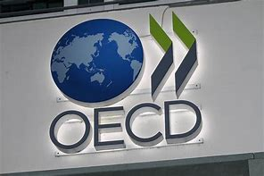
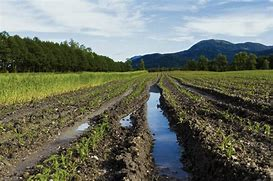

= eco 2020-05-30
:toc:

---

== Lonely planet 词汇解释

What *awaits* 等候；等待；期待,将发生在，将降临到（某人头上） tourists 游客 when they *re-emerge （在某处）又出现，再出现 from* lockdown?

Covid-19 *will change* the way people travel

May 28th 2020 | HEATHROW AND PROVENCE

MOST STRIKING *is* the absence -- of cars outside the building, of people inside it, of any activity at all. So astonished(a.)使惊讶，使大为吃惊 *was* Alaba, an Uber driver, as he *approached* （在距离或时间上）靠近，接近 Heathrow airport （英国伦敦的）希思罗机场 [on a Saturday morning in May] that he *circled* the final roundabout （交通）环岛 twice, *crying*, “This *can’t be* Heathrow.”

- roundabout : |ˈraʊndəbaʊt| (North Amercian English traffic circle, rotary) a place where two or more roads meet, forming a circle that all traffic must go around in the same direction （交通）环岛 +
image:../../+ img_单词图片/r/roundabout.jpg[100,100]

Inside an employee *stood* ready *to hand out* 分发;散发 facemasks, with no one *to give them to*. The vast 辽阔的；巨大的 check-in （机场的）登机手续办理处 hall *was* nearly deserted(a.)无人居住的；空寂无人的;被抛弃的；被遗弃的；被舍弃的. Just one lane （乡间）小路;车道 at security *was operating*. Many of the lights *were* off. The departures 离开；起程；出发 board  （机场\车场）出发时刻显示屏 *showed* six flights for the entire day.

-  check-in :  the place where you go first when you arrive at an airport, to show your ticket, etc. （机场的）登机手续办理处 +
image:../../+ img_单词图片/c/check-in.jpg[100,100]

International travel *has [all but 几乎；差不多] stopped*. Borders *are closed*. Hotels *are* empty. In April last year 6.8m passengers *passed through* Heathrow. This April just over 200,000 *did* -- fewer than a pandemic-less daily average 低于大流行程度较低时的日平均水平. Flight movements across Europe *are down* by nearly 85% (see chart 1). In America the Transportation Security Administration 美国运输安全管理局 *screened* 筛查；检查(以发现患病) 3.2m passengers in its airports last month, *down from 70m* during the same period last year 比去年同期的7000万有所下降. Some countries, such as India, *stopped* all road and rail transport, *grounded* 使停飞；阻止…起飞 all flights and *shuttered* airports. And *as* countries *creak 嘎吱作响（开门或踩上木地板等时发出的声音） open* , they *are picking and choosing* 挑拣；精挑细选 which nationalities 国籍,民族 *to allow in*. The old rules *have gone out of the window* 化为乌有；消失殆尽.

- *as* countries *creak 嘎吱作响（开门或踩上木地板等时发出的声音） open* 随着各个国家逐渐开放

- *pick and choose* : to choose only those things that you like or want very much 挑拣；精挑细选

- *fly/go out (of) the window* : (informal) to stop existing; to disappear completely 化为乌有；消失殆尽 +
-> As soon as the kids arrived, *order went out of the window*. 孩子们一到，一切就都乱了套。

And so [for many 大多数人] 2020 *will be* a year without holidays. The fear of disease *will keep people at home*. Travel *is* already a luxury. Even in rich Europe, with its generous holiday entitlements （拥有某物或做某事的）权利，资格, three in ten *cannot afford* a week’s annual holiday away from home. `主` Those who *have lost jobs* or who *are worried about recessions* 经济衰退；经济萎缩 `谓` *may cut travel* from their budgets. For those who *still dream of* foreign beaches, the biggest obstacle *will be getting anywhere* 到任何地方; 取得进展. Many restrictions -- including border closures and quarantines （为防传染的）隔离期；检疫 post-arrival 入境后的隔离 -- *are* still in place 在工作；准备就绪.

-  entitlement : n. [不可数名词] *~ (to sth)* the official right to have or do sth （拥有某物或做某事的）权利，资格 +
-> This may affect your *entitlement to compensation*.
这可能影响你索赔的权利。

- *in place* : (also into place) in the correct position; ready for sth 在正确位置；准备妥当 /working or ready to work 在工作；准备就绪 +
-> The receiver *had already clicked into place*. 听筒咔的一声放回原位了。 +
-> *All the arrangements are now in place* for their visit. 他们来访的一切都安排就绪了。

- arrival : n. [不可数名词, 可数名词] an act of coming or being brought to a place 到达；抵达 +
-> There are *120 arrivals(n.) and departures* every day.
每天有120次航班离港和抵港。

Tourism 旅游业；观光业 *is* a giant of the global economy. People *went on* 发生 1.4bn foreign trips in 2018, twice the number in 2000 (see chart 2). [In that time] a rich-country habit *became* a global one. Such *was* the scramble 争抢；抢占；争夺 *to attract* tourists, countries *started projecting(v.)展现；表现；确立（好印象） themselves as* global travel brands 品牌 (*think* Incredible India! or Epic 史诗;壮丽的;宏大的 Estonia). By the industry’s 行业 *reckoning* 据旅游业估算, `主` 330m jobs -- *from* well-paid 赚得多的;薪水高的 airline pilots *to* tour guides 导游 and dishwashers 洗碗工 *working* unseen(a.) 看不见的；无形的 in expensive resorts  旅游胜地；度假胜地 -- `谓` *depend on* travellers. Many of those *are* local; about three-quarters of all tourism 旅游业；观光业 in rich countries *is* within national borders, according to the OECD 经济合作与发展组织, a club of mostly rich countries.

- *go on* :  (usually be going on) to happen 发生 +
-> *What's going on here*? 这儿出了什么事？

- [In that time] a rich-country habit *became* a global one. 在那段时间里，富裕国家的习惯变成了全球习惯。

-  project : v. *~ (yourself)* : to present sb/sth/yourself to other people in a particular way, especially one that gives a good impression 展现；表现；确立（好印象）/~ sth (on/onto sth) 放映；投射；投影 +
-> *He projected himself as a man* worth listening to. 他装成很有见地的样子。

- dishwashers 洗碗工 *working* unseen(a.) 看不见的；无形的 in expensive resorts  旅游胜地；度假胜地.  在昂贵的度假胜地,默默无闻工作的洗碗工

- OECD : *Organization for Economic Cooperation and Development* (an organization of industrial countries that encourages trade and economic growth) 经合组织，经济合作与发展组织（工业化国家鼓励贸易和经济发展的组织） +

`主` The health of national exchequers 公共财源；国库；金库, *as well as* the shape 状况；情况;性质；特点 of sectors from restaurants to hotels and luxury goods 奢侈品 (which *are often bought* while people *are* on holiday), `谓` *will depend on* what tourism *looks like* when it *is allowed to resume* （使）重新开始;（使）继续进行. Hotels and airlines *are using* the upheaval(n.)剧变；激变；动乱；动荡 *as* an opportunity *to rework* 修改；重做；再加工 how they function. Families *are rethinking* how and where they *can safely take their holidays*. Many of the changes *will last* only until a vaccine  疫苗 for covid-19 *appears*. But some *will stick* （在某物中）卡住，陷住，动不了; 枝条；枯枝；柴火棍儿. `主` How people *start to travel* in 2020 -- or 2021 -- `谓` *will shape* how they *travel* for years thereafter 此后，在那之后.

-  shape : n. [不可数名词] the physical condition of sb/sth 状况；情况 /[不可数名词] the particular qualities or characteristics of sth 性质；特点 +
-> *What sort of shape was the car* in after the accident?
这车出过事故以后状况如何？ +
-> I like *to keep in shape* (= keep fit) . 我喜欢保持健康。 +
-> Will new technology *change the shape of broadcasting*?
新技术会改变广播的方式吗？

- resume  : (V-ERG) （使）重新开始;（使）继续进行 If you resume an activity or if it resumes, it begins again. /恢复(职位);回到（座位） +
-> After the war *he resumed his duties* at Emmanuel College... 战争过后，他重新开始了在伊曼纽尔学院的工作。

- rework :(VERB) 改进;改动;重写;改写 If you rework something such as an idea or a piece of writing, you reorganize it and make changes to it in order to improve it or bring it up to date. +
-> See if you can *rework(v.) your schedule* and come up with practical ways to reduce the number of hours you're on call. 看看能不能修改你的日程安排表，想出切实可行的办法来减少你值班的时间。 +

- Hotels and airlines *are using* the upheaval(n.)剧变；激变；动乱；动荡 *as* an opportunity *to rework* 修改；重做；再加工 how they function. +
酒店和航空公司正利用这次剧变作为契机，重新设计它们的运作方式。

- Many of the changes *will last* only until a vaccine  疫苗 for covid-19 *appears*. But some *will stick* （在某物中）卡住，陷住，动不了. +
许多变化只会持续到新冠病毒疫苗出现为止。但有些会保持下去。

[In normal times] international tourists *spend* $1.6trn each year -- more than Spain’s GDP. `主` The jobs tourism *creates* `谓` *cannot be offshored*  设在海外（尤指税制较宽松的国家）的；投放国外的；离岸的, and often *appear* in places where few other opportunities *exist*. `主` A Barcelona  巴塞罗那（西班牙东北部港市） bar *selling* sangria <西>桑格里亚酒（葡萄酒加水果和柠檬饮料或白兰地调制而成） *to* a German tourist `谓` *may not look like* an exporter 出口商, but its impact on the national accounts 国民核算账户 *is much the same* 几乎一样 *as if* it *had shipped* the bottle *north*. [In fact] 作为 *as* a source of global export revenues  财政收入；税收收入；收益, tourism *is bigger than* the food or car industries.

- sangria : |ˈsæŋgriə; sæŋˈgri:ə| [不可数名词](from Spanish) an alcoholic drink made of red wine mixed with fruit, and sometimes with lemonade or brandy added 桑格里亚酒（葡萄酒加水果和柠檬饮料或白兰地调制而成） +
image:../../+ img_单词图片/s/sangria.jpg[100,100]

The travel bug

But forecasts for 2020 *range from* the abysmal(a.)极坏的；糟透的 *to* the apocalyptic(a.)似末世的；像世界末日的. The UN World Tourism Organisation *predicts* a fall in international travel spending of $910bn-1.2trn this year. It *predicts that* arrivals 到达者；抵达物 *will tumble*(v.)（价格或数量）暴跌，骤降/（使）跌倒，摔倒，滚落，翻滚下来 by 60-80%. Of the 217 destinations 目的地；终点 the body *tracks*(v.)跟踪；追踪,跟踪（进展情况）, 72% *have closed* their borders to international tourists. Europe *will be hit especially hard*. It *receives* over half of the world’s tourists every year. Most *are due to arrive soon*. More than other tourism(n.)旅游业；观光业 hotspots, summers *are* vital 必不可少的；对…极重要的: 59% of all tourism-related receipts（企业、银行、政府等）收到的款项，收入  in Greece *are booked* （向旅馆、饭店、戏院等）预约，预订 from July to September. Tourism *is* a rare example of an industry where southern Europeans *outshine*(v.)比…做得好；使逊色；高人一筹 (and often *host*) their northern counterparts.

- abysmal : |əˈbɪzməl| a. extremely bad or of a very low standard 极坏的；糟透的 +
同义词 terrible +
=>  a（没有）+byss（底部）→没有底部→无底深渊 +
-> *our abysmal record* at producing a scientifically trained workforce... 我们在培育具有科学素养的专业人才方面惨不忍睹的记录 +
image:../../+ img_单词图片/a/abysmal.jpg[100,100]

- apocalyptic  : |əˌpɒkəˈlɪptɪk; 美 əˌpɑ:k-| a. describing very serious damage and destruction in past or future events 描述（历史）大动乱的；预示（未来）大灾变的 /like the end of the world 似末世的；像世界末日的 +
=>  apo（from）+ calyp（隐藏）+se（名词后缀）→揭示隐藏的东西→启示、天启 +
-> *an apocalyptic scene* 末世景象 +
image:../../+ img_单词图片/a/apocalyptic.jpg[100,100]

- outshine : v. (VERB) 比…更优秀；比…更出色；胜过 If you outshine someone at a particular activity, you are much better at it than they are. +
-> Jesse *has begun to outshine(v.) me* in sports.
杰西在体育方面开始超过我。 +

- Tourism *is* a rare example of an industry where southern Europeans *outshine*(v.)比…做得好；使逊色；高人一筹 (and often *host*) their northern counterparts. +
旅游业是一个罕见的例子，在这个行业中，南欧人的表现优于(并且经常做东接待)北欧同行。

Some *are taking tentative(a.)(协议、计划、安排)暂行的，临时的，试探性的;踌躇不决的;犹豫的 steps* towards reopening. Greece and Italy *hope to welcome* international tourists this summer. Regional “travel bubbles”泡沫（很可能持续不长的好景或好运） *are being considered* in parts of Europe and Oceania 大洋洲 (see Banyan). But many would-be(a.)（形容想要成为…的人）未来的 travellers *will have to 不得不 stay* in their own countries.

- tentative : (ADJ-GRADED) (协议、计划、安排)暂行的，临时的，试探性的 Tentative agreements, plans, or arrangements are not definite or certain, but have been made as a first step. +
=> tent (伸展) +at+ive (…的) →伸出去看看→尝试的，试验性的 +
-> Political leaders *have reached a tentative(a.) agreement* to hold a preparatory conference next month...
政治领导人已就下个月举行预备会议达成初步协定。

In South Korea, which *never locked down entirely*, three-quarters of all planned trips by air in April *were* domestic, *compared with* a tenth normally, *according to* Skyscanner, a price-comparison 价格比较  website. [Around the world] `主` car-rental 租车 searches(n.) `系` *are* up, too. According to Airbnb, a home-rental 家有空房出租 website, domestic bookings everywhere *have more than doubled*, to 30% of total reservations 预订；预约. Even more striking, many people *are booking properties* 不动产；房地产 within 50 miles (80km) of where they *live*. `主` *Being able to drive home* `系` *is useful* if lockdown conditions *change suddenly*.

- reservation : n. [可数名词] an arrangement for a seat on a plane or train, a room in a hotel, etc. to be kept for you 预订；预约 +
-> I'll call the restaurant and *make a reservation* .
我要给饭店打个电话预订座位。

- domestic bookings everywhere *have more than doubled*, to 30% of total reservations 预订；预约. 各地的国内预订量, 翻了一倍多，达到总预订量的30%。

-  `主` *Being able to drive home* `系` *is useful* if lockdown conditions *change suddenly*. 如果封锁情况突然发生变化，能够开车回家是很有用的。

`主` Travelling within China, which *was* the first country *to impose a lockdown* and now *appears* to have its outbreak largely under control, `系` *is returning to* something *close to normality* (see article). But even in America, which *is still reporting* more than 20,000 fresh cases every day, the first weekend of May *saw* spikes(n.)猛增；急升 in hotel occupancy(n.)（房屋、土地等的）占用，使用，居住, according to Keith Barr of IHG, a hotel group that *includes* the InterContinental and Holiday Inn chains. “The level of demand *surprised* me. I *didn’t think* anybody *would be travelling* right now,” he says. Given 考虑到 closed borders, the demand *is* all domestic.

-  Travelling within China *is returning to* something *close to normality*. 中国境内的旅行, 正逐渐恢复到接近正常的水平。

- spike : n. [可数名词, 常用单数形式](informal,especially North American English) a sudden large increase in sth 猛增；急升 /尖状物；尖头；尖刺 / （防滑）鞋钉 +
-> *a spike* in oil prices 油价的急剧上涨 +
image:../../+ img_单词图片/s/spike.jpg[100,100]

- the first weekend of May *saw* spikes(n.)猛增；急升 in hotel occupancy(n.)（房屋、土地等的）占用，使用，居住. +
5月的第一个周末, 酒店入住率也出现了激增。

[For now] European leaders 领导人, from Italy to France, *are hoping that* `主` locals who *cannot leave* `谓` *will replace* foreigners who cannot enter. That *might work*, to some extent 在某种程度上 and in some countries. But many tourist hotspots, *like* Iceland or Caribbean islands, *have* too few locals 当地人；本地人 *to replace* absent foreigners. Malta, which each year *hosts* nearly six foreign visitors for every native, *might get* a quarter of the 2.9m tourists it *attracted* last year, *reckons* Johann Buttigieg of the Malta Travel Authority -- if its borders *reopen* in time for summer. `主` Residents of countries that *export* more tourists than they receive, such as Britain, South Korea and Germany, `谓` *will struggle to squeeze* （使）挤入；挤过；塞入 onto their own beaches.

- Malta, which each year *hosts* nearly six foreign visitors for every native, *might get* a quarter of the 2.9m tourists it *attracted* last year. +
马耳他每年接待的外国游客与当地人的比例接近6：1，可能会达到去年吸引的290万游客的四分之一。

Even more “balanced” countries, like the Netherlands 荷兰, *will struggle to slot* 投放；插入；（被）塞进；（被）装入;为…安排时间（或提供机会）；安置 domestic tourists *into* the gap *left* by foreigners: `主` a pricey(a.)价格高的，昂贵的 Airbnb *overlooking* an Amsterdam canal `系` *is more appealing(a.) to* a New Yorker *than* to a stranded 使滞留，使搁浅 Rotterdammer. `主` Backpacker 背着背包徒步旅行的人 hostels, which *are* [*as*] charming(a.)令人着迷的；迷人的；吸引人的 to skint(a.) 身无分文的，穷光蛋的 foreign youngsters [*as*] they are unappealing(a.)不诱人的；无魅力的；令人不快的 to locals, `系` *are* in for a tough 艰苦的；艰难的；棘手的 spell （持续的）一段时间. `主` Camping grounds 露营场地 *attracting* relatively local caravaners 乘敞篷车旅行者，驾野营车露营者 `谓` *will do better*.

- slot : v. [+ 副词或介词短语] to put sth into a space that is available or designed for it; to fit into such a space 投放；插入；（被）塞进；（被）装入 /*slot sb/sth in* : to manage to find a position, a time or an opportunity for sb/sth 为…安排时间（或提供机会）；安置 +
-> He *slotted* a cassette *into* the VCR. 他把录像带插入录像机中。 +
-> We *slotted in some extra lessons* before the exam.
我们在考试前加了几节课。

- `主` a pricey(a.)价格高的，昂贵的 Airbnb *overlooking* an Amsterdam canal `系` *is more appealing(a.) to* a New Yorker *than* to a stranded 使滞留，使搁浅 Rotterdammer. +
俯瞰阿姆斯特丹运河、价格不菲的Airbnb, 对纽约人的吸引力，要比滞留鹿特丹的游客更大。

- skint  [skɪnt] : a. [名词前不常用](British English,informal) having no money 没钱；不名一文 +
=> 俚语，改写自 skinned,被剥皮的。引申比喻义没钱的，不足一文的。

- spell : n. [可数名词] a short period of time during which sth lasts （持续的）一段时间 +
=> 来自古英语 spell,故事，叙述，寓言，来自 Proto-Germanic*spellam,说，告知 +
-> *a spell* of warm weather 一段天气温暖的日子 +
-> She went to the doctor complaining of *dizzy spells*(n.) . 她去找医生看病，说自己一阵一阵地头昏。

- `主` Backpacker 背着背包徒步旅行的人 hostels, which *are* [*as*] charming(a.)令人着迷的；迷人的；吸引人的 to skint(a.) 身无分文的，穷光蛋的 foreign youngsters [*as*] they are unappealing(a.)不诱人的；无魅力的；令人不快的 to locals, `系` *are* in for a tough 艰苦的；艰难的；棘手的 spell （持续的）一段时间. +
背包客旅馆对外国年轻人来说很有吸引力，但对当地人来说却毫无吸引力。因此背包客旅馆现在正面临着一段艰难的时期。

- caravaner :  [kærə'vænər] 乘敞篷车旅行者，驾野营车露营者 +
=>  来源于波斯语的karwan(沙漠旅行队),17世纪用这个单词表示载乘客或货物的带蓬马车,19世纪表示三等火车厢,它的现代意义"移动住宅",始于19世纪后期。 +
image:../../+ img_单词图片/c/caravaner.jpg[100,100]

Meanwhile, urban destinations *have fallen out of favour* (特别照顾；偏袒；偏爱) 失宠;不受欢迎 -- why *go to New York* if Broadway *is closed*? Rural getaways 短假；假日休闲地；适合度假的地方 [by contrast 相比之下; 相形之下] *are* in demand. IHG’s busiest hotels *are* ones *situated 位于；坐落在 by beaches*. STR, a travel-research firm, *says* occupancy rates 房屋占用率，居住率 at some seaside(n.)（尤指人们游玩、度假的）海边，海滨 spots in America’s south *were* as high as 60%.

That *might lead to* what Brian Chesky, Airbnb’s boss, *calls* travel redistribution 重新分配: people *taking trips to* out-of-the-way 偏僻的；偏远的 places *rather than* the usual metropolises 大都会；大城市；首都；首府. Airbnb, which *can offer rooms* almost anywhere, *was already banking on 依靠；指望 a trend* 趋势,动向 for people *to move off the beaten(a.)（泥土）被踩硬的，被压实的 track* 远离闹市；偏远 and *save money* by *shunning*(v.)避开；回避；避免 tourist  旅游者；观光者；游客 hotspots. That trend *has become* turbocharged(a.)装有涡轮增压器的. Mr Chesky *says* he *used to think* it *would take* 20-30 years for travellers’ habits *to change*. Now he *thinks* it *will happen* in mere weeks or months.

- redistribute : v. to share sth out among people in a different way 重新分配 +
Wealth *needs to be redistributed* from the rich to the poor. 需要将财富从富人那里重新分给穷人。

- *bank on sb/sth* : to rely on sb/sth 依靠；指望 +
-> *I'm banking on* your help. 我还得靠你帮助呢。

- *off the beaten track* : far away from other people, houses, etc. 远离闹市；偏远 /偏僻的；人迹罕至的；荒无人烟的 A place that is *off the beaten track* is in an area where not many people live or go. +
-> They live(v.) miles *off the beaten track*. 他们住在偏远地带。

- turbocharged : [ˈtɜrboʊˌtʃɑrdʒd] adj. 装有涡轮增压器的

*Upending*(v.)翻倒；倒放；使颠倒 the world’s travel habits even for a few months *will have* long-term effects. If tourists *discover* the virtues 优点；长处；用处 of new locations, they *will want to return*.

People *are [either] 不是…就是…，…或…，要么…要么… looking for* flights(n.) far further into the future *[or]* far closer to now -- *not so much* 与其说 last-minute *as* 不如说 last-second travel, *jokes* Luca Romozzi of Sojern, a travel consultancy. `主` *Booking (and paying) later* `谓` *will change* the business model of airlines and hotels, which *have long bankrolled*(v.)资助；提供资金给 themselves with customers’ advance payments 预付款. Worse, most travel vendors 小贩；摊贩;（某种产品的）销售公司;（房屋等的）卖主 now *have to agree to* flexible cancellation terms 取消条款 if they are *to attract* any kind of custom.

- People *are [either] looking for* flights (far further into the future) [*or*] (far *closer to* now).  人们要么在寻找更遥远的未来的航班，要么在寻找更接近现在的航班。

- *not* A *so much as* B 或者 *not so much* A *as* B : *与其说A倒不如说B*”  或者 “是B,而不是A” +
-> People *are [either] 不是…就是…，…或…，要么…要么… looking for* flights(n.) far further into the future *[or]* far closer to now -- *not so much* 与其说 last-minute *as* 不如说 last-second travel. +
人们不是在寻找更遥远的未来航班，就是在寻找更接近现在的航班 ——与其说是最后一分钟的旅行，不如说是最后一秒的旅行。

- be + to do sth. 表示按计划或安排要做的事。 +
-> When *are you to leave* for home? 你什么时候回家？ +
-> She *is to be married* next month. 她将于下个月结婚。 +
-> if they are *to attract* any kind of custom. 如果他们想要吸引任何类型的客户的话。

You *can turn* this world *around* （使）翻身，转身，翻转

`主` The economics of *providing* travel services `谓` *will change* in other ways. `主` *Making things* easier to clean /and *reducing* touchpoints 接触点  `系` *will be* priorities  优先事项；最重要的事；首要事情. Hotels *are ditching* 摆脱；抛弃；丢弃 carpets 地毯 *in favour of* 赞同；支持;为获得（更好或更需要的事物） bare floors. Throw cushions *are being thrown out*. Restaurant menus *will probably become* digital or *appear* on chalkboards 黑板. Kitchens 厨房 *will offer* fewer dishes, *to simplify* the cooking process and *to avoid* wasting stocked ingredients 成分；（尤指烹饪）原料 *in case of* more enforced closures(n.)（永久的）停业，关闭；倒闭.

- ditch: v. (informal) to get rid of sth/sb because you no longer want or need it/them 摆脱；抛弃；丢弃 /使（飞机）在海上紧急降落；（在海上）迫降 /  n.  沟；渠 +
-> The new road building programme *has been ditched*.
新的道路建设计划已废弃。 +

- *in favour (of sb/sth)* : if you are in favour of sb/sth, you support and agree with them/it 赞同；支持 /in exchange for another thing (because the other thing is better or you want it more) 为获得（更好或更需要的事物） +
-> I'm *all in favour of* (= completely support) equal pay for equal work. 我完全支持同工同酬。 +
-> He abandoned teaching *in favour of a career* as a musician. 他弃教从事音乐。

Other disappearances 消失；不见 *will be* more noticeable. The buffet 自助餐;（火车）饮食柜台；（车站）快餐部 *has probably seen* its last supper 晚饭；晚餐；夜宵. Check-in （机场的）办理登机手续 *will be automated* 使自动化. “We *obviously still want to provide* a welcome, but actually printing a key *is* just a transaction （一笔）交易，业务，买卖. That’s not really a welcome,” says Arne Sorenson of Marriott, the world’s biggest hotel chain. *Expect*(v.)预料；预期；预计 mobile check-in, room keys (on phones) /and more voice-activated 声控的; 通过声音启动的 room controls.

- buffet : a meal at which people serve themselves from a table and then stand or sit somewhere else to eat 自助餐  +
image:../../+ img_单词图片/b/buffet.jpg[100,100]

Such proposals 提议；建议；动议 *are* part of an immediate reaction to the pandemic -- in-your-face （态度、表演等）赤裸裸的，富刺激性的，有意惹人发怒的;惊世骇俗的;我行我素的;特立独行的 health measures that *form* a sort of “hygiene 卫生 theatre 戏剧工作；剧作；演出；上演;战场；战区”. Countries such as Greece *are selling 推荐；推销；自荐；自我推销 themselves as* less infected by covid-19. A Portuguese minister *boasted of* its wonderful nurses （表示可能）假如，万一 *should* travellers *fall ill* there, such as the one who *tended 照料；照管；护理 to* Boris Johnson, the British prime minister.

- theatre : |ˈθɪətə(r); 美 ˈθi:ətər| [不可数名词] ( also the theatre [单数]) the work of writing, producing and acting in plays 戏剧工作；剧作；演出；上演

- in-your-face : a. (informal) used to describe an attitude, a performance, etc. that is aggressive in style and deliberately designed to make people react strongly for or against it （态度、表演等）赤裸裸的，富刺激性的，有意惹人发怒的 /Someone who has an in-your-face attitude seems determined to behave in a way that is unusual or shocking, and does not care what people think of them.

*Using* health and hygiene *as* marketing tools `系` *is* a return to old form. Richard Clarke of Bernstein, a research firm, *notes that* an ad for Holiday Inn from the 1970s *emphasised* 强调，加强语气，重读 cleanliness *as* the chain’s main selling point, *ahead of* location and comfort. It *will come to the fore* 变得重要（或突出）；起重要作用 again, to the benefit of big brands. People *may put up with* 容忍；忍受 spartan(a.)(生活条件)斯巴达式的；简朴的；清苦的 digs 租住的住所；住处 if they *know* they *have been thoroughly disinfected* 给…消毒. Marriott 万豪国际酒店集团 now *boasts of* a “Global Cleanliness Council”.

- *be/come to the fore* : (British English) (North Amercian English *be at the fore*) to be/become important and noticed by people; to play an important part 变得重要（或突出）；起重要作用 /fore : a. ad. 在（船、飞行器或动物）前部的；在头部的 +
-> She has always *been to the fore* at moments of crisis.
在危急时刻她总是挺身而出。 +
-> The problem *has come to the fore again* in recent months.
近几个月来这个问题又成为热点。

Airports *will also emphasise* hygiene. “I *think* `主` the move to minimising contact 尽量减少接触 during any travel experience `谓` *will just push us* over the edge *to having* a contactless journey,” says John Holland-Kaye, Heathrow’s chief. “Once you *get into* the terminal 航空终点站, you’ll *scan* your passport, *have* an image of your face *taken*, *drop* your bags,” and then *stroll  散步；溜达；闲逛 through* checkpoints （边防）检查站；边防关卡 *as* cameras *use* facial recognition *to open gates*.

Some of this *may sound* far-fetched(a.) 难以置信的；牵强的 不着边际, but citizens of some three dozen countries *can already use* e-gates 电子门控 *to get through* passport control [时间状 on arrival(n.) at Heathrow and many other airports], *allowing* them *to go* [from] gate [to] kerb （由条石砌成的）路缘；道牙；马路牙子 without *talking to* another person. Security *will still involve* slowing down (使)放慢;(使)减速, but even there it *should soon be possible* to leave(v.) laptops and liquids(n.) inside the bag. Automation *will reduce* the need *to touch* trays 盘；托盘；碟;（各种用途的）浅塑料盒. Hand-sanitiser 消毒杀菌剂 *is* already everywhere. Once *implemented* 使生效；贯彻；执行；实施, such changes *are unlikely to be* undone(a.)(尤指衣服)未扣；未系；松开; (尤指工作)未做的；未完成的.

-  e-gates +
image:../../+ img_单词图片/e/e-gates.jpg[100,100]

- tray : a flat piece of wood, metal or plastic with raised edges, used for carrying or holding things, especially food 盘；托盘；碟 +
image:../../+ img_单词图片/t/tray.jpg[100,100]

[By contrast] the in-flight 飞行中供应（或发生）的 experience *may change much less* in the long term. Observant 善于观察的；观察力敏锐的 travellers *will notice* tweaks(n.)（对机器、系统等的）轻微调整. In-flight magazines *will probably disappear*. Meal services *may be reduced to* bags of snacks 点心；小吃；快餐 and bottles of water [for a while 暂时,片刻、一会儿].

- snack : n. (informal) a small meal or amount of food, usually eaten in a hurry 点心；小吃；快餐 +
image:../../+ img_单词图片/s/snack.jpg[100,100]

*Stuck* in the middle with you 和你一起被困在中间

But crucial 至关重要的；关键性的 things -- such as the middle seat on airplanes -- *will not disappear*. Airlines *are clear 无疑的；清楚的；明白的 that* it *would destroy* their business model, which *requires* around two-thirds of seats *to be filled* to make a profit. “We *don’t think* it is necessary and *either* 要么...要么 we don’t fly *or* we *have to increase prices* by 45-50%, or 100% for some” airlines, says Alexandre de Juniac of the International Air Transport Association, aviation’s 航空 main trade body 贸易机构. Lower fuel costs *will help somewhat with* operational expenses 运营成本, but airlines *also have* high fixed costs 固定成本.

- We *don’t think* it is necessary and [*either*] we don’t fly [*or*] we *have to increase prices* by 45-50%, *or* 100% for some” airlines.  我们认为这是没有必要的，**要么**我们不坐飞机，**要么**我们不得不提价45-50%，或者对一些乘客加价100%.

Instead, Mr de Juniac *advocates* 拥护；支持；提倡 a globally co-ordinated 协调;调和 system of checks and safety measures *that include* health declarations 申报（单） from passengers, temperature checks(n.) at departure and arrival points, widespread 分布广的；普遍的；广泛的 use of facemasks and enhanced cleaning of aircraft. Some of these changes *will endure* and *could increase costs*. `主` *Adding* several cabin （飞机的）座舱 cleanings(n.) a day `谓` *will reduce* the number of flights (a single plane and crew *can fly*). This *is particularly harmful to* low-cost airlines, whose business models *rely on* quick turnarounds 好转；起色；转机;（轮船、飞机的）终点装卸时间;（接活到交活之间的）周转期，时限.

Not all these changes *will be* universal 普遍存在的；广泛适用的. People *have* diverse(a.)不同的；相异的；多种多样的；形形色色的 tastes, different reasons *to travel* and varying(a.)各不相同的,易变化的 appetites 食欲；胃口; 强烈欲望 for risk. Budgets also *dictate*(v.)支配；摆布；决定着事情会怎样发展 their choice of destination and activity. Americans who *might have gone to* the Caribbean *will have to make do* with Florida. Chinese luxury-shoppers *can turn to* high-end 高档的；高端的 malls at home. But Scottish sun-seekers or Saudis 沙特阿拉伯人(复数) escaping the desert summer *will want to get back* on planes. The poshest(a.)上流社会的；上等人的(最高级) travellers, who *can afford* first-class flights and private suites, *will have* less reason *to fear* disease. Places that *appeal to* a mostly 主要地；一般地；通常 younger crowd *will probably function*(v.)起作用；正常工作；运转 *[as] close to normal [as possible]* within governmental guidelines. Nobody *wants to go to* a socially distanced nightclub. 没有人愿意去社交距离较远的夜总会。

- dictate :  /dɪkˈteɪt/  v. to control or influence how sth happens 支配；摆布；决定 / *~ (sth) (to sb)* to tell sb what to do, especially in an annoying way （尤指以令人不快的方式）指使，强行规定 +
SYN determine +
=> 来自词根dict, 说，命令，词源同dictionary. +
-> It's generally your job *that dictates(v.) where you live now*. 一般说来，你住在什么地方是由你的工作决定的。 +
-> They are in no position *to dictate terms* (= tell other people what to do) . 他们没有资格发号施令。

- posh : /pɒʃ/ a. ( BrE sometimes disapproving ) typical of or used by people who belong to a high social class 上流社会的；上等人的 /elegant and expensive 优雅豪华的；富丽堂皇的 +
=> 词源不详，可能来自吉普赛语posh,半个 ，一半，来自posh-kooroona,半克朗，词源同krone,在过去算是一笔大钱，后在俚语引申词义豪华的。 +
-> They pay for their children *to go to a posh school*. 他们花钱让子女上贵族学校。 +
-> *a posh hotel* 豪华旅馆

- mostly : ad. mainly; generally 主要地；一般地；通常 +
-> The sauce *is mostly cream*. 这沙司主要是奶油。 +
-> *We're mostly out* on Sundays. 我们星期天一般不在家。

`主` Giant cruise-liners 远洋邮轮;旅游班轮 *carrying* thousands of often-old people `谓` *will take longer* to recover(v.) their appeal -- if they ever do. They *guaranteed*(v.)保证；担保；保障 a steady flow of visitors *to* islands (with few other sources of hard currency). A dozen countries *rely on* tourism *to generate* over 60% of their export income, according to the UN’s parasol （海滩上、餐馆外等处的）大遮阳伞;（旧时的）女用阳伞 counters, all of them *renowned(a.)有名的；闻名的；受尊敬的 for* their beaches. The Caribbean *has seen* a slew 大量；许多 of credit-rating  信用等级 *downgrades*(v.)使降职；使降级;贬低；降低；低估 as a result 作为……的结果,由于…的原因. If travel curbs 控制，抑制，限定，约束（不好的事物） *do not ease* before the crucial winter season, downgrades *will translate into* defaults 违约（尤指未偿付债务）.

- They *guaranteed*(v.)保证；担保；保障 a steady flow of visitors *to* islands (with few other sources of hard currency). +
他们保证了稳定的客流, 到那些几乎没有其他硬通货来源的岛屿上游玩。

- parasol : /ˈpærəsɒl/  para-保护,防 + -sol-太阳，词源同solstice,sun. +
image:../../+ img_单词图片/p/parasol.jpg[100,100]

- slew : /sluː/  n. [ sing. ] *~ of sth* ( informal ) ( especially NAmE ) a large number or amount of sth 大量；许多 +
=> 来自爱尔兰语 sluagh,军队，队伍，词源同 slogan.引申词义许多，大量。

- downgrade : v. *~ sb/sth (from sth) (to sth)* to move sb/sth down to a lower rank or level 使降职；使降级 /to make sth/sb seem less important or valuable than it/they really are 贬低；降低；低估 +
-> *She's been downgraded from principal* to vice-principal. 她已从校长降职为副校长。

Much attention *has been lavished*(v.)过分给予；滥施 in recent years *on* the problems of overtourism 过度旅游，超限旅游 for a handful of superstar cities such as Venice 威尼斯（意大利港市） and Barcelona  巴塞罗纳（西班牙）. But most destinations *have found* a happy balance between tourism and normal life. *It is* those places *that* will feel(v.) its absence hardest. As Mr Buttigieg says, *speaking* from a deserted(a.)无人居住的；空寂无人的;被抛弃的；被遗弃的；被舍弃的 Malta 马耳他（欧洲岛国）, “Nobody *realised* how important tourism was *until* it was gone.”

---

== Lonely planet

(eco 2020-5-30 / International / Travel after covid: Lonely planet )

What awaits tourists when they re-emerge from lockdown?

Covid-19 will change the way people travel

May 28th 2020 | HEATHROW AND PROVENCE

MOST STRIKING is the absence -- of cars outside the building, of people inside it, of any activity at all. So astonished was Alaba, an Uber driver, as he approached Heathrow airport on a Saturday morning in May that he circled the final roundabout twice, crying, “This can’t be Heathrow.”

Inside an employee stood ready(a.) to hand out facemasks, with no one to give them to. The vast check-in hall was nearly deserted. Just one lane at security was operating. Many of the lights were off. The departures board showed six flights for the entire day.

International travel has [all but] stopped. Borders are closed. Hotels are empty. In April last year 6.8m passengers passed through Heathrow. This April just over 200,000 did -- fewer than a pandemic-less daily average. Flight movements across Europe are down by nearly 85% (see chart 1). In America the Transportation Security Administration screened 3.2m passengers in its airports last month, down from 70m during the same period last year. Some countries, such as India, stopped all road and rail transport, grounded all flights and shuttered airports. And as countries creak open, they are picking and choosing which nationalities to allow in. The old rules have gone out of the window.

And so [for many] 2020 will be a year without holidays. The fear of disease will keep people at home. Travel is already a luxury. Even in rich Europe, with its generous holiday entitlements, three in ten cannot afford a week’s annual holiday away from home. Those who have lost jobs or who are worried about recessions may cut travel from their budgets. For those who still dream of foreign beaches, the biggest obstacle will be getting anywhere. Many restrictions -- including border closures and quarantines post-arrival -- are still in place.

Tourism is a giant of the global economy. People went on 1.4bn foreign trips in 2018, twice the number in 2000 (see chart 2). In that time a rich-country habit became a global one. Such was the scramble to attract tourists, countries started projecting themselves as global travel brands (think Incredible India! or Epic Estonia). By the industry’s reckoning, 330m jobs -- from well-paid airline pilots to tour guides and dishwashers working unseen in expensive resorts -- depend on travellers. Many of those are local; about three-quarters of all tourism in rich countries is within national borders, according to the OECD, a club of mostly rich countries.

`主` The health of national exchequers, as well as the shape of sectors from restaurants to hotels and luxury goods (which are often bought while people are on holiday), `谓` will depend on what tourism looks like when it is allowed to resume. Hotels and airlines are using the upheaval as an opportunity to rework how they function. Families are rethinking how and where they can safely take their holidays. Many of the changes will last only until a vaccine for covid-19 appears. But some will stick. How people start to travel in 2020 -- or 2021 -- will shape how they travel for years thereafter.

[In normal times] international tourists spend $1.6trn each year -- more than Spain’s GDP. The jobs tourism creates cannot be offshored, and often appear in places where few other opportunities exist. `主` A Barcelona bar selling sangria to a German tourist `谓` may not look like an exporter, but its impact on the national accounts is [much the same] as if it had shipped the bottle [north]. [In fact] as a source of global export revenues, tourism is bigger than the food or car industries.

The travel bug

But forecasts for 2020 range from the abysmal(a.) to the apocalyptic(a.). The UN World Tourism Organisation predicts a fall in international travel spending of $910bn-1.2trn this year. It predicts that arrivals will tumble by 60-80%. Of the 217 destinations (the body tracks), 72% have closed their borders to international tourists. Europe will be hit especially hard. It receives over half of the world’s tourists every year. Most are due to arrive soon. More than other tourism hotspots, summers are vital: 59% of all tourism-related receipts in Greece are booked from July to September. Tourism is a rare example of an industry where southern Europeans outshine (and often host) their northern counterparts.

Some are taking tentative(a.) steps towards reopening. Greece and Italy hope to welcome international tourists this summer. Regional “travel bubbles” are being considered in parts of Europe and Oceania (see Banyan). But many would-be travellers will have to stay in their own countries.

In South Korea, which never locked down entirely, three-quarters of all planned trips by air in April were domestic, compared with a tenth normally, according to Skyscanner, a price-comparison website. Around the world car-rental searches are up, too. According to Airbnb, a home-rental website, domestic bookings everywhere have more than doubled, to 30% of total reservations. Even more striking, many people are booking properties within 50 miles (80km) of where they live. `主` Being able to drive home `系` is useful if lockdown conditions change suddenly.

Travelling within China, which was the first country to impose a lockdown and now appears to have its outbreak largely under control, is returning to something close to normality (see article). But even in America, which is still reporting more than 20,000 fresh cases every day, the first weekend of May saw spikes in hotel occupancy, according to Keith Barr of IHG, a hotel group that includes the InterContinental and Holiday Inn chains. “The level of demand surprised me. I didn’t think anybody would be travelling right now,” he says. Given closed borders, the demand is all domestic.

[For now] European leaders, from Italy to France, are hoping that locals who cannot leave will replace foreigners who cannot enter. That might work, to some extent and in some countries. But many tourist hotspots, like Iceland or Caribbean islands, have too few locals to replace absent foreigners. Malta, which each year hosts nearly six foreign visitors for every native, might get a quarter of the 2.9m tourists it attracted last year, reckons Johann Buttigieg of the Malta Travel Authority -- if its borders reopen in time for summer. Residents of countries that export more tourists than they receive, such as Britain, South Korea and Germany, will struggle to squeeze onto their own beaches.

Even more “balanced” countries, like the Netherlands, will struggle to slot domestic tourists into the gap left by foreigners: a pricey(a.) Airbnb overlooking an Amsterdam canal is more appealing to a New Yorker than to a stranded Rotterdammer. Backpacker hostels, which are [as] charming to skint(a.) foreign youngsters [as] they are unappealing to locals, are in for a tough spell(n.). Camping grounds attracting relatively local caravaners will do better.

Meanwhile, urban destinations have fallen out of favour -- why go to New York if Broadway is closed? Rural getaways [by contrast] are in demand. IHG’s busiest hotels are ones situated by beaches. STR, a travel-research firm, says occupancy rates at some seaside spots in America’s south were as high as 60%.

That might lead to what Brian Chesky, Airbnb’s boss, calls travel redistribution: people taking trips to out-of-the-way(a.) places rather than the usual metropolises. Airbnb, which can offer rooms almost anywhere, was already banking on a trend for people to move off the beaten track and save money by shunning(v.) tourist hotspots. That trend has become turbocharged(a.). Mr Chesky says he used to think it would take 20-30 years for travellers’ habits to change. Now he thinks it will happen in mere weeks or months.

Upending the world’s travel habits even for a few months will have long-term effects. If tourists discover the virtues of new locations, they will want to return.

People are [either] looking for flights (far further into the future) [or] (far closer to now) -- not so much last-minute as last-second travel, jokes Luca Romozzi of Sojern, a travel consultancy. Booking (and paying) later will change the business model of airlines and hotels, which have long bankrolled(v.) themselves with customers’ advance payments. Worse, most travel vendors(n.) now have to agree to flexible cancellation terms if they are to attract(v.) any kind of custom.

You can turn this world around

The economics of providing travel services will change in other ways. `主` Making things easier to clean /and reducing touchpoints `系` will be priorities(n.). Hotels are ditching carpets in favour of bare floors. Throw cushions are being thrown out. Restaurant menus will probably become digital(a.) or appear on chalkboards. Kitchens will offer fewer dishes, to simplify the cooking process and to avoid wasting(v.) stocked ingredients in case of more enforced closures.

Other disappearances will be more noticeable. The buffet has probably seen its last supper. Check-in will be automated(v.). “We obviously still want to provide a welcome, but actually printing a key is just a transaction. That’s not really a welcome,” says Arne Sorenson of Marriott, the world’s biggest hotel chain. Expect(v.) mobile check-in, room keys on phones /and more voice-activated room controls.

Such proposals are part of an immediate reaction to the pandemic—in-your-face health measures that form a sort of “hygiene theatre”. Countries such as Greece are selling themselves as less infected by covid-19. A Portuguese minister boasted of its wonderful nurses should travellers fall ill there, such as the one who tended to Boris Johnson, the British prime minister.

`主` Using health and hygiene as marketing tools `系` is a return to old form. Richard Clarke of Bernstein, a research firm, notes that an ad for Holiday Inn from the 1970s emphasised cleanliness as the chain’s main selling point, ahead of location and comfort. It will come to the fore again, to the benefit of big brands. People may put up with spartan(a.) digs if they know they have been thoroughly disinfected. Marriott now boasts of a “Global Cleanliness Council”.

Airports will also emphasise hygiene. “I think the move to minimising contact during any travel experience will just push us [over the edge] to having a contactless journey,” says John Holland-Kaye, Heathrow’s chief. “Once you get into the terminal, you’ll scan your passport, have an image of your face taken, drop your bags,” and then stroll(v.) through checkpoints as cameras use facial recognition to open gates.

Some of this may sound far-fetched, but citizens of some three dozen countries can already use e-gates to get through passport control [on arrival at Heathrow and many other airports], allowing them to go from gate to kerb without talking to another person. Security will still involve slowing down, but even there it should soon be possible to leave(v.) laptops and liquids [inside the bag]. Automation will reduce the need to touch trays. Hand-sanitiser is already everywhere. Once implemented, such changes are unlikely to be undone.

[By contrast] the in-flight experience may change much less 更少 in the long term. Observant(a.) travellers will notice tweaks(n.). In-flight magazines will probably disappear. Meal services may be reduced to bags of snacks and bottles of water [for a while].

Stuck in the middle with you

But crucial things -- such as the middle seat on airplanes -- will not disappear. Airlines are clear that it would destroy their business model, which requires around two-thirds of seats to be filled to make a profit. “We don’t think it is necessary and [either] we don’t fly [or] we have to increase prices by 45-50%, or 100% for some” airlines, says Alexandre de Juniac of the International Air Transport Association, aviation’s main trade body. Lower fuel costs will help somewhat with operational expenses, but airlines also have high fixed costs.

Instead, Mr de Juniac advocates a globally co-ordinated system of checks and safety measures that include health declarations from passengers, temperature checks at departure and arrival points, widespread use of facemasks and enhanced cleaning of aircraft. Some of these changes will endure and could increase costs. Adding several cabin cleanings a day will reduce the number of flights (a single plane and crew can fly). This is particularly harmful to low-cost airlines, whose business models rely on quick turnarounds.

Not all these changes will be universal. People have diverse tastes, different reasons to travel /and varying appetites for risk. Budgets also dictate their choice of destination and activity. Americans who might have gone to the Caribbean will have to make do with Florida. Chinese luxury-shoppers can turn to high-end malls at home. But Scottish sun-seekers /or Saudis escaping the desert summer will want to get back on planes. The poshest(a.) travellers, who can afford first-class flights and private suites, will have less reason to fear disease. Places that appeal(v.) to a mostly younger crowd will probably function(v.) [as] close to normal [as possible] within governmental guidelines. Nobody wants to go to a socially distanced nightclub.

Giant cruise-liners carrying(v.) thousands of often-old people will take longer to recover their appeal -- if they ever do. They guaranteed a steady flow of visitors to islands (with few other sources of hard currency). A dozen countries rely on tourism to generate over 60% of their export income, according to the UN’s parasol counters, all of them renowned(a.) for their beaches. The Caribbean has seen a slew of credit-rating downgrades [as a result]. If travel curbs do not ease before the crucial winter season, downgrades will translate into defaults.

Much attention has been lavished in recent years on the problems of overtourism for a handful of superstar cities such as Venice and Barcelona. But most destinations have found a happy balance between tourism and normal life. It is those places that will feel(v.) its absence [hardest]. As Mr Buttigieg says, speaking from a deserted Malta, “Nobody realised how important tourism was until it was gone.”

