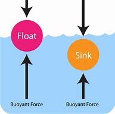

= eco 2020-05-30
:toc:

---

== Europe’s bail-outs 词汇解说

(eco 2020-05-30 / Leaders / State aid in Europe: A €2trn loophole )

Government handouts(n.)政府拨款（为促进商业活动）; 捐赠品；救济品 *threaten* Europe’s single market

The dangers of Europe’s bail-outs （经济上的）紧急援助; (常通过提供资金) 帮助…摆脱困境(复数); 把…保释出来

May 28th 2020 |

A BILLION OR two *here*, a giant government cheque *there*: `主` the money *doled(v.) out* 发放，发给（食物、钱等）；施舍 by European governments *to support* businesses `谓` *is starting to add up*. Some €2trn ($2.2trn) or so *has been earmarked* 指定…的用途；预先安排，确定（未来发生的事情） to keep(v.) firms afloat. The early beneficiaries 受益者；受惠人 *included* bakeries, bookshops and the like. Now it is increasingly the turn of corporate titans. This week France *announced* an €8bn package （必须整体接收的）一套东西，一套建议；一揽子交易 *to support* its carmakers 汽车制造商, *including* a large loan to Renault 雷诺汽车. Lufthansa 汉莎航空公司 *is negotiating* 谈判；磋商；协商 a €9bn bail-out from Germany which *may involve* the state *taking* a 20% stake 股本；股份. Now the taps 水龙头；旋塞 *are* open, more blue-chip （投资）稳妥可靠的；蓝筹的 bail-outs *are expected*.

- 汉莎航空公司正在与德国谈判一项90亿欧元的救助计划，其中可能包括政府持有20%的股份。

- dole: |dəʊl; 美 doʊl| [单数] (usually the dole) (British English,informal) money paid by the state to unemployed people 失业救济金 / *dole sth out (to sb)* :to give out an amount of food, money, etc. to a number of people in a group 发放，发给（食物、钱等）；施舍 +
=> 词源同deal, 分发，分配，发配。引申义施舍或失业救济金。

- package : ( also package deal) a set of items or ideas that must be bought or accepted together （必须整体接收的）一套东西，一套建议；一揽子交易 +
-> *a benefits package* 一套福利措施 +
-> *an aid package* 综合援助计划

- blue-chip : a. ( finance 财 ) a blue-chip investment is thought to be safe and likely to make a profit （投资）稳妥可靠的；蓝筹的 +
=> 来自于历史上赌场筹码的颜色，如果白筹值1美元，则红筹值5美元，蓝筹值25美元。 +
-> blue-chip companies 蓝筹公司 +

In normal times such state aid *is [all but] banned* by the European Union *to ensure* a level 平的；平坦的 playing field  运动场；操场 for firms across the bloc （政治利益一致的）国家组成的集团;(具有相似政治目标和利益的国家结成的) 阵营 (see article). The idea *is* to ensure(v.) that companies *thrive* on their merits 值得赞扬（或奖励、钦佩）的特点；功绩；长处, not government favours 帮助；恩惠. `主` *Restricting* state aid `谓` *frustrates*  使懊丧；使懊恼；使沮丧 politicians  政治家，政客 of a dirigiste 国家干预或统制经济的 persuasion（宗教或政治）信仰 -- there *are* lots -- but *is vital to* spare(v.)省得；免去;饶恕；赦免；放过；使逃脱 taxpayers, consumers 消费者 and competitors 双宾 the burden of a rigged （以不正当的手段）操纵，控制 market.

- 在正常情况下，欧盟几乎禁止这种国家援助，以确保整个欧盟中的公司, 有一个公平的竞争环境.

- bloc : /blɑːk/ a group of countries that work closely together because they have similar political interests （政治利益一致的）国家集团 +
=> 来自block的变体。

- favour : n. [ C ] a thing that you do to help sb 帮助；好事；恩惠 +
-> Can I ask a favour ? 请帮个忙行吗？

- dirigiste : /ˈdɪrɪʒɪst/ 国家干预或统制经济的

- persuasion : [ CU ] a particular set of beliefs, especially about religion or politics （宗教或政治）信仰 /[ U ] the act of persuading sb to do sth or to believe sth 说服；劝说 +
-> politicians *of all persuasions* 信仰各异的政治人物

- spare : v. *~ sb/yourself (from) sth* : to save sb/yourself from having to go through an unpleasant experience 省得；免去 +
-> He wanted *to spare his mother any anxiety*. 他不想让母亲有丝毫的担忧。

The rules *have been quietly shelved*(v.)搁置，停止（计划）;把…放在架子（或搁板）上 as Europe *grapples with* covid-19. *Giving* governments a temporary reprieve(n.)延缓；缓解;刑罚终止令；（尤指）死刑缓刑令 *was unavoidable* as national exchequers 公共财源；国库；金库 *battle(v.) to stave off* 暂时挡住（坏事）；延缓，推迟（某事物） depression. But it *also carries*  带有，带来（某种结果或后果）;具有（某品质或特点） long-term dangers. Even before the crisis, France and Germany *railed 怒斥；责骂；抱怨 against* European rulings (that they *say* prevented(v.) the creation of corporate champions *able to compete with* rivals from China and America). Now they *may seize the moment* to try to water down  加水冲淡（液体）；掺水稀释;缓和（说话、文章等的）语气；使变得轻描淡写 competition rules permanently.

- reprieve : v. /rɪˈpriːv/ an official order stopping a punishment, especially for a prisoner who is condemned to death 刑罚终止令；（尤指）死刑缓刑令 /a delay before sth bad happens 延缓；缓解 +
=> 来 自 拉 丁语 reprehendere,抓回，来自 re-,向后，往回，prehendere,抓住，词源同 prison,reprehensible.其原 义为抓回监狱，送回监狱，后引申词义延缓死刑。拼写可能受-eve 影响。 +
-> Campaigners *have won a reprieve* for the hospital threatened with closure. 活动家们为这家受关闭威胁的医院赢得了喘息的机会。

- stave :  /steɪv/  a strong stick or pole 棍；棒；木柱 / *stave sth off* : to prevent sth bad from affecting you for a period of time; to delay sth 暂时挡住（坏事）；延缓，推迟（某事物） +
-> to stave off hunger 暂时解饿

- carry : v. [ VN ] to have sth as a result 带有，带来（某种结果或后果） +
-> Crimes of violence *carry(v.) heavy penalties*. 暴力犯罪要受到严惩。 +
-> Being a combat sport, karate *carries(v.) with it the risk of injury*. 作为一项格斗运动，空手道有受伤的风险。

- rail : n. [ C ] a wooden or metal bar placed around sth as a barrier or to provide support 栏杆；扶手；围栏 / v. [ also V speech ]  *~ (at/against sth/sb)* ( formal ) to complain about sth/sb in a very angry way 怒斥；责骂；抱怨 +
=> 来自拉丁词根reg“保持直”，同源词如regular（有规律的）。用其简单同源词rule（规则）助记。体会“轨道”和“规则”的内在联系：轨道规范了火车的前进轨迹，规则规范了社会的运行方向；火车离了轨道就脱轨（derail），正如社会离了规则就混乱。体会二者音似。 +

*It is not hard to see* the harm that free-flowing 能自由流动的；自由流畅的 state money *could do*. Germany *represents* 等于；相当于；意味着 a quarter of the bloc’s （政治利益一致的）国家集团 GDP but nearly half of its state aid, because its buoyant(a.)漂浮的；能够漂起的；有浮力的;看涨的；保持高价的；繁荣的;愉快而充满信心的；乐观的 public finances *allow* it *to be* generous. Tough luck 坏运气；真不走运 if you are a company in Spain or Italy where tighter budgets *mean* smaller handouts   捐赠品；救济品;政府拨款（为促进商业活动）. Politicians usually *favour* certain companies -- famous flag-carriers *instead of* scrappy 散乱的；不连贯的；支离破碎的;不整洁的；糟糕的 low-cost airlines, say 比如. And the bail-outs (常通过提供资金) 帮助…摆脱困境 *invariably 始终如一地；一贯地 come with* nationalist strings 特定条件（或限制）. Renault 法国雷诺公司 and other French carmakers *are promising* to keep(v.) production and research in France (see article). Once the state *becomes* a shareholder or creditor 债权人；债主；贷方, bosses *know* their firm’s prospects *partly depend on* a willingness *to please* their political masters 主宰；主人；有控制力的人.

- represent : v. [ V-N ] ( not used in the progressive tenses 不用于进行时 ) to be sth 等于；相当于；意味着 +
SYN constitute +
-> This contract *represents 20% of the company's annual revenue*. 这份合约相当于公司20%的年收入。 +
-> This decision *represents* a significant departure from previous policy. 这个决定意味着在很大程度上脱离了原先的政策。

- buoyant :  /ˈbɔɪənt,ˈbuːjənt/  a. ( of prices, business activity, etc. 价格、商业活动等 ) tending to increase or stay at a high level, usually showing financial success 看涨的；保持高价的；繁荣的 +
-> a buoyant economy/market 繁荣的经济╱市场 +
-> *buoyant sales/prices* 上升的销售额╱价格 +

- scrappy : a. consisting of individual sections, events, etc. that are not organized into a whole 散乱的；不连贯的；支离破碎的 /( especially BrE ) not tidy and often of poor quality 不整洁的；糟糕的 +
-> *a scrappy essay* 一篇内容凌乱的文章 +
-> The note was written on *a scrappy bit of paper*. 便条写在一片破纸上。 +
image:../../+ img_单词图片/s/scrappy.jpg[100,100]

-  strings  : [ pl. ] special conditions or restrictions 特定条件（或限制） +
-> Major loans like these *always come with strings*. 诸如此类的大宗贷款总有一些附带条件。

*How to ensure that* the necessary evil of bail-outs *does not cripple*  严重毁坏（或损害）;使残废；使跛；使成瘸子 the single market? They *should be tolerated* only when all other options *have been exhausted*. In America even cruise-liners 远洋邮轮 -- a challenged business model if ever there was one -- *have raised bonds* 债券；公债 and *found* new shareholders. Europe *has* shallower capital markets, but plenty of investors *with money to spend*.

The risks of an uneven(a.)不均衡的；不公平的；不规则的 playing field *will ease* if bail-out money *is distributed* evenly 平均地；均等地 around the EU. On May 27th the European Commission *unveiled* （首次）展示，介绍，推出；将…公之于众;为…揭幕；揭开…上的覆盖物；拉开…的帷幔 a €750bn plan *to offer* grants （政府、机构的）拨款 and loans from mainly rich countries *to* mainly poor ones. Though there *is* much haggling 讨价还价，争论 *left to be done*, this proposal 提议；建议；动议 *heads(v.) in the right direction*.

Most important, all bail-outs *need to be carefully policed*  监督；管制. This *means*(v.) *ensuring that* companies *are not using* public cash *to run* large losses /or *to pay for* their expansion plans 扩张计划 *once* the economy *opens up*. Governments *may have to take shares* in firms *in order to safeguard* taxpayers’ financial interests. But there *should be* rigorous 严格的；严厉的 enforcement of rules that *encourage* firms *to repay(v.)归还；偿还；清偿 loans* and *buy back* government stakes 股本；股份 *quickly* by *banning them from* paying(v.) dividends 红利；股息；股利 and bonuses. Bail-outs *are taking place* 尤指根据安排或计划）发生，进行 everywhere. But in Europe they are especially dangerous, because they *can undermine* 渐削弱（信心、权威等）；使逐步减少效力;从根基处破坏；挖…的墙脚 economic integration 结合；整合；一体化 and *encourage* politicians’ inexhaustible 用之不竭的；无穷无尽的 appetite *to meddle* 管闲事；干涉；干预 in industry. *Creating* a giant, open and competitive market *has been* one of Europe’s great achievements. [In the rush *to help business*] it *must not be eroded*.

- 最重要的是，所有的纾困都需要谨慎监管。这意味着，一旦经济开放，要确保企业不会利用公共资金, 来进行大规模亏损, 或为其扩张计划买单。为了保护纳税人的经济利益，政府可能不得不持有公司的股份。但是应该严格执行规定，禁止企业支付股息和奖金，以鼓励企业迅速偿还贷款, 和回购政府股份。救市行动到处都在进行。但在欧洲，它们尤其危险，因为它们会破坏经济一体化，鼓励政客们没完没了地干预工业。创造一个巨大的、开放的、竞争的市场是欧洲的伟大成就之一。在匆忙帮助商业发展的过程中，要保证它不能被侵蚀。

---

== Europe’s bail-outs

Government handouts threaten Europe’s single market

The dangers of Europe’s bail-outs

May 28th 2020 |

A BILLION OR two here, a giant government cheque there: the money doled out by European governments to support businesses is starting to add up. Some €2trn ($2.2trn) or so has been earmarked to keep firms afloat. The early beneficiaries included bakeries, bookshops and the like. Now it is increasingly the turn of corporate titans. This week France announced an €8bn package to support its carmakers, including a large loan to Renault. Lufthansa is negotiating a €9bn bail-out from Germany which may involve the state taking a 20% stake. Now the taps are open, more blue-chip bail-outs are expected.

In normal times such state aid is all but banned by the European Union to ensure a level playing field for firms across the bloc (see article). The idea is to ensure that companies thrive on their merits, not government favours. Restricting state aid frustrates politicians of a dirigiste persuasion -- there are lots -- but is vital to spare taxpayers, consumers and competitors the burden of a rigged market.

The rules have been quietly shelved as Europe grapples with covid-19. Giving governments a temporary reprieve was unavoidable as national exchequers battle to stave off depression. But it also carries long-term dangers. Even before the crisis, France and Germany railed against European rulings that they say prevented the creation of corporate champions able to compete with rivals from China and America. Now they may seize the moment to try to water down competition rules permanently.

It is not hard to see the harm that free-flowing state money could do. Germany represents a quarter of the bloc’s GDP but nearly half of its state aid, because its buoyant public finances allow it to be generous. Tough luck if you are a company in Spain or Italy where tighter budgets mean smaller handouts. Politicians usually favour certain companies -- famous flag-carriers instead of scrappy low-cost airlines, say. And the bail-outs invariably come with nationalist strings. Renault and other French carmakers are promising to keep production and research in France (see article). Once the state becomes a shareholder or creditor, bosses know their firm’s prospects partly depend on a willingness to please their political masters.

How to ensure that the necessary evil of bail-outs does not cripple the single market? They should be tolerated only when all other options have been exhausted. In America even cruise-liners -- a challenged business model if ever there was one -- have raised bonds and found new shareholders. Europe has shallower capital markets, but plenty of investors with money to spend.

The risks of an uneven playing field will ease if bail-out money is distributed evenly around the EU. On May 27th the European Commission unveiled a €750bn plan to offer grants and loans from mainly rich countries to mainly poor ones. Though there is much haggling left to be done, this proposal heads in the right direction.

Most important, all bail-outs need to be carefully policed. This means ensuring that companies are not using public cash to run large losses or to pay for their expansion plans once the economy opens up. Governments may have to take shares in firms in order to safeguard taxpayers’ financial interests. But there should be rigorous enforcement of rules that encourage firms to repay loans and buy back government stakes quickly by banning them from paying dividends and bonuses. Bail-outs are taking place everywhere. But in Europe they are especially dangerous, because they can undermine economic integration and encourage politicians’ inexhaustible appetite to meddle in industry. Creating a giant, open and competitive market has been one of Europe’s great achievements. In the rush to help business it must not be eroded.

